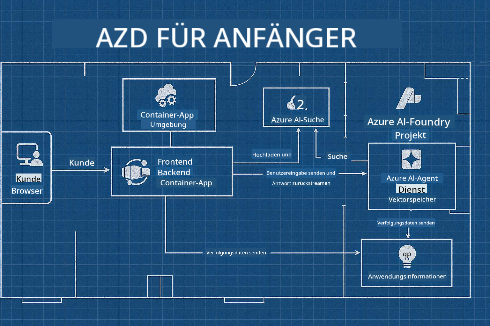

<!--
CO_OP_TRANSLATOR_METADATA:
{
  "original_hash": "245d24997bbcf2bae93bb2a503845d37",
  "translation_date": "2025-09-23T11:41:05+00:00",
  "source_file": "workshop/README.md",
  "language_code": "de"
}
-->
# AZD für KI-Entwickler Workshop

## AZD-Vorlagen

Eine KI-Anwendungslösung in Unternehmensqualität für Ihr spezifisches Szenario zu erstellen, ist vergleichbar mit dem Bau eines eigenen Hauses. Sie können es selbst entwerfen, Stein für Stein bauen und die Verantwortung dafür übernehmen, dass es alle Governance- und Entwicklungsrichtlinien erfüllt.

**ODER ....**

Sie können mit einem Architekten zusammenarbeiten, der Ihnen einen _Bauplan_ für ein Starterhaus gibt und dann mit Ihnen zusammenarbeitet, um es _anzupassen_, damit es Ihren Bedürfnissen entspricht. So können Sie sich darauf konzentrieren, was **Ihr Zuhause** besonders macht, während die grundlegende Verkabelung, Sanitärinstallation und andere Abhängigkeiten von Experten für Sie erledigt werden.

**Das ist der Ansatz hinter [AI App Templates](https://ai.azure.com/templates)** – eine Reihe von Bauplänen für den Bau verschiedener Arten von KI-Anwendungs-"Häusern", je nachdem, was Ihre Kernbedürfnisse und Abhängigkeiten sind.

## Anpassung der Vorlagen

Die Vorlagen sind so konzipiert, dass sie mit [Azure AI Foundry](https://ai.azure.com) funktionieren. Stellen Sie sich diese Plattform als Ihren "Bauunternehmer" vor, der Zugriff auf alle Ressourcen, Werkzeuge und Fachkenntnisse hat, die Sie benötigen, um die Arbeit zu erledigen!

Alles, was Sie tun müssen, ist, [Ihre Startervorlagen](https://learn.microsoft.com/en-us/azure/ai-foundry/how-to/develop/ai-template-get-started) auszuwählen. Zum Beispiel konzentrieren wir uns auf die Vorlage _Get Started with AI Agents_, um Ihnen ein "Agentisches KI-Haus" zu bauen, das mit Funktionen wie KI-Suche, Red Teaming, Evaluierungen, Tracing, Monitoring und mehr ausgestattet ist!



Alles, was Sie brauchen, ist, Zeit mit dem Architekten zu buchen, der Sie durch den Anpassungsprozess führt. [GitHub Copilot for Azure](https://learn.microsoft.com/en-us/azure/developer/github-copilot-azure/get-started) kann dieser Leitfaden sein. Einfach "mit ihm chatten", um:

- Mehr über die Azure-Funktionen in Ihrer Vorlage zu erfahren
- Azure-Ressourcen bereitzustellen
- Informationen über Ihre Bereitstellung zu erhalten
- Probleme zu diagnostizieren und zu beheben!

In diesem Workshop lernen wir, wie man die bestehende Vorlage _dekomponiert_ (um zu verstehen, was sie bietet) und sie dann _anpasst_ (um unsere Anforderungen zu erfüllen) – Schritt für Schritt.

KI-Vorlagen sorgen dafür, dass es funktioniert – durch den Abschluss des Workshops lernen Sie, wie Sie es **zu Ihrem eigenen machen**.

----

**Workshop-Navigation**
- **📚 Kursübersicht**: [AZD für Einsteiger](../README.md)
- **📖 Verwandte Kapitel**: Behandelt [Kapitel 1](../README.md#-chapter-1-foundation--quick-start), [Kapitel 2](../README.md#-chapter-2-ai-first-development-recommended-for-ai-developers) und [Kapitel 5](../README.md#-chapter-5-multi-agent-ai-solutions-advanced)
- **🛠️ Praktische Übung**: [KI-Workshop-Labor](../docs/ai-foundry/ai-workshop-lab.md)
- **🚀 Nächste Schritte**: [Workshop-Labormodule](../../../workshop)

Willkommen zum praktischen Workshop, um die Azure Developer CLI (AZD) mit Schwerpunkt auf der Bereitstellung von KI-Anwendungen zu erlernen. Dieser Workshop soll Sie von den AZD-Grundlagen bis hin zur Bereitstellung produktionsreifer KI-Lösungen führen.

## Workshop-Übersicht

**Dauer:** 2-3 Stunden  
**Level:** Anfänger bis Fortgeschrittene  
**Voraussetzungen:** Grundkenntnisse in Azure, Kommandozeilen-Tools und KI-Konzepten

### Was Sie lernen werden

- **AZD-Grundlagen**: Infrastruktur als Code mit AZD verstehen
- 🤖 **Integration von KI-Diensten**: Azure OpenAI, KI-Suche und andere KI-Dienste bereitstellen
- **Container-Bereitstellung**: Azure Container Apps für KI-Anwendungen nutzen
- **Sicherheits-Best-Practices**: Managed Identity und sichere Konfigurationen implementieren
- **Überwachung & Beobachtbarkeit**: Application Insights für KI-Workloads einrichten
- **Produktionsmuster**: Unternehmensgerechte Bereitstellungsstrategien

## Workshop-Struktur

### Modul 1: AZD-Grundlagen (30 Minuten)
- Installation und Konfiguration von AZD
- AZD-Projektstruktur verstehen
- Ihre erste AZD-Bereitstellung
- **Labor**: Eine einfache Webanwendung bereitstellen

### Modul 2: Azure OpenAI-Integration (45 Minuten)
- Azure OpenAI-Ressourcen einrichten
- Modellbereitstellungsstrategien
- API-Zugriff und Authentifizierung konfigurieren
- **Labor**: Eine Chat-Anwendung mit GPT-4 bereitstellen

### Modul 3: RAG-Anwendungen (45 Minuten)
- Integration der Azure KI-Suche
- Dokumentenverarbeitung mit Azure Document Intelligence
- Vektor-Einbettungen und semantische Suche
- **Labor**: Ein Dokumenten-Q&A-System erstellen

### Modul 4: Produktionsbereitstellung (30 Minuten)
- Konfiguration von Container-Apps
- Skalierung und Leistungsoptimierung
- Überwachung und Protokollierung
- **Labor**: Bereitstellung in der Produktion mit Beobachtbarkeit

### Modul 5: Fortgeschrittene Muster (15 Minuten)
- Bereitstellungen in mehreren Umgebungen
- CI/CD-Integration
- Kostenoptimierungsstrategien
- **Abschluss**: Produktionsbereitschafts-Checkliste

## Voraussetzungen

### Erforderliche Tools

Bitte installieren Sie diese Tools vor dem Workshop:

```bash
# Azure Developer CLI
curl -fsSL https://aka.ms/install-azd.sh | bash

# Azure CLI
curl -sL https://aka.ms/InstallAzureCLIDeb | sudo bash

# Git
sudo apt-get install git

# Docker
curl -fsSL https://get.docker.com -o get-docker.sh
sudo sh get-docker.sh

# Python 3.10+
sudo apt-get install python3.10 python3.10-venv python3-pip
```

### Azure-Konto einrichten

1. **Azure-Abonnement**: [Kostenlos registrieren](https://azure.microsoft.com/free/)  
2. **Azure OpenAI-Zugriff**: [Zugriff beantragen](https://aka.ms/oai/access)  
3. **Erforderliche Berechtigungen**:
   - Rolle "Mitwirkender" im Abonnement oder in der Ressourcengruppe
   - Benutzerzugriffsadministrator (für RBAC-Zuweisungen)

### Voraussetzungen überprüfen

Führen Sie dieses Skript aus, um Ihre Einrichtung zu überprüfen:

```bash
#!/bin/bash
echo "Verifying workshop prerequisites..."

# Check AZD installation
if command -v azd &> /dev/null; then
    echo "✅ Azure Developer CLI: $(azd --version)"
else
    echo "❌ Azure Developer CLI not found"
fi

# Check Azure CLI
if command -v az &> /dev/null; then
    echo "✅ Azure CLI: $(az --version | head -n1)"
else
    echo "❌ Azure CLI not found"
fi

# Check Docker
if command -v docker &> /dev/null; then
    echo "✅ Docker: $(docker --version)"
else
    echo "❌ Docker not found"
fi

# Check Python
if command -v python3 &> /dev/null; then
    echo "✅ Python: $(python3 --version)"
else
    echo "❌ Python 3 not found"
fi

# Check Azure login
if az account show &> /dev/null; then
    echo "✅ Azure: Logged in as $(az account show --query user.name -o tsv)"
else
    echo "❌ Azure: Not logged in (run 'az login')"
fi

echo "Setup verification complete!"
```

## Workshop-Materialien

### Laborübungen

Jedes Modul enthält praktische Übungen mit Startercode und Schritt-für-Schritt-Anleitungen:

- **[lab-1-azd-basics/](../../../workshop/lab-1-azd-basics)** - Ihre erste AZD-Bereitstellung
- **[lab-2-openai-chat/](../../../workshop/lab-2-openai-chat)** - Chat-Anwendung mit Azure OpenAI
- **[lab-3-rag-search/](../../../workshop/lab-3-rag-search)** - RAG-Anwendung mit KI-Suche
- **[lab-4-production/](../../../workshop/lab-4-production)** - Produktionsbereitstellungsmuster
- **[lab-5-advanced/](../../../workshop/lab-5-advanced)** - Fortgeschrittene Bereitstellungsszenarien

### Referenzmaterialien

- **[AI Foundry-Integrationsleitfaden](../docs/ai-foundry/azure-ai-foundry-integration.md)** - Umfassende Integrationsmuster
- **[Leitfaden zur Modellbereitstellung](../docs/ai-foundry/ai-model-deployment.md)** - Best Practices für die Modellbereitstellung
- **[Produktions-KI-Praktiken](../docs/ai-foundry/production-ai-practices.md)** - Unternehmensgerechte Bereitstellungsmuster
- **[KI-Fehlerbehebungsleitfaden](../docs/troubleshooting/ai-troubleshooting.md)** - Häufige Probleme und Lösungen

### Beispielvorlagen

Schnellstartvorlagen für gängige KI-Szenarien:

```
workshop/templates/
├── minimal-chat/          # Basic OpenAI chat app
├── rag-application/       # RAG with AI Search
├── multi-model/          # Multiple AI services
└── production-ready/     # Enterprise template
```

## Erste Schritte

### Option 1: GitHub Codespaces (Empfohlen)

Der schnellste Weg, um den Workshop zu starten:

[](https://github.com/codespaces/new?hide_repo_select=true&ref=main&repo=YOUR_REPO_ID)

### Option 2: Lokale Entwicklung

1. **Klonen Sie das Workshop-Repository:**
```bash
git clone https://github.com/YOUR_ORG/AZD-for-beginners.git
cd AZD-for-beginners/workshop
```

2. **Melden Sie sich bei Azure an:**
```bash
az login
azd auth login
```

3. **Starten Sie mit Labor 1:**
```bash
cd lab-1-azd-basics
cat README.md  # Follow the instructions
```

### Option 3: Workshop mit Anleitung

Wenn Sie an einer geführten Sitzung teilnehmen:

- 🎥 **Workshop-Aufzeichnung**: [Auf Abruf verfügbar](https://aka.ms/azd-ai-workshop)  
- 💬 **Discord-Community**: [Treten Sie für Live-Support bei](https://aka.ms/foundry/discord)  
- **Workshop-Feedback**: [Teilen Sie Ihre Erfahrungen](https://aka.ms/azd-workshop-feedback)

## Workshop-Zeitplan

### Selbstgesteuertes Lernen (3 Stunden)

```
⏰ 00:00 - 00:30  Module 1: AZD Foundations
⏰ 00:30 - 01:15  Module 2: Azure OpenAI Integration
⏰ 01:15 - 02:00  Module 3: RAG Applications
⏰ 02:00 - 02:30  Module 4: Production Deployment
⏰ 02:30 - 02:45  Module 5: Advanced Patterns
⏰ 02:45 - 03:00  Q&A and Next Steps
```

### Geführte Sitzung (2,5 Stunden)

```
⏰ 00:00 - 00:15  Welcome & Prerequisites Check
⏰ 00:15 - 00:40  Module 1: Live Demo + Lab
⏰ 00:40 - 01:20  Module 2: OpenAI Integration
⏰ 01:20 - 01:30  Break
⏰ 01:30 - 02:10  Module 3: RAG Applications
⏰ 02:10 - 02:30  Module 4: Production Patterns
⏰ 02:30 - 02:45  Module 5: Advanced Topics
⏰ 02:45 - 03:00  Q&A and Resources
```

## Erfolgskriterien

Am Ende dieses Workshops werden Sie in der Lage sein:

✅ **KI-Anwendungen bereitzustellen** mit AZD-Vorlagen  
✅ **Azure OpenAI-Dienste zu konfigurieren** mit angemessener Sicherheit  
✅ **RAG-Anwendungen zu erstellen** mit Azure KI-Suche-Integration  
✅ **Produktionsmuster zu implementieren** für Unternehmens-KI-Workloads  
✅ **KI-Anwendungsbereitstellungen zu überwachen und zu beheben**  
✅ **Kostenoptimierungsstrategien anzuwenden** für KI-Workloads  

## Community & Support

### Während des Workshops

- 🙋 **Fragen**: Nutzen Sie den Workshop-Chat oder heben Sie die Hand  
- 🐛 **Probleme**: Sehen Sie im [Fehlerbehebungsleitfaden](../docs/troubleshooting/ai-troubleshooting.md) nach  
- **Tipps**: Teilen Sie Entdeckungen mit anderen Teilnehmern  

### Nach dem Workshop

- 💬 **Discord**: [Azure AI Foundry Community](https://aka.ms/foundry/discord)  
- **GitHub-Issues**: [Vorlagenprobleme melden](https://github.com/YOUR_ORG/AZD-for-beginners/issues)  
- 📧 **Feedback**: [Workshop-Bewertungsformular](https://aka.ms/azd-workshop-feedback)  

## Nächste Schritte

### Weiterlernen

1. **Fortgeschrittene Szenarien**: Erkunden Sie [Bereitstellungen in mehreren Regionen](../docs/ai-foundry/production-ai-practices.md#multi-region-deployment)  
2. **CI/CD-Integration**: Richten Sie [GitHub Actions-Workflows](../docs/deployment/github-actions.md) ein  
3. **Eigene Vorlagen**: Erstellen Sie Ihre eigenen [AZD-Vorlagen](../docs/getting-started/custom-templates.md)  

### In Ihren Projekten anwenden

1. **Bewertung**: Nutzen Sie unsere [Bereitschafts-Checkliste](./production-readiness-checklist.md)  
2. **Vorlagen**: Starten Sie mit unseren [KI-spezifischen Vorlagen](../../../workshop/templates)  
3. **Support**: Treten Sie dem [Azure AI Foundry Discord](https://aka.ms/foundry/discord) bei  

### Teilen Sie Ihren Erfolg

- ⭐ **Markieren Sie das Repository mit einem Stern**, wenn dieser Workshop Ihnen geholfen hat  
- 🐦 **Teilen Sie es in sozialen Medien** mit #AzureDeveloperCLI #AzureAI  
- 📝 **Schreiben Sie einen Blogbeitrag** über Ihre KI-Bereitstellungsreise  

---

## Workshop-Feedback

Ihr Feedback hilft uns, die Workshop-Erfahrung zu verbessern:

| Aspekt | Bewertung (1-5) | Kommentare |
|--------|------------------|-----------|
| Qualität der Inhalte | ⭐⭐⭐⭐⭐ | |
| Praktische Übungen | ⭐⭐⭐⭐⭐ | |
| Dokumentation | ⭐⭐⭐⭐⭐ | |
| Schwierigkeitsgrad | ⭐⭐⭐⭐⭐ | |
| Gesamterfahrung | ⭐⭐⭐⭐⭐ | |

**Feedback einreichen**: [Workshop-Bewertungsformular](https://aka.ms/azd-workshop-feedback)

---

**Vorher:** [KI-Fehlerbehebungsleitfaden](../docs/troubleshooting/ai-troubleshooting.md) | **Weiter:** Beginnen Sie mit [Labor 1: AZD-Grundlagen](../../../workshop/lab-1-azd-basics)

**Bereit, KI-Anwendungen mit AZD zu erstellen?**

[Beginnen Sie mit Labor 1: AZD-Grundlagen →](./lab-1-azd-basics/README.md)

---

