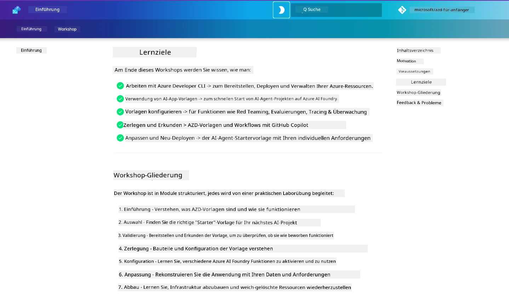

<div align="center">
  <div style="background: linear-gradient(135deg, #0078d4, #106ebe); border-radius: 10px; padding: 20px; margin: 20px 0; box-shadow: 0 4px 15px rgba(0, 120, 212, 0.3); border: 2px solid #005a9e;">
    <h2 style="color: white; margin: 0; font-size: 24px; text-shadow: 1px 1px 2px rgba(0,0,0,0.3);">
      🎯 AZD für AI-Entwickler Workshop
    </h2>
    <p style="color: white; margin: 10px 0 0 0; font-size: 16px; text-shadow: 1px 1px 2px rgba(0,0,0,0.3);">
      <strong>Ein praxisorientierter Workshop zum Erstellen von AI-Anwendungen mit der Azure Developer CLI.</strong><br>
      Schließen Sie 7 Module ab, um AZD-Vorlagen und AI-Bereitstellungs-Workflows zu meistern.
    </p>
    <div style="margin-top: 15px;">
      <span style="background: rgba(255,255,255,0.2); padding: 5px 10px; border-radius: 15px; color: white; font-size: 14px;">
        📅 Zuletzt aktualisiert: März 2026
      </span>
    </div>
  </div>
</div>

# AZD für AI-Entwickler Workshop

Willkommen zum praxisorientierten Workshop zum Erlernen der Azure Developer CLI (AZD) mit Schwerpunkt auf der Bereitstellung von AI-Anwendungen. Dieser Workshop hilft Ihnen, ein anwendungsorientiertes Verständnis für AZD-Vorlagen in 3 Schritten zu erlangen:

1. **Discovery** - finden Sie die Vorlage, die zu Ihnen passt.
1. **Deployment** - bereitstellen und validieren, dass sie funktioniert
1. **Customization** - ändern und iterieren, um sie anzupassen!

Im Verlauf dieses Workshops werden Sie zudem in wichtige Entwicklerwerkzeuge und -workflows eingeführt, die Ihnen helfen, Ihre End-to-End-Entwicklungsreise zu optimieren.

<br/>

## Browser-Based Guide

Die Workshop-Lektionen sind in Markdown. Sie können direkt in GitHub durch sie navigieren — oder eine browserbasierte Vorschau starten, wie im Screenshot unten gezeigt.



Um diese Option zu nutzen - fork-en Sie das Repository in Ihr Profil und starten Sie GitHub Codespaces. Sobald das VS Code-Terminal aktiv ist, geben Sie diesen Befehl ein:

This browser preview works in GitHub Codespaces, dev containers, or a local clone with Python and MkDocs installed.

```bash title="" linenums="0"
mkdocs serve > /dev/null 2>&1 &
```

In a few seconds, you will see a pop-up dialog. Select the option to `Open in browser`. The web-based guide will now open in a new browser tab. Some benefits of this preview:

1. **Built-in search** - find keywords or lessons quickly.
1. **Copy icon** - hover over codeblocks to see this option
1. **Theme toggle** - switch between dark and light themes
1. **Get help** - click the Discord icon in footer to join!

<br/>

## Workshop Overview

**Dauer:** 3-4 Stunden  
**Niveau:** Anfänger bis Mittelstufe  
**Voraussetzungen:** Vertrautheit mit Azure, AI-Konzepten, VS Code & Kommandozeilenwerkzeugen.

Dies ist ein praxisorientierter Workshop, bei dem Sie durch aktives Tun lernen. Nachdem Sie die Übungen abgeschlossen haben, empfehlen wir, das AZD For Beginners Curriculum zu prüfen, um Ihre Lernreise in Richtung Sicherheit und Produktivitäts-Best-Practices fortzusetzen.

| Time| Module  | Objective |
|:---|:---|:---|
| 15 mins | [Einführung](docs/instructions/0-Introduction.md) | Die Ausgangslage klären, die Ziele verstehen |
| 30 mins | [AI-Vorlage auswählen](docs/instructions/1-Select-AI-Template.md) | Optionen erkunden und einen Starter auswählen | 
| 30 mins | [AI-Vorlage validieren](docs/instructions/2-Validate-AI-Template.md) | Standardlösung in Azure bereitstellen |
| 30 mins | [AI-Vorlage zerlegen](docs/instructions/3-Deconstruct-AI-Template.md) | Struktur und Konfiguration erkunden |
| 30 mins | [AI-Vorlage konfigurieren](docs/instructions/4-Configure-AI-Template.md) | Verfügbare Funktionen aktivieren und testen |
| 30 mins | [AI-Vorlage anpassen](docs/instructions/5-Customize-AI-Template.md) | Die Vorlage an Ihre Bedürfnisse anpassen |
| 30 mins | [Infrastruktur abbauen](docs/instructions/6-Teardown-Infrastructure.md) | Aufräumen und Ressourcen freigeben |
| 15 mins | [Abschluss & nächste Schritte](docs/instructions/7-Wrap-up.md) | Lernressourcen, Workshop-Challenge |

<br/>

## What You'll Learn

Betrachten Sie die AZD-Vorlage als eine Lern-Sandbox, um verschiedene Fähigkeiten und Werkzeuge für die End-to-End-Entwicklung auf Microsoft Foundry zu erkunden. Am Ende dieses Workshops sollten Sie ein intuitives Verständnis für verschiedene Tools und Konzepte in diesem Kontext haben.

| Concept  | Objective |
|:---|:---|
| **Azure Developer CLI** | Toolbefehle und Workflows verstehen |
| **AZD Templates**| Projektstruktur und Konfiguration verstehen |
| **Azure AI Agent**| Microsoft Foundry-Projekt bereitstellen & deployen  |
| **Azure AI Search**| Kontext-Engineering mit Agenten ermöglichen |
| **Observability**| Tracing, Monitoring und Evaluierungen erkunden |
| **Red Teaming**| Adversarial Testing und Gegenmaßnahmen erkunden |

<br/>

## Workshop Structure

Der Workshop ist so aufgebaut, dass Sie von der Vorlagensuche über Bereitstellung und Zerlegung bis hin zur Anpassung geführt werden - unter Verwendung der offiziellen [Getting Started with AI Agents](https://github.com/Azure-Samples/get-started-with-ai-agents) Starter-Vorlage als Basis.

### [Modul 1: AI-Vorlage auswählen](docs/instructions/1-Select-AI-Template.md) (30 mins)

- Was sind AI-Vorlagen?
- Wo finde ich AI-Vorlagen?
- Wie kann ich anfangen, AI-Agenten zu bauen?
- **Lab**: Schneller Einstieg in Codespaces oder einem Dev-Container

### [Modul 2: AI-Vorlage validieren](docs/instructions/2-Validate-AI-Template.md) (30 mins)

- Was ist die Architektur der AI-Vorlage?
- Was ist der AZD-Entwicklungsworkflow?
- Wie kann ich Hilfe bei der AZD-Entwicklung bekommen?
- **Lab**: AI Agents-Vorlage bereitstellen & validieren

### [Modul 3: AI-Vorlage zerlegen](docs/instructions/3-Deconstruct-AI-Template.md) (30 mins)

- Erkunden Sie Ihre Umgebung in `.azure/` 
- Erkunden Sie Ihre Ressourcenstruktur in `infra/` 
- Erkunden Sie Ihre AZD-Konfiguration in `azure.yaml`s
- **Lab**: Umgebungsvariablen ändern & neu bereitstellen

### [Modul 4: AI-Vorlage konfigurieren](docs/instructions/4-Configure-AI-Template.md) (30 mins)
- Erkunden: Retrieval Augmented Generation
- Erkunden: Agent Evaluation & Red Teaming
- Erkunden: Tracing & Monitoring
- **Lab**: AI-Agent + Observability erkunden

### [Modul 5: AI-Vorlage anpassen](docs/instructions/5-Customize-AI-Template.md) (30 mins)
- Definieren: PRD mit Szenarioanforderungen
- Konfigurieren: Umgebungsvariablen für AZD
- Implementieren: Lifecycle Hooks für zusätzliche Aufgaben
- **Lab**: Vorlage für mein Szenario anpassen

### [Modul 6: Infrastruktur abbauen](docs/instructions/6-Teardown-Infrastructure.md) (30 mins)
- Rückblick: Was sind AZD-Vorlagen?
- Rückblick: Warum die Azure Developer CLI verwenden?
- Nächste Schritte: Probieren Sie eine andere Vorlage!
- **Lab**: Infrastruktur deprovisionieren & aufräumen

<br/>

## Workshop Challenge

Möchten Sie sich herausfordern und mehr erreichen? Hier sind einige Projektvorschläge — oder teilen Sie uns Ihre Ideen mit!!

| Project | Description |
|:---|:---|
|1. **Zerlegen Sie eine komplexe AI-Vorlage** | Verwenden Sie den beschriebenen Workflow und die Werkzeuge und prüfen Sie, ob Sie eine andere AI-Lösungs-Vorlage bereitstellen, validieren und anpassen können. _Was haben Sie gelernt?_|
|2. **Anpassen an Ihr Szenario**  | Versuchen Sie, ein PRD (Product Requirements Document) für ein anderes Szenario zu schreiben. Verwenden Sie dann GitHub Copilot in Ihrem Vorlagen-Repo im Agent Model - und bitten Sie es, einen Anpassungs-Workflow für Sie zu generieren. _Was haben Sie gelernt? Wie könnten Sie diese Vorschläge verbessern?_|
| | |

## Have feedback?

1. Eröffnen Sie ein Issue in diesem Repository - markieren Sie es zur besseren Übersicht mit `Workshop`.
1. Treten Sie dem Microsoft Foundry Discord bei - vernetzen Sie sich mit anderen!

| | | 
|:---|:---|
| **📚 Course Home**| [AZD For Beginners](../README.md)|
| **📖 Documentation** | [Get started with AI templates](https://learn.microsoft.com/en-us/azure/ai-foundry/how-to/develop/ai-template-get-started)|
| **🛠️AI Templates** | [Microsoft Foundry Templates](https://ai.azure.com/templates) |
|**🚀 Next Steps** | [Begin Workshop](#workshop-overview) |
| | |

<br/>

---

**Navigation:** [Hauptkurs](../README.md) | [Einführung](docs/instructions/0-Introduction.md) | [Modul 1: AI-Vorlage auswählen](docs/instructions/1-Select-AI-Template.md)

**Bereit, AI-Anwendungen mit AZD zu erstellen?**

[Workshop starten: Einführung →](docs/instructions/0-Introduction.md)

---

<!-- CO-OP TRANSLATOR DISCLAIMER START -->
**Haftungsausschluss**:
Dieses Dokument wurde mit dem KI-Übersetzungsdienst [Co-op Translator](https://github.com/Azure/co-op-translator) übersetzt. Obwohl wir uns um Genauigkeit bemühen, beachten Sie bitte, dass automatisierte Übersetzungen Fehler oder Ungenauigkeiten enthalten können. Das Originaldokument in seiner Ausgangssprache gilt als maßgebliche Quelle. Für kritische Informationen wird eine professionelle menschliche Übersetzung empfohlen. Wir haften nicht für Missverständnisse oder Fehlinterpretationen, die sich aus der Verwendung dieser Übersetzung ergeben.
<!-- CO-OP TRANSLATOR DISCLAIMER END -->