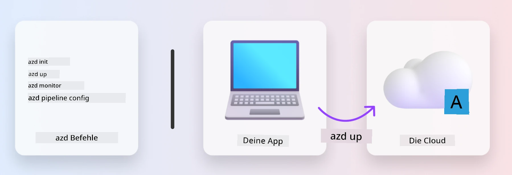
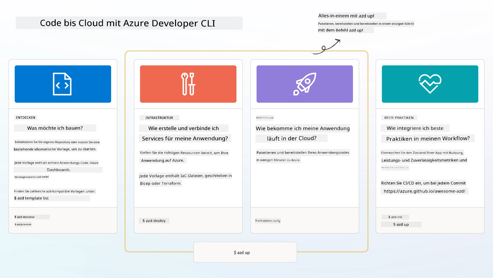

# 1. Wählen Sie eine Vorlage

!!! tip "AM ENDE DIESES MODULS KÖNNEN SIE"

    - [ ] Beschreiben, was AZD-Vorlagen sind
    - [ ] AZD-Vorlagen für KI entdecken und verwenden
    - [ ] Mit der AI Agents-Vorlage beginnen
    - [ ] **Lab 1:** AZD-Schnellstart mit GitHub Codespaces

---

## 1. Eine Bau-Analogie

Die Entwicklung einer modernen, unternehmensbereiten KI-Anwendung _von Grund auf_ kann entmutigend sein. Es ist ein bisschen so, als würden Sie Ihr neues Zuhause Stein für Stein selbst bauen. Ja, das ist möglich! Aber es ist nicht der effektivste Weg, um das gewünschte Endergebnis zu erzielen!

Stattdessen beginnen wir oft mit einem vorhandenen _Designentwurf_ und arbeiten mit einem Architekten zusammen, um ihn an unsere persönlichen Anforderungen anzupassen. Und genau das ist der Ansatz, den man beim Erstellen intelligenter Anwendungen verfolgen sollte. Zuerst finden Sie eine gute Architektur, die zu Ihrem Problemfeld passt. Dann arbeiten Sie mit einem Lösungsarchitekten zusammen, um die Lösung für Ihr spezifisches Szenario anzupassen und zu entwickeln.

Aber wo finden wir diese Designentwürfe? Und wie finden wir einen Architekten, der bereit ist, uns zu zeigen, wie man diese Entwürfe selbst anpasst und bereitstellt? In diesem Workshop beantworten wir diese Fragen, indem wir Ihnen drei Technologien vorstellen:

1. [Azure Developer CLI](https://aka.ms/azd) - ein Open-Source-Tool, das den Entwicklerpfad vom lokalen Entwickeln (Build) bis zur Cloud-Bereitstellung (Ship) beschleunigt.
1. [Microsoft Foundry Templates](https://ai.azure.com/templates) - standardisierte Open-Source-Repositorys mit Beispielcode, Infrastruktur- und Konfigurationsdateien zur Bereitstellung einer KI-Lösungsarchitektur.
1. [GitHub Copilot Agent Mode](https://code.visualstudio.com/docs/copilot/chat/chat-agent-mode) - ein Codierungsagent, der auf Azure-Wissen basiert und uns beim Navigieren im Codebasis und bei Änderungen mithilfe natürlicher Sprache anleiten kann.

Mit diesen Werkzeugen in der Hand können wir nun die richtige Vorlage _entdecken_, sie _bereitstellen_, um zu validieren, dass sie funktioniert, und sie _anpassen_, damit sie zu unseren spezifischen Szenarien passt. Tauchen wir ein und lernen, wie das funktioniert.


---

## 2. Azure Developer CLI

Die [Azure Developer CLI](https://learn.microsoft.com/en-us/azure/developer/azure-developer-cli/) (oder `azd`) ist ein Open-Source-Kommandozeilentool, das Ihre Code-to-Cloud-Reise mit einer Reihe entwicklerfreundlicher Befehle beschleunigen kann, die in Ihrer IDE (Entwicklung) und CI/CD (DevOps)-Umgebung konsistent funktionieren.

Mit `azd` kann Ihre Bereitstellungsreise so einfach sein wie:

- `azd init` - Initialisiert ein neues KI-Projekt aus einer vorhandenen AZD-Vorlage.
- `azd up` - Provisioniert die Infrastruktur und stellt Ihre Anwendung in einem Schritt bereit.
- `azd monitor` - Bietet Echtzeitüberwachung und Diagnose für Ihre bereitgestellte Anwendung.
- `azd pipeline config` - Richtet CI/CD-Pipelines ein, um die Bereitstellung in Azure zu automatisieren.

**🎯 | ÜBUNG**: <br/> Erkunden Sie jetzt das `azd`-Kommandozeilentool in Ihrer GitHub Codespaces-Umgebung. Geben Sie zunächst diesen Befehl ein, um zu sehen, was das Tool kann:

```bash title="" linenums="0"
azd help
```



---

## 3. Die AZD-Vorlage

Damit `azd` dies erreichen kann, muss es wissen, welche Infrastruktur bereitgestellt werden soll, welche Konfigurationseinstellungen durchgesetzt werden müssen und welche Anwendung bereitgestellt werden soll. Hier kommen [AZD templates](https://learn.microsoft.com/en-us/azure/developer/azure-developer-cli/azd-templates?tabs=csharp) ins Spiel.

AZD-Vorlagen sind Open-Source-Repositorys, die Beispielcode mit den erforderlichen Infrastruktur- und Konfigurationsdateien zur Bereitstellung der Lösungsarchitektur kombinieren.
Durch die Verwendung eines _Infrastructure-as-Code_ (IaC)-Ansatzes ermöglichen sie, dass Vorlagenressourcendefinitionen und Konfigurationseinstellungen versionsverwaltet werden (genau wie der Quellcode der App) – und schaffen so wiederverwendbare und konsistente Workflows für die Nutzer dieses Projekts.

Wenn Sie eine AZD-Vorlage für _Ihr_ Szenario erstellen oder wiederverwenden, sollten Sie diese Fragen berücksichtigen:

1. Was bauen Sie? → Gibt es eine Vorlage, die Startercode für dieses Szenario enthält?
1. Wie ist Ihre Lösung architekturiert? → Gibt es eine Vorlage, die die notwendigen Ressourcen enthält?
1. Wie wird Ihre Lösung bereitgestellt? → Denken Sie an `azd deploy` mit Pre-/Post-Processing-Hooks!
1. Wie können Sie sie weiter optimieren? → Denken Sie an integrierte Überwachung und Automatisierungspipelines!

**🎯 | ÜBUNG**: <br/> 
Besuchen Sie die [Awesome AZD](https://azure.github.io/awesome-azd/) Galerie und verwenden Sie die Filter, um die derzeit mehr als 250 verfügbaren Vorlagen zu erkunden. Sehen Sie nach, ob Sie eine finden, die zu _Ihrem_ Szenario passt.



---

## 4. KI-Anwendungs-Vorlagen

Für KI-basierte Anwendungen stellt Microsoft spezialisierte Vorlagen mit **Microsoft Foundry** und **Foundry Agents** bereit. Diese Vorlagen beschleunigen Ihren Weg zum Aufbau intelligenter, produktionsbereiter Anwendungen.

### Microsoft Foundry & Foundry Agents-Vorlagen

Wählen Sie unten eine Vorlage zur Bereitstellung aus. Jede Vorlage ist auf [Awesome AZD](https://azure.github.io/awesome-azd/) verfügbar und kann mit einem einzigen Befehl initialisiert werden.

| Template | Description | Deploy Command |
|----------|-------------|----------------|
| **[AI Chat with RAG](https://azure.github.io/awesome-azd/?tags=ai&tags=rag)** | Chat-Anwendung mit Retrieval-Augmented Generation unter Verwendung von Microsoft Foundry | `azd init -t azure-samples/azure-search-openai-demo` |
| **[Foundry Agent Service Starter](https://azure.github.io/awesome-azd/?tags=ai&tags=agents)** | Erstellen Sie KI-Agenten mit Foundry Agents für autonome Aufgabenausführung | `azd init -t azure-samples/foundry-agent-service-starter` |
| **[Multi-Agent Orchestration](https://azure.github.io/awesome-azd/?tags=ai&tags=agents)** | Koordinieren Sie mehrere Foundry Agents für komplexe Workflows | `azd init -t azure-samples/multi-agent-orchestration` |
| **[AI Document Intelligence](https://azure.github.io/awesome-azd/?tags=ai&tags=document)** | Dokumente extrahieren und analysieren mit Microsoft Foundry-Modellen | `azd init -t azure-samples/ai-document-processing` |
| **[Conversational AI Bot](https://azure.github.io/awesome-azd/?tags=ai&tags=bot)** | Erstellen Sie intelligente Chatbots mit Microsoft Foundry-Integration | `azd init -t azure-samples/ai-chat-protocol` |
| **[AI Image Generation](https://azure.github.io/awesome-azd/?tags=ai&tags=dalle)** | Erzeugen Sie Bilder mit DALL-E über Microsoft Foundry | `azd init -t azure-samples/ai-image-generation` |
| **[Semantic Kernel Agent](https://azure.github.io/awesome-azd/?tags=ai&tags=semantic-kernel)** | KI-Agenten, die Semantic Kernel mit Foundry Agents verwenden | `azd init -t azure-samples/semantic-kernel-agent` |
| **[AutoGen Multi-Agent](https://azure.github.io/awesome-azd/?tags=ai&tags=autogen)** | Multi-Agenten-Systeme basierend auf dem AutoGen-Framework | `azd init -t azure-samples/autogen-multi-agent` |

### Schnellstart

1. **Vorlagen durchsuchen**: Besuchen Sie [https://azure.github.io/awesome-azd/](https://azure.github.io/awesome-azd/) und filtern Sie nach `AI`, `Agents` oder `Microsoft Foundry`
2. **Vorlage auswählen**: Wählen Sie eine aus, die Ihrem Anwendungsfall entspricht
3. **Initialisieren**: Führen Sie den `azd init`-Befehl für Ihre gewählte Vorlage aus
4. **Bereitstellen**: Führen Sie `azd up` aus, um Infrastruktur bereitzustellen und die Anwendung zu deployen

**🎯 | ÜBUNG**: <br/>
Wählen Sie eine der oben genannten Vorlagen basierend auf Ihrem Szenario:

- **Einen Chatbot bauen?** → Beginnen Sie mit **AI Chat with RAG** oder **Conversational AI Bot**
- **Benötigen Sie autonome Agenten?** → Probieren Sie **Foundry Agent Service Starter** oder **Multi-Agent Orchestration**
- **Dokumente verarbeiten?** → Verwenden Sie **AI Document Intelligence**
- **Möchten Sie KI-Unterstützung beim Programmieren?** → Erkunden Sie **Semantic Kernel Agent** oder **AutoGen Multi-Agent**

```bash title="Example: Deploy the AI Chat with RAG template" linenums="0"
azd init -t azure-samples/azure-search-openai-demo
azd up
```

!!! info "Weitere Vorlagen erkunden"
    The [Awesome AZD Gallery](https://azure.github.io/awesome-azd/) contains 250+ templates. Use the filters to find templates matching your specific requirements for language, framework, and Azure services.

---

<!-- CO-OP TRANSLATOR DISCLAIMER START -->
Haftungsausschluss:

Dieses Dokument wurde mithilfe des KI-Übersetzungsdienstes [Co-op Translator](https://github.com/Azure/co-op-translator) übersetzt. Obwohl wir um Genauigkeit bemüht sind, beachten Sie bitte, dass automatisierte Übersetzungen Fehler oder Ungenauigkeiten enthalten können. Das Originaldokument in seiner ursprünglichen Sprache ist als maßgebliche Quelle zu betrachten. Bei wichtigen Informationen wird eine professionelle menschliche Übersetzung empfohlen. Wir übernehmen keine Haftung für Missverständnisse oder Fehlinterpretationen, die aus der Verwendung dieser Übersetzung entstehen.
<!-- CO-OP TRANSLATOR DISCLAIMER END -->