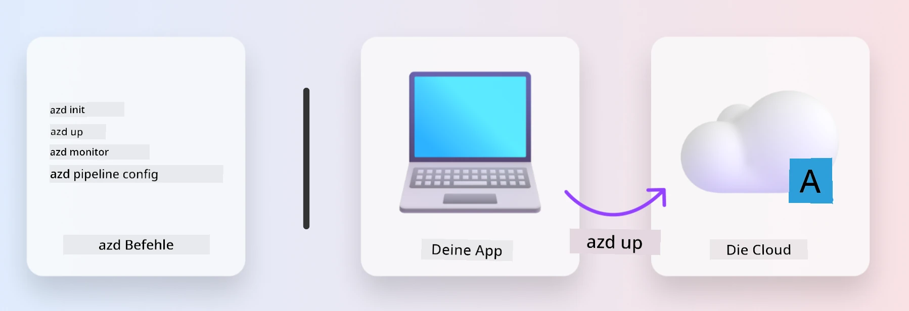
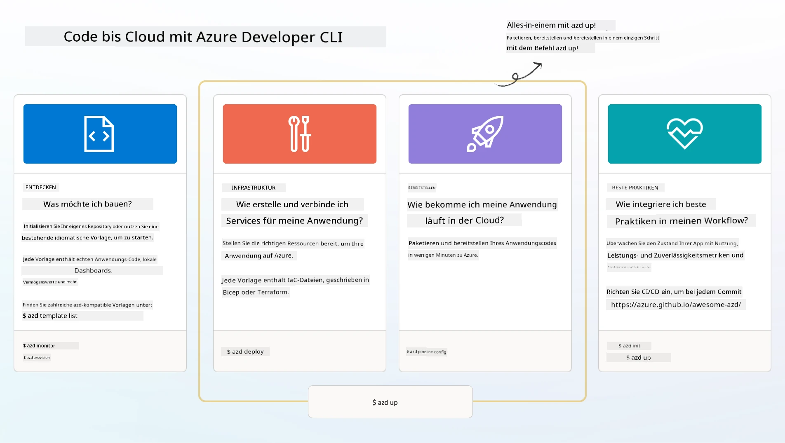

# 1. Select a Template

!!! tip "AM ENDE DIESES MODULS KÖNNEN SIE"

    - [ ] Beschreiben, was AZD-Vorlagen sind
    - [ ] AZD-Vorlagen für AI entdecken und verwenden
    - [ ] Mit der AI Agents-Vorlage loslegen
    - [ ] **Lab 1:** AZD-Schnellstart in Codespaces oder einem dev container

---

## 1. Eine Bauherren-Analogie

Ein modernes, unternehmensreifes AI-Anwendungsprogramm _von Grund auf_ zu erstellen, kann einschüchternd sein. Es ist ein bisschen so, als würde man sein neues Haus ganz alleine, Stein für Stein, bauen. Ja, das ist möglich! Aber es ist nicht der effektivste Weg, um das gewünschte Endergebnis zu erreichen!

Stattdessen beginnen wir oft mit einem vorhandenen _Entwurfsplan_ und arbeiten mit einem Architekten zusammen, um ihn an unsere persönlichen Anforderungen anzupassen. Und genau das ist der Ansatz, den man beim Erstellen intelligenter Anwendungen verfolgen sollte. Zuerst findet man eine gute Architekturvorlage, die zu seinem Problemfeld passt. Dann arbeitet man mit einem Lösungsarchitekten zusammen, um die Lösung für das spezifische Szenario anzupassen und zu entwickeln.

Aber wo findet man diese Entwurfspläne? Und wie findet man einen Architekten, der bereit ist, uns zu zeigen, wie man diese Pläne selbst anpasst und bereitstellt? In diesem Workshop beantworten wir diese Fragen, indem wir Ihnen drei Technologien vorstellen:

1. [Azure Developer CLI](https://aka.ms/azd) - ein Open-Source-Tool, das den Entwicklerpfad vom lokalen Entwickeln (Build) bis zur Cloud-Bereitstellung (Ship) beschleunigt.
1. [Microsoft Foundry Templates](https://ai.azure.com/templates) - standardisierte Open-Source-Repositorys mit Beispielcode, Infrastruktur- und Konfigurationsdateien zur Bereitstellung einer AI-Lösungsarchitektur.
1. [GitHub Copilot Agent Mode](https://code.visualstudio.com/docs/copilot/chat/chat-agent-mode) - ein Coding-Agent, der auf Azure-Wissen basiert und uns beim Navigieren im Codebasis und beim Vornehmen von Änderungen in natürlicher Sprache leiten kann.

Mit diesen Tools können wir nun die richtige Vorlage _entdecken_, sie _bereitstellen_, um zu validieren, dass sie funktioniert, und sie _anpassen_, um sie an unsere spezifischen Szenarien anzupassen. Tauchen wir ein und lernen, wie diese funktionieren.


---

## 2. Azure Developer CLI

Die [Azure Developer CLI](https://learn.microsoft.com/en-us/azure/developer/azure-developer-cli/) (oder `azd`) ist ein Open-Source-Kommandozeilen-Tool, das Ihre Code-to-Cloud-Reise mit einer Reihe entwicklerfreundlicher Befehle beschleunigen kann, die in Ihrer IDE (Entwicklung) und in CI/CD (DevOps)-Umgebungen konsistent funktionieren.

Mit `azd` kann Ihre Bereitstellungsreise so einfach sein wie:

- `azd init` - Initialisiert ein neues AI-Projekt aus einer vorhandenen AZD-Vorlage.
- `azd up` - Provisioniert Infrastruktur und stellt Ihre Anwendung in einem Schritt bereit.
- `azd monitor` - Bietet Echtzeitüberwachung und Diagnosen für Ihre bereitgestellte Anwendung.
- `azd pipeline config` - Richtet CI/CD-Pipelines ein, um die Bereitstellung in Azure zu automatisieren.

**🎯 | EXERCISE**: <br/> Erkunden Sie jetzt das `azd`-Kommandozeilen-Tool in Ihrer aktuellen Workshop-Umgebung. Das kann GitHub Codespaces, ein dev container oder ein lokales Repository mit den installierten Voraussetzungen sein. Beginnen Sie, indem Sie diesen Befehl eingeben, um zu sehen, was das Tool kann:

```bash title="" linenums="0"
azd help
```



---

## 3. Die AZD-Vorlage

Damit `azd` dies erreichen kann, muss es wissen, welche Infrastruktur zu provisionieren ist, welche Konfigurationseinstellungen durchgesetzt werden sollen und welche Anwendung bereitzustellen ist. Hier kommen [AZD-Vorlagen](https://learn.microsoft.com/en-us/azure/developer/azure-developer-cli/azd-templates?tabs=csharp) ins Spiel.

AZD-Vorlagen sind Open-Source-Repositorys, die Beispielcode mit Infrastruktur- und Konfigurationsdateien kombinieren, die für die Bereitstellung der Lösungsarchitektur erforderlich sind.
Durch die Verwendung eines _Infrastructure-as-Code_ (IaC)-Ansatzes ermöglichen sie, dass Vorlagenressourcendefinitionen und Konfigurationseinstellungen versionskontrolliert werden (genau wie der App-Quellcode) - wodurch wiederverwendbare und konsistente Workflows für die Benutzer dieses Projekts entstehen.

Wenn Sie eine AZD-Vorlage für _Ihr_ Szenario erstellen oder wiederverwenden, sollten Sie diese Fragen beachten:

1. Was bauen Sie? → Gibt es eine Vorlage, die Startercode für dieses Szenario enthält?
1. Wie ist Ihre Lösung aufgebaut? → Gibt es eine Vorlage, die die notwendigen Ressourcen enthält?
1. Wie wird Ihre Lösung bereitgestellt? → Denken Sie an `azd deploy` mit Pre-/Post-Processing-Hooks!
1. Wie können Sie sie weiter optimieren? → Denken Sie an integrierte Überwachung und Automatisierungspipelines!

**🎯 | EXERCISE**: <br/> 
Besuchen Sie die [Awesome AZD](https://azure.github.io/awesome-azd/) Galerie und verwenden Sie die Filter, um die derzeit über 250 verfügbaren Vorlagen zu erkunden. Schauen Sie, ob Sie eine finden können, die zu den Anforderungen _Ihres_ Szenarios passt.



---

## 4. AI App Templates

Für AI-gestützte Anwendungen stellt Microsoft spezialisierte Vorlagen bereit, die **Microsoft Foundry** und **Foundry Agents** beinhalten. Diese Vorlagen beschleunigen Ihren Weg zum Aufbau intelligenter, produktionsbereiter Anwendungen.

### Microsoft Foundry & Foundry Agents Templates

Wählen Sie unten eine Vorlage zur Bereitstellung aus. Jede Vorlage ist auf [Awesome AZD](https://azure.github.io/awesome-azd/) verfügbar und kann mit einem einzigen Befehl initialisiert werden.

| Template | Description | Deploy Command |
|----------|-------------|----------------|
| **[AI-Chat mit RAG](https://azure.github.io/awesome-azd/?tags=ai&tags=rag)** | Chat-Anwendung mit Retrieval Augmented Generation unter Verwendung von Microsoft Foundry | `azd init -t azure-samples/azure-search-openai-demo` |
| **[Foundry Agent Service Starter](https://azure.github.io/awesome-azd/?tags=ai&tags=agents)** | Erstellen Sie AI-Agenten mit Foundry Agents für autonome Aufgabenausführung | `azd init -t azure-samples/foundry-agent-service-starter` |
| **[Multi-Agent Orchestration](https://azure.github.io/awesome-azd/?tags=ai&tags=agents)** | Koordinieren mehrerer Foundry Agents für komplexe Workflows | `azd init -t azure-samples/multi-agent-orchestration` |
| **[AI Document Intelligence](https://azure.github.io/awesome-azd/?tags=ai&tags=document)** | Dokumente mit Microsoft Foundry-Modellen extrahieren und analysieren | `azd init -t azure-samples/ai-document-processing` |
| **[Conversational AI Bot](https://azure.github.io/awesome-azd/?tags=ai&tags=bot)** | Intelligente Chatbots mit Microsoft Foundry-Integration erstellen | `azd init -t azure-samples/ai-chat-protocol` |
| **[AI Image Generation](https://azure.github.io/awesome-azd/?tags=ai&tags=dalle)** | Bilder mit DALL-E über Microsoft Foundry generieren | `azd init -t azure-samples/ai-image-generation` |
| **[Semantic Kernel Agent](https://azure.github.io/awesome-azd/?tags=ai&tags=semantic-kernel)** | AI-Agenten unter Verwendung von Semantic Kernel mit Foundry Agents | `azd init -t azure-samples/semantic-kernel-agent` |
| **[AutoGen Multi-Agent](https://azure.github.io/awesome-azd/?tags=ai&tags=autogen)** | Multi-Agent-Systeme unter Verwendung des AutoGen-Frameworks | `azd init -t azure-samples/autogen-multi-agent` |

### Schnellstart

1. **Vorlagen durchsuchen**: Besuchen Sie [https://azure.github.io/awesome-azd/](https://azure.github.io/awesome-azd/) und filtern Sie nach `AI`, `Agents` oder `Microsoft Foundry`
2. **Vorlage auswählen**: Wählen Sie eine aus, die zu Ihrem Anwendungsfall passt
3. **Initialisieren**: Führen Sie den `azd init`-Befehl für Ihre gewählte Vorlage aus
4. **Bereitstellen**: Führen Sie `azd up` aus, um zu provisionieren und bereitzustellen

**🎯 | EXERCISE**: <br/>
Wählen Sie eine der oben stehenden Vorlagen entsprechend Ihrem Szenario:

- **Einen Chatbot bauen?** → Beginnen Sie mit **AI-Chat mit RAG** oder **Conversational AI Bot**
- **Autonome Agenten benötigt?** → Probieren Sie **Foundry Agent Service Starter** oder **Multi-Agent Orchestration**
- **Dokumente verarbeiten?** → Verwenden Sie **AI Document Intelligence**
- **AI-Coding-Unterstützung gewünscht?** → Erkunden Sie **Semantic Kernel Agent** oder **AutoGen Multi-Agent**

```bash title="Example: Deploy the AI Chat with RAG template" linenums="0"
azd init -t azure-samples/azure-search-openai-demo
azd up
```

!!! info "Weitere Vorlagen erkunden"
    Die [Awesome AZD Gallery](https://azure.github.io/awesome-azd/) enthält über 250 Vorlagen. Verwenden Sie die Filter, um Vorlagen zu finden, die Ihren spezifischen Anforderungen an Sprache, Framework und Azure-Dienste entsprechen.

---

<!-- CO-OP TRANSLATOR DISCLAIMER START -->
**Haftungsausschluss**:
Dieses Dokument wurde mit dem KI-Übersetzungsdienst [Co-op Translator](https://github.com/Azure/co-op-translator) übersetzt. Obwohl wir uns um Genauigkeit bemühen, beachten Sie bitte, dass automatisierte Übersetzungen Fehler oder Ungenauigkeiten enthalten können. Das Originaldokument in seiner Ausgangssprache ist als maßgebliche Quelle anzusehen. Für kritische Informationen wird eine professionelle menschliche Übersetzung empfohlen. Wir haften nicht für Missverständnisse oder Fehlinterpretationen, die aus der Nutzung dieser Übersetzung entstehen.
<!-- CO-OP TRANSLATOR DISCLAIMER END -->