# 2. Vorlage validieren

!!! tip "AM ENDE DIESES MODULS KÖNNEN SIE"

    - [ ] Die KI-Lösungsarchitektur analysieren
    - [ ] Den AZD-Bereitstellungsworkflow verstehen
    - [ ] GitHub Copilot verwenden, um Hilfe bei der Verwendung von AZD zu erhalten
    - [ ] **Lab 2:** Bereitstellen & Validieren der AI Agents-Vorlage

---


## 1. Einführung

The [Azure Developer CLI](https://learn.microsoft.com/en-us/azure/developer/azure-developer-cli/) or `azd` is an open-source commandline tool that streamlines the developer workflow when building and deploying applications to Azure. 

[AZD Templates](https://learn.microsoft.com/azure/developer/azure-developer-cli/azd-templates) are standardized repositories that include sample application code, _Infrastruktur als Code_ assets, and `azd` configuration files for a cohesive solution architecture. Provisioning the infrastructure becomes as simple as an `azd provision` command - while using `azd up` allows you to provision infrastructure **and** deploy your application at one shot!

As a result, jumpstarting your application development process can be as simple as finding the right _AZD Starter-Vorlage_ that comes closest to your application and infrastructure needs - then customizing the repository to suit your scenario requirements.

Before we begin, let's make sure you have the Azure Developer CLI installed.

1. Open a VS Code terminal and type this command:

      ```bash title="" linenums="0"
      azd version
      ```

1. You should see something like this!

      ```bash title="" linenums="0"
      azd version 1.19.0 (commit b3d68cea969b2bfbaa7b7fa289424428edb93e97)
      ```

**Sie sind nun bereit, eine Vorlage mit azd auszuwählen und bereitzustellen**

---

## 2. Vorlagenauswahl

The Microsoft Foundry platform comes with a [set of recommended AZD templates](https://learn.microsoft.com/en-us/azure/ai-foundry/how-to/develop/ai-template-get-started) that cover popular solution scenarios like _Multi-Agent-Workflow-Automatisierung_ and _multimodale Inhaltsverarbeitung_. You can also discover these templates by visiting the Microsoft Foundry portal.

1. Besuchen Sie [https://ai.azure.com/templates](https://ai.azure.com/templates)
1. Log into the Microsoft Foundry portal when prompted - you will see something like this.

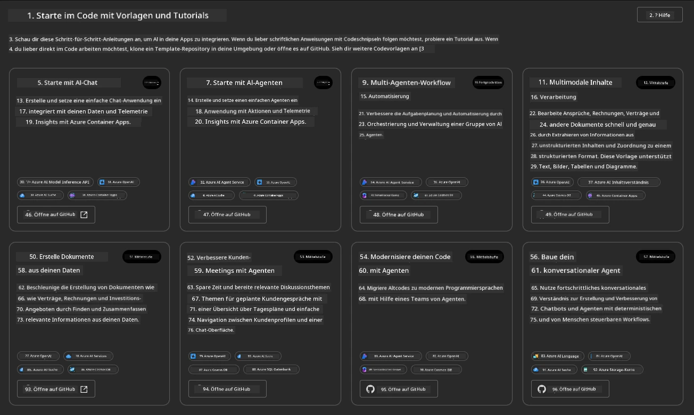


The **Basic** options are your starter templates:

1. [ ] [Get Started with AI Chat](https://github.com/Azure-Samples/get-started-with-ai-chat) that deploys a basic chat application _with your data_ to Azure Container Apps. Use this to explore a basic AI chatbot scenario.
1. [X] [Get Started with AI Agents](https://github.com/Azure-Samples/get-started-with-ai-agents) that also deploys a standard AI Agent (with the Foundry Agents). Use this to get familiar with agentic AI solutions involving tools and models.

Visit the second link in a new browser tab (or click `Open in GitHub` for the related card). You should see the repository for this AZD Template. Take a minute to explore the README. The application architecture looks like this:

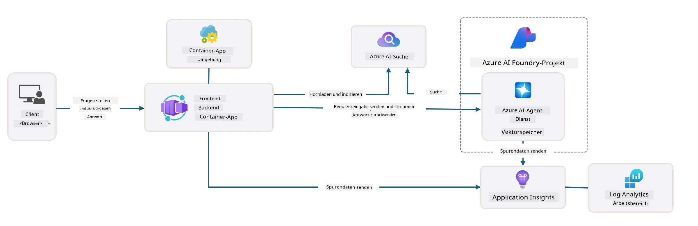

---

## 3. Vorlagenaktivierung

Let's try to deploy this template and make sure it is valid. We'll follow the guidelines in the [Getting Started](https://github.com/Azure-Samples/get-started-with-ai-agents?tab=readme-ov-file#getting-started) section.

1. Click [this link](https://github.com/codespaces/new/Azure-Samples/get-started-with-ai-agents) - confirm the default action to `Create codespace`
1. This opens a new browser tab - wait for the GitHub Codespaces session to complete loading
1. Open the VS Code terminal in Codespaces - type the following command:

   ```bash title="" linenums="0"
   azd up
   ```

Complete the workflow steps that this will trigger:

1. You will be prompted to log into Azure - follow instructions to authenticate
1. Enter a unique environment name for you - e.g., I used `nitya-mshack-azd`
1. This  will create a `.azure/` folder - you will see a subfolder with the env name
1. You will be prompted to select a subscription name - select the default
1. You will be prompted for a location - use `East US 2`

Now, you wait for the provisioning to complete. **This takes 10-15 minutes**

1. When done, your console will show a SUCCESS message like this:
      ```bash title="" linenums="0"
      SUCCESS: Your up workflow to provision and deploy to Azure completed in 10 minutes 17 seconds.
      ```
1. Your Azure Portal will now have a provisioned resource group with that env name:

      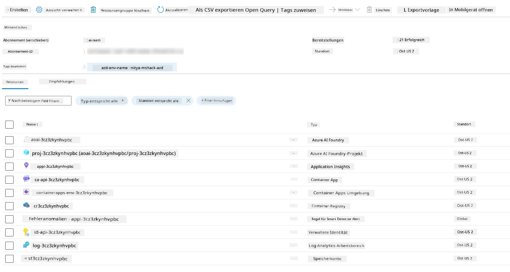

1. **You are now ready to validate the deployed infrastructure and application**.

---

## 4. Vorlagenvalidierung

1. Visit Azure Portal [Ressourcengruppen](https://portal.azure.com/#browse/resourcegroups) page - log in when prompted
1. Click on RG for your environment name - you see the page above

      - klicken Sie auf die Azure Container Apps resource
      - klicken Sie auf die Application Url in the _Essentials_ section (top right)

1. You should see a hosted application front-end UI like this:

   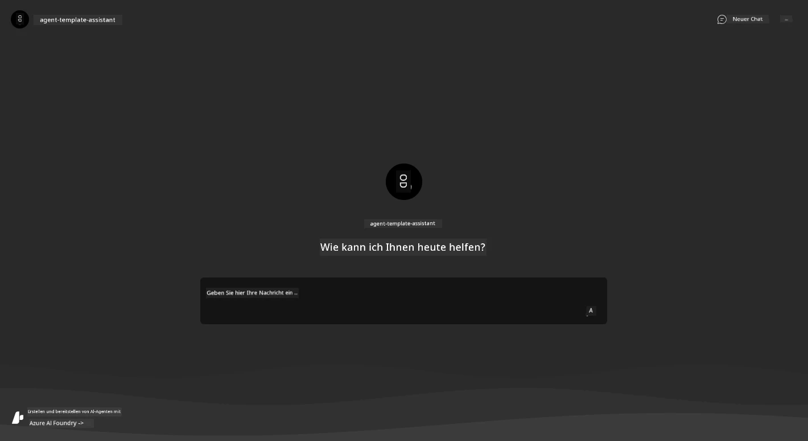

1. Try asking a couple of [Beispielfragen](https://github.com/Azure-Samples/get-started-with-ai-agents/blob/main/docs/sample_questions.md)

      1. Stellen Sie die Frage: ```Was ist die Hauptstadt von Frankreich?``` 
      1. Stellen Sie die Frage: ```Was ist das beste Zelt unter $200 für zwei Personen, und welche Merkmale hat es?```

1. You should get answers similar to what is shown below. _But how does this work?_ 

      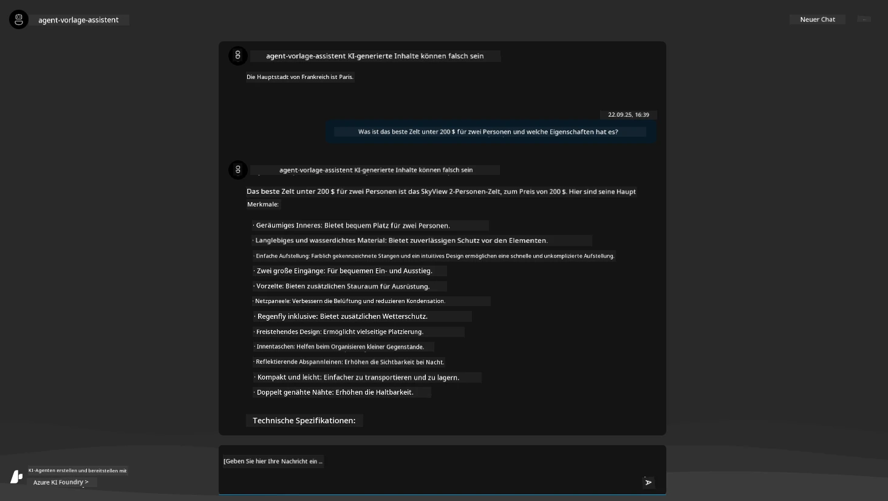

---

## 5.  Agentenvalidierung

The Azure Container App deploys an endpoint that connects to the AI Agent provisioned in the Microsoft Foundry project for this template. Let's take a look at what that means.

1. Return to the Azure Portal _Overview_ page for your resource group

1. Click on the `Microsoft Foundry` resource in that list

1. You should see this. Click the `Go to Microsoft Foundry Portal` button. 
   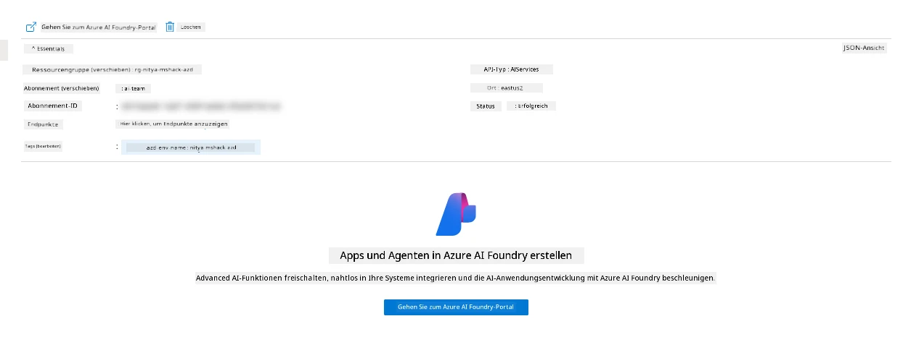

1. You should see the Foundry Project page for your AI application
   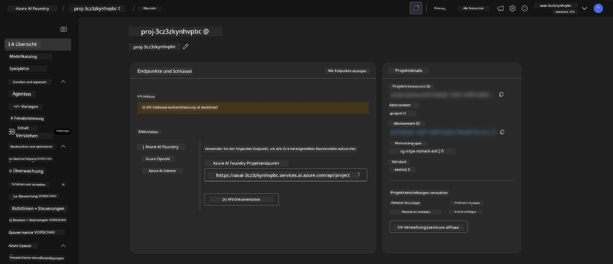

1. Click on `Agents` - you see the default Agent provisioned in your project
   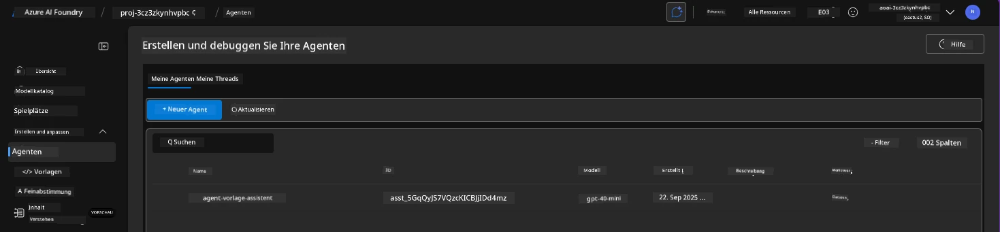

1. Select it - and you see the Agent details. Note the following:

      - Der Agent verwendet standardmäßig File Search (immer)
      - Das Agenten-`Knowledge` zeigt an, dass 32 Dateien hochgeladen wurden (für File Search)
      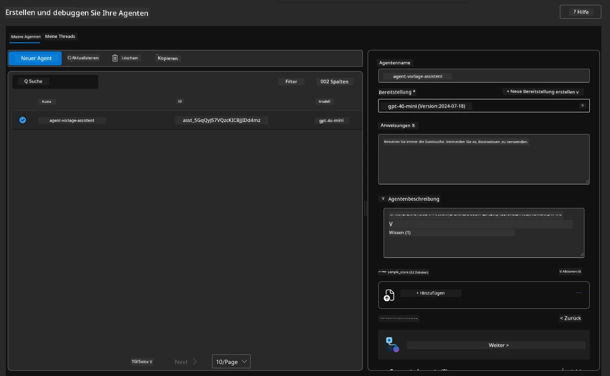

1. Look for the `Data+indexes` option in the left menu and click for details. 

      - Sie sollten die 32 hochgeladenen Datendateien für Knowledge sehen.
      - Diese entsprechen den 12 Kunden-Dateien und 20 Produktdateien unter `src/files` 
      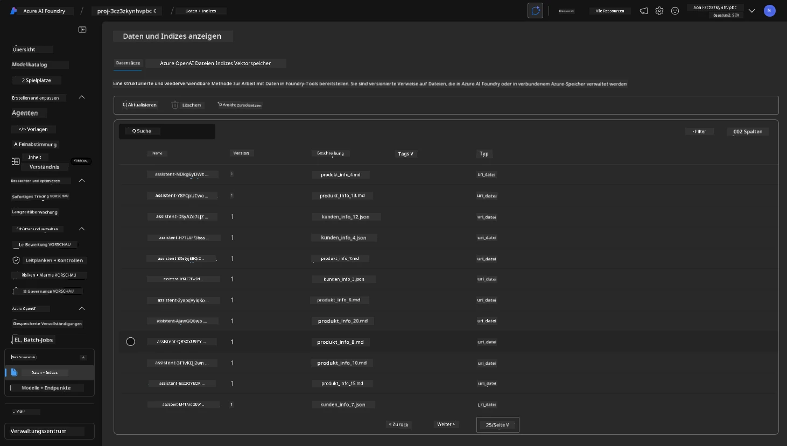

**Sie haben den Agentenbetrieb validiert!** 

1. The agent responses are grounded in the knowledge in those files. 
1. You can now ask questions related to that data, and get grounded responses.
1. Beispiel: `customer_info_10.json` beschreibt die 3 Käufe, die "Amanda Perez" getätigt hat

Revisit the browser tab with the Container App endpoint and ask: `Welche Produkte besitzt Amanda Perez?`. You should see something like this:

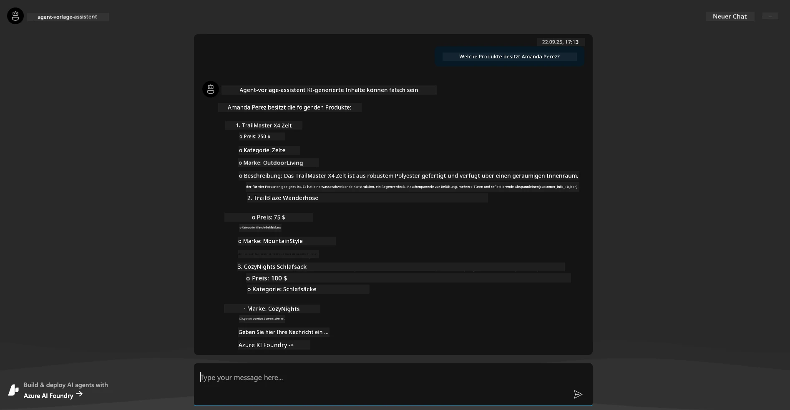

---

## 6. Agenten-Playground

Let's build a bit more intuition for the capabilities of Microsoft Foundry, by taking the Agent for a spin in the Agents Playground. 

1. Return to the `Agents` page in Microsoft Foundry - select the default agent
1. Click the `Try in Playground` option - you should get a Playground UI like this
1. Ask the same question: `Welche Produkte besitzt Amanda Perez?`

    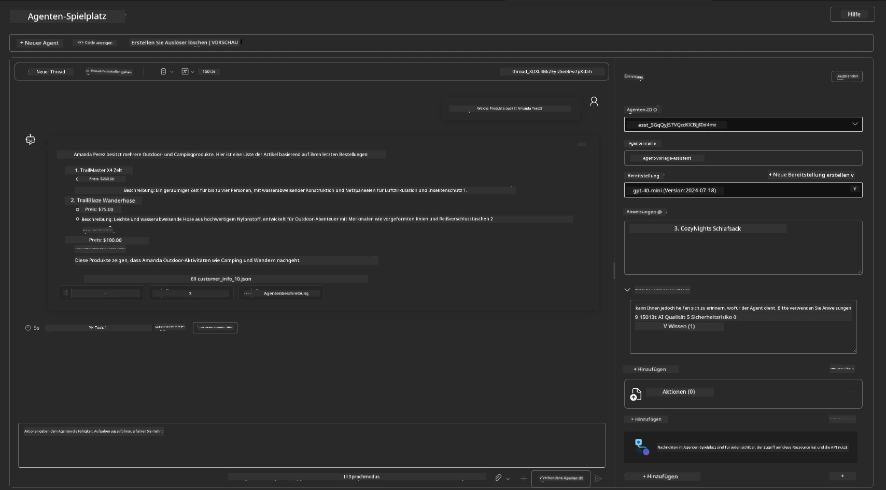

You get the same (or similar) response - but you also get additional information that you can use to understand the quality, cost, and performance of your agentic app. For example:

1. Note that the response cites data files used to "ground" the response
1. Hover over any of these file labels - does the data match your query and displayed response?

You also see a _stats_ row below the response. 

1. Hover over any metric - e.g., Safety. You see something like this
1. Does the assessed rating match your intuition for the response safety level?

      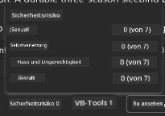

---

## 7. Integrierte Beobachtbarkeit

Observability is about instrumenting your application to generate data that can be used to understand, debug, and optimize, its operations. To get a sense for this:

1. Click the `View Run Info` button - you should see this view. This is an example of [Agent tracing](https://learn.microsoft.com/en-us/azure/ai-foundry/how-to/develop/trace-agents-sdk#view-trace-results-in-the-azure-ai-foundry-agents-playground) in action. _You can also get this view by clicking Thread Logs in the top-level menu_.

   - Verschaffen Sie sich einen Eindruck von den Ausführungsschritten und den vom Agenten eingesetzten Tools
   - Verstehen Sie die Gesamtanzahl der Tokens (vs. der Ausgabe-Token-Nutzung) für die Antwort
   - Verstehen Sie die Latenz und wo Zeit in der Ausführung verbracht wird

      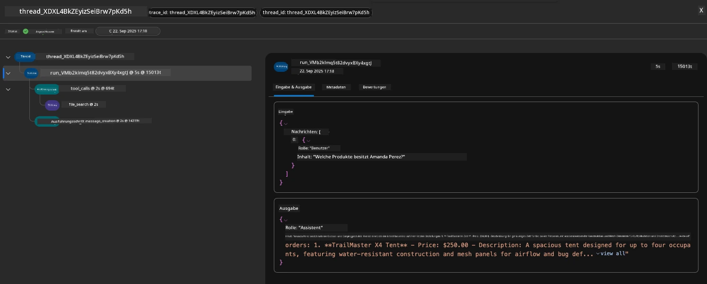

1. Click the `Metadata` tab to see additional attributes for the run, that may provide useful context for debugging issues later.   

      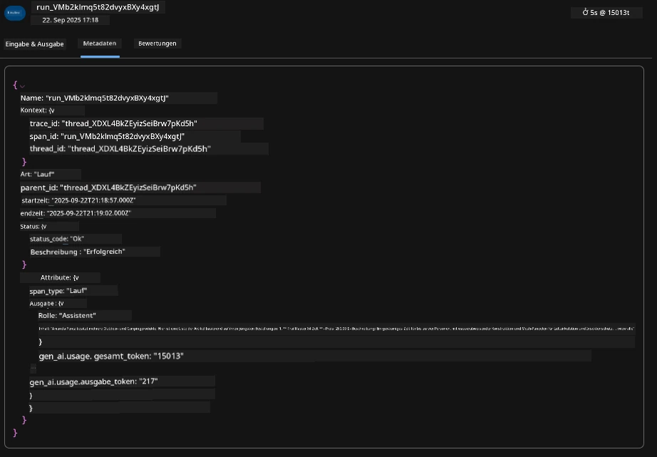


1. Click the `Evaluations` tab to see auto-assessments made on the agent response. These include safety evaluations (e.g., Self-harm) and agent-specifc evaluations (e.g., Intent resolution, Task adherence).

      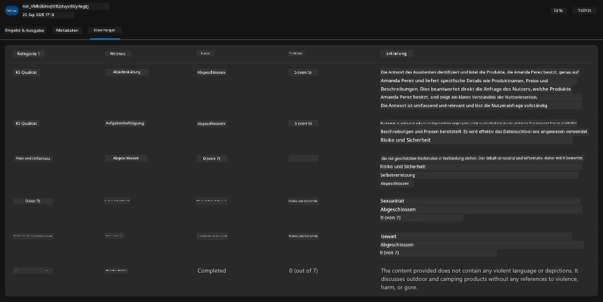

1. Last but not least, click the `Monitoring` tab in the sidebar menu.

      - Select `Resource usage` tab in the displayed page - and view the metrics.
      - Track application usage in terms of costs (tokens) and load (requests).
      - Track applicaton latency to first byte (input processing) and last byte (output).

      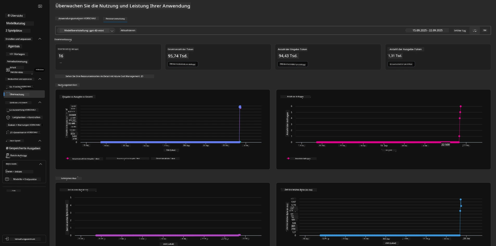

---

## 8. Umgebungsvariablen

So far, we've walked through the deployment in the browser - and validated that our infrastructure is provisioned and the application is operational. But to work with the application _code-first_, we need to configure our local development environment with the relevant variables required to work with these resources. Using `azd` makes it easy.

1. The Azure Developer CLI [uses environment variables](https://learn.microsoft.com/en-us/azure/developer/azure-developer-cli/manage-environment-variables?tabs=bash) to store and manage configuration settings for  the application deployments.

1. Environment variables are stored in `.azure/<env-name>/.env` - this scopes them to the `env-name` environment used during deployment and helps you isolate environments between different deployment targets in the same repo.

1. Environment variables are automatically loaded by the `azd` command whenever it executes a specific command (e.g., `azd up`). Note that `azd` does not automatically read _OS-level_ environment variables (e.g., set in the shell) - instead use `azd set env` and `azd get env` to transfer information within scripts.


Let's try out a few commands:

1. Get all the environment variables set for `azd` in this environment:

      ```bash title="" linenums="0"
      azd env get-values
      ```
      
      Sie sehen so etwas wie:

      ```bash title="" linenums="0"
      AZURE_AI_AGENT_DEPLOYMENT_NAME="gpt-4o-mini"
      AZURE_AI_AGENT_NAME="agent-template-assistant"
      AZURE_AI_EMBED_DEPLOYMENT_NAME="text-embedding-3-small"
      AZURE_AI_EMBED_DIMENSIONS=100
      ...
      ```

1. Get a specific value - e.g., I want to know if we set the `AZURE_AI_AGENT_MODEL_NAME` value

      ```bash title="" linenums="0"
      azd env get-value AZURE_AI_AGENT_MODEL_NAME 
      ```
      
      Sie sehen so etwas - er wurde standardmäßig nicht gesetzt!

      ```bash title="" linenums="0"
      ERROR: key 'AZURE_AI_AGENT_MODEL_NAME' not found in the environment values
      ```

1. Set a new environment variable for `azd`. Here, we update the agent model name. _Hinweis: any changes made will be immediately reflected in the `.azure/<env-name>/.env` file.

      ```bash title="" linenums="0"
      azd env set AZURE_AI_AGENT_MODEL_NAME gpt-4.1
      azd env set AZURE_AI_AGENT_MODEL_VERSION 2025-04-14
      azd env set AZURE_AI_AGENT_DEPLOYMENT_CAPACITY 150
      ```

      Nun sollten wir feststellen, dass der Wert gesetzt ist:

      ```bash title="" linenums="0"
      azd env get-value AZURE_AI_AGENT_MODEL_NAME 
      ```

1. Note that some resources are persistent (e.g., model deployments) and will require more than just an `azd up` to force the redeployment. Let's try tearing down the original deployment and redeploying with changed env vars.

1. **Refresh** If you had previously deployed infrastructure using an azd template - you can _refresh_ the state of your local environment variables based on the current state of your Azure deployment using this command:

      ```bash title="" linenums="0"
      azd env refresh
      ```

      Dies ist eine leistungsstarke Methode, um Umgebungsvariablen zwischen zwei oder mehr lokalen Entwicklungsumgebungen zu _synchronisieren_ (z. B. ein Team mit mehreren Entwicklern) - und ermöglicht es, dass die bereitgestellte Infrastruktur als verbindliche Referenz für den Zustand der Umgebungsvariablen dient. Teammitglieder müssen die Variablen einfach _aktualisieren_, um wieder synchron zu sein.

---

## 9. Herzlichen Glückwunsch 🏆

Sie haben gerade einen End-to-End-Workflow abgeschlossen, bei dem Sie:

- [X] Das AZD Template ausgewählt, das Sie verwenden möchten
- [X] Das Template mit GitHub Codespaces gestartet
- [X] Das Template bereitgestellt und überprüft, dass es funktioniert

---

<!-- CO-OP TRANSLATOR DISCLAIMER START -->
Haftungsausschluss:
Dieses Dokument wurde mithilfe des KI-Übersetzungsdienstes Co‑op Translator (https://github.com/Azure/co-op-translator) übersetzt. Obwohl wir uns um Genauigkeit bemühen, beachten Sie bitte, dass automatisierte Übersetzungen Fehler oder Ungenauigkeiten enthalten können. Das Originaldokument in seiner Originalsprache ist als maßgebliche Quelle zu betrachten. Bei wichtigen Informationen wird eine professionelle Übersetzung durch einen menschlichen Übersetzer empfohlen. Wir übernehmen keine Haftung für Missverständnisse oder Fehlinterpretationen, die aus der Nutzung dieser Übersetzung entstehen.
<!-- CO-OP TRANSLATOR DISCLAIMER END -->