# 2. Vorlage validieren

!!! tip "AM ENDE DIESES MODULS KÖNNEN SIE"

    - [ ] Die KI-Lösungsarchitektur analysieren
    - [ ] Den AZD-Bereitstellungsworkflow verstehen
    - [ ] GitHub Copilot verwenden, um Hilfe zur Nutzung von AZD zu erhalten
    - [ ] **Labor 2:** Das AI Agents-Template bereitstellen & validieren

---


## 1. Einführung

Die [Azure Developer CLI](https://learn.microsoft.com/en-us/azure/developer/azure-developer-cli/) oder `azd` ist ein Open-Source-Kommandozeilenwerkzeug, das den Entwickler-Workflow beim Erstellen und Bereitstellen von Anwendungen in Azure vereinfacht. 

[AZD Templates](https://learn.microsoft.com/azure/developer/azure-developer-cli/azd-templates) sind standardisierte Repositories, die Beispielanwendungscode, _Infrastruktur-als-Code_-Assets und `azd`-Konfigurationsdateien für eine zusammenhängende Lösungsarchitektur enthalten. Die Bereitstellung der Infrastruktur wird so einfach wie ein `azd provision`-Befehl - während `azd up` es Ihnen ermöglicht, Infrastruktur bereitzustellen **und** gleichzeitig Ihre Anwendung bereitzustellen!

Daher kann das Starten Ihres Anwendungsentwicklungsprozesses so einfach sein, wie die passende _AZD Starter template_ zu finden, die Ihren Anwendungs- und Infrastruktur-Anforderungen am nächsten kommt - und dann das Repository anzupassen, um Ihren Szenarioanforderungen zu entsprechen.

Bevor wir beginnen, stellen wir sicher, dass Sie die Azure Developer CLI installiert haben.

1. Open a VS Code terminal and type this command:

      ```bash title="" linenums="0"
      azd version
      ```

1. Sie sollten so etwas wie Folgendes sehen!

      ```bash title="" linenums="0"
      azd version 1.19.0 (commit b3d68cea969b2bfbaa7b7fa289424428edb93e97)
      ```

**Sie sind jetzt bereit, eine Vorlage mit azd auszuwählen und bereitzustellen**

---

## 2. Vorlagenauswahl

Die Microsoft Foundry-Plattform wird mit einer [Auswahl empfohlener AZD-Vorlagen](https://learn.microsoft.com/en-us/azure/ai-foundry/how-to/develop/ai-template-get-started) geliefert, die beliebte Lösungsszenarien wie _Multi-Agent-Workflow-Automatisierung_ und _multimodale Inhaltsverarbeitung_ abdecken. Sie können diese Vorlagen auch über das Microsoft Foundry-Portal entdecken.

1. Besuchen Sie [https://ai.azure.com/templates](https://ai.azure.com/templates)
1. Melden Sie sich beim Microsoft Foundry-Portal an, wenn Sie dazu aufgefordert werden - Sie sehen so etwas.

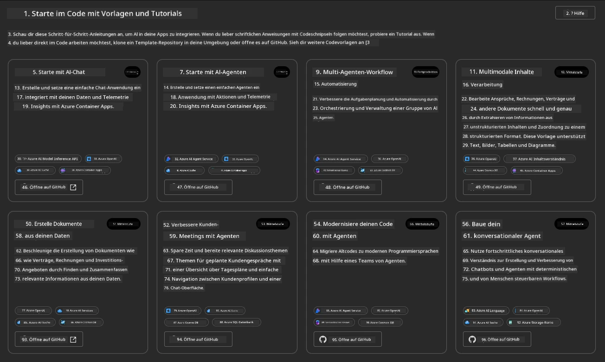


Die **Basic**-Optionen sind Ihre Startervorlagen:

1. [ ] [Get Started with AI Chat](https://github.com/Azure-Samples/get-started-with-ai-chat) das eine einfache Chat-Anwendung _mit Ihren Daten_ zu Azure Container Apps bereitstellt. Verwenden Sie dies, um ein einfaches KI-Chatbot-Szenario zu erkunden.
1. [X] [Get Started with AI Agents](https://github.com/Azure-Samples/get-started-with-ai-agents) das außerdem einen Standard-AI-Agenten (mit den Foundry Agents) bereitstellt. Verwenden Sie dies, um sich mit agentenbasierten KI-Lösungen vertraut zu machen, die Werkzeuge und Modelle einbinden.

Öffnen Sie den zweiten Link in einem neuen Browser-Tab (oder klicken Sie auf `Open in GitHub` für die zugehörige Karte). Sie sollten das Repository für dieses AZD-Template sehen. Nehmen Sie sich eine Minute, um die README zu erkunden. Die Anwendungsarchitektur sieht so aus:

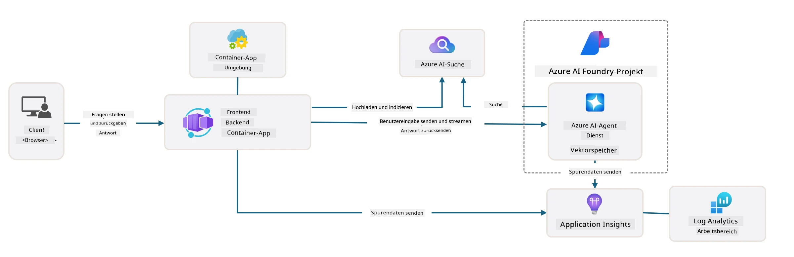

---

## 3. Aktivierung der Vorlage

Versuchen wir, diese Vorlage bereitzustellen und sicherzustellen, dass sie gültig ist. Wir folgen den Richtlinien im Abschnitt [Getting Started](https://github.com/Azure-Samples/get-started-with-ai-agents?tab=readme-ov-file#getting-started).

1. Klicken Sie auf [diesen Link](https://github.com/codespaces/new/Azure-Samples/get-started-with-ai-agents) - bestätigen Sie die Standardaktion `Create codespace`
1. Dies öffnet einen neuen Browser-Tab - warten Sie, bis die GitHub Codespaces-Sitzung vollständig geladen ist
1. Öffnen Sie das VS Code-Terminal in Codespaces - geben Sie den folgenden Befehl ein:

   ```bash title="" linenums="0"
   azd up
   ```

Führen Sie die Workflow-Schritte aus, die dadurch ausgelöst werden:

1. Sie werden aufgefordert, sich bei Azure anzumelden - folgen Sie den Anweisungen zur Authentifizierung
1. Geben Sie einen eindeutigen Umgebungsnamen für sich ein - z. B. habe ich `nitya-mshack-azd` verwendet
1. Dadurch wird ein `.azure/`-Ordner erstellt - Sie sehen einen Unterordner mit dem Umgebungsnamen
1. Sie werden aufgefordert, einen Abonnementnamen auszuwählen - wählen Sie das Standardabonnement
1. Sie werden nach einem Standort gefragt - verwenden Sie `East US 2`

Nun warten Sie, bis die Bereitstellung abgeschlossen ist. **Das dauert 10–15 Minuten**

1. Wenn sie abgeschlossen ist, zeigt Ihre Konsole eine SUCCESS-Nachricht wie diese an:
      ```bash title="" linenums="0"
      SUCCESS: Your up workflow to provision and deploy to Azure completed in 10 minutes 17 seconds.
      ```
1. Ihr Azure-Portal enthält nun eine bereitgestellte Ressourcengruppe mit diesem Umgebungsnamen:

      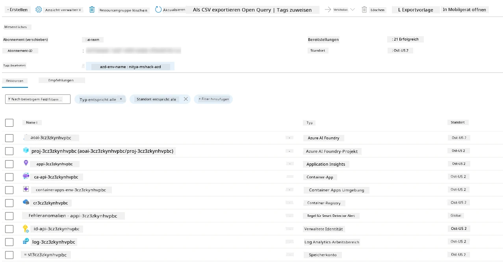

1. **Sie sind jetzt bereit, die bereitgestellte Infrastruktur und Anwendung zu validieren**.

---

## 4. Vorlagenvalidierung

1. Besuchen Sie die Azure-Portal-Seite [Resource Groups](https://portal.azure.com/#browse/resourcegroups) - melden Sie sich bei Aufforderung an
1. Klicken Sie auf die RG für Ihren Umgebungsnamen - Sie sehen die obige Seite

      - Klicken Sie auf die Azure Container Apps-Ressource
      - Klicken Sie auf die Application Url im _Essentials_-Abschnitt (oben rechts)

1. Sie sollten eine gehostete Frontend-Benutzeroberfläche der Anwendung wie diese sehen:

   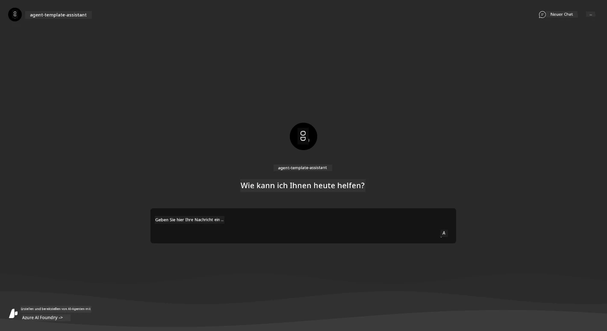

1. Versuchen Sie, ein paar [Beispielfragen](https://github.com/Azure-Samples/get-started-with-ai-agents/blob/main/docs/sample_questions.md) zu stellen

      1. Fragen: ```What is the capital of France?``` 
      1. Fragen: ```What's the best tent under $200 for two people, and what features does it include?```

1. Sie sollten Antworten ähnlich denen unten erhalten. _Aber wie funktioniert das?_ 

      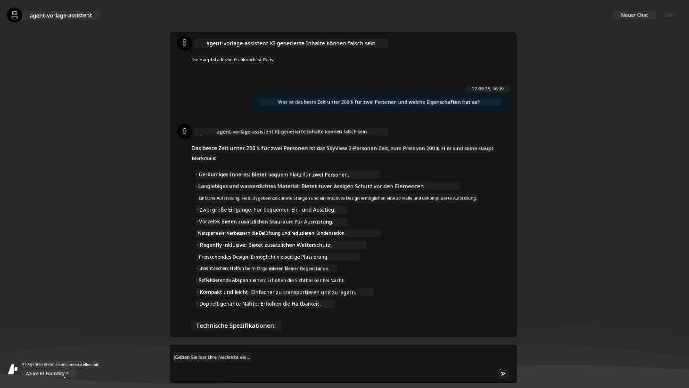

---

## 5.  Agentenvalidierung

Die Azure Container App stellt einen Endpunkt bereit, der mit dem AI Agent verbindet, der im Microsoft Foundry-Projekt für diese Vorlage bereitgestellt wurde. Schauen wir uns an, was das bedeutet.

1. Kehren Sie zur Azure-Portal-_Overview_-Seite Ihrer Ressourcengruppe zurück

1. Klicken Sie in dieser Liste auf die Ressource `Microsoft Foundry`

1. Sie sollten dies sehen. Klicken Sie auf die Schaltfläche `Go to Microsoft Foundry Portal`. 
   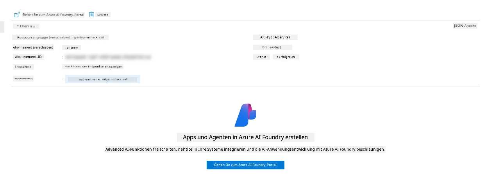

1. Sie sollten die Foundry-Projektseite für Ihre KI-Anwendung sehen
   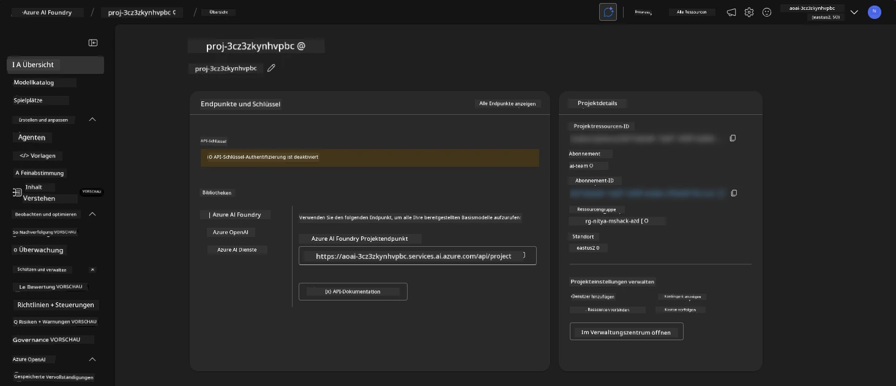

1. Klicken Sie auf `Agents` - Sie sehen den standardmäßigen Agenten, der in Ihrem Projekt bereitgestellt wurde
   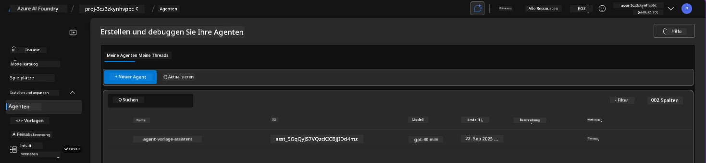

1. Wählen Sie ihn aus - und Sie sehen die Agentendetails. Beachten Sie Folgendes:

      - Der Agent verwendet standardmäßig (immer) File Search
      - Das Feld `Knowledge` des Agenten zeigt an, dass 32 Dateien hochgeladen wurden (für die Dateisuche)
      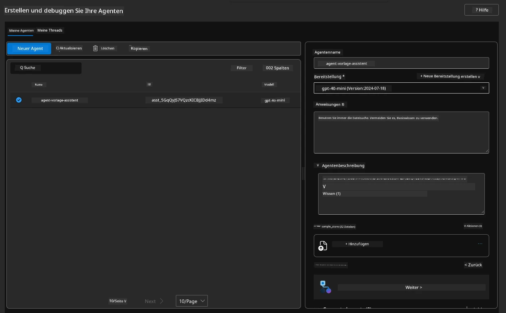

1. Suchen Sie in der linken Menüleiste die Option `Data+indexes` und klicken Sie für Details. 

      - Sie sollten die 32 für Knowledge hochgeladenen Datendateien sehen.
      - Diese entsprechen den 12 Kundendateien und 20 Produktdateien unter `src/files` 
      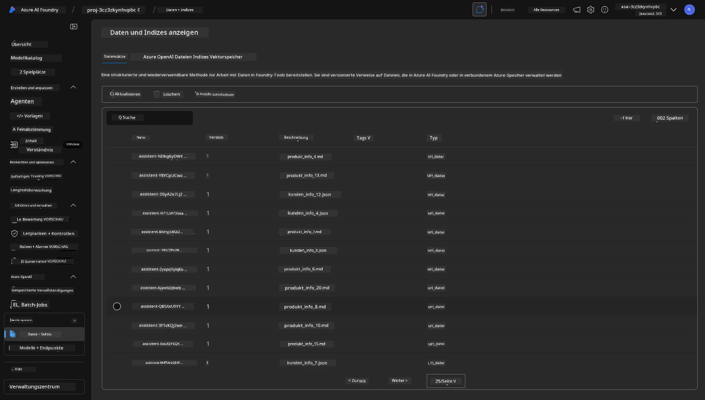

**Sie haben den Agentenbetrieb validiert!** 

1. Die Antworten des Agenten basieren auf dem Wissen in diesen Dateien. 
1. Sie können nun Fragen zu diesen Daten stellen und fundierte Antworten erhalten.
1. Beispiel: `customer_info_10.json` beschreibt die 3 Einkäufe von "Amanda Perez"

Rufen Sie den Browser-Tab mit dem Container-App-Endpunkt wieder auf und fragen Sie: `What products does Amanda Perez own?`. Sie sollten so etwas sehen:

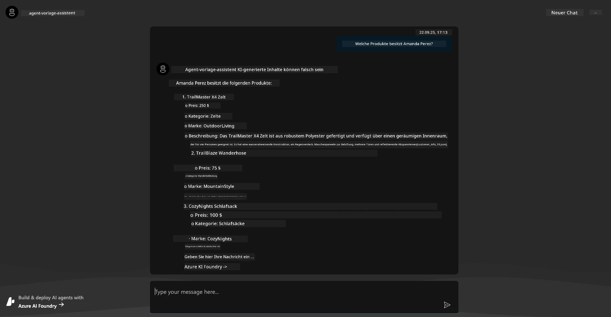

---

## 6. Agenten-Playground

Lassen Sie uns ein besseres Gefühl für die Fähigkeiten von Microsoft Foundry entwickeln, indem wir den Agenten im Agenten-Playground ausprobieren. 

1. Kehren Sie zur `Agents`-Seite in Microsoft Foundry zurück - wählen Sie den Standardagenten aus
1. Klicken Sie auf die Option `Try in Playground` - Sie sollten eine Playground-Benutzeroberfläche wie diese erhalten
1. Stellen Sie dieselbe Frage: `What products does Amanda Perez own?`

    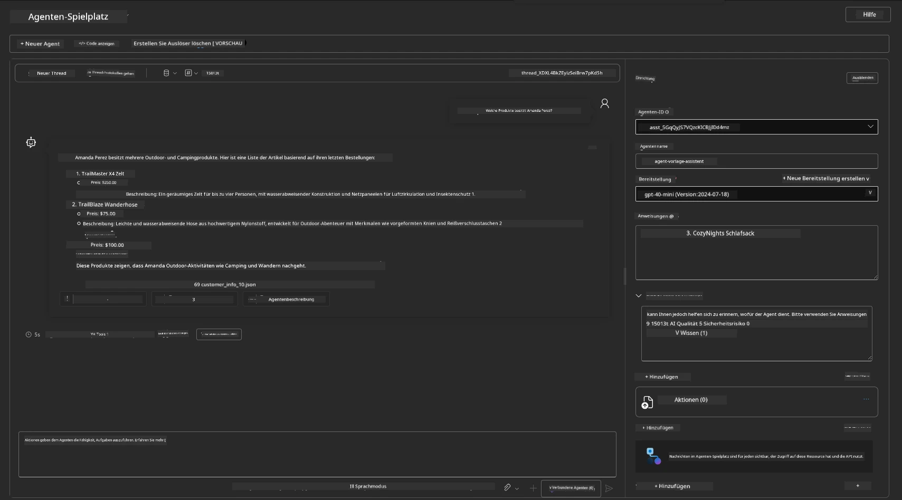

Sie erhalten dieselbe (oder eine ähnliche) Antwort - aber Sie erhalten auch zusätzliche Informationen, die Ihnen helfen können, die Qualität, Kosten und Leistung Ihrer agentenbasierten App zu verstehen. Zum Beispiel:

1. Beachten Sie, dass die Antwort die Datendateien angibt, die zur Untermauerung der Antwort verwendet wurden
1. Fahren Sie mit der Maus über eines dieser Dateietiketten - stimmen die Daten mit Ihrer Anfrage und der angezeigten Antwort überein?

Sie sehen außerdem eine _Stats_-Zeile unterhalb der Antwort. 

1. Fahren Sie mit der Maus über eine Metrik - z. B. Safety. Sie sehen so etwas
1. Entspricht die bewertete Einstufung Ihrer Einschätzung des Sicherheitsniveaus der Antwort?

      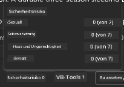

---

## 7. Eingebaute Beobachtbarkeit

Observability (Beobachtbarkeit) bedeutet, Ihre Anwendung so zu instrumentieren, dass Daten erzeugt werden, die zum Verstehen, Debuggen und Optimieren ihrer Abläufe verwendet werden können. Um ein Gefühl dafür zu bekommen:

1. Klicken Sie auf die Schaltfläche `View Run Info` - Sie sollten diese Ansicht sehen. Dies ist ein Beispiel für [Agent tracing](https://learn.microsoft.com/en-us/azure/ai-foundry/how-to/develop/trace-agents-sdk#view-trace-results-in-the-azure-ai-foundry-agents-playground) in Aktion. _Sie können diese Ansicht auch erhalten, indem Sie Thread Logs im Top-Level-Menü anklicken_.

   - Verschaffen Sie sich einen Überblick über die Ausführungsschritte und die vom Agenten eingesetzten Tools
   - Verstehen Sie die gesamte Token-Anzahl (im Vergleich zur Nutzung von Ausgabetokens) für die Antwort
   - Verstehen Sie die Latenz und wo Zeit bei der Ausführung verbracht wird

      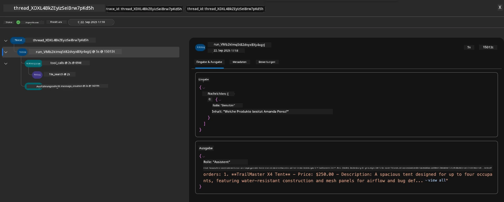

1. Klicken Sie auf die Registerkarte `Metadata`, um zusätzliche Attribute für den Lauf zu sehen, die später nützlichen Kontext zur Fehlerbehebung liefern können.   

      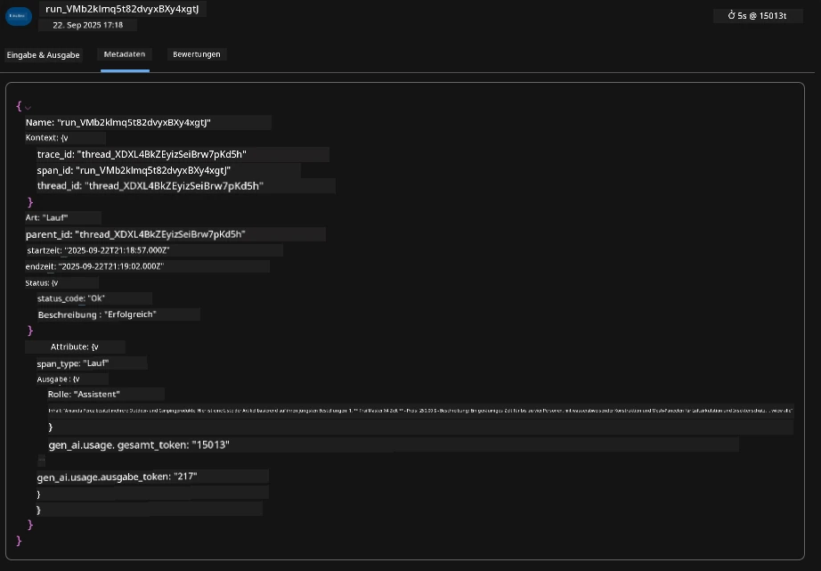


1. Klicken Sie auf die Registerkarte `Evaluations`, um die automatischen Bewertungen der Agentenantwort zu sehen. Diese umfassen Sicherheitsbewertungen (z. B. Self-harm) und agentspezifische Bewertungen (z. B. Intent-Auflösung, Aufgabentreue).

      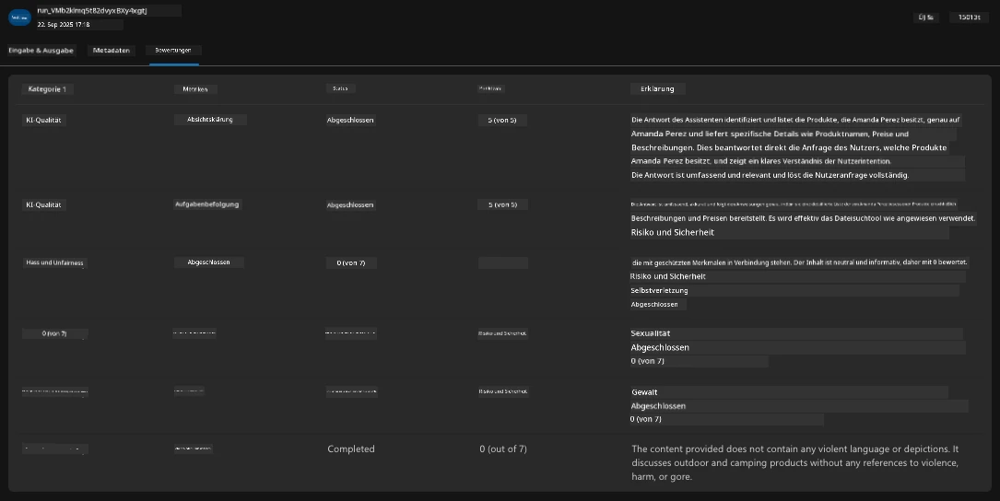

1. Zuletzt, aber nicht weniger wichtig, klicken Sie auf die Registerkarte `Monitoring` im Seitenmenü.

      - Wählen Sie die Registerkarte `Resource usage` in der angezeigten Seite - und sehen Sie sich die Metriken an.
      - Verfolgen Sie die Anwendungsnutzung in Bezug auf Kosten (Tokens) und Auslastung (Anfragen).
      - Verfolgen Sie die Anwendungs-Latenz bis zum ersten Byte (Eingabeverarbeitung) und letzten Byte (Ausgabe).

      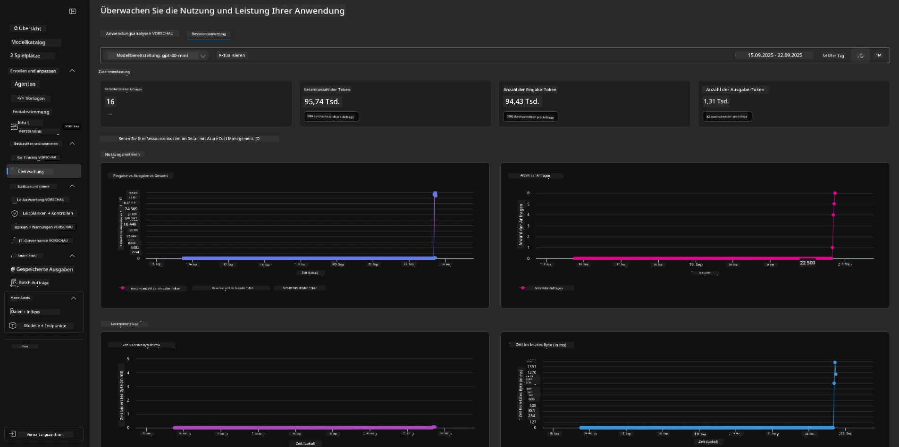

---

## 8. Umgebungsvariablen

Bisher haben wir die Bereitstellung im Browser durchlaufen und validiert, dass unsere Infrastruktur bereitgestellt ist und die Anwendung betriebsbereit ist. Um jedoch codezentriert mit der Anwendung zu arbeiten, müssen wir unsere lokale Entwicklungsumgebung mit den relevanten Variablen konfigurieren, die erforderlich sind, um mit diesen Ressourcen zu arbeiten. Mit `azd` ist das einfach.

1. Die Azure Developer CLI [verwendet Umgebungsvariablen](https://learn.microsoft.com/en-us/azure/developer/azure-developer-cli/manage-environment-variables?tabs=bash) zum Speichern und Verwalten von Konfigurationseinstellungen für die Anwendungsbereitstellungen.

1. Umgebungsvariablen werden in `.azure/<env-name>/.env` gespeichert - das grenzt sie an die während der Bereitstellung verwendete `env-name`-Umgebung ab und hilft Ihnen, Umgebungen zwischen verschiedenen Bereitstellungszielen im selben Repo zu isolieren.

1. Umgebungsvariablen werden vom `azd`-Befehl automatisch geladen, wann immer er einen bestimmten Befehl ausführt (z. B. `azd up`). Beachten Sie, dass `azd` nicht automatisch _OS-level_ Umgebungsvariablen (z. B. im Shell gesetzt) liest - verwenden Sie stattdessen `azd set env` und `azd get env`, um Informationen innerhalb von Skripten zu übertragen.


Probieren wir ein paar Befehle aus:

1. Rufen Sie alle für `azd` in dieser Umgebung gesetzten Umgebungsvariablen ab:

      ```bash title="" linenums="0"
      azd env get-values
      ```
      
      Sie sehen so etwas:

      ```bash title="" linenums="0"
      AZURE_AI_AGENT_DEPLOYMENT_NAME="gpt-4.1-mini"
      AZURE_AI_AGENT_NAME="agent-template-assistant"
      AZURE_AI_EMBED_DEPLOYMENT_NAME="text-embedding-3-small"
      AZURE_AI_EMBED_DIMENSIONS=100
      ...
      ```

1. Rufen Sie einen spezifischen Wert ab - z. B. möchte ich wissen, ob wir den Wert `AZURE_AI_AGENT_MODEL_NAME` gesetzt haben

      ```bash title="" linenums="0"
      azd env get-value AZURE_AI_AGENT_MODEL_NAME 
      ```
      
      Sie sehen so etwas - es wurde nicht standardmäßig gesetzt!

      ```bash title="" linenums="0"
      ERROR: key 'AZURE_AI_AGENT_MODEL_NAME' not found in the environment values
      ```

1. Setzen Sie eine neue Umgebungsvariable für `azd`. Hier aktualisieren wir den Agenten-Modellnamen. _Hinweis: Alle vorgenommenen Änderungen werden sofort in der Datei `.azure/<env-name>/.env` widerspiegelt.

      ```bash title="" linenums="0"
      azd env set AZURE_AI_AGENT_MODEL_NAME gpt-4.1
      azd env set AZURE_AI_AGENT_MODEL_VERSION 2025-04-14
      azd env set AZURE_AI_AGENT_DEPLOYMENT_CAPACITY 150
      ```

      Jetzt sollten wir feststellen, dass der Wert gesetzt ist:

      ```bash title="" linenums="0"
      azd env get-value AZURE_AI_AGENT_MODEL_NAME 
      ```

1. Beachten Sie, dass einige Ressourcen persistent sind (z. B. Modelldeployments) und mehr als nur ein `azd up` erfordern, um eine Neu-Bereitstellung zu erzwingen. Versuchen wir, die ursprüngliche Bereitstellung zu entfernen und mit geänderten Umgebungsvariablen erneut bereitzustellen.

1. **Refresh** Wenn Sie zuvor Infrastruktur mit einer azd-Vorlage bereitgestellt haben - können Sie den Zustand Ihrer lokalen Umgebungsvariablen basierend auf dem aktuellen Zustand Ihrer Azure-Bereitstellung mit diesem Befehl _refresh_:

      ```bash title="" linenums="0"
      azd env refresh
      ```

      Dies ist eine leistungsstarke Möglichkeit, Umgebungsvariablen zwischen zwei oder mehr lokalen Entwicklungsumgebungen zu _synchronisieren_ (z. B. ein Team mit mehreren Entwicklern) - wodurch die bereitgestellte Infrastruktur als verlässliche Quelle für den Zustand der Umgebungsvariablen dient. Teammitglieder müssen lediglich die Variablen _aktualisieren_, um wieder synchron zu sein.

---

## 9. Herzlichen Glückwunsch 🏆

Du hast gerade einen End-to-End-Workflow abgeschlossen, bei dem du:

- [X] Das AZD Template ausgewählt, das du verwenden möchtest
- [X] Das Template mit GitHub Codespaces gestartet
- [X] Das Template bereitgestellt und überprüft, dass es funktioniert

---

<!-- CO-OP TRANSLATOR DISCLAIMER START -->
**Haftungsausschluss:**
Dieses Dokument wurde mithilfe des KI-Übersetzungsdienstes [Co-op Translator](https://github.com/Azure/co-op-translator) übersetzt. Obwohl wir uns um Genauigkeit bemühen, beachten Sie bitte, dass automatisierte Übersetzungen Fehler oder Ungenauigkeiten enthalten können. Das Originaldokument in seiner ursprünglichen Sprache ist als maßgebliche Quelle zu betrachten. Für kritische Informationen wird eine professionelle menschliche Übersetzung empfohlen. Wir übernehmen keine Haftung für Missverständnisse oder Fehlinterpretationen, die aus der Nutzung dieser Übersetzung entstehen.
<!-- CO-OP TRANSLATOR DISCLAIMER END -->