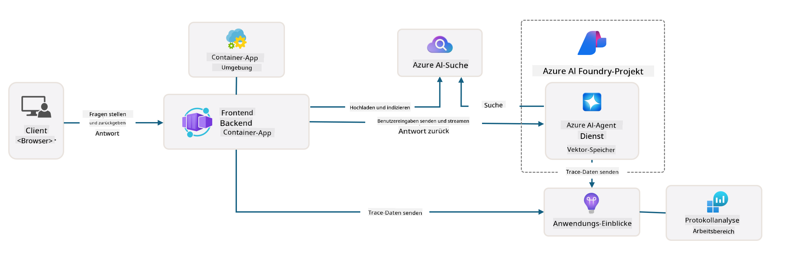

<!--
CO_OP_TRANSLATOR_METADATA:
{
  "original_hash": "4e403f041411361140d6beb88ab2a181",
  "translation_date": "2025-09-24T10:55:28+00:00",
  "source_file": "workshop/docs/instructions/3-Deconstruct-AI-Template.md",
  "language_code": "de"
}
-->
# 3. Zerlegen einer Vorlage

!!! tip "AM ENDE DIESES MODULS WERDEN SIE IN DER LAGE SEIN"

    - [ ] Punkt
    - [ ] Punkt
    - [ ] Punkt
    - [ ] **Lab 3:** 

---

Mit AZD-Vorlagen und der Azure Developer CLI (`azd`) können wir unsere KI-Entwicklungsreise schnell starten, indem wir standardisierte Repositories nutzen, die Beispielcode, Infrastruktur und Konfigurationsdateien bereitstellen – in Form eines einsatzbereiten _Starterprojekts_.

**Aber jetzt müssen wir die Projektstruktur und den Code verstehen – und in der Lage sein, die AZD-Vorlage anzupassen – ohne vorherige Erfahrung oder Verständnis von AZD!**

---

## 1. GitHub Copilot aktivieren

### 1.1 GitHub Copilot Chat installieren

Es ist Zeit, [GitHub Copilot mit Agent-Modus](https://code.visualstudio.com/docs/copilot/chat/chat-agent-mode) zu erkunden. Jetzt können wir Aufgaben in natürlicher Sprache auf hoher Ebene beschreiben und Unterstützung bei der Ausführung erhalten. Für dieses Lab verwenden wir den [Copilot Free-Plan](https://github.com/github-copilot/signup), der ein monatliches Limit für Abschlüsse und Chat-Interaktionen hat.

Die Erweiterung kann aus dem Marketplace installiert werden, sollte jedoch bereits in Ihrer Codespaces-Umgebung verfügbar sein. _Klicken Sie auf `Open Chat` im Dropdown-Menü des Copilot-Symbols und geben Sie eine Eingabeaufforderung wie `What can you do?` ein_ – möglicherweise werden Sie aufgefordert, sich anzumelden. **GitHub Copilot Chat ist bereit**.

### 1.2 MCP-Server installieren

Damit der Agent-Modus effektiv ist, benötigt er Zugriff auf die richtigen Tools, um Wissen abzurufen oder Aktionen auszuführen. Hier kommen MCP-Server ins Spiel. Wir konfigurieren die folgenden Server:

1. [Azure MCP Server](../../../../../workshop/docs/instructions)
1. [Microsoft Docs MCP Server](../../../../../workshop/docs/instructions)

Um diese zu aktivieren:

1. Erstellen Sie eine Datei namens `.vscode/mcp.json`, falls sie nicht existiert.
1. Kopieren Sie den folgenden Inhalt in diese Datei – und starten Sie die Server!
   ```json title=".vscode/mcp.json"
   {
      "servers": {
         "Azure MCP Server": {
            "command": "npx",
            "args": [
            "-y",
            "@azure/mcp@latest",
            "server",
            "start"
            ]
         },
         "microsoft.docs.mcp": {
            "type": "http",
            "url": "https://learn.microsoft.com/api/mcp"
         }
      }
   }
   ```

??? warning "Es kann ein Fehler auftreten, dass `npx` nicht installiert ist (klicken Sie zum Erweitern für die Lösung)"

      Um dies zu beheben, öffnen Sie die Datei `.devcontainer/devcontainer.json` und fügen Sie diese Zeile im Abschnitt "features" hinzu. Bauen Sie dann den Container neu. Jetzt sollte `npx` installiert sein.

      ```title="" linenums="0"
         "features": {
            "ghcr.io/devcontainers/features/node:1": {},
            ...
         },
      ```

---

### 1.3 GitHub Copilot Chat testen

**Verwenden Sie zuerst `az login`, um sich über die VS Code-Befehlszeile bei Azure zu authentifizieren.**

Sie sollten nun in der Lage sein, den Status Ihres Azure-Abonnements abzufragen und Fragen zu bereitgestellten Ressourcen oder Konfigurationen zu stellen. Probieren Sie diese Eingabeaufforderungen aus:

1. `List my Azure resource groups`
1. `#foundry list my current deployments`

Sie können auch Fragen zur Azure-Dokumentation stellen und Antworten erhalten, die auf dem Microsoft Docs MCP-Server basieren. Probieren Sie diese Eingabeaufforderungen aus:

1. `#microsoft_docs_search What is Azure Developer CLI?`
1. `#microsoft_docs_search Show me a Python tutorial to chat with deployed model`

Oder Sie können nach Codebeispielen fragen, um eine Aufgabe zu erledigen. Probieren Sie diese Eingabeaufforderung aus:

1. `Give me a Python code example that uses AAD for an interactive chat client`

Im `Ask`-Modus wird Code bereitgestellt, den Sie kopieren und ausprobieren können. Im `Agent`-Modus könnte dies einen Schritt weiter gehen und die relevanten Ressourcen für Sie erstellen – einschließlich Setup-Skripten und Dokumentation – um Ihnen bei der Ausführung der Aufgabe zu helfen.

**Sie sind jetzt bereit, das Vorlagen-Repository zu erkunden**

---

## 2. Architektur zerlegen

??? prompt "ASK: Erklären Sie die Anwendungsarchitektur in docs/images/architecture.png in einem Absatz"

      Diese Anwendung ist eine KI-gestützte Chat-Anwendung, die auf Azure basiert und eine moderne agentenbasierte Architektur demonstriert. Die Lösung konzentriert sich auf eine Azure Container App, die den Hauptanwendungscode hostet, der Benutzereingaben verarbeitet und intelligente Antworten durch einen KI-Agenten generiert. 
      
      Die Architektur nutzt das Azure AI Foundry Project als Grundlage für KI-Funktionen und verbindet sich mit Azure AI Services, die die zugrunde liegenden Sprachmodelle (wie GPT-4o-mini) und Agentenfunktionen bereitstellen. Benutzerinteraktionen fließen durch ein React-basiertes Frontend zu einem FastAPI-Backend, das mit dem KI-Agenten-Service kommuniziert, um kontextbezogene Antworten zu generieren. 
      
      Das System umfasst Wissensabruf-Funktionen entweder durch Dateisuche oder den Azure AI Search-Dienst, wodurch der Agent Informationen aus hochgeladenen Dokumenten abrufen und zitieren kann. Für operative Exzellenz umfasst die Architektur umfassendes Monitoring durch Application Insights und Log Analytics Workspace für Tracing, Logging und Leistungsoptimierung. 
      
      Azure Storage bietet Blob-Speicher für Anwendungsdaten und Datei-Uploads, während Managed Identity einen sicheren Zugriff zwischen Azure-Ressourcen ohne Speicherung von Anmeldeinformationen gewährleistet. Die gesamte Lösung ist auf Skalierbarkeit und Wartbarkeit ausgelegt, wobei die containerisierte Anwendung automatisch basierend auf der Nachfrage skaliert und gleichzeitig integrierte Sicherheits-, Überwachungs- und CI/CD-Funktionen durch das Azure Managed Services-Ökosystem bietet.



---

## 3. Repository-Struktur

!!! prompt "ASK: Erklären Sie die Ordnerstruktur der Vorlage. Beginnen Sie mit einem visuellen hierarchischen Diagramm."

??? info "ANSWER: Visuelles hierarchisches Diagramm"

      ```bash title="" 
      get-started-with-ai-agents/
      ├── 📋 Konfiguration & Setup
      │   ├── azure.yaml                    # Azure Developer CLI-Konfiguration
      │   ├── docker-compose.yaml           # Lokale Entwicklungscontainer
      │   ├── pyproject.toml                # Python-Projektkonfiguration
      │   ├── requirements-dev.txt          # Entwicklungsabhängigkeiten
      │   └── .devcontainer/                # VS Code Dev-Container-Setup
      │
      ├── 🏗️ Infrastruktur (infra/)
      │   ├── main.bicep                    # Haupt-Infrastrukturvorlage
      │   ├── api.bicep                     # API-spezifische Ressourcen
      │   ├── main.parameters.json          # Infrastrukturparameter
      │   └── core/                         # Modulare Infrastrukturkomponenten
      │       ├── ai/                       # KI-Dienstkonfigurationen
      │       ├── host/                     # Hosting-Infrastruktur
      │       ├── monitor/                  # Überwachung und Logging
      │       ├── search/                   # Azure AI Search-Setup
      │       ├── security/                 # Sicherheit und Identität
      │       └── storage/                  # Speicheraccount-Konfigurationen
      │
      ├── 💻 Anwendungscode (src/)
      │   ├── api/                          # Backend-API
      │   │   ├── main.py                   # FastAPI-Anwendungseinstieg
      │   │   ├── routes.py                 # API-Routen-Definitionen
      │   │   ├── search_index_manager.py   # Suchfunktionalität
      │   │   ├── data/                     # API-Datenverarbeitung
      │   │   ├── static/                   # Statische Web-Assets
      │   │   └── templates/                # HTML-Vorlagen
      │   ├── frontend/                     # React/TypeScript-Frontend
      │   │   ├── package.json              # Node.js-Abhängigkeiten
      │   │   ├── vite.config.ts            # Vite-Build-Konfiguration
      │   │   └── src/                      # Frontend-Quellcode
      │   ├── data/                         # Beispieldateien
      │   │   └── embeddings.csv            # Vorgefertigte Embeddings
      │   ├── files/                        # Wissensbasis-Dateien
      │   │   ├── customer_info_*.json      # Beispieldaten von Kunden
      │   │   └── product_info_*.md         # Produktdokumentation
      │   ├── Dockerfile                    # Container-Konfiguration
      │   └── requirements.txt              # Python-Abhängigkeiten
      │
      ├── 🔧 Automatisierung & Skripte (scripts/)
      │   ├── postdeploy.sh/.ps1           # Post-Deployment-Setup
      │   ├── setup_credential.sh/.ps1     # Anmeldeinformationen-Konfiguration
      │   ├── validate_env_vars.sh/.ps1    # Umgebungsvalidierung
      │   └── resolve_model_quota.sh/.ps1  # Modellkontingentverwaltung
      │
      ├── 🧪 Tests & Evaluierung
      │   ├── tests/                        # Unit- und Integrationstests
      │   │   └── test_search_index_manager.py
      │   ├── evals/                        # Evaluierungsframework für Agenten
      │   │   ├── evaluate.py               # Evaluierungsrunner
      │   │   ├── eval-queries.json         # Testabfragen
      │   │   └── eval-action-data-path.json
      │   ├── sandbox/                      # Entwicklungs-Spielwiese
      │   │   ├── 1-quickstart.py           # Einstieg-Beispiele
      │   │   └── aad-interactive-chat.py   # Authentifizierungs-Beispiele
      │   └── airedteaming/                 # KI-Sicherheitsbewertung
      │       └── ai_redteaming.py          # Red-Team-Tests
      │
      ├── 📚 Dokumentation (docs/)
      │   ├── deployment.md                 # Deployment-Anleitung
      │   ├── local_development.md          # Lokale Setup-Anweisungen
      │   ├── troubleshooting.md            # Häufige Probleme & Lösungen
      │   ├── azure_account_setup.md        # Azure-Voraussetzungen
      │   └── images/                       # Dokumentations-Assets
      │
      └── 📄 Projekt-Metadaten
         ├── README.md                     # Projektübersicht
         ├── CODE_OF_CONDUCT.md           # Community-Richtlinien
         ├── CONTRIBUTING.md              # Beitragshinweise
         ├── LICENSE                      # Lizenzbedingungen
         └── next-steps.md                # Anleitung nach der Bereitstellung
      ```

### 3.1 Kern-App-Architektur

Diese Vorlage folgt einem **Full-Stack-Webanwendungs**-Muster mit:

- **Backend**: Python FastAPI mit Azure KI-Integration
- **Frontend**: TypeScript/React mit Vite-Build-System
- **Infrastruktur**: Azure Bicep-Vorlagen für Cloud-Ressourcen
- **Containerisierung**: Docker für konsistente Bereitstellung

### 3.2 Infrastruktur als Code (bicep)

Die Infrastrukturschicht verwendet **Azure Bicep**-Vorlagen, die modular organisiert sind:

   - **`main.bicep`**: Orchestriert alle Azure-Ressourcen
   - **`core/` Module**: Wiederverwendbare Komponenten für verschiedene Dienste
      - KI-Dienste (Azure OpenAI, AI Search)
      - Container-Hosting (Azure Container Apps)
      - Überwachung (Application Insights, Log Analytics)
      - Sicherheit (Key Vault, Managed Identity)

### 3.3 Anwendungscode (`src/`)

**Backend-API (`src/api/`)**:

- REST-API auf Basis von FastAPI
- Integration des Azure KI-Agenten-Dienstes
- Suchindex-Verwaltung für Wissensabruf
- Datei-Upload und Verarbeitungsfunktionen

**Frontend (`src/frontend/`)**:

- Modernes React/TypeScript SPA
- Vite für schnelle Entwicklung und optimierte Builds
- Chat-Oberfläche für Agenten-Interaktionen

**Wissensbasis (`src/files/`)**:

- Beispiel-Kunden- und Produktdaten
- Demonstriert dateibasierten Wissensabruf
- JSON- und Markdown-Format-Beispiele

### 3.4 DevOps & Automatisierung

**Skripte (`scripts/`)**:

- Plattformübergreifende PowerShell- und Bash-Skripte
- Validierung und Einrichtung der Umgebung
- Post-Deployment-Konfiguration
- Modellkontingentverwaltung

**Azure Developer CLI-Integration**:

- `azure.yaml`-Konfiguration für `azd`-Workflows
- Automatisierte Bereitstellung und Provisionierung
- Verwaltung von Umgebungsvariablen

### 3.5 Tests & Qualitätssicherung

**Evaluierungsframework (`evals/`)**:

- Leistungsbewertung des Agenten
- Qualitätstests für Abfrage-Antworten
- Automatisierte Bewertungs-Pipeline

**KI-Sicherheit (`airedteaming/`)**:

- Red-Team-Tests für KI-Sicherheit
- Scannen von Sicherheitslücken
- Verantwortungsvolle KI-Praktiken

---

## 4. Herzlichen Glückwunsch 🏆

Sie haben erfolgreich GitHub Copilot Chat mit MCP-Servern verwendet, um das Repository zu erkunden.

- [X] GitHub Copilot für Azure aktiviert
- [X] Die Anwendungsarchitektur verstanden
- [X] Die AZD-Vorlagenstruktur erkundet

Dies gibt Ihnen einen Überblick über die _Infrastruktur als Code_-Assets für diese Vorlage. Als Nächstes schauen wir uns die Konfigurationsdatei für AZD an.

---

