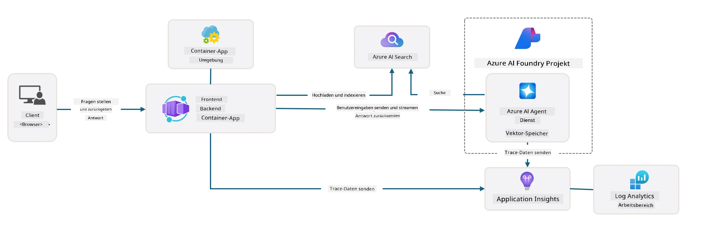

# 3. Eine Vorlage dekonstruieren

!!! tip "AM ENDE DIESES MODULS WERDEN SIE FOLGENDES KÖNNEN"

    - [ ] GitHub Copilot mit MCP-Servern für Azure-Unterstützung aktivieren
    - [ ] Die AZD-Template-Ordnerstruktur und Komponenten verstehen
    - [ ] Muster zur Organisation von Infrastructure-as-Code (Bicep) erkunden
    - [ ] **Lab 3:** GitHub Copilot verwenden, um Repository-Architektur zu erkunden und zu verstehen 

---


Mit AZD-Vorlagen und der Azure Developer CLI (`azd`) können wir unsere KI-Entwicklungsreise schnell mit standardisierten Repositorien starten, die Beispielcode, Infrastruktur- und Konfigurationsdateien bereitstellen – in Form eines einsatzbereiten _Starter_-Projekts.

**Aber jetzt müssen wir die Projektstruktur und den Codebestand verstehen - und die AZD-Vorlage anpassen können - ohne vorherige Erfahrung oder Kenntnisse von AZD!**

---

## 1. GitHub Copilot aktivieren

### 1.1 GitHub Copilot Chat installieren

Es ist Zeit, [GitHub Copilot mit Agentenmodus](https://code.visualstudio.com/docs/copilot/chat/chat-agent-mode) zu erkunden. Nun können wir natürliche Sprache verwenden, um unsere Aufgabe auf hoher Ebene zu beschreiben und Unterstützung bei der Ausführung zu erhalten. Für dieses Lab verwenden wir den [kostenlosen Copilot-Plan](https://github.com/github-copilot/signup), der ein monatliches Limit für Completion- und Chat-Interaktionen hat.

Die Erweiterung kann aus dem Marketplace installiert werden, sollte aber bereits in Ihrer Codespaces-Umgebung verfügbar sein. _Klicken Sie im Dropdown-Menü des Copilot-Symbols auf `Open Chat` - und geben Sie eine Eingabeaufforderung wie `What can you do?` ein_ - es kann sein, dass Sie sich anmelden müssen. **GitHub Copilot Chat ist einsatzbereit**.

### 1.2. MCP-Server installieren

Damit der Agentenmodus effektiv ist, benötigt er Zugriff auf die richtigen Tools, die ihm helfen, Wissen abzurufen oder Aktionen auszuführen. Hier können MCP-Server helfen. Wir konfigurieren die folgenden Server:

1. [Azure MCP Server](../../../../../workshop/docs/instructions)
1. [Microsoft Docs MCP Server](../../../../../workshop/docs/instructions)

Um diese zu aktivieren:

1. Erstellen Sie eine Datei namens `.vscode/mcp.json`, falls sie nicht existiert
1. Kopieren Sie Folgendes in diese Datei - und starten Sie die Server!
   ```json title=".vscode/mcp.json"
   {
      "servers": {
         "Azure MCP Server": {
            "command": "npx",
            "args": [
            "-y",
            "@azure/mcp@latest",
            "server",
            "start"
            ]
         },
         "microsoft.docs.mcp": {
            "type": "http",
            "url": "https://learn.microsoft.com/api/mcp"
         }
      }
   }
   ```

??? warning "Möglicherweise erhalten Sie einen Fehler, dass `npx` nicht installiert ist (zum Beheben anklicken)"

      Zur Behebung öffnen Sie die Datei `.devcontainer/devcontainer.json` und fügen Sie diese Zeile zum Features-Abschnitt hinzu. Bauen Sie dann den Container neu. Sie sollten jetzt `npx` installiert haben.

      ```title="" linenums="0"
         "features": {
            "ghcr.io/devcontainers/features/node:1": {},
            ...
         },
      ```

---

### 1.3 GitHub Copilot Chat testen

**Verwenden Sie zuerst `az login`, um sich von der VS Code-Befehlszeile bei Azure zu authentifizieren.**

Sie sollten nun in der Lage sein, den Status Ihres Azure-Abonnements abzufragen und Fragen zu bereitgestellten Ressourcen oder Konfigurationen zu stellen. Probieren Sie diese Eingaben aus:

1. `List my Azure resource groups`
1. `#foundry list my current deployments`

Sie können auch Fragen zur Azure-Dokumentation stellen und Antworten erhalten, die auf dem Microsoft Docs MCP-Server basieren. Probieren Sie diese Eingaben aus:

1. `#microsoft_docs_search What is Azure Developer CLI?`
1. `#microsoft_docs_search Show me a Python tutorial to chat with deployed model`

Oder Sie können nach Codebeispielen fragen, um eine Aufgabe zu erledigen. Probieren Sie diese Eingabe aus.

1. `Give me a Python code example that uses AAD for an interactive chat client`

Im `Ask`-Modus erhalten Sie Code, den Sie kopieren und ausprobieren können. Im `Agent`-Modus kann dies einen Schritt weiter gehen und die relevanten Ressourcen für Sie erstellen – einschließlich Einrichtungs-Skripten und Dokumentation – um Ihnen bei der Ausführung dieser Aufgabe zu helfen.

**Sie sind nun ausgestattet, um das Template-Repository zu erkunden**

---

## 2. Architektur dekonstruieren

??? prompt "FRAGE: Erkläre die Anwendungsarchitektur in docs/images/architecture.png in 1 Absatz"

      Diese Anwendung ist eine KI-gestützte Chat-Anwendung, die auf Azure aufgebaut ist und eine moderne, agentenbasierte Architektur demonstriert. Die Lösung konzentriert sich auf eine Azure Container App, die den Hauptanwendungscode hostet, welcher Benutzereingaben verarbeitet und durch einen KI-Agenten intelligente Antworten generiert. 
      
      Die Architektur nutzt das Microsoft Foundry Project als Grundlage für KI-Funktionen und stellt Verbindungen zu Azure AI Services her, die die zugrunde liegenden Sprachmodelle (wie GPT-4o-mini) und Agentenfunktionalitäten bereitstellen. Benutzerinteraktionen fließen über ein React-basiertes Frontend zu einem FastAPI-Backend, das mit dem KI-Agenten-Service zur Generierung kontextueller Antworten kommuniziert. 
      
      Das System integriert Wissensabruf-Funktionen entweder über Dateisuche oder den Azure AI Search-Dienst, wodurch der Agent auf hochgeladene Dokumente zugreifen und daraus zitieren kann. Für betriebliche Exzellenz umfasst die Architektur umfassendes Monitoring über Application Insights und ein Log Analytics Workspace für Tracing, Logging und Performance-Optimierung. 
      
      Azure Storage bietet Blob-Speicher für Anwendungsdaten und Datei-Uploads, während Managed Identity einen sicheren Zugriff zwischen Azure-Ressourcen ohne Speicherung von Anmeldeinformationen gewährleistet. Die gesamte Lösung ist auf Skalierbarkeit und Wartbarkeit ausgelegt, wobei die containerisierte Anwendung sich automatisch je nach Bedarf skaliert und integrierte Sicherheits-, Monitor- und CI/CD-Funktionen durch das verwaltete Azure-Service-Ökosystem bereitstellt.



---

## 3. Repository-Struktur

!!! prompt "FRAGE: Erkläre die Ordnerstruktur der Vorlage. Beginne mit einem visuellen hierarchischen Diagramm."

??? info "ANTWORT: Visuelles hierarchisches Diagramm"

      ```bash title="" 
      get-started-with-ai-agents/
      ├── 📋 Configuration & Setup
      │   ├── azure.yaml                    # Azure Developer CLI configuration
      │   ├── docker-compose.yaml           # Local development containers
      │   ├── pyproject.toml                # Python project configuration
      │   ├── requirements-dev.txt          # Development dependencies
      │   └── .devcontainer/                # VS Code dev container setup
      │
      ├── 🏗️ Infrastructure (infra/)
      │   ├── main.bicep                    # Main infrastructure template
      │   ├── api.bicep                     # API-specific resources
      │   ├── main.parameters.json          # Infrastructure parameters
      │   └── core/                         # Modular infrastructure components
      │       ├── ai/                       # AI service configurations
      │       ├── host/                     # Hosting infrastructure
      │       ├── monitor/                  # Monitoring and logging
      │       ├── search/                   # Azure AI Search setup
      │       ├── security/                 # Security and identity
      │       └── storage/                  # Storage account configs
      │
      ├── 💻 Application Source (src/)
      │   ├── api/                          # Backend API
      │   │   ├── main.py                   # FastAPI application entry
      │   │   ├── routes.py                 # API route definitions
      │   │   ├── search_index_manager.py   # Search functionality
      │   │   ├── data/                     # API data handling
      │   │   ├── static/                   # Static web assets
      │   │   └── templates/                # HTML templates
      │   ├── frontend/                     # React/TypeScript frontend
      │   │   ├── package.json              # Node.js dependencies
      │   │   ├── vite.config.ts            # Vite build configuration
      │   │   └── src/                      # Frontend source code
      │   ├── data/                         # Sample data files
      │   │   └── embeddings.csv            # Pre-computed embeddings
      │   ├── files/                        # Knowledge base files
      │   │   ├── customer_info_*.json      # Customer data samples
      │   │   └── product_info_*.md         # Product documentation
      │   ├── Dockerfile                    # Container configuration
      │   └── requirements.txt              # Python dependencies
      │
      ├── 🔧 Automation & Scripts (scripts/)
      │   ├── postdeploy.sh/.ps1           # Post-deployment setup
      │   ├── setup_credential.sh/.ps1     # Credential configuration
      │   ├── validate_env_vars.sh/.ps1    # Environment validation
      │   └── resolve_model_quota.sh/.ps1  # Model quota management
      │
      ├── 🧪 Testing & Evaluation
      │   ├── tests/                        # Unit and integration tests
      │   │   └── test_search_index_manager.py
      │   ├── evals/                        # Agent evaluation framework
      │   │   ├── evaluate.py               # Evaluation runner
      │   │   ├── eval-queries.json         # Test queries
      │   │   └── eval-action-data-path.json
      │   ├── sandbox/                      # Development playground
      │   │   ├── 1-quickstart.py           # Getting started examples
      │   │   └── aad-interactive-chat.py   # Authentication examples
      │   └── airedteaming/                 # AI safety evaluation
      │       └── ai_redteaming.py          # Red team testing
      │
      ├── 📚 Documentation (docs/)
      │   ├── deployment.md                 # Deployment guide
      │   ├── local_development.md          # Local setup instructions
      │   ├── troubleshooting.md            # Common issues & fixes
      │   ├── azure_account_setup.md        # Azure prerequisites
      │   └── images/                       # Documentation assets
      │
      └── 📄 Project Metadata
         ├── README.md                     # Project overview
         ├── CODE_OF_CONDUCT.md           # Community guidelines
         ├── CONTRIBUTING.md              # Contribution guide
         ├── LICENSE                      # License terms
         └── next-steps.md                # Post-deployment guidance
      ```

### 3.1. Kernarchitektur der App

Diese Vorlage folgt einem **Full-Stack-Webanwendungs**-Muster mit:

- **Backend**: Python FastAPI mit Azure AI-Integration
- **Frontend**: TypeScript/React mit Vite-Buildsystem
- **Infrastructure**: Azure Bicep-Vorlagen für Cloud-Ressourcen
- **Containerization**: Docker für konsistente Bereitstellungen

### 3.2 Infrastructure as Code (Bicep)

Die Infrastrukturschicht verwendet **Azure Bicep**-Vorlagen, die modular organisiert sind:

   - **`main.bicep`**: Orchestriert alle Azure-Ressourcen
   - **`core/` Module**: Wiederverwendbare Komponenten für verschiedene Dienste
      - AI-Dienste (Azure OpenAI, AI Search)
      - Container-Hosting (Azure Container Apps)
      - Monitoring (Application Insights, Log Analytics)
      - Sicherheit (Key Vault, Managed Identity)

### 3.3 Anwendungscode (`src/`)

**Backend-API (`src/api/`)**:

- REST-API basierend auf FastAPI
- Foundry Agents-Integration
- Verwaltung von Search-Indexen für Wissensabruf
- Datei-Upload- und Verarbeitungsfunktionen

**Frontend (`src/frontend/`)**:

- Moderne React/TypeScript-SPA
- Vite für schnelle Entwicklung und optimierte Builds
- Chat-Oberfläche für Agenten-Interaktionen

**Wissensbasis (`src/files/`)**:

- Beispielhafte Kunden- und Produktdaten
- Demonstriert dateibasierten Wissensabruf
- Beispiele im JSON- und Markdown-Format


### 3.4 DevOps & Automatisierung

**Skripte (`scripts/`)**:

- Plattformübergreifende PowerShell- und Bash-Skripte
- Umgebungsvalidierung und Einrichtung
- Post-Deployment-Konfiguration
- Verwaltung von Modellquoten

**Integration der Azure Developer CLI**:

- `azure.yaml` Konfiguration für `azd`-Workflows
- Automatisierte Bereitstellung und Provisionierung
- Verwaltung von Umgebungsvariablen

### 3.5 Test & Qualitätssicherung

**Evaluierungs-Framework (`evals/`)**:

- Bewertung der Agentenleistung
- Qualitätstests von Anfrage-Antworten
- Automatisierte Bewertungs-Pipeline

**KI-Sicherheit (`airedteaming/`)**:

- Red-Team-Tests zur KI-Sicherheit
- Sicherheitsüberprüfungen auf Schwachstellen
- Praktiken für verantwortungsvolle KI

---

## 4. Herzlichen Glückwunsch 🏆

Sie haben erfolgreich GitHub Copilot Chat mit MCP-Servern verwendet, um das Repository zu erkunden.

- [X] GitHub Copilot für Azure aktiviert
- [X] Die Anwendungsarchitektur verstanden
- [X] Die AZD-Template-Struktur erkundet

Dies gibt Ihnen einen Eindruck von den _Infrastructure as Code_-Ressourcen für diese Vorlage. Als Nächstes schauen wir uns die Konfigurationsdatei für AZD an.

---

<!-- CO-OP TRANSLATOR DISCLAIMER START -->
Haftungsausschluss:
Dieses Dokument wurde mit dem KI-Übersetzungsdienst Co-op Translator (https://github.com/Azure/co-op-translator) übersetzt. Obwohl wir um Genauigkeit bemüht sind, beachten Sie bitte, dass automatisierte Übersetzungen Fehler oder Ungenauigkeiten enthalten können. Das Originaldokument in seiner ursprünglichen Sprache ist als maßgebliche Quelle zu betrachten. Bei kritischen Informationen wird eine professionelle menschliche Übersetzung empfohlen. Wir übernehmen keine Haftung für Missverständnisse oder Fehlinterpretationen, die sich aus der Nutzung dieser Übersetzung ergeben.
<!-- CO-OP TRANSLATOR DISCLAIMER END -->