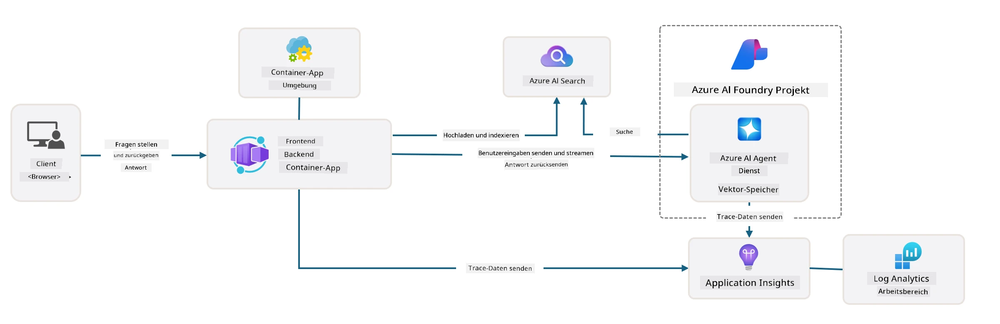

# 3. Eine Vorlage dekonstruieren

!!! tip "AM ENDE DIESES MODULS KÖNNEN SIE"

    - [ ] GitHub Copilot mit MCP-Servern für Azure-Unterstützung aktivieren
    - [ ] Die AZD-Vorlagenordnerstruktur und Komponenten verstehen
    - [ ] Infrastruktur-als-Code-(Bicep)-Organisationsmuster erkunden
    - [ ] **Lab 3:** GitHub Copilot verwenden, um die Repository-Architektur zu erkunden und zu verstehen

---


Mit AZD-Vorlagen und dem Azure Developer CLI (`azd`) können wir unsere KI-Entwicklungsreise schnell mit standardisierten Repositories starten, die Beispielcode, Infrastruktur- und Konfigurationsdateien in Form eines einsatzbereiten _Starter_-Projekts bereitstellen.

**Aber jetzt müssen wir die Projektstruktur und den Codebestand verstehen - und in der Lage sein, die AZD-Vorlage anzupassen - ohne Vorkenntnisse oder Verständnis von AZD!**

---

## 1. GitHub Copilot aktivieren

### 1.1 GitHub Copilot Chat installieren

Es ist Zeit, [GitHub Copilot im Agent-Modus](https://code.visualstudio.com/docs/copilot/chat/chat-agent-mode) zu erkunden. Jetzt können wir mit natürlicher Sprache unsere Aufgabe auf hoher Ebene beschreiben und Hilfe bei der Ausführung erhalten. Für dieses Lab verwenden wir den [Copilot Free plan](https://github.com/github-copilot/signup), der ein monatliches Limit für Completions und Chat-Interaktionen hat.

Die Erweiterung kann aus dem Marketplace installiert werden und ist oft bereits in Codespaces oder Dev-Container-Umgebungen verfügbar. _Klicken Sie im Dropdown des Copilot-Symbols auf `Open Chat` - und geben Sie eine Aufforderung wie `What can you do?` ein_ - Sie werden möglicherweise zur Anmeldung aufgefordert. **GitHub Copilot Chat ist einsatzbereit**.

### 1.2. MCP-Server installieren

Damit der Agent-Modus effektiv ist, benötigt er Zugriff auf die richtigen Tools, die ihm helfen, Wissen abzurufen oder Aktionen auszuführen. Hier können MCP-Server helfen. Wir konfigurieren die folgenden Server:

1. [Azure MCP Server](../../../../../workshop/docs/instructions)
1. [Microsoft Docs MCP Server](../../../../../workshop/docs/instructions)

Um diese zu aktivieren:

1. Erstellen Sie eine Datei namens `.vscode/mcp.json`, falls sie nicht existiert
1. Kopieren Sie das Folgende in diese Datei - und starten Sie die Server!
   ```json title=".vscode/mcp.json"
   {
      "servers": {
         "Azure MCP Server": {
            "command": "npx",
            "args": [
            "-y",
            "@azure/mcp@latest",
            "server",
            "start"
            ]
         },
         "microsoft.docs.mcp": {
            "type": "http",
            "url": "https://learn.microsoft.com/api/mcp"
         }
      }
   }
   ```

??? warning "Möglicherweise erhalten Sie einen Fehler, dass `npx` nicht installiert ist (zum Erweitern klicken, um die Lösung anzuzeigen)"

      Um dies zu beheben, öffnen Sie die Datei `.devcontainer/devcontainer.json` und fügen Sie diese Zeile im Abschnitt features hinzu. Bauen Sie dann den Container neu. Sie sollten nun `npx` installiert haben.

      ```title="" linenums="0"
         "features": {
            "ghcr.io/devcontainers/features/node:1": {},
            ...
         },
      ```

---

### 1.3. GitHub Copilot Chat testen

**Verwenden Sie zuerst `azd auth login`, um sich von der VS Code-Befehlszeile bei Azure zu authentifizieren. Verwenden Sie `az login` nur, wenn Sie Azure CLI-Befehle direkt ausführen möchten.**

Sie sollten jetzt in der Lage sein, den Status Ihres Azure-Abonnements abzufragen und Fragen zu bereitgestellten Ressourcen oder Konfigurationen zu stellen. Probieren Sie diese Eingaben aus:

1. `List my Azure resource groups`
1. `#foundry list my current deployments`

Sie können auch Fragen zur Azure-Dokumentation stellen und Antworten erhalten, die auf dem Microsoft Docs MCP-Server basieren. Probieren Sie diese Eingaben aus:

1. `#microsoft_docs_search What is Azure Developer CLI?`
1. `#microsoft_docs_search Show me a Python tutorial to chat with deployed model`

Oder Sie können nach Codeausschnitten fragen, um eine Aufgabe zu erledigen. Versuchen Sie diese Aufforderung.

1. `Give me a Python code example that uses AAD for an interactive chat client`

Im `Ask`-Modus erhalten Sie Code, den Sie kopieren und ausprobieren können. Im `Agent`-Modus kann dies einen Schritt weiter gehen und die relevanten Ressourcen für Sie erstellen - einschließlich Einrichtungsskripten und Dokumentation - um Ihnen bei der Ausführung dieser Aufgabe zu helfen.

**Sie sind nun ausgestattet, um das Template-Repository zu erkunden**

---

## 2. Architektur dekonstruieren

??? prompt "ASK: Erklären Sie die Anwendungsarchitektur in docs/images/architecture.png in einem Absatz"

      Diese Anwendung ist eine KI-gestützte Chat-Anwendung, die auf Azure aufgebaut ist und eine moderne, agentenbasierte Architektur demonstriert. Die Lösung konzentriert sich auf eine Azure Container App, die den Hauptanwendungscode hostet und Benutzereingaben verarbeitet sowie intelligente Antworten über einen KI-Agenten generiert.
      
      Die Architektur nutzt Microsoft Foundry Project als Grundlage für KI-Funktionen und verbindet sich mit Azure AI Services, die die zugrunde liegenden Sprachmodelle (z. B. gpt-4.1-mini) und Agentenfunktionalität bereitstellen. Benutzerinteraktionen fließen über ein React-basiertes Frontend zu einem FastAPI-Backend, das mit dem KI-Agenten-Service kommuniziert, um kontextuelle Antworten zu generieren.
      
      Das System integriert Wissensabruf-Funktionen entweder über Dateisuche oder den Azure AI Search-Dienst, sodass der Agent Informationen aus hochgeladenen Dokumenten abrufen und zitieren kann. Für operative Exzellenz umfasst die Architektur umfassendes Monitoring über Application Insights und Log Analytics Workspace zur Nachverfolgung, Protokollierung und Leistungsoptimierung.
      
      Azure Storage stellt Blob-Speicher für Anwendungsdaten und Datei-Uploads bereit, während Managed Identity einen sicheren Zugriff zwischen Azure-Ressourcen ohne Speicherung von Anmeldeinformationen gewährleistet. Die gesamte Lösung ist auf Skalierbarkeit und Wartbarkeit ausgelegt, wobei die containerisierte Anwendung je nach Bedarf automatisch skaliert und integrierte Sicherheits-, Überwachungs- und CI/CD-Funktionen über Azures verwaltete Dienste bietet.



---

## 3. Repository-Struktur

!!! prompt "ASK: Erklären Sie die Vorlagenordnerstruktur. Beginnen Sie mit einem visuellen hierarchischen Diagramm."

??? info "ANSWER: Visuelles hierarchisches Diagramm"

      ```bash title="" 
      get-started-with-ai-agents/
      ├── 📋 Konfiguration & Einrichtung
      │   ├── azure.yaml                    # Azure Developer CLI-Konfiguration
      │   ├── docker-compose.yaml           # Lokale Entwicklungscontainer
      │   ├── pyproject.toml                # Python-Projektkonfiguration
      │   ├── requirements-dev.txt          # Entwicklungsabhängigkeiten
      │   └── .devcontainer/                # VS Code dev container setup
      │
      ├── 🏗️ Infrastruktur (infra/)
      │   ├── main.bicep                    # Haupt-Infrastrukturvorlage
      │   ├── api.bicep                     # API-spezifische Ressourcen
      │   ├── main.parameters.json          # Infrastrukturparameter
      │   └── core/                         # Modulare Infrastrukturkomponenten
      │       ├── ai/                       # AI-Dienstkonfigurationen
      │       ├── host/                     # Hosting-Infrastruktur
      │       ├── monitor/                  # Monitoring und Protokollierung
      │       ├── search/                   # Azure AI Search-Einrichtung
      │       ├── security/                 # Sicherheit und Identität
      │       └── storage/                  # Speicherkonto-Konfigurationen
      │
      ├── 💻 Anwendungs-Quellcode (src/)
      │   ├── api/                          # Backend-API
      │   │   ├── main.py                   # FastAPI-Anwendungseinstiegspunkt
      │   │   ├── routes.py                 # API-Routendefinitionen
      │   │   ├── search_index_manager.py   # Suchfunktionalität
      │   │   ├── data/                     # API-Datenverarbeitung
      │   │   ├── static/                   # Statische Web-Assets
      │   │   └── templates/                # HTML-Vorlagen
      │   ├── frontend/                     # React/TypeScript-Frontend
      │   │   ├── package.json              # Node.js-Abhängigkeiten
      │   │   ├── vite.config.ts            # Vite-Build-Konfiguration
      │   │   └── src/                      # Frontend-Quellcode
      │   ├── data/                         # Beispieldatendateien
      │   │   └── embeddings.csv            # Vorgeberechnete Embeddings
      │   ├── files/                        # Wissensbasisdateien
      │   │   ├── customer_info_*.json      # Kundendaten-Beispiele
      │   │   └── product_info_*.md         # Produktdokumentation
      │   ├── Dockerfile                    # Container-Konfiguration
      │   └── requirements.txt              # Python-Abhängigkeiten
      │
      ├── 🔧 Automatisierung & Skripte (scripts/)
      │   ├── postdeploy.sh/.ps1           # Post-Deployment-Einrichtung
      │   ├── setup_credential.sh/.ps1     # Anmeldeinformationskonfiguration
      │   ├── validate_env_vars.sh/.ps1    # Umgebungsvalidierung
      │   └── resolve_model_quota.sh/.ps1  # Modellkontingentverwaltung
      │
      ├── 🧪 Tests & Evaluierung
      │   ├── tests/                        # Unit- und Integrationstests
      │   │   └── test_search_index_manager.py
      │   ├── evals/                        # Agentenevaluierungs-Framework
      │   │   ├── evaluate.py               # Evaluierungs-Runner
      │   │   ├── eval-queries.json         # Testabfragen
      │   │   └── eval-action-data-path.json
      │   ├── sandbox/                      # Entwicklungs-Spielwiese
      │   │   ├── 1-quickstart.py           # Beispiele für den Einstieg
      │   │   └── aad-interactive-chat.py   # Authentifizierungsbeispiele
      │   └── airedteaming/                 # AI-Sicherheitsbewertung
      │       └── ai_redteaming.py          # Red-Team-Tests
      │
      ├── 📚 Dokumentation (docs/)
      │   ├── deployment.md                 # Bereitstellungsanleitung
      │   ├── local_development.md          # Lokale Einrichtungshinweise
      │   ├── troubleshooting.md            # Häufige Probleme & Lösungen
      │   ├── azure_account_setup.md        # Azure-Voraussetzungen
      │   └── images/                       # Dokumentations-Assets
      │
      └── 📄 Projekt-Metadaten
         ├── README.md                     # Projektübersicht
         ├── CODE_OF_CONDUCT.md           # Community-Richtlinien
         ├── CONTRIBUTING.md              # Beitragshinweise
         ├── LICENSE                      # Lizenzbedingungen
         └── next-steps.md                # Anleitung nach der Bereitstellung
      ```

### 3.1. Kernanwendungsarchitektur

Diese Vorlage folgt einem **Full-Stack-Webanwendungs**-Muster mit:

- **Backend**: Python FastAPI mit Azure-AI-Integration
- **Frontend**: TypeScript/React mit Vite-Build-System
- **Infrastruktur**: Azure Bicep-Vorlagen für Cloud-Ressourcen
- **Containerisierung**: Docker für konsistente Bereitstellung

### 3.2 Infrastruktur als Code (bicep)

Die Infrastrukturebene verwendet **Azure Bicep**-Vorlagen, die modular organisiert sind:

   - **`main.bicep`**: Orchestriert alle Azure-Ressourcen
   - **`core/` modules**: Wiederverwendbare Komponenten für verschiedene Dienste
      - AI services (Microsoft Foundry Models, AI Search)
      - Container hosting (Azure Container Apps)
      - Monitoring (Application Insights, Log Analytics)
      - Security (Key Vault, Managed Identity)

### 3.3 Anwendungs-Quellcode (`src/`)

**Backend-API (`src/api/`)**:

- REST-API basierend auf FastAPI
- Foundry Agents-Integration
- Verwaltung von Suchindizes für Wissensabruf
- Datei-Upload- und Verarbeitungsfunktionen

**Frontend (`src/frontend/`)**:

- Moderne React/TypeScript-SPA
- Vite für schnelle Entwicklung und optimierte Builds
- Chat-Oberfläche für Agenteninteraktionen

**Wissensbasis (`src/files/`)**:

- Beispielhafte Kunden- und Produktdaten
- Demonstriert dateibasierte Wissensabruf
- Beispiele im JSON- und Markdown-Format


### 3.4 DevOps & Automatisierung

**Skripte (`scripts/`)**:

- Plattformübergreifende PowerShell- und Bash-Skripte
- Umgebungsvalidierung und Einrichtung
- Post-Deployment-Konfiguration
- Modellkontingentverwaltung

**Azure Developer CLI-Integration**:

- `azure.yaml`-Konfiguration für `azd`-Workflows
- Automatisierte Provisionierung und Bereitstellung
- Verwaltung von Umgebungsvariablen

### 3.5 Tests & Qualitätssicherung

**Evaluierungs-Framework (`evals/`)**:

- Bewertung der Agentenleistung
- Qualitätstests von Anfrage-Antworten
- Automatisierte Bewertungs-Pipeline

**AI-Sicherheit (`airedteaming/`)**:

- Red-Team-Tests für KI-Sicherheit
- Sicherheitslücken-Scanning
- Verantwortungsvolle KI-Praktiken

---

## 4. Herzlichen Glückwunsch 🏆

Sie haben erfolgreich GitHub Copilot Chat mit MCP-Servern verwendet, um das Repository zu erkunden.

- [X] GitHub Copilot für Azure aktiviert
- [X] Die Anwendungsarchitektur verstanden
- [X] Die AZD-Vorlagenstruktur erkundet

Dies gibt Ihnen einen Eindruck von den _Infrastruktur als Code_-Assets für diese Vorlage. Als Nächstes schauen wir uns die Konfigurationsdatei für AZD an.

---

<!-- CO-OP TRANSLATOR DISCLAIMER START -->
**Haftungsausschluss**:
Dieses Dokument wurde mit dem KI-Übersetzungsdienst [Co-op Translator](https://github.com/Azure/co-op-translator) übersetzt. Obwohl wir uns um Genauigkeit bemühen, beachten Sie bitte, dass automatisierte Übersetzungen Fehler oder Ungenauigkeiten enthalten können. Das Originaldokument in seiner Ausgangssprache ist als maßgebliche Quelle zu betrachten. Für kritische Informationen wird eine professionelle menschliche Übersetzung empfohlen. Wir übernehmen keine Haftung für Missverständnisse oder Fehlinterpretationen, die sich aus der Verwendung dieser Übersetzung ergeben.
<!-- CO-OP TRANSLATOR DISCLAIMER END -->