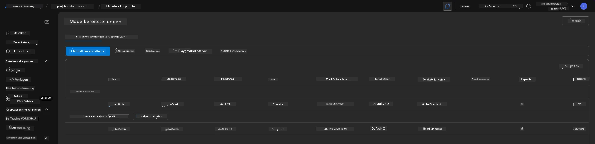
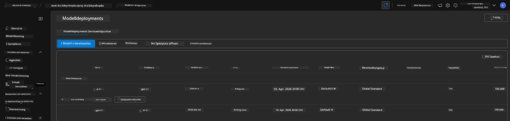

# 6. Teardown Infrastructure

!!! tip "AM ENDE DIESES MODULS SIND SIE IN DER LAGE"

    - [ ] Die Bedeutung der Bereinigung von Ressourcen und des Kostenmanagements verstehen
    - [ ] Verwenden Sie `azd down`, um die Infrastruktur sicher zu deprovisionieren
    - [ ] Soft-gelöschte Cognitive Services bei Bedarf wiederherstellen
    - [ ] **Lab 6:** Azure-Ressourcen bereinigen und Entfernung verifizieren

---

## Bonus-Übungen

Before we tear down the project, take a few minutes to do some open-ended exploration.

!!! info "Probieren Sie diese Erkundungsanregungen"

    **Experimentieren Sie mit GitHub Copilot:**
    
    1. Ask: `Welche anderen AZD-Vorlagen könnte ich für Multi-Agenten-Szenarien ausprobieren?`
    2. Ask: `Wie kann ich die Agenten-Anweisungen für einen Anwendungsfall im Gesundheitswesen anpassen?`
    3. Ask: `Welche Umgebungsvariablen steuern die Kostenoptimierung?`
    
    **Erkunden Sie das Azure-Portal:**
    
    1. Überprüfen Sie die Application Insights-Metriken Ihrer Bereitstellung
    2. Überprüfen Sie die Kostenanalyse für bereitgestellte Ressourcen
    3. Erkunden Sie den Agenten-Playground im Microsoft Foundry-Portal noch einmal

---

## Infrastruktur deprovisionieren

1. Das Herunterfahren der Infrastruktur ist ganz einfach:
      
      ```bash title="" linenums="0"
      azd down --purge
      ```
1. Das Flag `--purge` stellt sicher, dass auch soft-gelöschte Cognitive Service-Ressourcen bereinigt werden und dadurch von diesen Ressourcen belegte Kontingente freigegeben werden. Nach Abschluss sehen Sie etwas Ähnliches:
      
      ```bash title="" linenums="0"
      ? Total resources to delete: 11, are you sure you want to continue? Yes
      Deleting your resources can take some time.
      (✓) Done: Deleted resource group rg-nitya-mshack-azd
      (✓) Done: Purging Cognitive Account: aoai-3cz3zkynhvpbc

      SUCCESS: Your application was removed from Azure in 11 minutes 4 seconds.
      ```

1. (Optional) Wenn Sie jetzt `azd up` erneut ausführen, werden Sie feststellen, dass das Modell gpt-4.1 bereitgestellt wird, da die Umgebungsvariable in dem lokalen `.azure`-Ordner geändert (und gespeichert) wurde. 

      Here is the model deployments **before**:

      

      And here it is **after**:
      

---

<!-- CO-OP TRANSLATOR DISCLAIMER START -->
**Haftungsausschluss**:
Dieses Dokument wurde mit dem KI-Übersetzungsdienst [Co-op Translator](https://github.com/Azure/co-op-translator) übersetzt. Obwohl wir uns um Genauigkeit bemühen, beachten Sie bitte, dass automatisierte Übersetzungen Fehler oder Ungenauigkeiten enthalten können. Das Originaldokument in seiner ursprünglichen Sprache ist als maßgebliche Quelle zu betrachten. Für kritische Informationen wird eine professionelle menschliche Übersetzung empfohlen. Wir haften nicht für Missverständnisse oder Fehlinterpretationen, die sich aus der Verwendung dieser Übersetzung ergeben.
<!-- CO-OP TRANSLATOR DISCLAIMER END -->