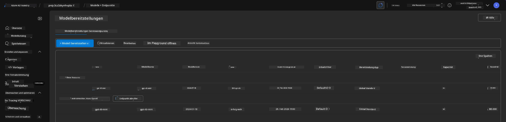
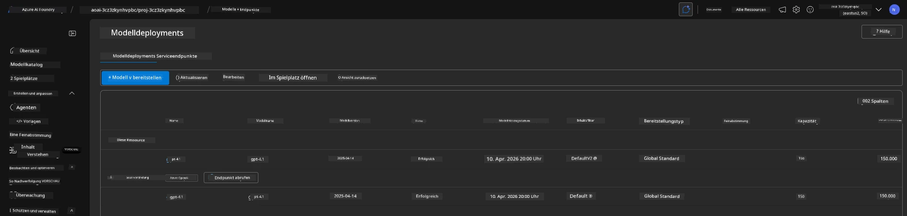

# 6. Infrastruktur abbauen

!!! tip "AM ENDE DIESES MODULS KÖNNEN SIE"

    - [ ] Die Bedeutung von Ressourcenbereinigung und Kostenmanagement verstehen
    - [ ] Mit `azd down` die Infrastruktur sicher deprovisionieren
    - [ ] Bei Bedarf soft-gelöschte Azure AI Services wiederherstellen
    - [ ] **Lab 6:** Azure-Ressourcen bereinigen und Entfernung überprüfen

---

## Bonus-Übungen

Bevor wir das Projekt abbauen, nehmen Sie sich ein paar Minuten für offene Erkundungen.

!!! info "Probieren Sie diese Erkundungsanregungen aus"

    **Experimentieren mit GitHub Copilot:**
    
    1. Fragen Sie: `What other AZD templates could I try for multi-agent scenarios?`
    2. Fragen Sie: `How can I customize the agent instructions for a healthcare use case?`
    3. Fragen Sie: `What environment variables control cost optimization?`
    
    **Erkunden Sie das Azure-Portal:**
    
    1. Überprüfen Sie die Application Insights-Metriken für Ihre Bereitstellung
    2. Überprüfen Sie die Kostenanalyse für bereitgestellte Ressourcen
    3. Erkunden Sie den Agent-Playground des Microsoft Foundry-Portals noch einmal

---

## Infrastruktur deprovisionieren

1. Das Abbauen der Infrastruktur ist ganz einfach:
      
      ```bash title="" linenums="0"
      azd down --purge
      ```
1. The `--purge` flag ensures that it also purges soft-deleted Cognitive Service resources, thereby releasing quota held by these resources. Once complete you will see something like this:
      
      ```bash title="" linenums="0"
      ? Total resources to delete: 11, are you sure you want to continue? Yes
      Deleting your resources can take some time.
      (✓) Done: Deleted resource group rg-nitya-mshack-azd
      (✓) Done: Purging Cognitive Account: aoai-3cz3zkynhvpbc

      SUCCESS: Your application was removed from Azure in 11 minutes 4 seconds.
      ```

1. (Optional) Wenn Sie jetzt erneut `azd up` ausführen, werden Sie feststellen, dass das gpt-4.1-Modell bereitgestellt wird, da die Umgebungsvariable im lokalen `.azure`-Ordner geändert (und gespeichert) wurde. 

      Hier sind die Modellbereitstellungen **vorher**:

      

      Und hier ist es **nachher**:
      

---

<!-- CO-OP TRANSLATOR DISCLAIMER START -->
**Haftungsausschluss**:
Dieses Dokument wurde mit dem KI-Übersetzungsdienst [Co-op Translator](https://github.com/Azure/co-op-translator) übersetzt. Obwohl wir uns um Genauigkeit bemühen, beachten Sie bitte, dass automatisierte Übersetzungen Fehler oder Ungenauigkeiten enthalten können. Das Originaldokument in seiner Ursprungssprache gilt als maßgebliche Quelle. Bei kritischen Informationen wird eine professionelle menschliche Übersetzung empfohlen. Wir übernehmen keine Haftung für Missverständnisse oder Fehlinterpretationen, die aus der Verwendung dieser Übersetzung entstehen.
<!-- CO-OP TRANSLATOR DISCLAIMER END -->