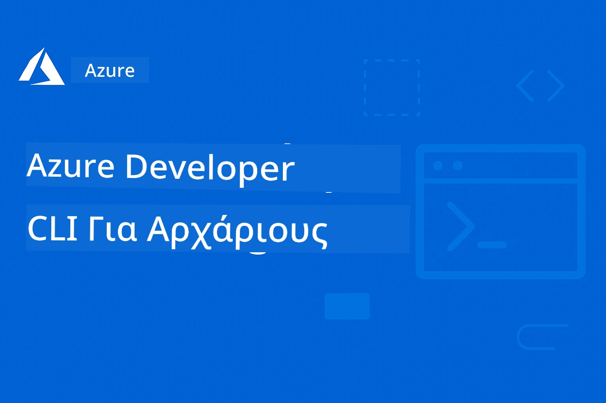

# AZD Για Αρχάριους: Ένα Δομημένο Ταξίδι Μάθησης

 

[](https://GitHub.com/microsoft/azd-for-beginners/watchers/)
[](https://GitHub.com/microsoft/azd-for-beginners/network/)
[](https://GitHub.com/microsoft/azd-for-beginners/stargazers/)

[](https://discord.gg/microsoft-azure)
[](https://discord.gg/nTYy5BXMWG)

## Ξεκινώντας με Αυτό το Μάθημα

Ακολουθήστε αυτά τα βήματα για να ξεκινήσετε το ταξίδι μάθησής σας με το AZD:

1. **Κάντε Fork το Αποθετήριο**: Κάντε κλικ [](https://GitHub.com/microsoft/azd-for-beginners/fork)
2. **Κλωνοποιήστε το Αποθετήριο**: `git clone https://github.com/microsoft/azd-for-beginners.git`
3. **Ενταχθείτε στην Κοινότητα**: [Azure Discord Κοινότητες](https://discord.com/invite/ByRwuEEgH4) για υποστήριξη από ειδικούς
4. **Επιλέξτε τη Διαδρομή Μάθησής σας**: Επιλέξτε ένα κεφάλαιο παρακάτω που ταιριάζει στο επίπεδο εμπειρίας σας

### Υποστήριξη Πολλών Γλωσσών

#### Αυτόματες Μεταφράσεις (Πάντα Ενημερωμένες)

<!-- CO-OP TRANSLATOR LANGUAGES TABLE START -->
[Αραβικά](../ar/README.md) | [Μπενγκάλι](../bn/README.md) | [Βουλγαρικά](../bg/README.md) | [Βιρμανικά (Μυανμάρ)](../my/README.md) | [Κινέζικα (Απλοποιημένα)](../zh-CN/README.md) | [Κινέζικα (Παραδοσιακά, Χονγκ Κονγκ)](../zh-HK/README.md) | [Κινέζικα (Παραδοσιακά, Μακάο)](../zh-MO/README.md) | [Κινέζικα (Παραδοσιακά, Ταϊβάν)](../zh-TW/README.md) | [Κροατικά](../hr/README.md) | [Τσέχικα](../cs/README.md) | [Δανικά](../da/README.md) | [Ολλανδικά](../nl/README.md) | [Εσθονικά](../et/README.md) | [Φινλανδικά](../fi/README.md) | [Γαλλικά](../fr/README.md) | [Γερμανικά](../de/README.md) | [Ελληνικά](./README.md) | [Εβραϊκά](../he/README.md) | [Χίντι](../hi/README.md) | [Ουγγρικά](../hu/README.md) | [Ινδονησιακά](../id/README.md) | [Ιταλικά](../it/README.md) | [Ιαπωνικά](../ja/README.md) | [Κανάντα](../kn/README.md) | [Κορεατικά](../ko/README.md) | [Λιθουανικά](../lt/README.md) | [Μαλαισιανά](../ms/README.md) | [Μαλαγιαλάμ](../ml/README.md) | [Μαραθικά](../mr/README.md) | [Νεπάλ](../ne/README.md) | [Νιγηριανό Πίντζιν](../pcm/README.md) | [Νορβηγικά](../no/README.md) | [Περσικά (Φαρσί)](../fa/README.md) | [Πολωνικά](../pl/README.md) | [Πορτογαλικά (Βραζιλία)](../pt-BR/README.md) | [Πορτογαλικά (Πορτογαλία)](../pt-PT/README.md) | [Πουντζάμπι (Γκουρμούκι)](../pa/README.md) | [Ρουμανικά](../ro/README.md) | [Ρωσικά](../ru/README.md) | [Σερβικά (Κυριλλικά)](../sr/README.md) | [Σλοβακικά](../sk/README.md) | [Σλοβενικά](../sl/README.md) | [Ισπανικά](../es/README.md) | [Σουαχίλι](../sw/README.md) | [Σουηδικά](../sv/README.md) | [Ταγκαλόγκ (Φιλιππινέζικα)](../tl/README.md) | [Ταμίλ](../ta/README.md) | [Τελούγκου](../te/README.md) | [Ταϊλανδικά](../th/README.md) | [Τουρκικά](../tr/README.md) | [Ουκρανικά](../uk/README.md) | [Ουρντού](../ur/README.md) | [Βιετναμέζικα](../vi/README.md)

> **Προτιμάτε να Κλωνοποιήσετε τοπικά;**

> Αυτό το αποθετήριο περιλαμβάνει 50+ μεταφράσεις, που αυξάνουν σημαντικά το μέγεθος λήψης. Για κλωνοποίηση χωρίς μεταφράσεις, χρησιμοποιήστε sparse checkout:
> ```bash
> git clone --filter=blob:none --sparse https://github.com/microsoft/AZD-for-beginners.git
> cd AZD-for-beginners
> git sparse-checkout set --no-cone '/*' '!translations' '!translated_images'
> ```
> Αυτό σας δίνει όλα όσα χρειάζεστε για να ολοκληρώσετε το μάθημα με πολύ πιο γρήγορη λήψη.
<!-- CO-OP TRANSLATOR LANGUAGES TABLE END -->

## Επισκόπηση Μαθήματος

Κατακτήστε το Azure Developer CLI (azd) μέσα από δομημένα κεφάλαια σχεδιασμένα για προοδευτική μάθηση. **Ειδική εστίαση στην ανάπτυξη εφαρμογών AI με ενσωμάτωση Microsoft Foundry.**

### Γιατί Αυτό το Μάθημα Είναι Απαραίτητο για Μοντέρνους Προγραμματιστές

Με βάση πληροφορίες από την κοινότητα Microsoft Foundry Discord, **το 45% των προγραμματιστών θέλει να χρησιμοποιήσει το AZD για φορτία εργασίας AI** αλλά αντιμετωπίζει προκλήσεις με:
- Πολύπλοκες αρχιτεκτονικές AI πολλαπλών υπηρεσιών
- Βέλτιστες πρακτικές παραγωγικής ανάπτυξης AI  
- Ενσωμάτωση και ρύθμιση υπηρεσιών Azure AI
- Βελτιστοποίηση κόστους για φορτία εργασίας AI
- Αντιμετώπιση προβλημάτων συγκεκριμένα στην ανάπτυξη AI

### Στόχοι Μάθησης

Ολοκληρώνοντας αυτό το δομημένο μάθημα, θα:
- **Κατανοήσετε τα Θεμελιώδη του AZD**: Βασικές έννοιες, εγκατάσταση και ρύθμιση
- **Αναπτύξετε Εφαρμογές AI**: Χρησιμοποιήστε AZD με υπηρεσίες Microsoft Foundry
- **Υλοποιήσετε Υποδομή ως Κώδικα**: Διαχειριστείτε πόρους Azure με πρότυπα Bicep
- **Επιλύσετε Προβλήματα Ανάπτυξης**: Αντιμετωπίστε κοινά θέματα και αποσφαλματώστε
- **Βελτιστοποιήσετε για Παραγωγή**: Ασφάλεια, κλιμάκωση, παρακολούθηση και διαχείριση κόστους
- **Κατασκευάσετε Πολυ-Πρακτορικές λύσεις**: Αναπτύξτε πολύπλοκες αρχιτεκτονικές AI

## 📚 Κεφάλαια Μάθησης

*Επιλέξτε τη διαδρομή μάθησης σύμφωνα με το επίπεδο εμπειρίας και τους στόχους σας*

### 🚀 Κεφάλαιο 1: Βασικά και Γρήγορη Εκκίνηση
**Προαπαιτούμενα**: Συνδρομή Azure, βασικές γνώσεις γραμμής εντολών  
**Διάρκεια**: 30-45 λεπτά  
**Πολυπλοκότητα**: ⭐

#### Τι Θα Μάθετε
- Κατανόηση των βασικών του Azure Developer CLI
- Εγκατάσταση του AZD στην πλατφόρμα σας
- Η πρώτη σας επιτυχημένη ανάπτυξη

#### Πόροι Μάθησης
- **🎯 Ξεκινήστε Εδώ**: [Τι είναι το Azure Developer CLI;](../..)
- **📖 Θεωρία**: [Βασικά AZD](docs/getting-started/azd-basics.md) - Βασικές έννοιες και ορολογία
- **⚙️ Ρύθμιση**: [Εγκατάσταση & Ρύθμιση](docs/getting-started/installation.md) - Οδηγοί για συγκεκριμένες πλατφόρμες
- **🛠️ Πρακτική Άσκηση**: [Το Πρώτο σας Έργο](docs/getting-started/first-project.md) - Βήμα-βήμα σεμινάριο
- **📋 Γρήγορη Αναφορά**: [Κατάλογος Εντολών](resources/cheat-sheet.md)

#### Πρακτικές Ασκήσεις
```bash
# Γρήγορος έλεγχος εγκατάστασης
azd version

# Αναπτύξτε την πρώτη σας εφαρμογή
azd init --template todo-nodejs-mongo
azd up
```

**💡 Αποτέλεσμα Κεφαλαίου**: Επιτυχής ανάπτυξη απλής web εφαρμογής στο Azure με χρήση AZD

**✅ Επαλήθευση Επιτυχίας:**
```bash
# Μετά την ολοκλήρωση του Κεφαλαίου 1, θα πρέπει να μπορείτε να:
azd version              # Εμφανίζει την εγκατεστημένη έκδοση
azd init --template todo-nodejs-mongo  # Αρχικοποιεί το έργο
azd up                  # Αναπτύσσει στο Azure
azd show                # Εμφανίζει το URL της τρέχουσας εφαρμογής
# Η εφαρμογή ανοίγει στον περιηγητή και λειτουργεί
azd down --force --purge  # Καθαρίζει τους πόρους
```

**📊 Επένδυση Χρόνου:** 30-45 λεπτά  
**📈 Επίπεδο Δεξιότητας Μετά:** Μπορεί να αναπτύσσει βασικές εφαρμογές ανεξάρτητα

**✅ Επαλήθευση Επιτυχίας:**
```bash
# Μετά την ολοκλήρωση του Κεφαλαίου 1, θα πρέπει να μπορείτε να:
azd version              # Εμφανίζει την εγκατεστημένη έκδοση
azd init --template todo-nodejs-mongo  # Αρχικοποιεί το έργο
azd up                  # Αναπτύσσει στο Azure
azd show                # Εμφανίζει το URL της εφαρμογής που λειτουργεί
# Η εφαρμογή ανοίγει στον περιηγητή και λειτουργεί
azd down --force --purge  # Καθαρίζει τους πόρους
```

**📊 Επένδυση Χρόνου:** 30-45 λεπτά  
**📈 Επίπεδο Δεξιότητας Μετά:** Μπορεί να αναπτύσσει βασικές εφαρμογές ανεξάρτητα

---

### 🤖 Κεφάλαιο 2: AI-Πρώτη Ανάπτυξη (Συνιστάται για Προγραμματιστές AI)
**Προαπαιτούμενα**: Ολοκλήρωση Κεφαλαίου 1  
**Διάρκεια**: 1-2 ώρες  
**Πολυπλοκότητα**: ⭐⭐

#### Τι Θα Μάθετε
- Ενσωμάτωση Microsoft Foundry με AZD
- Ανάπτυξη εφαρμογών με τεχνολογίες AI
- Κατανόηση ρυθμίσεων υπηρεσιών AI

#### Πόροι Μάθησης
- **🎯 Ξεκινήστε Εδώ**: [Ενσωμάτωση Microsoft Foundry](docs/microsoft-foundry/microsoft-foundry-integration.md)
- **📖 Πρότυπα**: [Ανάπτυξη Μοντέλων AI](docs/microsoft-foundry/ai-model-deployment.md) - Ανάπτυξη και διαχείριση μοντέλων AI
- **🛠️ Εργαστήριο**: [AI Workshop Lab](docs/microsoft-foundry/ai-workshop-lab.md) - Προετοιμάστε τις λύσεις AI για AZD
- **🎥 Διαδραστικός Οδηγός**: [Υλικά Εργαστηρίου](workshop/README.md) - Μάθηση μέσω browser με MkDocs * Περιβάλλον DevContainer
- **📋 Πρότυπα**: [Microsoft Foundry Προτύπα](../..)
- **📝 Παραδείγματα**: [Παραδείγματα Ανάπτυξης AZD](examples/README.md)

#### Πρακτικές Ασκήσεις
```bash
# Αναπτύξτε την πρώτη σας εφαρμογή τεχνητής νοημοσύνης
azd init --template azure-search-openai-demo
azd up

# Δοκιμάστε επιπλέον πρότυπα τεχνητής νοημοσύνης
azd init --template openai-chat-app-quickstart
azd init --template agent-openai-python-prompty
```

**💡 Αποτέλεσμα Κεφαλαίου**: Ανάπτυξη και ρύθμιση εφαρμογής συνομιλίας με δυνατότητες RAG

**✅ Επαλήθευση Επιτυχίας:**
```bash
# Μετά το Κεφάλαιο 2, θα πρέπει να μπορείτε να:
azd init --template azure-search-openai-demo
azd up
# Δοκιμάσετε τη διεπαφή συνομιλίας AI
# Κάνετε ερωτήσεις και να λαμβάνετε απαντήσεις με τεχνητή νοημοσύνη με πηγές
# Επαληθεύσετε ότι η ενσωμάτωση αναζήτησης λειτουργεί
azd monitor  # Ελέγξετε ότι το Application Insights δείχνει τηλεμετρία
azd down --force --purge
```

**📊 Επένδυση Χρόνου:** 1-2 ώρες  
**📈 Επίπεδο Δεξιότητας Μετά:** Μπορεί να αναπτύσσει και να ρυθμίζει παραγωγικές AI εφαρμογές  
**💰 Ενημέρωση Κόστους:** Κατανόηση κόστους ανάπτυξης $80-150/μήνα, παραγωγής $300-3500/μήνα

#### 💰 Σκέψεις Κόστους για Ανάπτυξη AI

**Περιβάλλον Ανάπτυξης (Εκτιμώμενο $80-150/μήνα):**
- Azure OpenAI (Πληρωμή ανά Χρήση): $0-50/μήνα (βάσει χρήσης tokens)
- AI Search (Βασικό επίπεδο): $75/μήνα
- Container Apps (Κατανάλωση): $0-20/μήνα
- Αποθήκευση (Τυπική): $1-5/μήνα

**Περιβάλλον Παραγωγής (Εκτιμώμενο $300-3,500+/μήνα):**
- Azure OpenAI (PTU για σταθερή απόδοση): $3,000+/μήνα ή Πληρωμή ανά Κίνηση με υψηλό όγκο
- AI Search (Τυπικό επίπεδο): $250/μήνα
- Container Apps (Αφιερωμένο): $50-100/μήνα
- Application Insights: $5-50/μήνα
- Αποθήκευση (Premium): $10-50/μήνα

**💡 Συμβουλές Βελτιστοποίησης Κόστους:**
- Χρησιμοποιήστε **Free Tier** Azure OpenAI για μάθηση (περιλαμβάνει 50,000 tokens/μήνα)
- Εκτελέστε `azd down` για απενεργοποίηση πόρων όταν δεν αναπτύσσετε ενεργά
- Ξεκινήστε με χρέωση κατανάλωσης, αναβαθμίστε σε PTU μόνο για παραγωγή
- Χρησιμοποιήστε `azd provision --preview` για εκτίμηση κόστους πριν την ανάπτυξη
- Ενεργοποιήστε αυτόματη κλιμάκωση: πληρώνετε μόνο για τη χρήση

**Παρακολούθηση Κόστους:**
```bash
# Ελέγξτε τις εκτιμώμενες μηνιαίες δαπάνες
azd provision --preview

# Παρακολουθήστε τις πραγματικές δαπάνες στο Azure Portal
az consumption budget list --resource-group <your-rg>
```

---

### ⚙️ Κεφάλαιο 3: Ρύθμιση & Αυθεντικοποίηση
**Προαπαιτούμενα**: Ολοκλήρωση Κεφαλαίου 1  
**Διάρκεια**: 45-60 λεπτά  
**Πολυπλοκότητα**: ⭐⭐

#### Τι Θα Μάθετε
- Ρύθμιση και διαχείριση περιβάλλοντος
- Καλύτερες πρακτικές αυθεντικοποίησης και ασφάλειας
- Ονοματοδοσία και οργάνωση πόρων

#### Πόροι Μάθησης
- **📖 Διαμόρφωση**: [Οδηγός διαμόρφωσης](docs/getting-started/configuration.md) - Ρυθμίσεις περιβάλλοντος
- **🔐 Ασφάλεια**: [Πρότυπα αυθεντικοποίησης και διαχειριζόμενη ταυτότητα](docs/getting-started/authsecurity.md) - Πρότυπα αυθεντικοποίησης
- **📝 Παραδείγματα**: [Παράδειγμα βάσης δεδομένων](examples/database-app/README.md) - Παραδείγματα βάσης δεδομένων AZD

#### Πρακτικές Ασκήσεις
- Διαμόρφωση πολλαπλών περιβαλλόντων (dev, staging, prod)
- Ρύθμιση αυθεντικοποίησης με διαχειριζόμενη ταυτότητα
- Εφαρμογή ρυθμίσεων ανά περιβάλλον

**💡 Αποτέλεσμα Κεφαλαίου**: Διαχειριστείτε πολλαπλά περιβάλλοντα με σωστή αυθεντικοποίηση και ασφάλεια

---

### 🏗️ Κεφάλαιο 4: Υποδομή ως Κώδικας & Ανάπτυξη
**Προαπαιτούμενα**: Ολοκλήρωση Κεφαλαίων 1-3  
**Διάρκεια**: 1-1.5 ώρες  
**Πολυπλοκότητα**: ⭐⭐⭐

#### Τι Θα Μάθετε
- Προηγμένα πρότυπα ανάπτυξης
- Υποδομή ως Κώδικας με Bicep
- Στρατηγικές παροχής πόρων

#### Πόροι Μάθησης
- **📖 Ανάπτυξη**: [Οδηγός ανάπτυξης](docs/deployment/deployment-guide.md) - Πλήρεις ροές εργασίας
- **🏗️ Παροχή Πόρων**: [Διαχείριση πόρων Azure](docs/deployment/provisioning.md) - Διαχείριση πόρων Azure
- **📝 Παραδείγματα**: [Παράδειγμα Container App](../../examples/container-app) - Ανάπτυξη κοντέινερ

#### Πρακτικές Ασκήσεις
- Δημιουργία προσαρμοσμένων προτύπων Bicep
- Ανάπτυξη εφαρμογών με πολλές υπηρεσίες
- Υλοποίηση στρατηγικών blue-green ανάπτυξης

**💡 Αποτέλεσμα Κεφαλαίου**: Αναπτύξτε πολύπλοκες εφαρμογές πολλαπλών υπηρεσιών χρησιμοποιώντας προσαρμοσμένα πρότυπα υποδομής

---

### 🎯 Κεφάλαιο 5: Πολυ-Πρακτορικές AI Λύσεις (Προχωρημένο)
**Προαπαιτούμενα**: Ολοκλήρωση Κεφαλαίων 1-2  
**Διάρκεια**: 2-3 ώρες  
**Πολυπλοκότητα**: ⭐⭐⭐⭐
#### Τι θα μάθετε
- Πρότυπα αρχιτεκτονικής πολλαπλών πρακτόρων
- Ορχήστρωση και συντονισμός πρακτόρων
- Παραγωγικές αναπτύξεις AI έτοιμες για παραγωγή

#### Πόροι μάθησης
- **🤖 Συγκεκριμένο Έργο**: [Λύση πολλαπλών πρακτόρων λιανικής](examples/retail-scenario.md) - Πλήρης υλοποίηση
- **🛠️ Πρότυπα ARM**: [Πακέτο Προτύπων ARM](../../examples/retail-multiagent-arm-template) - Ανάπτυξη με ένα κλικ
- **📖 Αρχιτεκτονική**: [Πρότυπα συντονισμού πολλαπλών πρακτόρων](/docs/pre-deployment/coordination-patterns.md) - Πρότυπα

#### Πρακτικές ασκήσεις
```bash
# Αναπτύξτε την ολοκληρωμένη λύση πολλαπλών πρακτόρων για το λιανικό εμπόριο
cd examples/retail-multiagent-arm-template
./deploy.sh

# Εξερευνήστε τις διαμορφώσεις πρακτόρων
az deployment group show --resource-group <rg-name> --name <deployment-name>
```

**💡 Αποτέλεσμα Κεφαλαίου**: Αναπτύξτε και διαχειριστείτε μια παραγωγική λύση AI πολλαπλών πρακτόρων με πρακτορες Πελατών και Αποθεμάτων

---

### 🔍 Κεφάλαιο 6: Έλεγχος και Σχεδιασμός πριν την Ανάπτυξη  
**Προαπαιτούμενα**: Ολοκληρωμένο Κεφάλαιο 4  
**Διάρκεια**: 1 ώρα  
**Πολυπλοκότητα**: ⭐⭐

#### Τι θα μάθετε
- Σχεδιασμός δυναμικότητας και έλεγχος πόρων
- Στρατηγικές επιλογής SKU
- Έλεγχοι προετοιμασίας και αυτοματοποίηση

#### Πόροι μάθησης
- **📊 Σχεδιασμός**: [Σχεδιασμός Δυναμικότητας](docs/pre-deployment/capacity-planning.md) - Έλεγχος πόρων
- **💰 Επιλογή**: [Επιλογή SKU](docs/pre-deployment/sku-selection.md) - Οικονομικά αποδοτικές επιλογές
- **✅ Έλεγχος**: [Προ-πτήσης Έλεγχοι](docs/pre-deployment/preflight-checks.md) - Αυτοματοποιημένα σενάρια

#### Πρακτικές ασκήσεις
- Τρέξτε σενάρια ελέγχου δυναμικότητας
- Βελτιστοποιήστε τις επιλογές SKU για κόστος
- Υλοποιήστε αυτοματοποιημένους ελέγχους πριν την ανάπτυξη

**💡 Αποτέλεσμα Κεφαλαίου**: Επικυρώστε και βελτιστοποιήστε τις αναπτύξεις πριν την εκτέλεση

---

### 🚨 Κεφάλαιο 7: Αντιμετώπιση Προβλημάτων και Εντοπισμός Σφαλμάτων  
**Προαπαιτούμενα**: Οποιοδήποτε κεφάλαιο ανάπτυξης ολοκληρωμένο  
**Διάρκεια**: 1-1.5 ώρες  
**Πολυπλοκότητα**: ⭐⭐

#### Τι θα μάθετε
- Συστηματικές προσεγγίσεις εντοπισμού σφαλμάτων
- Συνηθισμένα προβλήματα και λύσεις
- Αντιμετώπιση προβλημάτων ειδικών για AI

#### Πόροι μάθησης
- **🔧 Συνηθισμένα Προβλήματα**: [Συνηθισμένα Προβλήματα](docs/troubleshooting/common-issues.md) - Συχνές ερωτήσεις και λύσεις
- **🕵️ Εντοπισμός Σφαλμάτων**: [Οδηγός Εντοπισμού Σφαλμάτων](docs/troubleshooting/debugging.md) - Στρατηγικές βήμα προς βήμα
- **🤖 Προβλήματα AI**: [Ειδική Αντιμετώπιση Προβλημάτων AI](docs/troubleshooting/ai-troubleshooting.md) - Προβλήματα υπηρεσιών AI

#### Πρακτικές ασκήσεις
- Διαγνώστε αποτυχίες ανάπτυξης
- Επίλυση ζητημάτων πιστοποίησης
- Εντοπισμός σφαλμάτων σύνδεσης υπηρεσιών AI

**💡 Αποτέλεσμα Κεφαλαίου**: Διαγνώστε και επιλύστε ανεξάρτητα κοινά ζητήματα ανάπτυξης

---

### 🏢 Κεφάλαιο 8: Παραγωγικά και Επιχειρησιακά Πρότυπα  
**Προαπαιτούμενα**: Ολοκληρωμένα Κεφάλαια 1-4  
**Διάρκεια**: 2-3 ώρες  
**Πολυπλοκότητα**: ⭐⭐⭐⭐

#### Τι θα μάθετε
- Στρατηγικές παραγωγικής ανάπτυξης
- Επιχειρησιακά πρότυπα ασφάλειας
- Παρακολούθηση και βελτιστοποίηση κόστους

#### Πόροι μάθησης
- **🏭 Παραγωγή**: [Καλές Πρακτικές AI Παραγωγής](docs/microsoft-foundry/production-ai-practices.md) - Επιχειρησιακά πρότυπα
- **📝 Παραδείγματα**: [Παράδειγμα Microservices](../../examples/microservices) - Πολύπλοκες αρχιτεκτονικές
- **📊 Παρακολούθηση**: [Ενσωμάτωση Application Insights](docs/pre-deployment/application-insights.md) - Παρακολούθηση

#### Πρακτικές ασκήσεις
- Υλοποίηση επιχειρησιακών προτύπων ασφάλειας
- Ρύθμιση ολοκληρωμένης παρακολούθησης
- Ανάπτυξη σε παραγωγή με σωστή διακυβέρνηση

**💡 Αποτέλεσμα Κεφαλαίου**: Αναπτύξτε επιχειρησιακές εφαρμογές έτοιμες για παραγωγή με πλήρεις δυνατότητες

---

## 🎓 Επισκόπηση Εργαστηρίου: Διαδραστική Εμπειρία Μάθησης  

> **⚠️ ΚΑΤΑΣΤΑΣΗ ΕΡΓΑΣΤΗΡΙΟΥ: Σε Ενεργή Ανάπτυξη**  
> Το υλικό του εργαστηρίου αναπτύσσεται και βελτιώνεται συνεχώς. Τα βασικά modules λειτουργούν, αλλά μερικά προχωρημένα τμήματα είναι ατελή. Εργαζόμαστε ενεργά για την ολοκλήρωση όλου του περιεχομένου. [Παρακολουθήστε την πρόοδο →](workshop/README.md)

### Διαδραστικό Υλικό Εργαστηρίου  
**Ολοκληρωμένη πρακτική μάθηση με εργαλεία στο πρόγραμμα περιήγησης και καθοδηγούμενες ασκήσεις**

Το υλικό του εργαστηρίου προσφέρει μια δομημένη, διαδραστική εμπειρία μάθησης που συμπληρώνει το παραπάνω πρόγραμμα κεφαλαίων. Το εργαστήριο έχει σχεδιαστεί για αυτορυθμιζόμενη μάθηση και καθοδηγούμενες συνεδρίες.

#### 🛠️ Χαρακτηριστικά Εργαστηρίου
- **Διασύνδεση μέσω προγράμματος περιήγησης**: Πλήρες εργαστήριο με MkDocs, αναζήτηση, αντιγραφή και θέματα
- **Ολοκλήρωση GitHub Codespaces**: Ρύθμιση περιβάλλοντος ανάπτυξης με ένα κλικ
- **Δομημένη διαδρομή μάθησης**: 7 βήματα καθοδηγούμενων ασκήσεων (3.5 ώρες συνολικά)
- **Ανακάλυψη → Ανάπτυξη → Προσαρμογή**: Προοδευτική μεθοδολογία
- **Διαδραστικό περιβάλλον DevContainer**: Προρυθμισμένα εργαλεία και εξαρτήσεις

#### 📚 Δομή Εργαστηρίου  
Το εργαστήριο ακολουθεί τη μεθοδολογία **Ανακάλυψη → Ανάπτυξη → Προσαρμογή**:

1. **Φάση Ανακάλυψης** (45 λεπτά)  
   - Εξερευνήστε πρότυπα και υπηρεσίες Microsoft Foundry  
   - Κατανοήστε πρότυπα αρχιτεκτονικής πολλαπλών πρακτόρων  
   - Επισκόπηση απαιτήσεων και προαπαιτούμενων

2. **Φάση Ανάπτυξης** (2 ώρες)  
   - Πρακτική ανάπτυξη εφαρμογών AI με AZD  
   - Διαμόρφωση υπηρεσιών Azure AI και endpoints  
   - Υλοποίηση προτύπων ασφάλειας και πιστοποίησης

3. **Φάση Προσαρμογής** (45 λεπτά)  
   - Τροποποίηση εφαρμογών για συγκεκριμένες χρήσεις  
   - Βελτιστοποίηση για παραγωγική ανάπτυξη  
   - Υλοποίηση παρακολούθησης και διαχείρισης κόστους

#### 🚀 Ξεκινώντας με το Εργαστήριο  
```bash
# Επιλογή 1: GitHub Codespaces (Προτεινόμενο)
# Κάντε κλικ στο "Code" → "Create codespace on main" στο αποθετήριο

# Επιλογή 2: Τοπική Ανάπτυξη
git clone https://github.com/microsoft/azd-for-beginners.git
cd azd-for-beginners/workshop
# Ακολουθήστε τις οδηγίες εγκατάστασης στο workshop/README.md
```

#### 🎯 Αποτελέσματα μάθησης εργαστηρίου  
Με την ολοκλήρωση του εργαστηρίου, οι συμμετέχοντες θα:  
- **Αναπτύσσουν Παραγωγικές Εφαρμογές AI**: Χρησιμοποιώντας AZD με υπηρεσίες Microsoft Foundry  
- **Κατανοούν Αρχιτεκτονικές Πολλαπλών Πρακτόρων**: Υλοποίηση συντονισμένων λύσεων AI πρακτόρων  
- **Εφαρμόζουν Καλές Πρακτικές Ασφάλειας**: Διαμόρφωση πιστοποίησης και ελέγχου πρόσβασης  
- **Βελτιστοποιούν για Κλίμακα**: Σχεδιασμός αποδοτικών κόστους και αποδοτικών αναπτύξεων  
- **Αντιμετωπίζουν Προβλήματα Ανάπτυξης**: Ανεξάρτητη επίλυση κοινών ζητημάτων

#### 📖 Πόροι εργαστηρίου  
- **🎥 Διαδραστικός Οδηγός**: [Υλικό Εργαστηρίου](workshop/README.md) - Περιβάλλον μάθησης μέσω προγράμματος περιήγησης  
- **📋 Οδηγίες βήμα προς βήμα**: [Καθοδηγούμενες Ασκήσεις](../../workshop/docs/instructions) - Αναλυτικές οδηγίες  
- **🛠️ Εργαστήριο AI**: [Εργαστήριο AI](docs/microsoft-foundry/ai-workshop-lab.md) - Ασκήσεις εστιασμένες στο AI  
- **💡 Γρήγορη Εκκίνηση**: [Οδηγός Ρύθμισης Εργαστηρίου](workshop/README.md#quick-start) - Διαμόρφωση περιβάλλοντος

**Ιδανικό για**: Εκπαίδευση εταιρειών, πανεπιστημιακά μαθήματα, αυτορυθμιζόμενη μάθηση και εκπαιδευτικά bootcamps.

---

## 📖 Τι είναι το Azure Developer CLI;

Το Azure Developer CLI (azd) είναι μια διεπαφή γραμμής εντολών εστιασμένη στον προγραμματιστή που επιταχύνει τη διαδικασία κατασκευής και ανάπτυξης εφαρμογών στο Azure. Προσφέρει:

- **Αναπτύξεις βάσει προτύπων** - Χρήση προδιαμορφωμένων προτύπων για κοινά πρότυπα εφαρμογών  
- **Υποδομή ως Κώδικας** - Διαχείριση πόρων Azure με Bicep ή Terraform  
- **Ολοκληρωμένα ροή εργασίας** - Προμήθεια, ανάπτυξη και παρακολούθηση εφαρμογών χωρίς ράγισμα  
- **Φιλικότητα στον προγραμματιστή** - Βελτιστοποίηση για παραγωγικότητα και εμπειρία προγραμματιστών

### **AZD + Microsoft Foundry: Ιδανικό για Αναπτύξεις AI**

**Γιατί AZD για λύσεις AI;** Το AZD αντιμετωπίζει τις κορυφαίες προκλήσεις που έχουν οι προγραμματιστές AI:

- **Πρότυπα έτοιμα για AI** - Προδιαμορφωμένα πρότυπα για Azure OpenAI, Υπηρεσίες Γνωστικής Ανάλυσης και φόρτους εργασίας ML  
- **Ασφαλείς αναπτύξεις AI** - Ενσωματωμένα πρότυπα ασφάλειας για υπηρεσίες AI, κλειδιά API και endpoints μοντέλων  
- **Παραγωγικά πρότυπα AI** - Καλές πρακτικές για κλιμακούμενες, οικονομικές αναπτύξεις εφαρμογών AI  
- **Ολοκληρωμένες ροές εργασίας AI** - Από την ανάπτυξη μοντέλου έως παραγωγική ανάπτυξη με κατάλληλη παρακολούθηση  
- **Βελτιστοποίηση κόστους** - Έξυπνη διανομή πόρων και στρατηγικές κλιμάκωσης για φόρτους εργασίας AI  
- **Ολοκλήρωση Microsoft Foundry** - Απρόσκοπτη σύνδεση με κατάλογο μοντέλων και endpoints Microsoft Foundry

---

## 🎯 Βιβλιοθήκη Προτύπων & Παραδειγμάτων

### Προτεινόμενα: Πρότυπα Microsoft Foundry  
**Ξεκινήστε εδώ αν αναπτύσσετε εφαρμογές AI!**

> **Σημείωση:** Αυτά τα πρότυπα απεικονίζουν διάφορα πρότυπα AI. Κάποια είναι εξωτερικά δείγματα Azure, άλλα είναι τοπικές υλοποιήσεις.

| Πρότυπο | Κεφάλαιο | Πολυπλοκότητα | Υπηρεσίες | Τύπος |
|----------|---------|------------|----------|------|
| [**Ξεκινήστε με συνομιλία AI**](https://github.com/Azure-Samples/get-started-with-ai-chat) | Κεφάλαιο 2 | ⭐⭐ | AzureOpenAI + Azure AI Model Inference API + Azure AI Search + Azure Container Apps + Application Insights | Εξωτερικό |
| [**Ξεκινήστε με πράκτορες AI**](https://github.com/Azure-Samples/get-started-with-ai-agents) | Κεφάλαιο 2 | ⭐⭐ | Azure AI Agent Service + AzureOpenAI + Azure AI Search + Azure Container Apps + Application Insights| Εξωτερικό |
| [**Azure Search + OpenAI Demo**](https://github.com/Azure-Samples/azure-search-openai-demo) | Κεφάλαιο 2 | ⭐⭐ | AzureOpenAI + Azure AI Search + App Service + Storage | Εξωτερικό |
| [**OpenAI Chat App Quickstart**](https://github.com/Azure-Samples/openai-chat-app-quickstart) | Κεφάλαιο 2 | ⭐ | AzureOpenAI + Container Apps + Application Insights | Εξωτερικό |
| [**Agent OpenAI Python Prompty**](https://github.com/Azure-Samples/agent-openai-python-prompty) | Κεφάλαιο 5 | ⭐⭐⭐ | AzureOpenAI + Azure Functions + Prompty | Εξωτερικό |
| [**Contoso Chat RAG**](https://github.com/Azure-Samples/contoso-chat) | Κεφάλαιο 8 | ⭐⭐⭐⭐ | AzureOpenAI + AI Search + Cosmos DB + Container Apps | Εξωτερικό |
| [**Λύση πολλαπλών πρακτόρων λιανικής**](examples/retail-scenario.md) | Κεφάλαιο 5 | ⭐⭐⭐⭐ | AzureOpenAI + AI Search + Storage + Container Apps + Cosmos DB | **Τοπικό** |

### Προτεινόμενα: Ολοκληρωμένα Σενάρια Μάθησης  
**Πρότυπα εφαρμογών έτοιμα για παραγωγή αντιστοιχισμένα σε μαθήματα**

| Πρότυπο | Κεφάλαιο Μάθησης | Πολυπλοκότητα | Κύρια Μάθηση |
|----------|------------------|------------|--------------|
| [**openai-chat-app-quickstart**](https://github.com/Azure-Samples/openai-chat-app-quickstart) | Κεφάλαιο 2 | ⭐ | Βασικά πρότυπα ανάπτυξης AI |
| [**azure-search-openai-demo**](https://github.com/Azure-Samples/azure-search-openai-demo) | Κεφάλαιο 2 | ⭐⭐ | Υλοποίηση RAG με Azure AI Search |
| [**ai-document-processing**](https://github.com/Azure-Samples/ai-document-processing) | Κεφάλαιο 4 | ⭐⭐ | Ενσωμάτωση Document Intelligence |
| [**agent-openai-python-prompty**](https://github.com/Azure-Samples/agent-openai-python-prompty) | Κεφάλαιο 5 | ⭐⭐⭐ | Πλαίσιο πρακτόρων και κλήσεις λειτουργιών |
| [**contoso-chat**](https://github.com/Azure-Samples/contoso-chat) | Κεφάλαιο 8 | ⭐⭐⭐ | Επιχειρησιακή ορχήστρωση AI |
| [**retail-multi-agent-solution**](examples/retail-scenario.md) | Κεφάλαιο 5 | ⭐⭐⭐⭐ | Αρχιτεκτονική πολλαπλών πρακτόρων με πράκτορες Πελατών και Αποθεμάτων |

### Μάθηση ανά Τύπο Παραδείγματος

> **📌 Τοπικά έναντι Εξωτερικών Παραδειγμάτων:**  
> **Τοπικά Παραδείγματα** (σε αυτό το αποθετήριο) = Άμεσα έτοιμα προς χρήση  
> **Εξωτερικά Παραδείγματα** (Azure Samples) = Κλωνοποίηση από συνδεδεμένα αποθετήρια

#### Τοπικά Παραδείγματα (Έτοιμα προς χρήση)  
- [**Λύση πολλαπλών πρακτόρων λιανικής**](examples/retail-scenario.md) - Πλήρης παραγωγική υλοποίηση με πρότυπα ARM  
  - Αρχιτεκτονική πολλαπλών πρακτόρων (Πράκτορες Πελατών + Αποθεμάτων)  
  - Ολοκληρωμένη παρακολούθηση και αξιολόγηση  
  - Ανάπτυξη με ένα κλικ μέσω προτύπου ARM

#### Τοπικά Παραδείγματα - Εφαρμογές Container (Κεφάλαια 2-5)  
**Ολοκληρωμένα παραδείγματα ανάπτυξης containers σε αυτό το αποθετήριο:**  
- [**Παραδείγματα Εφαρμογών Container**](examples/container-app/README.md) - Πλήρης οδηγός για αναπτύξεις container  
  - [Απλό API Flask](../../examples/container-app/simple-flask-api) - Βασικό REST API με κλίμακα στο μηδέν  
  - [Αρχιτεκτονική Microservices](../../examples/container-app/microservices) - Παραγωγική ανάπτυξη πολλών υπηρεσιών  
  - Γρήγορη Εκκίνηση, Παραγωγή και Προηγμένα πρότυπα ανάπτυξης  
  - Οδηγίες παρακολούθησης, ασφάλειας και βελτιστοποίησης κόστους

#### Εξωτερικά Παραδείγματα - Απλές Εφαρμογές (Κεφάλαια 1-2)  
**Κλωνοποιήστε αυτά τα αποθετήρια Azure Samples για να ξεκινήσετε:**  
- [Απλή Web App - Node.js + MongoDB](https://github.com/Azure-Samples/todo-nodejs-mongo) - Βασικά πρότυπα ανάπτυξης  
- [Στατική Ιστοσελίδα - React SPA](https://github.com/Azure-Samples/todo-csharp-sql-swa-func) - Ανάπτυξη στατικού περιεχομένου  
- [Container App - Python Flask](https://github.com/Azure-Samples/container-apps-store-api-microservice) - Ανάπτυξη REST API

#### Εξωτερικά Παραδείγματα - Ενσωμάτωση Βάσης Δεδομένων (Κεφάλαια 3-4)  
- [Εφαρμογή Βάσης Δεδομένων - C# + SQL](https://github.com/Azure-Samples/todo-csharp-sql) - Πρότυπα σύνδεσης βάσεων  
- [Functions + Cosmos DB](https://github.com/Azure-Samples/todo-python-mongo-swa-func) - Serverless ροή εργασίας δεδομένων

#### Εξωτερικά Παραδείγματα - Προχωρημένα Πρότυπα (Κεφάλαια 4-8)  
- [Java Microservices](https://github.com/Azure-Samples/java-microservices-aca-lab) - Αρχιτεκτονικές πολλών υπηρεσιών  
- [Container Apps Jobs](https://github.com/Azure-Samples/container-apps-jobs) - Παρασκηνιακή επεξεργασία  
- [Enterprise ML Pipeline](https://github.com/Azure-Samples/mlops-v2) - Παραγωγικά πρότυπα ML

### Εξωτερικές Συλλογές Προτύπων  
- [**Επίσημη Συλλογή Προτύπων AZD**](https://azure.github.io/awesome-azd/) - Επιλεγμένη συλλογή επίσημων και κοινότητας προτύπων
- [**Πρότυπα Azure Developer CLI**](https://learn.microsoft.com/en-us/azure/developer/azure-developer-cli/azd-templates) - Τεκμηρίωση προτύπων Microsoft Learn  
- [**Κατάλογος Παραδειγμάτων**](examples/README.md) - Τοπικά παραδείγματα μάθησης με λεπτομερείς εξηγήσεις

---

## 📚 Πόροι Μάθησης & Αναφορές

### Γρήγορες Αναφορές  
- [**Φύλλο εντολών**](resources/cheat-sheet.md) - Βασικές εντολές azd οργανωμένες ανά κεφάλαιο  
- [**Γλωσσάρι**](resources/glossary.md) - Ορολογία Azure και azd  
- [**Συχνές Ερωτήσεις**](resources/faq.md) - Συχνές ερωτήσεις οργανωμένες ανά κεφάλαιο μάθησης  
- [**Οδηγός Μελέτης**](resources/study-guide.md) - Ολοκληρωμένες ασκήσεις πρακτικής

### Πρακτικά Εργαστήρια  
- [**AI Workshop Lab**](docs/microsoft-foundry/ai-workshop-lab.md) - Κάντε τις λύσεις AI deployable με AZD (2-3 ώρες)  
- [**Διαδραστικός Οδηγός Εργαστηρίου**](workshop/README.md) - Εργαστήριο με βάση το πρόγραμμα περιήγησης με MkDocs και Περιβάλλον DevContainer  
- [**Δομημένη Διαδρομή Μάθησης**](../../workshop/docs/instructions) - 7 βήματα καθοδηγούμενων ασκήσεων (Ανακάλυψη → Ανάπτυξη → Προσαρμογή)  
- [**Εργαστήριο AZD για Αρχάριους**](workshop/README.md) - Ολοκληρωμένα υλικά εργαστηρίου με ενσωμάτωση GitHub Codespaces

### Εξωτερικοί Πόροι Μάθησης  
- Τεκμηρίωση Azure Developer CLI (https://learn.microsoft.com/en-us/azure/developer/azure-developer-cli/)  
- Κέντρο Αρχιτεκτονικής Azure (https://learn.microsoft.com/en-us/azure/architecture/)  
- Υπολογιστής Τιμολόγησης Azure (https://azure.microsoft.com/pricing/calculator/)  
- Κατάσταση Azure (https://status.azure.com/)

---

## 🔧 Γρήγορος Οδηγός Επίλυσης Προβλημάτων

**Συχνά προβλήματα που αντιμετωπίζουν οι αρχάριοι και άμεσες λύσεις:**

### ❌ "azd: command not found"

```bash
# Εγκαταστήστε πρώτα το AZD
# Windows (PowerShell):
winget install microsoft.azd

# macOS:
brew tap azure/azd && brew install azd

# Linux:
curl -fsSL https://aka.ms/install-azd.sh | bash

# Επαληθεύστε την εγκατάσταση
azd version
```

### ❌ "No subscription found" ή "Subscription not set"

```bash
# Λίστα διαθέσιμων συνδρομών
az account list --output table

# Ορισμός προεπιλεγμένης συνδρομής
az account set --subscription "<subscription-id-or-name>"

# Ορισμός για το περιβάλλον AZD
azd env set AZURE_SUBSCRIPTION_ID "<subscription-id>"

# Επαλήθευση
az account show
```

### ❌ "InsufficientQuota" ή "Quota exceeded"

```bash
# Δοκιμάστε διαφορετική περιοχή Azure
azd env set AZURE_LOCATION "westus2"
azd up

# Ή χρησιμοποιήστε μικρότερα SKUs στην ανάπτυξη
# Επεξεργαστείτε το infra/main.parameters.json:
{
  "sku": "B1"  // Instead of "P1V2"
}
```

### ❌ "azd up" αποτυγχάνει στη μέση

```bash
# Επιλογή 1: Καθαρίστε και δοκιμάστε ξανά
azd down --force --purge
azd up

# Επιλογή 2: Απλώς διορθώστε την υποδομή
azd provision

# Επιλογή 3: Ελέγξτε τα λεπτομερή αρχεία καταγραφής
azd show
azd logs
```

### ❌ "Authentication failed" ή "Token expired"

```bash
# Επανεπιβεβαίωση ταυτότητας
az logout
az login

azd auth logout
azd auth login

# Επαλήθευση ταυτότητας
az account show
```

### ❌ "Resource already exists" ή συγκρούσεις ονομάτων

```bash
# Το AZD δημιουργεί μοναδικά ονόματα, αλλά αν υπάρξει σύγκρουση:
azd down --force --purge

# Τότε επανεκκινήστε με νέο περιβάλλον
azd env new dev-v2
azd up
```

### ❌ Η ανάπτυξη του προτύπου διαρκεί πολύ

**Κανονικά χρονικά διαστήματα αναμονής:**  
- Απλή web εφαρμογή: 5-10 λεπτά  
- Εφαρμογή με βάση δεδομένων: 10-15 λεπτά  
- Εφαρμογές AI: 15-25 λεπτά (η παροχή OpenAI είναι αργή)

```bash
# Έλεγχος προόδου
azd show

# Αν κολλήσετε >30 λεπτά, ελέγξτε το Azure Portal:
azd monitor
# Αναζητήστε αποτυχημένες αναπτύξεις
```

### ❌ "Permission denied" ή "Forbidden"

```bash
# Ελέγξτε τον ρόλο σας στο Azure
az role assignment list --assignee $(az account show --query user.name -o tsv)

# Χρειάζεστε τουλάχιστον ρόλο "Συνεισφέρων"
# Ζητήστε από τον διαχειριστή Azure να χορηγήσει:
# - Συνεισφέρων (για πόρους)
# - Διαχειριστής Πρόσβασης Χρηστών (για αναθέσεις ρόλων)
```

### ❌ Δεν μπορεί να βρεθεί το URL της αναπτυγμένης εφαρμογής

```bash
# Εμφάνιση όλων των τελικών σημείων υπηρεσίας
azd show

# Ή άνοιγμα του Azure Portal
azd monitor

# Έλεγχος συγκεκριμένης υπηρεσίας
azd env get-values
# Αναζητήστε μεταβλητές *_URL
```

### 📚 Πλήρεις Πόροι Επίλυσης Προβλημάτων

- **Οδηγός Συνηθισμένων Προβλημάτων:** [Λεπτομερείς Λύσεις](docs/troubleshooting/common-issues.md)  
- **Προβλήματα Ειδικά για AI:** [Troubleshooting AI](docs/troubleshooting/ai-troubleshooting.md)  
- **Οδηγός Αποσφαλμάτωσης:** [Βήμα προς βήμα αποσφαλμάτωση](docs/troubleshooting/debugging.md)  
- **Λάβετε Βοήθεια:** [Azure Discord](https://discord.gg/microsoft-azure) #azure-developer-cli

---

## 🔧 Γρήγορος Οδηγός Επίλυσης Προβλημάτων

**Συχνά προβλήματα που αντιμετωπίζουν οι αρχάριοι και άμεσες λύσεις:**

<details>
<summary><strong>❌ "azd: command not found"</strong></summary>

```bash
# Εγκαταστήστε πρώτα το AZD
# Windows (PowerShell):
winget install microsoft.azd

# macOS:
brew tap azure/azd && brew install azd

# Linux:
curl -fsSL https://aka.ms/install-azd.sh | bash

# Επαληθεύστε την εγκατάσταση
azd version
```
</details>

<details>
<summary><strong>❌ "No subscription found" ή "Subscription not set"</strong></summary>

```bash
# Καταχώριση διαθέσιμων συνδρομών
az account list --output table

# Ορισμός προεπιλεγμένης συνδρομής
az account set --subscription "<subscription-id-or-name>"

# Ορισμός για το περιβάλλον AZD
azd env set AZURE_SUBSCRIPTION_ID "<subscription-id>"

# Επαλήθευση
az account show
```
</details>

<details>
<summary><strong>❌ "InsufficientQuota" ή "Quota exceeded"</strong></summary>

```bash
# Δοκιμάστε διαφορετική περιοχή Azure
azd env set AZURE_LOCATION "westus2"
azd up

# Ή χρησιμοποιήστε μικρότερα SKUs κατά την ανάπτυξη
# Επεξεργαστείτε το infra/main.parameters.json:
{
  "sku": "B1"  // Instead of "P1V2"
}
```
</details>

<details>
<summary><strong>❌ "azd up" αποτυγχάνει στη μέση</strong></summary>

```bash
# Επιλογή 1: Καθαρίστε και προσπαθήστε ξανά
azd down --force --purge
azd up

# Επιλογή 2: Απλώς διορθώστε την υποδομή
azd provision

# Επιλογή 3: Ελέγξτε λεπτομερή αρχεία καταγραφής
azd show
azd logs
```
</details>

<details>
<summary><strong>❌ "Authentication failed" ή "Token expired"</strong></summary>

```bash
# Επαναταυτοποίηση
az logout
az login

azd auth logout
azd auth login

# Επαλήθευση ταυτοποίησης
az account show
```
</details>

<details>
<summary><strong>❌ "Resource already exists" ή συγκρούσεις ονομάτων</strong></summary>

```bash
# Το AZD δημιουργεί μοναδικά ονόματα, αλλά αν υπάρξει διένεξη:
azd down --force --purge

# Στη συνέχεια δοκιμάστε ξανά με νέο περιβάλλον
azd env new dev-v2
azd up
```
</details>

<details>
<summary><strong>❌ Η ανάπτυξη του προτύπου διαρκεί πολύ</strong></summary>

**Κανονικά χρονικά διαστήματα αναμονής:**  
- Απλή web εφαρμογή: 5-10 λεπτά  
- Εφαρμογή με βάση δεδομένων: 10-15 λεπτά  
- Εφαρμογές AI: 15-25 λεπτά (η παροχή OpenAI είναι αργή)

```bash
# Έλεγχος προόδου
azd show

# Εάν κολλήσει >30 λεπτά, ελέγξτε το Azure Portal:
azd monitor
# Αναζητήστε αποτυχημένες αναπτύξεις
```
</details>

<details>
<summary><strong>❌ "Permission denied" ή "Forbidden"</strong></summary>

```bash
# Ελέγξτε τον ρόλο σας στο Azure
az role assignment list --assignee $(az account show --query user.name -o tsv)

# Χρειάζεστε τουλάχιστον ρόλο "Συνεισφέροντα"
# Ζητήστε από τον διαχειριστή Azure να χορηγήσει:
# - Συνεισφέροντα (για πόρους)
# - Διαχειριστή Πρόσβασης Χρηστών (για αναθέσεις ρόλων)
```
</details>

<details>
<summary><strong>❌ Δεν μπορεί να βρεθεί το URL της αναπτυγμένης εφαρμογής</strong></summary>

```bash
# Εμφάνιση όλων των τελικών σημείων υπηρεσίας
azd show

# Ή άνοιγμα του Azure Portal
azd monitor

# Έλεγχος συγκεκριμένης υπηρεσίας
azd env get-values
# Αναζήτηση μεταβλητών *_URL
```
</details>

### 📚 Πλήρεις Πόροι Επίλυσης Προβλημάτων

- **Οδηγός Συνηθισμένων Προβλημάτων:** [Λεπτομερείς Λύσεις](docs/troubleshooting/common-issues.md)  
- **Προβλήματα Ειδικά για AI:** [Troubleshooting AI](docs/troubleshooting/ai-troubleshooting.md)  
- **Οδηγός Αποσφαλμάτωσης:** [Βήμα προς βήμα αποσφαλμάτωση](docs/troubleshooting/debugging.md)  
- **Λάβετε Βοήθεια:** [Azure Discord](https://discord.gg/microsoft-azure) #azure-developer-cli

---

## 🎓 Ολοκλήρωση Μαθήματος & Πιστοποίηση

### Παρακολούθηση Προόδου  
Παρακολουθήστε την πρόοδο μάθησής σας σε κάθε κεφάλαιο:

- [ ] **Κεφάλαιο 1**: Θεμέλια & Γρήγορη Έναρξη ✅  
- [ ] **Κεφάλαιο 2**: AI-Πρώτη Ανάπτυξη ✅  
- [ ] **Κεφάλαιο 3**: Διαμόρφωση & Πιστοποίηση ✅  
- [ ] **Κεφάλαιο 4**: Υποδομή ως Κώδικας & Ανάπτυξη ✅  
- [ ] **Κεφάλαιο 5**: Πολυ-Πρακτορικές λύσεις AI ✅  
- [ ] **Κεφάλαιο 6**: Προ-Ανάπτυξης Επικύρωση & Σχεδιασμός ✅  
- [ ] **Κεφάλαιο 7**: Επίλυση Προβλημάτων & Αποσφαλμάτωση ✅  
- [ ] **Κεφάλαιο 8**: Παραγωγή & Επιχειρησιακά Μοντέλα ✅

### Επαλήθευση Μάθησης  
Μετά την ολοκλήρωση κάθε κεφαλαίου, επαληθεύστε τις γνώσεις σας με:  
1. **Πρακτική Άσκηση**: Ολοκληρώστε την πρακτική ανάπτυξη του κεφαλαίου  
2. **Έλεγχος Γνώσεων**: Ελέγξτε την ενότητα FAQ του κεφαλαίου  
3. **Συζήτηση στην Κοινότητα**: Μοιραστείτε την εμπειρία σας στο Azure Discord  
4. **Επόμενο Κεφάλαιο**: Μετακινηθείτε στο επόμενο επίπεδο πολυπλοκότητας

### Οφέλη Ολοκλήρωσης Μαθήματος  
Μετά την ολοκλήρωση όλων των κεφαλαίων, θα έχετε:  
- **Εμπειρία Παραγωγής**: Ανάπτυξη πραγματικών εφαρμογών AI στο Azure  
- **Επαγγελματικές Δεξιότητες**: Ικανότητες ανάπτυξης έτοιμες για επιχείρηση  
- **Αναγνώριση στην Κοινότητα**: Ενεργό μέλος της κοινότητας Azure developer  
- **Επαγγελματική Προώθηση**: Αναζητούμενη εμπειρία AZD και AI ανάπτυξης

---

## 🤝 Κοινότητα & Υποστήριξη

### Λάβετε Βοήθεια & Υποστήριξη  
- **Τεχνικά Προβλήματα**: [Αναφορά σφαλμάτων και αιτήματα χαρακτηριστικών](https://github.com/microsoft/azd-for-beginners/issues)  
- **Ερωτήσεις Μάθησης**: [Κοινότητα Microsoft Azure Discord](https://discord.gg/microsoft-azure) και [](https://discord.gg/nTYy5BXMWG)  
- **Βοήθεια για AI**: Ενταχθείτε στο [](https://discord.gg/nTYy5BXMWG)  
- **Τεκμηρίωση**: [Επίσημη τεκμηρίωση Azure Developer CLI](https://learn.microsoft.com/en-us/azure/developer/azure-developer-cli/)

### Αντιλήψεις Κοινότητας από το Microsoft Foundry Discord

**Πρόσφατα αποτελέσματα δημοσκόπησης από το κανάλι #Azure:**  
- **45%** των προγραμματιστών θέλουν να χρησιμοποιήσουν AZD για έργα AI  
- **Κορυφαίες προκλήσεις**: Πολλαπλές αναπτύξεις υπηρεσιών, διαχείριση διαπιστευτηρίων, ετοιμότητα παραγωγής  
- **Πιο ζητούμενα**: Πρότυπα ειδικά για AI, οδηγοί επίλυσης προβλημάτων, βέλτιστες πρακτικές

**Ενταχθείτε στην κοινότητά μας για να:**  
- Μοιραστείτε τις εμπειρίες σας με AZD + AI και λάβετε βοήθεια  
- Έχετε πρόσβαση σε πρόωρες προεπισκοπήσεις νέων προτύπων AI  
- Συμβάλλετε σε βέλτιστες πρακτικές ανάπτυξης AI  
- Επηρεάσετε μελλοντική ανάπτυξη χαρακτηριστικών AI + AZD

### Συνεισφορά στο Μάθημα  
Καλωσορίζουμε τις συνεισφορές! Παρακαλούμε διαβάστε τον [Οδηγό Συνεισφοράς](CONTRIBUTING.md) για λεπτομέρειες σε:  
- **Βελτιώσεις Περιεχομένου**: Ενίσχυση υπαρχόντων κεφαλαίων και παραδειγμάτων  
- **Νέα Παραδείγματα**: Προσθήκη πραγματικών σεναρίων και προτύπων  
- **Μετάφραση**: Συντήρηση υποστήριξης πολλαπλών γλωσσών  
- **Αναφορές Σφαλμάτων**: Βελτίωση ακρίβειας και καθαρότητας  
- **Πρότυπα Κοινότητας**: Ακολουθήστε τις συμπεριληπτικές οδηγίες κοινότητας

---

## 📄 Πληροφορίες Μαθήματος

### Άδεια Χρήσης  
Αυτό το έργο αδειοδοτείται υπό την άδεια MIT - δείτε το αρχείο [LICENSE](../../LICENSE) για λεπτομέρειες.

### Σχετικοί Πόροι Μάθησης της Microsoft

Η ομάδα μας παράγει και άλλα ολοκληρωμένα μαθήματα μάθησης:

<!-- CO-OP TRANSLATOR OTHER COURSES START -->
### LangChain  
[](https://aka.ms/langchain4j-for-beginners)  
[](https://aka.ms/langchainjs-for-beginners?WT.mc_id=m365-94501-dwahlin)  
[](https://github.com/microsoft/langchain-for-beginners?WT.mc_id=m365-94501-dwahlin)  
---

### Azure / Edge / MCP / Agents  
[](https://github.com/microsoft/AZD-for-beginners?WT.mc_id=academic-105485-koreyst)  
[](https://github.com/microsoft/edgeai-for-beginners?WT.mc_id=academic-105485-koreyst)  
[](https://github.com/microsoft/mcp-for-beginners?WT.mc_id=academic-105485-koreyst)  
[](https://github.com/microsoft/ai-agents-for-beginners?WT.mc_id=academic-105485-koreyst)  

---

### Generative AI Series  
[](https://github.com/microsoft/generative-ai-for-beginners?WT.mc_id=academic-105485-koreyst)  
[-9333EA?style=for-the-badge&labelColor=E5E7EB&color=9333EA)](https://github.com/microsoft/Generative-AI-for-beginners-dotnet?WT.mc_id=academic-105485-koreyst)  
[-C084FC?style=for-the-badge&labelColor=E5E7EB&color=C084FC)](https://github.com/microsoft/generative-ai-for-beginners-java?WT.mc_id=academic-105485-koreyst)  
[-E879F9?style=for-the-badge&labelColor=E5E7EB&color=E879F9)](https://github.com/microsoft/generative-ai-with-javascript?WT.mc_id=academic-105485-koreyst)  

---

### Core Learning
[](https://aka.ms/ml-beginners?WT.mc_id=academic-105485-koreyst)
[](https://aka.ms/datascience-beginners?WT.mc_id=academic-105485-koreyst)
[](https://aka.ms/ai-beginners?WT.mc_id=academic-105485-koreyst)
[](https://github.com/microsoft/Security-101?WT.mc_id=academic-96948-sayoung)
[](https://aka.ms/webdev-beginners?WT.mc_id=academic-105485-koreyst)
[](https://aka.ms/iot-beginners?WT.mc_id=academic-105485-koreyst)
[](https://github.com/microsoft/xr-development-for-beginners?WT.mc_id=academic-105485-koreyst)

---
 
### Σειρά Copilot
[](https://aka.ms/GitHubCopilotAI?WT.mc_id=academic-105485-koreyst)
[](https://github.com/microsoft/mastering-github-copilot-for-dotnet-csharp-developers?WT.mc_id=academic-105485-koreyst)
[](https://github.com/microsoft/CopilotAdventures?WT.mc_id=academic-105485-koreyst)
<!-- CO-OP TRANSLATOR OTHER COURSES END -->

---

## 🗺️ Πλοήγηση Μαθήματος

**🚀 Έτοιμοι να Ξεκινήσετε τη Μάθηση;**

**Αρχάριοι**: Ξεκινήστε με το [Κεφάλαιο 1: Βάση & Γρήγορη Εκκίνηση](../..)  
**Προγραμματιστές AI**: Μεταβείτε στο [Κεφάλαιο 2: AI-Πρώτης Ανάπτυξης](../..)  
**Έμπειροι Προγραμματιστές**: Ξεκινήστε με το [Κεφάλαιο 3: Ρύθμιση & Πιστοποίηση](../..)

**Επόμενα Βήματα**: [Ξεκινήστε το Κεφάλαιο 1 - Βασικά AZD](docs/getting-started/azd-basics.md) →

---

<!-- CO-OP TRANSLATOR DISCLAIMER START -->
**Αποποίηση ευθυνών**:  
Αυτό το έγγραφο έχει μεταφραστεί χρησιμοποιώντας την υπηρεσία αυτόματης μετάφρασης AI [Co-op Translator](https://github.com/Azure/co-op-translator). Παρόλο που επιδιώκουμε ακρίβεια, παρακαλούμε να λάβετε υπόψη ότι οι αυτοματοποιημένες μεταφράσεις ενδέχεται να περιέχουν λάθη ή ανακρίβειες. Το πρωτότυπο έγγραφο στη μητρική του γλώσσα πρέπει να θεωρείται η αξιόπιστη πηγή. Για κρίσιμες πληροφορίες, συνιστάται επαγγελματική μετάφραση από ανθρώπινο μεταφραστή. Δεν φέρουμε ευθύνη για τυχόν παρεξηγήσεις ή λανθασμένες ερμηνείες που προκύπτουν από τη χρήση αυτής της μετάφρασης.
<!-- CO-OP TRANSLATOR DISCLAIMER END -->