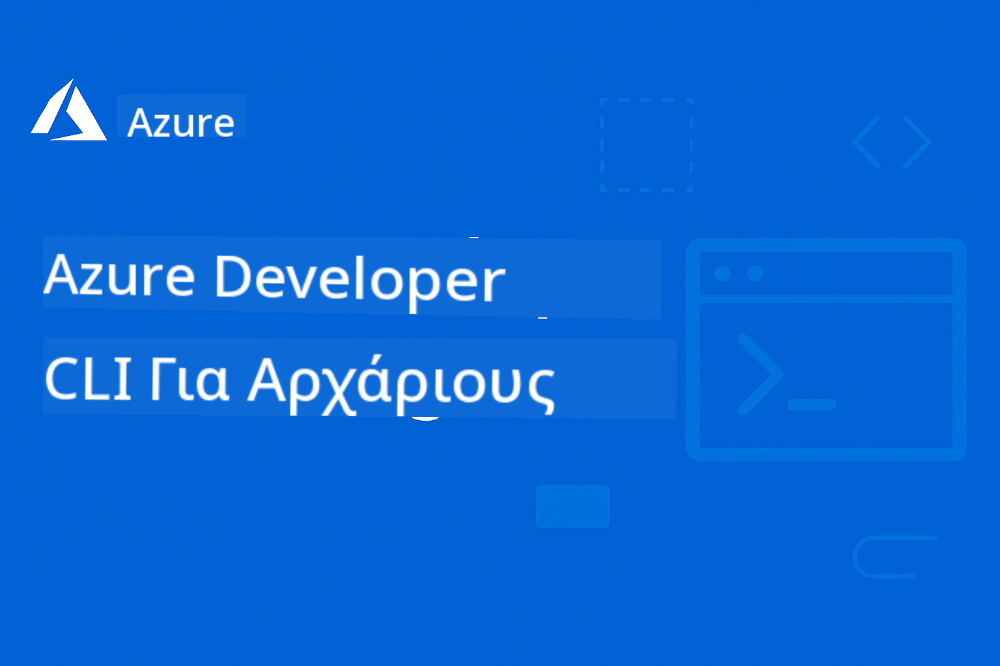

<!--
CO_OP_TRANSLATOR_METADATA:
{
  "original_hash": "3bd0e0644b110276e4364eb753ddcef8",
  "translation_date": "2025-09-09T20:52:51+00:00",
  "source_file": "README.md",
  "language_code": "el"
}
-->
# AZD Για Αρχάριους

 

Ακολουθήστε αυτά τα βήματα για να ξεκινήσετε να χρησιμοποιείτε αυτούς τους πόρους:
1. **Κάντε Fork το Αποθετήριο**: Πατήστε [](https://GitHub.com/microsoft/azd-for-beginners/fork)
2. **Κλωνοποιήστε το Αποθετήριο**:   `git clone https://github.com/microsoft/azd-for-beginners.git`
3. [**Γίνετε μέλος στις κοινότητες Azure Discord και γνωρίστε ειδικούς και συναδέλφους προγραμματιστές**](https://discord.com/invite/ByRwuEEgH4)

### 🌐 Υποστήριξη Πολλαπλών Γλωσσών

#### Υποστηρίζεται μέσω GitHub Action (Αυτοματοποιημένο & Πάντα Ενημερωμένο)

[French](../fr/README.md) | [Spanish](../es/README.md) | [German](../de/README.md) | [Russian](../ru/README.md) | [Arabic](../ar/README.md) | [Persian (Farsi)](../fa/README.md) | [Urdu](../ur/README.md) | [Chinese (Simplified)](../zh/README.md) | [Chinese (Traditional, Macau)](../mo/README.md) | [Chinese (Traditional, Hong Kong)](../hk/README.md) | [Chinese (Traditional, Taiwan)](../tw/README.md) | [Japanese](../ja/README.md) | [Korean](../ko/README.md) | [Hindi](../hi/README.md) | [Bengali](../bn/README.md) | [Marathi](../mr/README.md) | [Nepali](../ne/README.md) | [Punjabi (Gurmukhi)](../pa/README.md) | [Portuguese (Portugal)](../pt/README.md) | [Portuguese (Brazil)](../br/README.md) | [Italian](../it/README.md) | [Polish](../pl/README.md) | [Turkish](../tr/README.md) | [Greek](./README.md) | [Thai](../th/README.md) | [Swedish](../sv/README.md) | [Danish](../da/README.md) | [Norwegian](../no/README.md) | [Finnish](../fi/README.md) | [Dutch](../nl/README.md) | [Hebrew](../he/README.md) | [Vietnamese](../vi/README.md) | [Indonesian](../id/README.md) | [Malay](../ms/README.md) | [Tagalog (Filipino)](../tl/README.md) | [Swahili](../sw/README.md) | [Hungarian](../hu/README.md) | [Czech](../cs/README.md) | [Slovak](../sk/README.md) | [Romanian](../ro/README.md) | [Bulgarian](../bg/README.md) | [Serbian (Cyrillic)](../sr/README.md) | [Croatian](../hr/README.md) | [Slovenian](../sl/README.md) | [Ukrainian](../uk/README.md) | [Burmese (Myanmar)](../my/README.md)

**Αν θέλετε να υποστηριχθούν επιπλέον γλώσσες, οι διαθέσιμες γλώσσες παρατίθενται [εδώ](https://github.com/Azure/co-op-translator/blob/main/getting_started/supported-languages.md)**

## Εισαγωγή

Καλώς ήρθατε στον ολοκληρωμένο οδηγό για το Azure Developer CLI (azd). Αυτό το αποθετήριο έχει σχεδιαστεί για να βοηθήσει προγραμματιστές όλων των επιπέδων, από φοιτητές έως επαγγελματίες, να μάθουν και να κατακτήσουν το Azure Developer CLI για αποτελεσματικές αναπτύξεις στο cloud. Αυτός ο δομημένος εκπαιδευτικός πόρος παρέχει πρακτική εμπειρία με αναπτύξεις στο Azure cloud, αντιμετώπιση κοινών προβλημάτων και εφαρμογή βέλτιστων πρακτικών για επιτυχημένες αναπτύξεις προτύπων AZD.

## Στόχοι Μάθησης

Εργαζόμενοι με αυτό το αποθετήριο, θα:
- Κατανοήσετε τα βασικά και τις κύριες έννοιες του Azure Developer CLI
- Μάθετε να αναπτύσσετε και να προμηθεύετε πόρους Azure χρησιμοποιώντας Infrastructure as Code
- Αναπτύξετε δεξιότητες αντιμετώπισης προβλημάτων για κοινά ζητήματα ανάπτυξης AZD
- Κατανοήσετε την επικύρωση πριν την ανάπτυξη και τον προγραμματισμό χωρητικότητας
- Εφαρμόσετε βέλτιστες πρακτικές ασφάλειας και στρατηγικές βελτιστοποίησης κόστους
- Αποκτήσετε αυτοπεποίθηση στην ανάπτυξη εφαρμογών έτοιμων για παραγωγή στο Azure

## Αποτελέσματα Μάθησης

Μετά την ολοκλήρωση αυτού του μαθήματος, θα μπορείτε να:
- Εγκαταστήσετε, να ρυθμίσετε και να χρησιμοποιήσετε με επιτυχία το Azure Developer CLI
- Δημιουργήσετε και να αναπτύξετε εφαρμογές χρησιμοποιώντας πρότυπα AZD
- Αντιμετωπίσετε προβλήματα αυθεντικοποίησης, υποδομής και ανάπτυξης
- Εκτελέσετε ελέγχους πριν την ανάπτυξη, συμπεριλαμβανομένου του προγραμματισμού χωρητικότητας και της επιλογής SKU
- Εφαρμόσετε βέλτιστες πρακτικές παρακολούθησης, ασφάλειας και διαχείρισης κόστους
- Ενσωματώσετε ροές εργασίας AZD σε CI/CD pipelines

## Πίνακας Περιεχομένων

- [Τι είναι το Azure Developer CLI;](../..)
- [Γρήγορη Εκκίνηση](../..)
- [Τεκμηρίωση](../..)
- [Παραδείγματα & Πρότυπα](../..)
- [Πόροι](../..)
- [Συμβολή](../..)

## Τι είναι το Azure Developer CLI;

Το Azure Developer CLI (azd) είναι μια διεπαφή γραμμής εντολών προσανατολισμένη στους προγραμματιστές που επιταχύνει τη διαδικασία δημιουργίας και ανάπτυξης εφαρμογών στο Azure. Παρέχει:

- **Αναπτύξεις βάσει προτύπων** - Χρησιμοποιήστε προκατασκευασμένα πρότυπα για κοινά μοτίβα εφαρμογών
- **Infrastructure as Code** - Διαχειριστείτε πόρους Azure χρησιμοποιώντας Bicep ή Terraform
- **Ενσωματωμένες ροές εργασίας** - Προμηθεύστε, αναπτύξτε και παρακολουθήστε εφαρμογές χωρίς προβλήματα
- **Φιλικό προς τους προγραμματιστές** - Βελτιστοποιημένο για παραγωγικότητα και εμπειρία προγραμματιστών

## Γρήγορη Εκκίνηση

### Προαπαιτούμενα
- Συνδρομή Azure
- Εγκατεστημένο Azure CLI
- Git (για κλωνοποίηση προτύπων)

### Εγκατάσταση
```bash
# Windows (PowerShell)
powershell -ex AllSigned -c "Invoke-RestMethod 'https://aka.ms/install-azd.ps1' | Invoke-Expression"

# macOS/Linux
curl -fsSL https://aka.ms/install-azd.sh | bash
```

### Η Πρώτη σας Ανάπτυξη
```bash
# Initialize a new project
azd init --template todo-nodejs-mongo

# Provision Azure resources and deploy
azd up
```

## Τεκμηρίωση

### Ξεκινώντας
- [**Βασικά AZD**](docs/getting-started/azd-basics.md) - Κύριες έννοιες και ορολογία
- [**Εγκατάσταση & Ρύθμιση**](docs/getting-started/installation.md) - Οδηγοί εγκατάστασης ανά πλατφόρμα
- [**Ρύθμιση Παραμέτρων**](docs/getting-started/configuration.md) - Ρύθμιση περιβάλλοντος και αυθεντικοποίηση
- [**Το Πρώτο σας Έργο**](docs/getting-started/first-project.md) - Βήμα προς βήμα οδηγός

### Ανάπτυξη & Προμήθεια
- [**Οδηγός Ανάπτυξης**](docs/deployment/deployment-guide.md) - Πλήρεις ροές εργασίας ανάπτυξης
- [**Προμήθεια Πόρων**](docs/deployment/provisioning.md) - Διαχείριση πόρων Azure

### Έλεγχοι Πριν την Ανάπτυξη
- [**Προγραμματισμός Χωρητικότητας**](docs/pre-deployment/capacity-planning.md) - Επικύρωση χωρητικότητας πόρων Azure
- [**Επιλογή SKU**](docs/pre-deployment/sku-selection.md) - Επιλογή κατάλληλων SKU Azure
- [**Έλεγχοι Πριν την Πτήση**](docs/pre-deployment/preflight-checks.md) - Αυτοματοποιημένα σενάρια επικύρωσης

### Αντιμετώπιση Προβλημάτων
- [**Κοινά Ζητήματα**](docs/troubleshooting/common-issues.md) - Συχνά προβλήματα και λύσεις
- [**Οδηγός Εντοπισμού Σφαλμάτων**](docs/troubleshooting/debugging.md) - Στρατηγικές εντοπισμού σφαλμάτων βήμα προς βήμα

## Παραδείγματα & Πρότυπα

### Πρότυπα Εκκίνησης
- [**Απλή Εφαρμογή Ιστού**](../../examples/simple-web-app) - Βασική ανάπτυξη εφαρμογής Node.js
- [**Στατικός Ιστότοπος**](../../examples/static-website) - Φιλοξενία στατικού ιστότοπου στο Azure Storage
- [**Εφαρμογή Container**](../../examples/container-app) - Ανάπτυξη εφαρμογής σε container
- [**Εφαρμογή Βάσης Δεδομένων**](../../examples/database-app) - Εφαρμογή ιστού με ενσωμάτωση βάσης δεδομένων

### Προχωρημένα Σενάρια
- [**Microservices**](../../examples/microservices) - Αρχιτεκτονική εφαρμογής πολλαπλών υπηρεσιών
- [**Λειτουργίες Serverless**](../../examples/serverless-function) - Ανάπτυξη Azure Functions
- [**Παραδείγματα Ρυθμίσεων**](../../examples/configurations) - Επαναχρησιμοποιήσιμα μοτίβα ρυθμίσεων

## Πόροι

### Γρήγορες Αναφορές
- [**Φύλλο Εντολών**](resources/cheat-sheet.md) - Βασικές εντολές azd
- [**Γλωσσάρι**](resources/glossary.md) - Ορολογία Azure και azd
- [**Συχνές Ερωτήσεις**](resources/faq.md) - Συχνές ερωτήσεις
- [**Οδηγός Μελέτης**](resources/study-guide.md) - Στόχοι μάθησης και ασκήσεις πρακτικής

### Εξωτερικοί Πόροι
- [Τεκμηρίωση Azure Developer CLI](https://learn.microsoft.com/en-us/azure/developer/azure-developer-cli/)
- [Κέντρο Αρχιτεκτονικής Azure](https://learn.microsoft.com/en-us/azure/architecture/)
- [Υπολογιστής Τιμών Azure](https://azure.microsoft.com/pricing/calculator/)
- [Κατάσταση Azure](https://status.azure.com/)

## Εκπαιδευτική Διαδρομή

### Για Φοιτητές & Αρχάριους
1. Ξεκινήστε με [Βασικά AZD](docs/getting-started/azd-basics.md)
2. Ακολουθήστε τον [Οδηγό Εγκατάστασης](docs/getting-started/installation.md)
3. Ολοκληρώστε [Το Πρώτο σας Έργο](docs/getting-started/first-project.md)
4. Εξασκηθείτε με το [Παράδειγμα Απλής Εφαρμογής Ιστού](../../examples/simple-web-app)

### Για Προγραμματιστές
1. Ανασκοπήστε τον [Οδηγό Ρύθμισης Παραμέτρων](docs/getting-started/configuration.md)
2. Μελετήστε τον [Οδηγό Ανάπτυξης](docs/deployment/deployment-guide.md)
3. Εργαστείτε με το [Παράδειγμα Εφαρμογής Βάσης Δεδομένων](../../examples/database-app)
4. Εξερευνήστε το [Παράδειγμα Εφαρμογής Container](../../examples/container-app)

### Για Μηχανικούς DevOps
1. Κατακτήστε την [Προμήθεια Πόρων](docs/deployment/provisioning.md)
2. Εφαρμόστε τους [Ελέγχους Πριν την Πτήση](docs/pre-deployment/preflight-checks.md)
3. Εξασκηθείτε στον [Προγραμματισμό Χωρητικότητας](docs/pre-deployment/capacity-planning.md)
4. Προχωρήστε στο [Παράδειγμα Microservices](../../examples/microservices)

## Συμβολή

Καλωσορίζουμε τις συνεισφορές! Διαβάστε τον [Οδηγό Συμβολής](CONTRIBUTING.md) για λεπτομέρειες σχετικά με:
- Πώς να υποβάλετε ζητήματα και αιτήματα για χαρακτηριστικά
- Κατευθυντήριες γραμμές για συνεισφορά κώδικα
- Βελτιώσεις τεκμηρίωσης
- Πρότυπα κοινότητας

## Υποστήριξη

- **Ζητήματα**: [Αναφέρετε σφάλματα και ζητήστε χαρακτηριστικά](https://github.com/microsoft/azd-for-beginners/issues)
- **Συζητήσεις**: [Microsoft Azure Discord Community Q&A και συζητήσεις](https://discord.gg/microsoft-azure)
- **Email**: Για ιδιωτικές ερωτήσεις
- **Microsoft Learn**: [Επίσημη τεκμηρίωση Azure Developer CLI](https://learn.microsoft.com/en-us/azure/developer/azure-developer-cli/)

## Άδεια Χρήσης

Αυτό το έργο έχει άδεια χρήσης MIT - δείτε το αρχείο [LICENSE](../../LICENSE) για λεπτομέρειες.

## 🎒 Άλλα Μαθήματα

Η ομάδα μας δημιουργεί και άλλα μαθήματα! Δείτε:

- [**ΝΕΟ** Model Context Protocol (MCP) Για Αρχάριους](https://github.com/microsoft/mcp-for-beginners?WT.mc_id=academic-105485-koreyst)
- [AI Agents για Αρχάριους](https://github.com/microsoft/ai-agents-for-beginners?WT.mc_id=academic-105485-koreyst)
- [Generative AI για Αρχάριους χρησιμοποιώντας .NET](https://github.com/microsoft/Generative-AI-for-beginners-dotnet?WT.mc_id=academic-105485-koreyst)
- [Generative AI για Αρχάριους](https://github.com/microsoft/generative-ai-for-beginners?WT.mc_id=academic-105485-koreyst)
- [Generative AI για Αρχάριους χρησιμοποιώντας Java](https://github.com/microsoft/generative-ai-for-beginners-java?WT.mc_id=academic-105485-koreyst)
- [ML για Αρχάριους](https://aka.ms/ml-beginners?WT.mc_id=academic-105485-koreyst)
- [Επιστήμη Δεδομένων για Αρχάριους](https://aka.ms/datascience-beginners?WT.mc_id=academic-105485-koreyst)
- [AI για Αρχάριους](https://aka.ms/ai-beginners?WT.mc_id=academic-105485-koreyst)
- [Κυβερνοασφάλεια για Αρχάριους](https://github.com/microsoft/Security-101??WT.mc_id=academic-96948-sayoung)
- [Web Dev για Αρχάριους](https://aka.ms/webdev-beginners?WT.mc_id=academic-105485-koreyst)  
- [IoT για Αρχάριους](https://aka.ms/iot-beginners?WT.mc_id=academic-105485-koreyst)  
- [Ανάπτυξη XR για Αρχάριους](https://github.com/microsoft/xr-development-for-beginners?WT.mc_id=academic-105485-koreyst)  
- [Κατανόηση του GitHub Copilot για Συνεργατική Προγραμματιστική Τεχνητής Νοημοσύνης](https://aka.ms/GitHubCopilotAI?WT.mc_id=academic-105485-koreyst)  
- [Κατανόηση του GitHub Copilot για Προγραμματιστές C#/.NET](https://github.com/microsoft/mastering-github-copilot-for-dotnet-csharp-developers?WT.mc_id=academic-105485-koreyst)  
- [Επιλέξτε τη Δική σας Περιπέτεια με το Copilot](https://github.com/microsoft/CopilotAdventures?WT.mc_id=academic-105485-koreyst)  

---

**Πλοήγηση**  
- **Επόμενο Μάθημα**: [Βασικά του AZD](docs/getting-started/azd-basics.md)  

---

**Αποποίηση ευθύνης**:  
Αυτό το έγγραφο έχει μεταφραστεί χρησιμοποιώντας την υπηρεσία αυτόματης μετάφρασης [Co-op Translator](https://github.com/Azure/co-op-translator). Παρόλο που καταβάλλουμε προσπάθειες για ακρίβεια, παρακαλούμε να έχετε υπόψη ότι οι αυτοματοποιημένες μεταφράσεις ενδέχεται να περιέχουν λάθη ή ανακρίβειες. Το πρωτότυπο έγγραφο στη μητρική του γλώσσα θα πρέπει να θεωρείται η αυθεντική πηγή. Για κρίσιμες πληροφορίες, συνιστάται επαγγελματική ανθρώπινη μετάφραση. Δεν φέρουμε ευθύνη για τυχόν παρεξηγήσεις ή εσφαλμένες ερμηνείες που προκύπτουν από τη χρήση αυτής της μετάφρασης.