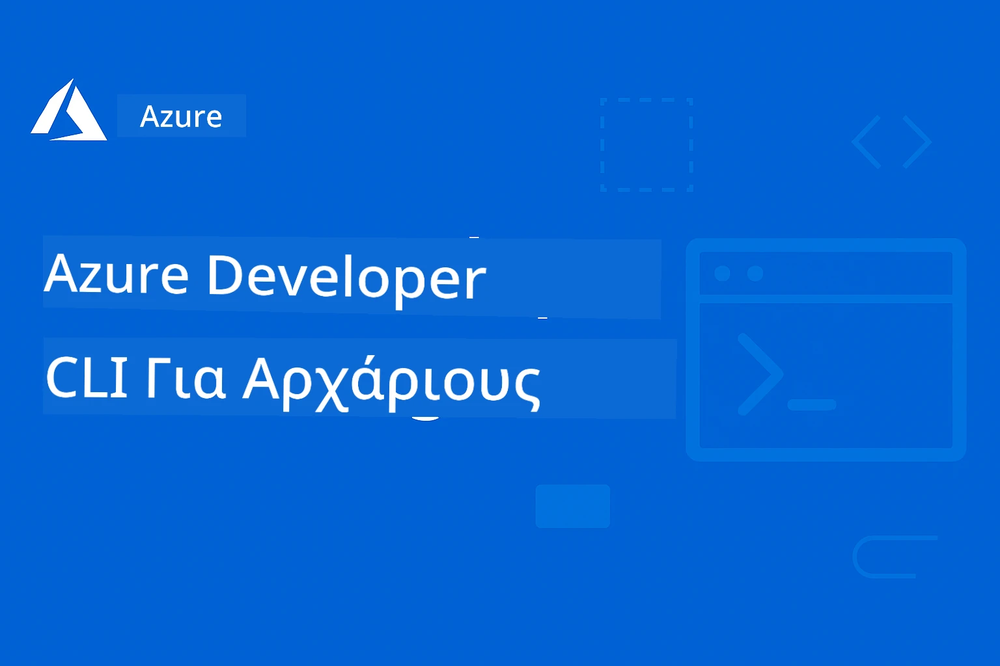

# AZD Για Αρχάριους: Ένα Δομημένο Μονοπάτι Μάθησης

 

[](https://GitHub.com/microsoft/azd-for-beginners/watchers/)
[](https://GitHub.com/microsoft/azd-for-beginners/network/)
[](https://GitHub.com/microsoft/azd-for-beginners/stargazers/)

[](https://discord.gg/microsoft-azure)
[](https://discord.gg/nTYy5BXMWG)

---

### Αυτοματοποιημένες Μεταφράσεις (Πάντα Ενημερωμένες)

<!-- CO-OP TRANSLATOR LANGUAGES TABLE START -->
[Αραβικά](../ar/README.md) | [Μπενγκάλι](../bn/README.md) | [Βουλγαρικά](../bg/README.md) | [Βιρμανικά (Μιανμάρ)](../my/README.md) | [Κινεζικά (Απλοποιημένα)](../zh-CN/README.md) | [Κινεζικά (Παραδοσιακά, Χονγκ Κονγκ)](../zh-HK/README.md) | [Κινεζικά (Παραδοσιακά, Μακάου)](../zh-MO/README.md) | [Κινεζικά (Παραδοσιακά, Ταϊβάν)](../zh-TW/README.md) | [Κροατικά](../hr/README.md) | [Τσεχικά](../cs/README.md) | [Δανικά](../da/README.md) | [Ολλανδικά](../nl/README.md) | [Εσθονικά](../et/README.md) | [Φινλανδικά](../fi/README.md) | [Γαλλικά](../fr/README.md) | [Γερμανικά](../de/README.md) | [Ελληνικά](./README.md) | [Εβραϊκά](../he/README.md) | [Χίντι](../hi/README.md) | [Ουγγρικά](../hu/README.md) | [Ινδονησιακά](../id/README.md) | [Ιταλικά](../it/README.md) | [Ιαπωνικά](../ja/README.md) | [Κανάντα](../kn/README.md) | [Κορεατικά](../ko/README.md) | [Λιθουανικά](../lt/README.md) | [Μαλαιικά](../ms/README.md) | [Μαλαγιάλαμ](../ml/README.md) | [Μαράθι](../mr/README.md) | [Νεπαλικά](../ne/README.md) | [Νιγηριανό Pidgin](../pcm/README.md) | [Νορβηγικά](../no/README.md) | [Περσικά (Φαρσί)](../fa/README.md) | [Πολωνικά](../pl/README.md) | [Πορτογαλικά (Βραζιλία)](../pt-BR/README.md) | [Πορτογαλικά (Πορτογαλία)](../pt-PT/README.md) | [Πουντζάμπι (Gurmukhi)](../pa/README.md) | [Ρουμανικά](../ro/README.md) | [Ρωσικά](../ru/README.md) | [Σερβικά (Κυριλλικά)](../sr/README.md) | [Σλοβακικά](../sk/README.md) | [Σλοβενικά](../sl/README.md) | [Ισπανικά](../es/README.md) | [Σουαχίλι](../sw/README.md) | [Σουηδικά](../sv/README.md) | [Ταγκαλόγκ (Φιλιππινικά)](../tl/README.md) | [Ταμίλ](../ta/README.md) | [Τελούγκου](../te/README.md) | [Ταϊλανδικά](../th/README.md) | [Τουρκικά](../tr/README.md) | [Ουκρανικά](../uk/README.md) | [Ουρντού](../ur/README.md) | [Βιετναμέζικα](../vi/README.md)

> **Προτιμάτε να κλωνοποιήσετε τοπικά;**
>
> Αυτό το αποθετήριο περιλαμβάνει πάνω από 50 μεταφράσεις που αυξάνουν σημαντικά το μέγεθος λήψης. Για να κάνετε clone χωρίς τις μεταφράσεις, χρησιμοποιήστε το sparse checkout:
>
> **Bash / macOS / Linux:**
> ```bash
> git clone --filter=blob:none --sparse https://github.com/microsoft/AZD-for-beginners.git
> cd AZD-for-beginners
> git sparse-checkout set --no-cone '/*' '!translations' '!translated_images'
> ```
>
> **CMD (Windows):**
> ```cmd
> git clone --filter=blob:none --sparse https://github.com/microsoft/AZD-for-beginners.git
> cd AZD-for-beginners
> git sparse-checkout set --no-cone "/*" "!translations" "!translated_images"
> ```
>
> Αυτό σας δίνει όλα όσα χρειάζεστε για να ολοκληρώσετε το μάθημα με πολύ γρηγορότερη λήψη.
<!-- CO-OP TRANSLATOR LANGUAGES TABLE END -->

## 🚀 Τι είναι το Azure Developer CLI (azd);

**Azure Developer CLI (azd)** είναι ένα εργαλείο γραμμής εντολών φιλικό προς τον προγραμματιστή που κάνει απλή την ανάπτυξη εφαρμογών στο Azure. Αντί να δημιουργείτε και να συνδέετε χειροκίνητα δεκάδες πόρους Azure, μπορείτε να αναπτύξετε ολόκληρες εφαρμογές με μία εντολή.

### Η Μαγεία του `azd up`

```bash
# Αυτή η εντολή κάνει τα πάντα:
# ✅ Δημιουργεί όλους τους πόρους Azure
# ✅ Διαμορφώνει τη δικτύωση και την ασφάλεια
# ✅ Κατασκευάζει τον κώδικά της εφαρμογής σας
# ✅ Αναπτύσσει στο Azure
# ✅ Σας δίνει μια λειτουργική διεύθυνση URL
azd up
```

**Αυτό ήταν!** Καμία πλοήγηση στο Azure Portal, δεν χρειάζεται να μάθετε πολύπλοκα ARM templates πρώτα, καμία χειροκίνητη διαμόρφωση - απλά λειτουργικές εφαρμογές στο Azure.

---

## ❓ Azure Developer CLI vs Azure CLI: Ποια είναι η Διαφορά;

Αυτή είναι η πιο συνηθισμένη ερώτηση που κάνουν οι αρχάριοι. Εδώ είναι η απλή απάντηση:

| Feature | **Azure CLI (`az`)** | **Azure Developer CLI (`azd`)** |
|---------|---------------------|--------------------------------|
| **Purpose** | Manage individual Azure resources | Deploy complete applications |
| **Mindset** | Infrastructure-focused | Application-focused |
| **Example** | `az webapp create --name myapp...` | `azd up` |
| **Learning Curve** | Must know Azure services | Just know your app |
| **Best For** | DevOps, Infrastructure | Developers, Prototyping |

(Μετάφραση της παραπάνω πίνακας στη συνέχεια)

- Purpose -> Σκοπός
- Mindset -> Νοοτροπία
- Example -> Παράδειγμα
- Learning Curve -> Καμπύλη Μάθησης
- Best For -> Κατάλληλο για

### Απλή Αναλογία

- **Azure CLI** είναι σαν να έχετε όλα τα εργαλεία για να χτίσετε ένα σπίτι - σφυριά, πριόνια, καρφιά. Μπορείτε να φτιάξετε οτιδήποτε, αλλά πρέπει να γνωρίζετε κατασκευή.
- **Azure Developer CLI** είναι σαν να προσλαμβάνετε έναν εργολάβο - περιγράφετε αυτό που θέλετε και αυτός αναλαμβάνει την κατασκευή.

### Πότε να Χρησιμοποιήσετε Το Καθένα

| Scenario | Use This |
|----------|----------|
| "I want to deploy my web app quickly" | `azd up` |
| "I need to create just a storage account" | `az storage account create` |
| "I'm building a full AI application" | `azd init --template azure-search-openai-demo` |
| "I need to debug a specific Azure resource" | `az resource show` |
| "I want production-ready deployment in minutes" | `azd up --environment production` |

### Λειτουργούν Μαζί!

Το AZD χρησιμοποιεί το Azure CLI ως βάση. Μπορείτε να χρησιμοποιήσετε και τα δύο:
```bash
# Αναπτύξτε την εφαρμογή σας με το AZD
azd up

# Στη συνέχεια, ρυθμίστε συγκεκριμένους πόρους με το Azure CLI
az webapp config set --name myapp --always-on true
```

---

## 🌟 Βρείτε Πρότυπα στο Awesome AZD

Μην ξεκινάτε από το μηδέν! Το **Awesome AZD** είναι μια συλλογή της κοινότητας με έτοιμα προς ανάπτυξη πρότυπα:

| Resource | Description |
|----------|-------------|
| 🔗 [**Awesome AZD Gallery**](https://azure.github.io/awesome-azd/) | Περιηγηθείτε σε 200+ πρότυπα με ανάπτυξη με ένα κλικ |
| 🔗 [**Submit a Template**](https://github.com/Azure/awesome-azd/issues) | Συνεισφέρετε το δικό σας πρότυπο στην κοινότητα |
| 🔗 [**GitHub Repository**](https://github.com/Azure/awesome-azd) | Βάλτε αστέρι και εξερευνήστε τον κώδικα |

### Δημοφιλή Πρότυπα AI από το Awesome AZD

```bash
# Συνομιλία RAG με Azure OpenAI + AI Αναζήτηση
azd init --template azure-search-openai-demo

# Γρήγορη Εφαρμογή Συνομιλίας AI
azd init --template openai-chat-app-quickstart

# Πράκτορες AI με Foundry Agents
azd init --template get-started-with-ai-agents
```

---

## 🎯 Ξεκινώντας σε 3 Βήματα

### Βήμα 1: Εγκαταστήστε το AZD (2 λεπτά)

**Windows:**
```powershell
winget install microsoft.azd
```

**macOS:**
```bash
brew tap azure/azd && brew install azd
```

**Linux:**
```bash
curl -fsSL https://aka.ms/install-azd.sh | bash
```

### Βήμα 2: Σύνδεση στο Azure

```bash
azd auth login
```

### Βήμα 3: Αναπτύξτε την Πρώτη σας Εφαρμογή

```bash
# Αρχικοποίηση από ένα πρότυπο
azd init --template todo-nodejs-mongo

# Ανάπτυξη στο Azure (δημιουργεί τα πάντα!)
azd up
```

**🎉 Αυτό ήταν!** Η εφαρμογή σας είναι πλέον διαθέσιμη στο Azure.

### Καθαρισμός (Μην το Ξεχάσετε!)

```bash
# Remove all resources when done experimenting
azd down --force --purge
```

---

## 📚 Πώς να Χρησιμοποιήσετε Αυτό το Μάθημα

Αυτό το μάθημα έχει σχεδιαστεί για **προοδευτική μάθηση** - ξεκινήστε από όπου νιώθετε άνετα και προχωρήστε βαθύτερα:

| Your Experience | Start Here |
|-----------------|------------|
| **Εντελώς νέος στο Azure** | [Chapter 1: Foundation](../..) |
| **Γνωρίζετε το Azure, νέος στο AZD** | [Chapter 1: Foundation](../..) |
| **Θέλετε να αναπτύξετε εφαρμογές AI** | [Chapter 2: AI-First Development](../..) |
| **Θέλετε πρακτική εξάσκηση** | [🎓 Διαδραστικό Εργαστήριο](workshop/README.md) - 3-4 ωρών καθοδηγούμενο εργαστήριο |
| **Χρειάζεστε πρότυπα παραγωγής** | [Chapter 8: Production & Enterprise](../..) |

### Γρήγορη Ρύθμιση

1. **Κάντε Fork Αυτό το Αποθετήριο**: [](https://GitHub.com/microsoft/azd-for-beginners/fork)
2. **Κλωνοποιήστε το**: `git clone https://github.com/YOUR-USERNAME/azd-for-beginners.git`
3. **Λάβετε Βοήθεια**: [Κοινότητα Azure στο Discord](https://discord.com/invite/ByRwuEEgH4)

> **Προτιμάτε να κλωνοποιήσετε τοπικά;**

> Αυτό το αποθετήριο περιλαμβάνει πάνω από 50 μεταφράσεις που αυξάνουν σημαντικά το μέγεθος λήψης. Για να κάνετε clone χωρίς τις μεταφράσεις, χρησιμοποιήστε το sparse checkout:
> ```bash
> git clone --filter=blob:none --sparse https://github.com/microsoft/AZD-for-beginners.git
> cd AZD-for-beginners
> git sparse-checkout set --no-cone '/*' '!translations' '!translated_images'
> ```
> Αυτό σας δίνει όλα όσα χρειάζεστε για να ολοκληρώσετε το μάθημα με πολύ γρηγορότερη λήψη.


## Επισκόπηση Μαθήματος

Κατακτήστε το Azure Developer CLI (azd) μέσω δομημένων κεφαλαίων σχεδιασμένων για προοδευτική μάθηση. **Ειδική εστίαση στην ανάπτυξη εφαρμογών AI με ενσωμάτωση Microsoft Foundry.**

### Γιατί Αυτό το Μάθημα Είναι Απαραίτητο για Σύγχρονους Προγραμματιστές

Βασισμένο σε πληροφορίες από την κοινότητα Discord του Microsoft Foundry, **το 45% των προγραμματιστών θέλει να χρησιμοποιήσει το AZD για AI workloads** αλλά αντιμετωπίζει προκλήσεις με:
- Πολύπλοκες αρχιτεκτονικές AI με πολλαπλές υπηρεσίες
- Καλές πρακτικές ανάπτυξης AI σε παραγωγή  
- Ενσωμάτωση και διαμόρφωση υπηρεσιών Azure AI
- Βελτιστοποίηση κόστους για workloads AI
- Αντιμετώπιση σφαλμάτων και προβλημάτων ανάπτυξης ειδικά για AI

### Στόχοι Μάθησης

Ολοκληρώνοντας αυτό το δομημένο μάθημα, θα:
- **Κατανοήσετε τα Βασικά του AZD**: Κύριες έννοιες, εγκατάσταση και διαμόρφωση
- **Αναπτύξετε Εφαρμογές AI**: Χρησιμοποιήστε το AZD με υπηρεσίες Microsoft Foundry
- **Εφαρμόσετε Υποδομή ως Κώδικα**: Διαχειριστείτε πόρους Azure με πρότυπα Bicep
- **Επιλύετε Προβλήματα Αναπτύξεων**: Εντοπισμός και επίλυση συνηθισμένων προβλημάτων
- **Βελτιστοποιήσετε για Παραγωγή**: Ασφάλεια, κλιμάκωση, παρακολούθηση και διαχείριση κόστους
- **Δημιουργήσετε Λύσεις με Πολλούς Πράκτορες**: Αναπτύξτε σύνθετες αρχιτεκτονικές AI

## 🗺️ Χάρτης Μαθήματος: Γρήγορη Πλοήγηση κατά Κεφάλαιο

Κάθε κεφάλαιο έχει ένα αφιερωμένο README με στόχους μάθησης, γρήγορα ξεκινήματα και ασκήσεις:

| Chapter | Topic | Lessons | Duration | Complexity |
|---------|-------|---------|----------|------------|
| **[Κεφ. 1: Θεμέλιο](docs/chapter-01-foundation/README.md)** | Getting Started | [AZD Basics](docs/chapter-01-foundation/azd-basics.md) &#124; [Installation](docs/chapter-01-foundation/installation.md) &#124; [First Project](docs/chapter-01-foundation/first-project.md) | 30-45 min | ⭐ |
| **[Κεφ. 2: Ανάπτυξη AI](docs/chapter-02-ai-development/README.md)** | AI-First Apps | [Foundry Integration](docs/chapter-02-ai-development/microsoft-foundry-integration.md) &#124; [AI Agents](docs/chapter-02-ai-development/agents.md) &#124; [Model Deployment](docs/chapter-02-ai-development/ai-model-deployment.md) &#124; [Workshop](docs/chapter-02-ai-development/ai-workshop-lab.md) | 1-2 hrs | ⭐⭐ |
| **[Κεφ. 3: Διαμόρφωση](docs/chapter-03-configuration/README.md)** | Auth & Security | [Configuration](docs/chapter-03-configuration/configuration.md) &#124; [Auth & Security](docs/chapter-03-configuration/authsecurity.md) | 45-60 min | ⭐⭐ |
| **[Κεφ. 4: Υποδομή](docs/chapter-04-infrastructure/README.md)** | IaC & Ανάπτυξη | [Οδηγός Ανάπτυξης](docs/chapter-04-infrastructure/deployment-guide.md) &#124; [Παροχή Πόρων](docs/chapter-04-infrastructure/provisioning.md) | 1-1.5 ώρες | ⭐⭐⭐ |
| **[Κεφ. 5: Πολλαπλοί Πράκτορες](docs/chapter-05-multi-agent/README.md)** | Λύσεις Πρακτόρων AI | [Σενάριο Λιανικής](examples/retail-scenario.md) &#124; [Πρότυπα Συντονισμού](docs/chapter-06-pre-deployment/coordination-patterns.md) | 2-3 ώρες | ⭐⭐⭐⭐ |
| **[Κεφ. 6: Προ-Ανάπτυξη](docs/chapter-06-pre-deployment/README.md)** | Σχεδιασμός & Επικύρωση | [Προκαταρκτικοί Έλεγχοι](docs/chapter-06-pre-deployment/preflight-checks.md) &#124; [Σχεδιασμός Χωρητικότητας](docs/chapter-06-pre-deployment/capacity-planning.md) &#124; [Επιλογή SKU](docs/chapter-06-pre-deployment/sku-selection.md) &#124; [App Insights](docs/chapter-06-pre-deployment/application-insights.md) | 1 ώρα | ⭐⭐ |
| **[Κεφ. 7: Επίλυση Προβλημάτων](docs/chapter-07-troubleshooting/README.md)** | Ανάλυση Σφαλμάτων & Επιδιόρθωση | [Συνηθισμένα Προβλήματα](docs/chapter-07-troubleshooting/common-issues.md) &#124; [Αποσφαλμάτωση](docs/chapter-07-troubleshooting/debugging.md) &#124; [Προβλήματα AI](docs/chapter-07-troubleshooting/ai-troubleshooting.md) | 1-1.5 ώρες | ⭐⭐ |
| **[Κεφ. 8: Παραγωγή](docs/chapter-08-production/README.md)** | Επιχειρησιακά Πρότυπα | [Πρακτικές Παραγωγής](docs/chapter-08-production/production-ai-practices.md) | 2-3 ώρες | ⭐⭐⭐⭐ |
| **[🎓 Εργαστήριο](workshop/README.md)** | Πρακτικό Εργαστήριο | [Εισαγωγή](workshop/docs/instructions/0-Introduction.md) &#124; [Επιλογή](workshop/docs/instructions/1-Select-AI-Template.md) &#124; [Επικύρωση](workshop/docs/instructions/2-Validate-AI-Template.md) &#124; [Αποδόμηση](workshop/docs/instructions/3-Deconstruct-AI-Template.md) &#124; [Διαμόρφωση](workshop/docs/instructions/4-Configure-AI-Template.md) &#124; [Προσαρμογή](workshop/docs/instructions/5-Customize-AI-Template.md) &#124; [Αποσυναρμολόγηση](workshop/docs/instructions/6-Teardown-Infrastructure.md) &#124; [Σύνοψη](workshop/docs/instructions/7-Wrap-up.md) | 3-4 ώρες | ⭐⭐ |

**Συνολική Διάρκεια Μαθήματος:** ~10-14 ώρες | **Εξέλιξη Δεξιοτήτων:** Αρχάριος → Έτοιμος για Παραγωγή

---

## 📚 Κεφάλαια Μάθησης

*Επιλέξτε την πορεία μάθησης με βάση το επίπεδο εμπειρίας και τους στόχους*

### 🚀 Κεφάλαιο 1: Βάση & Γρήγορη Εκκίνηση
**Προαπαιτούμενα**: Συνδρομή Azure, βασικές γνώσεις γραμμής εντολών  
**Διάρκεια**: 30-45 λεπτά  
**Πολυπλοκότητα**: ⭐

#### Τι θα μάθετε
- Κατανόηση των βασικών του Azure Developer CLI
- Εγκατάσταση του AZD στην πλατφόρμα σας
- Η πρώτη σας επιτυχημένη ανάπτυξη

#### Πόροι Μάθησης
- **🎯 Ξεκινήστε Εδώ**: [Τι είναι το Azure Developer CLI;](../..)
- **📖 Θεωρία**: [Βασικά του AZD](docs/chapter-01-foundation/azd-basics.md) - Βασικές έννοιες και ορολογία
- **⚙️ Ρύθμιση**: [Εγκατάσταση & Ρύθμιση](docs/chapter-01-foundation/installation.md) - Οδηγοί κατά πλατφόρμα
- **🛠️ Πρακτικά**: [Το Πρώτο Σας Έργο](docs/chapter-01-foundation/first-project.md) - Οδηγός βήμα προς βήμα
- **📋 Γρήγορη Αναφορά**: [Συμπυκνωμένος Οδηγός Εντολών](resources/cheat-sheet.md)

#### Πρακτικές Ασκήσεις
```bash
# Γρήγορος έλεγχος εγκατάστασης
azd version

# Αναπτύξτε την πρώτη σας εφαρμογή
azd init --template todo-nodejs-mongo
azd up
```

**💡 Αποτέλεσμα Κεφαλαίου**: Αναπτύξτε με επιτυχία μια απλή web εφαρμογή στο Azure χρησιμοποιώντας AZD

**✅ Επικύρωση Επιτυχίας:**
```bash
# Μετά την ολοκλήρωση του Κεφαλαίου 1, θα πρέπει να μπορείτε να:
azd version              # Εμφανίζει την εγκατεστημένη έκδοση
azd init --template todo-nodejs-mongo  # Αρχικοποιεί το έργο
azd up                  # Αναπτύσσει στο Azure
azd show                # Εμφανίζει το URL της εκτελούμενης εφαρμογής
# Η εφαρμογή ανοίγει στον περιηγητή και λειτουργεί
azd down --force --purge  # Καθαρίζει τους πόρους
```

**📊 Χρόνος Επένδυσης:** 30-45 λεπτά  
**📈 Επίπεδο Δεξιοτήτων Μετά:** Μπορεί να αναπτύξει βασικές εφαρμογές ανεξάρτητα

**✅ Επικύρωση Επιτυχίας:**
```bash
# Μετά την ολοκλήρωση του Κεφαλαίου 1, θα πρέπει να μπορείτε να:
azd version              # Εμφανίζει την εγκατεστημένη έκδοση
azd init --template todo-nodejs-mongo  # Αρχικοποιεί το έργο
azd up                  # Αναπτύσσει στο Azure
azd show                # Εμφανίζει το URL της εκτελούμενης εφαρμογής
# Η εφαρμογή ανοίγει στο πρόγραμμα περιήγησης και λειτουργεί
azd down --force --purge  # Καθαρίζει τους πόρους
```

**📊 Χρόνος Επένδυσης:** 30-45 λεπτά  
**📈 Επίπεδο Δεξιοτήτων Μετά:** Μπορεί να αναπτύξει βασικές εφαρμογές ανεξάρτητα

---

### 🤖 Κεφάλαιο 2: Ανάπτυξη με Προτεραιότητα στο AI (Συνιστάται για Προγραμματιστές AI)
**Προαπαιτούμενα**: Ολοκληρωμένο Κεφάλαιο 1  
**Διάρκεια**: 1-2 ώρες  
**Πολυπλοκότητα**: ⭐⭐

#### Τι θα μάθετε
- Ενσωμάτωση Microsoft Foundry με το AZD
- Ανάπτυξη εφαρμογών με δυνατότητες AI
- Κατανόηση των ρυθμίσεων υπηρεσιών AI

#### Πόροι Μάθησης
- **🎯 Ξεκινήστε Εδώ**: [Ενσωμάτωση Microsoft Foundry](docs/chapter-02-ai-development/microsoft-foundry-integration.md)
- **🤖 Πράκτορες AI**: [Οδηγός Πρακτόρων AI](docs/chapter-02-ai-development/agents.md) - Αναπτύξτε έξυπνους πράκτορες με AZD
- **📖 Πρότυπα**: [Ανάπτυξη Μοντέλων AI](docs/chapter-02-ai-development/ai-model-deployment.md) - Αναπτύξτε και διαχειριστείτε μοντέλα AI
- **🛠️ Εργαστήριο**: [Εργαστήριο AI](docs/chapter-02-ai-development/ai-workshop-lab.md) - Κάντε τις AI λύσεις σας έτοιμες για AZD
- **🎥 Διαδραστικός Οδηγός**: [Υλικά Εργαστηρίου](workshop/README.md) - Μάθηση μέσω προγράμματος περιήγησης με περιβάλλον MkDocs * DevContainer Environment
- **📋 Πρότυπα**: [Προσφερόμενα Πρότυπα Microsoft Foundry](../..)
- **📝 Παραδείγματα**: [Παραδείγματα Ανάπτυξης με AZD](examples/README.md)

#### Πρακτικές Ασκήσεις
```bash
# Αναπτύξτε την πρώτη σας εφαρμογή τεχνητής νοημοσύνης
azd init --template azure-search-openai-demo
azd up

# Δοκιμάστε επιπλέον πρότυπα τεχνητής νοημοσύνης
azd init --template openai-chat-app-quickstart
azd init --template agent-openai-python-prompty
```

**💡 Αποτέλεσμα Κεφαλαίου**: Αναπτύξτε και ρυθμίστε μια εφαρμογή συνομιλίας με δυνατότητες RAG

**✅ Επικύρωση Επιτυχίας:**
```bash
# Μετά το Κεφάλαιο 2, θα πρέπει να μπορείτε να:
azd init --template azure-search-openai-demo
azd up
# Να δοκιμάσετε τη διεπαφή συνομιλίας τεχνητής νοημοσύνης
# Να κάνετε ερωτήσεις και να λαμβάνετε απαντήσεις με τεχνητή νοημοσύνη και πηγές
# Να επαληθεύσετε ότι η ενσωμάτωση της αναζήτησης λειτουργεί
azd monitor  # Να ελέγξετε ότι το Application Insights εμφανίζει τηλεμετρία
azd down --force --purge
```

**📊 Χρόνος Επένδυσης:** 1-2 ώρες  
**📈 Επίπεδο Δεξιοτήτων Μετά:** Μπορεί να αναπτύξει και να ρυθμίσει εφαρμογές AI έτοιμες για παραγωγή  
**💰 Ενημέρωση Κόστους:** Κατανοήστε $80-150/μήνα για development, $300-3500/μήνα για παραγωγή

#### 💰 Παράγοντες Κόστους για Αναπτύξεις AI

**Περιβάλλον Ανάπτυξης (Εκτιμώμενο $80-150/μήνα):**
- Azure OpenAI (Πληρωμή κατά χρήση): $0-50/μήνα (βασισμένο στη χρήση tokens)
- AI Search (Basic tier): $75/μήνα
- Container Apps (Κατανάλωση): $0-20/μήνα
- Storage (Standard): $1-5/μήνα

**Περιβάλλον Παραγωγής (Εκτιμώμενο $300-3,500+/μήνα):**
- Azure OpenAI (PTU για σταθερή απόδοση): $3,000+/μήνα Ή Πληρωμή κατά χρήση με μεγάλο όγκο
- AI Search (Standard tier): $250/μήνα
- Container Apps (Dedicated): $50-100/μήνα
- Application Insights: $5-50/μήνα
- Storage (Premium): $10-50/μήνα

**💡 Συμβουλές Βελτιστοποίησης Κόστους:**
- Χρησιμοποιήστε το **Free Tier** του Azure OpenAI για εκμάθηση (συμπεριλαμβάνονται 50.000 tokens/μήνα)
- Εκτελέστε `azd down` για να απελευθερώσετε πόρους όταν δεν αναπτύσσετε ενεργά
- Ξεκινήστε με χρέωση βάσει κατανάλωσης, αναβαθμίστε σε PTU μόνο για παραγωγή
- Χρησιμοποιήστε `azd provision --preview` για να εκτιμήσετε το κόστος πριν την ανάπτυξη
- Ενεργοποιήστε αυτόματη κλιμάκωση: πληρώνετε μόνο για την πραγματική χρήση

**Παρακολούθηση Κόστους:**
```bash
# Ελέγξτε τις εκτιμώμενες μηνιαίες δαπάνες
azd provision --preview

# Παρακολουθήστε τις πραγματικές δαπάνες στο Azure Portal
az consumption budget list --resource-group <your-rg>
```

---

### ⚙️ Κεφάλαιο 3: Διαμόρφωση & Αυθεντικοποίηση
**Προαπαιτούμενα**: Ολοκληρωμένο Κεφάλαιο 1  
**Διάρκεια**: 45-60 λεπτά  
**Πολυπλοκότητα**: ⭐⭐

#### Τι θα μάθετε
- Διαμόρφωση και διαχείριση περιβαλλόντων
- Καλές πρακτικές αυθεντικοποίησης και ασφάλειας
- Ονομασία και οργάνωση πόρων

#### Πόροι Μάθησης
- **📖 Διαμόρφωση**: [Οδηγός Διαμόρφωσης](docs/chapter-03-configuration/configuration.md) - Ρύθμιση περιβάλλοντος
- **🔐 Ασφάλεια**: [Πρότυπα αυθεντικοποίησης και διαχειριζόμενη ταυτότητα](docs/chapter-03-configuration/authsecurity.md) - Πρότυπα αυθεντικοποίησης
- **📝 Παραδείγματα**: [Παράδειγμα Εφαρμογής Βάσης Δεδομένων](examples/database-app/README.md) - Παραδείγματα AZD Βάσης Δεδομένων

#### Πρακτικές Ασκήσεις
- Διαμορφώστε πολλαπλά περιβάλλοντα (dev, staging, prod)
- Ρυθμίστε αυθεντικοποίηση με managed identity
- Εφαρμόστε ρυθμίσεις ειδικές για κάθε περιβάλλον

**💡 Αποτέλεσμα Κεφαλαίου**: Διαχειριστείτε πολλαπλά περιβάλλοντα με σωστή αυθεντικοποίηση και ασφάλεια

---

### 🏗️ Κεφάλαιο 4: Υποδομή ως Κώδικας & Ανάπτυξη
**Προαπαιτούμενα**: Ολοκληρωμένα Κεφάλαια 1-3  
**Διάρκεια**: 1-1.5 ώρες  
**Πολυπλοκότητα**: ⭐⭐⭐

#### Τι θα μάθετε
- Προηγμένα πρότυπα ανάπτυξης
- Υποδομή ως Κώδικας με Bicep
- Στρατηγικές παροχής πόρων

#### Πόροι Μάθησης
- **📖 Ανάπτυξη**: [Οδηγός Ανάπτυξης](docs/chapter-04-infrastructure/deployment-guide.md) - Πλήρεις ροές εργασίας
- **🏗️ Παροχή Πόρων**: [Παροχή Πόρων](docs/chapter-04-infrastructure/provisioning.md) - Διαχείριση πόρων Azure
- **📝 Παραδείγματα**: [Παράδειγμα Container App](../../examples/container-app) - Αναπτύξεις σε κοντέινερ

#### Πρακτικές Ασκήσεις
- Δημιουργήστε προσαρμοσμένα πρότυπα Bicep
- Αναπτύξτε εφαρμογές πολλαπλών υπηρεσιών
- Εφαρμόστε στρατηγικές blue-green ανάπτυξης

**💡 Αποτέλεσμα Κεφαλαίου**: Αναπτύξτε σύνθετες εφαρμογές πολλαπλών υπηρεσιών χρησιμοποιώντας προσαρμοσμένα πρότυπα υποδομής

---

### 🎯 Κεφάλαιο 5: Λύσεις AI με Πολλαπλούς Πράκτορες (Προχωρημένο)
**Προαπαιτούμενα**: Ολοκληρωμένα Κεφάλαια 1-2  
**Διάρκεια**: 2-3 ώρες  
**Πολυπλοκότητα**: ⭐⭐⭐⭐

#### Τι θα μάθετε
- Πρότυπα αρχιτεκτονικής πολλαπλών πρακτόρων
- Ορχήστρωση και συντονισμός πρακτόρων
- Αναπτύξεις AI έτοιμες για παραγωγή

#### Πόροι Μάθησης
- **🤖 Προτεινόμενο Έργο**: [Λύση Λιανικής με Πολλαπλούς Πράκτορες](examples/retail-scenario.md) - Πλήρης υλοποίηση
- **🛠️ Πακέτο ARM**: [Πακέτο ARM Template](../../examples/retail-multiagent-arm-template) - Ανάπτυξη με ένα κλικ
- **📖 Αρχιτεκτονική**: [Πρότυπα συντονισμού πολλαπλών πρακτόρων](docs/chapter-06-pre-deployment/coordination-patterns.md) - Πρότυπα

#### Πρακτικές Ασκήσεις
```bash
# Ανάπτυξη της πλήρους λύσης πολλαπλών πρακτόρων για το λιανικό εμπόριο
cd examples/retail-multiagent-arm-template
./deploy.sh

# Εξερεύνηση των ρυθμίσεων των πρακτόρων
az deployment group show --resource-group <rg-name> --name <deployment-name>
```

**💡 Αποτέλεσμα Κεφαλαίου**: Αναπτύξτε και διαχειριστείτε μια λύση AI πολλαπλών πρακτόρων έτοιμη για παραγωγή με πράκτορες Πελάτη και Αποθέματος

---

### 🔍 Κεφάλαιο 6: Προ-Ανάπτυξη: Επικύρωση & Σχεδιασμός
**Προαπαιτούμενα**: Ολοκληρωμένο Κεφάλαιο 4  
**Διάρκεια**: 1 ώρα  
**Πολυπλοκότητα**: ⭐⭐

#### Τι θα μάθετε
- Σχεδιασμός χωρητικότητας και επικύρωση πόρων
- Στρατηγικές επιλογής SKU
- Προκαταρκτικοί έλεγχοι και αυτοματοποίηση

#### Πόροι Μάθησης
- **📊 Σχεδιασμός**: [Σχεδιασμός Χωρητικότητας](docs/chapter-06-pre-deployment/capacity-planning.md) - Επικύρωση πόρων
- **💰 Επιλογή**: [Επιλογή SKU](docs/chapter-06-pre-deployment/sku-selection.md) - Οικονομικές επιλογές
- **✅ Επικύρωση**: [Προκαταρκτικοί Έλεγχοι](docs/chapter-06-pre-deployment/preflight-checks.md) - Αυτοματοποιημένα σενάρια

#### Πρακτικές Ασκήσεις
- Εκτελέστε σενάρια επικύρωσης χωρητικότητας
- Βελτιστοποιήστε τις επιλογές SKU για κόστος
- Εφαρμόστε αυτοματοποιημένους προκαταρκτικούς ελέγχους

**💡 Αποτέλεσμα Κεφαλαίου**: Επικυρώστε και βελτιστοποιήστε τις αναπτύξεις πριν την εκτέλεση

---

### 🚨 Κεφάλαιο 7: Επίλυση Προβλημάτων & Αποσφαλμάτωση
**Προαπαιτούμενα**: Οποιοδήποτε κεφάλαιο ανάπτυξης ολοκληρωμένο  
**Διάρκεια**: 1-1.5 ώρες  
**Πολυπλοκότητα**: ⭐⭐

#### Τι θα μάθετε
- Συστηματικές προσεγγίσεις αποσφαλμάτωσης
- Συνηθισμένα προβλήματα και λύσεις
- Ειδική στην AI επίλυση προβλημάτων

#### Πόροι Μάθησης
- **🔧 Συνηθισμένα Προβλήματα**: [Συνηθισμένα Προβλήματα](docs/chapter-07-troubleshooting/common-issues.md) - Συχνές ερωτήσεις και λύσεις
- **🕵️ Αποσφαλμάτωση**: [Οδηγός Αποσφαλμάτωσης](docs/chapter-07-troubleshooting/debugging.md) - Βήμα-βήμα στρατηγικές
- **🤖 Προβλήματα AI**: [Ειδική στην AI Επίλυση Προβλημάτων](docs/chapter-07-troubleshooting/ai-troubleshooting.md) - Προβλήματα υπηρεσιών AI

#### Πρακτικές Ασκήσεις
- Διαγνώστε αποτυχίες ανάπτυξης
- Επιλύστε προβλήματα αυθεντικοποίησης
- Αποσφαλμάτωση συνδεσιμότητας υπηρεσιών AI

**💡 Αποτέλεσμα Κεφαλαίου**: Διαγνώστε και επιλύστε ανεξάρτητα κοινά προβλήματα ανάπτυξης

---

### 🏢 Κεφάλαιο 8: Παραγωγή & Επιχειρησιακά Πρότυπα
**Προαπαιτούμενα**: Ολοκληρωμένα Κεφάλαια 1-4  
**Διάρκεια**: 2-3 ώρες  
**Πολυπλοκότητα**: ⭐⭐⭐⭐

#### Τι θα μάθετε
- Στρατηγικές ανάπτυξης για παραγωγή
- Επιχειρησιακά πρότυπα ασφάλειας
- Παρακολούθηση και βελτιστοποίηση κόστους

#### Πόροι Μάθησης
- **🏭 Παραγωγή**: [Καλύτερες Πρακτικές AI για Παραγωγή](docs/chapter-08-production/production-ai-practices.md) - Επιχειρησιακά πρότυπα
- **📝 Παραδείγματα**: [Παράδειγμα Microservices](../../examples/microservices) - Σύνθετες αρχιτεκτονικές
- **📊 Παρακολούθηση**: [Ενσωμάτωση Application Insights](docs/chapter-06-pre-deployment/application-insights.md) - Παρακολούθηση

#### Πρακτικές Ασκήσεις
- Εφαρμόστε επιχειρησιακά πρότυπα ασφάλειας
- Ρυθμίστε ολοκληρωμένη παρακολούθηση
- Αναπτύξτε σε παραγωγή με σωστή διακυβέρνηση

**💡 Αποτέλεσμα Κεφαλαίου**: Αναπτύξτε εφαρμογές κατάλληλες για παραγωγή με πλήρεις δυνατότητες παραγωγής

---

## 🎓 Επισκόπηση Εργαστηρίου: Εμπειρία Πρακτικής Μάθησης

> **⚠️ ΚΑΤΑΣΤΑΣΗ ΕΡΓΑΣΤΗΡΙΟΥ: Σε Ενεργή Ανάπτυξη**
> Τα υλικά του εργαστηρίου αναπτύσσονται και βελτιώνονται αυτήν τη στιγμή. Οι βασικές ενότητες λειτουργούν, αλλά μερικά προχωρημένα τμήματα είναι ελλιπή. Εργαζόμαστε ενεργά για να ολοκληρώσουμε όλο το περιεχόμενο. [Παρακολούθηση προόδου →](workshop/README.md)

### Διαδραστικά Υλικά Εργαστηρίου
**Ολοκληρωμένη πρακτική μάθηση με εργαλεία στο πρόγραμμα περιήγησης και καθοδηγούμενες ασκήσεις**

Τα υλικά του εργαστηρίου παρέχουν μια δομημένη, διαδραστική εμπειρία μάθησης που συμπληρώνει το κεφαλαιολόγιο του εκπαιδευτικού προγράμματος παραπάνω. Το εργαστήριο έχει σχεδιαστεί τόσο για αυτορυθμιζόμενη μάθηση όσο και για συνεδρίες με καθοδηγητή.

#### 🛠️ Χαρακτηριστικά του Εργαστηρίου
- **Διεπαφή βασισμένη σε πρόγραμμα περιήγησης**: Πλήρες εργαστήριο με υποστήριξη MkDocs με δυνατότητες αναζήτησης, αντιγραφής και θέματος
- **Ενσωμάτωση GitHub Codespaces**: Ρύθμιση περιβάλλοντος ανάπτυξης με ένα κλικ
- **Δομημένη Διαδρομή Μάθησης**: 8-μονάδων καθοδηγούμενες ασκήσεις (συνολικά 3-4 ώρες)
- **Προοδευτική Μεθοδολογία**: Εισαγωγή → Επιλογή → Επαλήθευση → Αποδόμηση → Διαμόρφωση → Προσαρμογή → Καθαρισμός → Συνοψή
- **Διαδραστικό Περιβάλλον DevContainer**: Προδιαμορφωμένα εργαλεία και εξαρτήσεις

#### 📚 Δομή Ενοτήτων Εργαστηρίου
Το εργαστήριο ακολουθεί μια **προοδευτική μεθοδολογία 8 ενοτήτων** που σας οδηγεί από την ανακάλυψη στην κυριαρχία της ανάπτυξης:

| Πρότυπο | Κεφάλαιο | Τι θα κάνετε | Διάρκεια |
|--------|-------|----------------|----------|
| **0. Εισαγωγή** | Επισκόπηση Εργαστηρίου | Κατανόηση στόχων μάθησης, προαπαιτούμενων και δομής του εργαστηρίου | 15 λεπτά |
| **1. Επιλογή** | Ανακάλυψη προτύπων | Εξερευνήστε πρότυπα AZD και επιλέξτε το κατάλληλο πρότυπο AI για το σενάριό σας | 20 λεπτά |
| **2. Επαλήθευση** | Ανάπτυξη & Επιβεβαίωση | Αναπτύξτε το πρότυπο με `azd up` και επαληθεύστε ότι η υποδομή λειτουργεί | 30 λεπτά |
| **3. Αποδόμηση** | Κατανόηση Δομής | Χρησιμοποιήστε το GitHub Copilot για να εξερευνήσετε την αρχιτεκτονική του προτύπου, τα αρχεία Bicep και την οργάνωση κώδικα | 30 λεπτά |
| **4. Διαμόρφωση** | Εμβάθυνση στο azure.yaml | Εξοικειωθείτε με τη ρύθμιση `azure.yaml`, τα lifecycle hooks και τις μεταβλητές περιβάλλοντος | 30 λεπτά |
| **5. Προσαρμογή** | Κάντε το δικό σας | Ενεργοποιήστε το AI Search, την ιχνηλασία, την αξιολόγηση και προσαρμόστε για το σενάριό σας | 45 λεπτά |
| **6. Καθαρισμός** | Καθαρισμός | Αποδεσμεύστε με ασφάλεια τους πόρους με `azd down --purge` | 15 λεπτά |
| **7. Συνοψή** | Επόμενα Βήματα | Ανασκόπηση επιτευγμάτων, βασικών εννοιών και συνέχιση της μαθησιακής σας πορείας | 15 λεπτά |

**Ροή Εργαστηρίου:**
```
Introduction → Selection → Validation → Deconstruction → Configuration → Customization → Teardown → Wrap-up
     ↓            ↓           ↓              ↓               ↓              ↓            ↓           ↓
  Overview    Find the     Deploy &      Explore        Master         Customize     Clean up    Review &
             right        verify        code &        azure.yaml      for your      resources   next steps
             template                   structure                     scenario
```

#### 🚀 Ξεκινώντας με το Εργαστήριο
```bash
# Επιλογή 1: GitHub Codespaces (Συνιστάται)
# Κάντε κλικ στο "Κώδικας" → "Δημιουργία codespace στο main" στο αποθετήριο

# Επιλογή 2: Τοπική ανάπτυξη
git clone https://github.com/microsoft/azd-for-beginners.git
cd azd-for-beginners/workshop
# Ακολουθήστε τις οδηγίες ρύθμισης στο workshop/README.md
```

#### 🎯 Μαθησιακά Αποτελέσματα του Εργαστηρίου
Με την ολοκλήρωση του εργαστηρίου, οι συμμετέχοντες θα:
- **Αναπτύξουν Παραγωγικές Εφαρμογές AI**: Χρήση του AZD με υπηρεσίες Microsoft Foundry
- **Κατακτήσουν Αρχιτεκτονικές Πολλαπλών Πρακτόρων**: Υλοποίηση συντονισμένων λύσεων πρακτόρων AI
- **Εφαρμόσουν Βέλτιστες Πρακτικές Ασφάλειας**: Διαμόρφωση αυθεντικοποίησης και έλεγχου πρόσβασης
- **Βελτιστοποιήσουν για Κλίμακα**: Σχεδίαση αποδοτικών κόστους και υψηλής απόδοσης αναπτύξεων
- **Αντιμετωπίζουν Προβλήματα Αναπτύξεων**: Επίλυση κοινών ζητημάτων ανεξάρτητα

#### 📖 Πόροι Εργαστηρίου
- **🎥 Διαδραστικός Οδηγός**: [Υλικά Εργαστηρίου](workshop/README.md) - Περιβάλλον μάθησης βασισμένο σε πρόγραμμα περιήγησης
- **📋 Οδηγίες Ενότητας ανά Ενότητα**:
  - [0. Εισαγωγή](workshop/docs/instructions/0-Introduction.md) - Επισκόπηση εργαστηρίου και στόχοι
  - [1. Επιλογή](workshop/docs/instructions/1-Select-AI-Template.md) - Εύρεση και επιλογή προτύπων AI
  - [2. Επαλήθευση](workshop/docs/instructions/2-Validate-AI-Template.md) - Ανάπτυξη και επαλήθευση προτύπων
  - [3. Αποδόμηση](workshop/docs/instructions/3-Deconstruct-AI-Template.md) - Εξερεύνηση αρχιτεκτονικής προτύπου
  - [4. Διαμόρφωση](workshop/docs/instructions/4-Configure-AI-Template.md) - Εμβάθυνση στο azure.yaml
  - [5. Προσαρμογή](workshop/docs/instructions/5-Customize-AI-Template.md) - Προσαρμογή για το σενάριό σας
  - [6. Καθαρισμός](workshop/docs/instructions/6-Teardown-Infrastructure.md) - Καθαρισμός πόρων
  - [7. Συνοψή](workshop/docs/instructions/7-Wrap-up.md) - Ανασκόπηση και επόμενα βήματα
- **🛠️ Εργαστήριο AI**: [AI Workshop Lab](docs/chapter-02-ai-development/ai-workshop-lab.md) - Ασκήσεις με επίκεντρο το AI
- **💡 Γρήγορη Εκκίνηση**: [Οδηγός Ρύθμισης Εργαστηρίου](workshop/README.md#quick-start) - Ρύθμιση περιβάλλοντος

**Ιδανικό για**: Εκπαίδευση επιχειρήσεων, πανεπιστημιακά μαθήματα, αυτορυθμιζόμενη μάθηση και bootcamps για προγραμματιστές.

---

## 📖 Εμβάθυνση: Δυνατότητες του AZD

Πέρα από τα βασικά, το AZD παρέχει ισχυρές λειτουργίες για παραγωγικές αναπτύξεις:

- **Αναπτύξεις με βάση πρότυπα** - Χρησιμοποιήστε προετοιμασμένα πρότυπα για κοινά πρότυπα εφαρμογών
- **Υποδομή ως Κώδικας** - Διαχείριση πόρων Azure χρησιμοποιώντας Bicep ή Terraform
- **Ενσωματωμένα ροές εργασίας** - Αδιάκοπη παροχή, ανάπτυξη και παρακολούθηση εφαρμογών
- **Φιλικό προς τον προγραμματιστή** - Βελτιστοποιημένο για την παραγωγικότητα και την εμπειρία του προγραμματιστή

### **AZD + Microsoft Foundry: Ιδανικό για αναπτύξεις AI**

**Γιατί AZD για λύσεις AI;** Το AZD αντιμετωπίζει τις κορυφαίες προκλήσεις που συναντούν οι προγραμματιστές AI:

- **Πρότυπα έτοιμα για AI** - Προδιαμορφωμένα πρότυπα για Azure OpenAI, Cognitive Services και φόρτους εργασίας ML
- **Ασφαλείς αναπτύξεις AI** - Ενσωματωμένα πρότυπα ασφάλειας για υπηρεσίες AI, κλειδιά API και endpoints μοντέλων
- **Πρότυπα παραγωγικής AI** - Καλές πρακτικές για κλιμακώσιμες, οικονομικά αποδοτικές αναπτύξεις εφαρμογών AI
- **Ολοκληρωμένα ροές εργασίας AI** - Από την ανάπτυξη μοντέλου μέχρι την παραγωγική ανάπτυξη με κατάλληλη παρακολούθηση
- **Βελτιστοποίηση κόστους** - Έξυπνη κατανομή πόρων και στρατηγικές κλιμάκωσης για φόρτους εργασίας AI
- **Ενσωμάτωση Microsoft Foundry** - Αδιάλειπτη σύνδεση με το κατάλογο μοντέλων και τα endpoints του Microsoft Foundry

---

## 🎯 Βιβλιοθήκη Προτύπων & Παραδειγμάτων

### Επιλεγμένα: Πρότυπα Microsoft Foundry
**Ξεκινήστε εδώ αν αναπτύσσετε εφαρμογές AI!**

> **Σημείωση:** Αυτά τα πρότυπα παρουσιάζουν διάφορα πρότυπα AI. Μερικά είναι εξωτερικά Azure Samples, άλλα είναι τοπικές υλοποιήσεις.

| Πρότυπο | Κεφάλαιο | Πολυπλοκότητα | Υπηρεσίες | Τύπος |
|----------|---------|------------|----------|------|
| [**Ξεκινήστε με συνομιλία AI**](https://github.com/Azure-Samples/get-started-with-ai-chat) | Κεφάλαιο 2 | ⭐⭐ | AzureOpenAI + Azure AI Model Inference API + Azure AI Search + Azure Container Apps + Application Insights | External |
| [**Ξεκινήστε με πρακτόρες AI**](https://github.com/Azure-Samples/get-started-with-ai-agents) | Κεφάλαιο 2 | ⭐⭐ | Foundry Agents + AzureOpenAI + Azure AI Search + Azure Container Apps + Application Insights| External |
| [**Azure Search + OpenAI Demo**](https://github.com/Azure-Samples/azure-search-openai-demo) | Κεφάλαιο 2 | ⭐⭐ | AzureOpenAI + Azure AI Search + App Service + Storage | External |
| [**OpenAI Chat App Quickstart**](https://github.com/Azure-Samples/openai-chat-app-quickstart) | Κεφάλαιο 2 | ⭐ | AzureOpenAI + Container Apps + Application Insights | External |
| [**Agent OpenAI Python Prompty**](https://github.com/Azure-Samples/agent-openai-python-prompty) | Κεφάλαιο 5 | ⭐⭐⭐ | AzureOpenAI + Azure Functions + Prompty | External |
| [**Contoso Chat RAG**](https://github.com/Azure-Samples/contoso-chat) | Κεφάλαιο 8 | ⭐⭐⭐⭐ | AzureOpenAI + AI Search + Cosmos DB + Container Apps | External |
| [**Retail Multi-Agent Solution**](examples/retail-scenario.md) | Κεφάλαιο 5 | ⭐⭐⭐⭐ | AzureOpenAI + AI Search + Storage + Container Apps + Cosmos DB | **Τοπικό** |

### Επιλεγμένα: Πλήρη Σενάρια Μάθησης
**Εφαρμογές έτοιμες για παραγωγή χαρτογραφημένες στα κεφάλαια μάθησης**

| Πρότυπο | Κεφάλαιο Μάθησης | Πολυπλοκότητα | Κύρια Μαθήματα |
|----------|------------------|------------|--------------|
| [**openai-chat-app-quickstart**](https://github.com/Azure-Samples/openai-chat-app-quickstart) | Κεφάλαιο 2 | ⭐ | Βασικά πρότυπα ανάπτυξης AI |
| [**azure-search-openai-demo**](https://github.com/Azure-Samples/azure-search-openai-demo) | Κεφάλαιο 2 | ⭐⭐ | Υλοποίηση RAG με Azure AI Search |
| [**ai-document-processing**](https://github.com/Azure-Samples/ai-document-processing) | Κεφάλαιο 4 | ⭐⭐ | Ενσωμάτωση Document Intelligence |
| [**agent-openai-python-prompty**](https://github.com/Azure-Samples/agent-openai-python-prompty) | Κεφάλαιο 5 | ⭐⭐⭐ | Πλαίσιο πρακτόρων και function calling |
| [**contoso-chat**](https://github.com/Azure-Samples/contoso-chat) | Κεφάλαιο 8 | ⭐⭐⭐ | Ορχήστρωση επιχειρησιακού AI |
| [**retail-multi-agent-solution**](examples/retail-scenario.md) | Κεφάλαιο 5 | ⭐⭐⭐⭐ | Αρχιτεκτονική πολλαπλών πρακτόρων με πρακτόρες Πελάτη και Αποθέματος |

### Μάθηση μέσω Παραδειγμάτων

> **📌 Τοπικά έναντι Εξωτερικών Παραδειγμάτων:**  
> **Τοπικά Παραδείγματα** (σε αυτό το αποθετήριο) = Έτοιμα για άμεση χρήση  
> **Εξωτερικά Παραδείγματα** (Azure Samples) = Κλωνοποιήστε από τα συνδεδεμένα αποθετήρια

#### Τοπικά Παραδείγματα (Έτοιμα για Χρήση)
- [**Retail Multi-Agent Solution**](examples/retail-scenario.md) - Πλήρης υλοποίηση έτοιμη για παραγωγή με ARM templates
  - Αρχιτεκτονική πολλαπλών πρακτόρων (Πράκτορας Πελάτη + Πράκτορας Αποθέματος)
  - Ολοκληρωμένη παρακολούθηση και αξιολόγηση
  - Ανάπτυξη με ένα κλικ μέσω ARM template

#### Τοπικά Παραδείγματα - Εφαρμογές Container (Κεφάλαια 2-5)
**Πλήρη παραδείγματα ανάπτυξης container σε αυτό το αποθετήριο:**
- [**Παραδείγματα Container App**](examples/container-app/README.md) - Πλήρης οδηγός για containerized αναπτύξεις
  - [Απλό Flask API](../../examples/container-app/simple-flask-api) - Βασικό REST API με scale-to-zero
  - [Αρχιτεκτονική Microservices](../../examples/container-app/microservices) - Παραγωγική ανάπτυξη πολλαπλών υπηρεσιών
  - Quick Start, Παραγωγή και Προχωρημένα πρότυπα ανάπτυξης
  - Οδηγίες για παρακολούθηση, ασφάλεια και βελτιστοποίηση κόστους

#### Εξωτερικά Παραδείγματα - Απλές Εφαρμογές (Κεφάλαια 1-2)
**Κλωνοποιήστε αυτά τα αποθετήρια Azure Samples για να ξεκινήσετε:**
- [Simple Web App - Node.js + MongoDB](https://github.com/Azure-Samples/todo-nodejs-mongo) - Βασικά πρότυπα ανάπτυξης
- [Static Website - React SPA](https://github.com/Azure-Samples/todo-csharp-sql-swa-func) - Ανάπτυξη στατικού περιεχομένου
- [Container App - Python Flask](https://github.com/Azure-Samples/container-apps-store-api-microservice) - Ανάπτυξη REST API

#### Εξωτερικά Παραδείγματα - Ενσωμάτωση Βάσης Δεδομένων (Κεφάλαιο 3-4)  
- [Database App - C# + SQL](https://github.com/Azure-Samples/todo-csharp-sql) - Πρότυπα σύνδεσης με βάση δεδομένων
- [Functions + Cosmos DB](https://github.com/Azure-Samples/todo-python-mongo-swa-func) - Serverless ροή εργασίας δεδομένων

#### Εξωτερικά Παραδείγματα - Προχωρημένα Πρότυπα (Κεφάλαια 4-8)
- [Java Microservices](https://github.com/Azure-Samples/java-microservices-aca-lab) - Αρχιτεκτονικές πολλαπλών υπηρεσιών
- [Container Apps Jobs](https://github.com/Azure-Samples/container-apps-jobs) - Επεξεργασία στο παρασκήνιο  
- [Enterprise ML Pipeline](https://github.com/Azure-Samples/mlops-v2) - Πρότυπα ML έτοιμα για παραγωγή

### Συλλογές Εξωτερικών Προτύπων
- [**Επίσημη Γκαλερί Προτύπων AZD**](https://azure.github.io/awesome-azd/) - Επιμελημένη συλλογή επίσημων και κοινοτικών προτύπων
- [**Πρότυπα Azure Developer CLI**](https://learn.microsoft.com/en-us/azure/developer/azure-developer-cli/azd-templates) - Τεκμηρίωση προτύπων Microsoft Learn
- [**Κατάλογος Παραδειγμάτων**](examples/README.md) - Τοπικά παραδείγματα μάθησης με λεπτομερείς εξηγήσεις

---

## 📚 Πόροι Μάθησης & Αναφορές

### Γρήγορες Αναφορές
- [**Σύντομη Αναφορά Εντολών**](resources/cheat-sheet.md) - Βασικές εντολές azd οργανωμένες κατά κεφάλαιο
- [**Γλωσσάρι**](resources/glossary.md) - Ορολογία Azure και azd  
- [**Συχνές ερωτήσεις**](resources/faq.md) - Συνηθισμένες ερωτήσεις οργανωμένες κατά κεφάλαιο μάθησης
- [**Οδηγός Μελέτης**](resources/study-guide.md) - Ολοκληρωμένες ασκήσεις πρακτικής

### Πρακτικά Εργαστήρια
- [**AI Workshop Lab**](docs/chapter-02-ai-development/ai-workshop-lab.md) - Κάντε τις λύσεις AI αναπτύξιμες με AZD (2-3 ώρες)
- [**Διαδραστικό Εργαστήριο**](workshop/README.md) - 8-μονάδων καθοδηγούμενες ασκήσεις με MkDocs και GitHub Codespaces
  - Ακολουθεί: Εισαγωγή → Επιλογή → Επαλήθευση → Αποδόμηση → Διαμόρφωση → Προσαρμογή → Καθαρισμός → Συνοψή

### Εξωτερικοί Πόροι Μάθησης
- [Τεκμηρίωση Azure Developer CLI](https://learn.microsoft.com/en-us/azure/developer/azure-developer-cli/)
- [Κέντρο Αρχιτεκτονικής Azure](https://learn.microsoft.com/en-us/azure/architecture/)
- [Υπολογιστής Τιμολόγησης Azure](https://azure.microsoft.com/pricing/calculator/)
- [Κατάσταση Azure](https://status.azure.com/)

---

## 🔧 Γρήγορος Οδηγός Αντιμετώπισης Προβλημάτων

**Συνηθισμένα προβλήματα που αντιμετωπίζουν οι αρχάριοι και άμεσες λύσεις:**

<details>
<summary><strong>❌ "azd: εντολή δεν βρέθηκε"</strong></summary>

```bash
# Εγκαταστήστε πρώτα το AZD
# Windows (PowerShell):
winget install microsoft.azd

# macOS:
brew tap azure/azd && brew install azd

# Linux:
curl -fsSL https://aka.ms/install-azd.sh | bash

# Επαληθεύστε την εγκατάσταση
azd version
```
</details>

<details>
<summary><strong>❌ "Δεν βρέθηκε συνδρομή" ή "Η συνδρομή δεν έχει οριστεί"</strong></summary>

```bash
# Εμφάνιση διαθέσιμων συνδρομών
az account list --output table

# Ορισμός προεπιλεγμένης συνδρομής
az account set --subscription "<subscription-id-or-name>"

# Ορισμός για περιβάλλον AZD
azd env set AZURE_SUBSCRIPTION_ID "<subscription-id>"

# Επαλήθευση
az account show
```
</details>
<details>
<summary><strong>❌ "InsufficientQuota" ή "Quota exceeded"</strong></summary>

```bash
# Δοκιμάστε διαφορετική περιοχή Azure
azd env set AZURE_LOCATION "westus2"
azd up

# Ή χρησιμοποιήστε μικρότερα SKUs στο περιβάλλον ανάπτυξης
# Επεξεργαστείτε το infra/main.parameters.json:
{
  "sku": "B1"  // Instead of "P1V2"
}
```
</details>

<details>
<summary><strong>❌ "azd up" αποτυγχάνει στη μέση</strong></summary>

```bash
# Επιλογή 1: Καθαρίστε και δοκιμάστε ξανά
azd down --force --purge
azd up

# Επιλογή 2: Απλώς διορθώστε την υποδομή
azd provision

# Επιλογή 3: Ελέγξτε την αναλυτική κατάσταση
azd show

# Επιλογή 4: Ελέγξτε τα αρχεία καταγραφής στο Azure Monitor
azd monitor --logs
```
</details>

<details>
<summary><strong>❌ "Authentication failed" ή "Token expired"</strong></summary>

```bash
# Επαναταυτοποίηση
az logout
az login

azd auth logout
azd auth login

# Επαλήθευση ταυτότητας
az account show
```
</details>

<details>
<summary><strong>❌ "Resource already exists" ή συγκρούσεις ονομάτων</strong></summary>

```bash
# AZD δημιουργεί μοναδικά ονόματα, αλλά σε περίπτωση σύγκρουσης:
azd down --force --purge

# Τότε δοκιμάστε ξανά με νέο περιβάλλον
azd env new dev-v2
azd up
```
</details>

<details>
<summary><strong>❌ Η ανάπτυξη του προτύπου διαρκεί πολύ</strong></summary>

**Κανονικοί χρόνοι αναμονής:**
- Απλή εφαρμογή ιστού: 5-10 λεπτά
- Εφαρμογή με βάση δεδομένων: 10-15 λεπτά
- Εφαρμογές AI: 15-25 λεπτά (η προμήθεια του OpenAI είναι αργή)

```bash
# Ελέγξτε την πρόοδο
azd show

# Αν κολλήσετε για περισσότερα από 30 λεπτά, ελέγξτε το Azure Portal:
azd monitor
# Αναζητήστε αποτυχημένες αναπτύξεις
```
</details>

<details>
<summary><strong>❌ "Permission denied" ή "Forbidden"</strong></summary>

```bash
# Ελέγξτε το ρόλο σας στο Azure
az role assignment list --assignee $(az account show --query user.name -o tsv)

# Χρειάζεστε τουλάχιστον το ρόλο "Contributor"
# Ζητήστε από τον διαχειριστή Azure σας να χορηγήσει:
# - Contributor (για πόρους)
# - User Access Administrator (για αναθέσεις ρόλων)
```
</details>

<details>
<summary><strong>❌ Δεν βρέθηκε το URL της αναπτυγμένης εφαρμογής</strong></summary>

```bash
# Εμφάνιση όλων των τελικών σημείων υπηρεσιών
azd show

# Ή ανοίξτε το Azure Portal
azd monitor

# Ελέγξτε συγκεκριμένη υπηρεσία
azd env get-values
# Αναζητήστε μεταβλητές *_URL
```
</details>

### 📚 Πλήρεις Πόροι Αντιμετώπισης Προβλημάτων

- **Οδηγός Συνηθισμένων Προβλημάτων:** [Λεπτομερείς Λύσεις](docs/chapter-07-troubleshooting/common-issues.md)
- **Θέματα ειδικά για AI:** [Επίλυση προβλημάτων AI](docs/chapter-07-troubleshooting/ai-troubleshooting.md)
- **Οδηγός Αποσφαλμάτωσης:** [Βήμα-βήμα Αποσφαλμάτωση](docs/chapter-07-troubleshooting/debugging.md)
- **Λήψη βοήθειας:** [Discord του Azure](https://discord.gg/microsoft-azure) #azure-developer-cli

---

## 🎓 Ολοκλήρωση Μαθήματος & Πιστοποίηση

### Παρακολούθηση Προόδου
Παρακολουθήστε την πρόοδο της μάθησής σας σε κάθε κεφάλαιο:

- [ ] **Κεφάλαιο 1**: Θεμέλια & Γρήγορη Εκκίνηση ✅
- [ ] **Κεφάλαιο 2**: Ανάπτυξη με Προτεραιότητα στην AI ✅  
- [ ] **Κεφάλαιο 3**: Διαμόρφωση & Αυθεντικοποίηση ✅
- [ ] **Κεφάλαιο 4**: Υποδομή ως Κώδικας & Ανάπτυξη ✅
- [ ] **Κεφάλαιο 5**: Λύσεις Πολυ-Πρακτόρων AI ✅
- [ ] **Κεφάλαιο 6**: Επικύρωση & Σχεδιασμός πριν την Ανάπτυξη ✅
- [ ] **Κεφάλαιο 7**: Αντιμετώπιση Προβλημάτων & Αποσφαλμάτωση ✅
- [ ] **Κεφάλαιο 8**: Πρότυπα Παραγωγής & Επιχειρησιακά ✅

### Επαλήθευση Μάθησης
Μετά την ολοκλήρωση κάθε κεφαλαίου, επαληθεύστε τις γνώσεις σας με:
1. **Πρακτική Άσκηση**: Ολοκληρώστε την πρακτική ανάπτυξη του κεφαλαίου
2. **Έλεγχος Γνώσεων**: Επανεξετάστε την ενότητα FAQ για το κεφάλαιό σας
3. **Συζήτηση στην Κοινότητα**: Μοιραστείτε την εμπειρία σας στο Discord του Azure
4. **Επόμενο Κεφάλαιο**: Προχωρήστε στο επόμενο επίπεδο πολυπλοκότητας

### Οφέλη Ολοκλήρωσης Μαθήματος
Μετά την ολοκλήρωση όλων των κεφαλαίων, θα έχετε:
- **Εμπειρία Παραγωγής**: Αναπτύξει πραγματικές εφαρμογές AI στο Azure
- **Επαγγελματικές Δεξιότητες**: Δυνατότητες ανάπτυξης έτοιμες για επιχειρήσεις  
- **Αναγνώριση στην Κοινότητα**: Ενεργό μέλος της κοινότητας προγραμματιστών Azure
- **Ανάπτυξη Καριέρας**: Ζήτηση εξειδίκευσης σε AZD και ανάπτυξη AI

---

## 🤝 Κοινότητα & Υποστήριξη

### Λήψη Βοήθειας & Υποστήριξη
- **Τεχνικά Ζητήματα**: [Αναφέρετε σφάλματα και ζητήστε δυνατότητες](https://github.com/microsoft/azd-for-beginners/issues)
- **Ερωτήσεις Μάθησης**: [Κοινότητα Discord του Microsoft Azure](https://discord.gg/microsoft-azure) και [](https://discord.gg/nTYy5BXMWG)
- **Βοήθεια ειδικά για AI**: Join the [](https://discord.gg/nTYy5BXMWG)
- **Τεκμηρίωση**: [Επίσημη τεκμηρίωση Azure Developer CLI](https://learn.microsoft.com/en-us/azure/developer/azure-developer-cli/)

### Πληροφορίες Κοινότητας από το Discord του Microsoft Foundry

**Πρόσφατα Αποτελέσματα Δημοσκόπησης από το κανάλι #Azure:**
- **45%** των προγραμματιστών θέλουν να χρησιμοποιήσουν AZD για εργασίες AI
- **Κύριες προκλήσεις**: Ανάπτυξη πολλαπλών υπηρεσιών, διαχείριση διαπιστευτηρίων, ετοιμότητα για παραγωγή  
- **Πιο ζητούμενα**: Πρότυπα ειδικά για AI, οδηγοί αντιμετώπισης προβλημάτων, βέλτιστες πρακτικές

**Γίνετε μέλος της κοινότητάς μας για να:**
- Μοιραστείτε τις εμπειρίες σας με AZD + AI και λάβετε βοήθεια
- Έχετε πρόσβαση σε πρώιμες προεπισκοπήσεις νέων προτύπων AI
- Συνεισφέρετε στις βέλτιστες πρακτικές ανάπτυξης AI
- Επηρεάσετε τη μελλοντική ανάπτυξη λειτουργιών AI + AZD

### Συνεισφορά στο Μάθημα
Καλωσορίζουμε συνεισφορές! Παρακαλούμε διαβάστε τον [Contributing Guide](CONTRIBUTING.md) για λεπτομέρειες σχετικά με:
- **Βελτιώσεις Περιεχομένου**: Βελτιώστε υπάρχοντα κεφάλαια και παραδείγματα
- **Νέα Παραδείγματα**: Προσθέστε σενάρια πραγματικού κόσμου και πρότυπα  
- **Μετάφραση**: Βοηθήστε στη διατήρηση υποστήριξης πολλαπλών γλωσσών
- **Αναφορές Σφαλμάτων**: Βελτιώστε την ακρίβεια και την καθαρότητα
- **Πρότυπα Κοινότητας**: Ακολουθήστε τους οδηγούς μας για μια συμπεριληπτική κοινότητα

---

## 📄 Πληροφορίες Μαθήματος

### Άδεια
This project is licensed under the MIT License - see the [LICENSE](../../LICENSE) file for details.

### Σχετικοί Πόροι Εκμάθησης της Microsoft

Η ομάδα μας παράγει και άλλα ολοκληρωμένα μαθήματα εκμάθησης:

<!-- CO-OP TRANSLATOR OTHER COURSES START -->
### LangChain
[](https://aka.ms/langchain4j-for-beginners)
[](https://aka.ms/langchainjs-for-beginners?WT.mc_id=m365-94501-dwahlin)
[](https://github.com/microsoft/langchain-for-beginners?WT.mc_id=m365-94501-dwahlin)
---

### Azure / Edge / MCP / Agents
[](https://github.com/microsoft/AZD-for-beginners?WT.mc_id=academic-105485-koreyst)
[](https://github.com/microsoft/edgeai-for-beginners?WT.mc_id=academic-105485-koreyst)
[](https://github.com/microsoft/mcp-for-beginners?WT.mc_id=academic-105485-koreyst)
[](https://github.com/microsoft/ai-agents-for-beginners?WT.mc_id=academic-105485-koreyst)

---
 
### Generative AI Series
[](https://github.com/microsoft/generative-ai-for-beginners?WT.mc_id=academic-105485-koreyst)
[-9333EA?style=for-the-badge&labelColor=E5E7EB&color=9333EA)](https://github.com/microsoft/Generative-AI-for-beginners-dotnet?WT.mc_id=academic-105485-koreyst)
[-C084FC?style=for-the-badge&labelColor=E5E7EB&color=C084FC)](https://github.com/microsoft/generative-ai-for-beginners-java?WT.mc_id=academic-105485-koreyst)
[-E879F9?style=for-the-badge&labelColor=E5E7EB&color=E879F9)](https://github.com/microsoft/generative-ai-with-javascript?WT.mc_id=academic-105485-koreyst)

---
 
### Core Learning
[](https://aka.ms/ml-beginners?WT.mc_id=academic-105485-koreyst)
[](https://aka.ms/datascience-beginners?WT.mc_id=academic-105485-koreyst)
[](https://aka.ms/ai-beginners?WT.mc_id=academic-105485-koreyst)
[](https://github.com/microsoft/Security-101?WT.mc_id=academic-96948-sayoung)
[](https://aka.ms/webdev-beginners?WT.mc_id=academic-105485-koreyst)
[](https://aka.ms/iot-beginners?WT.mc_id=academic-105485-koreyst)
[](https://github.com/microsoft/xr-development-for-beginners?WT.mc_id=academic-105485-koreyst)

---
 
### Copilot Series
[](https://aka.ms/GitHubCopilotAI?WT.mc_id=academic-105485-koreyst)
[](https://github.com/microsoft/mastering-github-copilot-for-dotnet-csharp-developers?WT.mc_id=academic-105485-koreyst)
[](https://github.com/microsoft/CopilotAdventures?WT.mc_id=academic-105485-koreyst)
<!-- CO-OP TRANSLATOR OTHER COURSES END -->

---

## 🗺️ Πλοήγηση Μαθήματος

**🚀 Έτοιμοι να ξεκινήσετε να μάθετε;**

**Αρχάριοι**: Ξεκινήστε με [Κεφάλαιο 1: Θεμέλια & Γρήγορη Εκκίνηση](../..)  
**Προγραμματιστές AI**: Μεταβείτε στο [Κεφάλαιο 2: Ανάπτυξη με προτεραιότητα στην AI](../..)  
**Έμπειροι Προγραμματιστές**: Ξεκινήστε με [Κεφάλαιο 3: Διαμόρφωση & Αυθεντικοποίηση](../..)

**Επόμενα Βήματα**: [Ξεκινήστε το Κεφάλαιο 1 - Βασικά του AZD](docs/chapter-01-foundation/azd-basics.md) →

---

<!-- CO-OP TRANSLATOR DISCLAIMER START -->
Αποποίηση ευθύνης:
Αυτό το έγγραφο έχει μεταφραστεί με τη χρήση της υπηρεσίας μετάφρασης τεχνητής νοημοσύνης [Co-op Translator](https://github.com/Azure/co-op-translator). Παρότι καταβάλλουμε προσπάθειες για ακρίβεια, παρακαλούμε να λάβετε υπόψη ότι οι αυτοματοποιημένες μεταφράσεις ενδέχεται να περιέχουν σφάλματα ή ανακρίβειες. Το αρχικό έγγραφο στην πρωτότυπη γλώσσα του πρέπει να θεωρείται η επίσημη και αυθεντική πηγή. Για κρίσιμες πληροφορίες συνιστάται επαγγελματική ανθρώπινη μετάφραση. Δεν φέρουμε ευθύνη για οποιεσδήποτε παρεξηγήσεις ή λανθασμένες ερμηνείες που προκύπτουν από τη χρήση αυτής της μετάφρασης.
<!-- CO-OP TRANSLATOR DISCLAIMER END -->