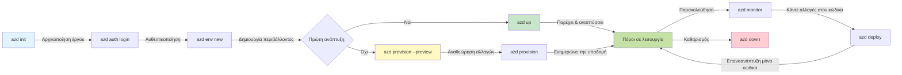
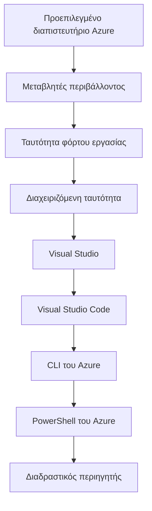

# AZD Basics - Κατανόηση του Azure Developer CLI

# AZD Basics - Βασικές Έννοιες και Θεμελιώδεις Αρχές

**Chapter Navigation:**
- **📚 Αρχική Μαθήματος**: [AZD Για Αρχάριους](../../README.md)
- **📖 Τρέχον Κεφάλαιο**: Κεφάλαιο 1 - Βάση & Γρήγορη Εκκίνηση
- **⬅️ Προηγούμενο**: [Επισκόπηση Μαθήματος](../../README.md#-chapter-1-foundation--quick-start)
- **➡️ Επόμενο**: [Εγκατάσταση & Ρύθμιση](installation.md)
- **🚀 Επόμενο Κεφάλαιο**: [Κεφάλαιο 2: Ανάπτυξη με Προτεραιότητα στην Τεχνητή Νοημοσύνη](../chapter-02-ai-development/microsoft-foundry-integration.md)

## Εισαγωγή

Αυτό το μάθημα σας εισάγει στο Azure Developer CLI (azd), ένα ισχυρό εργαλείο γραμμής εντολών που επιταχύνει το ταξίδι σας από την τοπική ανάπτυξη στην ανάπτυξη στο Azure. Θα μάθετε τις βασικές έννοιες, τα κύρια χαρακτηριστικά και θα κατανοήσετε πώς το azd απλοποιεί την ανάπτυξη cloud-native εφαρμογών.

## Στόχοι Μάθησης

Στο τέλος αυτού του μαθήματος, θα:
- Κατανοείτε τι είναι το Azure Developer CLI και ποιος είναι ο κύριος σκοπός του
- Μαθαίνετε τις βασικές έννοιες των προτύπων, των περιβαλλόντων και των υπηρεσιών
- Εξερευνήσετε βασικά χαρακτηριστικά όπως η ανάπτυξη βάσει προτύπων και η Υποδομή ως Κώδικας
- Κατανοείτε τη δομή του έργου azd και τη ροή εργασίας
- Είστε έτοιμοι να εγκαταστήσετε και να διαμορφώσετε το azd για το περιβάλλον ανάπτυξής σας

## Μαθησιακά Αποτελέσματα

Μετά την ολοκλήρωση αυτού του μαθήματος, θα μπορείτε να:
- Επεξηγήσετε τον ρόλο του azd στις σύγχρονες ροές εργασίας ανάπτυξης cloud
- Αναγνωρίσετε τα συστατικά της δομής ενός έργου azd
- Περιγράψετε πώς τα πρότυπα, τα περιβάλλοντα και οι υπηρεσίες συνεργάζονται
- Κατανοήσετε τα οφέλη της Υποδομής ως Κώδικα με το azd
- Αναγνωρίζετε διαφορετικές εντολές azd και τους σκοπούς τους

## Τι είναι το Azure Developer CLI (azd);

Το Azure Developer CLI (azd) είναι ένα εργαλείο γραμμής εντολών σχεδιασμένο να επιταχύνει το ταξίδι σας από την τοπική ανάπτυξη στην ανάπτυξη στο Azure. Απλοποιεί τη διαδικασία δημιουργίας, ανάπτυξης και διαχείρισης cloud-native εφαρμογών στο Azure.

### Τι Μπορείτε να Αναπτύξετε με το azd;

Το azd υποστηρίζει μια ευρεία γκάμα φορτίων εργασίας—και η λίστα συνεχίζει να μεγαλώνει. Σήμερα, μπορείτε να χρησιμοποιήσετε το azd για να αναπτύξετε:

| Τύπος Εργασίας | Παραδείγματα | Ίδια Διαδικασία; |
|---------------|----------|----------------|
| **Παραδοσιακές εφαρμογές** | Ιστοσελίδες web, REST APIs, στατικές τοποθεσίες | ✅ `azd up` |
| **Υπηρεσίες και μικροϋπηρεσίες** | Container Apps, Function Apps, πολυ-υπηρεσιακά backends | ✅ `azd up` |
| **Εφαρμογές με AI** | Εφαρμογές συνομιλίας με Microsoft Foundry Models, λύσεις RAG με AI Search | ✅ `azd up` |
| **Έξυπνοι πράκτορες** | Πράκτορες φιλοξενούμενοι στο Foundry, ορχηστρώσεις με πολλαπλούς πράκτορες | ✅ `azd up` |

Το βασικό συμπέρασμα είναι ότι **ο κύκλος ζωής του azd παραμένει ο ίδιος ανεξάρτητα από το τι αναπτύσσετε**. Αρχικοποιείτε ένα έργο, προμηθεύετε υποδομή, αναπτύσσετε τον κώδικά σας, παρακολουθείτε την εφαρμογή και καθαρίζετε—είτε πρόκειται για έναν απλό ιστότοπο είτε για έναν εξελιγμένο πράκτορα AI.

Αυτή η συνέχεια είναι σχεδιασμένη. Το azd αντιμετωπίζει τις δυνατότητες AI ως ένα ακόμη είδος υπηρεσίας που μπορεί να χρησιμοποιήσει η εφαρμογή σας, όχι ως κάτι θεμελιωδώς διαφορετικό. Ένα σημείο πρόσβασης συνομιλίας υποστηριζόμενο από Microsoft Foundry Models είναι, από την οπτική του azd, απλώς μια άλλη υπηρεσία για διαμόρφωση και ανάπτυξη.

### 🎯 Γιατί να Χρησιμοποιήσετε το AZD; Μια Σύγκριση από την Πραγματική Ζωή

Ας συγκρίνουμε την ανάπτυξη μιας απλής web εφαρμογής με βάση δεδομένων:

#### ❌ ΧΩΡΙΣ AZD: Χειροκίνητη Ανάπτυξη στο Azure (30+ λεπτά)

```bash
# Βήμα 1: Δημιουργήστε ομάδα πόρων
az group create --name myapp-rg --location eastus

# Βήμα 2: Δημιουργήστε Σχέδιο App Service
az appservice plan create --name myapp-plan \
  --resource-group myapp-rg \
  --sku B1 --is-linux

# Βήμα 3: Δημιουργήστε Εφαρμογή Web
az webapp create --name myapp-web-unique123 \
  --resource-group myapp-rg \
  --plan myapp-plan \
  --runtime "NODE:18-lts"

# Βήμα 4: Δημιουργήστε λογαριασμό Cosmos DB (10-15 λεπτά)
az cosmosdb create --name myapp-cosmos-unique123 \
  --resource-group myapp-rg \
  --kind MongoDB

# Βήμα 5: Δημιουργήστε βάση δεδομένων
az cosmosdb mongodb database create \
  --account-name myapp-cosmos-unique123 \
  --resource-group myapp-rg \
  --name tododb

# Βήμα 6: Δημιουργήστε συλλογή
az cosmosdb mongodb collection create \
  --account-name myapp-cosmos-unique123 \
  --resource-group myapp-rg \
  --database-name tododb \
  --name todos

# Βήμα 7: Πάρτε τη συμβολοσειρά σύνδεσης
CONN_STR=$(az cosmosdb keys list \
  --name myapp-cosmos-unique123 \
  --resource-group myapp-rg \
  --type connection-strings \
  --query "connectionStrings[0].connectionString" -o tsv)

# Βήμα 8: Διαμορφώστε τις ρυθμίσεις της εφαρμογής
az webapp config appsettings set \
  --name myapp-web-unique123 \
  --resource-group myapp-rg \
  --settings MONGODB_URI="$CONN_STR"

# Βήμα 9: Ενεργοποιήστε την καταγραφή
az webapp log config --name myapp-web-unique123 \
  --resource-group myapp-rg \
  --application-logging filesystem \
  --detailed-error-messages true

# Βήμα 10: Ρυθμίστε το Application Insights
az monitor app-insights component create \
  --app myapp-insights \
  --location eastus \
  --resource-group myapp-rg

# Βήμα 11: Συνδέστε το App Insights με την Εφαρμογή Web
INSTRUMENTATION_KEY=$(az monitor app-insights component show \
  --app myapp-insights \
  --resource-group myapp-rg \
  --query "instrumentationKey" -o tsv)

az webapp config appsettings set \
  --name myapp-web-unique123 \
  --resource-group myapp-rg \
  --settings APPINSIGHTS_INSTRUMENTATIONKEY="$INSTRUMENTATION_KEY"

# Βήμα 12: Δημιουργήστε την εφαρμογή τοπικά
npm install
npm run build

# Βήμα 13: Δημιουργήστε πακέτο ανάπτυξης
zip -r app.zip . -x "*.git*" "node_modules/*"

# Βήμα 14: Αναπτύξτε την εφαρμογή
az webapp deployment source config-zip \
  --resource-group myapp-rg \
  --name myapp-web-unique123 \
  --src app.zip

# Βήμα 15: Περιμένετε και προσευχηθείτε να λειτουργήσει 🙏
# (Δεν υπάρχει αυτόματη επικύρωση, απαιτείται χειροκίνητος έλεγχος)
```

**Προβλήματα:**
- ❌ 15+ εντολές που πρέπει να θυμηθείτε και να εκτελέσετε με τη σειρά
- ❌ 30-45 λεπτά χειροκίνητης εργασίας
- ❌ Εύκολα γίνονται λάθη (τυπογραφικά, λανθασμένοι παράμετροι)
- ❌ Στοιχεία σύνδεσης εκτίθενται στο ιστορικό του τερματικού
- ❌ Δεν υπάρχει αυτοματοποιημένη επαναφορά σε περίπτωση αποτυχίας
- ❌ Δύσκολο να αναπαραχθεί για μέλη της ομάδας
- ❌ Διαφέρει κάθε φορά (μη αναπαραγόμενο)

#### ✅ ΜΕ AZD: Αυτοματοποιημένη Ανάπτυξη (5 εντολές, 10-15 λεπτά)

```bash
# Βήμα 1: Αρχικοποίηση από πρότυπο
azd init --template todo-nodejs-mongo

# Βήμα 2: Επαλήθευση ταυτότητας
azd auth login

# Βήμα 3: Δημιουργία περιβάλλοντος
azd env new dev

# Βήμα 4: Προεπισκόπηση αλλαγών (προαιρετικό αλλά συνιστάται)
azd provision --preview

# Βήμα 5: Ανάπτυξη όλων
azd up

# ✨ Έτοιμο! Όλα έχουν αναπτυχθεί, ρυθμιστεί και παρακολουθούνται
```

**Οφέλη:**
- ✅ **5 εντολές** έναντι 15+ χειροκίνητων βημάτων
- ✅ **10-15 λεπτά** συνολικός χρόνος (κυρίως αναμονή για το Azure)
- ✅ **Λιγότερα χειροκίνητα λάθη** - συνεπής, ροή εργασίας βάσει προτύπων
- ✅ **Ασφαλής διαχείριση μυστικών** - πολλά πρότυπα χρησιμοποιούν αποθήκευση μυστικών που διαχειρίζεται το Azure
- ✅ **Επαναλήψιμες αναπτύξεις** - ίδια διαδικασία κάθε φορά
- ✅ **Πλήρως αναπαραγώγιμες** - ίδιο αποτέλεσμα κάθε φορά
- ✅ **Έτοιμο για ομάδα** - ο οποιοσδήποτε μπορεί να αναπτύξει με τις ίδιες εντολές
- ✅ **Υποδομή ως Κώδικας** - πρότυπα Bicep με έλεγχο έκδοσης
- ✅ **Ενσωματωμένη παρακολούθηση** - το Application Insights διαμορφώνεται αυτόματα

### 📊 Μείωση Χρόνου & Σφαλμάτων

| Μετρικό | Χειροκίνητη Ανάπτυξη | Ανάπτυξη με AZD | Βελτίωση |
|:-------|:------------------|:---------------|:------------|
| **Εντολές** | 15+ | 5 | 67% λιγότερο |
| **Χρόνος** | 30-45 min | 10-15 min | 60% πιο γρήγορα |
| **Ποσοστό Σφαλμάτων** | ~40% | <5% | 88% μείωση |
| **Συνέπεια** | Χαμηλή (χειροκίνητη) | 100% (αυτοματοποιημένη) | Τέλεια |
| **Εισαγωγή Ομάδας** | 2-4 ώρες | 30 λεπτά | 75% πιο γρήγορα |
| **Χρόνος Επαναφοράς** | 30+ min (χειροκίνητη) | 2 min (αυτοματοποιημένη) | 93% πιο γρήγορα |

## Θεμελιώδεις Έννοιες

### Πρότυπα
Τα πρότυπα είναι η βάση του azd. Περιλαμβάνουν:
- **Κώδικας εφαρμογής** - Ο πηγαίος κώδικας και οι εξαρτήσεις
- **Ορισμοί υποδομής** - Πόροι Azure ορισμένοι σε Bicep ή Terraform
- **Αρχεία ρυθμίσεων** - Ρυθμίσεις και μεταβλητές περιβάλλοντος
- **Σενάρια ανάπτυξης** - Αυτοματοποιημένες ροές ανάπτυξης

### Περιβάλλοντα
Τα περιβάλλοντα αντιπροσωπεύουν διαφορετικούς στόχους ανάπτυξης:
- **Ανάπτυξη** - Για δοκιμές και ανάπτυξη
- **Staging** - Προπαραγωγικό περιβάλλον
- **Παραγωγή** - Ζωντανό παραγωγικό περιβάλλον

Κάθε περιβάλλον διατηρεί το δικό του:
- Azure resource group
- Configuration settings
- Deployment state

### Υπηρεσίες
Οι υπηρεσίες είναι τα δομικά στοιχεία της εφαρμογής σας:
- **Frontend** - Εφαρμογές web, SPA
- **Backend** - APIs, μικροϋπηρεσίες
- **Βάση Δεδομένων** - Λύσεις αποθήκευσης δεδομένων
- **Αποθήκευση** - Αποθήκευση αρχείων και blobs

## Κύρια Χαρακτηριστικά

### 1. Ανάπτυξη Βασισμένη σε Πρότυπα
```bash
# Περιηγηθείτε στα διαθέσιμα πρότυπα
azd template list

# Αρχικοποίηση από ένα πρότυπο
azd init --template <template-name>
```

### 2. Υποδομή ως Κώδικας
- **Bicep** - Η γλώσσα ειδικού τομέα του Azure
- **Terraform** - Εργαλείο υποδομής για πολλαπλά cloud
- **ARM Templates** - Πρότυπα Azure Resource Manager

### 3. Ενσωματωμένες Ροές Εργασίας
```bash
# Ολοκληρωμένη ροή εργασίας ανάπτυξης
azd up            # Παροχή πόρων + Ανάπτυξη — χωρίς χειροκίνητη παρέμβαση για την αρχική ρύθμιση

# 🧪 ΝΕΟ: Προεπισκόπηση των αλλαγών στην υποδομή πριν την ανάπτυξη (ΑΣΦΑΛΕΣ)
azd provision --preview    # Προσομοιώστε την ανάπτυξη της υποδομής χωρίς να γίνουν αλλαγές

azd provision     # Χρησιμοποιήστε το για να δημιουργήσετε πόρους Azure όταν ενημερώνετε την υποδομή
azd deploy        # Αναπτύξτε τον κώδικα της εφαρμογής ή αναπτύξτε τον ξανά μετά από ενημέρωση
azd down          # Καθαρισμός πόρων
```

#### 🛡️ Ασφαλής Σχεδιασμός Υποδομής με Προεπισκόπηση
Η εντολή `azd provision --preview` είναι καθοριστική για ασφαλείς αναπτύξεις:
- **Ανάλυση χωρίς εκτέλεση** - Δείχνει τι θα δημιουργηθεί, τροποποιηθεί ή διαγραφεί
- **Μηδενικός κίνδυνος** - Δεν γίνονται πραγματικές αλλαγές στο περιβάλλον Azure σας
- **Συνεργασία ομάδας** - Μοιραστείτε τα αποτελέσματα προεπισκόπησης πριν την ανάπτυξη
- **Εκτίμηση κόστους** - Κατανοήστε τα κόστη πόρων πριν δεσμευτείτε

```bash
# Παράδειγμα ροής εργασίας προεπισκόπησης
azd provision --preview           # Δείτε τι θα αλλάξει
# Ελέγξτε το αποτέλεσμα, συζητήστε με την ομάδα
azd provision                     # Εφαρμόστε τις αλλαγές με αυτοπεποίθηση
```

### 📊 Οπτικά: Ροή Ανάπτυξης AZD



**Εξήγηση Ροής Εργασίας:**
1. **Init** - Ξεκινήστε με πρότυπο ή νέο έργο
2. **Auth** - Πιστοποιηθείτε στο Azure
3. **Environment** - Δημιουργήστε απομονωμένο περιβάλλον ανάπτυξης
4. **Preview** - 🆕 Πάντα προεπισκόπηση των αλλαγών υποδομής πρώτα (ασφαλής πρακτική)
5. **Provision** - Δημιουργήστε/ενημερώστε πόρους Azure
6. **Deploy** - Αναπτύξτε τον κώδικα της εφαρμογής σας
7. **Monitor** - Παρατηρήστε την απόδοση της εφαρμογής
8. **Iterate** - Κάντε αλλαγές και αναπτύξτε ξανά τον κώδικα
9. **Cleanup** - Αφαιρέστε πόρους όταν τελειώσετε

### 4. Διαχείριση Περιβάλλοντος
```bash
# Δημιουργήστε και διαχειριστείτε περιβάλλοντα
azd env new <environment-name>
azd env select <environment-name>
azd env list
```

### 5. Επεκτάσεις και Εντολές AI

Το azd χρησιμοποιεί σύστημα επεκτάσεων για να προσθέτει δυνατότητες πέρα από τον βασικό CLI. Αυτό είναι ιδιαίτερα χρήσιμο για φορτία εργασίας AI:

```bash
# Εμφάνιση διαθέσιμων επεκτάσεων
azd extension list

# Εγκατάσταση της επέκτασης Foundry agents
azd extension install azure.ai.agents

# Αρχικοποίηση έργου πράκτορα AI από αρχείο manifest
azd ai agent init -m agent-manifest.yaml

# Δοκιμή αναπτυγμένου πράκτορα (εμφανίζει καθυστέρηση και χρόνο έως το πρώτο byte)
azd ai agent invoke

# Εκκίνηση του διακομιστή MCP για ανάπτυξη με υποβοήθηση AI (Άλφα)
azd mcp start
```

**Ο κύκλος ζωής του πράκτορα, από άκρο σε άκρο.** Μόλις εγκαταστήσετε `azure.ai.agents`, μια ενιαία ροή εργασίας σας οδηγεί από την ιδέα σε έναν λειτουργικό, παρακολουθούμενο πράκτορα. Δεν χρειάζεστε όλα αυτά την πρώτη μέρα—απλώς να ξέρετε ότι υπάρχουν:

| Στάδιο | Εντολή | Τι κάνει |
|-------|---------|--------------|
| **Δημιουργία σκελετού** | `azd ai agent init -m <manifest>` | Δημιουργεί ένα έργο πράκτορα από ένα manifest |
| **Δοκιμή** | `azd ai agent invoke` | Κλήση του πράκτορα και προβολή χρόνου απόκρισης |
| **Μέτρηση** | `azd ai agent eval generate` | Δημιουργεί ένα σύνολο δεδομένων αξιολόγησης για τον πράκτορα |
| **Βελτίωση** | `azd ai agent optimize` | Βελτιστοποίηση οδηγιών πράκτορα βάσει των δεδομένων σας |
| **Επιθεώρηση** | `azd ai agent endpoint show` | Προβολή της διαμόρφωσης του ζωντανού endpoint |
| **Καθαρισμός** | `azd ai agent delete` | Διαγραφή ενός φιλοξενούμενου πράκτορα και όλων των εκδόσεών του |

> Οι επεκτάσεις καλύπτονται αναλυτικά στο [Κεφάλαιο 2: Ανάπτυξη με Προτεραιότητα στην Τεχνητή Νοημοσύνη](../chapter-02-ai-development/agents.md) και στην αναφορά [Εντολές AZD AI CLI](../chapter-08-production/production-ai-practices.md#azd-ai-cli-commands-and-extensions).

## 📁 Δομή Έργου

Μια τυπική δομή έργου azd:
```
my-app/
├── .azd/                    # azd configuration
│   └── config.json
├── .azure/                  # Azure deployment artifacts
├── .devcontainer/          # Development container config
├── .github/workflows/      # GitHub Actions
├── .vscode/               # VS Code settings
├── infra/                 # Infrastructure code
│   ├── main.bicep        # Main infrastructure template
│   ├── main.parameters.json
│   └── modules/          # Reusable modules
├── src/                  # Application source code
│   ├── api/             # Backend services
│   └── web/             # Frontend application
├── azure.yaml           # azd project configuration
└── README.md
```

## 🔧 Αρχεία Ρύθμισης

### azure.yaml
Το κύριο αρχείο διαμόρφωσης του έργου:
```yaml
name: my-awesome-app
metadata:
  template: my-template@1.0.0

services:
  web:
    project: ./src/web
    language: js
    host: appservice
  api:
    project: ./src/api
    language: js
    host: appservice

hooks:
  preprovision:
    shell: pwsh
    run: echo "Preparing to provision..."
```

### .azure/config.json
Διαμόρφωση ειδική για το περιβάλλον:
```json
{
  "version": 1,
  "defaultEnvironment": "dev",
  "environments": {
    "dev": {
      "subscriptionId": "your-subscription-id",
      "location": "eastus"
    }
  }
}
```

## 🎪 Συνηθισμένες Ροές Εργασίας με Πρακτικές Ασκήσεις

> **💡 Συμβουλή Μάθησης:** Ακολουθήστε αυτές τις ασκήσεις με τη σειρά για να αναπτύξετε σταδιακά τις δεξιότητές σας στο AZD.

### 🎯 Άσκηση 1: Αρχικοποιήστε το Πρώτο σας Έργο

**Στόχος:** Δημιουργήστε ένα έργο AZD και εξερευνήστε τη δομή του

**Βήματα:**
```bash
# Χρησιμοποιήστε ένα αποδεδειγμένο πρότυπο
azd init --template todo-nodejs-mongo

# Εξερευνήστε τα παραγόμενα αρχεία
ls -la  # Δείτε όλα τα αρχεία, συμπεριλαμβανομένων και των κρυφών

# Βασικά αρχεία που δημιουργήθηκαν:
# - azure.yaml (κύρια διαμόρφωση)
# - infra/ (κώδικας υποδομής)
# - src/ (κώδικας εφαρμογής)
```

**✅ Επιτυχία:** Έχετε το αρχείο azure.yaml και τους φακέλους infra/ και src/

---

### 🎯 Άσκηση 2: Ανάπτυξη στο Azure

**Στόχος:** Ολοκληρώστε την ανάπτυξη από άκρη σε άκρη

**Βήματα:**
```bash
# 1. Πιστοποίηση
az login && azd auth login

# 2. Δημιουργία περιβάλλοντος
azd env new dev
azd env set AZURE_LOCATION eastus

# 3. Προεπισκόπηση αλλαγών (ΣΥΝΙΣΤΑΤΑΙ)
azd provision --preview

# 4. Ανάπτυξη όλων
azd up

# 5. Επαλήθευση ανάπτυξης
azd show    # Δείτε το URL της εφαρμογής σας
```

**Εκτιμώμενος Χρόνος:** 10-15 λεπτά  
**✅ Επιτυχία:** Το URL της εφαρμογής ανοίγει στο πρόγραμμα περιήγησης

---

### 🎯 Άσκηση 3: Πολλαπλά Περιβάλλοντα

**Στόχος:** Αναπτύξτε σε dev και staging

**Βήματα:**
```bash
# Υπάρχει ήδη dev, δημιούργησε staging
azd env new staging
azd env set AZURE_LOCATION westus2
azd up

# Εναλλαγή μεταξύ τους
azd env list
azd env select dev
```

**✅ Επιτυχία:** Δύο ξεχωριστές ομάδες πόρων στο Azure Portal

---

### 🛡️ Καθαρό Ξεκίνημα: `azd down --force --purge`

Όταν χρειάζεται να επαναφέρετε πλήρως:

```bash
azd down --force --purge
```

**Τι κάνει:**
- `--force`: Χωρίς ερωτήματα επιβεβαίωσης
- `--purge`: Διαγράφει όλη την τοπική κατάσταση και τους πόρους Azure

**Χρήση όταν:**
- Η ανάπτυξη απέτυχε στη μέση
- Αλλαγή έργων
- Χρειάζεστε νέο ξεκίνημα

---

## 🎪 Αναφορά Πρωτότυπης Ροής Εργασίας

### Ξεκινώντας ένα Νέο Έργο
```bash
# Μέθοδος 1: Χρησιμοποιήστε υπάρχον πρότυπο
azd init --template todo-nodejs-mongo

# Μέθοδος 2: Ξεκινήστε από την αρχή
azd init

# Μέθοδος 3: Χρησιμοποιήστε τον τρέχοντα φάκελο
azd init .
```

### Κύκλος Ανάπτυξης
```bash
# Ρυθμίστε το περιβάλλον ανάπτυξης
azd auth login
azd env new dev
azd env select dev

# Αναπτύξτε τα πάντα
azd up

# Κάντε αλλαγές και αναπτύξτε ξανά
azd deploy

# Καθαρίστε όταν τελειώσετε
azd down --force --purge # Η εντολή στο Azure Developer CLI είναι μια **σκληρή επαναφορά** για το περιβάλλον σας—ιδιαίτερα χρήσιμη όταν αντιμετωπίζετε προβλήματα με αποτυχημένες αναπτύξεις, καθαρίζετε ορφάνους πόρους ή προετοιμάζεστε για μια νέα ανάπτυξη
```

## Κατανόηση της `azd down --force --purge`
Η εντολή `azd down --force --purge` είναι ένας ισχυρός τρόπος για να διαλύσετε πλήρως το περιβάλλον azd και όλους τους σχετιζόμενους πόρους. Ακολουθεί ανάλυση του τι κάνει κάθε σημαία:
```
--force
```
- Παραλείπει ερωτήματα επιβεβαίωσης.
- Χρήσιμο για αυτοματοποίηση ή scripting όπου η χειροκίνητη εισαγωγή δεν είναι εφικτή.
- Εξασφαλίζει ότι η αποσυναρμολόγηση προχωρά χωρίς διακοπές, ακόμα και αν το CLI εντοπίσει ασυνεπείς καταστάσεις.

```
--purge
```
Διαγράφει **όλα τα σχετιζόμενα μεταδεδομένα**, συμπεριλαμβανομένων:
Κατάσταση περιβάλλοντος
Τοπικός `.azure` φάκελος
Αποθηκευμένες προσωρινά πληροφορίες ανάπτυξης
Αποτρέπει το azd από το να "θυμάται" προηγούμενες αναπτύξεις, κάτι που μπορεί να προκαλέσει προβλήματα όπως ασυμφωνία ομάδων πόρων ή παρωχημένες αναφορές καταχωρητή.


### Γιατί να χρησιμοποιήσετε και τα δύο;
Όταν κολλάτε με το `azd up` λόγω υπολειμματικής κατάστασης ή μερικών αναπτύξεων, αυτός ο συνδυασμός εξασφαλίζει ένα **καθαρό ξεκίνημα**.

Είναι ιδιαίτερα χρήσιμο μετά από χειροκίνητες διαγραφές πόρων στο Azure portal ή όταν αλλάζετε πρότυπα, περιβάλλοντα ή συμβάσεις ονομασίας ομάδων πόρων.


### Διαχείριση Πολλαπλών Περιβαλλόντων
```bash
# Δημιουργήστε περιβάλλον προετοιμασίας
azd env new staging
azd env select staging
azd up

# Επιστρέψτε στο dev
azd env select dev

# Συγκρίνετε τα περιβάλλοντα
azd env list
```

## 🔐 Αυθεντικοποίηση και Διαπιστευτήρια

Η κατανόηση της αυθεντικοποίησης είναι κρίσιμη για επιτυχημένες αναπτύξεις με azd. Το Azure χρησιμοποιεί πολλαπλές μεθόδους αυθεντικοποίησης και το azd αξιοποιεί την ίδια αλυσίδα διαπιστευτηρίων που χρησιμοποιούν και άλλα εργαλεία Azure.

### Αυθεντικοποίηση Azure CLI (`az login`)

Πριν χρησιμοποιήσετε το azd, πρέπει να αυθεντικοποιηθείτε στο Azure. Η πιο κοινή μέθοδος είναι η χρήση του Azure CLI:

```bash
# Διαδραστική σύνδεση (ανοίγει πρόγραμμα περιήγησης)
az login

# Σύνδεση με συγκεκριμένο μισθωτή
az login --tenant <tenant-id>

# Σύνδεση με κύριο υπηρεσίας
az login --service-principal -u <app-id> -p <password> --tenant <tenant-id>

# Έλεγχος τρέχουσας κατάστασης σύνδεσης
az account show

# Προβολή διαθέσιμων συνδρομών
az account list --output table

# Ορισμός προεπιλεγμένης συνδρομής
az account set --subscription <subscription-id>
```

### Ροή Αυθεντικοποίησης
1. **Διαδραστική Σύνδεση**: Ανοίγει τον προεπιλεγμένο σας πρόγραμμα περιήγησης για αυθεντικοποίηση
2. **Device Code Flow**: Για περιβάλλοντα χωρίς πρόσβαση σε πρόγραμμα περιήγησης
3. **Service Principal**: Για σενάρια αυτοματοποίησης και CI/CD
4. **Managed Identity**: Για εφαρμογές φιλοξενούμενες στο Azure

### Αλυσίδα DefaultAzureCredential

`DefaultAzureCredential` είναι ένα είδος διαπιστευτηρίου που προσφέρει μια απλοποιημένη εμπειρία αυθεντικοποίησης δοκιμάζοντας αυτόματα πολλαπλές πηγές διαπιστευτηρίων με συγκεκριμένη σειρά:

#### Σειρά Αλυσίδας Διαπιστευτηρίων


#### 1. Μεταβλητές Περιβάλλοντος
```bash
# Ορίστε τις μεταβλητές περιβάλλοντος για το service principal
export AZURE_CLIENT_ID="<app-id>"
export AZURE_CLIENT_SECRET="<password>"
export AZURE_TENANT_ID="<tenant-id>"
```

#### 2. Workload Identity (Kubernetes/GitHub Actions)
Χρησιμοποιείται αυτόματα σε:
- Azure Kubernetes Service (AKS) με Workload Identity
- GitHub Actions με OIDC federation
- Άλλα σενάρια ομοσπονδιακής ταυτότητας

#### 3. Managed Identity
Για πόρους Azure όπως:
- Virtual Machines
- App Service
- Azure Functions
- Container Instances

```bash
# Ελέγχει αν εκτελείται σε πόρο του Azure με διαχειριζόμενη ταυτότητα
az account show --query "user.type" --output tsv
# Επιστρέφει: "servicePrincipal" εάν χρησιμοποιείται διαχειριζόμενη ταυτότητα
```

#### 4. Ενσωμάτωση με Εργαλεία Ανάπτυξης
- **Visual Studio**: Χρησιμοποιεί αυτόματα τον συνδεδεμένο λογαριασμό
- **VS Code**: Χρησιμοποιεί τα διαπιστευτήρια της επέκτασης Azure Account
- **Azure CLI**: Χρησιμοποιεί διαπιστευτήρια `az login` (πιο συνηθισμένο για τοπική ανάπτυξη)

### Ρύθμιση Αυθεντικοποίησης AZD

```bash
# Μέθοδος 1: Χρησιμοποιήστε την Azure CLI (Συνιστάται για ανάπτυξη)
az login
azd auth login  # Χρησιμοποιεί τα υπάρχοντα διαπιστευτήρια της Azure CLI

# Μέθοδος 2: Άμεση αυθεντικοποίηση azd
azd auth login --use-device-code  # Για περιβάλλοντα χωρίς διεπαφή χρήστη

# Μέθοδος 3: Έλεγχος κατάστασης αυθεντικοποίησης
azd auth login --check-status

# Μέθοδος 4: Αποσύνδεση και επαναπιστοποίηση
azd auth logout
azd auth login
```

### Καλύτερες Πρακτικές Αυθεντικοποίησης

#### Για τοπική ανάπτυξη
```bash
# 1. Συνδεθείτε με το Azure CLI
az login

# 2. Επαληθεύστε τη σωστή συνδρομή
az account show
az account set --subscription "Your Subscription Name"

# 3. Χρησιμοποιήστε το azd με τα υπάρχοντα διαπιστευτήρια
azd auth login
```

#### Για αγωγούς CI/CD
```yaml
# GitHub Actions example
- name: Azure Login
  uses: azure/login@v1
  with:
    creds: ${{ secrets.AZURE_CREDENTIALS }}

- name: Deploy with azd
  run: |
    azd auth login --client-id ${{ secrets.AZURE_CLIENT_ID }} \
                    --client-secret ${{ secrets.AZURE_CLIENT_SECRET }} \
                    --tenant-id ${{ secrets.AZURE_TENANT_ID }}
    azd up --no-prompt
```

#### Για Περιβάλλοντα Παραγωγής
- Χρησιμοποιήστε **Managed Identity** όταν εκτελείτε σε πόρους του Azure
- Χρησιμοποιήστε **Service Principal** για σενάρια αυτοματοποίησης
- Αποφύγετε την αποθήκευση διαπιστευτηρίων σε κώδικα ή αρχεία ρυθμίσεων
- Χρησιμοποιήστε το **Azure Key Vault** για ευαίσθητες ρυθμίσεις

### Συνηθισμένα προβλήματα πιστοποίησης και λύσεις

#### Πρόβλημα: "Δεν βρέθηκε συνδρομή"
```bash
# Λύση: Ορίστε την προεπιλεγμένη συνδρομή
az account list --output table
az account set --subscription "<subscription-id>"
azd env set AZURE_SUBSCRIPTION_ID "<subscription-id>"
```

#### Πρόβλημα: "Ανεπαρκή δικαιώματα"
```bash
# Λύση: Ελέγξτε και εκχωρήστε τους απαιτούμενους ρόλους
az role assignment list --assignee $(az account show --query user.name --output tsv)

# Συνήθεις απαιτούμενοι ρόλοι:
# - Συνεισφέρων (για τη διαχείριση πόρων)
# - Διαχειριστής πρόσβασης χρηστών (για την ανάθεση ρόλων)
```

#### Πρόβλημα: "Το token έχει λήξει"
```bash
# Λύση: Επαναεπιβεβαίωση ταυτότητας
az logout
az login
azd auth logout
azd auth login
```

### Πιστοποίηση σε διαφορετικά σενάρια

#### Τοπική ανάπτυξη
```bash
# Λογαριασμός προσωπικής ανάπτυξης
az login
azd auth login
```

#### Ανάπτυξη ομάδας
```bash
# Χρησιμοποιήστε συγκεκριμένο tenant για τον οργανισμό
az login --tenant contoso.onmicrosoft.com
azd auth login
```

#### Σενάρια πολλαπλών ενοικιαστών
```bash
# Εναλλαγή μεταξύ ενοικιαστών
az login --tenant tenant1.onmicrosoft.com
# Ανάπτυξη στον ενοικιαστή 1
azd up

az login --tenant tenant2.onmicrosoft.com  
# Ανάπτυξη στον ενοικιαστή 2
azd up
```

### Παρατηρήσεις ασφαλείας

1. **Αποθήκευση διαπιστευτηρίων**: Μην αποθηκεύετε ποτέ διαπιστευτήρια στον πηγαίο κώδικα
2. **Περιορισμός του εύρους**: Χρησιμοποιήστε την αρχή των ελάχιστων προνομίων για τους service principals
3. **Ανανέωση token**: Περιστρέφετε τακτικά τα μυστικά των service principals
4. **Ιχνη καταγραφής**: Παρακολουθείτε δραστηριότητες πιστοποίησης και ανάπτυξης
5. **Ασφάλεια δικτύου**: Χρησιμοποιήστε ιδιωτικά endpoints όταν είναι δυνατόν

### Αντιμετώπιση προβλημάτων πιστοποίησης

```bash
# Αντιμετώπιση προβλημάτων πιστοποίησης
azd auth login --check-status
az account show
az account get-access-token

# Συνήθεις εντολές διάγνωσης
whoami                          # Τρέχον πλαίσιο χρήστη
az ad signed-in-user show      # Στοιχεία χρήστη του Microsoft Entra ID
az group list                  # Δοκιμή πρόσβασης σε πόρο
```

## Κατανόηση του `azd down --force --purge`

### Ανακάλυψη
```bash
azd template list              # Περιήγηση προτύπων
azd template show <template>   # Λεπτομέρειες προτύπου
azd init --help               # Επιλογές αρχικοποίησης
```

### Διαχείριση έργου
```bash
azd show                     # Επισκόπηση έργου
azd env list                # Διαθέσιμα περιβάλλοντα και η επιλεγμένη προεπιλογή
azd config show            # Ρυθμίσεις διαμόρφωσης
```

### Παρακολούθηση
```bash
azd monitor                  # Άνοιγμα παρακολούθησης στο Azure Portal
azd monitor --logs           # Προβολή αρχείων καταγραφής εφαρμογής
azd monitor --live           # Προβολή μετρήσεων σε πραγματικό χρόνο
azd pipeline config          # Ρύθμιση CI/CD
```

## Καλές πρακτικές

### 1. Χρησιμοποιήστε κατανοητά ονόματα
```bash
# Καλό
azd env new production-east
azd init --template web-app-secure

# Αποφύγετε
azd env new env1
azd init --template template1
```

### 2. Εκμεταλλευτείτε τα πρότυπα
- Ξεκινήστε με υπάρχοντα πρότυπα
- Προσαρμόστε στις ανάγκες σας
- Δημιουργήστε επαναχρησιμοποιήσιμα πρότυπα για τον οργανισμό σας

### 3. Απομόνωση περιβάλλοντος
- Χρησιμοποιήστε ξεχωριστά περιβάλλοντα για dev/staging/prod
- Μην αναπτύσσετε ποτέ απευθείας σε παραγωγή από το τοπικό μηχάνημα
- Χρησιμοποιήστε αγωγούς CI/CD για αναπτύξεις σε παραγωγή

### 4. Διαχείριση ρυθμίσεων
- Χρησιμοποιήστε μεταβλητές περιβάλλοντος για ευαίσθητα δεδομένα
- Διατηρήστε τις ρυθμίσεις στον έλεγχο εκδόσεων
- Τεκμηριώστε τις ρυθμίσεις ειδικές για το περιβάλλον

## Πρόοδος εκμάθησης

### Αρχάριος (Εβδομάδα 1-2)
1. Εγκαταστήστε το azd και αυθεντικοποιηθείτε
2. Αναπτύξτε ένα απλό πρότυπο
3. Κατανοήστε τη δομή του έργου
4. Μάθετε βασικές εντολές (up, down, deploy)

### Ενδιάμεσο (Εβδομάδα 3-4)
1. Προσαρμόστε πρότυπα
2. Διαχειριστείτε πολλαπλά περιβάλλοντα
3. Κατανοήστε τον κώδικα υποδομής
4. Διαμορφώστε αγωγούς CI/CD

### Προχωρημένο (Εβδομάδα 5+)
1. Δημιουργήστε προσαρμοσμένα πρότυπα
2. Προηγμένα μοτίβα υποδομής
3. Αναπτύξεις πολλαπλών περιοχών
4. Ρυθμίσεις επιπέδου επιχείρησης

## Επόμενα βήματα

**📖 Συνεχίστε τη μάθηση του Κεφαλαίου 1:**
- [Εγκατάσταση & Ρύθμιση](installation.md) - Εγκαταστήστε και ρυθμίστε το azd
- [Το πρώτο σας έργο](first-project.md) - Ολοκληρώστε το πρακτικό σεμινάριο
- [Οδηγός ρυθμίσεων](configuration.md) - Προηγμένες επιλογές ρύθμισης

**🎯 Έτοιμοι για το επόμενο κεφάλαιο;**
- [Κεφάλαιο 2: Ανάπτυξη με επίκεντρο την AI](../chapter-02-ai-development/microsoft-foundry-integration.md) - Ξεκινήστε να δημιουργείτε εφαρμογές AI

## Επιπλέον Πόροι

- [Επισκόπηση του Azure Developer CLI](https://learn.microsoft.com/en-us/azure/developer/azure-developer-cli/)
- [Συλλογή προτύπων](https://azure.github.io/awesome-azd/)
- [Δείγματα της κοινότητας](https://github.com/Azure-Samples)

---

## 🙋 Συχνές Ερωτήσεις

### Γενικές ερωτήσεις

**Ε: Ποια είναι η διαφορά μεταξύ AZD και Azure CLI;**

Α: Το Azure CLI (`az`) είναι για τη διαχείριση μεμονωμένων πόρων του Azure. Το AZD (`azd`) είναι για τη διαχείριση ολόκληρων εφαρμογών:

```bash
# Azure CLI - Διαχείριση πόρων σε χαμηλό επίπεδο
az webapp create --name myapp --resource-group rg
az sql server create --name myserver --resource-group rg
# ...απαιτούνται πολλές ακόμη εντολές

# AZD - Διαχείριση σε επίπεδο εφαρμογής
azd up  # Αναπτύσσει ολόκληρη την εφαρμογή με όλους τους πόρους
```

**Σκεφτείτε το έτσι:**
- `az` = Εργασία με μεμονωμένα τουβλάκια Lego
- `azd` = Εργασία με ολοκληρωμένα σετ Lego

---

**Ε: Χρειάζεται να γνωρίζω Bicep ή Terraform για να χρησιμοποιήσω το AZD;**

Α: Όχι! Ξεκινήστε με πρότυπα:
```bash
# Χρησιμοποιήστε το υπάρχον πρότυπο - δεν απαιτείται γνώση IaC
azd init --template todo-nodejs-mongo
azd up
```

Μπορείτε να μάθετε Bicep αργότερα για να προσαρμόσετε την υποδομή. Τα πρότυπα παρέχουν λειτουργικά παραδείγματα για να μάθετε.

---

**Ε: Πόσο κοστίζει η εκτέλεση προτύπων AZD;**

Α: Τα κόστη διαφέρουν ανά πρότυπο. Τα περισσότερα πρότυπα ανάπτυξης κοστίζουν $50-150/μήνα:

```bash
# Προεπισκόπηση κόστους πριν την ανάπτυξη
azd provision --preview

# Καθαρίστε πάντα όταν δεν το χρησιμοποιείτε
azd down --force --purge  # Αφαιρεί όλους τους πόρους
```

**Συμβουλή:** Χρησιμοποιήστε δωρεάν επίπεδα όπου διατίθενται:
- App Service: Επίπεδο F1 (Δωρεάν)
- Microsoft Foundry Models: Azure OpenAI 50,000 tokens/μήνα δωρεάν
- Cosmos DB: 1000 RU/s δωρεάν επίπεδο

---

**Ε: Μπορώ να χρησιμοποιήσω το AZD με υπάρχοντες πόρους Azure;**

Α: Ναι, αλλά είναι πιο εύκολο να ξεκινήσετε από την αρχή. Το AZD λειτουργεί καλύτερα όταν διαχειρίζεται ολόκληρο τον κύκλο ζωής. Για υπάρχοντες πόρους:

```bash
# Επιλογή 1: Εισαγωγή υπαρχόντων πόρων (για προχωρημένους)
azd init
# Έπειτα τροποποιήστε το infra/ ώστε να αναφέρεται στους υπάρχοντες πόρους

# Επιλογή 2: Ξεκινήστε από την αρχή (συνιστάται)
azd init --template matching-your-stack
azd up  # Δημιουργεί νέο περιβάλλον
```

---

**Ε: Πώς μοιράζομαι το έργο μου με συναδέλφους;**

Α: Κάντε commit το έργο AZD στο Git (αλλά ΜΗΝ το φάκελο .azure):
```bash
# Ήδη στο .gitignore από προεπιλογή
.azure/        # Περιέχει μυστικά και δεδομένα περιβάλλοντος
*.env          # Μεταβλητές περιβάλλοντος

# Μέλη της ομάδας τότε:
git clone <your-repo>
azd auth login
azd env new <their-name>-dev
azd up
```

Όλοι λαμβάνουν την ίδια υποδομή από τα ίδια πρότυπα.

---

### Ερωτήσεις αντιμετώπισης προβλημάτων

**Ε: Η εντολή "azd up" απέτυχε στη μέση. Τι να κάνω;**

Α: Ελέγξτε το σφάλμα, διορθώστε το και δοκιμάστε ξανά:
```bash
# Προβολή λεπτομερών αρχείων καταγραφής
azd show

# Συνηθισμένες διορθώσεις:

# 1. Εάν ξεπεραστεί το όριο:
azd env set AZURE_LOCATION "westus2"  # Δοκιμάστε διαφορετική περιοχή

# 2. Εάν υπάρχει σύγκρουση ονόματος πόρου:
azd down --force --purge  # Ξεκινήστε από την αρχή
azd up  # Δοκιμάστε ξανά

# 3. Εάν η πιστοποίηση έχει λήξει:
az login
azd auth login
azd up
```

**Το πιο συνηθισμένο πρόβλημα:** Έχει επιλεγεί λανθασμένη συνδρομή Azure
```bash
az account list --output table
az account set --subscription "<correct-subscription>"
```

---

**Ε: Πώς αναπτύσσω μόνο αλλαγές στον κώδικα χωρίς επαναπρομήθεια;**

Α: Χρησιμοποιήστε `azd deploy` αντί για `azd up`:
```bash
azd up          # Πρώτη φορά: προετοιμασία + ανάπτυξη (αργά)

# Κάντε αλλαγές στον κώδικα...

azd deploy      # Επόμενες φορές: μόνο ανάπτυξη (γρήγορα)
```

Σύγκριση ταχύτητας:
- `azd up`: 10-15 λεπτά (παρέχει υποδομή)
- `azd deploy`: 2-5 λεπτά (μόνο κώδικας)

---

**Ε: Μπορώ να προσαρμόσω τα πρότυπα υποδομής;**

Α: Ναι! Επεξεργαστείτε τα αρχεία Bicep στο `infra/`:
```bash
# Μετά το azd init
cd infra/
code main.bicep  # Επεξεργασία στο VS Code

# Προεπισκόπηση αλλαγών
azd provision --preview

# Εφαρμογή αλλαγών
azd provision
```

**Συμβουλή:** Ξεκινήστε μικρά - αλλάξτε πρώτα τα SKUs:
```bicep
// infra/main.bicep
sku: {
  name: 'B1'  // Change to 'P1V2' for production
}
```

---

**Ε: Πώς διαγράφω τα πάντα που δημιούργησε το AZD;**

Α: Μία εντολή αφαιρεί όλους τους πόρους:
```bash
azd down --force --purge

# Αυτό διαγράφει:
# - Όλους τους πόρους του Azure
# - Την ομάδα πόρων
# - Την τοπική κατάσταση του περιβάλλοντος
# - Τα προσωρινά αποθηκευμένα δεδομένα ανάπτυξης
```

**Τρέξτε αυτό πάντα όταν:**
- Έχετε τελειώσει τη δοκιμή ενός προτύπου
- Μεταβαίνετε σε διαφορετικό έργο
- Θέλετε να ξεκινήσετε από την αρχή

**Εξοικονόμηση κόστους:** Η διαγραφή αχρησιμοποίητων πόρων = $0 χρεώσεις

---

**Ε: Τι γίνεται αν κατά λάθος διέγραψα πόρους στο Azure Portal;**

Α: Η κατάσταση του AZD μπορεί να αποκλίνει. Προσέγγιση καθαρής εκκίνησης:
```bash
# 1. Αφαιρέστε την τοπική κατάσταση
azd down --force --purge

# 2. Ξεκινήστε από την αρχή
azd up

# Εναλλακτικά: Αφήστε το AZD να εντοπίσει και να διορθώσει
azd provision  # Θα δημιουργήσει τους ελλείποντες πόρους
```

---

### Προχωρημένες ερωτήσεις

**Ε: Μπορώ να χρησιμοποιήσω το AZD σε αγωγούς CI/CD;**

Α: Ναι! Παράδειγμα GitHub Actions:
```yaml
# .github/workflows/deploy.yml
name: Deploy with AZD

on:
  push:
    branches: [main]

jobs:
  deploy:
    runs-on: ubuntu-latest
    steps:
      - uses: actions/checkout@v2
      
      - name: Install azd
        run: curl -fsSL https://aka.ms/install-azd.sh | bash
      
      - name: Azure Login
        run: |
          azd auth login \
            --client-id ${{ secrets.AZURE_CLIENT_ID }} \
            --client-secret ${{ secrets.AZURE_CLIENT_SECRET }} \
            --tenant-id ${{ secrets.AZURE_TENANT_ID }}
      
      - name: Deploy
        run: azd up --no-prompt
```

---

**Ε: Πώς χειρίζομαι μυστικά και ευαίσθητα δεδομένα;**

Α: Το AZD ενσωματώνεται αυτόματα με το Azure Key Vault:
```bash
# Τα μυστικά αποθηκεύονται στο Key Vault, όχι στον κώδικα
azd env set DATABASE_PASSWORD "$(openssl rand -base64 32)"

# Το AZD αυτόματα:
# 1. Δημιουργεί το Key Vault
# 2. Αποθηκεύει το μυστικό
# 3. Παρέχει στην εφαρμογή πρόσβαση μέσω Διαχειριζόμενης Ταυτότητας
# 4. Εισάγει κατά το χρόνο εκτέλεσης
```

**Μην κάνετε ποτέ commit:**
- Φάκελος `.azure/` (περιέχει δεδομένα περιβάλλοντος)
- Αρχεία `.env` (τοπικά μυστικά)
- Strings σύνδεσης

---

**Ε: Μπορώ να αναπτύξω σε πολλαπλές περιοχές;**

Α: Ναι, δημιουργήστε ένα περιβάλλον ανά περιοχή:
```bash
# Περιβάλλον Ανατολικών ΗΠΑ
azd env new prod-eastus
azd env set AZURE_LOCATION eastus
azd up

# Περιβάλλον Δυτικής Ευρώπης
azd env new prod-westeurope
azd env set AZURE_LOCATION westeurope
azd up

# Κάθε περιβάλλον είναι ανεξάρτητο
azd env list
```

Για πραγματικές εφαρμογές πολλαπλών περιοχών, προσαρμόστε τα πρότυπα Bicep για να αναπτύξετε σε πολλές περιοχές ταυτόχρονα.

---

**Ε: Πού μπορώ να λάβω βοήθεια αν κολλήσω;**

1. **Τεκμηρίωση AZD:** https://learn.microsoft.com/azure/developer/azure-developer-cli/
2. **GitHub Issues:** https://github.com/Azure/azure-dev/issues
3. **Discord:** [Azure Discord](https://discord.gg/microsoft-azure) - κανάλι #azure-developer-cli
4. **Stack Overflow:** Ετικέτα `azure-developer-cli`
5. **Αυτό το μάθημα:** [Οδηγός αντιμετώπισης προβλημάτων](../chapter-07-troubleshooting/common-issues.md)

**Συμβουλή:** Πριν ρωτήσετε, τρέξτε: 
```bash
azd show       # Εμφανίζει την τρέχουσα κατάσταση
azd version    # Εμφανίζει την έκδοσή σας
```
Συμπεριλάβετε αυτές τις πληροφορίες στην ερώτησή σας για πιο γρήγορη βοήθεια.

---

## 🎓 Τι ακολουθεί;

Τώρα κατανοείτε τα βασικά του AZD. Επιλέξτε την πορεία σας:

### 🎯 Για αρχάριους:
1. **Επόμενο:** [Εγκατάσταση & Ρύθμιση](installation.md) - Εγκαταστήστε το AZD στη μηχανή σας
2. **Έπειτα:** [Το πρώτο σας έργο](first-project.md) - Αναπτύξτε την πρώτη σας εφαρμογή
3. **Πρακτική:** Ολοκληρώστε τις 3 ασκήσεις αυτού του μαθήματος

### 🚀 Για προγραμματιστές AI:
1. **Παραλείψτε στο:** [Κεφάλαιο 2: Ανάπτυξη με επίκεντρο την AI](../chapter-02-ai-development/microsoft-foundry-integration.md)
2. **Ανάπτυξη:** Ξεκινήστε με `azd init --template get-started-with-ai-chat`
3. **Μάθετε:** Δημιουργήστε καθώς αναπτύσσετε

### 🏗️ Για έμπειρους προγραμματιστές:
1. **Ανασκόπηση:** [Οδηγός ρυθμίσεων](configuration.md) - Προηγμένες ρυθμίσεις
2. **Εξερευνήστε:** [Infrastructure as Code](../chapter-04-infrastructure/provisioning.md) - Εμβάθυνση στο Bicep
3. **Κατασκευάστε:** Δημιουργήστε προσαρμοσμένα πρότυπα για το stack σας

---

**Πλοήγηση κεφαλαίου:**
- **📚 Αρχική του μαθήματος**: [AZD For Beginners](../../README.md)
- **📖 Τρέχον κεφάλαιο**: Κεφάλαιο 1 - Βάση & Γρήγορη εκκίνηση  
- **⬅️ Προηγούμενο**: [Επισκόπηση μαθήματος](../../README.md#-chapter-1-foundation--quick-start)
- **➡️ Επόμενο**: [Εγκατάσταση & Ρύθμιση](installation.md)
- **🚀 Επόμενο κεφάλαιο**: [Κεφάλαιο 2: Ανάπτυξη με επίκεντρο την AI](../chapter-02-ai-development/microsoft-foundry-integration.md)

---

<!-- CO-OP TRANSLATOR DISCLAIMER START -->
**Αποποίηση ευθυνών**:
Αυτό το έγγραφο έχει μεταφραστεί χρησιμοποιώντας την υπηρεσία μετάφρασης με τεχνητή νοημοσύνη [Co-op Translator](https://github.com/Azure/co-op-translator). Ενώ επιδιώκουμε την ακρίβεια, παρακαλούμε να έχετε υπόψη ότι οι αυτοματοποιημένες μεταφράσεις ενδέχεται να περιέχουν λάθη ή ανακρίβειες. Το πρωτότυπο έγγραφο στη μητρική του γλώσσα πρέπει να θεωρείται η αυθεντική πηγή. Για κρίσιμες πληροφορίες, συνιστάται επαγγελματική ανθρώπινη μετάφραση. Δεν φέρουμε ευθύνη για τυχόν παρεξηγήσεις ή λανθασμένες ερμηνείες που προκύπτουν από τη χρήση αυτής της μετάφρασης.
<!-- CO-OP TRANSLATOR DISCLAIMER END -->