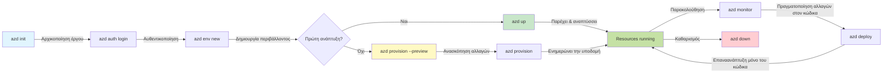
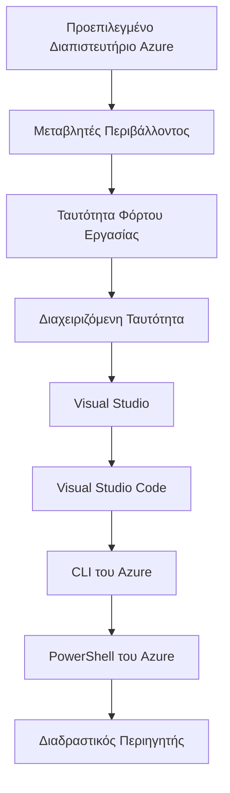

# AZD Basics - Κατανόηση του Azure Developer CLI

# AZD Basics - Βασικές Έννοιες και Θεμελιώδεις Αρχές

**Chapter Navigation:**
- **📚 Course Home**: [AZD για Αρχάριους](../../README.md)
- **📖 Current Chapter**: Κεφάλαιο 1 - Θεμέλιο & Γρήγορη Εκκίνηση
- **⬅️ Previous**: [Επισκόπηση Μαθήματος](../../README.md#-chapter-1-foundation--quick-start)
- **➡️ Next**: [Εγκατάσταση & Ρύθμιση](installation.md)
- **🚀 Next Chapter**: [Κεφάλαιο 2: Ανάπτυξη με Προτεραιότητα στην ΤΝ](../chapter-02-ai-development/microsoft-foundry-integration.md)

## Εισαγωγή

Αυτό το μάθημα σας εισάγει στο Azure Developer CLI (azd), ένα ισχυρό εργαλείο γραμμής εντολών που επιταχύνει το ταξίδι σας από την τοπική ανάπτυξη στην ανάπτυξη στο Azure. Θα μάθετε τις θεμελιώδεις έννοιες, τα βασικά χαρακτηριστικά και θα κατανοήσετε πώς το azd απλοποιεί την ανάπτυξη cloud-native εφαρμογών.

## Στόχοι Μάθησης

Στο τέλος αυτού του μαθήματος, θα:
- Κατανοείτε τι είναι το Azure Developer CLI και τον κύριο σκοπό του
- Μάθετε τις βασικές έννοιες των προτύπων, των περιβαλλόντων και των υπηρεσιών
- Εξερευνήσετε βασικά χαρακτηριστικά, συμπεριλαμβανομένης της ανάπτυξης με βάση πρότυπα και της Υποδομής ως Κώδικα
- Κατανοήσετε τη δομή έργου και τη ροή εργασίας του azd
- Είστε έτοιμοι να εγκαταστήσετε και να διαμορφώσετε το azd για το περιβάλλον ανάπτυξής σας

## Μαθησιακά Αποτελέσματα

Μετά την ολοκλήρωση αυτού του μαθήματος, θα μπορείτε να:
- Εξηγήσετε τον ρόλο του azd στις σύγχρονες ροές εργασίας ανάπτυξης cloud
- Αναγνωρίσετε τα συστατικά της δομής ενός έργου azd
- Περιγράψετε πώς τα πρότυπα, τα περιβάλλοντα και οι υπηρεσίες συνεργάζονται
- Κατανοήσετε τα οφέλη της Υποδομής ως Κώδικα με το azd
- Αναγνωρίσετε διάφορες εντολές azd και τους σκοπούς τους

## Τι είναι το Azure Developer CLI (azd);

Το Azure Developer CLI (azd) είναι ένα εργαλείο γραμμής εντολών σχεδιασμένο για να επιταχύνει το ταξίδι σας από την τοπική ανάπτυξη στην ανάπτυξη στο Azure. Απλοποιεί τη διαδικασία κατασκευής, ανάπτυξης και διαχείρισης cloud-native εφαρμογών στο Azure.

### Τι Μπορείτε να Αναπτύξετε με το azd;

Το azd υποστηρίζει ένα ευρύ φάσμα φορτίων εργασίας — και η λίστα συνεχίζει να μεγαλώνει. Σήμερα, μπορείτε να χρησιμοποιήσετε το azd για να αναπτύξετε:

| Workload Type | Examples | Same Workflow? |
|---------------|----------|----------------|
| **Παραδοσιακές εφαρμογές** | Εφαρμογές ιστού, REST APIs, στατικές ιστοσελίδες | ✅ `azd up` |
| **Υπηρεσίες και μικροϋπηρεσίες** | Container Apps, Function Apps, backend πολλαπλών υπηρεσιών | ✅ `azd up` |
| **Εφαρμογές με τεχνητή νοημοσύνη** | Εφαρμογές συνομιλίας με Microsoft Foundry Models, λύσεις RAG με AI Search | ✅ `azd up` |
| **Έξυπνοι πράκτορες** | Πράκτορες φιλοξενούμενοι στο Foundry, ορχηστρώσεις πολλαπλών πρακτόρων | ✅ `azd up` |

Το κύριο συμπέρασμα είναι ότι η **ζωή του azd παραμένει η ίδια ανεξάρτητα από το τι αναπτύσσετε**. Αρχικοποιείτε ένα έργο, προβλέπετε υποδομή, αναπτύσσετε τον κώδικά σας, παρακολουθείτε την εφαρμογή και καθαρίζετε — είτε πρόκειται για έναν απλό ιστότοπο είτε για έναν σύνθετο πράκτορα ΤΝ.

Αυτή η συνέχεια είναι σχεδιασμένη σκόπιμα. Το azd αντιμετωπίζει τις δυνατότητες ΤΝ ως ένα ακόμη είδος υπηρεσίας που μπορεί να χρησιμοποιήσει η εφαρμογή σας, όχι ως κάτι θεμελιωδώς διαφορετικό. Ένα endpoint συνομιλίας υποστηριζόμενο από Microsoft Foundry Models είναι, από την οπτική του azd, απλώς μια άλλη υπηρεσία προς διαμόρφωση και ανάπτυξη.

### 🎯 Γιατί να χρησιμοποιήσετε το AZD; Μια σύγκριση στον πραγματικό κόσμο

Ας συγκρίνουμε την ανάπτυξη μιας απλής εφαρμογής ιστού με βάση δεδομένων:

#### ❌ ΧΩΡΙΣ AZD: Χειροκίνητη Ανάπτυξη στο Azure (30+ λεπτά)

```bash
# Βήμα 1: Δημιουργία ομάδας πόρων
az group create --name myapp-rg --location eastus

# Βήμα 2: Δημιουργία σχεδίου App Service
az appservice plan create --name myapp-plan \
  --resource-group myapp-rg \
  --sku B1 --is-linux

# Βήμα 3: Δημιουργία εφαρμογής Web
az webapp create --name myapp-web-unique123 \
  --resource-group myapp-rg \
  --plan myapp-plan \
  --runtime "NODE:18-lts"

# Βήμα 4: Δημιουργία λογαριασμού Cosmos DB (10-15 λεπτά)
az cosmosdb create --name myapp-cosmos-unique123 \
  --resource-group myapp-rg \
  --kind MongoDB

# Βήμα 5: Δημιουργία βάσης δεδομένων
az cosmosdb mongodb database create \
  --account-name myapp-cosmos-unique123 \
  --resource-group myapp-rg \
  --name tododb

# Βήμα 6: Δημιουργία συλλογής
az cosmosdb mongodb collection create \
  --account-name myapp-cosmos-unique123 \
  --resource-group myapp-rg \
  --database-name tododb \
  --name todos

# Βήμα 7: Λήψη συμβολοσειράς σύνδεσης
CONN_STR=$(az cosmosdb keys list \
  --name myapp-cosmos-unique123 \
  --resource-group myapp-rg \
  --type connection-strings \
  --query "connectionStrings[0].connectionString" -o tsv)

# Βήμα 8: Διαμόρφωση ρυθμίσεων εφαρμογής
az webapp config appsettings set \
  --name myapp-web-unique123 \
  --resource-group myapp-rg \
  --settings MONGODB_URI="$CONN_STR"

# Βήμα 9: Ενεργοποίηση καταγραφής
az webapp log config --name myapp-web-unique123 \
  --resource-group myapp-rg \
  --application-logging filesystem \
  --detailed-error-messages true

# Βήμα 10: Ρύθμιση Application Insights
az monitor app-insights component create \
  --app myapp-insights \
  --location eastus \
  --resource-group myapp-rg

# Βήμα 11: Σύνδεση του Application Insights με την εφαρμογή Web
INSTRUMENTATION_KEY=$(az monitor app-insights component show \
  --app myapp-insights \
  --resource-group myapp-rg \
  --query "instrumentationKey" -o tsv)

az webapp config appsettings set \
  --name myapp-web-unique123 \
  --resource-group myapp-rg \
  --settings APPINSIGHTS_INSTRUMENTATIONKEY="$INSTRUMENTATION_KEY"

# Βήμα 12: Κατασκευή εφαρμογής τοπικά
npm install
npm run build

# Βήμα 13: Δημιουργία πακέτου ανάπτυξης
zip -r app.zip . -x "*.git*" "node_modules/*"

# Βήμα 14: Ανάπτυξη εφαρμογής
az webapp deployment source config-zip \
  --resource-group myapp-rg \
  --name myapp-web-unique123 \
  --src app.zip

# Βήμα 15: Περίμενε και προσευχήσου να λειτουργήσει 🙏
# (Δεν υπάρχει αυτοματοποιημένη επικύρωση, απαιτείται χειροκίνητος έλεγχος)
```

**Προβλήματα:**
- ❌ 15+ εντολές να θυμάστε και να εκτελέσετε με σειρά
- ❌ 30-45 λεπτά χειροκίνητης εργασίας
- ❌ Εύκολο να γίνουν λάθη (τυπογραφικά, λάθος παράμετροι)
- ❌ Στοιχεία σύνδεσης εκτίθενται στο ιστορικό του τερματικού
- ❌ Δεν υπάρχει αυτόματος επαναφορά σε περίπτωση αποτυχίας
- ❌ Δύσκολη η αναπαραγωγή για τα μέλη της ομάδας
- ❌ Κάθε φορά διαφορετικό (μη αναπαραγώγιμο)

#### ✅ ΜΕ AZD: Αυτοματοποιημένη Ανάπτυξη (5 εντολές, 10-15 λεπτά)

```bash
# Βήμα 1: Αρχικοποίηση από το πρότυπο
azd init --template todo-nodejs-mongo

# Βήμα 2: Πιστοποίηση
azd auth login

# Βήμα 3: Δημιουργία περιβάλλοντος
azd env new dev

# Βήμα 4: Προεπισκόπηση αλλαγών (προαιρετικό αλλά συνιστάται)
azd provision --preview

# Βήμα 5: Ανάπτυξη όλων
azd up

# ✨ Έγινε! Όλα έχουν αναπτυχθεί, ρυθμιστεί και παρακολουθούνται
```

**Οφέλη:**
- ✅ **5 εντολές** έναντι 15+ χειροκίνητων βημάτων
- ✅ **10-15 λεπτά** συνολικός χρόνος (κυρίως αναμονή για το Azure)
- ✅ **Λιγότερα χειροκίνητα λάθη** - συνεπής, ροή εργασίας με βάση πρότυπα
- ✅ **Ασφαλής διαχείριση μυστικών** - πολλά πρότυπα χρησιμοποιούν αποθήκευση μυστικών που διαχειρίζεται το Azure
- ✅ **Επαναλήψιμες αναπτύξεις** - ίδια ροή εργασίας κάθε φορά
- ✅ **Πλήρως αναπαραγώγιμο** - ίδιο αποτέλεσμα κάθε φορά
- ✅ **Έτοιμο για ομάδες** - ο καθένας μπορεί να αναπτύξει με τις ίδιες εντολές
- ✅ **Υποδομή ως Κώδικας** - πρότυπα Bicep με έλεγχο εκδόσεων
- ✅ **Ένσωμα παρακολούθηση** - Application Insights ρυθμίζεται αυτόματα

### 📊 Μείωση Χρόνου & Σφαλμάτων

| Metric | Manual Deployment | AZD Deployment | Improvement |
|:-------|:------------------|:---------------|:------------|
| **Εντολές** | 15+ | 5 | 67% λιγότερες |
| **Χρόνος** | 30-45 min | 10-15 min | 60% γρηγορότερα |
| **Ποσοστό Σφαλμάτων** | ~40% | <5% | 88% μείωση |
| **Συνέπεια** | Low (manual) | 100% (automated) | Τέλεια |
| **Ενσωμάτωση Ομάδας** | 2-4 hours | 30 minutes | 75% γρηγορότερα |
| **Χρόνος Επαναφοράς** | 30+ min (manual) | 2 min (automated) | 93% γρηγορότερα |

## Βασικές Έννοιες

### Πρότυπα
Τα πρότυπα είναι το θεμέλιο του azd. Περιέχουν:
- **Κώδικας εφαρμογής** - Ο πηγαίος κώδικας και οι εξαρτήσεις σας
- **Ορισμοί υποδομής** - Πόροι Azure ορισμένοι σε Bicep ή Terraform
- **Αρχεία διαμόρφωσης** - Ρυθμίσεις και μεταβλητές περιβάλλοντος
- **Σενάρια ανάπτυξης** - Αυτοματοποιημένες ροές εργασίας ανάπτυξης

### Περιβάλλοντα
Τα περιβάλλοντα αντιπροσωπεύουν διαφορετικούς στόχους ανάπτυξης:
- **Development** - Για δοκιμές και ανάπτυξη
- **Staging** - Περιβάλλον προ-παραγωγής
- **Production** - Ζωντανό περιβάλλον παραγωγής

Κάθε περιβάλλον διατηρεί το δικό του:
- Azure resource group
- Ρυθμίσεις διαμόρφωσης
- Κατάσταση ανάπτυξης

### Υπηρεσίες
Οι υπηρεσίες είναι τα δομικά στοιχεία της εφαρμογής σας:
- **Frontend** - Εφαρμογές ιστού, SPAs
- **Backend** - APIs, μικροϋπηρεσίες
- **Database** - Λύσεις αποθήκευσης δεδομένων
- **Storage** - Αποθήκευση αρχείων και blob

## Βασικά Χαρακτηριστικά

### 1. Ανάπτυξη με Βάση Πρότυπα
```bash
# Περιηγηθείτε στα διαθέσιμα πρότυπα
azd template list

# Αρχικοποιήστε από ένα πρότυπο
azd init --template <template-name>
```

### 2. Υποδομή ως Κώδικας
- **Bicep** - η γλώσσα ειδικού τομέα του Azure
- **Terraform** - Εργαλείο υποδομής για πολλαπλά cloud
- **ARM Templates** - πρότυπα Azure Resource Manager

### 3. Ενοποιημένες Ροές Εργασίας
```bash
# Πλήρης ροή εργασίας ανάπτυξης
azd up            # Παροχή + Ανάπτυξη — αυτό είναι χωρίς παρέμβαση για την αρχική ρύθμιση

# 🧪 ΝΕΟ: Προεπισκόπηση αλλαγών υποδομής πριν την ανάπτυξη (ΑΣΦΑΛΕΣ)
azd provision --preview    # Προσομοιώστε την ανάπτυξη υποδομής χωρίς να κάνετε αλλαγές

azd provision     # Δημιουργήστε πόρους Azure — αν ενημερώσετε την υποδομή, χρησιμοποιήστε αυτό
azd deploy        # Αναπτύξτε τον κώδικα της εφαρμογής ή αναπτύξτε ξανά τον κώδικα μετά την ενημέρωση
azd down          # Καταργήστε πόρους
```

#### 🛡️ Ασφαλής Σχεδιασμός Υποδομής με Προεπισκόπηση
Η εντολή `azd provision --preview` είναι καθοριστική για ασφαλείς αναπτύξεις:
- **Dry-run analysis** - Εμφανίζει τι θα δημιουργηθεί, τροποποιηθεί ή διαγραφεί
- **Zero risk** - Δεν γίνονται πραγματικές αλλαγές στο περιβάλλον Azure
- **Team collaboration** - Μοιραστείτε τα αποτελέσματα της προεπισκόπησης πριν την ανάπτυξη
- **Cost estimation** - Κατανοήστε το κόστος πόρων πριν τη δέσμευση

```bash
# Παράδειγμα ροής εργασίας προεπισκόπησης
azd provision --preview           # Δείτε τι θα αλλάξει
# Επανεξετάστε το αποτέλεσμα, συζητήστε με την ομάδα
azd provision                     # Εφαρμόστε τις αλλαγές με αυτοπεποίθηση
```

### 📊 Οπτικό: Ροή Εργασίας Ανάπτυξης AZD


**Επεξήγηση Ροής Εργασίας:**
1. **Init** - Ξεκινήστε με πρότυπο ή νέο έργο
2. **Auth** - Αυθεντικοποίηση με το Azure
3. **Environment** - Δημιουργία απομονωμένου περιβάλλοντος ανάπτυξης
4. **Preview** - 🆕 Πάντα προεπισκοπείτε πρώτα τις αλλαγές υποδομής (ασφαλής πρακτική)
5. **Provision** - Δημιουργία/ενημέρωση πόρων Azure
6. **Deploy** - Αναπτύξτε τον κώδικα της εφαρμογής σας
7. **Monitor** - Παρατηρήστε την απόδοση της εφαρμογής
8. **Iterate** - Κάντε αλλαγές και αναπτύξτε ξανά τον κώδικα
9. **Cleanup** - Αφαιρέστε πόρους όταν τελειώσετε

### 4. Διαχείριση Περιβάλλοντος
```bash
# Δημιουργήστε και διαχειριστείτε περιβάλλοντα
azd env new <environment-name>
azd env select <environment-name>
azd env list
```

### 5. Επεκτάσεις και Εντολές ΤΝ

Το azd χρησιμοποιεί ένα σύστημα επεκτάσεων για να προσθέσει δυνατότητες πέρα από την βασική CLI. Αυτό είναι ιδιαίτερα χρήσιμο για φορτία εργασίας ΤΝ:

```bash
# Εμφάνιση διαθέσιμων επεκτάσεων
azd extension list

# Εγκατάσταση της επέκτασης Foundry agents
azd extension install azure.ai.agents

# Αρχικοποίηση έργου πράκτορα AI από αρχείο manifest
azd ai agent init -m agent-manifest.yaml

# Εκκίνηση του διακομιστή MCP για ανάπτυξη με υποβοήθηση AI (Άλφα)
azd mcp start
```

> Οι επεκτάσεις καλύπτονται λεπτομερώς στο [Κεφάλαιο 2: Ανάπτυξη με Προτεραιότητα στην ΤΝ](../chapter-02-ai-development/agents.md) και στην αναφορά [Εντολές AZD AI CLI](../chapter-08-production/production-ai-practices.md#azd-ai-cli-commands-and-extensions).

## 📁 Δομή Έργου

Τυπική δομή έργου azd:
```
my-app/
├── .azd/                    # azd configuration
│   └── config.json
├── .azure/                  # Azure deployment artifacts
├── .devcontainer/          # Development container config
├── .github/workflows/      # GitHub Actions
├── .vscode/               # VS Code settings
├── infra/                 # Infrastructure code
│   ├── main.bicep        # Main infrastructure template
│   ├── main.parameters.json
│   └── modules/          # Reusable modules
├── src/                  # Application source code
│   ├── api/             # Backend services
│   └── web/             # Frontend application
├── azure.yaml           # azd project configuration
└── README.md
```

## 🔧 Αρχεία Διαμόρφωσης

### azure.yaml
Το κύριο αρχείο διαμόρφωσης του έργου:
```yaml
name: my-awesome-app
metadata:
  template: my-template@1.0.0

services:
  web:
    project: ./src/web
    language: js
    host: appservice
  api:
    project: ./src/api
    language: js
    host: appservice

hooks:
  preprovision:
    shell: pwsh
    run: echo "Preparing to provision..."
```

### .azure/config.json
Διαμόρφωση ειδική για περιβάλλον:
```json
{
  "version": 1,
  "defaultEnvironment": "dev",
  "environments": {
    "dev": {
      "subscriptionId": "your-subscription-id",
      "location": "eastus"
    }
  }
}
```

## 🎪 Κοινές Ροές Εργασίας με Πρακτικές Ασκήσεις

> **💡 Συμβουλή Μάθησης:** Ακολουθήστε αυτές τις ασκήσεις με αυτή τη σειρά για να αναπτύξετε σταδιακά τις δεξιότητές σας στο AZD.

### 🎯 Άσκηση 1: Αρχικοποιήστε το Πρώτο σας Έργο

**Στόχος:** Δημιουργήστε ένα έργο AZD και εξερευνήστε τη δομή του

**Βήματα:**
```bash
# Χρησιμοποιήστε ένα αποδεδειγμένο πρότυπο
azd init --template todo-nodejs-mongo

# Εξερευνήστε τα δημιουργημένα αρχεία
ls -la  # Δείτε όλα τα αρχεία, συμπεριλαμβανομένων και των κρυφών

# Βασικά αρχεία που δημιουργήθηκαν:
# - azure.yaml (κύρια διαμόρφωση)
# - infra/ (κώδικας υποδομής)
# - src/ (κώδικας εφαρμογής)
```

**✅ Επιτυχία:** Έχετε azure.yaml, infra/, και src/ directories

---

### 🎯 Άσκηση 2: Ανάπτυξη στο Azure

**Στόχος:** Ολοκληρώστε την πλήρη διαδικασία ανάπτυξης

**Βήματα:**
```bash
# 1. Επαλήθευση ταυτότητας
az login && azd auth login

# 2. Δημιουργία περιβάλλοντος
azd env new dev
azd env set AZURE_LOCATION eastus

# 3. Προεπισκόπηση αλλαγών (ΣΥΝΙΣΤΑΤΑΙ)
azd provision --preview

# 4. Ανάπτυξη όλων
azd up

# 5. Επαλήθευση ανάπτυξης
azd show    # Δείτε το URL της εφαρμογής σας
```

**Αναμενόμενος Χρόνος:** 10-15 λεπτά  
**✅ Επιτυχία:** Το URL της εφαρμογής ανοίγει στον περιηγητή

---

### 🎯 Άσκηση 3: Πολλαπλά Περιβάλλοντα

**Στόχος:** Αναπτύξτε σε dev και staging

**Βήματα:**
```bash
# Υπάρχει ήδη dev, δημιούργησε staging
azd env new staging
azd env set AZURE_LOCATION westus2
azd up

# Εναλλαγή μεταξύ τους
azd env list
azd env select dev
```

**✅ Επιτυχία:** Δύο ξεχωριστές ομάδες πόρων στο Azure Portal

---

### 🛡️ Καθαρή Εκκίνηση: `azd down --force --purge`

Όταν χρειάζεται να κάνετε πλήρη επαναφορά:

```bash
azd down --force --purge
```

**Τι κάνει:**
- `--force`: Χωρίς προτροπές επιβεβαίωσης
- `--purge`: Διαγράφει όλη την τοπική κατάσταση και τους πόρους Azure

**Χρησιμοποιήστε όταν:**
- Η ανάπτυξη απέτυχε στη μέση
- Αλλαγή έργων
- Χρειάζεστε καθαρή εκκίνηση

---

## 🎪 Αναφορά Αρχικής Ροής Εργασίας

### Έναρξη Νέου Έργου
```bash
# Μέθοδος 1: Χρησιμοποιήστε το υπάρχον πρότυπο
azd init --template todo-nodejs-mongo

# Μέθοδος 2: Ξεκινήστε από την αρχή
azd init

# Μέθοδος 3: Χρησιμοποιήστε τον τρέχοντα κατάλογο
azd init .
```

### Κύκλος Ανάπτυξης
```bash
# Ρυθμίστε το περιβάλλον ανάπτυξης
azd auth login
azd env new dev
azd env select dev

# Αναπτύξτε τα πάντα
azd up

# Κάντε αλλαγές και αναπτύξτε ξανά
azd deploy

# Καθαρίστε όταν τελειώσετε
azd down --force --purge # Η εντολή στο Azure Developer CLI είναι μια **σκληρή επαναφορά** για το περιβάλλον σας—ιδιαίτερα χρήσιμη όταν αντιμετωπίζετε αποτυχημένες αναπτύξεις, καθαρίζετε εγκαταλελειμμένους πόρους ή προετοιμάζεστε για μια νέα επανανάπτυξη
```

## Κατανόηση του `azd down --force --purge`
Η εντολή `azd down --force --purge` είναι ένας ισχυρός τρόπος να διαλύσετε πλήρως το περιβάλλον azd και όλους τους σχετικούς πόρους. Ακολουθεί ανάλυση του τι κάνει κάθε σημαία:
```
--force
```
- Παραλείπει τις προτροπές επιβεβαίωσης.
- Χρήσιμο για αυτοματοποίηση ή scripting όπου η χειροκίνητη εισαγωγή δεν είναι εφικτή.
- Εξασφαλίζει ότι η αποσυναρμολόγηση προχωρά χωρίς διακοπή, ακόμη και αν το CLI εντοπίσει ασυνεπείς καταστάσεις.

```
--purge
```
Διαγράφει **όλα τα συναφή μεταδεδομένα**, συμπεριλαμβανομένων:
Κατάσταση περιβάλλοντος
Τοπικός `.azure` φάκελος
Αποθηκευμένες πληροφορίες ανάπτυξης
Αποτρέπει το azd από το να "θυμάται" προηγούμενες αναπτύξεις, κάτι που μπορεί να προκαλέσει προβλήματα όπως μη αντιστοιχισμένες ομάδες πόρων ή παρωχημένες αναφορές registry.


### Γιατί να χρησιμοποιήσετε και τα δύο;
Όταν έχετε κολλήσει με το `azd up` λόγω παραμένουσας κατάστασης ή μερικών αναπτύξεων, αυτός ο συνδυασμός εξασφαλίζει μια **καθαρή εκκίνηση**.

Είναι ιδιαίτερα χρήσιμο μετά από χειροκίνητες διαγραφές πόρων στο Azure portal ή όταν αλλάζετε πρότυπα, περιβάλλοντα, ή συμβάσεις ονομασίας ομάδων πόρων.


### Διαχείριση Πολλαπλών Περιβαλλόντων
```bash
# Δημιουργήστε περιβάλλον staging
azd env new staging
azd env select staging
azd up

# Επιστρέψτε στο dev
azd env select dev

# Συγκρίνετε περιβάλλοντα
azd env list
```

## 🔐 Αυθεντικοποίηση και Διαπιστευτήρια

Η κατανόηση της αυθεντικοποίησης είναι κρίσιμη για επιτυχημένες αναπτύξεις με azd. Το Azure χρησιμοποιεί πολλαπλές μεθόδους αυθεντικοποίησης, και το azd αξιοποιεί την ίδια αλυσίδα διαπιστευτηρίων που χρησιμοποιούν και άλλα εργαλεία Azure.

### Αυθεντικοποίηση Azure CLI (`az login`)

Πριν χρησιμοποιήσετε το azd, πρέπει να αυθεντικοποιηθείτε στο Azure. Η πιο κοινή μέθοδος είναι η χρήση του Azure CLI:

```bash
# Διαδραστική σύνδεση (ανοίγει το πρόγραμμα περιήγησης)
az login

# Σύνδεση με συγκεκριμένο tenant
az login --tenant <tenant-id>

# Σύνδεση με service principal
az login --service-principal -u <app-id> -p <password> --tenant <tenant-id>

# Έλεγχος τρέχουσας κατάστασης σύνδεσης
az account show

# Λίστα διαθέσιμων συνδρομών
az account list --output table

# Ορισμός προεπιλεγμένης συνδρομής
az account set --subscription <subscription-id>
```

### Ροή Αυθεντικοποίησης
1. **Interactive Login**: Ανοίγει το προεπιλεγμένο πρόγραμμα περιήγησής σας για αυθεντικοποίηση
2. **Device Code Flow**: Για περιβάλλοντα χωρίς πρόσβαση σε πρόγραμμα περιήγησης
3. **Service Principal**: Για αυτοματοποίηση και σενάρια CI/CD
4. **Managed Identity**: Για εφαρμογές φιλοξενούμενες στο Azure

### Αλυσίδα DefaultAzureCredential

`DefaultAzureCredential` είναι ένας τύπος διαπιστευτηρίων που παρέχει μια απλοποιημένη εμπειρία αυθεντικοποίησης δοκιμάζοντας αυτόματα πολλαπλές πηγές διαπιστευτηρίων σε συγκεκριμένη σειρά:

#### Σειρά Αλυσίδας Διαπιστευτηρίων

#### 1. Μεταβλητές Περιβάλλοντος
```bash
# Ορίστε μεταβλητές περιβάλλοντος για το service principal
export AZURE_CLIENT_ID="<app-id>"
export AZURE_CLIENT_SECRET="<password>"
export AZURE_TENANT_ID="<tenant-id>"
```

#### 2. Workload Identity (Kubernetes/GitHub Actions)
Χρησιμοποιείται αυτόματα σε:
- Azure Kubernetes Service (AKS) με Workload Identity
- GitHub Actions με OIDC ομοσπονδία
- Άλλα σενάρια ομοσπονδίας ταυτοτήτων

#### 3. Managed Identity
Για πόρους Azure όπως:
- Virtual Machines
- App Service
- Azure Functions
- Container Instances

```bash
# Ελέγξτε αν εκτελείται σε πόρο του Azure με διαχειριζόμενη ταυτότητα
az account show --query "user.type" --output tsv
# Επιστρέφει: "servicePrincipal" εάν χρησιμοποιείται διαχειριζόμενη ταυτότητα
```

#### 4. Ενσωμάτωση Εργαλείων Ανάπτυξης
- **Visual Studio**: Χρησιμοποιεί αυτόματα τον συνδεδεμένο λογαριασμό
- **VS Code**: Χρησιμοποιεί διαπιστευτήρια της επέκτασης Azure Account
- **Azure CLI**: Χρησιμοποιεί διαπιστευτήρια `az login` (το πιο κοινό για τοπική ανάπτυξη)

### Ρύθμιση Αυθεντικοποίησης AZD

```bash
# Μέθοδος 1: Χρησιμοποιήστε το Azure CLI (Συνιστάται για ανάπτυξη)
az login
azd auth login  # Χρησιμοποιεί τα υπάρχοντα διαπιστευτήρια του Azure CLI

# Μέθοδος 2: Άμεση πιστοποίηση azd
azd auth login --use-device-code  # Για περιβάλλοντα χωρίς γραφικό περιβάλλον

# Μέθοδος 3: Έλεγχος κατάστασης πιστοποίησης
azd auth login --check-status

# Μέθοδος 4: Αποσύνδεση και επαναπιστοποίηση
azd auth logout
azd auth login
```

### Καλύτερες Πρακτικές Αυθεντικοποίησης

#### Για τοπική ανάπτυξη
```bash
# 1. Συνδεθείτε στο Azure CLI
az login

# 2. Επαληθεύστε τη σωστή συνδρομή
az account show
az account set --subscription "Your Subscription Name"

# 3. Χρησιμοποιήστε το azd με τα υπάρχοντα διαπιστευτήρια
azd auth login
```

#### Για CI/CD Pipelines
```yaml
# GitHub Actions example
- name: Azure Login
  uses: azure/login@v1
  with:
    creds: ${{ secrets.AZURE_CREDENTIALS }}

- name: Deploy with azd
  run: |
    azd auth login --client-id ${{ secrets.AZURE_CLIENT_ID }} \
                    --client-secret ${{ secrets.AZURE_CLIENT_SECRET }} \
                    --tenant-id ${{ secrets.AZURE_TENANT_ID }}
    azd up --no-prompt
```

#### Για περιβάλλοντα παραγωγής
- Χρησιμοποιήστε **Managed Identity** όταν εκτελείτε σε πόρους Azure
- Χρησιμοποιήστε **Service Principal** για σενάρια αυτοματοποίησης
- Αποφύγετε την αποθήκευση διαπιστευτηρίων σε κώδικα ή αρχεία διαμόρφωσης
- Χρησιμοποιήστε **Azure Key Vault** για ευαίσθητες ρυθμίσεις

### Συνήθη Προβλήματα Αυθεντικοποίησης και Λύσεις

#### Πρόβλημα: "No subscription found"
```bash
# Λύση: Ορίστε την προεπιλεγμένη συνδρομή
az account list --output table
az account set --subscription "<subscription-id>"
azd env set AZURE_SUBSCRIPTION_ID "<subscription-id>"
```

#### Πρόβλημα: "Insufficient permissions"
```bash
# Λύση: Ελέγξτε και εκχωρήστε τους απαιτούμενους ρόλους
az role assignment list --assignee $(az account show --query user.name --output tsv)

# Συνήθεις απαιτούμενοι ρόλοι:
# - Συνεισφέρων (για τη διαχείριση πόρων)
# - Διαχειριστής πρόσβασης χρηστών (για την εκχώρηση ρόλων)
```

#### Πρόβλημα: "Token expired"
```bash
# Λύση: Επαναταυτοποίηση
az logout
az login
azd auth logout
azd auth login
```

### Αυθεντικοποίηση σε Διαφορετικά Σενάρια

#### Τοπική Ανάπτυξη
```bash
# Λογαριασμός προσωπικής ανάπτυξης
az login
azd auth login
```

#### Ομαδική Ανάπτυξη
```bash
# Χρησιμοποιήστε συγκεκριμένο tenant για τον οργανισμό
az login --tenant contoso.onmicrosoft.com
azd auth login
```

#### Σενάρια πολλαπλών ενοικιαστών
```bash
# Εναλλαγή μεταξύ ενοικιαστών
az login --tenant tenant1.onmicrosoft.com
# Ανάπτυξη στον ενοικιαστή 1
azd up

az login --tenant tenant2.onmicrosoft.com  
# Ανάπτυξη στον ενοικιαστή 2
azd up
```

### Θέματα Ασφαλείας
1. **Αποθήκευση Διαπιστευτηρίων**: Μην αποθηκεύετε διαπιστευτήρια στον πηγαίο κώδικα
2. **Περιορισμός Δικαιωμάτων**: Χρησιμοποιήστε την αρχή της ελάχιστης προνόμιας για service principals
3. **Ανακύκλωση διακριτικών**: Εναλλάσσετε τακτικά τα μυστικά των service principals
4. **Audit Trail**: Παρακολουθείτε δραστηριότητες ελέγχου ταυτότητας και ανάπτυξης
5. **Δικτυακή Ασφάλεια**: Χρησιμοποιήστε ιδιωτικά endpoints όταν είναι δυνατόν

### Επίλυση Προβλημάτων Πιστοποίησης

```bash
# Αντιμετώπιση προβλημάτων αυθεντικοποίησης
azd auth login --check-status
az account show
az account get-access-token

# Συνήθεις εντολές διάγνωσης
whoami                          # Τρέχον πλαίσιο χρήστη
az ad signed-in-user show      # Λεπτομέρειες χρήστη Azure AD
az group list                  # Δοκιμή πρόσβασης σε πόρο
```

## Κατανόηση `azd down --force --purge`

### Ανίχνευση
```bash
azd template list              # Περιήγηση προτύπων
azd template show <template>   # Λεπτομέρειες προτύπου
azd init --help               # Επιλογές αρχικοποίησης
```

### Διαχείριση Έργου
```bash
azd show                     # Επισκόπηση έργου
azd env list                # Διαθέσιμα περιβάλλοντα και η προεπιλεγμένη επιλογή
azd config show            # Ρυθμίσεις διαμόρφωσης
```

### Παρακολούθηση
```bash
azd monitor                  # Άνοιγμα παρακολούθησης στην πύλη Azure
azd monitor --logs           # Προβολή καταγραφών εφαρμογής
azd monitor --live           # Προβολή ζωντανών μετρικών
azd pipeline config          # Ρύθμιση CI/CD
```

## Βέλτιστες Πρακτικές

### 1. Χρησιμοποιήστε Σημαντικά Ονόματα
```bash
# Καλό
azd env new production-east
azd init --template web-app-secure

# Αποφύγετε
azd env new env1
azd init --template template1
```

### 2. Χρησιμοποιήστε Προτύπα
- Ξεκινήστε με υπάρχοντα πρότυπα
- Προσαρμόστε στις ανάγκες σας
- Δημιουργήστε επαναχρησιμοποιήσιμα πρότυπα για τον οργανισμό σας

### 3. Απομόνωση Περιβάλλοντος
- Χρησιμοποιήστε ξεχωριστά περιβάλλοντα για dev/staging/prod
- Μην κάνετε ποτέ άμεση ανάπτυξη σε παραγωγή από το τοπικό μηχάνημα
- Χρησιμοποιήστε pipelines CI/CD για αναπτύξεις σε παραγωγή

### 4. Διαχείριση Διαμόρφωσης
- Χρησιμοποιήστε μεταβλητές περιβάλλοντος για ευαίσθητα δεδομένα
- Κρατήστε τη διαμόρφωση στον έλεγχο έκδοσης
- Τεκμηριώστε ρυθμίσεις συγκεκριμένες για κάθε περιβάλλον

## Πρόοδος Μάθησης

### Αρχάριος (Εβδομάδα 1-2)
1. Εγκαταστήστε το azd και πραγματοποιήστε πιστοποίηση
2. Αναπτύξτε ένα απλό πρότυπο
3. Κατανοήστε τη δομή του έργου
4. Μάθετε βασικές εντολές (up, down, deploy)

### Ενδιάμεσο (Εβδομάδα 3-4)
1. Προσαρμόστε πρότυπα
2. Διαχειριστείτε πολλαπλά περιβάλλοντα
3. Κατανοήστε τον κώδικα υποδομής
4. Ρυθμίστε pipelines CI/CD

### Προχωρημένο (Εβδομάδα 5+)
1. Δημιουργήστε προσαρμοσμένα πρότυπα
2. Προηγμένα πρότυπα υποδομής
3. Αναπτύξεις σε πολλαπλές περιοχές
4. Ρυθμίσεις επιπέδου επιχείρησης

## Επόμενα Βήματα

**📖 Συνεχίστε τη Μάθηση του Κεφαλαίου 1:**
- [Εγκατάσταση & Ρύθμιση](installation.md) - Εγκαταστήστε και διαμορφώστε το azd
- [Το Πρώτο Σας Έργο](first-project.md) - Ολοκληρώστε το πρακτικό σεμινάριο
- [Οδηγός Διαμόρφωσης](configuration.md) - Προηγμένες επιλογές διαμόρφωσης

**🎯 Έτοιμοι για το Επόμενο Κεφάλαιο;**
- [Κεφάλαιο 2: Ανάπτυξη με Προτεραιότητα στην ΤΝ](../chapter-02-ai-development/microsoft-foundry-integration.md) - Ξεκινήστε να δημιουργείτε εφαρμογές ΤΝ

## Πρόσθετοι Πόροι

- [Επισκόπηση Azure Developer CLI](https://learn.microsoft.com/en-us/azure/developer/azure-developer-cli/)
- [Συλλογή Προτύπων](https://azure.github.io/awesome-azd/)
- [Δείγματα Κοινότητας](https://github.com/Azure-Samples)

---

## 🙋 Συχνές Ερωτήσεις

### Γενικές Ερωτήσεις

**Q: Ποια είναι η διαφορά μεταξύ του AZD και του Azure CLI;**

A: Το Azure CLI (`az`) προορίζεται για διαχείριση μεμονωμένων πόρων Azure. Το AZD (`azd`) προορίζεται για τη διαχείριση ολόκληρων εφαρμογών:

```bash
# Azure CLI - Χαμηλού επιπέδου διαχείριση πόρων
az webapp create --name myapp --resource-group rg
az sql server create --name myserver --resource-group rg
# ...απαιτούνται πολλές ακόμη εντολές

# AZD - Διαχείριση σε επίπεδο εφαρμογής
azd up  # Αναπτύσσει ολόκληρη την εφαρμογή με όλους τους πόρους
```

**Σκεφτείτε το έτσι:**
- `az` = Εργασία με μεμονωμένα τουβλάκια Lego
- `azd` = Εργασία με ολόκληρα σετ Lego

---

**Q: Χρειάζεται να γνωρίζω Bicep ή Terraform για να χρησιμοποιήσω το AZD;**

A: Όχι! Ξεκινήστε με πρότυπα:
```bash
# Χρησιμοποιήστε το υπάρχον πρότυπο - δεν απαιτούνται γνώσεις IaC
azd init --template todo-nodejs-mongo
azd up
```

Μπορείτε να μάθετε Bicep αργότερα για να προσαρμόσετε την υποδομή. Τα πρότυπα παρέχουν λειτουργικά παραδείγματα για να μάθετε.

---

**Q: Πόσο κοστίζει η εκτέλεση προτύπων AZD;**

A: Το κόστος διαφέρει ανά πρότυπο. Τα περισσότερα πρότυπα ανάπτυξης κοστίζουν $50-150/μήνα:

```bash
# Προεπισκόπηση κόστους πριν την ανάπτυξη
azd provision --preview

# Κάντε πάντα καθαρισμό όταν δεν το χρησιμοποιείτε
azd down --force --purge  # Αφαιρεί όλους τους πόρους
```

**Επαγγελματική συμβουλή:** Χρησιμοποιήστε δωρεάν επίπεδα όπου είναι διαθέσιμα:
- App Service: F1 (Δωρεάν) επίπεδο
- Microsoft Foundry Models: Azure OpenAI 50.000 tokens/μήνα δωρεάν
- Cosmos DB: 1000 RU/s δωρεάν επίπεδο

---

**Q: Μπορώ να χρησιμοποιήσω το AZD με υπάρχοντες πόρους Azure;**

A: Ναι, αλλά είναι πιο εύκολο να ξεκινήσετε από την αρχή. Το AZD λειτουργεί καλύτερα όταν διαχειρίζεται ολόκληρο τον κύκλο ζωής. Για υπάρχοντες πόρους:

```bash
# Επιλογή 1: Εισαγωγή υπαρχόντων πόρων (για προχωρημένους)
azd init
# Στη συνέχεια τροποποιήστε το infra/ ώστε να αναφέρεται σε υπάρχοντες πόρους

# Επιλογή 2: Ξεκινήστε από την αρχή (συνιστάται)
azd init --template matching-your-stack
azd up  # Δημιουργεί νέο περιβάλλον
```

---

**Q: Πώς μοιράζομαι το έργο μου με συναδέλφους;**

A: Κάντε commit το έργο AZD στο Git (αλλά ΟΧΙ το φάκελο .azure):
```bash
# Ήδη στο .gitignore από προεπιλογή
.azure/        # Περιέχει μυστικά και δεδομένα περιβάλλοντος
*.env          # Μεταβλητές περιβάλλοντος

# Μέλη της ομάδας τότε:
git clone <your-repo>
azd auth login
azd env new <their-name>-dev
azd up
```

Όλοι λαμβάνουν πανομοιότυπη υποδομή από τα ίδια πρότυπα.

---

### Ερωτήσεις Επίλυσης Προβλημάτων

**Q: "azd up" failed halfway. What do I do?**

A: Ελέγξτε το σφάλμα, διορθώστε το και δοκιμάστε ξανά:
```bash
# Προβολή λεπτομερών αρχείων καταγραφής
azd show

# Συνηθισμένες διορθώσεις:

# 1. Αν ξεπεραστεί το όριο:
azd env set AZURE_LOCATION "westus2"  # Δοκιμάστε διαφορετική περιοχή

# 2. Αν υπάρχει σύγκρουση ονόματος πόρου:
azd down --force --purge  # Ξεκινήστε από την αρχή
azd up  # Δοκιμάστε ξανά

# 3. Αν έχει λήξει η αυθεντικοποίηση:
az login
azd auth login
azd up
```

**Το πιο συνηθισμένο ζήτημα:** Επιλέχθηκε λάθος συνδρομή Azure
```bash
az account list --output table
az account set --subscription "<correct-subscription>"
```

---

**Q: Πώς αναπτύσσω μόνο αλλαγές κώδικα χωρίς επανεγκατάσταση υποδομών;**

A: Χρησιμοποιήστε `azd deploy` αντί για `azd up`:
```bash
azd up          # Πρώτη φορά: προετοιμασία + ανάπτυξη (αργά)

# Κάντε αλλαγές στον κώδικα...

azd deploy      # Επόμενες φορές: μόνο ανάπτυξη (γρήγορα)
```

Σύγκριση ταχύτητας:
- `azd up`: 10-15 λεπτά (παρέχει υποδομή)
- `azd deploy`: 2-5 λεπτά (μόνο κώδικας)

---

**Q: Μπορώ να προσαρμόσω τα πρότυπα υποδομής;**

A: Ναι! Επεξεργαστείτε τα αρχεία Bicep στο `infra/`:
```bash
# Μετά το azd init
cd infra/
code main.bicep  # Επεξεργασία στο VS Code

# Προεπισκόπηση αλλαγών
azd provision --preview

# Εφαρμογή αλλαγών
azd provision
```

**Συμβουλή:** Ξεκινήστε μικρά - αλλάξτε πρώτα τα SKUs:
```bicep
// infra/main.bicep
sku: {
  name: 'B1'  // Change to 'P1V2' for production
}
```

---

**Q: Πώς διαγράφω όλα όσα δημιούργησε το AZD;**

A: Μια εντολή αφαιρεί όλους τους πόρους:
```bash
azd down --force --purge

# Αυτό διαγράφει:
# - Όλους τους πόρους του Azure
# - Την ομάδα πόρων
# - Την κατάσταση του τοπικού περιβάλλοντος
# - Αποθηκευμένα προσωρινά δεδομένα ανάπτυξης
```

**Τρέχετε αυτό πάντα όταν:**
- Ολοκληρώσατε τις δοκιμές ενός προτύπου
- Αλλάζετε σε διαφορετικό έργο
- Θέλετε να ξεκινήσετε από την αρχή

**Εξοικονόμηση κόστους:** Η διαγραφή μη χρησιμοποιημένων πόρων = $0 χρεώσεις

---

**Q: Τι γίνεται αν κατά λάθος διαγράψω πόρους στο Azure Portal;**

A: Η κατάσταση του AZD μπορεί να μην είναι συγχρονισμένη. Προσέγγιση καθαρής εκκίνησης:
```bash
# 1. Κατάργηση τοπικής κατάστασης
azd down --force --purge

# 2. Ξεκινήστε από την αρχή
azd up

# Εναλλακτικά: Αφήστε το AZD να εντοπίσει και να διορθώσει
azd provision  # Θα δημιουργήσει τους ελλείποντες πόρους
```

---

### Προχωρημένες Ερωτήσεις

**Q: Μπορώ να χρησιμοποιήσω το AZD σε pipelines CI/CD;**

A: Ναι! Παράδειγμα GitHub Actions:
```yaml
# .github/workflows/deploy.yml
name: Deploy with AZD

on:
  push:
    branches: [main]

jobs:
  deploy:
    runs-on: ubuntu-latest
    steps:
      - uses: actions/checkout@v2
      
      - name: Install azd
        run: curl -fsSL https://aka.ms/install-azd.sh | bash
      
      - name: Azure Login
        run: |
          azd auth login \
            --client-id ${{ secrets.AZURE_CLIENT_ID }} \
            --client-secret ${{ secrets.AZURE_CLIENT_SECRET }} \
            --tenant-id ${{ secrets.AZURE_TENANT_ID }}
      
      - name: Deploy
        run: azd up --no-prompt
```

---

**Q: Πώς χειρίζομαι μυστικά και ευαίσθητα δεδομένα;**

A: Το AZD ενσωματώνεται αυτόματα με το Azure Key Vault:
```bash
# Τα μυστικά αποθηκεύονται στο Key Vault, όχι στον κώδικα
azd env set DATABASE_PASSWORD "$(openssl rand -base64 32)"

# Το AZD αυτόματα:
# 1. Δημιουργεί το Key Vault
# 2. Αποθηκεύει το μυστικό
# 3. Χορηγεί στην εφαρμογή πρόσβαση μέσω Διαχειριζόμενης Ταυτότητας
# 4. Εισάγει κατά το χρόνο εκτέλεσης
```

**Μην κάνετε ποτέ commit:**
- Φάκελος `.azure/` (περιέχει δεδομένα περιβάλλοντος)
- Αρχεία `.env` (τοπικά μυστικά)
- Συμβολοσειρές σύνδεσης

---

**Q: Μπορώ να αναπτύξω σε πολλαπλές περιοχές;**

A: Ναι, δημιουργήστε ένα περιβάλλον ανά περιοχή:
```bash
# Περιβάλλον Ανατολικών ΗΠΑ
azd env new prod-eastus
azd env set AZURE_LOCATION eastus
azd up

# Περιβάλλον Δυτικής Ευρώπης
azd env new prod-westeurope
azd env set AZURE_LOCATION westeurope
azd up

# Κάθε περιβάλλον είναι ανεξάρτητο
azd env list
```

Για πραγματικές εφαρμογές πολλαπλών περιοχών, προσαρμόστε τα πρότυπα Bicep για να αναπτύξετε σε πολλαπλές περιοχές ταυτόχρονα.

---

**Q: Πού μπορώ να βρω βοήθεια αν κολλήσω;**

1. **Τεκμηρίωση AZD:** https://learn.microsoft.com/azure/developer/azure-developer-cli/
2. **Ζητήματα στο GitHub:** https://github.com/Azure/azure-dev/issues
3. **Discord:** [Azure Discord](https://discord.gg/microsoft-azure) - κανάλι #azure-developer-cli
4. **Stack Overflow:** Ετικέτα `azure-developer-cli`
5. **Αυτό το Μάθημα:** [Οδηγός Επίλυσης Προβλημάτων](../chapter-07-troubleshooting/common-issues.md)

**Επαγγελματική συμβουλή:** Πριν ρωτήσετε, εκτελέστε:
```bash
azd show       # Εμφανίζει την τρέχουσα κατάσταση
azd version    # Εμφανίζει την έκδοσή σας
```
Συμπεριλάβετε αυτές τις πληροφορίες στην ερώτησή σας για πιο γρήγορη βοήθεια.

---

## 🎓 Τι Ακολουθεί;

Τώρα καταλαβαίνετε τα βασικά του AZD. Επιλέξτε την πορεία σας:

### 🎯 Για Αρχάριους:
1. **Επόμενο:** [Εγκατάσταση & Ρύθμιση](installation.md) - Εγκαταστήστε το AZD στη μηχανή σας
2. **Έπειτα:** [Το Πρώτο Σας Έργο](first-project.md) - Αναπτύξτε την πρώτη σας εφαρμογή
3. **Εξάσκηση:** Ολοκληρώστε και τις 3 ασκήσεις σε αυτό το μάθημα

### 🚀 Για προγραμματιστές ΤΝ:
1. **Πατήστε εδώ:** [Κεφάλαιο 2: Ανάπτυξη με Προτεραιότητα στην ΤΝ](../chapter-02-ai-development/microsoft-foundry-integration.md)
2. **Ανάπτυξη:** Ξεκινήστε με `azd init --template get-started-with-ai-chat`
3. **Μάθετε:** Δημιουργήστε ενώ αναπτύσσετε

### 🏗️ Για Έμπειρους Προγραμματιστές:
1. **Ανασκόπηση:** [Οδηγός Διαμόρφωσης](configuration.md) - Προηγμένες ρυθμίσεις
2. **Εξερευνήστε:** [Υποδομή ως Κώδικας](../chapter-04-infrastructure/provisioning.md) - Βαθιά ανάλυση Bicep
3. **Δημιουργήστε:** Δημιουργήστε προσαρμοσμένα πρότυπα για το stack σας

---

**Πλοήγηση Κεφαλαίου:**
- **📚 Αρχική Μαθήματος**: [AZD Για Αρχάριους](../../README.md)
- **📖 Τρέχον Κεφάλαιο**: Κεφάλαιο 1 - Θεμέλιο & Γρήγορη Εκκίνηση  
- **⬅️ Προηγούμενο**: [Επισκόπηση Μαθήματος](../../README.md#-chapter-1-foundation--quick-start)
- **➡️ Επόμενο**: [Εγκατάσταση & Ρύθμιση](installation.md)
- **🚀 Επόμενο Κεφάλαιο**: [Κεφάλαιο 2: Ανάπτυξη με Προτεραιότητα στην ΤΝ](../chapter-02-ai-development/microsoft-foundry-integration.md)

---

<!-- CO-OP TRANSLATOR DISCLAIMER START -->
**Disclaimer**:
Το παρόν έγγραφο έχει μεταφραστεί χρησιμοποιώντας την υπηρεσία μετάφρασης AI [Co-op Translator](https://github.com/Azure/co-op-translator). Αν και επιδιώκουμε την ακρίβεια, παρακαλούμε να έχετε υπόψη ότι οι αυτοματοποιημένες μεταφράσεις ενδέχεται να περιέχουν σφάλματα ή ανακρίβειες. Το πρωτότυπο έγγραφο στη γλώσσα του πρέπει να θεωρείται η αυθεντική πηγή. Για κρίσιμες πληροφορίες, συνιστάται επαγγελματική ανθρώπινη μετάφραση. Δεν φέρουμε ευθύνη για οποιεσδήποτε παρεξηγήσεις ή λανθασμένες ερμηνείες που προκύπτουν από τη χρήση αυτής της μετάφρασης.
<!-- CO-OP TRANSLATOR DISCLAIMER END -->