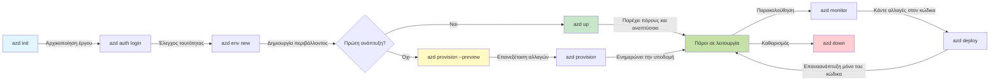
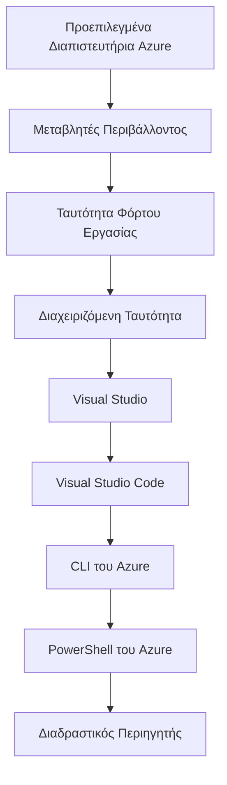

# AZD Basics - Understanding Azure Developer CLI

# AZD Basics - Core Concepts and Fundamentals

**Chapter Navigation:**
- **📚 Course Home**: [AZD For Beginners](../../README.md)
- **📖 Current Chapter**: Κεφάλαιο 1 - Θεμέλιο & Γρήγορη Εκκίνηση
- **⬅️ Previous**: [Course Overview](../../README.md#-chapter-1-foundation--quick-start)
- **➡️ Next**: [Installation & Setup](installation.md)
- **🚀 Next Chapter**: [Κεφάλαιο 2: Ανάπτυξη με Προτεραιότητα στο AI](../chapter-02-ai-development/microsoft-foundry-integration.md)

## Introduction

This lesson introduces you to Azure Developer CLI (azd), a powerful command-line tool that accelerates your journey from local development to Azure deployment. You'll learn the fundamental concepts, core features, and understand how azd simplifies cloud-native application deployment.

## Learning Goals

By the end of this lesson, you will:
- Understand what Azure Developer CLI is and its primary purpose
- Learn the core concepts of templates, environments, and services
- Explore key features including template-driven development and Infrastructure as Code
- Understand the azd project structure and workflow
- Be prepared to install and configure azd for your development environment

## Learning Outcomes

After completing this lesson, you will be able to:
- Explain the role of azd in modern cloud development workflows
- Identify the components of an azd project structure
- Describe how templates, environments, and services work together
- Understand the benefits of Infrastructure as Code with azd
- Recognize different azd commands and their purposes

## What is Azure Developer CLI (azd)?

Azure Developer CLI (azd) is a command-line tool designed to accelerate your journey from local development to Azure deployment. It simplifies the process of building, deploying, and managing cloud-native applications on Azure.

### 🎯 Why Use AZD? A Real-World Comparison

Let's compare deploying a simple web app with database:

#### ❌ WITHOUT AZD: Manual Azure Deployment (30+ minutes)

```bash
# Βήμα 1: Δημιουργία ομάδας πόρων
az group create --name myapp-rg --location eastus

# Βήμα 2: Δημιουργία App Service Plan
az appservice plan create --name myapp-plan \
  --resource-group myapp-rg \
  --sku B1 --is-linux

# Βήμα 3: Δημιουργία Web App
az webapp create --name myapp-web-unique123 \
  --resource-group myapp-rg \
  --plan myapp-plan \
  --runtime "NODE:18-lts"

# Βήμα 4: Δημιουργία λογαριασμού Cosmos DB (10-15 λεπτά)
az cosmosdb create --name myapp-cosmos-unique123 \
  --resource-group myapp-rg \
  --kind MongoDB

# Βήμα 5: Δημιουργία βάσης δεδομένων
az cosmosdb mongodb database create \
  --account-name myapp-cosmos-unique123 \
  --resource-group myapp-rg \
  --name tododb

# Βήμα 6: Δημιουργία συλλογής
az cosmosdb mongodb collection create \
  --account-name myapp-cosmos-unique123 \
  --resource-group myapp-rg \
  --database-name tododb \
  --name todos

# Βήμα 7: Λήψη συμβολοσειράς σύνδεσης
CONN_STR=$(az cosmosdb keys list \
  --name myapp-cosmos-unique123 \
  --resource-group myapp-rg \
  --type connection-strings \
  --query "connectionStrings[0].connectionString" -o tsv)

# Βήμα 8: Διαμόρφωση ρυθμίσεων εφαρμογής
az webapp config appsettings set \
  --name myapp-web-unique123 \
  --resource-group myapp-rg \
  --settings MONGODB_URI="$CONN_STR"

# Βήμα 9: Ενεργοποίηση καταγραφής
az webapp log config --name myapp-web-unique123 \
  --resource-group myapp-rg \
  --application-logging filesystem \
  --detailed-error-messages true

# Βήμα 10: Ρύθμιση του Application Insights
az monitor app-insights component create \
  --app myapp-insights \
  --location eastus \
  --resource-group myapp-rg

# Βήμα 11: Σύνδεση App Insights με το Web App
INSTRUMENTATION_KEY=$(az monitor app-insights component show \
  --app myapp-insights \
  --resource-group myapp-rg \
  --query "instrumentationKey" -o tsv)

az webapp config appsettings set \
  --name myapp-web-unique123 \
  --resource-group myapp-rg \
  --settings APPINSIGHTS_INSTRUMENTATIONKEY="$INSTRUMENTATION_KEY"

# Βήμα 12: Κατασκευή εφαρμογής τοπικά
npm install
npm run build

# Βήμα 13: Δημιουργία πακέτου ανάπτυξης
zip -r app.zip . -x "*.git*" "node_modules/*"

# Βήμα 14: Ανάπτυξη εφαρμογής
az webapp deployment source config-zip \
  --resource-group myapp-rg \
  --name myapp-web-unique123 \
  --src app.zip

# Βήμα 15: Περιμένετε και προσευχηθείτε να λειτουργήσει 🙏
# (Δεν υπάρχει αυτοματοποιημένη επικύρωση, απαιτείται χειροκίνητη δοκιμή)
```

**Problems:**
- ❌ 15+ commands to remember and execute in order
- ❌ 30-45 minutes of manual work
- ❌ Easy to make mistakes (typos, wrong parameters)
- ❌ Connection strings exposed in terminal history
- ❌ No automated rollback if something fails
- ❌ Hard to replicate for team members
- ❌ Different every time (not reproducible)

#### ✅ WITH AZD: Automated Deployment (5 commands, 10-15 minutes)

```bash
# Βήμα 1: Αρχικοποίηση από πρότυπο
azd init --template todo-nodejs-mongo

# Βήμα 2: Επαλήθευση ταυτότητας
azd auth login

# Βήμα 3: Δημιουργία περιβάλλοντος
azd env new dev

# Βήμα 4: Προεπισκόπηση αλλαγών (προαιρετικό αλλά συνιστάται)
azd provision --preview

# Βήμα 5: Ανάπτυξη όλων
azd up

# ✨ Έτοιμο! Όλα έχουν αναπτυχθεί, ρυθμιστεί και παρακολουθούνται
```

**Benefits:**
- ✅ **5 commands** vs. 15+ manual steps
- ✅ **10-15 minutes** total time (mostly waiting for Azure)
- ✅ **Zero errors** - automated and tested
- ✅ **Secrets managed securely** via Key Vault
- ✅ **Automatic rollback** on failures
- ✅ **Fully reproducible** - same result every time
- ✅ **Team-ready** - anyone can deploy with same commands
- ✅ **Infrastructure as Code** - version controlled Bicep templates
- ✅ **Built-in monitoring** - Application Insights configured automatically

### 📊 Time & Error Reduction

| Metric | Manual Deployment | AZD Deployment | Improvement |
|:-------|:------------------|:---------------|:------------|
| **Commands** | 15+ | 5 | 67% fewer |
| **Time** | 30-45 min | 10-15 min | 60% faster |
| **Error Rate** | ~40% | <5% | 88% reduction |
| **Consistency** | Low (manual) | 100% (automated) | Perfect |
| **Team Onboarding** | 2-4 hours | 30 minutes | 75% faster |
| **Rollback Time** | 30+ min (manual) | 2 min (automated) | 93% faster |

## Core Concepts

### Templates
Τα πρότυπα είναι το θεμέλιο του azd. Περιέχουν:
- **Application code** - Your source code and dependencies
- **Infrastructure definitions** - Azure resources defined in Bicep or Terraform
- **Configuration files** - Settings and environment variables
- **Deployment scripts** - Automated deployment workflows

### Environments
Τα περιβάλλοντα αντιπροσωπεύουν διαφορετικούς στόχους ανάπτυξης:
- **Development** - For testing and development
- **Staging** - Pre-production environment
- **Production** - Live production environment

Κάθε περιβάλλον διατηρεί το δικό του:
- Azure resource group
- Configuration settings
- Deployment state

### Services
Οι υπηρεσίες είναι τα δομικά στοιχεία της εφαρμογής σας:
- **Frontend** - Web applications, SPAs
- **Backend** - APIs, microservices
- **Database** - Data storage solutions
- **Storage** - File and blob storage

## Key Features

### 1. Template-Driven Development
```bash
# Περιήγηση στα διαθέσιμα πρότυπα
azd template list

# Αρχικοποίηση από πρότυπο
azd init --template <template-name>
```

### 2. Infrastructure as Code
- **Bicep** - Azure's domain-specific language
- **Terraform** - Multi-cloud infrastructure tool
- **ARM Templates** - Azure Resource Manager templates

### 3. Integrated Workflows
```bash
# Ολοκληρωμένη ροή εργασίας ανάπτυξης
azd up            # Παροχή + Ανάπτυξη — αυτό γίνεται χωρίς χειροκίνητη παρέμβαση για την αρχική ρύθμιση

# 🧪 ΝΕΟ: Προεπισκόπηση αλλαγών υποδομής πριν την ανάπτυξη (ΑΣΦΑΛΕΣ)
azd provision --preview    # Προσομοιώστε την ανάπτυξη υποδομής χωρίς να γίνουν αλλαγές

azd provision     # Δημιουργήστε πόρους Azure — αν ενημερώσετε την υποδομή, χρησιμοποιήστε το
azd deploy        # Αναπτύξτε τον κώδικα της εφαρμογής ή αναπτύξτε ξανά τον κώδικα της εφαρμογής μετά την ενημέρωση
azd down          # Καθαρισμός πόρων
```

#### 🛡️ Safe Infrastructure Planning with Preview
The `azd provision --preview` command is a game-changer for safe deployments:
- **Dry-run analysis** - Shows what will be created, modified, or deleted
- **Zero risk** - No actual changes are made to your Azure environment
- **Team collaboration** - Share preview results before deployment
- **Cost estimation** - Understand resource costs before commitment

```bash
# Παράδειγμα ροής εργασίας προεπισκόπησης
azd provision --preview           # Δείτε τι θα αλλάξει
# Επανεξετάστε το αποτέλεσμα, συζητήστε με την ομάδα
azd provision                     # Εφαρμόστε τις αλλαγές με αυτοπεποίθηση
```

### 📊 Visual: AZD Development Workflow


**Workflow Explanation:**
1. **Init** - Ξεκινήστε με template ή νέο έργο
2. **Auth** - Πιστοποιηθείτε με το Azure
3. **Environment** - Δημιουργήστε απομονωμένο περιβάλλον ανάπτυξης
4. **Preview** - 🆕 Πάντα προεπισκόπηση των αλλαγών υποδομής πρώτα (ασφαλής πρακτική)
5. **Provision** - Δημιουργία/ενημέρωση πόρων Azure
6. **Deploy** - Αναπτύξτε τον κώδικά της εφαρμογής σας
7. **Monitor** - Παρατηρήστε την απόδοση της εφαρμογής
8. **Iterate** - Κάντε αλλαγές και επανααναπτύξτε τον κώδικα
9. **Cleanup** - Αφαιρέστε πόρους όταν τελειώσετε

### 4. Environment Management
```bash
# Δημιουργήστε και διαχειριστείτε περιβάλλοντα
azd env new <environment-name>
azd env select <environment-name>
azd env list
```

## 📁 Project Structure

A typical azd project structure:
```
my-app/
├── .azd/                    # azd configuration
│   └── config.json
├── .azure/                  # Azure deployment artifacts
├── .devcontainer/          # Development container config
├── .github/workflows/      # GitHub Actions
├── .vscode/               # VS Code settings
├── infra/                 # Infrastructure code
│   ├── main.bicep        # Main infrastructure template
│   ├── main.parameters.json
│   └── modules/          # Reusable modules
├── src/                  # Application source code
│   ├── api/             # Backend services
│   └── web/             # Frontend application
├── azure.yaml           # azd project configuration
└── README.md
```

## 🔧 Configuration Files

### azure.yaml
The main project configuration file:
```yaml
name: my-awesome-app
metadata:
  template: my-template@1.0.0

services:
  web:
    project: ./src/web
    language: js
    host: appservice
  api:
    project: ./src/api
    language: js
    host: appservice

hooks:
  preprovision:
    shell: pwsh
    run: echo "Preparing to provision..."
```

### .azure/config.json
Environment-specific configuration:
```json
{
  "version": 1,
  "defaultEnvironment": "dev",
  "environments": {
    "dev": {
      "subscriptionId": "your-subscription-id",
      "location": "eastus"
    }
  }
}
```

## 🎪 Common Workflows with Hands-On Exercises

> **💡 Συμβουλή Μάθησης:** Ακολουθήστε αυτές τις ασκήσεις με τη σειρά για να χτίσετε προοδευτικά τις δεξιότητες AZD σας.

### 🎯 Exercise 1: Initialize Your First Project

**Goal:** Create an AZD project and explore its structure

**Steps:**
```bash
# Χρησιμοποιήστε ένα αποδεδειγμένο πρότυπο
azd init --template todo-nodejs-mongo

# Εξερευνήστε τα δημιουργημένα αρχεία
ls -la  # Δείτε όλα τα αρχεία συμπεριλαμβανομένων των κρυφών

# Κύρια αρχεία που δημιουργήθηκαν:
# - azure.yaml (κύρια ρύθμιση)
# - infra/ (κώδικας υποδομής)
# - src/ (κώδικας εφαρμογής)
```

**✅ Success:** You have azure.yaml, infra/, and src/ directories

---

### 🎯 Exercise 2: Deploy to Azure

**Goal:** Complete end-to-end deployment

**Steps:**
```bash
# 1. Επαληθεύστε την ταυτότητά σας
az login && azd auth login

# 2. Δημιουργήστε περιβάλλον
azd env new dev
azd env set AZURE_LOCATION eastus

# 3. Προεπισκόπηση αλλαγών (ΣΥΝΙΣΤΑΤΑΙ)
azd provision --preview

# 4. Αναπτύξτε τα πάντα
azd up

# 5. Επαληθεύστε την ανάπτυξη
azd show    # Δείτε το URL της εφαρμογής σας
```

**Expected Time:** 10-15 minutes  
**✅ Success:** Application URL opens in browser

---

### 🎯 Exercise 3: Multiple Environments

**Goal:** Deploy to dev and staging

**Steps:**
```bash
# Έχουμε ήδη το dev, δημιούργησε το staging
azd env new staging
azd env set AZURE_LOCATION westus2
azd up

# Εναλλαγή μεταξύ τους
azd env list
azd env select dev
```

**✅ Success:** Two separate resource groups in Azure Portal

---

### 🛡️ Clean Slate: `azd down --force --purge`

When you need to completely reset:

```bash
azd down --force --purge
```

**What it does:**
- `--force`: No confirmation prompts
- `--purge`: Deletes all local state and Azure resources

**Use when:**
- Deployment failed mid-way
- Switching projects
- Need fresh start

---

## 🎪 Original Workflow Reference

### Starting a New Project
```bash
# Μέθοδος 1: Χρήση υπάρχοντος προτύπου
azd init --template todo-nodejs-mongo

# Μέθοδος 2: Ξεκινήστε από το μηδέν
azd init

# Μέθοδος 3: Χρήση τρέχοντος καταλόγου
azd init .
```

### Development Cycle
```bash
# Ρύθμιση περιβάλλοντος ανάπτυξης
azd auth login
azd env new dev
azd env select dev

# Αναπτύξτε τα πάντα
azd up

# Κάντε αλλαγές και αναπτύξτε ξανά
azd deploy

# Καθαρίστε όταν τελειώσετε
azd down --force --purge # Η εντολή στο Azure Developer CLI είναι ένα **hard reset** για το περιβάλλον σας—ιδιαίτερα χρήσιμη όταν αντιμετωπίζετε προβλήματα με αποτυχημένες αναπτύξεις, καθαρίζετε ορφανά πόρους ή προετοιμάζεστε για μια νέα επαναανάπτυξη.
```

## Understanding `azd down --force --purge`
The `azd down --force --purge` command is a powerful way to completely tear down your azd environment and all associated resources. Here's a breakdown of what each flag does:
```
--force
```
- Παρακάμπτει τις προτροπές επιβεβαίωσης.
- Χρήσιμο για αυτοματοποίηση ή scripting όπου η χειροκίνητη εισαγωγή δεν είναι εφικτή.
- Διασφαλίζει ότι η κατάρρευση συνεχίζεται χωρίς διακοπή, ακόμα κι αν το CLI ανιχνεύσει ασυνέπειες.

```
--purge
```
Διαγράφει **όλα τα συσχετισμένα μεταδεδομένα**, συμπεριλαμβανομένων:
Environment state
Local `.azure` folder
Cached deployment info
Prevents azd from "remembering" previous deployments, which can cause issues like mismatched resource groups or stale registry references.


### Why use both?
When you've hit a wall with `azd up` due to lingering state or partial deployments, this combo ensures a **clean slate**.

It’s especially helpful after manual resource deletions in the Azure portal or when switching templates, environments, or resource group naming conventions.


### Managing Multiple Environments
```bash
# Δημιουργήστε περιβάλλον staging
azd env new staging
azd env select staging
azd up

# Επιστρέψτε στο περιβάλλον ανάπτυξης
azd env select dev

# Συγκρίνετε τα περιβάλλοντα
azd env list
```

## 🔐 Authentication and Credentials

Understanding authentication is crucial for successful azd deployments. Azure uses multiple authentication methods, and azd leverages the same credential chain used by other Azure tools.

### Azure CLI Authentication (`az login`)

Before using azd, you need to authenticate with Azure. The most common method is using Azure CLI:

```bash
# Διαδραστική σύνδεση (ανοίγει το πρόγραμμα περιήγησης)
az login

# Σύνδεση με συγκεκριμένο ενοικιαστή
az login --tenant <tenant-id>

# Σύνδεση με κύριο υπηρεσίας
az login --service-principal -u <app-id> -p <password> --tenant <tenant-id>

# Έλεγχος τρέχουσας κατάστασης σύνδεσης
az account show

# Κατάλογος διαθέσιμων συνδρομών
az account list --output table

# Ορισμός προεπιλεγμένης συνδρομής
az account set --subscription <subscription-id>
```

### Authentication Flow
1. **Interactive Login**: Opens your default browser for authentication
2. **Device Code Flow**: For environments without browser access
3. **Service Principal**: For automation and CI/CD scenarios
4. **Managed Identity**: For Azure-hosted applications

### DefaultAzureCredential Chain

`DefaultAzureCredential` is a credential type that provides a simplified authentication experience by automatically trying multiple credential sources in a specific order:

#### Credential Chain Order

#### 1. Environment Variables
```bash
# Ορίστε τις μεταβλητές περιβάλλοντος για τον λογαριασμό υπηρεσίας
export AZURE_CLIENT_ID="<app-id>"
export AZURE_CLIENT_SECRET="<password>"
export AZURE_TENANT_ID="<tenant-id>"
```

#### 2. Workload Identity (Kubernetes/GitHub Actions)
Used automatically in:
- Azure Kubernetes Service (AKS) with Workload Identity
- GitHub Actions with OIDC federation
- Other federated identity scenarios

#### 3. Managed Identity
For Azure resources like:
- Virtual Machines
- App Service
- Azure Functions
- Container Instances

```bash
# Ελέγξτε αν εκτελείται σε πόρο του Azure με διαχειριζόμενη ταυτότητα
az account show --query "user.type" --output tsv
# Επιστρέφει: "servicePrincipal" αν χρησιμοποιείται διαχειριζόμενη ταυτότητα
```

#### 4. Developer Tools Integration
- **Visual Studio**: Automatically uses signed-in account
- **VS Code**: Uses Azure Account extension credentials
- **Azure CLI**: Uses `az login` credentials (most common for local development)

### AZD Authentication Setup

```bash
# Μέθοδος 1: Χρήση του Azure CLI (Συνιστάται για ανάπτυξη)
az login
azd auth login  # Χρησιμοποιεί υπάρχοντα διαπιστευτήρια του Azure CLI

# Μέθοδος 2: Άμεση πιστοποίηση azd
azd auth login --use-device-code  # Για περιβάλλοντα χωρίς γραφική διεπαφή

# Μέθοδος 3: Έλεγχος κατάστασης πιστοποίησης
azd auth login --check-status

# Μέθοδος 4: Αποσύνδεση και επαναπιστοποίηση
azd auth logout
azd auth login
```

### Authentication Best Practices

#### For Local Development
```bash
# 1. Συνδεθείτε με το Azure CLI
az login

# 2. Επαληθεύστε τη σωστή συνδρομή
az account show
az account set --subscription "Your Subscription Name"

# 3. Χρησιμοποιήστε το azd με υπάρχοντα διαπιστευτήρια
azd auth login
```

#### For CI/CD Pipelines
```yaml
# GitHub Actions example
- name: Azure Login
  uses: azure/login@v1
  with:
    creds: ${{ secrets.AZURE_CREDENTIALS }}

- name: Deploy with azd
  run: |
    azd auth login --client-id ${{ secrets.AZURE_CLIENT_ID }} \
                    --client-secret ${{ secrets.AZURE_CLIENT_SECRET }} \
                    --tenant-id ${{ secrets.AZURE_TENANT_ID }}
    azd up --no-prompt
```

#### For Production Environments
- Use **Managed Identity** when running on Azure resources
- Use **Service Principal** for automation scenarios
- Avoid storing credentials in code or configuration files
- Use **Azure Key Vault** for sensitive configuration

### Common Authentication Issues and Solutions

#### Issue: "No subscription found"
```bash
# Λύση: Ορίστε την προεπιλεγμένη συνδρομή
az account list --output table
az account set --subscription "<subscription-id>"
azd env set AZURE_SUBSCRIPTION_ID "<subscription-id>"
```

#### Issue: "Insufficient permissions"
```bash
# Λύση: Ελέγξτε και εκχωρήστε τους απαιτούμενους ρόλους
az role assignment list --assignee $(az account show --query user.name --output tsv)

# Συνήθεις απαιτούμενοι ρόλοι:
# - Contributor (για τη διαχείριση πόρων)
# - User Access Administrator (για την ανάθεση ρόλων)
```

#### Issue: "Token expired"
```bash
# Λύση: Επαναταυτοποίηση
az logout
az login
azd auth logout
azd auth login
```

### Authentication in Different Scenarios

#### Local Development
```bash
# Λογαριασμός προσωπικής ανάπτυξης
az login
azd auth login
```

#### Team Development
```bash
# Χρησιμοποιήστε συγκεκριμένο tenant για τον οργανισμό
az login --tenant contoso.onmicrosoft.com
azd auth login
```

#### Multi-tenant Scenarios
```bash
# Εναλλαγή μεταξύ ενοικιαστών
az login --tenant tenant1.onmicrosoft.com
# Ανάπτυξη στον ενοικιαστή 1
azd up

az login --tenant tenant2.onmicrosoft.com  
# Ανάπτυξη στον ενοικιαστή 2
azd up
```

### Security Considerations

1. **Credential Storage**: Never store credentials in source code
2. **Scope Limitation**: Use least-privilege principle for service principals
3. **Token Rotation**: Regularly rotate service principal secrets
4. **Audit Trail**: Monitor authentication and deployment activities
5. **Network Security**: Use private endpoints when possible

### Troubleshooting Authentication

```bash
# Εντοπισμός σφαλμάτων αυθεντικοποίησης
azd auth login --check-status
az account show
az account get-access-token

# Συνήθεις εντολές διάγνωσης
whoami                          # Τρέχον πλαίσιο χρήστη
az ad signed-in-user show      # Λεπτομέρειες χρήστη Azure AD
az group list                  # Έλεγχος πρόσβασης σε πόρους
```

## Understanding `azd down --force --purge`

### Discovery
```bash
azd template list              # Περιήγηση προτύπων
azd template show <template>   # Λεπτομέρειες προτύπου
azd init --help               # Επιλογές αρχικοποίησης
```

### Project Management
```bash
azd show                     # Επισκόπηση έργου
azd env show                 # Τρέχον περιβάλλον
azd config list             # Ρυθμίσεις διαμόρφωσης
```

### Monitoring
```bash
azd monitor                  # Άνοιγμα παρακολούθησης στο Azure Portal
azd monitor --logs           # Προβολή αρχείων καταγραφής εφαρμογής
azd monitor --live           # Προβολή ζωντανών μετρήσεων
azd pipeline config          # Ρύθμιση CI/CD
```

## Best Practices

### 1. Use Meaningful Names
```bash
# Καλό
azd env new production-east
azd init --template web-app-secure

# Αποφύγετε
azd env new env1
azd init --template template1
```

### 2. Leverage Templates
- Start with existing templates
- Customize for your needs
- Create reusable templates for your organization

### 3. Environment Isolation
- Use separate environments for dev/staging/prod
- Never deploy directly to production from local machine
- Use CI/CD pipelines for production deployments

### 4. Configuration Management
- Use environment variables for sensitive data
- Keep configuration in version control
- Document environment-specific settings

## Learning Progression

### Beginner (Week 1-2)
1. Install azd and authenticate
2. Deploy a simple template
3. Understand project structure
4. Learn basic commands (up, down, deploy)

### Intermediate (Week 3-4)
1. Customize templates
2. Manage multiple environments
3. Understand infrastructure code
4. Set up CI/CD pipelines

### Advanced (Week 5+)
1. Create custom templates
2. Advanced infrastructure patterns
3. Multi-region deployments
4. Enterprise-grade configurations

## Next Steps

**📖 Continue Chapter 1 Learning:**
- [Εγκατάσταση & Ρύθμιση](installation.md) - Εγκαταστήστε και ρυθμίστε το azd
- [Το πρώτο σας έργο](first-project.md) - Πλήρες πρακτικό σεμινάριο
- [Οδηγός Διαμόρφωσης](configuration.md) - Προηγμένες επιλογές διαμόρφωσης

**🎯 Έτοιμοι για το επόμενο κεφάλαιο;**
- [Κεφάλαιο 2: Ανάπτυξη με έμφαση στην Τεχνητή Νοημοσύνη](../chapter-02-ai-development/microsoft-foundry-integration.md) - Ξεκινήστε να δημιουργείτε εφαρμογές τεχνητής νοημοσύνης

## Πρόσθετοι Πόροι

- [Επισκόπηση του Azure Developer CLI](https://learn.microsoft.com/en-us/azure/developer/azure-developer-cli/)
- [Συλλογή Προτύπων](https://azure.github.io/awesome-azd/)
- [Δείγματα Κοινότητας](https://github.com/Azure-Samples)

---

## 🙋 Συχνές Ερωτήσεις

### Γενικές Ερωτήσεις

**Ερ.: Ποια είναι η διαφορά μεταξύ του AZD και του Azure CLI;**

Α: Το Azure CLI (`az`) προορίζεται για τη διαχείριση μεμονωμένων πόρων Azure. Το AZD (`azd`) προορίζεται για τη διαχείριση ολόκληρων εφαρμογών:

```bash
# Azure CLI - Διαχείριση πόρων χαμηλού επιπέδου
az webapp create --name myapp --resource-group rg
az sql server create --name myserver --resource-group rg
# ...απαιτούνται πολλές ακόμη εντολές

# AZD - Διαχείριση σε επίπεδο εφαρμογής
azd up  # Αναπτύσσει ολόκληρη την εφαρμογή με όλους τους πόρους
```

**Σκεφτείτε το έτσι:**
- `az` = Ενέργειες σε μεμονωμένα τουβλάκια Lego
- `azd` = Εργασία με ολόκληρα σετ Lego

---

**Ερ.: Χρειάζεται να ξέρω Bicep ή Terraform για να χρησιμοποιήσω το AZD;**

Α: Όχι! Ξεκινήστε με πρότυπα:
```bash
# Χρησιμοποιήστε το υπάρχον πρότυπο - δεν απαιτείται γνώση IaC
azd init --template todo-nodejs-mongo
azd up
```

Μπορείτε να μάθετε Bicep αργότερα για να προσαρμόσετε την υποδομή. Τα πρότυπα παρέχουν λειτουργικά παραδείγματα για να μάθετε από αυτά.

---

**Ερ.: Πόσο κοστίζει η εκτέλεση των προτύπων AZD;**

Α: Το κόστος διαφέρει ανά πρότυπο. Τα περισσότερα πρότυπα ανάπτυξης κοστίζουν $50-150/μήνα:

```bash
# Προεπισκόπηση κόστους πριν την ανάπτυξη
azd provision --preview

# Καθαρίστε πάντα όταν δεν το χρησιμοποιείτε
azd down --force --purge  # Αφαιρεί όλους τους πόρους
```

**Συμβουλή:** Χρησιμοποιήστε δωρεάν επίπεδα όπου είναι διαθέσιμα:
- App Service: F1 (Δωρεάν) επίπεδο
- Azure OpenAI: 50,000 tokens/μήνα δωρεάν
- Cosmos DB: 1000 RU/s δωρεάν επίπεδο

---

**Ερ.: Μπορώ να χρησιμοποιήσω το AZD με υπάρχοντες πόρους Azure;**

Α: Ναι, αλλά είναι πιο εύκολο να ξεκινήσετε από το μηδέν. Το AZD λειτουργεί καλύτερα όταν διαχειρίζεται ολόκληρο τον κύκλο ζωής. Για υπάρχοντες πόρους:

```bash
# Επιλογή 1: Εισαγωγή υπαρχόντων πόρων (για προχωρημένους)
azd init
# Στη συνέχεια τροποποιήστε το infra/ ώστε να αναφέρεται στους υπάρχοντες πόρους

# Επιλογή 2: Ξεκινήστε από την αρχή (συνιστάται)
azd init --template matching-your-stack
azd up  # Δημιουργεί νέο περιβάλλον
```

---

**Ερ.: Πώς μοιράζομαι το έργο μου με συναδέλφους;**

Α: Κάντε commit το έργο AZD στο Git (αλλά ΟΧΙ τον φάκελο .azure):
```bash
# Ήδη στο .gitignore από προεπιλογή
.azure/        # Περιέχει μυστικά και δεδομένα περιβάλλοντος
*.env          # Μεταβλητές περιβάλλοντος

# Μέλη της ομάδας τότε:
git clone <your-repo>
azd auth login
azd env new <their-name>-dev
azd up
```

Όλοι λαμβάνουν ταυτόσημη υποδομή από τα ίδια πρότυπα.

---

### Ερωτήσεις Αντιμετώπισης Προβλημάτων

**Ερ.: "azd up" απέτυχε στη μέση. Τι να κάνω;**

Α: Ελέγξτε το σφάλμα, διορθώστε το, και δοκιμάστε ξανά:
```bash
# Προβολή λεπτομερών αρχείων καταγραφής
azd show

# Συνηθισμένες διορθώσεις:

# 1. Εάν το όριο έχει ξεπεραστεί:
azd env set AZURE_LOCATION "westus2"  # Δοκιμάστε διαφορετική περιοχή

# 2. Εάν υπάρχει σύγκρουση ονόματος πόρου:
azd down --force --purge  # Ξεκινήστε από την αρχή
azd up  # Δοκιμάστε ξανά

# 3. Εάν η πιστοποίηση έχει λήξει:
az login
azd auth login
azd up
```

**Συνηθέστερο πρόβλημα:** Επιλεγμένη λανθασμένη συνδρομή Azure
```bash
az account list --output table
az account set --subscription "<correct-subscription>"
```

---

**Ερ.: Πώς αναπτύσσω μόνο αλλαγές κώδικα χωρίς επαναπρομήθεια;**

Α: Χρησιμοποιήστε `azd deploy` αντί για `azd up`:
```bash
azd up          # Πρώτη φορά: παροχή υποδομών + ανάπτυξη (αργή)

# Κάντε αλλαγές στον κώδικα...

azd deploy      # Επόμενες φορές: μόνο ανάπτυξη (γρήγορη)
```

Σύγκριση ταχύτητας:
- `azd up`: 10-15 λεπτά (παρέχει την υποδομή)
- `azd deploy`: 2-5 λεπτά (μόνο κώδικας)

---

**Ερ.: Μπορώ να προσαρμόσω τα πρότυπα υποδομής;**

Α: Ναι! Επεξεργαστείτε τα αρχεία Bicep στο `infra/`:
```bash
# Μετά το azd init
cd infra/
code main.bicep  # Επεξεργασία στο VS Code

# Προεπισκόπηση αλλαγών
azd provision --preview

# Εφαρμογή αλλαγών
azd provision
```

**Συμβουλή:** Ξεκινήστε μικρά - αλλάξτε πρώτα τα SKUs:
```bicep
// infra/main.bicep
sku: {
  name: 'B1'  // Change to 'P1V2' for production
}
```

---

**Ερ.: Πώς διαγράφω όλα όσα δημιούργησε το AZD;**

Α: Μια εντολή αφαιρεί όλους τους πόρους:
```bash
azd down --force --purge

# Αυτό διαγράφει:
# - Όλους τους πόρους του Azure
# - Ομάδα πόρων
# - Κατάσταση τοπικού περιβάλλοντος
# - Δεδομένα ανάπτυξης στην προσωρινή μνήμη
```

**Εκτελέστε το πάντα όταν:**
- Ολοκληρώσατε τη δοκιμή ενός προτύπου
- Αλλάζετε σε διαφορετικό έργο
- Θέλετε να ξεκινήσετε από την αρχή

**Εξοικονόμηση κόστους:** Η διαγραφή μη χρησιμοποιούμενων πόρων = $0 χρεώσεις

---

**Ερ.: Τι γίνεται αν κατά λάθος διέγραψα πόρους στο Azure Portal;**

Α: Η κατάσταση του AZD μπορεί να μη συγχρονίζεται. Προσέγγιση καθαρής αρχής:
```bash
# 1. Αφαιρέστε την τοπική κατάσταση
azd down --force --purge

# 2. Ξεκινήστε από την αρχή
azd up

# Εναλλακτικά: Αφήστε το AZD να εντοπίσει και να διορθώσει
azd provision  # Θα δημιουργήσει τους ελλείποντες πόρους
```

---

### Προχωρημένες Ερωτήσεις

**Ερ.: Μπορώ να χρησιμοποιήσω το AZD σε CI/CD pipelines;**

Α: Ναι! Παράδειγμα GitHub Actions:
```yaml
# .github/workflows/deploy.yml
name: Deploy with AZD

on:
  push:
    branches: [main]

jobs:
  deploy:
    runs-on: ubuntu-latest
    steps:
      - uses: actions/checkout@v2
      
      - name: Install azd
        run: curl -fsSL https://aka.ms/install-azd.sh | bash
      
      - name: Azure Login
        run: |
          azd auth login \
            --client-id ${{ secrets.AZURE_CLIENT_ID }} \
            --client-secret ${{ secrets.AZURE_CLIENT_SECRET }} \
            --tenant-id ${{ secrets.AZURE_TENANT_ID }}
      
      - name: Deploy
        run: azd up --no-prompt
```

---

**Ερ.: Πώς χειρίζομαι μυστικά και ευαίσθητα δεδομένα;**

Α: Το AZD ενσωματώνεται με το Azure Key Vault αυτόματα:
```bash
# Τα μυστικά αποθηκεύονται στο Key Vault, όχι στον κώδικα
azd env set DATABASE_PASSWORD "$(openssl rand -base64 32)"

# Το AZD αυτόματα:
# 1. Δημιουργεί το Key Vault
# 2. Αποθηκεύει το μυστικό
# 3. Χορηγεί στην εφαρμογή πρόσβαση μέσω Διαχειριζόμενης Ταυτότητας
# 4. Τα εισάγει κατά την εκτέλεση
```

**Μην κάνετε ποτέ commit:**
- `.azure/` φάκελος (περιέχει δεδομένα περιβάλλοντος)
- `.env` αρχεία (τοπικά μυστικά)
- Στοιχεία σύνδεσης

---

**Ερ.: Μπορώ να αναπτύξω σε πολλαπλές περιοχές;**

Α: Ναι, δημιουργήστε ένα περιβάλλον ανά περιοχή:
```bash
# Περιβάλλον Ανατολικών ΗΠΑ
azd env new prod-eastus
azd env set AZURE_LOCATION eastus
azd up

# Περιβάλλον Δυτικής Ευρώπης
azd env new prod-westeurope
azd env set AZURE_LOCATION westeurope
azd up

# Κάθε περιβάλλον είναι ανεξάρτητο
azd env list
```

Για πραγματικές εφαρμογές πολλαπλών περιοχών, προσαρμόστε τα πρότυπα Bicep για να αναπτύξετε σε πολλές περιοχές ταυτόχρονα.

---

**Ερ.: Πού μπορώ να βρω βοήθεια αν κολλήσω;**

1. **Τεκμηρίωση AZD:** https://learn.microsoft.com/azure/developer/azure-developer-cli/
2. **Θέματα GitHub:** https://github.com/Azure/azure-dev/issues
3. **Discord:** [Discord του Azure](https://discord.gg/microsoft-azure) - κανάλι #azure-developer-cli
4. **Stack Overflow:** Ετικέτα `azure-developer-cli`
5. **Αυτό το μάθημα:** [Οδηγός αντιμετώπισης προβλημάτων](../chapter-07-troubleshooting/common-issues.md)

**Συμβουλή:** Πριν ρωτήσετε, εκτελέστε:
```bash
azd show       # Εμφανίζει την τρέχουσα κατάσταση
azd version    # Εμφανίζει την έκδοσή σας
```

Συμπεριλάβετε αυτές τις πληροφορίες στην ερώτησή σας για ταχύτερη βοήθεια.

---

## 🎓 Τι ακολουθεί;

Τώρα κατανοείτε τα βασικά του AZD. Επιλέξτε την πορεία σας:

### 🎯 Για αρχάριους:
1. **Επόμενο:** [Εγκατάσταση & Ρύθμιση](installation.md) - Εγκαταστήστε το AZD στον υπολογιστή σας
2. **Έπειτα:** [Το πρώτο σας έργο](first-project.md) - Αναπτύξτε την πρώτη σας εφαρμογή
3. **Πρακτική:** Ολοκληρώστε όλες τις 3 ασκήσεις σε αυτό το μάθημα

### 🚀 Για προγραμματιστές AI:
1. **Παραλείψτε στο:** [Κεφάλαιο 2: Ανάπτυξη με έμφαση στην Τεχνητή Νοημοσύνη](../chapter-02-ai-development/microsoft-foundry-integration.md)
2. **Αναπτύξτε:** Ξεκινήστε με `azd init --template get-started-with-ai-chat`
3. **Μάθετε:** Δημιουργήστε ενώ αναπτύσσετε

### 🏗️ Για έμπειρους προγραμματιστές:
1. **Ανασκόπηση:** [Οδηγός Διαμόρφωσης](configuration.md) - Προηγμένες ρυθμίσεις
2. **Εξερευνήστε:** [Υποδομή ως Κώδικας](../chapter-04-infrastructure/provisioning.md) - Εμβάθυνση στο Bicep
3. **Κατασκευάστε:** Δημιουργήστε προσαρμοσμένα πρότυπα για το stack σας

---

**Πλοήγηση Κεφαλαίου:**
- **📚 Αρχική του Μαθήματος**: [AZD Για Αρχάριους](../../README.md)
- **📖 Τρέχον Κεφάλαιο**: Κεφάλαιο 1 - Θεμέλια & Γρήγορη Έναρξη  
- **⬅️ Προηγούμενο**: [Επισκόπηση Μαθήματος](../../README.md#-chapter-1-foundation--quick-start)
- **➡️ Επόμενο**: [Εγκατάσταση & Ρύθμιση](installation.md)
- **🚀 Επόμενο Κεφάλαιο**: [Κεφάλαιο 2: Ανάπτυξη με έμφαση στην Τεχνητή Νοημοσύνη](../chapter-02-ai-development/microsoft-foundry-integration.md)

---

<!-- CO-OP TRANSLATOR DISCLAIMER START -->
Αποποίηση ευθυνών:
Αυτό το έγγραφο έχει μεταφραστεί χρησιμοποιώντας υπηρεσία αυτόματης μετάφρασης με τεχνητή νοημοσύνη [Co-op Translator](https://github.com/Azure/co-op-translator). Ενώ επιδιώκουμε την ακρίβεια, παρακαλούμε να λάβετε υπόψη ότι οι αυτοματοποιημένες μεταφράσεις ενδέχεται να περιέχουν σφάλματα ή ανακρίβειες. Το πρωτότυπο έγγραφο στην αρχική του γλώσσα πρέπει να θεωρείται η αυθεντική πηγή. Για κρίσιμες πληροφορίες συνιστάται επαγγελματική ανθρώπινη μετάφραση. Δεν φέρουμε ευθύνη για τυχόν παρεξηγήσεις ή λανθασμένες ερμηνείες που προκύπτουν από τη χρήση αυτής της μετάφρασης.
<!-- CO-OP TRANSLATOR DISCLAIMER END -->