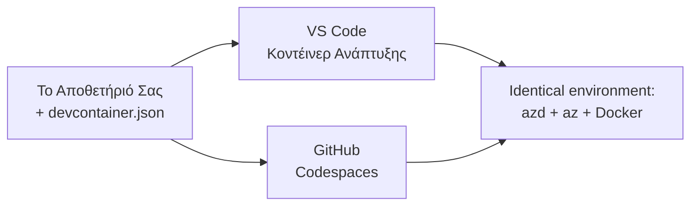

# Dev Containers & GitHub Codespaces για το azd

**Πλοήγηση Κεφαλαίων:**
- **📚 Αρχική Μαθήματος**: [AZD Για Αρχάριους](../../README.md)
- **📖 Τρέχον Κεφάλαιο**: Κεφάλαιο 1 - Βάση & Γρήγορη Εκκίνηση
- **⬅️ Προηγούμενο**: [Φέρτε Τη Δική Σας Εφαρμογή](bring-your-own-app.md)
- **🚀 Επόμενο Κεφάλαιο**: [Κεφάλαιο 2: Ανάπτυξη με AI-First](../chapter-02-ai-development/README.md)

> Επικυρωμένο με `azd 1.27.1` τον Ιούλιο του 2026.

## Εισαγωγή

Η εγκατάσταση του azd, του κατάλληλου περιβάλλοντος εκτέλεσης γλώσσας, του Docker και του Azure CLI σε κάθε μηχανή είναι μια διαδικασία χρονοβόρα—και είναι ο κύριος λόγος που ένα tutorial που "λειτουργεί στον υπολογιστή μου" αποτυγχάνει για κάποιον άλλον. Ένα **dev container** λύνει αυτό το πρόβλημα περιγράφοντας όλη την αλυσίδα εργαλείων σου σε ένα αρχείο. Οποιοσδήποτε ανοίγει το έργο στο VS Code ή στα GitHub Codespaces έχει ακριβώς το ίδιο περιβάλλον, με το azd ήδη εγκατεστημένο. Αυτό το μάθημα σου δείχνει πώς να προσθέσεις ένα.

## Στόχοι Μάθησης

Μέχρι το τέλος αυτού του μαθήματος, θα:
- Κατανοείς τι είναι ένα dev container και γιατί βοηθά με το azd
- Προσθέσεις ένα ελάχιστο `.devcontainer/devcontainer.json` σε ένα έργο
- Περιλαμβάνεις το azd, το Azure CLI και το Docker μέσω *features* Dev Container
- Ανοίγεις το έργο στα GitHub Codespaces ή στο VS Code

## Αποτελέσματα Μάθησης

Μετά την ολοκλήρωση αυτού του μαθήματος, θα είσαι σε θέση να:
- Δημιουργήσεις ένα `devcontainer.json` για ένα έργο azd
- Προσθέσεις το azd και εργαλεία Azure χωρίς χειροκίνητες εγκαταστάσεις
- Τρέχεις την εντολή `azd up` μέσα από ένα container ή Codespace

---

## Τι Είναι Ένα Dev Container;

Ένα dev container είναι ένα περιβάλλον ανάπτυξης βασισμένο στο Docker που ορίζεται από ένα αρχείο `.devcontainer/devcontainer.json` στο αποθετήριό σου. Όταν ανοίγεις το έργο:

- Το **VS Code** (με την επέκταση Dev Containers) δημιουργεί το container και συνδέεται σε αυτό.
- Το **GitHub Codespaces** δημιουργεί το ίδιο container στο cloud και σου παρέχει έναν επεξεργαστή που βασίζεται στον browser.

Κάθε συνεισφέρων έχει τα ίδια εργαλεία—χωρίς ταλαιπωρία "έβαλες το azd;";



---

## Βήμα 1: Δημιουργία του αρχείου devcontainer

Δημιουργήστε το `.devcontainer/devcontainer.json` στον ριζικό φάκελο του έργου σας:

```json
{
  "name": "azd-project",
  "image": "mcr.microsoft.com/devcontainers/base:bookworm",
  "features": {
    "ghcr.io/devcontainers/features/azure-cli:1": {},
    "ghcr.io/azure/azure-dev/azd:latest": {},
    "ghcr.io/devcontainers/features/docker-in-docker:2": {},
    "ghcr.io/devcontainers/features/node:1": {}
  },
  "customizations": {
    "vscode": {
      "extensions": [
        "ms-azuretools.azure-dev",
        "ms-azuretools.vscode-bicep"
      ]
    }
  },
  "forwardPorts": [3000],
  "postCreateCommand": "azd version"
}
```

Τι κάνει το κάθε μέρος:

| Κλειδί | Σκοπός |
|-----|---------|
| `image` | Το βασικό λειτουργικό σύστημα για το container |
| `features` | Προκατασκευασμένοι εγκαταστάτες—εδώ: Azure CLI, **azd**, Docker και Node.js |
| `customizations.vscode.extensions` | Αυτόματη εγκατάσταση των επεκτάσεων azd και Bicep για VS Code |
| `forwardPorts` | Ανοίγει τη θύρα της εφαρμογής σας στον browser |
| `postCreateCommand` | Εκτελείται μία φορά μετά τη δημιουργία του container (εδώ, ένας έλεγχος ορθότητας) |

> Η δυνατότητα `ghcr.io/azure/azure-dev/azd:latest` είναι ο επίσημος τρόπος να πάρεις το azd σε ένα container. Καθορίστε μια συγκεκριμένη έκδοση (για παράδειγμα `azd:1.27.1`) αν χρειάζεστε αναπαραγωγιμότητα.

---

## Βήμα 2: Αντιστοίχιση του Feature με τη Γλώσσα της Εφαρμογής

Αντικαταστήστε το feature `node` με όποια γλώσσα χρησιμοποιεί η εφαρμογή σας:

```jsonc
// Python project
"ghcr.io/devcontainers/features/python:1": {},

// .NET project
"ghcr.io/devcontainers/features/dotnet:2": {},

// Java project
"ghcr.io/devcontainers/features/java:1": {},

// Go project
"ghcr.io/devcontainers/features/go:1": {}
```

Κρατήστε το `docker-in-docker` αν το `host` σας είναι `containerapp`, `aks`, ή οτιδήποτε δημιουργεί εικόνα container—το azd χρειάζεται το Docker για να χτίζει και να στέλνει εικόνες.

---

## Βήμα 3: Άνοιγμα

**Στο VS Code:**
1. Εγκαταστήστε την επέκταση **Dev Containers**.
2. Ανοίξτε το φάκελο του έργου.
3. Κάντε κλικ στο **Reopen in Container** όταν ζητηθεί (ή τρέξτε *Dev Containers: Reopen in Container*).

**Στα GitHub Codespaces:**
1. Συγχρονίστε το αποθετήριο στο GitHub.
2. Κάντε κλικ στο **Code → Codespaces → Create codespace on main**.
3. Περιμένετε τη δημιουργία του container—το azd είναι έτοιμο στο τερματικό.

---

## Βήμα 4: Ανάπτυξη Από Μέσα Το Container

Το container έχει το azd προεγκατεστημένο, οπότε η κανονική ροή εργασίας λειτουργεί αμέσως:

```bash
azd auth login --use-device-code   # ο κώδικας συσκευής είναι βολικός μέσα στα Codespaces
azd up
```

> **Γιατί `--use-device-code`;** Σε ένα απομακρυσμένο container ή Codespace δεν υπάρχει τοπικός browser για ανακατεύθυνση, οπότε το login με device-code είναι ο αξιόπιστος τρόπος. Θα επικολλήσεις έναν κωδικό σε μια καρτέλα browser για να ολοκληρώσεις την είσοδο.

---

## Συνηθισμένα Σφάλματα

| Σφάλμα | Διόρθωση |
|---------|-----|
| Δεν μπορεί να χτίσει εικόνα το `azd up` | Πρόσθεσε το feature `docker-in-docker` |
| Το login στο browser κολλάει στα Codespaces | Χρησιμοποίησε `azd auth login --use-device-code` |
| Διαφορά εργαλείων μεταξύ μελών ομάδας | Καθόρισε εκδόσεις features (π.χ. `azd:1.27.1`) |
| Η εφαρμογή δεν είναι προσβάσιμη στον browser | Πρόσθεσε τη θύρα στα `forwardPorts` |

---

## Περίληψη

- Ένα dev container καθιστά την αλυσίδα εργαλείων azd αναπαραγώγιμη για όλους.
- Πρόσθεσε το azd, το Azure CLI και το Docker μέσω *features* Dev Container.
- Αντιστοίχισε το feature της γλώσσας στην εφαρμογή σου και κράτησε το `docker-in-docker` για hosts container.
- Χρησιμοποίησε είσοδο με device-code όταν τρέχεις μέσα σε Codespaces.

---

## 🔗 Πλοήγηση

| Κατεύθυνση | Πόρος |
|-----------|----------|
| **Προηγούμενο** | [Φέρτε Τη Δική Σας Εφαρμογή](bring-your-own-app.md) |
| **Αρχική Κεφαλαίου** | [Κεφάλαιο 1: Βάση & Γρήγορη Εκκίνηση](README.md) |
| **Επόμενο Κεφάλαιο** | [Κεφάλαιο 2: Ανάπτυξη με AI-First](../chapter-02-ai-development/README.md) |

## 📖 Σχετικοί Πόροι

- [Εγκατάσταση & Ρύθμιση](installation.md)
- [Φύλλο Απάτης Εντολών](../../resources/cheat-sheet.md)
- [Επίσημη Προδιαγραφή Dev Containers](https://containers.dev/)
- [Δυνατότητα Dev Container για το azd](https://github.com/Azure/azure-dev/tree/main/ext/devcontainer)

---

<!-- CO-OP TRANSLATOR DISCLAIMER START -->
**Αποποίηση ευθυνών**:
Αυτό το έγγραφο έχει μεταφραστεί χρησιμοποιώντας την υπηρεσία μετάφρασης με τεχνητή νοημοσύνη [Co-op Translator](https://github.com/Azure/co-op-translator). Ενώ επιδιώκουμε την ακρίβεια, παρακαλούμε να έχετε υπόψη ότι οι αυτοματοποιημένες μεταφράσεις ενδέχεται να περιέχουν λάθη ή ανακρίβειες. Το πρωτότυπο έγγραφο στη μητρική του γλώσσα πρέπει να θεωρείται η αυθεντική πηγή. Για κρίσιμες πληροφορίες, συνιστάται επαγγελματική ανθρώπινη μετάφραση. Δεν φέρουμε ευθύνη για τυχόν παρεξηγήσεις ή λανθασμένες ερμηνείες που προκύπτουν από τη χρήση αυτής της μετάφρασης.
<!-- CO-OP TRANSLATOR DISCLAIMER END -->