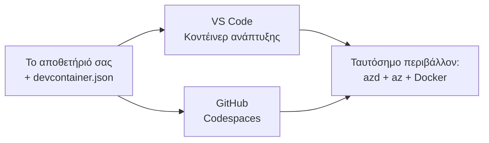

# Dev Containers & GitHub Codespaces για azd

**Chapter Navigation:**
- **📚 Αρχική Μαθήματος**: [AZD Για Αρχάριους](../../README.md)
- **📖 Τρέχον Κεφάλαιο**: Κεφάλαιο 1 - Βάση & Γρήγορη Εκκίνηση
- **⬅️ Προηγούμενο**: [Φέρε Την Δική Σου Εφαρμογή](bring-your-own-app.md)
- **🚀 Next Chapter**: [Κεφάλαιο 2: Ανάπτυξη με Προτεραιότητα AI](../chapter-02-ai-development/README.md)

> Ελεγχμένο με `azd 1.25.6` τον Ιούνιο 2026.

## Εισαγωγή

Η εγκατάσταση του azd, του σωστού runtime γλώσσας, του Docker και του Azure CLI σε κάθε μηχάνημα είναι μπελάς—και είναι ο κύριος λόγος που ένα tutorial που "δουλεύει στον υπολογιστή μου" αποτυγχάνει για κάποιον άλλο. Ένας **dev container** λύνει αυτό το πρόβλημα περιγράφοντας όλη την αλυσίδα εργαλείων σας σε ένα αρχείο. Οποιοσδήποτε ανοίξει το έργο στο VS Code ή στα GitHub Codespaces παίρνει ακριβώς το ίδιο περιβάλλον, με το azd ήδη εγκατεστημένο. Αυτό το μάθημα σας δείχνει πώς να προσθέσετε ένα.

## Στόχοι Μάθησης

Στο τέλος αυτού του μαθήματος θα:
- Κατανοείτε τι είναι ένα dev container και γιατί βοηθάει με το azd
- Προσθέσετε ένα ελάχιστο `.devcontainer/devcontainer.json` σε ένα έργο
- Συμπεριλάβετε azd, το Azure CLI και Docker μέσω των *χαρακτηριστικών* Dev Container
- Ανοίξετε το έργο σε GitHub Codespaces ή VS Code

## Αποτελέσματα Μάθησης

Μετά την ολοκλήρωση αυτού του μαθήματος, θα μπορείτε να:
- Συντάξετε ένα `devcontainer.json` για ένα έργο azd
- Προσθέσετε το azd και εργαλεία Azure χωρίς χειροκίνητες εγκαταστάσεις
- Εκτελέσετε `azd up` από μέσα σε ένα κοντέινερ ή Codespace

---

## Τι είναι ένα dev container;

Ένας dev container είναι ένα περιβάλλον ανάπτυξης βασισμένο σε Docker που ορίζεται από ένα αρχείο `.devcontainer/devcontainer.json` στο αποθετήριό σας. Όταν ανοίγετε το έργο:

- **VS Code** (με την επέκταση Dev Containers) κατασκευάζει το κοντέινερ και συνηθίζει σε αυτό.
- **GitHub Codespaces** κατασκευάζει το ίδιο κοντέινερ στο cloud και σας δίνει έναν επεξεργαστή στη βάση του προγράμματος περιήγησης.

Έτσι, κάθε συνεισφέρων παίρνει ίδια εργαλεία—χωρίς το πρόβλημα "έχεις εγκαταστήσει το azd;".



---

## Βήμα 1: Δημιουργήστε το αρχείο devcontainer

Δημιουργήστε `.devcontainer/devcontainer.json` στη ρίζα του έργου σας:

```json
{
  "name": "azd-project",
  "image": "mcr.microsoft.com/devcontainers/base:bookworm",
  "features": {
    "ghcr.io/devcontainers/features/azure-cli:1": {},
    "ghcr.io/azure/azure-dev/azd:latest": {},
    "ghcr.io/devcontainers/features/docker-in-docker:2": {},
    "ghcr.io/devcontainers/features/node:1": {}
  },
  "customizations": {
    "vscode": {
      "extensions": [
        "ms-azuretools.azure-dev",
        "ms-azuretools.vscode-bicep"
      ]
    }
  },
  "forwardPorts": [3000],
  "postCreateCommand": "azd version"
}
```

Τι κάνει κάθε μέρος:

| Κλειδί | Σκοπός |
|-----|---------|
| `image` | Το βασικό λειτουργικό σύστημα για το κοντέινερ |
| `features` | Προκατασκευασμένοι εγκαταστάτες—εδώ: Azure CLI, **azd**, Docker και Node.js |
| `customizations.vscode.extensions` | Εγκαθιστά αυτόματα τις επεκτάσεις azd και Bicep για το VS Code |
| `forwardPorts` | Εκθέτει τη θύρα της εφαρμογής σας στο πρόγραμμα περιήγησης |
| `postCreateCommand` | Εκτελείται μία φορά μετά τη δημιουργία του κοντέινερ (εδώ, ένας έλεγχος ορθότητας) |

> Η λειτουργία `ghcr.io/azure/azure-dev/azd:latest` είναι ο επίσημος τρόπος για να έχετε το azd μέσα σε κοντέινερ. Κλειδώστε μια συγκεκριμένη έκδοση (για παράδειγμα `azd:1.25.6`) αν χρειάζεστε αναπαραγωγιμότητα.

---

## Βήμα 2: Αντιστοιχίστε τη λειτουργία στη γλώσσα της εφαρμογής σας

Αντικαταστήστε τη λειτουργία `node` με ό,τι χρησιμοποιεί η εφαρμογή σας:

```jsonc
// Python project
"ghcr.io/devcontainers/features/python:1": {},

// .NET project
"ghcr.io/devcontainers/features/dotnet:2": {},

// Java project
"ghcr.io/devcontainers/features/java:1": {},

// Go project
"ghcr.io/devcontainers/features/go:1": {}
```

Κρατήστε το `docker-in-docker` εάν ο `host` σας είναι `containerapp`, `aks`, ή οτιδήποτε που κατασκευάζει μια εικόνα κοντέινερ—το azd χρειάζεται Docker για να χτίσει και να προωθήσει εικόνες.

---

## Βήμα 3: Άνοιγμα

**Στο VS Code:**
1. Εγκαταστήστε την επέκταση **Dev Containers**.
2. Ανοίξτε τον φάκελο του έργου.
3. Κάντε κλικ **Reopen in Container** όταν σας ζητηθεί (ή εκτελέστε *Dev Containers: Reopen in Container*).

**Στα GitHub Codespaces:**
1. Ανεβάστε το repo στο GitHub.
2. Κάντε κλικ **Code → Codespaces → Create codespace on main**.
3. Περιμένετε να χτιστεί το κοντέινερ—το azd θα είναι έτοιμο στο τερματικό.

---

## Βήμα 4: Ανάπτυξη από μέσα στο κοντέινερ

Το κοντέινερ έχει το azd προ-εγκατεστημένο, οπότε η κανονική ροή εργασίας λειτουργεί απευθείας:

```bash
azd auth login --use-device-code   # ο κωδικός συσκευής είναι βολικός μέσα στα Codespaces
azd up
```

> **Γιατί `--use-device-code`;** Σε ένα απομακρυσμένο κοντέινερ ή Codespace δεν υπάρχει τοπικό πρόγραμμα περιήγησης για ανακατεύθυνση, οπότε η σύνδεση με device-code είναι η αξιόπιστη λύση. Θα επικολλήσετε έναν κωδικό σε μια καρτέλα προγράμματος περιήγησης για να ολοκληρώσετε την είσοδο.

---

## Συνήθη Σφάλματα

| Πρόβλημα | Διόρθωση |
|---------|-----|
| `azd up` can't build an image | Προσθέστε τη λειτουργία `docker-in-docker` |
| Browser login hangs in Codespaces | Χρησιμοποιήστε `azd auth login --use-device-code` |
| Tools differ between teammates | Κλειδώστε τις εκδόσεις των λειτουργιών (π.χ. `azd:1.25.6`) |
| App not reachable in browser | Προσθέστε τη θύρα στο `forwardPorts` |

---

## Περίληψη

- Ένας dev container κάνει την αλυσίδα εργαλείων azd αναπαραγώγιμη για όλους.
- Προσθέστε το azd, το Azure CLI και το Docker μέσω των *χαρακτηριστικών* Dev Container.
- Αντιστοιχίστε τη γλωσσική λειτουργία στην εφαρμογή σας και κρατήστε το `docker-in-docker` για hosts κοντέινερ.
- Χρησιμοποιήστε είσοδο με device-code όταν τρέχετε μέσα σε Codespaces.

---

## 🔗 Πλοήγηση

| Κατεύθυνση | Πόρος |
|-----------|----------|
| **Προηγούμενο** | [Φέρε Την Δική Σου Εφαρμογή](bring-your-own-app.md) |
| **Chapter Home** | [Κεφάλαιο 1: Βάση & Γρήγορη Εκκίνηση](README.md) |
| **Next Chapter** | [Κεφάλαιο 2: Ανάπτυξη με Προτεραιότητα AI](../chapter-02-ai-development/README.md) |

## 📖 Σχετικοί Πόροι

- [Εγκατάσταση & Ρύθμιση](installation.md)
- [Συντομεύσεις Εντολών](../../resources/cheat-sheet.md)
- [Επίσημη προδιαγραφή Dev Containers](https://containers.dev/)
- [Λειτουργία Dev Container του azd](https://github.com/Azure/azure-dev/tree/main/ext/devcontainer)

---

<!-- CO-OP TRANSLATOR DISCLAIMER START -->
**Αποποίηση ευθυνών**:
Αυτό το έγγραφο έχει μεταφραστεί χρησιμοποιώντας την υπηρεσία μετάφρασης με τεχνητή νοημοσύνη [Co-op Translator](https://github.com/Azure/co-op-translator). Ενώ επιδιώκουμε την ακρίβεια, παρακαλούμε να έχετε υπόψη ότι οι αυτοματοποιημένες μεταφράσεις ενδέχεται να περιέχουν λάθη ή ανακρίβειες. Το πρωτότυπο έγγραφο στη μητρική του γλώσσα πρέπει να θεωρείται η αυθεντική πηγή. Για κρίσιμες πληροφορίες, συνιστάται επαγγελματική ανθρώπινη μετάφραση. Δεν φέρουμε ευθύνη για τυχόν παρεξηγήσεις ή λανθασμένες ερμηνείες που προκύπτουν από τη χρήση αυτής της μετάφρασης.
<!-- CO-OP TRANSLATOR DISCLAIMER END -->