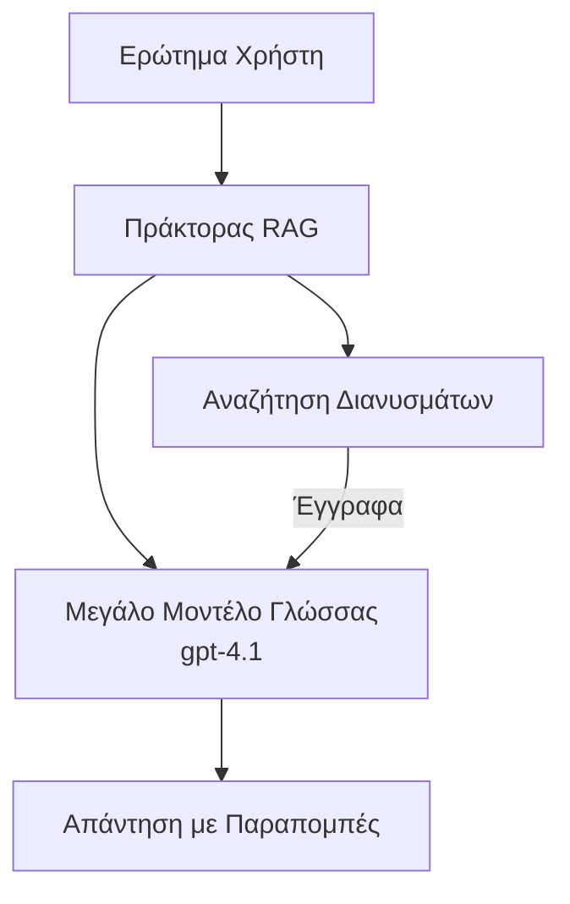
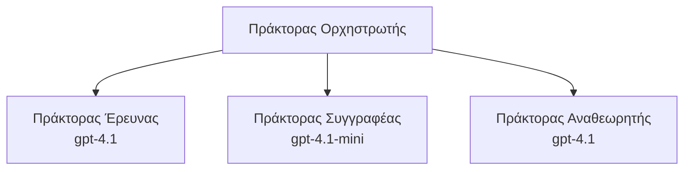

# Πράκτορες Τεχνητής Νοημοσύνης με το Azure Developer CLI

**Πλοήγηση Κεφαλαίου:**
- **📚 Αρχική Μαθήματος**: [AZD Για Αρχάριους](../../README.md)
- **📖 Τρέχον Κεφάλαιο**: Κεφάλαιο 2 - AI-First Development
- **⬅️ Προηγούμενο**: [Ενσωμάτωση Microsoft Foundry](microsoft-foundry-integration.md)
- **➡️ Επόμενο**: [Ανάπτυξη Μοντέλου AI](ai-model-deployment.md)
- **🚀 Για Προχωρημένους**: [Λύσεις Πολλαπλών Πρακτόρων](../../examples/retail-scenario.md)

---

## Εισαγωγή

Οι πράκτορες AI είναι αυτόνομα προγράμματα που μπορούν να αντιληφθούν το περιβάλλον τους, να λαμβάνουν αποφάσεις και να εκτελούν ενέργειες για να επιτύχουν συγκεκριμένους στόχους. Σε αντίθεση με απλά chatbots που απαντούν σε προτροπές, οι πράκτορες μπορούν:

- **Να χρησιμοποιούν εργαλεία** - Κλήση APIs, αναζήτηση σε βάσεις δεδομένων, εκτέλεση κώδικα
- **Να σχεδιάζουν και να αιτιολογούν** - Διασπούν σύνθετες εργασίες σε βήματα
- **Να μαθαίνουν από το περιεχόμενο** - Διατηρούν μνήμη και προσαρμόζουν συμπεριφορά
- **Να συνεργάζονται** - Να εργάζονται με άλλους πράκτορες (συστήματα πολλαπλών πρακτόρων)

Αυτός ο οδηγός σας δείχνει πώς να αναπτύξετε πράκτορες AI στο Azure χρησιμοποιώντας το Azure Developer CLI (azd).

## Στόχοι Μάθησης

Με την ολοκλήρωση αυτού του οδηγού, θα:
- Κατανοήσετε τι είναι οι πράκτορες AI και πώς διαφέρουν από τα chatbots
- Αναπτύξετε προκατασκευασμένα πρότυπα πρακτόρων AI χρησιμοποιώντας το AZD
- Διαμορφώσετε Foundry Agents για προσαρμοσμένους πράκτορες
- Υλοποιήσετε βασικά μοτίβα πρακτόρων (χρήση εργαλείων, RAG, πολλαπλοί πράκτορες)
- Παρακολουθήσετε και αποσφαλματώσετε αναπτυγμένους πράκτορες

## Αποτελέσματα Μάθησης

Μετά την ολοκλήρωση, θα μπορείτε να:
- Αναπτύξετε εφαρμογές πρακτόρων AI στο Azure με μία εντολή
- Διαμορφώσετε εργαλεία και δυνατότητες των πρακτόρων
- Υλοποιήσετε retrieval-augmented generation (RAG) με πρακτόρες
- Σχεδιάσετε αρχιτεκτονικές πολλαπλών πρακτόρων για σύνθετες ροές εργασίας
- Εντοπίζετε και να επιλύετε συνηθισμένα προβλήματα ανάπτυξης πρακτόρων

---

## 🤖 Τι Κάνει Έναν Πράκτορα Διαφορετικό από ένα Chatbot;

| Χαρακτηριστικό | Chatbot | Πράκτορας AI |
|---------|---------|----------|
| **Συμπεριφορά** | Απαντά σε προτροπές | Αναλαμβάνει αυτόνομες ενέργειες |
| **Εργαλεία** | Κανένα | Μπορεί να καλεί APIs, να αναζητά, να εκτελεί κώδικα |
| **Μνήμη** | Μόνο συνεδρίας | Επίμονη μνήμη ανά συνεδρίες |
| **Σχεδιασμός** | Μία απάντηση | Πολυβηματική λογική |
| **Συνεργασία** | Μονάδα | Μπορεί να δουλεύει με άλλους πράκτορες |

### Απλή Αναλογία

- **Chatbot** = Ένα εξυπηρετικό άτομο που απαντά σε ερωτήσεις σε ένα πληροφοριακό γραφείο
- **Πράκτορας AI** = Ένας προσωπικός βοηθός που μπορεί να κάνει κλήσεις, να κλείνει ραντεβού και να ολοκληρώνει εργασίες για εσάς

---

## 🚀 Γρήγορη Εκκίνηση: Αναπτύξτε τον Πρώτο σας Πράκτορα

### Επιλογή 1: Πρότυπο Foundry Agents (Συνιστάται)

```bash
# Αρχικοποιήστε το πρότυπο πρακτόρων τεχνητής νοημοσύνης
azd init --template get-started-with-ai-agents

# Αναπτύξτε στο Azure
azd up
```

**Τι αναπτύσσεται:**
- ✅ Foundry Agents
- ✅ Microsoft Foundry Models (gpt-4.1)
- ✅ Azure AI Search (για RAG)
- ✅ Azure Container Apps (διεπαφή web)
- ✅ Application Insights (παρακολούθηση)

**Χρόνος:** ~15-20 λεπτά
**Κόστος:** ~$100-150/month (development)

### Επιλογή 2: Πράκτορας OpenAI με Prompty

```bash
# Αρχικοποιήστε το πρότυπο πράκτορα που βασίζεται στο Prompty
azd init --template agent-openai-python-prompty

# Αναπτύξτε στο Azure
azd up
```

**Τι αναπτύσσεται:**
- ✅ Azure Functions (serverless εκτέλεση πράκτορα)
- ✅ Microsoft Foundry Models
- ✅ Αρχεία ρύθμισης Prompty
- ✅ Δείγμα υλοποίησης πράκτορα

**Χρόνος:** ~10-15 λεπτά
**Κόστος:** ~$50-100/month (development)

### Επιλογή 3: RAG Chat Agent

```bash
# Αρχικοποίηση προτύπου συνομιλίας RAG
azd init --template azure-search-openai-demo

# Ανάπτυξη στο Azure
azd up
```

**Τι αναπτύσσεται:**
- ✅ Microsoft Foundry Models
- ✅ Azure AI Search με δείγμα δεδομένων
- ✅ Σωλήνας επεξεργασίας εγγράφων
- ✅ Διεπαφή συνομιλίας με παραπομπές

**Χρόνος:** ~15-25 λεπτά
**Κόστος:** ~$80-150/month (development)

### Επιλογή 4: AZD AI Agent Init (Βασισμένο σε Manifest)

Αν έχετε ένα αρχείο manifest πράκτορα, μπορείτε να χρησιμοποιήσετε την εντολή `azd ai` για να δημιουργήσετε ένα project Foundry Agent Service απευθείας:

```bash
# Εγκαταστήστε την επέκταση για πράκτορες τεχνητής νοημοσύνης
azd extension install azure.ai.agents

# Αρχικοποιήστε από το manifest ενός πράκτορα
azd ai agent init -m agent-manifest.yaml

# Αναπτύξτε στο Azure
azd up
```

**Πότε να χρησιμοποιήσετε `azd ai agent init` vs `azd init --template`:**

| Προσέγγιση | Καλύτερο για | Πώς λειτουργεί |
|----------|----------|------|
| `azd init --template` | Ξεκινώντας από ένα λειτουργικό παράδειγμα εφαρμογής | Κλωνοποιεί ένα πλήρες αποθετήριο προτύπου με κώδικα + υποδομή |
| `azd ai agent init -m` | Οικοδόμηση από το δικό σας manifest πράκτορα | Σκαλετοποιεί τη δομή του έργου από τον ορισμό του πράκτορα σας |

> **Συμβουλή:** Χρησιμοποιήστε `azd init --template` όταν μαθαίνετε (Επιλογές 1-3 παραπάνω). Χρησιμοποιήστε `azd ai agent init` όταν κατασκευάζετε παραγωγικούς πράκτορες με τα δικά σας manifests. Δείτε [Εντολές CLI AZD AI](../chapter-08-production/production-ai-practices.md#azd-ai-cli-commands-and-extensions) για πλήρη αναφορά.

---

## 🏗️ Πρότυπα Αρχιτεκτονικής Πρακτόρων

### Πρότυπο 1: Μονός Πράκτορας με Εργαλεία

Το πιο απλό μοτίβο πράκτορα - ένας πράκτορας που μπορεί να χρησιμοποιεί πολλαπλά εργαλεία.


**Καλύτερο για:**
- Bots υποστήριξης πελατών
- Βοηθούς έρευνας
- Πράκτορες ανάλυσης δεδομένων

**AZD Πρότυπο:** `azure-search-openai-demo`

### Πρότυπο 2: RAG Πράκτορας (Retrieval-Augmented Generation)

Ένας πράκτορας που ανακτά σχετικά έγγραφα πριν δημιουργήσει απαντήσεις.


**Καλύτερο για:**
- Επιχειρησιακές βάσεις γνώσεων
- Συστήματα ερωταπαντήσεων εγγράφων
- Έρευνα συμμόρφωσης και νομική έρευνα

**AZD Πρότυπο:** `azure-search-openai-demo`

### Πρότυπο 3: Σύστημα Πολλαπλών Πρακτόρων

Πολλοί εξειδικευμένοι πράκτορες που συνεργάζονται για σύνθετες εργασίες.


**Καλύτερο για:**
- Σύνθετη δημιουργία περιεχομένου
- Πολυβηματικές ροές εργασίας
- Εργασίες που απαιτούν διαφορετική εξειδίκευση

**Μάθετε Περισσότερα:** [Πρότυπα Συντονισμού Πολλαπλών Πρακτόρων](../chapter-06-pre-deployment/coordination-patterns.md)

---

## ⚙️ Διαμόρφωση Εργαλείων Πρακτόρα

Οι πράκτορες γίνονται ισχυροί όταν μπορούν να χρησιμοποιούν εργαλεία. Εδώ είναι πώς να διαμορφώσετε κοινά εργαλεία:

### Διαμόρφωση Εργαλείων σε Foundry Agents

```python
# agent_config.py
from azure.ai.projects import AIProjectClient
from azure.ai.projects.models import FunctionTool, CodeInterpreterTool

# Ορίστε προσαρμοσμένα εργαλεία
search_tool = FunctionTool(
    name="search_knowledge_base",
    description="Search the company knowledge base for relevant documents",
    parameters={
        "type": "object",
        "properties": {
            "query": {
                "type": "string",
                "description": "The search query"
            }
        },
        "required": ["query"]
    }
)

# Δημιουργήστε πράκτορα με τα εργαλεία
agent = project_client.agents.create_agent(
    model="gpt-4.1",
    name="Support Agent",
    instructions="You are a helpful support agent. Use the search tool to find relevant information.",
    tools=[search_tool, CodeInterpreterTool()]
)
```

### Διαμόρφωση Περιβάλλοντος

```bash
# Ρύθμιση μεταβλητών περιβάλλοντος ειδικών για τον πράκτορα
azd env set AZURE_OPENAI_MODEL "gpt-4.1"
azd env set AGENT_INSTRUCTIONS "You are a helpful assistant..."
azd env set ENABLE_CODE_INTERPRETER "true"
azd env set ENABLE_FILE_SEARCH "true"

# Αναπτύξτε με την ενημερωμένη διαμόρφωση
azd deploy
```

---

## 📊 Παρακολούθηση Πρακτόρων

### Ενσωμάτωση Application Insights

Όλα τα πρότυπα πράκτορα AZD περιλαμβάνουν το Application Insights για παρακολούθηση:

```bash
# Άνοιγμα πίνακα ελέγχου παρακολούθησης
azd monitor --overview

# Προβολή ζωντανών αρχείων καταγραφής
azd monitor --logs

# Προβολή ζωντανών μετρήσεων
azd monitor --live
```

### Κύρια Μετρικά για Παρακολούθηση

| Μετρική | Περιγραφή | Στόχος |
|--------|-------------|--------|
| Response Latency | Χρόνος για δημιουργία απάντησης | < 5 seconds |
| Token Usage | Tokens ανά αίτημα | Παρακολουθήστε για κόστος |
| Tool Call Success Rate | % επιτυχημένων εκτελέσεων εργαλείων | > 95% |
| Error Rate | Ανεπιτυχείς αιτήσεις πράκτορα | < 1% |
| User Satisfaction | Βαθμολογίες ανάδρασης | > 4.0/5.0 |

### Προσαρμοσμένη Καταγραφή για Πράκτορες

```python
import os
from azure.monitor.opentelemetry import configure_azure_monitor
from opentelemetry import trace

# Ρυθμίστε το Azure Monitor με OpenTelemetry
configure_azure_monitor(
    connection_string=os.environ["APPLICATIONINSIGHTS_CONNECTION_STRING"]
)

tracer = trace.get_tracer(__name__)

def log_agent_interaction(user_query, agent_response, tools_used, latency_ms):
    with tracer.start_as_current_span("agent_interaction") as span:
        span.set_attributes({
            "user_query": user_query,
            "response_length": len(agent_response),
            "tools_used": tools_used,
            "latency_ms": latency_ms
        })
```

> **Σημείωση:** Εγκαταστήστε τα απαιτούμενα πακέτα: `pip install azure-monitor-opentelemetry opentelemetry`

---

## 💰 Παράγοντες Κόστους

### Εκτιμώμενα Μηνιαία Κόστη ανά Πρότυπο

| Πρότυπο | Περιβάλλον Ανάπτυξης | Παραγωγή |
|---------|-----------------|------------|
| Single Agent | $50-100 | $200-500 |
| RAG Agent | $80-150 | $300-800 |
| Multi-Agent (2-3 agents) | $150-300 | $500-1,500 |
| Enterprise Multi-Agent | $300-500 | $1,500-5,000+ |

### Συμβουλές Βελτιστοποίησης Κόστους

1. **Χρησιμοποιήστε gpt-4.1-mini για απλές εργασίες**
   ```bash
   azd env set AZURE_OPENAI_MODEL "gpt-4.1-mini"
   ```

2. **Εφαρμόστε caching για επαναλαμβανόμενα ερωτήματα**
   ```python
   from functools import lru_cache
   
   @lru_cache(maxsize=1000)
   def get_cached_response(query_hash):
       return agent.run(query_hash)
   ```

3. **Ορίστε όρια token ανά εκτέλεση**
   ```python
   # Ορίστε το max_completion_tokens όταν εκτελείτε τον πράκτορα, όχι κατά τη δημιουργία
   run = project_client.agents.create_run(
       thread_id=thread.id,
       agent_id=agent.id,
       max_completion_tokens=1000  # Περιορίστε το μήκος της απάντησης
   )
   ```

4. **Κλιμακώστε σε μηδέν όταν δεν χρησιμοποιείται**
   ```bash
   # Οι Container Apps κλιμακώνονται αυτόματα σε μηδέν
   azd env set MIN_REPLICAS "0"
   ```

---

## 🔧 Αντιμετώπιση Προβλημάτων Πρακτόρων

### Συχνά Προβλήματα και Λύσεις

<details>
<summary><strong>❌ Ο πράκτορας δεν ανταποκρίνεται σε κλήσεις εργαλείων</strong></summary>

```bash
# Ελέγξτε αν τα εργαλεία έχουν καταχωριστεί σωστά
azd show

# Επιβεβαιώστε την ανάπτυξη του OpenAI
az cognitiveservices account deployment list \
  --name $AZURE_OPENAI_NAME \
  --resource-group $RG_NAME

# Ελέγξτε τα αρχεία καταγραφής του πράκτορα
azd monitor --logs
```

**Συνήθεις αιτίες:**
- Μη συμφωνία στο signature της συνάρτησης εργαλείου
- Έλλειψη απαραίτητων δικαιωμάτων
- Το endpoint του API δεν είναι προσβάσιμο
</details>

<details>
<summary><strong>❌ Υψηλή καθυστέρηση στις απαντήσεις του πράκτορα</strong></summary>

```bash
# Ελέγξτε το Application Insights για σημεία συμφόρησης
azd monitor --live

# Σκεφτείτε να χρησιμοποιήσετε ένα πιο γρήγορο μοντέλο
azd env set AZURE_OPENAI_MODEL "gpt-4.1-mini"
azd deploy
```

**Συμβουλές βελτιστοποίησης:**
- Χρησιμοποιήστε streaming απαντήσεις
- Εφαρμόστε caching απαντήσεων
- Μειώστε το μέγεθος του context window
</details>

<details>
<summary><strong>❌ Ο πράκτορας επιστρέφει λανθασμένες ή “hallucinated” πληροφορίες</strong></summary>

```python
# Βελτιώστε με καλύτερες υποδείξεις συστήματος
instructions = """
You are a helpful assistant. IMPORTANT:
- Only answer based on provided context
- If you don't know, say "I don't know"
- Always cite your sources
- Never make up information
"""

# Προσθέστε ανάκτηση για τεκμηρίωση
agent = project_client.agents.create_agent(
    model="gpt-4.1",
    instructions=instructions,
    tools=[FileSearchTool()]  # Βασίστε τις απαντήσεις σε έγγραφα
)
```
</details>

<details>
<summary><strong>❌ Σφάλματα υπέρβασης ορίου token</strong></summary>

```python
# Υλοποίηση διαχείρισης παραθύρου συμφραζομένων
def truncate_context(messages, max_tokens=8000, model="gpt-4.1"):
    """Keep only recent messages within token limit."""
    import tiktoken
    encoding = tiktoken.encoding_for_model(model)
    total_tokens = 0
    truncated = []
    
    for msg in reversed(messages):
        msg_tokens = len(encoding.encode(msg.content))
        if total_tokens + msg_tokens > max_tokens:
            break
        truncated.insert(0, msg)
        total_tokens += msg_tokens
    
    return truncated
```
</details>

---

## 🎓 Πρακτικές Ασκήσεις

### Άσκηση 1: Αναπτύξτε έναν Βασικό Πράκτορα (20 λεπτά)

**Στόχος:** Αναπτύξτε τον πρώτο σας πράκτορα AI χρησιμοποιώντας το AZD

```bash
# Βήμα 1: Αρχικοποίηση προτύπου
azd init --template get-started-with-ai-agents

# Βήμα 2: Σύνδεση στο Azure
azd auth login

# Βήμα 3: Ανάπτυξη
azd up

# Βήμα 4: Δοκιμάστε τον πράκτορα
# Αναμενόμενη έξοδος μετά την ανάπτυξη:
#   Η ανάπτυξη ολοκληρώθηκε!
#   Τελικό σημείο: https://<app-name>.<region>.azurecontainerapps.io
# Ανοίξτε το URL που εμφανίζεται στην έξοδο και δοκιμάστε να κάνετε μια ερώτηση

# Βήμα 5: Προβολή παρακολούθησης
azd monitor --overview

# Βήμα 6: Καθαρισμός
azd down --force --purge
```

**Κριτήρια Επιτυχίας:**
- [ ] Ο πράκτορας απαντά σε ερωτήσεις
- [ ] Μπορεί να έχει πρόσβαση στον πίνακα παρακολούθησης μέσω `azd monitor`
- [ ] Οι πόροι καθαρίζονται με επιτυχία

### Άσκηση 2: Προσθέστε ένα Προσαρμοσμένο Εργαλείο (30 λεπτά)

**Στόχος:** Επεκτείνετε έναν πράκτορα με ένα προσαρμοσμένο εργαλείο

1. Αναπτύξτε το πρότυπο πράκτορα:
   ```bash
   azd init --template get-started-with-ai-agents
   azd up
   ```
2. Δημιουργήστε μια νέα συνάρτηση εργαλείου στον κώδικα του πράκτορα σας:
   ```python
   def get_weather(location: str) -> str:
       """Get current weather for a location."""
       # Κλήση API στην υπηρεσία καιρού
       return f"Weather in {location}: Sunny, 72°F"
   ```
3. Καταχωρήστε το εργαλείο στον πράκτορα:
   ```python
   from azure.ai.projects.models import FunctionTool

   weather_tool = FunctionTool(
       name="get_weather",
       description="Get current weather for a location",
       parameters={
           "type": "object",
           "properties": {
               "location": {"type": "string", "description": "City name"}
           },
           "required": ["location"]
       }
   )

   agent = project_client.agents.create_agent(
       model="gpt-4.1",
       name="Weather Agent",
       tools=[weather_tool]
   )
   ```
4. Επανααναπτύξτε και δοκιμάστε:
   ```bash
   azd deploy
   # Ρώτησε: "Τι καιρό κάνει στο Σιάτλ;"
   # Αναμενόμενο: Ο πράκτορας καλεί get_weather("Seattle") και επιστρέφει πληροφορίες καιρού
   ```

**Κριτήρια Επιτυχίας:**
- [ ] Ο πράκτορας αναγνωρίζει ερωτήσεις σχετικά με τον καιρό
- [ ] Το εργαλείο καλείται σωστά
- [ ] Η απάντηση περιλαμβάνει πληροφορίες καιρού

### Άσκηση 3: Δημιουργήστε έναν RAG Πράκτορα (45 λεπτά)

**Στόχος:** Δημιουργήστε έναν πράκτορα που απαντά σε ερωτήσεις από τα έγγραφά σας

```bash
# Βήμα 1: Αναπτύξτε το πρότυπο RAG
azd init --template azure-search-openai-demo
azd up

# Βήμα 2: Μεταφορτώστε τα έγγραφά σας
# Τοποθετήστε αρχεία PDF/TXT στον κατάλογο data/, στη συνέχεια εκτελέστε:
python scripts/prepdocs.py

# Βήμα 3: Δοκιμάστε με ερωτήσεις ειδικές για τον τομέα
# Ανοίξτε το URL της web εφαρμογής από την έξοδο του azd up
# Κάντε ερωτήσεις σχετικά με τα μεταφορτωμένα έγγραφά σας
# Οι απαντήσεις πρέπει να περιλαμβάνουν παραπομπές όπως [doc.pdf]
```

**Κριτήρια Επιτυχίας:**
- [ ] Ο πράκτορας απαντά από ανεβασμένα έγγραφα
- [ ] Οι απαντήσεις περιλαμβάνουν παραπομπές
- [ ] Δεν υπάρχουν “hallucinations” σε ερωτήσεις εκτός πεδίου

---

## 📚 Επόμενα Βήματα

Τώρα που κατανοείτε τους πράκτορες AI, εξερευνήστε αυτά τα πιο προχωρημένα θέματα:

| Θέμα | Περιγραφή | Σύνδεσμος |
|-------|-------------|------|
| **Συστήματα Πολλαπλών Πρακτόρων** | Δημιουργήστε συστήματα με πολλούς συνεργαζόμενους πράκτορες | [Retail Multi-Agent Example](../../examples/retail-scenario.md) |
| **Πρότυπα Συντονισμού** | Μάθετε πρότυπα ορχήστρωσης και επικοινωνίας | [Coordination Patterns](../chapter-06-pre-deployment/coordination-patterns.md) |
| **Παραγωγική Ανάπτυξη** | Ανάπτυξη πρακτόρων έτοιμων για παραγωγή | [Production AI Practices](../chapter-08-production/production-ai-practices.md) |
| **Αξιολόγηση Πρακτόρα** | Δοκιμάστε και αξιολογήστε την απόδοση του πράκτορα | [AI Troubleshooting](../chapter-07-troubleshooting/ai-troubleshooting.md) |
| **Εργαστήριο AI** | Πρακτική: Κάντε τη λύση AI έτοιμη για AZD | [AI Workshop Lab](ai-workshop-lab.md) |

---

## 📖 Επιπλέον Πόροι

### Επίσημη Τεκμηρίωση
- [Azure AI Agent Service](https://learn.microsoft.com/azure/ai-services/agents/)
- [Azure AI Foundry Agent Service Quickstart](https://learn.microsoft.com/azure/ai-services/agents/quickstart)
- [Semantic Kernel Agent Framework](https://learn.microsoft.com/semantic-kernel/)

### Πρότυπα AZD για Πράκτορες
- [Ξεκινήστε με Πράκτορες AI](https://github.com/Azure-Samples/get-started-with-ai-agents)
- [Agent OpenAI Python Prompty](https://github.com/Azure-Samples/agent-openai-python-prompty)
- [Παράδειγμα Azure Search OpenAI](https://github.com/Azure-Samples/azure-search-openai-demo)

### Πόροι Κοινότητας
- [Awesome AZD - Πρότυπα Πρακτόρων](https://azure.github.io/awesome-azd/?tags=ai-agents)
- [Διακομιστής Discord Azure AI](https://discord.gg/microsoft-azure)
- [Διακομιστής Discord Microsoft Foundry](https://discord.gg/nTYy5BXMWG)

### Δεξιότητες Πρακτόρα για το Επεξεργαστή σας
- [**Δεξιότητες Πρακτόρα Microsoft Azure**](https://skills.sh/microsoft/github-copilot-for-azure) - Εγκαταστήστε επαναχρησιμοποιήσιμες δεξιότητες πρακτόρα AI για ανάπτυξη Azure στο GitHub Copilot, Cursor, ή οποιονδήποτε υποστηριζόμενο πράκτορα. Περιλαμβάνει δεξιότητες για [Azure AI](https://skills.sh/microsoft/github-copilot-for-azure/azure-ai), [Microsoft Foundry](https://skills.sh/microsoft/github-copilot-for-azure/microsoft-foundry), [deployment](https://skills.sh/microsoft/github-copilot-for-azure/azure-deploy), και [diagnostics](https://skills.sh/microsoft/github-copilot-for-azure/azure-diagnostics):
  ```bash
  npx skills add microsoft/github-copilot-for-azure
  ```

---

**Πλοήγηση**
- **Προηγούμενο Μάθημα**: [Ενσωμάτωση Microsoft Foundry](microsoft-foundry-integration.md)
- **Επόμενο Μάθημα**: [Ανάπτυξη Μοντέλου AI](ai-model-deployment.md)

---

<!-- CO-OP TRANSLATOR DISCLAIMER START -->
Αποποίηση ευθυνών:
Αυτό το έγγραφο έχει μεταφραστεί χρησιμοποιώντας την υπηρεσία μηχανικής μετάφρασης με τεχνητή νοημοσύνη [Co-op Translator](https://github.com/Azure/co-op-translator). Παρότι επιδιώκουμε την ακρίβεια, λάβετε υπόψη ότι οι αυτοματοποιημένες μεταφράσεις ενδέχεται να περιέχουν σφάλματα ή ανακρίβειες. Το πρωτότυπο έγγραφο στην μητρική του γλώσσα πρέπει να θεωρείται η έγκυρη/επίσημη πηγή. Για κρίσιμες πληροφορίες συνιστάται επαγγελματική μετάφραση από ανθρώπινο μεταφραστή. Δεν φέρουμε ευθύνη για τυχόν παρεξηγήσεις ή λανθασμένες ερμηνείες που προκύπτουν από τη χρήση αυτής της μετάφρασης.
<!-- CO-OP TRANSLATOR DISCLAIMER END -->