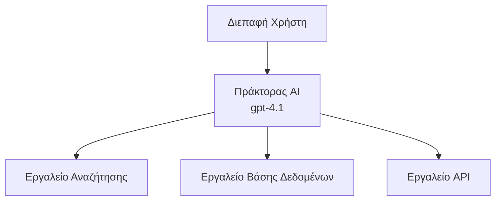
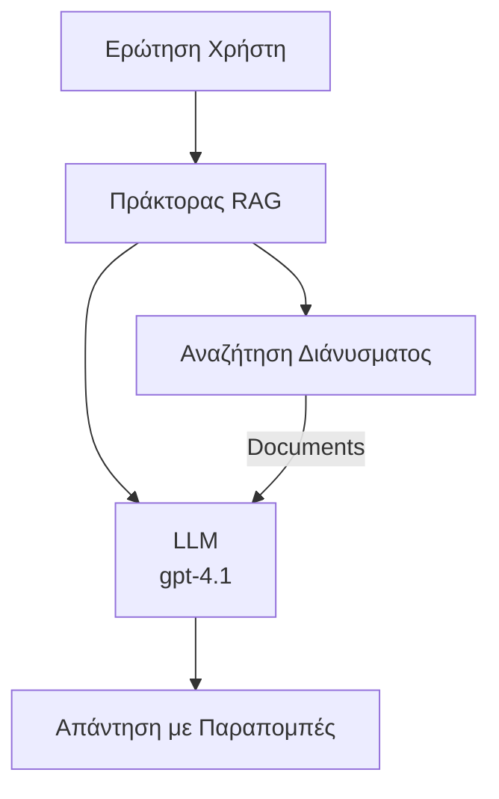
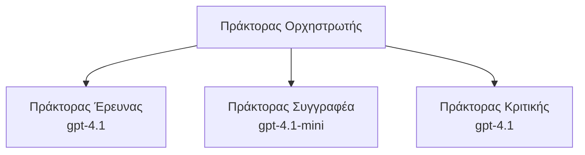

# Πράκτορες Τεχνητής Νοημοσύνης με το Azure Developer CLI

**Πλοήγηση Κεφαλαίου:**
- **📚 Αρχική Μαθήματος**: [AZD Για Αρχάριους](../../README.md)
- **📖 Τρέχον Κεφάλαιο**: Κεφάλαιο 2 - AI-Πρώτη Ανάπτυξη
- **⬅️ Προηγούμενο**: [Ενσωμάτωση Microsoft Foundry](microsoft-foundry-integration.md)
- **➡️ Επόμενο**: [Ανάπτυξη Μοντέλου AI](ai-model-deployment.md)
- **🚀 Προχωρημένο**: [Λύσεις Πολλαπλών Πρακτόρων](../../examples/retail-scenario.md)

---

## Εισαγωγή

Οι πράκτορες AI είναι αυτόνομα προγράμματα που μπορούν να αντιλαμβάνονται το περιβάλλον τους, να λαμβάνουν αποφάσεις και να αναλαμβάνουν δράσεις για την επίτευξη συγκεκριμένων στόχων. Σε αντίθεση με απλά chatbots που απαντούν σε προτροπές, οι πράκτορες μπορούν:

- **Χρησιμοποιούν εργαλεία** - Καλούν APIs, αναζητούν σε βάσεις δεδομένων, εκτελούν κώδικα
- **Σχεδιάζουν και αιτιολογούν** - Διασπούν πολύπλοκα καθήκοντα σε στάδια
- **Μαθαίνουν από το πλαίσιο** - Διατηρούν μνήμη και προσαρμόζουν τη συμπεριφορά
- **Συνεργάζονται** - Συνεργάζονται με άλλους πράκτορες (κατανεμημένα συστήματα πρακτόρων)

Αυτός ο οδηγός δείχνει πώς να αναπτύξετε πράκτορες AI στο Azure χρησιμοποιώντας το Azure Developer CLI (azd).

> **Σημείωση επικύρωσης (2026-07-13):** Αυτός ο οδηγός εξετάστηκε με την έκδοση `azd` `1.27.1` και `azure.ai.agents` `1.0.0-beta.5`. Η εμπειρία `azd ai` παραμένει υπό προεπισκόπηση, οπότε ελέγξτε τη βοήθεια για την επέκταση αν διαφέρουν οι σημαίες που έχετε εγκαταστήσει.

## Στόχοι Μάθησης

Ολοκληρώνοντας αυτόν τον οδηγό, θα:
- Κατανοείτε τι είναι οι πράκτορες AI και πώς διαφέρουν από τα chatbots
- Αναπτύσσετε προκατασκευασμένα πρότυπα πρακτόρων AI χρησιμοποιώντας το AZD
- Διαμορφώνετε Πράκτορες Foundry για προσαρμοσμένους πράκτορες
- Υλοποιείτε βασικά πρότυπα πρακτόρων (χρήση εργαλείων, RAG, πολλαπλοί πράκτορες)
- Παρακολουθείτε και διορθώνετε τους πράκτορες που έχουν αναπτυχθεί

## Εκβάσεις Μάθησης

Μετά την ολοκλήρωση, θα μπορείτε να:
- Αναπτύσσετε εφαρμογές πρακτόρων AI στο Azure με μια εντολή
- Διαμορφώνετε εργαλεία και δυνατότητες πρακτόρων
- Υλοποιείτε την παραγωγή με ενίσχυση ανάκτησης (RAG) με πράκτορες
- Σχεδιάζετε αρχιτεκτονικές πολλαπλών πρακτόρων για πολύπλοκες ροές εργασίας
- Επιλύετε κοινά προβλήματα ανάπτυξης πρακτόρων

---

## 🤖 Τι Διαφέρει έναν Πράκτορα από ένα Chatbot;

| Χαρακτηριστικό | Chatbot | Πράκτορας AI |
|---------|---------|----------|
| **Συμπεριφορά** | Απαντά σε προτροπές | Αναλαμβάνει αυτόνομες ενέργειες |
| **Εργαλεία** | Κανένα | Μπορεί να καλεί APIs, να αναζητά, να εκτελεί κώδικα |
| **Μνήμη** | Μόνο εντός συνεδρίας | Διαρκής μνήμη μεταξύ συνεδριών |
| **Σχεδιασμός** | Μια απάντηση | Λογική πολλών βημάτων |
| **Συνεργασία** | Μία οντότητα | Μπορεί να δουλέψει με άλλους πράκτορες |

### Απλή Αναλογία

- **Chatbot** = Ένα χρήσιμο άτομο που απαντά σε ερωτήσεις σε ένα info desk
- **Πράκτορας AI** = Ένας προσωπικός βοηθός που μπορεί να κάνει κλήσεις, να κλείνει ραντεβού και να ολοκληρώνει εργασίες για εσάς

---

## 🚀 Γρήγορη Εναρκτήρια Εκκίνηση: Αναπτύξτε τον Πρώτο σας Πράκτορα

### Επιλογή 1: Πρότυπο Πρακτόρων Foundry (Συνιστάται)

```bash
# Αρχικοποιήστε το πρότυπο πρακτόρων τεχνητής νοημοσύνης
azd init --template get-started-with-ai-agents

# Αναπτύξτε στο Azure
azd up
```

**Τι αναπτύσσεται:**
- ✅ Πράκτορες Foundry
- ✅ Microsoft Foundry Μοντέλα (gpt-4.1)
- ✅ Azure AI Search (για RAG)
- ✅ Azure Container Apps (διεπαφή web)
- ✅ Application Insights (παρακολούθηση)

**Χρόνος:** ~15-20 λεπτά
**Κόστος:** ~$100-150/μήνα (ανάπτυξη)

### Επιλογή 2: Πράκτορας OpenAI με Prompty

```bash
# Αρχικοποιήστε το πρότυπο πράκτορα βασισμένο στο Prompty
azd init --template agent-openai-python-prompty

# Αναπτύξτε στο Azure
azd up
```

**Τι αναπτύσσεται:**
- ✅ Azure Functions (εκτέλεση πράκτορα χωρίς διακομιστή)
- ✅ Microsoft Foundry Μοντέλα
- ✅ Αρχεία διαμόρφωσης Prompty
- ✅ Δείγμα υλοποίησης πράκτορα

**Χρόνος:** ~10-15 λεπτά
**Κόστος:** ~$50-100/μήνα (ανάπτυξη)

### Επιλογή 3: Πράκτορας RAG Chat

```bash
# Αρχικοποίηση προτύπου συνομιλίας RAG
azd init --template azure-search-openai-demo

# Ανάπτυξη στο Azure
azd up
```

**Τι αναπτύσσεται:**
- ✅ Microsoft Foundry Μοντέλα
- ✅ Azure AI Search με δείγματα δεδομένων
- ✅ Αλυσίδα επεξεργασίας εγγράφων
- ✅ Διεπαφή συνομιλίας με παραπομπές

**Χρόνος:** ~15-25 λεπτά
**Κόστος:** ~$80-150/μήνα (ανάπτυξη)

### Επιλογή 4: Εκκίνηση Πράκτορα AZD AI (Προεπισκόπηση με βάση Manifest ή Πρότυπο)

Εάν έχετε αρχείο manifest πράκτορα, μπορείτε να χρησιμοποιήσετε την εντολή `azd ai` για να δημιουργήσετε απευθείας ένα έργο Foundry Agent Service. Οι πρόσφατες εκδόσεις προεπισκόπησης πρόσθεσαν επίσης υποστήριξη εκκίνησης βάσει προτύπου, οπότε η ακριβής ροή προτροπών μπορεί να διαφέρει ελαφρώς ανάλογα με την έκδοση της εγκατεστημένης επέκτασης.

```bash
# Εγκαταστήστε την επέκταση πρακτόρων AI
azd extension install azure.ai.agents

# Προαιρετικό: επαληθεύστε την εγκατεστημένη έκδοση προεπισκόπησης
azd extension show azure.ai.agents

# Αρχικοποιήστε από ένα manifest πράκτορα
azd ai agent init -m agent-manifest.yaml

# Αναπτύξτε στο Azure
azd up

# Δοκιμάστε τον αναπτυγμένο πράκτορα (εμφανίζει καθυστέρηση + χρόνο για πρώτο byte)
azd ai agent invoke
```

**Πότε να χρησιμοποιήσετε το `azd ai agent init` σε σχέση με το `azd init --template`:**

| Προσέγγιση | Καλύτερο για | Πώς λειτουργεί |
|----------|----------|------|
| `azd init --template` | Ξεκινώντας από ένα λειτουργικό δείγμα εφαρμογής | Κλωνοποιεί ένα πλήρες repo προτύπου με κώδικα + υποδομή |
| `azd ai agent init -m` | Κατασκευή από το δικό σας manifest πράκτορα | Δημιουργεί δομή έργου από τον ορισμό του πράκτορα σας |

> **Συμβουλή:** Χρησιμοποιήστε `azd init --template` όταν μαθαίνετε (Επιλογές 1-3 παραπάνω). Χρησιμοποιήστε `azd ai agent init` όταν δημιουργείτε παραγωγικούς πράκτορες με τα δικά σας manifests.

Μετά το `azd up`, η ίδια επέκταση σας καθοδηγεί στην υπόλοιπη διαδικασία ζωής του πράκτορα: `azd ai agent invoke` για δοκιμές, `azd ai agent eval generate` και `azd ai agent optimize` για μέτρηση και βελτίωση ποιότητας, και `azd ai agent delete` για καθαρισμό. Δείτε [Εντολές AZD AI CLI](../chapter-08-production/production-ai-practices.md#azd-ai-cli-commands-and-extensions) για πλήρη αναφορά.

---

## 🏗️ Πρότυπα Αρχιτεκτονικής Πρακτόρων

### Πρότυπο 1: Μονός Πράκτορας με Εργαλεία

Το πιο απλό πρότυπο πράκτορα - ένας πράκτορας που μπορεί να χρησιμοποιεί πολλά εργαλεία.



**Κατάλληλο για:**
- Bots υποστήριξης πελατών
- Βοηθούς έρευνας
- Πράκτορες ανάλυσης δεδομένων

**Πρότυπο AZD:** `azure-search-openai-demo`

### Πρότυπο 2: Πράκτορας RAG (Παραγωγή με Ενίσχυση Απόκτησης)

Ένας πράκτορας που ανακτά σχετικά έγγραφα πριν παράγει απαντήσεις.



**Κατάλληλο για:**
- Επιχειρησιακές βάσεις γνώσης
- Συστήματα ερωταπαντήσεων εγγράφων
- Συμβατική και νομική έρευνα

**Πρότυπο AZD:** `azure-search-openai-demo`

### Πρότυπο 3: Σύστημα Πολλαπλών Πρακτόρων

Πολλοί εξειδικευμένοι πράκτορες που συνεργάζονται σε πολύπλοκα καθήκοντα.



**Κατάλληλο για:**
- Πολύπλοκη δημιουργία περιεχομένου
- Ροές εργασίας πολλών βημάτων
- Εργασίες που απαιτούν διαφορετική ειδίκευση

**Μάθετε περισσότερα:** [Πρότυπα Συντονισμού Πολλαπλών Πρακτόρων](../chapter-06-pre-deployment/coordination-patterns.md)

---

## ⚙️ Διαμόρφωση Εργαλείων Πρακτόρων

Οι πράκτορες γίνονται ισχυροί όταν μπορούν να χρησιμοποιούν εργαλεία. Να πώς να διαμορφώσετε κοινά εργαλεία:

### Διαμόρφωση Εργαλείων σε Πράκτορες Foundry

```python
# agent_config.py
from azure.ai.projects import AIProjectClient
from azure.ai.projects.models import FunctionTool, CodeInterpreterTool

# Ορίστε προσαρμοσμένα εργαλεία
search_tool = FunctionTool(
    name="search_knowledge_base",
    description="Search the company knowledge base for relevant documents",
    parameters={
        "type": "object",
        "properties": {
            "query": {
                "type": "string",
                "description": "The search query"
            }
        },
        "required": ["query"]
    }
)

# Δημιουργήστε τον πράκτορα με εργαλεία
agent = project_client.agents.create_agent(
    model="gpt-4.1",
    name="Support Agent",
    instructions="You are a helpful support agent. Use the search tool to find relevant information.",
    tools=[search_tool, CodeInterpreterTool()]
)
```

### Διαμόρφωση Περιβάλλοντος

```bash
# Ορίστε μεταβλητές περιβάλλοντος ειδικές για τον πράκτορα
azd env set AZURE_OPENAI_MODEL "gpt-4.1"
azd env set AGENT_INSTRUCTIONS "You are a helpful assistant..."
azd env set ENABLE_CODE_INTERPRETER "true"
azd env set ENABLE_FILE_SEARCH "true"

# Αναπτύξτε με ενημερωμένη διαμόρφωση
azd deploy
```

---

## 📊 Παρακολούθηση Πρακτόρων

### Ενσωμάτωση Application Insights

Όλα τα πρότυπα πρακτόρων AZD περιλαμβάνουν το Application Insights για παρακολούθηση:

```bash
# Άνοιγμα πίνακα ελέγχου παρακολούθησης
azd monitor --overview

# Προβολή ζωντανών καταγραφών
azd monitor --logs

# Προβολή ζωντανών μετρήσεων
azd monitor --live
```

### Βασικοί Δείκτες Παρακολούθησης

| Δείκτης | Περιγραφή | Στόχος |
|--------|-------------|--------|
| Καθυστέρηση Απάντησης | Χρόνος παραγωγής απάντησης | < 5 δευτερόλεπτα |
| Χρήση Tokens | Tokens ανά αίτημα | Παρακολούθηση για κόστος |
| Ποσοστό Επιτυχίας Κλήσεων Εργαλείων | % επιτυχημένων εκτελέσεων εργαλείων | > 95% |
| Ποσοστό Λάθους | Αποτυχημένα αιτήματα πράκτορα | < 1% |
| Ικανοποίηση Χρηστών | Αξιολογήσεις ανατροφοδότησης | > 4.0/5.0 |

### Προσαρμοσμένη Καταγραφή για Πράκτορες

```python
import os
from azure.monitor.opentelemetry import configure_azure_monitor
from opentelemetry import trace

# Διαμόρφωση του Azure Monitor με το OpenTelemetry
configure_azure_monitor(
    connection_string=os.environ["APPLICATIONINSIGHTS_CONNECTION_STRING"]
)

tracer = trace.get_tracer(__name__)

def log_agent_interaction(user_query, agent_response, tools_used, latency_ms):
    with tracer.start_as_current_span("agent_interaction") as span:
        span.set_attributes({
            "user_query": user_query,
            "response_length": len(agent_response),
            "tools_used": tools_used,
            "latency_ms": latency_ms
        })
```

> **Σημείωση:** Εγκαταστήστε τα απαιτούμενα πακέτα: `pip install azure-monitor-opentelemetry opentelemetry`

---

## 💰 Σκέψεις Κόστους

### Εκτιμώμενα Μηνιαία Κόστη ανά Πρότυπο

| Πρότυπο | Περιβάλλον Ανάπτυξης | Παραγωγή |
|---------|-----------------|------------|
| Μονός Πράκτορας | $50-100 | $200-500 |
| Πράκτορας RAG | $80-150 | $300-800 |
| Πολλαπλοί Πράκτορες (2-3 πράκτορες) | $150-300 | $500-1,500 |
| Επιχειρησιακό Σύστημα Πρακτόρων | $300-500 | $1,500-5,000+ |

### Συμβουλές Βελτιστοποίησης Κόστους

1. **Χρησιμοποιήστε gpt-4.1-mini για απλές εργασίες**
   ```bash
   azd env set AZURE_OPENAI_MODEL "gpt-4.1-mini"
   ```

2. **Εφαρμόστε caching για επαναλαμβανόμενα ερωτήματα**
   ```python
   from functools import lru_cache
   
   @lru_cache(maxsize=1000)
   def get_cached_response(query_hash):
       return agent.run(query_hash)
   ```

3. **Ορίστε όρια tokens ανά εκτέλεση**
   ```python
   # Ορίστε το max_completion_tokens κατά την εκτέλεση του πράκτορα, όχι κατά τη δημιουργία
   run = project_client.agents.create_run(
       thread_id=thread.id,
       agent_id=agent.id,
       max_completion_tokens=1000  # Περιορίστε το μήκος της απόκρισης
   )
   ```

4. **Κλιμακώστε στο μηδέν όταν δεν χρησιμοποιείται**
   ```bash
   # Οι Εφαρμογές Κοντέινερ κλιμακώνονται αυτόματα στο μηδέν
   azd env set MIN_REPLICAS "0"
   ```

---

## 🔧 Επίλυση Προβλημάτων Πρακτόρων

### Κοινά Προβλήματα και Λύσεις

<details>
<summary><strong>❌ Ο Πράκτορας δεν ανταποκρίνεται στις κλήσεις εργαλείων</strong></summary>

```bash
# Ελέγξτε αν τα εργαλεία έχουν καταχωριστεί σωστά
azd show

# Επαληθεύστε την ανάπτυξη OpenAI
az cognitiveservices account deployment list \
  --name $AZURE_OPENAI_NAME \
  --resource-group $RG_NAME

# Ελέγξτε τα αρχεία καταγραφής του πράκτορα
azd monitor --logs
```

**Κοινοί λόγοι:**
- Ασυμβατότητα υπογραφής λειτουργίας εργαλείου
- Έλλειψη απαιτούμενων δικαιωμάτων
- Μη προσβασιμότητα του API endpoint
</details>

<details>
<summary><strong>❌ Υψηλή καθυστέρηση στις απαντήσεις του πράκτορα</strong></summary>

```bash
# Ελέγξτε το Application Insights για σημεία συμφόρησης
azd monitor --live

# Σκεφτείτε να χρησιμοποιήσετε ένα ταχύτερο μοντέλο
azd env set AZURE_OPENAI_MODEL "gpt-4.1-mini"
azd deploy
```

**Συμβουλές βελτιστοποίησης:**
- Χρησιμοποιήστε streaming απαντήσεις
- Εφαρμόστε caching απαντήσεων
- Μειώστε το μέγεθος παραθύρου πλαισίου
</details>

<details>
<summary><strong>❌ Ο Πράκτορας επιστρέφει λανθασμένες ή φανταστικές πληροφορίες</strong></summary>

```python
# Βελτιώστε με καλύτερες οδηγίες συστήματος
instructions = """
You are a helpful assistant. IMPORTANT:
- Only answer based on provided context
- If you don't know, say "I don't know"
- Always cite your sources
- Never make up information
"""

# Προσθέστε ανάκτηση για θεμελίωση
agent = project_client.agents.create_agent(
    model="gpt-4.1",
    instructions=instructions,
    tools=[FileSearchTool()]  # Θεμελιώστε τις απαντήσεις σε έγγραφα
)
```
</details>

<details>
<summary><strong>❌ Σφάλματα υπέρβασης ορίου tokens</strong></summary>

```python
# Υλοποιήστε τη διαχείριση παραθύρου περιεχομένου
def truncate_context(messages, max_tokens=8000, model="gpt-4.1"):
    """Keep only recent messages within token limit."""
    import tiktoken
    encoding = tiktoken.encoding_for_model(model)
    total_tokens = 0
    truncated = []
    
    for msg in reversed(messages):
        msg_tokens = len(encoding.encode(msg.content))
        if total_tokens + msg_tokens > max_tokens:
            break
        truncated.insert(0, msg)
        total_tokens += msg_tokens
    
    return truncated
```
</details>

---

## 🎓 Πρακτικές Ασκήσεις

### Άσκηση 1: Ανάπτυξη Βασικού Πράκτορα (20 λεπτά)

**Στόχος:** Αναπτύξτε τον πρώτο σας πράκτορα AI χρησιμοποιώντας AZD

```bash
# Βήμα 1: Αρχικοποίηση προτύπου
azd init --template get-started-with-ai-agents

# Βήμα 2: Σύνδεση στο Azure
azd auth login
# Εάν εργάζεστε σε πολλούς ενοίκους, προσθέστε --tenant-id <tenant-id>

# Βήμα 3: Ανάπτυξη
azd up

# Βήμα 4: Δοκιμή του πράκτορα
# Αναμενόμενο αποτέλεσμα μετά την ανάπτυξη:
#   Η ανάπτυξη ολοκληρώθηκε!
#   Τερματικό σημείο: https://<app-name>.<region>.azurecontainerapps.io
# Ανοίξτε το URL που εμφανίζεται στο αποτέλεσμα και δοκιμάστε να κάνετε μια ερώτηση

# Βήμα 5: Προβολή παρακολούθησης
azd monitor --overview

# Βήμα 6: Καθαρισμός
azd down --force --purge
```

**Κριτήρια Επιτυχίας:**
- [ ] Ο πράκτορας απαντά σε ερωτήσεις
- [ ] Μπορεί να προσπελάσει τον πίνακα ελέγχου παρακολούθησης μέσω `azd monitor`
- [ ] Οι πόροι καθαρίστηκαν επιτυχώς

### Άσκηση 2: Προσθήκη Προσαρμοσμένου Εργαλείου (30 λεπτά)

**Στόχος:** Επεκτείνετε έναν πράκτορα με ένα προσαρμοσμένο εργαλείο

1. Αναπτύξτε το πρότυπο πράκτορα:
   ```bash
   azd init --template get-started-with-ai-agents
   azd up
   ```
2. Δημιουργήστε μια νέα λειτουργία εργαλείου στον κώδικα του πράκτορα σας:
   ```python
   def get_weather(location: str) -> str:
       """Get current weather for a location."""
       # Κλήση API στην υπηρεσία καιρού
       return f"Weather in {location}: Sunny, 72°F"
   ```
3. Καταχωρίστε το εργαλείο με τον πράκτορα:
   ```python
   from azure.ai.projects.models import FunctionTool

   weather_tool = FunctionTool(
       name="get_weather",
       description="Get current weather for a location",
       parameters={
           "type": "object",
           "properties": {
               "location": {"type": "string", "description": "City name"}
           },
           "required": ["location"]
       }
   )

   agent = project_client.agents.create_agent(
       model="gpt-4.1",
       name="Weather Agent",
       tools=[weather_tool]
   )
   ```
4. Επαναναπτύξτε και δοκιμάστε:
   ```bash
   azd deploy
   # Ρώτα: "Ποιος είναι ο καιρός στο Σιάτλ;"
   # Αναμένεται: Ο πράκτορας καλεί το get_weather("Seattle") και επιστρέφει πληροφορίες καιρού
   ```

**Κριτήρια Επιτυχίας:**
- [ ] Ο πράκτορας αναγνωρίζει ερωτήματα σχετικά με τον καιρό
- [ ] Το εργαλείο καλείται σωστά
- [ ] Η απάντηση περιλαμβάνει πληροφορίες καιρού

### Άσκηση 3: Δημιουργία Πράκτορα RAG (45 λεπτά)

**Στόχος:** Δημιουργήστε έναν πράκτορα που απαντά σε ερωτήσεις από τα έγγραφά σας

```bash
# Βήμα 1: Αναπτύξτε το πρότυπο RAG
azd init --template azure-search-openai-demo
azd up

# Βήμα 2: Ανεβάστε τα έγγραφά σας
# Τοποθετήστε αρχεία PDF/TXT στον φάκελο data/, στη συνέχεια εκτελέστε:
python scripts/prepdocs.py

# Βήμα 3: Δοκιμάστε με ερωτήσεις συγκεκριμένου τομέα
# Ανοίξτε το URL της web εφαρμογής από την έξοδο azd up
# Κάντε ερωτήσεις σχετικά με τα ανεβασμένα έγγραφά σας
# Οι απαντήσεις θα πρέπει να περιλαμβάνουν αναφορές παραπομπής όπως [doc.pdf]
```

**Κριτήρια Επιτυχίας:**
- [ ] Ο πράκτορας απαντά από τα ανεβασμένα έγγραφα
- [ ] Οι απαντήσεις περιλαμβάνουν παραπομπές
- [ ] Χωρίς παραισθήσεις σε ερωτήσεις εκτός πεδίου

---

## 📚 Επόμενα Βήματα

Τώρα που κατανοείτε τους πράκτορες AI, εξερευνήστε αυτά τα προχωρημένα θέματα:

| Θέμα | Περιγραφή | Σύνδεσμος |
|-------|-------------|------|
| **Συστήματα Πολλαπλών Πρακτόρων** | Δημιουργία συστημάτων με πολλούς συνεργαζόμενους πράκτορες | [Παράδειγμα Πολλαπλών Πρακτόρων Λιανικής](../../examples/retail-scenario.md) |
| **Πρότυπα Συντονισμού** | Μάθετε προτύπα ορχήστρωσης και επικοινωνίας | [Πρότυπα Συντονισμού](../chapter-06-pre-deployment/coordination-patterns.md) |
| **Παραγωγική Ανάπτυξη** | Ανάπτυξη πράκτορα έτοιμου για παραγωγή | [Πρακτικές Παραγωγής AI](../chapter-08-production/production-ai-practices.md) |
| **Αξιολόγηση Πρακτόρων** | Δοκιμές και αξιολόγηση απόδοσης πράκτορα | [Αντιμετώπιση Προβλημάτων AI](../chapter-07-troubleshooting/ai-troubleshooting.md) |
| **Εργαστήριο AI** | Πρακτικό: Κάντε τη λύση AI σας έτοιμη για AZD | [Εργαστήριο AI](ai-workshop-lab.md) |

---

## 📖 Πρόσθετοι Πόροι

### Επίσημα Έγγραφα
- [Microsoft Foundry Agent Service](https://learn.microsoft.com/azure/ai-services/agents/)
- [Microsoft Foundry Agent Service Quickstart](https://learn.microsoft.com/azure/ai-services/agents/quickstart)
- [Semantic Kernel Agent Framework](https://learn.microsoft.com/semantic-kernel/)

### Πρότυπα AZD για Πράκτορες
- [Ξεκινήστε με Πράκτορες AI](https://github.com/Azure-Samples/get-started-with-ai-agents)
- [Agent OpenAI Python Prompty](https://github.com/Azure-Samples/agent-openai-python-prompty)
- [Azure Search OpenAI Demo](https://github.com/Azure-Samples/azure-search-openai-demo)

### Κοινοτικοί Πόροι
- [Awesome AZD - Πρότυπα Πρακτόρων](https://azure.github.io/awesome-azd/?tags=ai-agents)
- [Azure AI Discord](https://discord.gg/microsoft-azure)
- [Microsoft Foundry Discord](https://discord.gg/nTYy5BXMWG)

### Δεξιότητες Πρακτόρων για τον Επεξεργαστή σας
- [**Microsoft Azure Agent Skills**](https://skills.sh/microsoft/github-copilot-for-azure) - Εγκαταστήστε επαναχρησιμοποιήσιμες δεξιότητες πράκτορα AI για ανάπτυξη Azure στο GitHub Copilot, Cursor ή οποιοδήποτε υποστηριζόμενο πράκτορα. Περιλαμβάνει δεξιότητες για [Azure AI](https://skills.sh/microsoft/github-copilot-for-azure/azure-ai), [Microsoft Foundry](https://skills.sh/microsoft/github-copilot-for-azure/microsoft-foundry), [ανάπτυξη](https://skills.sh/microsoft/github-copilot-for-azure/azure-deploy), και [διαγνωστικά](https://skills.sh/microsoft/github-copilot-for-azure/azure-diagnostics):
  ```bash
  npx skills add microsoft/github-copilot-for-azure
  ```

---

**Πλοήγηση**
- **Προηγούμενο Μάθημα**: [Ενσωμάτωση Microsoft Foundry](microsoft-foundry-integration.md)
- **Επόμενο Μάθημα**: [Ανάπτυξη Μοντέλου AI](ai-model-deployment.md)

---

<!-- CO-OP TRANSLATOR DISCLAIMER START -->
**Αποποίηση ευθυνών**:
Αυτό το έγγραφο έχει μεταφραστεί χρησιμοποιώντας την υπηρεσία μετάφρασης με τεχνητή νοημοσύνη [Co-op Translator](https://github.com/Azure/co-op-translator). Ενώ επιδιώκουμε την ακρίβεια, παρακαλούμε να έχετε υπόψη ότι οι αυτοματοποιημένες μεταφράσεις ενδέχεται να περιέχουν λάθη ή ανακρίβειες. Το πρωτότυπο έγγραφο στη μητρική του γλώσσα πρέπει να θεωρείται η αυθεντική πηγή. Για κρίσιμες πληροφορίες, συνιστάται επαγγελματική ανθρώπινη μετάφραση. Δεν φέρουμε ευθύνη για τυχόν παρεξηγήσεις ή λανθασμένες ερμηνείες που προκύπτουν από τη χρήση αυτής της μετάφρασης.
<!-- CO-OP TRANSLATOR DISCLAIMER END -->