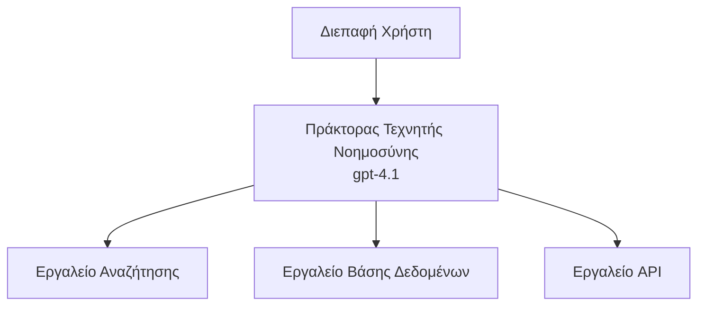
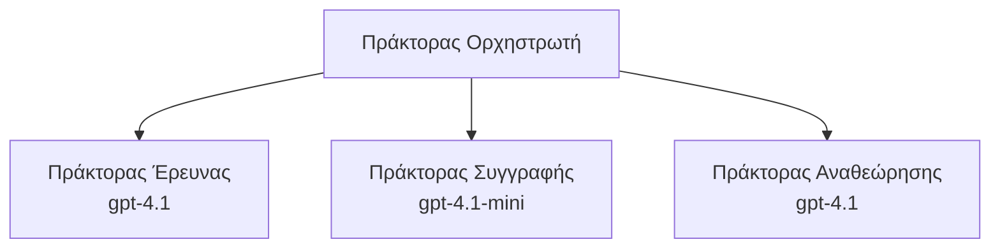

# Πράκτορες AI με Azure Developer CLI

**Πλοήγηση Κεφαλαίου:**
- **📚 Αρχική Μαθήματος**: [AZD για Αρχάριους](../../README.md)
- **📖 Τρέχουσα Ενότητα**: Κεφάλαιο 2 - Ανάπτυξη με προτεραιότητα στο AI
- **⬅️ Προηγούμενο**: [Ενσωμάτωση Microsoft Foundry](microsoft-foundry-integration.md)
- **➡️ Επόμενο**: [Ανάπτυξη Μοντέλων AI](ai-model-deployment.md)
- **🚀 Προχωρημένο**: [Λύσεις Πολλαπλών Πρακτόρων](../../examples/retail-scenario.md)

---

## Εισαγωγή

Οι πράκτορες AI είναι αυτόνομα προγράμματα που μπορούν να αντιλαμβάνονται το περιβάλλον τους, να λαμβάνουν αποφάσεις και να εκτελούν ενέργειες για να επιτύχουν συγκεκριμένους στόχους. Σε αντίθεση με απλά chatbots που απαντούν σε προτροπές, οι πράκτορες μπορούν να:

- **Χρησιμοποιούν εργαλεία** - Καλούν APIs, αναζητούν βάσεις δεδομένων, εκτελούν κώδικα
- **Σχεδιάζουν και συλλογίζονται** - Διασπούν πολύπλοκα καθήκοντα σε βήματα
- **Μαθαίνουν από το πλαίσιο** - Διατηρούν μνήμη και προσαρμόζουν τη συμπεριφορά
- **Συνεργάζονται** - Εργάζονται με άλλους πράκτορες (συστήματα πολλαπλών πρακτόρων)

Αυτός ο οδηγός σας δείχνει πώς να αναπτύξετε πράκτορες AI στο Azure χρησιμοποιώντας το Azure Developer CLI (azd).

> **Σημείωση επαλήθευσης (2026-03-25):** Αυτός ο οδηγός εξετάστηκε σε σχέση με `azd` `1.23.12` και `azure.ai.agents` `0.1.18-preview`. Η εμπειρία `azd ai` είναι ακόμη υπό προεπισκόπηση, οπότε ελέγξτε τη βοήθεια της επέκτασης αν τα εγκατεστημένα flags διαφέρουν.

## Στόχοι Μάθησης

Με την ολοκλήρωση αυτού του οδηγού, θα:
- Κατανοήσετε τι είναι οι πράκτορες AI και πώς διαφέρουν από τα chatbots
- Αναπτύξετε προ-κατασκευασμένα πρότυπα πρακτόρων AI χρησιμοποιώντας το AZD
- Διαμορφώσετε τους Foundry Agents για προσαρμοσμένους πράκτορες
- Υλοποιήσετε βασικά μοτίβα πρακτόρων (χρήση εργαλείων, RAG, πολλαπλοί πράκτορες)
- Παρακολουθείτε και εντοπίζετε σφάλματα σε αναπτυγμένους πράκτορες

## Αποτελέσματα Μάθησης

Μετά την ολοκλήρωση, θα μπορείτε να:
- Αναπτύσσετε εφαρμογές πρακτόρων AI στο Azure με μία εντολή
- Διαμορφώνετε εργαλεία και δυνατότητες πρακτόρων
- Υλοποιείτε retrieval-augmented generation (RAG) με πράκτορες
- Σχεδιάζετε αρχιτεκτονικές πολλαπλών πρακτόρων για πολύπλοκες ροές εργασίας
- Εντοπίζετε και επιλύετε συνηθισμένα προβλήματα ανάπτυξης πρακτόρων

---

## 🤖 Τι κάνει έναν Πράκτορα διαφορετικό από ένα Chatbot;

| Χαρακτηριστικό | Chatbot | Πράκτορας AI |
|---------|---------|----------|
| **Συμπεριφορά** | Απαντά σε προτροπές | Αναλαμβάνει αυτόνομες ενέργειες |
| **Εργαλεία** | Κανένα | Μπορεί να καλεί APIs, να αναζητά, να εκτελεί κώδικα |
| **Μνήμη** | Μόνο ανά συνεδρία | Επίμονη μνήμη μεταξύ συνεδριών |
| **Σχεδίαση** | Ενιαία απάντηση | Συλλογιστική πολλαπλών βημάτων |
| **Συνεργασία** | Ενιαία οντότητα | Μπορεί να συνεργάζεται με άλλους πράκτορες |

### Απλή Αναλογία

- **Chatbot** = Ένα βοηθητικό άτομο που απαντά σε ερωτήσεις σε ένα πληροφοριακό γραφείο
- **Πράκτορας AI** = Ένας προσωπικός βοηθός που μπορεί να κάνει κλήσεις, να κλείνει ραντεβού και να ολοκληρώνει εργασίες για εσάς

---

## 🚀 Γρήγορη Εκκίνηση: Αναπτύξτε τον Πρώτο σας Πράκτορα

### Επιλογή 1: Πρότυπο Foundry Agents (Συνιστάται)

```bash
# Αρχικοποιήστε το πρότυπο των πρακτόρων AI
azd init --template get-started-with-ai-agents

# Αναπτύξτε στο Azure
azd up
```

**Τι αναπτύσσεται:**
- ✅ Foundry Agents
- ✅ Microsoft Foundry Models (gpt-4.1)
- ✅ Azure AI Search (για RAG)
- ✅ Azure Container Apps (διεπαφή web)
- ✅ Application Insights (παρακολούθηση)

**Χρόνος:** ~15-20 λεπτά
**Κόστος:** ~$100-150/μήνα (ανάπτυξη)

### Επιλογή 2: OpenAI Agent με Prompty

```bash
# Αρχικοποιήστε το πρότυπο πράκτορα που βασίζεται στο Prompty
azd init --template agent-openai-python-prompty

# Αναπτύξτε στο Azure
azd up
```

**Τι αναπτύσσεται:**
- ✅ Azure Functions (εκτέλεση πράκτορα χωρίς διακομιστή)
- ✅ Microsoft Foundry Models
- ✅ Αρχεία ρυθμίσεων Prompty
- ✅ Δείγμα υλοποίησης πράκτορα

**Χρόνος:** ~10-15 λεπτά
**Κόστος:** ~$50-100/μήνα (ανάπτυξη)

### Επιλογή 3: RAG Chat Agent

```bash
# Αρχικοποίηση προτύπου συνομιλίας RAG
azd init --template azure-search-openai-demo

# Ανάπτυξη στο Azure
azd up
```

**Τι αναπτύσσεται:**
- ✅ Microsoft Foundry Models
- ✅ Azure AI Search με δείγματα δεδομένων
- ✅ Pipeline επεξεργασίας εγγράφων
- ✅ Διεπαφή συνομιλίας με παραπομπές

**Χρόνος:** ~15-25 λεπτά
**Κόστος:** ~$80-150/μήνα (ανάπτυξη)

### Επιλογή 4: AZD AI Agent Init (Manifest- ή Template-Based Preview)

Αν έχετε αρχείο manifest πράκτορα, μπορείτε να χρησιμοποιήσετε την εντολή `azd ai` για να δημιουργήσετε ένα project Foundry Agent Service απευθείας. Πρόσφατες προεπισκοπήσεις πρόσθεσαν επίσης υποστήριξη για αρχικοποίηση βάσει προτύπων, οπότε η ακριβής ροή προτροπών μπορεί να διαφέρει ελαφρώς ανάλογα με την έκδοση της επέκτασης που έχετε εγκαταστήσει.

```bash
# Εγκαταστήστε την επέκταση για πράκτορες AI
azd extension install azure.ai.agents

# Προαιρετικό: επαληθεύστε την εγκατεστημένη έκδοση προεπισκόπησης
azd extension show azure.ai.agents

# Αρχικοποιήστε από το manifest ενός πράκτορα
azd ai agent init -m agent-manifest.yaml

# Αναπτύξτε στο Azure
azd up

# Δοκιμάστε τον αναπτυγμένο πράκτορα (εμφανίζει καθυστέρηση + χρόνο έως το πρώτο byte)
azd ai agent invoke
```

**Πότε να χρησιμοποιήσετε `azd ai agent init` vs `azd init --template`:**

| Προσέγγιση | Καλύτερο για | Πώς λειτουργεί |
|----------|----------|------|
| `azd init --template` | Ξεκινώντας από μια λειτουργική εφαρμογή δειγματός | Κλωνοποιεί ένα πλήρες αποθετήριο προτύπου με κώδικα + υποδομή |
| `azd ai agent init -m` | Κατασκευή από το δικό σας manifest πράκτορα | Δημιουργεί τη δομή έργου από τον ορισμό του πράκτορα σας |

> **Συμβουλή:** Χρησιμοποιήστε `azd init --template` όταν μαθαίνετε (Επιλογές 1-3 παραπάνω). Χρησιμοποιήστε `azd ai agent init` όταν δημιουργείτε πράκτορες για παραγωγή με τα δικά σας manifests.

Μετά το `azd up`, η ίδια επέκταση σας οδηγεί μέσα από το υπόλοιπο του κύκλου ζωής του πράκτορα: `azd ai agent invoke` για δοκιμές, `azd ai agent eval generate` και `azd ai agent optimize` για μέτρηση και βελτίωση ποιότητας, και `azd ai agent delete` για καθαρισμό. Δείτε [Εντολές CLI AZD AI](../chapter-08-production/production-ai-practices.md#azd-ai-cli-commands-and-extensions) για την πλήρη αναφορά.

---

## 🏗️ Μοτίβα Αρχιτεκτονικής Πρακτόρων

### Μοτίβο 1: Ενιαίος Πράκτορας με Εργαλεία

Το απλούστερο μοτίβο πράκτορα - ένας πράκτορας που μπορεί να χρησιμοποιεί πολλά εργαλεία.



**Καλύτερο για:**
- Chatbots υποστήριξης πελατών
- Βοηθούς έρευνας
- Πράκτορες ανάλυσης δεδομένων

**AZD Πρότυπο:** `azure-search-openai-demo`

### Μοτίβο 2: RAG Πράκτορας (Retrieval-Augmented Generation)

Ένας πράκτορας που ανακτά σχετικά έγγραφα πριν δημιουργήσει απαντήσεις.

```mermaid
graph TD
    Query[Ερώτημα Χρήστη] --> RAG[Πράκτορας RAG]
    RAG --> Vector[Αναζήτηση Διανυσμάτων]
    RAG --> LLM[Μεγάλο Γλωσσικό Μοντέλο (LLM)<br/>gpt-4.1]
    Vector -- Έγγραφα --> LLM
    LLM --> Response[Απάντηση με Παραπομπές]
```

**Καλύτερο για:**
- Εταιρικές βάσεις γνώσης
- Συστήματα Ερωταπαντήσεων εγγράφων
- Συμμόρφωση και νομική έρευνα

**AZD Πρότυπο:** `azure-search-openai-demo`

### Μοτίβο 3: Σύστημα Πολλαπλών Πρακτόρων

Πολλοί εξειδικευμένοι πράκτορες που συνεργάζονται σε πολύπλοκα καθήκοντα.



**Καλύτερο για:**
- Πολύπλοκη δημιουργία περιεχομένου
- Ροές εργασίας πολλαπλών βημάτων
- Καθήκοντα που απαιτούν διαφορετική εξειδίκευση

**Μάθετε περισσότερα:** [Προτύπα Συντονισμού Πολλαπλών Πρακτόρων](../chapter-06-pre-deployment/coordination-patterns.md)

---

## ⚙️ Διαμόρφωση Εργαλείων Πρακτόρων

Οι πράκτορες γίνονται ισχυροί όταν μπορούν να χρησιμοποιούν εργαλεία. Ακολουθεί πώς να διαμορφώσετε κοινά εργαλεία:

### Διαμόρφωση Εργαλείων στους Foundry Agents

```python
# agent_config.py
from azure.ai.projects import AIProjectClient
from azure.ai.projects.models import FunctionTool, CodeInterpreterTool

# Ορίστε προσαρμοσμένα εργαλεία
search_tool = FunctionTool(
    name="search_knowledge_base",
    description="Search the company knowledge base for relevant documents",
    parameters={
        "type": "object",
        "properties": {
            "query": {
                "type": "string",
                "description": "The search query"
            }
        },
        "required": ["query"]
    }
)

# Δημιουργήστε πράκτορα με εργαλεία
agent = project_client.agents.create_agent(
    model="gpt-4.1",
    name="Support Agent",
    instructions="You are a helpful support agent. Use the search tool to find relevant information.",
    tools=[search_tool, CodeInterpreterTool()]
)
```

### Διαμόρφωση Περιβάλλοντος

```bash
# Ορίστε μεταβλητές περιβάλλοντος ειδικές για τον πράκτορα
azd env set AZURE_OPENAI_MODEL "gpt-4.1"
azd env set AGENT_INSTRUCTIONS "You are a helpful assistant..."
azd env set ENABLE_CODE_INTERPRETER "true"
azd env set ENABLE_FILE_SEARCH "true"

# Αναπτύξτε με ενημερωμένη διαμόρφωση
azd deploy
```

---

## 📊 Παρακολούθηση Πρακτόρων

### Ενσωμάτωση Application Insights

Όλα τα πρότυπα πρακτόρων AZD περιλαμβάνουν το Application Insights για παρακολούθηση:

```bash
# Άνοιγμα πίνακα ελέγχου παρακολούθησης
azd monitor --overview

# Προβολή ζωντανών καταγραφών
azd monitor --logs

# Προβολή ζωντανών μετρικών
azd monitor --live
```

### Βασικά Μετρικά προς Παρακολούθηση

| Μετρικό | Περιγραφή | Στόχος |
|--------|-------------|--------|
| Καθυστέρηση Απόκρισης | Χρόνος δημιουργίας απάντησης | < 5 δευτερόλεπτα |
| Χρήση Token | Token ανά αίτηση | Παρακολουθήστε για κόστος |
| Ποσοστό Επιτυχίας Κλήσεων Εργαλείων | % επιτυχημένων εκτελέσεων εργαλείων | > 95% |
| Ποσοστό Σφαλμάτων | Αποτυχημένα αιτήματα πράκτορα | < 1% |
| Ικανοποίηση Χρηστών | Βαθμολογίες ανατροφοδότησης | > 4.0/5.0 |

### Προσαρμοσμένη Καταγραφή για Πράκτορες

```python
import os
from azure.monitor.opentelemetry import configure_azure_monitor
from opentelemetry import trace

# Διαμορφώστε το Azure Monitor με OpenTelemetry
configure_azure_monitor(
    connection_string=os.environ["APPLICATIONINSIGHTS_CONNECTION_STRING"]
)

tracer = trace.get_tracer(__name__)

def log_agent_interaction(user_query, agent_response, tools_used, latency_ms):
    with tracer.start_as_current_span("agent_interaction") as span:
        span.set_attributes({
            "user_query": user_query,
            "response_length": len(agent_response),
            "tools_used": tools_used,
            "latency_ms": latency_ms
        })
```

> **Σημείωση:** Εγκαταστήστε τα απαιτούμενα πακέτα: `pip install azure-monitor-opentelemetry opentelemetry`

---

## 💰 Παράγοντες Κόστους

### Εκτιμώμενα Μηνιαία Κόστη ανά Μοτίβο

| Μοτίβο | Περιβάλλον Ανάπτυξης | Παραγωγή |
|---------|-----------------|------------|
| Ενιαίος Πράκτορας | $50-100 | $200-500 |
| RAG Πράκτορας | $80-150 | $300-800 |
| Πολλαπλοί Πράκτορες (2-3 πράκτορες) | $150-300 | $500-1,500 |
| Εταιρικό Σύστημα Πολλαπλών Πρακτόρων | $300-500 | $1,500-5,000+ |

### Συμβουλές Βελτιστοποίησης Κόστους

1. **Χρησιμοποιήστε gpt-4.1-mini για απλές εργασίες**
   ```bash
   azd env set AZURE_OPENAI_MODEL "gpt-4.1-mini"
   ```

2. **Εφαρμόστε caching για επαναλαμβανόμενα ερωτήματα**
   ```python
   from functools import lru_cache
   
   @lru_cache(maxsize=1000)
   def get_cached_response(query_hash):
       return agent.run(query_hash)
   ```

3. **Ορίστε όρια token ανά εκτέλεση**
   ```python
   # Ορίστε το max_completion_tokens κατά την εκτέλεση του πράκτορα, όχι κατά τη δημιουργία
   run = project_client.agents.create_run(
       thread_id=thread.id,
       agent_id=agent.id,
       max_completion_tokens=1000  # Περιορίστε το μήκος της απάντησης
   )
   ```

4. **Κλιμακώστε σε μηδέν όταν δεν χρησιμοποιείται**
   ```bash
   # Οι Container Apps κλιμακώνονται αυτόματα στο μηδέν
   azd env set MIN_REPLICAS "0"
   ```

---

## 🔧 Αντιμετώπιση Προβλημάτων Πρακτόρων

### Συνήθη Προβλήματα και Λύσεις

<details>
<summary><strong>❌ Ο πράκτορας δεν ανταποκρίνεται σε κλήσεις εργαλείων</strong></summary>

```bash
# Ελέγξτε αν τα εργαλεία έχουν καταχωριστεί σωστά
azd show

# Επαληθεύστε την ανάπτυξη του OpenAI
az cognitiveservices account deployment list \
  --name $AZURE_OPENAI_NAME \
  --resource-group $RG_NAME

# Ελέγξτε τα αρχεία καταγραφής του πράκτορα
azd monitor --logs
```

**Συνήθεις αιτίες:**
- Αντιστοιχία υπογραφής συνάρτησης εργαλείου
- Λείπουν απαιτούμενες άδειες
- Το endpoint του API δεν είναι προσβάσιμο
</details>

<details>
<summary><strong>❌ Υψηλή καθυστέρηση στις απαντήσεις του πράκτορα</strong></summary>

```bash
# Ελέγξτε το Application Insights για σημεία συμφόρησης
azd monitor --live

# Σκεφτείτε να χρησιμοποιήσετε ένα ταχύτερο μοντέλο
azd env set AZURE_OPENAI_MODEL "gpt-4.1-mini"
azd deploy
```

**Συμβουλές βελτιστοποίησης:**
- Χρησιμοποιήστε streaming απαντήσεις
- Εφαρμόστε caching απαντήσεων
- Μειώστε το παράθυρο συμφραζομένων
</details>

<details>
<summary><strong>❌ Ο πράκτορας επιστρέφει λανθασμένες ή φανταστικές πληροφορίες</strong></summary>

```python
# Βελτίωση με καλύτερες προτροπές συστήματος
instructions = """
You are a helpful assistant. IMPORTANT:
- Only answer based on provided context
- If you don't know, say "I don't know"
- Always cite your sources
- Never make up information
"""

# Προσθήκη ανάκτησης για θεμελίωση
agent = project_client.agents.create_agent(
    model="gpt-4.1",
    instructions=instructions,
    tools=[FileSearchTool()]  # Θεμελίωση απαντήσεων σε έγγραφα
)
```
</details>

<details>
<summary><strong>❌ Σφάλματα υπέρβασης ορίου token</strong></summary>

```python
# Υλοποιήστε τη διαχείριση του παραθύρου συμφραζομένων
def truncate_context(messages, max_tokens=8000, model="gpt-4.1"):
    """Keep only recent messages within token limit."""
    import tiktoken
    encoding = tiktoken.encoding_for_model(model)
    total_tokens = 0
    truncated = []
    
    for msg in reversed(messages):
        msg_tokens = len(encoding.encode(msg.content))
        if total_tokens + msg_tokens > max_tokens:
            break
        truncated.insert(0, msg)
        total_tokens += msg_tokens
    
    return truncated
```
</details>

---

## 🎓 Πρακτικές Ασκήσεις

### Άσκηση 1: Αναπτύξτε έναν Βασικό Πράκτορα (20 λεπτά)

**Στόχος:** Αναπτύξτε τον πρώτο σας πράκτορα AI χρησιμοποιώντας το AZD

```bash
# Βήμα 1: Αρχικοποίηση προτύπου
azd init --template get-started-with-ai-agents

# Βήμα 2: Σύνδεση στο Azure
azd auth login
# Εάν εργάζεστε σε πολλούς ενοικιαστές, προσθέστε --tenant-id <tenant-id>

# Βήμα 3: Ανάπτυξη
azd up

# Βήμα 4: Δοκιμάστε τον πράκτορα
# Αναμενόμενη έξοδος μετά την ανάπτυξη:
#   Η ανάπτυξη ολοκληρώθηκε!
#   Τελικό σημείο: https://<app-name>.<region>.azurecontainerapps.io
# Ανοίξτε τη διεύθυνση URL που εμφανίζεται στην έξοδο και δοκιμάστε να κάνετε μια ερώτηση

# Βήμα 5: Προβολή παρακολούθησης
azd monitor --overview

# Βήμα 6: Καθαρισμός
azd down --force --purge
```

**Κριτήρια Επιτυχίας:**
- [ ] Ο πράκτορας απαντά σε ερωτήσεις
- [ ] Μπορεί να έχει πρόσβαση στον πίνακα παρακολούθησης μέσω `azd monitor`
- [ ] Οι πόροι καθαρίστηκαν με επιτυχία

### Άσκηση 2: Προσθέστε ένα Προσαρμοσμένο Εργαλείο (30 λεπτά)

**Στόχος:** Επεκτείνετε έναν πράκτορα με ένα προσαρμοσμένο εργαλείο

1. Αναπτύξτε το πρότυπο πράκτορα:
   ```bash
   azd init --template get-started-with-ai-agents
   azd up
   ```
2. Δημιουργήστε μια νέα συνάρτηση εργαλείου στον κώδικα του πράκτορά σας:
   ```python
   def get_weather(location: str) -> str:
       """Get current weather for a location."""
       # Κλήση API στην υπηρεσία καιρού
       return f"Weather in {location}: Sunny, 72°F"
   ```
3. Εγγράψτε το εργαλείο με τον πράκτορα:
   ```python
   from azure.ai.projects.models import FunctionTool

   weather_tool = FunctionTool(
       name="get_weather",
       description="Get current weather for a location",
       parameters={
           "type": "object",
           "properties": {
               "location": {"type": "string", "description": "City name"}
           },
           "required": ["location"]
       }
   )

   agent = project_client.agents.create_agent(
       model="gpt-4.1",
       name="Weather Agent",
       tools=[weather_tool]
   )
   ```
4. Επανααναπτύξτε και δοκιμάστε:
   ```bash
   azd deploy
   # Ρώτα: "Τι καιρό έχει στο Σιάτλ;"
   # Αναμενόμενο: Ο πράκτορας καλεί get_weather("Seattle") και επιστρέφει πληροφορίες για τον καιρό
   ```

**Κριτήρια Επιτυχίας:**
- [ ] Ο πράκτορας αναγνωρίζει ερωτήματα σχετικά με τον καιρό
- [ ] Το εργαλείο καλείται σωστά
- [ ] Η απάντηση περιλαμβάνει πληροφορίες για τον καιρό

### Άσκηση 3: Δημιουργήστε έναν RAG Πράκτορα (45 λεπτά)

**Στόχος:** Δημιουργήστε έναν πράκτορα που απαντά σε ερωτήσεις από τα έγγραφά σας

```bash
# Βήμα 1: Αναπτύξτε το πρότυπο RAG
azd init --template azure-search-openai-demo
azd up

# Βήμα 2: Μεταφορτώστε τα έγγραφά σας
# Τοποθετήστε αρχεία PDF/TXT στον κατάλογο data/, στη συνέχεια εκτελέστε:
python scripts/prepdocs.py

# Βήμα 3: Δοκιμάστε με ερωτήσεις ειδικού τομέα
# Ανοίξτε το URL της web εφαρμογής από την έξοδο του azd up
# Κάντε ερωτήσεις σχετικά με τα έγγραφα που ανεβάσατε
# Οι απαντήσεις πρέπει να περιλαμβάνουν παραπομπές όπως [doc.pdf]
```

**Κριτήρια Επιτυχίας:**
- [ ] Ο πράκτορας απαντά από τα ανεβασμένα έγγραφα
- [ ] Οι απαντήσεις περιλαμβάνουν παραπομπές
- [ ] Χωρίς παραισθήσεις σε ερωτήσεις εκτός πεδίου

---

## 📚 Επόμενα Βήματα

Τώρα που κατανοείτε τους πράκτορες AI, εξερευνήστε αυτά τα προηγμένα θέματα:

| Θέμα | Περιγραφή | Σύνδεσμος |
|-------|-------------|------|
| **Συστήματα Πολλαπλών Πρακτόρων** | Δημιουργήστε συστήματα με πολλούς συνεργαζόμενους πράκτορες | [Παράδειγμα Πολλαπλών Πρακτόρων Λιανικής](../../examples/retail-scenario.md) |
| **Προτύπα Συντονισμού** | Μάθετε πρότυπα ορχήστρωσης και επικοινωνίας | [Προτύπα Συντονισμού](../chapter-06-pre-deployment/coordination-patterns.md) |
| **Ανάπτυξη για Παραγωγή** | Ανάπτυξη πρακτόρων κατάλληλη για επιχειρήσεις | [Πρακτικές Παραγωγής AI](../chapter-08-production/production-ai-practices.md) |
| **Αξιολόγηση Πρακτόρων** | Δοκιμάστε και αξιολογήστε την απόδοση των πρακτόρων | [Αντιμετώπιση Προβλημάτων AI](../chapter-07-troubleshooting/ai-troubleshooting.md) |
| **Εργαστήριο AI** | Πρακτική άσκηση: Κάντε τη λύση AI έτοιμη για AZD | [AI Workshop Lab](ai-workshop-lab.md) |

---

## 📖 Πρόσθετοι Πόροι

### Επίσημη Τεκμηρίωση
- [Microsoft Foundry Agent Service](https://learn.microsoft.com/azure/ai-services/agents/)
- [Microsoft Foundry Agent Service Quickstart](https://learn.microsoft.com/azure/ai-services/agents/quickstart)
- [Πλαίσιο Πρακτόρων Semantic Kernel](https://learn.microsoft.com/semantic-kernel/)

### Πρότυπα AZD για Πράκτορες
- [Ξεκινήστε με Πράκτορες AI](https://github.com/Azure-Samples/get-started-with-ai-agents)
- [Agent OpenAI Python Prompty](https://github.com/Azure-Samples/agent-openai-python-prompty)
- [Παρουσίαση Azure Search OpenAI](https://github.com/Azure-Samples/azure-search-openai-demo)

### Κοινοτικοί Πόροι
- [Awesome AZD - Πρότυπα Πρακτόρων](https://azure.github.io/awesome-azd/?tags=ai-agents)
- [Azure AI Discord](https://discord.gg/microsoft-azure)
- [Microsoft Foundry Discord](https://discord.gg/nTYy5BXMWG)

### Δεξιότητες Πρακτόρων για τον Επεξεργαστή σας
- [**Microsoft Azure Agent Skills**](https://skills.sh/microsoft/github-copilot-for-azure) - Εγκαταστήστε επαναχρησιμοποιήσιμες δεξιότητες πρακτόρων AI για ανάπτυξη στο Azure στο GitHub Copilot, Cursor ή οποιονδήποτε υποστηριζόμενο πράκτορα. Περιλαμβάνει δεξιότητες για [Azure AI](https://skills.sh/microsoft/github-copilot-for-azure/azure-ai), [Microsoft Foundry](https://skills.sh/microsoft/github-copilot-for-azure/microsoft-foundry), [ανάπτυξη](https://skills.sh/microsoft/github-copilot-for-azure/azure-deploy), και [διαγνωστικά](https://skills.sh/microsoft/github-copilot-for-azure/azure-diagnostics):
  ```bash
  npx skills add microsoft/github-copilot-for-azure
  ```

---

**Πλοήγηση**
- **Προηγούμενο Μάθημα**: [Ενσωμάτωση Microsoft Foundry](microsoft-foundry-integration.md)
- **Επόμενο Μάθημα**: [Ανάπτυξη Μοντέλου AI](ai-model-deployment.md)

---

<!-- CO-OP TRANSLATOR DISCLAIMER START -->
**Αποποίηση ευθυνών**:
Αυτό το έγγραφο έχει μεταφραστεί χρησιμοποιώντας την υπηρεσία μετάφρασης με τεχνητή νοημοσύνη [Co-op Translator](https://github.com/Azure/co-op-translator). Ενώ επιδιώκουμε την ακρίβεια, παρακαλούμε να έχετε υπόψη ότι οι αυτοματοποιημένες μεταφράσεις ενδέχεται να περιέχουν λάθη ή ανακρίβειες. Το πρωτότυπο έγγραφο στη μητρική του γλώσσα πρέπει να θεωρείται η αυθεντική πηγή. Για κρίσιμες πληροφορίες, συνιστάται επαγγελματική ανθρώπινη μετάφραση. Δεν φέρουμε ευθύνη για τυχόν παρεξηγήσεις ή λανθασμένες ερμηνείες που προκύπτουν από τη χρήση αυτής της μετάφρασης.
<!-- CO-OP TRANSLATOR DISCLAIMER END -->