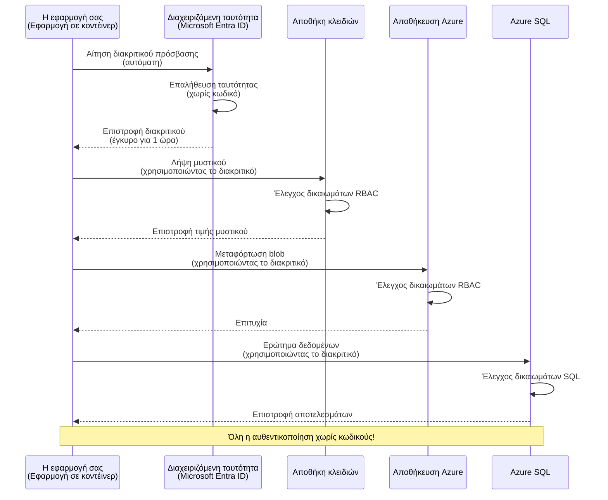
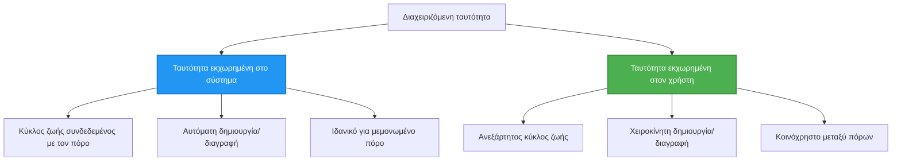

# Πρότυπα Πιστοποίησης και Διαχειριζόμενη Ταυτότητα

⏱️ **Εκτιμώμενος Χρόνος**: 45-60 λεπτά | 💰 **Επιπτώσεις Κόστους**: Δωρεάν (χωρίς πρόσθετες χρεώσεις) | ⭐ **Πολυπλοκότητα**: Μεσαίο

**📚 Μονοπάτι Μάθησης:**
- ← Προηγούμενο: [Διαχείριση Διαμόρφωσης](configuration.md) - Διαχείριση μεταβλητών περιβάλλοντος και μυστικών
- 🎯 **Είστε Εδώ**: Πιστοποίηση & Ασφάλεια (Διαχειριζόμενη Ταυτότητα, Key Vault, ασφαλή πρότυπα)
- → Επόμενο: [Πρώτο Έργο](first-project.md) - Δημιουργήστε την πρώτη σας εφαρμογή AZD
- 🏠 [Αρχική Μαθήματος](../../README.md)

---

## Τι θα μάθετε

Με την ολοκλήρωση αυτού του μαθήματος, θα:
- Κατανοήσετε τα πρότυπα πιστοποίησης του Azure (κλειδιά, connection strings, διαχειριζόμενη ταυτότητα)
- Υλοποιήσετε **Διαχειριζόμενη Ταυτότητα** για πιστοποίηση χωρίς κωδικό
- Ασφαλίσετε μυστικά με ενσωμάτωση **Azure Key Vault**
- Διαμορφώσετε **έλεγχο πρόσβασης βασισμένο σε ρόλους (RBAC)** για αναπτύξεις AZD
- Εφαρμόσετε βέλτιστες πρακτικές ασφάλειας σε Container Apps και υπηρεσίες Azure
- Μεταβείτε από πιστοποίηση με κλειδιά σε πιστοποίηση με ταυτότητα

## Γιατί έχει σημασία η Διαχειριζόμενη Ταυτότητα

### Το Πρόβλημα: Παραδοσιακή Πιστοποίηση

**Πριν τη Διαχειριζόμενη Ταυτότητα:**
```javascript
// ❌ ΚΙΝΔΥΝΟΣ ΑΣΦΑΛΕΙΑΣ: Σκληροκωδικοποιημένα μυστικά στον κώδικα
const connectionString = "Server=mydb.database.windows.net;User=admin;Password=P@ssw0rd123";
const storageKey = "xK7mN9pQ2wR5tY8uI0oP3aS6dF1gH4jK...";
const cosmosKey = "C2x7B9n4M1p8Q5w3E6r0T2y5U8i1O4p7...";
```

**Προβλήματα:**
- 🔴 **Εκτεθειμένα μυστικά** σε κώδικα, αρχεία ρυθμίσεων, μεταβλητές περιβάλλοντος
- 🔴 **Περιστροφή διαπιστευτηρίων** απαιτεί αλλαγές κώδικα και επαναδιανομή
- 🔴 **Καλών ελέγχων** - ποιος προσέβαλε τι, πότε; (nightmares)
- 🔴 **Διάσπαρτα** - μυστικά σκορπισμένα σε πολλαπλά συστήματα
- 🔴 **Κίνδυνοι συμμόρφωσης** - αποτυγχάνει σε ελέγχους ασφαλείας

### Η Λύση: Διαχειριζόμενη Ταυτότητα

**Μετά τη Διαχειριζόμενη Ταυτότητα:**
```javascript
// ✅ ΑΣΦΑΛΕΣ: Χωρίς μυστικά στον κώδικα
const credential = new DefaultAzureCredential();
const client = new BlobServiceClient(
  "https://mystorageaccount.blob.core.windows.net",
  credential  // Το Azure διαχειρίζεται αυτόματα την αυθεντικοποίηση
);
```

**Οφέλη:**
- ✅ **Μηδενικά μυστικά** στον κώδικα ή τη διαμόρφωση
- ✅ **Αυτόματη περιστροφή** - το Azure το διαχειρίζεται
- ✅ **Πλήρες ιστορικό ελέγχων** στα αρχεία καταγραφής του Microsoft Entra ID
- ✅ **Κεντρικοποιημένη ασφάλεια** - διαχείριση στο Azure Portal
- ✅ **Έτοιμο για συμμόρφωση** - πληροί πρότυπα ασφάλειας

**Αναλογία**: Η παραδοσιακή πιστοποίηση είναι σαν να κουβαλάτε πολλαπλά φυσικά κλειδιά για διαφορετικές πόρτες. Η Διαχειριζόμενη Ταυτότητα είναι σαν ένα ταυτότητα/κάρτα ασφαλείας που παρέχει αυτόματα πρόσβαση βάσει του ποιος είστε — χωρίς κλειδιά για να χαθούν, αντιγραφούν ή περιστραφούν.

---

## Επισκόπηση Αρχιτεκτονικής

### Ροή Πιστοποίησης με Διαχειριζόμενη Ταυτότητα



### Τύποι Διαχειριζόμενων Ταυτοτήτων



| Χαρακτηριστικό | Καθορισμένη από το σύστημα | Καθορισμένη από τον χρήστη |
|---------|----------------|---------------|
| **Κύκλος ζωής** | Συσχετισμένη με πόρο | Ανεξάρτητη |
| **Δημιουργία** | Αυτόματη με τον πόρο | Χειροκίνητη δημιουργία |
| **Διαγραφή** | Διαγράφεται με τον πόρο | Παραμένει μετά τη διαγραφή του πόρου |
| **Κοινή χρήση** | Μόνο ένας πόρος | Πολλοί πόροι |
| **Σενάριο χρήσης** | Απλά σενάρια | Σύνθετα σενάρια με πολλαπλούς πόρους |
| **Προεπιλογή AZD** | ✅ Συνιστάται | Προαιρετικό |

---

## Προαπαιτούμενα

### Απαιτούμενα Εργαλεία

Θα πρέπει ήδη να έχετε εγκατεστημένα τα ακόλουθα από προηγούμενα μαθήματα:

```bash
# Επαλήθευση Azure Developer CLI
azd version
# ✅ Αναμενόμενο: azd έκδοση 1.0.0 ή νεότερη

# Επαλήθευση Azure CLI
az --version
# ✅ Αναμενόμενο: azure-cli 2.50.0 ή νεότερη
```

### Απαιτήσεις Azure

- Ενεργή συνδρομή Azure
- Δικαιώματα για:
  - Δημιουργία διαχειριζόμενων ταυτοτήτων
  - Ανάθεση ρόλων RBAC
  - Δημιουργία πόρων Key Vault
  - Ανάπτυξη Container Apps

### Προαπαιτούμενες Γνώσεις

Θα πρέπει να έχετε ολοκληρώσει:
- [Οδηγός Εγκατάστασης](installation.md) - Ρύθμιση AZD
- [Βασικά AZD](azd-basics.md) - Κύριες έννοιες
- [Διαχείριση Διαμόρφωσης](configuration.md) - Μεταβλητές περιβάλλοντος

---

## Μάθημα 1: Κατανόηση Προτύπων Πιστοποίησης

### Πρότυπο 1: Συμβολοσειρές Σύνδεσης (Παλιό - Αποφεύγετε)

**Πώς λειτουργεί:**
```bash
# Η συμβολοσειρά σύνδεσης περιέχει διαπιστευτήρια
STORAGE_CONNECTION_STRING="DefaultEndpointsProtocol=https;AccountName=myaccount;AccountKey=xK7mN9pQ2wR5..."
COSMOS_CONNECTION_STRING="AccountEndpoint=https://myaccount.documents.azure.com:443/;AccountKey=C2x7..."
SQL_CONNECTION_STRING="Server=myserver.database.windows.net;User=admin;Password=P@ssw0rd..."
```

**Προβλήματα:**
- ❌ Μυστικά ορατά σε μεταβλητές περιβάλλοντος
- ❌ Καταγράφονται σε συστήματα ανάπτυξης
- ❌ Δύσκολη περιστροφή
- ❌ Χωρίς ιστορικό ελέγχων πρόσβασης

**Πότε να χρησιμοποιήσετε:** Μόνο για τοπική ανάπτυξη, ποτέ για παραγωγή.

---

### Πρότυπο 2: Αναφορές Key Vault (Καλύτερο)

**Πώς λειτουργεί:**
```bicep
// Store secret in Key Vault
resource keyVault 'Microsoft.KeyVault/vaults@2023-02-01' = {
  name: 'mykv'
  properties: {
    enableRbacAuthorization: true
  }
}

// Reference in Container App
env: [
  {
    name: 'STORAGE_KEY'
    secretRef: 'storage-key'  // References Key Vault
  }
]
```

**Οφέλη:**
- ✅ Τα μυστικά αποθηκεύονται με ασφάλεια στο Key Vault
- ✅ Κεντρική διαχείριση μυστικών
- ✅ Περιστροφή χωρίς αλλαγές στον κώδικα

**Περιορισμοί:**
- ⚠️ Ακόμα χρήση κλειδιών/κωδικών
- ⚠️ Χρειάζεται διαχείριση πρόσβασης στο Key Vault

**Πότε να χρησιμοποιήσετε:** Βήμα μετάβασης από connection strings σε διαχειριζόμενη ταυτότητα.

---

### Πρότυπο 3: Διαχειριζόμενη Ταυτότητα (Καλύτερη Πρακτική)

**Πώς λειτουργεί:**
```bicep
// Enable managed identity
resource containerApp 'Microsoft.App/containerApps@2023-05-01' = {
  name: 'myapp'
  identity: {
    type: 'SystemAssigned'  // Automatically creates identity
  }
}

// Grant permissions
resource roleAssignment 'Microsoft.Authorization/roleAssignments@2022-04-01' = {
  scope: storageAccount
  properties: {
    roleDefinitionId: storageBlobDataContributorRole
    principalId: containerApp.identity.principalId
  }
}
```

**Κώδικας εφαρμογής:**
```javascript
// Δεν χρειάζονται μυστικά!
const { DefaultAzureCredential } = require('@azure/identity');
const { BlobServiceClient } = require('@azure/storage-blob');

const credential = new DefaultAzureCredential();
const blobServiceClient = new BlobServiceClient(
  'https://mystorageaccount.blob.core.windows.net',
  credential
);
```

**Οφέλη:**
- ✅ Μηδενικά μυστικά στον κώδικα/διαμόρφωση
- ✅ Αυτόματη περιστροφή διαπιστευτηρίων
- ✅ Πλήρες ιστορικό ελέγχων
- ✅ Δικαιώματα βάσει RBAC
- ✅ Έτοιμο για συμμόρφωση

**Πότε να χρησιμοποιήσετε:** Πάντα, για παραγωγικές εφαρμογές.

---

### Πρότυπο 4: Service Principals (CI/CD & Αυτοματισμός)

Η διαχειριζόμενη ταυτότητα είναι το χρυσό πρότυπο για πόρους που εκτελούνται εντός Azure. Αλλά τι γίνεται με πράγματα που εκτελούνται **εκτός** Azure — όπως ένας αγωγός CI/CD σε έναν build agent, ή ένα script στο laptop σας που δεν μπορεί να χρησιμοποιήσει την αλληλεπιδραστική σύνδεσή σας; Εκεί έρχεται το **service principal**: μια μη ανθρώπινη ταυτότητα με τα δικά της διαπιστευτήρια που μια αυτοματοποιημένη διαδικασία μπορεί να χρησιμοποιήσει.

**Πώς λειτουργεί:**

Δημιουργήστε ένα service principal με scope σε ένα resource group (ελάχιστα δικαιώματα):

```bash
az ad sp create-for-rbac \
  --name "myapp-cicd" \
  --role contributor \
  --scopes /subscriptions/<sub-id>/resourceGroups/<rg-name>
```

Αυτό εμφανίζει ένα client ID, client secret, και tenant ID. Το azd μπορεί να συνδεθεί με αυτά μη αλληλεπιδραστικά:

```bash
azd auth login \
  --client-id "<appId>" \
  --client-secret "<password>" \
  --tenant-id "<tenant>"
```

**Προτιμήστε federated credentials (OIDC) αντί για μυστικά.** Αντί για ένα μακροχρόνιο client secret, διαμορφώστε ένα federated credential ώστε το pipeline να ανταλλάσσει ένα βραχύβιο token—δεν υπάρχει μυστικό για διαρροή ή περιστροφή:

```bash
azd auth login \
  --client-id "<appId>" \
  --federated-credential-provider "github" \
  --tenant-id "<tenant>"
```

> `azd pipeline config` ρυθμίζει αυτόματα αυτό για εσάς. Δείτε τους οδηγούς CI/CD στο [Κεφάλαιο 8](../chapter-08-production/production-ai-practices.md).

**Οφέλη:**
- ✅ Λειτουργεί εκτός Azure (build agents, on-prem, άλλα clouds)
- ✅ Μπορεί να περιοριστεί σε ένα resource group με έναν ρόλο
- ✅ Η παραλλαγή Federated (OIDC) δεν χρησιμοποιεί αποθηκευμένο μυστικό

**Αντίβαρα:**
- ⚠️ Η παραλλαγή με μυστικά απαιτεί προσεκτική αποθήκευση και περιστροφή
- ⚠️ Ένα διαρρεύσαν μυστικό δίνει ό,τι δικαιώματα έχει το SP—κρατήστε τα scopes μικρά

**Πότε να χρησιμοποιήσετε:** Pipelines CI/CD και αυτοματισμοί που δεν μπορούν να χρησιμοποιήσουν διαχειριζόμενη ταυτότητα. Προτιμήστε πάντα την παραλλαγή **federated/OIDC** αντί του client secret, και προτιμήστε διαχειριζόμενη ταυτότητα όταν το φορτίο εκτελείται εντός Azure.

**Αποθήκευση διαπιστευτηρίων με ασφάλεια:**
- Μην αποθηκεύετε μυστικά σε αποθετήρια—χρησιμοποιήστε το αποθηκευτικό στοιχείο μυστικών του pipeline (GitHub Actions secrets, Azure DevOps variable groups / Key Vault).
- Περιορίστε το SP στον ελάχιστο ρόλο και resource group που χρειάζεται.
- Ορίστε ημερομηνία λήξης και περιστρέψτε, ή εξαλείψτε το μυστικό εντελώς με OIDC.

---

## Μάθημα 2: Υλοποίηση Διαχειριζόμενης Ταυτότητας με AZD

### Βήμα-βήμα Υλοποίηση

Ας κατασκευάσουμε ένα ασφαλές Container App που χρησιμοποιεί διαχειριζόμενη ταυτότητα για πρόσβαση στο Azure Storage και Key Vault.

### Δομή έργου

```
secure-app/
├── azure.yaml                 # AZD configuration
├── infra/
│   ├── main.bicep            # Main infrastructure
│   ├── core/
│   │   ├── identity.bicep    # Managed identity setup
│   │   ├── keyvault.bicep    # Key Vault configuration
│   │   └── storage.bicep     # Storage with RBAC
│   └── app/
│       └── container-app.bicep
└── src/
    ├── app.js                # Application code
    ├── package.json
    └── Dockerfile
```

### 1. Διαμόρφωση AZD (azure.yaml)

```yaml
name: secure-app
metadata:
  template: secure-app@1.0.0

services:
  api:
    project: ./src
    language: js
    host: containerapp

# Enable managed identity (AZD handles this automatically)
```

### 2. Υποδομή: Ενεργοποίηση Διαχειριζόμενης Ταυτότητας

**Αρχείο: `infra/main.bicep`**

```bicep
targetScope = 'subscription'

param environmentName string
param location string = 'eastus'

var tags = { 'azd-env-name': environmentName }

// Resource group
resource rg 'Microsoft.Resources/resourceGroups@2021-04-01' = {
  name: 'rg-${environmentName}'
  location: location
  tags: tags
}

// Storage Account
module storage './core/storage.bicep' = {
  name: 'storage'
  scope: rg
  params: {
    name: 'st${uniqueString(rg.id)}'
    location: location
    tags: tags
  }
}

// Key Vault
module keyVault './core/keyvault.bicep' = {
  name: 'keyvault'
  scope: rg
  params: {
    name: 'kv-${uniqueString(rg.id)}'
    location: location
    tags: tags
  }
}

// Container App with Managed Identity
module containerApp './app/container-app.bicep' = {
  name: 'container-app'
  scope: rg
  params: {
    name: 'ca-${environmentName}'
    location: location
    tags: tags
    storageAccountName: storage.outputs.name
    keyVaultName: keyVault.outputs.name
  }
}

// Grant Container App access to Storage
module storageRoleAssignment './core/role-assignment.bicep' = {
  name: 'storage-role'
  scope: rg
  params: {
    principalId: containerApp.outputs.identityPrincipalId
    roleDefinitionId: 'ba92f5b4-2d11-453d-a403-e96b0029c9fe'  // Storage Blob Data Contributor
    targetResourceId: storage.outputs.id
  }
}

// Grant Container App access to Key Vault
module kvRoleAssignment './core/role-assignment.bicep' = {
  name: 'kv-role'
  scope: rg
  params: {
    principalId: containerApp.outputs.identityPrincipalId
    roleDefinitionId: '4633458b-17de-408a-b874-0445c86b69e6'  // Key Vault Secrets User
    targetResourceId: keyVault.outputs.id
  }
}

// Outputs
output AZURE_STORAGE_ACCOUNT_NAME string = storage.outputs.name
output AZURE_KEY_VAULT_NAME string = keyVault.outputs.name
output APP_URL string = containerApp.outputs.url
```

### 3. Container App με Ταυτότητα Καθορισμένη από το Σύστημα

**Αρχείο: `infra/app/container-app.bicep`**

```bicep
param name string
param location string
param tags object = {}
param storageAccountName string
param keyVaultName string

resource containerApp 'Microsoft.App/containerApps@2023-05-01' = {
  name: name
  location: location
  tags: tags
  identity: {
    type: 'SystemAssigned'  // 🔑 Enable managed identity
  }
  properties: {
    configuration: {
      ingress: {
        external: true
        targetPort: 3000
      }
    }
    template: {
      containers: [
        {
          name: 'api'
          image: 'myregistry.azurecr.io/api:latest'
          resources: {
            cpu: json('0.5')
            memory: '1Gi'
          }
          env: [
            {
              name: 'AZURE_STORAGE_ACCOUNT_NAME'
              value: storageAccountName
            }
            {
              name: 'AZURE_KEY_VAULT_NAME'
              value: keyVaultName
            }
            // 🔑 No secrets - managed identity handles authentication!
          ]
        }
      ]
    }
  }
}

// Output the identity for RBAC assignments
output identityPrincipalId string = containerApp.identity.principalId
output id string = containerApp.id
output url string = 'https://${containerApp.properties.configuration.ingress.fqdn}'
```

### 4. Μονάδα Ανάθεσης Ρόλου RBAC

**Αρχείο: `infra/core/role-assignment.bicep`**

```bicep
param principalId string
param roleDefinitionId string  // Azure built-in role ID
param targetResourceId string

resource roleAssignment 'Microsoft.Authorization/roleAssignments@2022-04-01' = {
  name: guid(principalId, roleDefinitionId, targetResourceId)
  scope: resourceId('Microsoft.Resources/resourceGroups', resourceGroup().name)
  properties: {
    roleDefinitionId: subscriptionResourceId('Microsoft.Authorization/roleDefinitions', roleDefinitionId)
    principalId: principalId
    principalType: 'ServicePrincipal'
  }
}

output id string = roleAssignment.id
```

### 5. Κώδικας Εφαρμογής με Διαχειριζόμενη Ταυτότητα

**Αρχείο: `src/app.js`**

```javascript
const express = require('express');
const { DefaultAzureCredential } = require('@azure/identity');
const { BlobServiceClient } = require('@azure/storage-blob');
const { SecretClient } = require('@azure/keyvault-secrets');

const app = express();
const PORT = process.env.PORT || 3000;

// 🔑 Αρχικοποίηση διαπιστευτηρίου (λειτουργεί αυτόματα με διαχειριζόμενη ταυτότητα)
const credential = new DefaultAzureCredential();

// Ρύθμιση Azure Storage
const storageAccountName = process.env.AZURE_STORAGE_ACCOUNT_NAME;
const blobServiceClient = new BlobServiceClient(
  `https://${storageAccountName}.blob.core.windows.net`,
  credential  // Δεν χρειάζονται κλειδιά!
);

// Ρύθμιση Key Vault
const keyVaultName = process.env.AZURE_KEY_VAULT_NAME;
const secretClient = new SecretClient(
  `https://${keyVaultName}.vault.azure.net`,
  credential  // Δεν χρειάζονται κλειδιά!
);

// Έλεγχος υγείας
app.get('/health', (req, res) => {
  res.json({ status: 'healthy', authentication: 'managed-identity' });
});

// Ανέβασμα αρχείου στο blob storage
app.post('/upload', async (req, res) => {
  try {
    const containerClient = blobServiceClient.getContainerClient('uploads');
    await containerClient.createIfNotExists();
    
    const blobName = `file-${Date.now()}.txt`;
    const blockBlobClient = containerClient.getBlockBlobClient(blobName);
    
    await blockBlobClient.upload('Hello from managed identity!', 30);
    
    res.json({
      success: true,
      blobName: blobName,
      message: 'File uploaded using managed identity!'
    });
  } catch (error) {
    console.error('Upload error:', error);
    res.status(500).json({ error: error.message });
  }
});

// Λήψη μυστικού από το Key Vault
app.get('/secret/:name', async (req, res) => {
  try {
    const secretName = req.params.name;
    const secret = await secretClient.getSecret(secretName);
    
    res.json({
      name: secretName,
      value: secret.value,
      message: 'Secret retrieved using managed identity!'
    });
  } catch (error) {
    console.error('Secret error:', error);
    res.status(500).json({ error: error.message });
  }
});

// Λίστα κοντέινερ blob (επιδεικνύει πρόσβαση ανάγνωσης)
app.get('/containers', async (req, res) => {
  try {
    const containers = [];
    for await (const container of blobServiceClient.listContainers()) {
      containers.push(container.name);
    }
    
    res.json({
      containers: containers,
      count: containers.length,
      message: 'Containers listed using managed identity!'
    });
  } catch (error) {
    console.error('List error:', error);
    res.status(500).json({ error: error.message });
  }
});

app.listen(PORT, () => {
  console.log(`Secure API listening on port ${PORT}`);
  console.log('Authentication: Managed Identity (passwordless)');
});
```

**Αρχείο: `src/package.json`**

```json
{
  "name": "secure-app",
  "version": "1.0.0",
  "dependencies": {
    "express": "^4.18.2",
    "@azure/identity": "^4.0.0",
    "@azure/storage-blob": "^12.17.0",
    "@azure/keyvault-secrets": "^4.7.0"
  },
  "scripts": {
    "start": "node app.js"
  }
}
```

### 6. Ανάπτυξη και Δοκιμή

```bash
# Αρχικοποίηση περιβάλλοντος AZD
azd init

# Ανάπτυξη υποδομής και εφαρμογής
azd up

# Λήψη του URL της εφαρμογής
APP_URL=$(azd env get-values | grep APP_URL | cut -d '=' -f2 | tr -d '"')

# Δοκιμή ελέγχου υγείας
curl $APP_URL/health
```

**✅ Αναμενόμενο αποτέλεσμα:**
```json
{
  "status": "healthy",
  "authentication": "managed-identity"
}
```

**Δοκιμή upload blob:**
```bash
curl -X POST $APP_URL/upload
```

**✅ Αναμενόμενο αποτέλεσμα:**
```json
{
  "success": true,
  "blobName": "file-1700404800000.txt",
  "message": "File uploaded using managed identity!"
}
```

**Δοκιμή λίστα containers:**
```bash
curl $APP_URL/containers
```

**✅ Αναμενόμενο αποτέλεσμα:**
```json
{
  "containers": ["uploads"],
  "count": 1,
  "message": "Containers listed using managed identity!"
}
```

---

## Συνηθισμένοι Ρόλοι Azure RBAC

### Ενσωματωμένα Αναγνωριστικά Ρόλων για Διαχειριζόμενη Ταυτότητα

| Υπηρεσία | Όνομα Ρόλου | Ταυτότητα Ρόλου | Δικαιώματα |
|---------|-----------|---------|-------------|
| **Storage** | Storage Blob Data Reader | `2a2b9908-6b94-4a3d-8e5a-a7d8f8cc8a12` | Ανάγνωση blob και κοντέινερ |
| **Storage** | Storage Blob Data Contributor | `ba92f5b4-2d11-453d-a403-e96b0029c9fe` | Ανάγνωση, εγγραφή, διαγραφή blob |
| **Storage** | Storage Queue Data Contributor | `974c5e8b-45b9-4653-ba55-5f855dd0fb88` | Ανάγνωση, εγγραφή, διαγραφή μηνυμάτων ουράς |
| **Key Vault** | Key Vault Secrets User | `4633458b-17de-408a-b874-0445c86b69e6` | Ανάγνωση μυστικών |
| **Key Vault** | Key Vault Secrets Officer | `b86a8fe4-44ce-4948-aee5-eccb2c155cd7` | Ανάγνωση, εγγραφή, διαγραφή μυστικών |
| **Cosmos DB** | Cosmos DB Built-in Data Reader | `00000000-0000-0000-0000-000000000001` | Ανάγνωση δεδομένων Cosmos DB |
| **Cosmos DB** | Cosmos DB Built-in Data Contributor | `00000000-0000-0000-0000-000000000002` | Ανάγνωση, εγγραφή δεδομένων Cosmos DB |
| **SQL Database** | SQL DB Contributor | `9b7fa17d-e63e-47b0-bb0a-15c516ac86ec` | Διαχείριση βάσεων δεδομένων SQL |
| **Service Bus** | Azure Service Bus Data Owner | `090c5cfd-751d-490a-894a-3ce6f1109419` | Αποστολή, λήψη, διαχείριση μηνυμάτων |

### Πώς να Βρείτε τα Αναγνωριστικά Ρόλων

```bash
# Εμφάνιση όλων των ενσωματωμένων ρόλων
az role definition list --query "[].{Name:roleName, ID:name}" --output table

# Αναζήτηση συγκεκριμένου ρόλου
az role definition list --query "[?contains(roleName, 'Storage Blob')].{Name:roleName, ID:name}" --output table

# Λήψη λεπτομερειών του ρόλου
az role definition list --name "Storage Blob Data Contributor"
```

---

## Πρακτικές Ασκήσεις

### Άσκηση 1: Ενεργοποίηση Διαχειριζόμενης Ταυτότητας για Υφιστάμενη Εφαρμογή ⭐⭐ (Μεσαίο)

**Στόχος**: Προσθέστε διαχειριζόμενη ταυτότητα σε μια υπάρχουσα ανάπτυξη Container App

**Σενάριο**: Έχετε ένα Container App που χρησιμοποιεί connection strings. Μετατρέψτε το σε διαχειριζόμενη ταυτότητα.

**Αφετηρία**: Container App με αυτή τη διαμόρφωση:

```bicep
// ❌ Current: Using connection string
env: [
  {
    name: 'STORAGE_CONNECTION_STRING'
    secretRef: 'storage-connection'
  }
]
```

**Βήματα**:

1. **Ενεργοποιήστε τη διαχειριζόμενη ταυτότητα στο Bicep:**

```bicep
resource containerApp 'Microsoft.App/containerApps@2023-05-01' = {
  name: 'myapp'
  identity: {
    type: 'SystemAssigned'  // Add this
  }
  // ... rest of configuration
}
```

2. **Παροχή πρόσβασης στο Storage:**

```bicep
// Get storage account reference
resource storageAccount 'Microsoft.Storage/storageAccounts@2023-01-01' existing = {
  name: storageAccountName
}

// Assign role
resource roleAssignment 'Microsoft.Authorization/roleAssignments@2022-04-01' = {
  name: guid(containerApp.id, 'ba92f5b4-2d11-453d-a403-e96b0029c9fe', storageAccount.id)
  scope: storageAccount
  properties: {
    roleDefinitionId: subscriptionResourceId('Microsoft.Authorization/roleDefinitions', 'ba92f5b4-2d11-453d-a403-e96b0029c9fe')
    principalId: containerApp.identity.principalId
    principalType: 'ServicePrincipal'
  }
}
```

3. **Ενημέρωση κώδικα εφαρμογής:**

**Πριν (connection string):**
```javascript
const { BlobServiceClient } = require('@azure/storage-blob');

const blobServiceClient = BlobServiceClient.fromConnectionString(
  process.env.STORAGE_CONNECTION_STRING
);
```

**Μετά (διαχειριζόμενη ταυτότητα):**
```javascript
const { DefaultAzureCredential } = require('@azure/identity');
const { BlobServiceClient } = require('@azure/storage-blob');

const credential = new DefaultAzureCredential();
const blobServiceClient = new BlobServiceClient(
  `https://${process.env.STORAGE_ACCOUNT_NAME}.blob.core.windows.net`,
  credential
);
```

4. **Ενημέρωση μεταβλητών περιβάλλοντος:**

```bicep
env: [
  {
    name: 'STORAGE_ACCOUNT_NAME'
    value: storageAccountName  // Just the name, no secrets!
  }
  // Remove STORAGE_CONNECTION_STRING
]
```

5. **Αναπτύξτε και δοκιμάστε:**

```bash
# Επαναπτύξτε
azd up

# Ελέγξτε ότι εξακολουθεί να λειτουργεί
curl https://myapp.azurecontainerapps.io/upload
```

**✅ Κριτήρια Επιτυχίας:**
- ✅ Η εφαρμογή αναπτύσσεται χωρίς σφάλματα
- ✅ Οι λειτουργίες Storage δουλεύουν (upload, λίστα, λήψη)
- ✅ Δεν υπάρχουν connection strings σε μεταβλητές περιβάλλοντος
- ✅ Η ταυτότητα ορατή στο Azure Portal κάτω από την καρτέλα "Identity"

**Επαλήθευση:**

```bash
# Ελέγξτε ότι η διαχειριζόμενη ταυτότητα είναι ενεργοποιημένη
az containerapp show \
  --name myapp \
  --resource-group rg-myapp \
  --query "identity.type"
# ✅ Αναμενόμενο: "SystemAssigned"

# Ελέγξτε την ανάθεση ρόλου
az role assignment list \
  --assignee $(az containerapp show --name myapp --resource-group rg-myapp --query "identity.principalId" -o tsv) \
  --scope /subscriptions/{sub-id}/resourceGroups/rg-myapp/providers/Microsoft.Storage/storageAccounts/mystorageaccount
# ✅ Αναμενόμενο: Εμφανίζει τον ρόλο "Storage Blob Data Contributor"
```

**Χρόνος**: 20-30 λεπτά

---

### Άσκηση 2: Πρόσβαση πολλών υπηρεσιών με User-Assigned Identity ⭐⭐⭐ (Προχωρημένο)

**Στόχος**: Δημιουργήστε μια user-assigned identity που θα μοιράζεται μεταξύ πολλαπλών Container Apps

**Σενάριο**: Έχετε 3 microservices που όλα χρειάζονται πρόσβαση στο ίδιο Storage account και Key Vault.

**Βήματα**:

1. **Δημιουργία user-assigned identity:**

**Αρχείο: `infra/core/identity.bicep`**

```bicep
param name string
param location string
param tags object = {}

resource userAssignedIdentity 'Microsoft.ManagedIdentity/userAssignedIdentities@2023-01-31' = {
  name: name
  location: location
  tags: tags
}

output id string = userAssignedIdentity.id
output principalId string = userAssignedIdentity.properties.principalId
output clientId string = userAssignedIdentity.properties.clientId
```

2. **Ανάθεση ρόλων στην user-assigned identity:**

```bicep
// In main.bicep
module userIdentity './core/identity.bicep' = {
  name: 'user-identity'
  scope: rg
  params: {
    name: 'id-${environmentName}'
    location: location
    tags: tags
  }
}

// Grant Storage access
resource storageRoleAssignment 'Microsoft.Authorization/roleAssignments@2022-04-01' = {
  name: guid(userIdentity.outputs.principalId, 'storage-contributor')
  scope: storageAccount
  properties: {
    roleDefinitionId: subscriptionResourceId('Microsoft.Authorization/roleDefinitions', 'ba92f5b4-2d11-453d-a403-e96b0029c9fe')
    principalId: userIdentity.outputs.principalId
    principalType: 'ServicePrincipal'
  }
}

// Grant Key Vault access
resource kvRoleAssignment 'Microsoft.Authorization/roleAssignments@2022-04-01' = {
  name: guid(userIdentity.outputs.principalId, 'kv-secrets-user')
  scope: keyVault
  properties: {
    roleDefinitionId: subscriptionResourceId('Microsoft.Authorization/roleDefinitions', '4633458b-17de-408a-b874-0445c86b69e6')
    principalId: userIdentity.outputs.principalId
    principalType: 'ServicePrincipal'
  }
}
```

3. **Ανάθεση ταυτότητας σε πολλαπλά Container Apps:**

```bicep
resource apiGateway 'Microsoft.App/containerApps@2023-05-01' = {
  name: 'api-gateway'
  identity: {
    type: 'UserAssigned'
    userAssignedIdentities: {
      '${userIdentity.outputs.id}': {}
    }
  }
  // ... rest of config
}

resource productService 'Microsoft.App/containerApps@2023-05-01' = {
  name: 'product-service'
  identity: {
    type: 'UserAssigned'
    userAssignedIdentities: {
      '${userIdentity.outputs.id}': {}
    }
  }
  // ... rest of config
}

resource orderService 'Microsoft.App/containerApps@2023-05-01' = {
  name: 'order-service'
  identity: {
    type: 'UserAssigned'
    userAssignedIdentities: {
      '${userIdentity.outputs.id}': {}
    }
  }
  // ... rest of config
}
```

4. **Κώδικας εφαρμογής (όλες οι υπηρεσίες χρησιμοποιούν το ίδιο πρότυπο):**

```javascript
const { DefaultAzureCredential, ManagedIdentityCredential } = require('@azure/identity');

// Για την ταυτότητα που εκχωρήθηκε από τον χρήστη, καθορίστε το αναγνωριστικό πελάτη
const credential = new ManagedIdentityCredential(
  process.env.AZURE_CLIENT_ID  // Αναγνωριστικό πελάτη της ταυτότητας που εκχωρήθηκε από τον χρήστη
);

// Ή χρησιμοποιήστε το DefaultAzureCredential (εντοπίζει αυτόματα)
const credential = new DefaultAzureCredential();

const blobServiceClient = new BlobServiceClient(
  `https://${process.env.STORAGE_ACCOUNT_NAME}.blob.core.windows.net`,
  credential
);
```

5. **Ανάπτυξη και επαλήθευση:**

```bash
azd up

# Ελέγξτε αν όλες οι υπηρεσίες μπορούν να αποκτήσουν πρόσβαση στην αποθήκευση
curl https://api-gateway.azurecontainerapps.io/upload
curl https://product-service.azurecontainerapps.io/upload
curl https://order-service.azurecontainerapps.io/upload
```

**✅ Κριτήρια Επιτυχίας:**
- ✅ Μία ταυτότητα κοινή σε 3 υπηρεσίες
- ✅ Όλες οι υπηρεσίες μπορούν να έχουν πρόσβαση σε Storage και Key Vault
- ✅ Η ταυτότητα παραμένει αν διαγράψετε μία υπηρεσία
- ✅ Κεντρική διαχείριση δικαιωμάτων

**Οφέλη της User-Assigned Identity:**
- Μία ταυτότητα για διαχείριση
- Συνεπής δικαιώματα σε υπηρεσίες
- Επιβιώνει της διαγραφής υπηρεσίας
- Κατάλληλο για σύνθετες αρχιτεκτονικές

**Χρόνος**: 30-40 λεπτά

---

### Άσκηση 3: Υλοποίηση Περιστροφής Μυστικών Key Vault ⭐⭐⭐ (Προχωρημένο)

**Στόχος**: Αποθηκεύστε κλειδιά τρίτων στο Key Vault και αποκτήστε πρόσβαση σε αυτά χρησιμοποιώντας διαχειριζόμενη ταυτότητα

**Σενάριο**: Η εφαρμογή σας χρειάζεται να καλέσει ένα εξωτερικό API (OpenAI, Stripe, SendGrid) που απαιτεί API keys.

**Βήματα**:

1. **Δημιουργήστε Key Vault με RBAC:**

**Αρχείο: `infra/core/keyvault.bicep`**

```bicep
param name string
param location string
param tags object = {}

resource keyVault 'Microsoft.KeyVault/vaults@2023-02-01' = {
  name: name
  location: location
  tags: tags
  properties: {
    enableRbacAuthorization: true  // Use RBAC instead of access policies
    sku: {
      family: 'A'
      name: 'standard'
    }
    tenantId: subscription().tenantId
    enableSoftDelete: true
    softDeleteRetentionInDays: 90
  }
}

// Allow Container App to read secrets
output id string = keyVault.id
output name string = keyVault.name
output uri string = keyVault.properties.vaultUri
```

2. **Αποθήκευση μυστικών στο Key Vault:**

```bash
# Λήψη ονόματος του Key Vault
KV_NAME=$(azd env get-values | grep AZURE_KEY_VAULT_NAME | cut -d '=' -f2 | tr -d '"')

# Αποθήκευση κλειδιών API τρίτων μερών
az keyvault secret set \
  --vault-name $KV_NAME \
  --name "OpenAI-ApiKey" \
  --value "sk-proj-xxxxxxxxxxxxx"

az keyvault secret set \
  --vault-name $KV_NAME \
  --name "Stripe-ApiKey" \
  --value "sk_live_xxxxxxxxxxxxx"

az keyvault secret set \
  --vault-name $KV_NAME \
  --name "SendGrid-ApiKey" \
  --value "SG.xxxxxxxxxxxxx"
```

3. **Κώδικας εφαρμογής για ανάκτηση μυστικών:**

**Αρχείο: `src/config.js`**

```javascript
const { DefaultAzureCredential } = require('@azure/identity');
const { SecretClient } = require('@azure/keyvault-secrets');

class Config {
  constructor() {
    this.credential = new DefaultAzureCredential();
    this.secretClient = new SecretClient(
      `https://${process.env.AZURE_KEY_VAULT_NAME}.vault.azure.net`,
      this.credential
    );
    this.cache = {};
  }

  async getSecret(secretName) {
    // Ελέγξτε πρώτα την κρυφή μνήμη
    if (this.cache[secretName]) {
      return this.cache[secretName];
    }

    try {
      const secret = await this.secretClient.getSecret(secretName);
      this.cache[secretName] = secret.value;
      console.log(`✅ Retrieved secret: ${secretName}`);
      return secret.value;
    } catch (error) {
      console.error(`❌ Failed to get secret ${secretName}:`, error.message);
      throw error;
    }
  }

  async getOpenAIKey() {
    return this.getSecret('OpenAI-ApiKey');
  }

  async getStripeKey() {
    return this.getSecret('Stripe-ApiKey');
  }

  async getSendGridKey() {
    return this.getSecret('SendGrid-ApiKey');
  }
}

module.exports = new Config();
```

4. **Χρήση μυστικών στην εφαρμογή:**

**Αρχείο: `src/app.js`**

```javascript
const express = require('express');
const config = require('./config');
const { OpenAI } = require('openai');

const app = express();

// Αρχικοποιήστε το OpenAI χρησιμοποιώντας το κλειδί από το Key Vault
let openaiClient;

async function initializeServices() {
  const openaiKey = await config.getOpenAIKey();
  openaiClient = new OpenAI({ apiKey: openaiKey });
  console.log('✅ Services initialized with secrets from Key Vault');
}

// Καλέστε κατά την εκκίνηση
initializeServices().catch(console.error);

app.post('/chat', async (req, res) => {
  try {
    const completion = await openaiClient.chat.completions.create({
      model: 'gpt-4.1',
      messages: [{ role: 'user', content: 'Hello!' }]
    });
    
    res.json({
      response: completion.choices[0].message.content,
      authentication: 'Key from Key Vault via Managed Identity'
    });
  } catch (error) {
    res.status(500).json({ error: error.message });
  }
});

app.listen(3000, () => {
  console.log('Secure API with Key Vault integration running');
});
```

5. **Ανάπτυξη και δοκιμή:**

```bash
azd up

# Ελέγξτε ότι τα κλειδιά API λειτουργούν
curl -X POST https://myapp.azurecontainerapps.io/chat \
  -H "Content-Type: application/json" \
  -d '{"message":"Hello AI"}'
```

**✅ Κριτήρια Επιτυχίας:**
- ✅ Δεν υπάρχουν κλειδιά API στον κώδικα ή στις μεταβλητές περιβάλλοντος
- ✅ Η εφαρμογή ανακτά κλειδιά από το Key Vault
- ✅ Εξωτερικά API τρίτων λειτουργούν σωστά
- ✅ Μπορείτε να περιστρέψετε κλειδιά χωρίς αλλαγές στον κώδικα

**Περιστρέψτε ένα μυστικό:**

```bash
# Ενημέρωση του μυστικού στο Key Vault
az keyvault secret set \
  --vault-name $KV_NAME \
  --name "OpenAI-ApiKey" \
  --value "sk-proj-NEW_KEY_HERE"

# Επανεκκινήστε την εφαρμογή για να φορτωθεί το νέο κλειδί
az containerapp revision restart \
  --name myapp \
  --resource-group rg-myapp
```

**Χρόνος**: 25-35 λεπτά

---

## Σημείο Ελέγχου Γνώσης

### 1. Authentication Patterns ✓

Ελέγξτε την κατανόησή σας:

- [ ] **Q1**: Ποια είναι τα τρία κύρια μοτίβα αυθεντικοποίησης; 
  - **A**: Connection strings (legacy), Key Vault references (transition), Managed Identity (best)

- [ ] **Q2**: Γιατί η managed identity είναι καλύτερη από τις connection strings;
  - **A**: Δεν υπάρχουν μυστικά στον κώδικα, αυτόματη περιστροφή, πλήρες ιστορικό ελέγχου, δικαιώματα RBAC

- [ ] **Q3**: Πότε θα χρησιμοποιήσετε user-assigned identity αντί για system-assigned;
  - **A**: Όταν μοιράζεστε την ταυτότητα μεταξύ πολλαπλών πόρων ή όταν ο κύκλος ζωής της ταυτότητας είναι ανεξάρτητος από τον κύκλο ζωής του πόρου

**Πρακτικός Έλεγχος:**
```bash
# Ελέγξτε ποιον τύπο ταυτότητας χρησιμοποιεί η εφαρμογή σας
az containerapp show \
  --name myapp \
  --resource-group rg-myapp \
  --query "identity.type"

# Καταγράψτε όλες τις αναθέσεις ρόλων για την ταυτότητα
az role assignment list \
  --assignee $(az containerapp show --name myapp --resource-group rg-myapp --query "identity.principalId" -o tsv)
```

---

### 2. RBAC and Permissions ✓

Ελέγξτε την κατανόησή σας:

- [ ] **Q1**: Ποιο είναι το role ID για "Storage Blob Data Contributor";
  - **A**: `ba92f5b4-2d11-453d-a403-e96b0029c9fe`

- [ ] **Q2**: Τι δικαιώματα παρέχει ο ρόλος "Key Vault Secrets User";
  - **A**: Πρόσβαση μόνο-ανάγνωσης σε μυστικά (δεν μπορεί να δημιουργήσει, ενημερώσει ή διαγράψει)

- [ ] **Q3**: Πώς δίνετε πρόσβαση σε ένα Container App στο Azure SQL;
  - **A**: Αναθέστε τον ρόλο "SQL DB Contributor" ή ρυθμίστε την αυθεντικοποίηση Microsoft Entra ID για το SQL

**Πρακτικός Έλεγχος:**
```bash
# Βρείτε συγκεκριμένο ρόλο
az role definition list --name "Storage Blob Data Contributor"

# Ελέγξτε ποιους ρόλους έχουν ανατεθεί στην ταυτότητά σας
PRINCIPAL_ID=$(az containerapp show --name myapp --resource-group rg-myapp --query "identity.principalId" -o tsv)
az role assignment list --assignee $PRINCIPAL_ID --output table
```

---

### 3. Key Vault Integration ✓

Ελέγξτε την κατανόησή σας:

- [ ] **Q1**: Πώς ενεργοποιείτε RBAC για το Key Vault αντί για access policies;
  - **A**: Ορίστε `enableRbacAuthorization: true` στο Bicep

- [ ] **Q2**: Ποια βιβλιοθήκη του Azure SDK χειρίζεται την αυθεντικοποίηση με managed identity;
  - **A**: `@azure/identity` με την κλάση `DefaultAzureCredential`

- [ ] **Q3**: Πόσο μένουν τα μυστικά του Key Vault στην cache;
  - **A**: Εξαρτάται από την εφαρμογή · υλοποιήστε τη δική σας στρατηγική caching

**Πρακτικός Έλεγχος:**
```bash
# Δοκιμή πρόσβασης στο Key Vault
az keyvault secret show \
  --vault-name $KV_NAME \
  --name "OpenAI-ApiKey" \
  --query "value"

# Ελέγξτε ότι το RBAC είναι ενεργοποιημένο
az keyvault show \
  --name $KV_NAME \
  --query "properties.enableRbacAuthorization"
# ✅ Αναμενόμενο: true
```

---

## Καλές Πρακτικές Ασφαλείας

### ✅ ΚΑΝΤΕ:

1. **Χρησιμοποιείτε πάντα διαχειριζόμενη ταυτότητα στην παραγωγή**
   ```bicep
   identity: {
     type: 'SystemAssigned'
   }
   ```

2. **Χρησιμοποιήστε ρόλους RBAC με τα ελάχιστα δυνατά προνόμια**
   - Χρησιμοποιήστε ρόλους "Reader" όταν είναι δυνατόν
   - Αποφύγετε τους "Owner" ή "Contributor" εκτός αν είναι απαραίτητο

3. **Αποθηκεύστε κλειδιά τρίτων στο Key Vault**
   ```javascript
   const apiKey = await secretClient.getSecret('ThirdPartyApiKey');
   ```

4. **Ενεργοποιήστε την καταγραφή ελέγχου**
   ```bicep
   diagnosticSettings: {
     logs: [{ category: 'AuditEvent', enabled: true }]
   }
   ```

5. **Χρησιμοποιήστε διαφορετικές ταυτότητες για dev/staging/prod**
   ```bash
   azd env new dev
   azd env new staging
   azd env new prod
   ```

6. **Ανανεώνετε τα μυστικά τακτικά**
   - Ορίστε ημερομηνίες λήξης στα μυστικά του Key Vault
   - Αυτοματοποιήστε την ανανέωση με Azure Functions

### ❌ ΜΗΝ:

1. **Μην ενσωματώνετε ποτέ μυστικά στον κώδικα**
   ```javascript
   // ❌ ΚΑΚΟ
   const apiKey = "sk-proj-xxxxxxxxxxxxx";
   ```

2. **Μην χρησιμοποιείτε connection strings στην παραγωγή**
   ```javascript
   // ❌ ΚΑΚΟ
   BlobServiceClient.fromConnectionString(process.env.STORAGE_CONNECTION_STRING)
   ```

3. **Μην παραχωρείτε υπερβολικά δικαιώματα**
   ```bicep
   // ❌ BAD - too much access
   roleDefinitionId: 'Owner'
   
   // ✅ GOOD - least privilege
   roleDefinitionId: 'Storage Blob Data Reader'
   ```

4. **Μην καταγράφετε μυστικά στα logs**
   ```javascript
   // ❌ ΚΑΚΟ
   console.log('API Key:', apiKey);
   
   // ✅ ΚΑΛΟ
   console.log('API Key retrieved successfully');
   ```

5. **Μην μοιράζεστε παραγωγικές ταυτότητες μεταξύ περιβαλλόντων**
   ```bicep
   // ❌ BAD - same identity for dev and prod
   // ✅ GOOD - separate identities per environment
   ```

---

## Οδηγός Επίλυσης Προβλημάτων

### Πρόβλημα: "Unauthorized" κατά την πρόσβαση στο Azure Storage

**Συμπτώματα:**
```
Error: Unauthorized (403)
AuthorizationPermissionMismatch: This request is not authorized to perform this operation
```

**Διάγνωση:**

```bash
# Ελέγξτε αν η διαχειριζόμενη ταυτότητα είναι ενεργοποιημένη
az containerapp show \
  --name myapp \
  --resource-group rg-myapp \
  --query "identity.type"
# ✅ Αναμενόμενο: "SystemAssigned" ή "UserAssigned"

# Ελέγξτε τις εκχωρήσεις ρόλων
PRINCIPAL_ID=$(az containerapp show --name myapp --resource-group rg-myapp --query "identity.principalId" -o tsv)
az role assignment list --assignee $PRINCIPAL_ID

# Αναμενόμενο: Θα πρέπει να δείτε "Storage Blob Data Contributor" ή παρόμοιο ρόλο
```

**Λύσεις:**

1. **Παραχωρήστε τον σωστό ρόλο RBAC:**
```bash
STORAGE_ID=$(az storage account show --name mystorageaccount --resource-group rg-myapp --query "id" -o tsv)
az role assignment create \
  --assignee $PRINCIPAL_ID \
  --role "Storage Blob Data Contributor" \
  --scope $STORAGE_ID
```

2. **Περιμένετε τη διάδοση (μπορεί να πάρει 5-10 λεπτά):**
```bash
# Ελέγξτε την κατάσταση ανάθεσης ρόλου
az role assignment list --assignee $PRINCIPAL_ID --scope $STORAGE_ID
```

3. **Επαληθεύστε ότι ο κώδικας της εφαρμογής χρησιμοποιεί τα σωστά διαπιστευτήρια:**
```javascript
// Βεβαιωθείτε ότι χρησιμοποιείτε το DefaultAzureCredential
const credential = new DefaultAzureCredential();
```

---

### Πρόβλημα: Άρνηση πρόσβασης στο Key Vault

**Συμπτώματα:**
```
Error: Forbidden (403)
The user, group or application does not have secrets get permission
```

**Διάγνωση:**

```bash
# Ελέγξτε αν το RBAC του Key Vault είναι ενεργοποιημένο
az keyvault show \
  --name $KV_NAME \
  --query "properties.enableRbacAuthorization"
# ✅ Αναμενόμενο: true

# Ελέγξτε τις αναθέσεις ρόλων
az role assignment list \
  --assignee $PRINCIPAL_ID \
  --scope /subscriptions/{sub-id}/resourceGroups/rg-myapp/providers/Microsoft.KeyVault/vaults/$KV_NAME
```

**Λύσεις:**

1. **Ενεργοποιήστε RBAC στο Key Vault:**
```bash
az keyvault update \
  --name $KV_NAME \
  --enable-rbac-authorization true
```

2. **Παραχωρήστε τον ρόλο Key Vault Secrets User:**
```bash
KV_ID=$(az keyvault show --name $KV_NAME --query "id" -o tsv)
az role assignment create \
  --assignee $PRINCIPAL_ID \
  --role "Key Vault Secrets User" \
  --scope $KV_ID
```

---

### Πρόβλημα: DefaultAzureCredential αποτυγχάνει τοπικά

**Συμπτώματα:**
```
Error: DefaultAzureCredential failed to retrieve a token
CredentialUnavailableError: No credential available
```

**Διάγνωση:**

```bash
# Έλεγχος αν είστε συνδεδεμένοι
az account show

# Έλεγχος της αυθεντικοποίησης του Azure CLI
az ad signed-in-user show
```

**Λύσεις:**

1. **Κάντε είσοδο στο Azure CLI:**
```bash
az login
```

2. **Ορίστε τη συνδρομή Azure:**
```bash
az account set --subscription "Your Subscription Name"
```

3. **Για τοπική ανάπτυξη, χρησιμοποιήστε μεταβλητές περιβάλλοντος:**
```bash
export AZURE_TENANT_ID="your-tenant-id"
export AZURE_CLIENT_ID="your-client-id"
export AZURE_CLIENT_SECRET="your-client-secret"
```

4. **Ή χρησιμοποιήστε διαφορετικό credential τοπικά:**
```javascript
const { DefaultAzureCredential, AzureCliCredential } = require('@azure/identity');

// Χρησιμοποιήστε το AzureCliCredential για την τοπική ανάπτυξη
const credential = process.env.NODE_ENV === 'production' 
  ? new DefaultAzureCredential()
  : new AzureCliCredential();
```

---

### Πρόβλημα: Η ανάθεση ρόλου χρειάζεται πολύ χρόνο για διάδοση

**Συμπτώματα:**
- Ο ρόλος ανατέθηκε επιτυχώς
- Παρόλα αυτά λαμβάνετε 403 σφάλματα
- Εναλλασσόμενη πρόσβαση (μερικές φορές λειτουργεί, μερικές φορές όχι)

**Εξήγηση:**
Οι αλλαγές στο Azure RBAC μπορεί να χρειαστούν 5-10 λεπτά για να διαδοθούν παγκοσμίως.

**Λύση:**

```bash
# Περιμένετε και δοκιμάστε ξανά
echo "Waiting for RBAC propagation..."
sleep 300  # Περιμένετε 5 λεπτά

# Δοκιμάστε την πρόσβαση
curl https://myapp.azurecontainerapps.io/upload

# Εάν εξακολουθεί να αποτυγχάνει, επανεκκινήστε την εφαρμογή
az containerapp revision restart \
  --name myapp \
  --resource-group rg-myapp
```

---

## Οικονομικές Σκέψεις

### Κόστη Διαχειριζόμενης Ταυτότητας

| Πόρος | Κόστος |
|----------|------|
| **Διαχειριζόμενη Ταυτότητα** | 🆓 **ΔΩΡΕΑΝ** - Χωρίς χρέωση |
| **Αναθέσεις ρόλων RBAC** | 🆓 **ΔΩΡΕΑΝ** - Χωρίς χρέωση |
| **Αιτήσεις token Microsoft Entra ID** | 🆓 **ΔΩΡΕΑΝ** - Συμπεριλαμβάνεται |
| **Key Vault Operations** | $0.03 per 10,000 operations |
| **Key Vault Storage** | $0.024 per secret per month |

**Η διαχειριζόμενη ταυτότητα εξοικονομεί χρήματα με:**
- ✅ Εξάλειψη των Key Vault operations για service-to-service authentication
- ✅ Μείωση περιστατικών ασφαλείας (χωρίς εκτεθειμένα διαπιστευτήρια)
- ✅ Μείωση του λειτουργικού φόρτου (χωρίς χειροκίνητη περιστροφή)

**Παράδειγμα Σύγκρισης Κόστους (μηνιαίο):**

| Σενάριο | Connection Strings | Διαχειριζόμενη Ταυτότητα | Εξοικονόμηση |
|----------|-------------------|-----------------|---------|
| Μικρή εφαρμογή (1M αιτήσεις) | ~$50 (Key Vault + ops) | ~$0 | $50/μήνα |
| Μεσαία εφαρμογή (10M αιτήσεις) | ~$200 | ~$0 | $200/μήνα |
| Μεγάλη εφαρμογή (100M αιτήσεις) | ~$1,500 | ~$0 | $1,500/μήνα |

---

## Μάθετε Περισσότερα

### Επίσημη Τεκμηρίωση
- [Διαχειριζόμενη Ταυτότητα Azure](https://learn.microsoft.com/entra/identity/managed-identities-azure-resources/overview)
- [Azure RBAC](https://learn.microsoft.com/azure/role-based-access-control/overview)
- [Azure Key Vault](https://learn.microsoft.com/azure/key-vault/general/overview)
- [DefaultAzureCredential](https://learn.microsoft.com/dotnet/api/azure.identity.defaultazurecredential)

### Τεκμηρίωση SDK
- [@azure/identity (Node.js)](https://www.npmjs.com/package/@azure/identity)
- [Azure.Identity (C#)](https://www.nuget.org/packages/Azure.Identity/)
- [azure-identity (Python)](https://pypi.org/project/azure-identity/)

### Επόμενα Βήματα σε Αυτό το Μάθημα
- ← Προηγούμενο: [Διαχείριση Διαμόρφωσης](configuration.md)
- → Επόμενο: [Πρώτο Έργο](first-project.md)
- 🏠 [Κεντρική Σελίδα Μαθήματος](../../README.md)

### Σχετικά Παραδείγματα
- [Microsoft Foundry Models Chat Example](../../../../examples/azure-openai-chat) - Χρησιμοποιεί διαχειριζόμενη ταυτότητα για Microsoft Foundry Models
- [Microservices Example](../../../../examples/microservices) - Πολυ-υπηρεσιακά πρότυπα αυθεντικοποίησης

---

## Περίληψη

**Έχετε μάθει:**
- ✅ Τα τρία μοτίβα αυθεντικοποίησης (connection strings, Key Vault, διαχειριζόμενη ταυτότητα)
- ✅ Πώς να ενεργοποιήσετε και να διαμορφώσετε τη διαχειριζόμενη ταυτότητα στο AZD
- ✅ Αναθέσεις ρόλων RBAC για υπηρεσίες Azure
- ✅ Ενσωμάτωση Key Vault για μυστικά τρίτων
- ✅ User-assigned έναντι system-assigned ταυτότητες
- ✅ Καλές πρακτικές ασφάλειας και επίλυση προβλημάτων

**Κύρια Συμπεράσματα:**
1. **Χρησιμοποιείτε πάντα διαχειριζόμενη ταυτότητα στην παραγωγή** - Μηδενικά μυστικά, αυτόματη περιστροφή
2. **Χρησιμοποιήστε ρόλους RBAC με τα ελάχιστα δυνατά προνόμια** - Παραχωρήστε μόνο τα απαραίτητα δικαιώματα
3. **Αποθηκεύστε κλειδιά τρίτων στο Key Vault** - Κεντρική διαχείριση μυστικών
4. **Χωρίστε ταυτότητες ανά περιβάλλον** - Απομόνωση dev, staging, prod
5. **Ενεργοποιήστε την καταγραφή ελέγχου** - Παρακολουθήστε ποιος πρόσβαλε τι

**Επόμενα Βήματα:**
1. Ολοκληρώστε τις πρακτικές ασκήσεις παραπάνω
2. Μεταφέρετε μια υπάρχουσα εφαρμογή από connection strings σε διαχειριζόμενη ταυτότητα
3. Δημιουργήστε το πρώτο σας έργο AZD με ασφάλεια από την πρώτη μέρα: [Πρώτο Έργο](first-project.md)

---

<!-- CO-OP TRANSLATOR DISCLAIMER START -->
**Αποποίηση ευθυνών**:
Αυτό το έγγραφο έχει μεταφραστεί χρησιμοποιώντας την υπηρεσία μετάφρασης με τεχνητή νοημοσύνη [Co-op Translator](https://github.com/Azure/co-op-translator). Ενώ επιδιώκουμε την ακρίβεια, παρακαλούμε να έχετε υπόψη ότι οι αυτοματοποιημένες μεταφράσεις ενδέχεται να περιέχουν λάθη ή ανακρίβειες. Το πρωτότυπο έγγραφο στη μητρική του γλώσσα πρέπει να θεωρείται η αυθεντική πηγή. Για κρίσιμες πληροφορίες, συνιστάται επαγγελματική ανθρώπινη μετάφραση. Δεν φέρουμε ευθύνη για τυχόν παρεξηγήσεις ή λανθασμένες ερμηνείες που προκύπτουν από τη χρήση αυτής της μετάφρασης.
<!-- CO-OP TRANSLATOR DISCLAIMER END -->