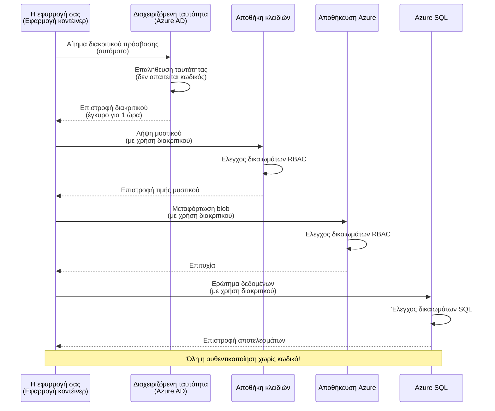
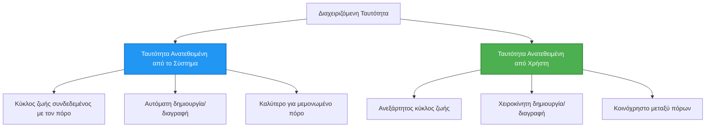

# Πρότυπα Αυθεντικοποίησης και Διαχειριζόμενη Ταυτότητα

⏱️ **Εκτιμώμενος Χρόνος**: 45-60 λεπτά | 💰 **Επιπτώσεις Κόστους**: Δωρεάν (χωρίς επιπλέον χρεώσεις) | ⭐ **Πολυπλοκότητα**: Μεσαίο

**📚 Διαδρομή Μάθησης:**
- ← Προηγούμενο: [Configuration Management](configuration.md) - Διαχείριση μεταβλητών περιβάλλοντος και μυστικών
- 🎯 **Βρίσκεστε εδώ**: Αυθεντικοποίηση & Ασφάλεια (Διαχειριζόμενη Ταυτότητα, Key Vault, ασφαλή πρότυπα)
- → Επόμενο: [First Project](first-project.md) - Δημιουργήστε την πρώτη σας εφαρμογή AZD
- 🏠 [Course Home](../../README.md)

---

## Τι θα μάθετε

Με την ολοκλήρωση αυτού του μαθήματος θα:
- Κατανοήσετε τα πρότυπα αυθεντικοποίησης του Azure (κλειδιά, connection strings, διαχειριζόμενη ταυτότητα)
- Υλοποιήσετε **Διαχειριζόμενη Ταυτότητα** για αυθεντικοποίηση χωρίς κωδικούς πρόσβασης
- Ασφαλίσετε μυστικά με ενσωμάτωση στο **Azure Key Vault**
- Διαμορφώσετε **ελέγχους πρόσβασης βάσει ρόλων (RBAC)** για αναπτύξεις AZD
- Εφαρμόσετε βέλτιστες πρακτικές ασφαλείας σε Container Apps και υπηρεσίες Azure
- Μεταβείτε από αυθεντικοποίηση με κλειδιά σε αυθεντικοποίηση βάσει ταυτότητας

## Γιατί η Διαχειριζόμενη Ταυτότητα έχει σημασία

### Το Πρόβλημα: Παραδοσιακή Αυθεντικοποίηση

**Πριν από τη Διαχειριζόμενη Ταυτότητα:**
```javascript
// ❌ ΚΙΝΔΥΝΟΣ ΑΣΦΑΛΕΙΑΣ: Σκληρά κωδικοποιημένα μυστικά στον κώδικα
const connectionString = "Server=mydb.database.windows.net;User=admin;Password=P@ssw0rd123";
const storageKey = "xK7mN9pQ2wR5tY8uI0oP3aS6dF1gH4jK...";
const cosmosKey = "C2x7B9n4M1p8Q5w3E6r0T2y5U8i1O4p7...";
```

**Προβλήματα:**
- 🔴 **Αποκαλυμμένα μυστικά** σε κώδικα, αρχεία ρυθμίσεων, μεταβλητές περιβάλλοντος
- 🔴 **Η περιστροφή διαπιστευτηρίων** απαιτεί αλλαγές στον κώδικα και επαναανάπτυξη
- 🔴 **Εφιάλτες ελέγχου** - ποιος είχε πρόσβαση σε τι, πότε;
- 🔴 **Διάσπαρτα** - μυστικά διασκορπισμένα σε πολλαπλά συστήματα
- 🔴 **Κίνδυνοι συμμόρφωσης** - αποτυγχάνει σε ελέγχους ασφαλείας

### Η Λύση: Διαχειριζόμενη Ταυτότητα

**Μετά τη Διαχειριζόμενη Ταυτότητα:**
```javascript
// ✅ ΑΣΦΑΛΕΣ: Δεν υπάρχουν μυστικά στον κώδικα
const credential = new DefaultAzureCredential();
const client = new BlobServiceClient(
  "https://mystorageaccount.blob.core.windows.net",
  credential  // Το Azure διαχειρίζεται αυτόματα τον έλεγχο ταυτότητας
);
```

**Οφέλη:**
- ✅ **Καμία μυστική πληροφορία** σε κώδικα ή ρυθμίσεις
- ✅ **Αυτόματη περιστροφή** - το Azure το διαχειρίζεται
- ✅ **Πλήρες ιστορικό ελέγχου** στα αρχεία καταγραφής του Azure AD
- ✅ **Κεντρικοποιημένη ασφάλεια** - διαχείριση μέσω του Azure Portal
- ✅ **Έτοιμο για συμμόρφωση** - πληροί πρότυπα ασφαλείας

**Αναλογία**: Η παραδοσιακή αυθεντικοποίηση είναι σαν να κουβαλάτε πολλαπλά φυσικά κλειδιά για διαφορετικές πόρτες. Η Διαχειριζόμενη Ταυτότητα είναι σαν να έχετε ένα διαβατήριο ασφαλείας που αυτόματα παρέχει πρόσβαση με βάση το ποιος είστε—χωρίς κλειδιά να χάνετε, να αντιγράφετε ή να περιστρέφετε.

---

## Επισκόπηση Αρχιτεκτονικής

### Ροή Αυθεντικοποίησης με Διαχειριζόμενη Ταυτότητα


### Τύποι Διαχειριζόμενων Ταυτοτήτων


| Χαρακτηριστικό | Εκχωρημένη στο Σύστημα | Ανατεθειμένη στον Χρήστη |
|---------|----------------|---------------|
| **Κύκλος Ζωής** | Συνδεδεμένη με τον πόρο | Ανεξάρτητη |
| **Δημιουργία** | Αυτόματη με τον πόρο | Χειροκίνητη δημιουργία |
| **Διαγραφή** | Διαγράφεται με τον πόρο | Παραμένει μετά τη διαγραφή του πόρου |
| **Κοινή χρήση** | Μόνο ένας πόρος | Πολλοί πόροι |
| **Σενάριο Χρήσης** | Απλά σενάρια | Σύνθετα σενάρια πολλαπλών πόρων |
| **Προεπιλογή AZD** | ✅ Συνιστάται | Προαιρετικό |

---

## Προαπαιτούμενα

### Απαιτούμενα Εργαλεία

Θα πρέπει ήδη να έχετε εγκαταστήσει τα εξής από προηγούμενα μαθήματα:

```bash
# Επαληθεύστε το Azure Developer CLI
azd version
# ✅ Αναμενόμενο: έκδοση azd 1.0.0 ή νεότερη

# Επαληθεύστε το Azure CLI
az --version
# ✅ Αναμενόμενο: azure-cli 2.50.0 ή νεότερη
```

### Απαιτήσεις Azure

- Ενεργή συνδρομή Azure
- Δικαιώματα για:
  - Δημιουργία διαχειριζόμενων ταυτοτήτων
  - Ανάθεση ρόλων RBAC
  - Δημιουργία πόρων Key Vault
  - Ανάπτυξη Container Apps

### Προαπαιτούμενες Γνώσεις

Θα πρέπει να έχετε ολοκληρώσει:
- [Installation Guide](installation.md) - Ρύθμιση AZD
- [AZD Basics](azd-basics.md) - Βασικές έννοιες
- [Configuration Management](configuration.md) - Μεταβλητές περιβάλλοντος

---

## Μάθημα 1: Κατανόηση Προτύπων Αυθεντικοποίησης

### Πρότυπο 1: Connection Strings (Παρωχημένο - Αποφύγετε)

**Πώς λειτουργεί:**
```bash
# Η συμβολοσειρά σύνδεσης περιέχει διαπιστευτήρια
STORAGE_CONNECTION_STRING="DefaultEndpointsProtocol=https;AccountName=myaccount;AccountKey=xK7mN9pQ2wR5..."
COSMOS_CONNECTION_STRING="AccountEndpoint=https://myaccount.documents.azure.com:443/;AccountKey=C2x7..."
SQL_CONNECTION_STRING="Server=myserver.database.windows.net;User=admin;Password=P@ssw0rd..."
```

**Προβλήματα:**
- ❌ Μυστικά ορατά σε μεταβλητές περιβάλλοντος
- ❌ Καταγράφονται σε συστήματα ανάπτυξης
- ❌ Δύσκολη περιστροφή
- ❌ Χωρίς ιστορικό πρόσβασης

**Πότε να χρησιμοποιείται:** Μόνο για τοπική ανάπτυξη, ποτέ σε παραγωγή.

---

### Πρότυπο 2: Αναφορές Key Vault (Καλύτερο)

**Πώς λειτουργεί:**
```bicep
// Store secret in Key Vault
resource keyVault 'Microsoft.KeyVault/vaults@2023-02-01' = {
  name: 'mykv'
  properties: {
    enableRbacAuthorization: true
  }
}

// Reference in Container App
env: [
  {
    name: 'STORAGE_KEY'
    secretRef: 'storage-key'  // References Key Vault
  }
]
```

**Οφέλη:**
- ✅ Τα μυστικά αποθηκεύονται με ασφάλεια στο Key Vault
- ✅ Κεντρική διαχείριση μυστικών
- ✅ Περιστροφή χωρίς αλλαγές στον κώδικα

**Περιορισμοί:**
- ⚠️ Ακόμα χρησιμοποιούνται κλειδιά/κωδικοί πρόσβασης
- ⚠️ Απαιτείται διαχείριση πρόσβασης στο Key Vault

**Πότε να χρησιμοποιείται:** Βήμα μετάβασης από connection strings σε Διαχειριζόμενη Ταυτότητα.

---

### Πρότυπο 3: Διαχειριζόμενη Ταυτότητα (Βέλτιστη Πρακτική)

**Πώς λειτουργεί:**
```bicep
// Enable managed identity
resource containerApp 'Microsoft.App/containerApps@2023-05-01' = {
  name: 'myapp'
  identity: {
    type: 'SystemAssigned'  // Automatically creates identity
  }
}

// Grant permissions
resource roleAssignment 'Microsoft.Authorization/roleAssignments@2022-04-01' = {
  scope: storageAccount
  properties: {
    roleDefinitionId: storageBlobDataContributorRole
    principalId: containerApp.identity.principalId
  }
}
```

**Κώδικας εφαρμογής:**
```javascript
// Δεν χρειάζονται μυστικά!
const { DefaultAzureCredential } = require('@azure/identity');
const { BlobServiceClient } = require('@azure/storage-blob');

const credential = new DefaultAzureCredential();
const blobServiceClient = new BlobServiceClient(
  'https://mystorageaccount.blob.core.windows.net',
  credential
);
```

**Οφέλη:**
- ✅ Καμία μυστική πληροφορία σε κώδικα/ρυθμίσεις
- ✅ Αυτόματη περιστροφή διαπιστευτηρίων
- ✅ Πλήρες ιστορικό ελέγχου
- ✅ Δικαιώματα βασισμένα σε RBAC
- ✅ Έτοιμο για συμμόρφωση

**Πότε να χρησιμοποιείται:** Πάντα, για εφαρμογές παραγωγής.

---

## Μάθημα 2: Υλοποίηση Διαχειριζόμενης Ταυτότητας με AZD

### Βήμα-βήμα Υλοποίηση

Ας δημιουργήσουμε μια ασφαλή Container App που χρησιμοποιεί διαχειριζόμενη ταυτότητα για πρόσβαση σε Azure Storage και Key Vault.

### Δομή Έργου

```
secure-app/
├── azure.yaml                 # AZD configuration
├── infra/
│   ├── main.bicep            # Main infrastructure
│   ├── core/
│   │   ├── identity.bicep    # Managed identity setup
│   │   ├── keyvault.bicep    # Key Vault configuration
│   │   └── storage.bicep     # Storage with RBAC
│   └── app/
│       └── container-app.bicep
└── src/
    ├── app.js                # Application code
    ├── package.json
    └── Dockerfile
```

### 1. Διαμόρφωση AZD (azure.yaml)

```yaml
name: secure-app
metadata:
  template: secure-app@1.0.0

services:
  api:
    project: ./src
    language: js
    host: containerapp

# Enable managed identity (AZD handles this automatically)
```

### 2. Υποδομή: Ενεργοποίηση Διαχειριζόμενης Ταυτότητας

Αρχείο: `infra/main.bicep`

```bicep
targetScope = 'subscription'

param environmentName string
param location string = 'eastus'

var tags = { 'azd-env-name': environmentName }

// Resource group
resource rg 'Microsoft.Resources/resourceGroups@2021-04-01' = {
  name: 'rg-${environmentName}'
  location: location
  tags: tags
}

// Storage Account
module storage './core/storage.bicep' = {
  name: 'storage'
  scope: rg
  params: {
    name: 'st${uniqueString(rg.id)}'
    location: location
    tags: tags
  }
}

// Key Vault
module keyVault './core/keyvault.bicep' = {
  name: 'keyvault'
  scope: rg
  params: {
    name: 'kv-${uniqueString(rg.id)}'
    location: location
    tags: tags
  }
}

// Container App with Managed Identity
module containerApp './app/container-app.bicep' = {
  name: 'container-app'
  scope: rg
  params: {
    name: 'ca-${environmentName}'
    location: location
    tags: tags
    storageAccountName: storage.outputs.name
    keyVaultName: keyVault.outputs.name
  }
}

// Grant Container App access to Storage
module storageRoleAssignment './core/role-assignment.bicep' = {
  name: 'storage-role'
  scope: rg
  params: {
    principalId: containerApp.outputs.identityPrincipalId
    roleDefinitionId: 'ba92f5b4-2d11-453d-a403-e96b0029c9fe'  // Storage Blob Data Contributor
    targetResourceId: storage.outputs.id
  }
}

// Grant Container App access to Key Vault
module kvRoleAssignment './core/role-assignment.bicep' = {
  name: 'kv-role'
  scope: rg
  params: {
    principalId: containerApp.outputs.identityPrincipalId
    roleDefinitionId: '4633458b-17de-408a-b874-0445c86b69e6'  // Key Vault Secrets User
    targetResourceId: keyVault.outputs.id
  }
}

// Outputs
output AZURE_STORAGE_ACCOUNT_NAME string = storage.outputs.name
output AZURE_KEY_VAULT_NAME string = keyVault.outputs.name
output APP_URL string = containerApp.outputs.url
```

### 3. Container App με Εκχωρημένη στο Σύστημα Ταυτότητα

Αρχείο: `infra/app/container-app.bicep`

```bicep
param name string
param location string
param tags object = {}
param storageAccountName string
param keyVaultName string

resource containerApp 'Microsoft.App/containerApps@2023-05-01' = {
  name: name
  location: location
  tags: tags
  identity: {
    type: 'SystemAssigned'  // 🔑 Enable managed identity
  }
  properties: {
    configuration: {
      ingress: {
        external: true
        targetPort: 3000
      }
    }
    template: {
      containers: [
        {
          name: 'api'
          image: 'myregistry.azurecr.io/api:latest'
          resources: {
            cpu: json('0.5')
            memory: '1Gi'
          }
          env: [
            {
              name: 'AZURE_STORAGE_ACCOUNT_NAME'
              value: storageAccountName
            }
            {
              name: 'AZURE_KEY_VAULT_NAME'
              value: keyVaultName
            }
            // 🔑 No secrets - managed identity handles authentication!
          ]
        }
      ]
    }
  }
}

// Output the identity for RBAC assignments
output identityPrincipalId string = containerApp.identity.principalId
output id string = containerApp.id
output url string = 'https://${containerApp.properties.configuration.ingress.fqdn}'
```

### 4. Μονάδα Ανάθεσης Ρόλου RBAC

Αρχείο: `infra/core/role-assignment.bicep`

```bicep
param principalId string
param roleDefinitionId string  // Azure built-in role ID
param targetResourceId string

resource roleAssignment 'Microsoft.Authorization/roleAssignments@2022-04-01' = {
  name: guid(principalId, roleDefinitionId, targetResourceId)
  scope: resourceId('Microsoft.Resources/resourceGroups', resourceGroup().name)
  properties: {
    roleDefinitionId: subscriptionResourceId('Microsoft.Authorization/roleDefinitions', roleDefinitionId)
    principalId: principalId
    principalType: 'ServicePrincipal'
  }
}

output id string = roleAssignment.id
```

### 5. Κώδικας Εφαρμογής με Διαχειριζόμενη Ταυτότητα

Αρχείο: `src/app.js`

```javascript
const express = require('express');
const { DefaultAzureCredential } = require('@azure/identity');
const { BlobServiceClient } = require('@azure/storage-blob');
const { SecretClient } = require('@azure/keyvault-secrets');

const app = express();
const PORT = process.env.PORT || 3000;

// 🔑 Αρχικοποίηση διαπιστευτηρίου (λειτουργεί αυτόματα με διαχειριζόμενη ταυτότητα)
const credential = new DefaultAzureCredential();

// Ρύθμιση Azure Storage
const storageAccountName = process.env.AZURE_STORAGE_ACCOUNT_NAME;
const blobServiceClient = new BlobServiceClient(
  `https://${storageAccountName}.blob.core.windows.net`,
  credential  // Δεν απαιτούνται κλειδιά!
);

// Ρύθμιση Key Vault
const keyVaultName = process.env.AZURE_KEY_VAULT_NAME;
const secretClient = new SecretClient(
  `https://${keyVaultName}.vault.azure.net`,
  credential  // Δεν απαιτούνται κλειδιά!
);

// Έλεγχος υγείας
app.get('/health', (req, res) => {
  res.json({ status: 'healthy', authentication: 'managed-identity' });
});

// Μεταφόρτωση αρχείου στο blob storage
app.post('/upload', async (req, res) => {
  try {
    const containerClient = blobServiceClient.getContainerClient('uploads');
    await containerClient.createIfNotExists();
    
    const blobName = `file-${Date.now()}.txt`;
    const blockBlobClient = containerClient.getBlockBlobClient(blobName);
    
    await blockBlobClient.upload('Hello from managed identity!', 30);
    
    res.json({
      success: true,
      blobName: blobName,
      message: 'File uploaded using managed identity!'
    });
  } catch (error) {
    console.error('Upload error:', error);
    res.status(500).json({ error: error.message });
  }
});

// Λήψη μυστικού από το Key Vault
app.get('/secret/:name', async (req, res) => {
  try {
    const secretName = req.params.name;
    const secret = await secretClient.getSecret(secretName);
    
    res.json({
      name: secretName,
      value: secret.value,
      message: 'Secret retrieved using managed identity!'
    });
  } catch (error) {
    console.error('Secret error:', error);
    res.status(500).json({ error: error.message });
  }
});

// Λίστα κοντέινερ blob (δείχνει πρόσβαση ανάγνωσης)
app.get('/containers', async (req, res) => {
  try {
    const containers = [];
    for await (const container of blobServiceClient.listContainers()) {
      containers.push(container.name);
    }
    
    res.json({
      containers: containers,
      count: containers.length,
      message: 'Containers listed using managed identity!'
    });
  } catch (error) {
    console.error('List error:', error);
    res.status(500).json({ error: error.message });
  }
});

app.listen(PORT, () => {
  console.log(`Secure API listening on port ${PORT}`);
  console.log('Authentication: Managed Identity (passwordless)');
});
```

Αρχείο: `src/package.json`

```json
{
  "name": "secure-app",
  "version": "1.0.0",
  "dependencies": {
    "express": "^4.18.2",
    "@azure/identity": "^4.0.0",
    "@azure/storage-blob": "^12.17.0",
    "@azure/keyvault-secrets": "^4.7.0"
  },
  "scripts": {
    "start": "node app.js"
  }
}
```

### 6. Ανάπτυξη και Δοκιμή

```bash
# Αρχικοποιήστε το περιβάλλον AZD
azd init

# Αναπτύξτε την υποδομή και την εφαρμογή
azd up

# Λάβετε το URL της εφαρμογής
APP_URL=$(azd env get-values | grep APP_URL | cut -d '=' -f2 | tr -d '"')

# Δοκιμάστε τον έλεγχο υγείας
curl $APP_URL/health
```

**✅ Αναμενόμενη έξοδος:**
```json
{
  "status": "healthy",
  "authentication": "managed-identity"
}
```

**Δοκιμή μεταφόρτωσης blob:**
```bash
curl -X POST $APP_URL/upload
```

**✅ Αναμενόμενη έξοδος:**
```json
{
  "success": true,
  "blobName": "file-1700404800000.txt",
  "message": "File uploaded using managed identity!"
}
```

**Δοκιμή λίστας κοντέινερ:**
```bash
curl $APP_URL/containers
```

**✅ Αναμενόμενη έξοδος:**
```json
{
  "containers": ["uploads"],
  "count": 1,
  "message": "Containers listed using managed identity!"
}
```

---

## Συνήθεις Ρόλοι Azure RBAC

### Ενσωματωμένα IDs Ρόλων για Διαχειριζόμενη Ταυτότητα

| Υπηρεσία | Όνομα Ρόλου | ID Ρόλου | Δικαιώματα |
|---------|-----------|---------|-------------|
| **Storage** | Storage Blob Data Reader | `2a2b9908-6b94-4a3d-8e5a-a7d8f8cc8a12` | Ανάγνωση blobs και containers |
| **Storage** | Storage Blob Data Contributor | `ba92f5b4-2d11-453d-a403-e96b0029c9fe` | Ανάγνωση, εγγραφή, διαγραφή blobs |
| **Storage** | Storage Queue Data Contributor | `974c5e8b-45b9-4653-ba55-5f855dd0fb88` | Ανάγνωση, εγγραφή, διαγραφή μηνυμάτων ουράς |
| **Key Vault** | Key Vault Secrets User | `4633458b-17de-408a-b874-0445c86b69e6` | Ανάγνωση μυστικών |
| **Key Vault** | Key Vault Secrets Officer | `b86a8fe4-44ce-4948-aee5-eccb2c155cd7` | Ανάγνωση, εγγραφή, διαγραφή μυστικών |
| **Cosmos DB** | Cosmos DB Built-in Data Reader | `00000000-0000-0000-0000-000000000001` | Ανάγνωση δεδομένων Cosmos DB |
| **Cosmos DB** | Cosmos DB Built-in Data Contributor | `00000000-0000-0000-0000-000000000002` | Ανάγνωση, εγγραφή δεδομένων Cosmos DB |
| **SQL Database** | SQL DB Contributor | `9b7fa17d-e63e-47b0-bb0a-15c516ac86ec` | Διαχείριση βάσεων δεδομένων SQL |
| **Service Bus** | Azure Service Bus Data Owner | `090c5cfd-751d-490a-894a-3ce6f1109419` | Αποστολή, λήψη, διαχείριση μηνυμάτων |

### Πώς να βρείτε τα IDs Ρόλων

```bash
# Κατάλογος όλων των ενσωματωμένων ρόλων
az role definition list --query "[].{Name:roleName, ID:name}" --output table

# Αναζήτηση συγκεκριμένου ρόλου
az role definition list --query "[?contains(roleName, 'Storage Blob')].{Name:roleName, ID:name}" --output table

# Λήψη λεπτομερειών ρόλου
az role definition list --name "Storage Blob Data Contributor"
```

---

## Πρακτικές Ασκήσεις

### Άσκηση 1: Ενεργοποίηση Διαχειριζόμενης Ταυτότητας για Υπάρχουσα Εφαρμογή ⭐⭐ (Μεσαίο)

**Στόχος**: Προσθήκη διαχειριζόμενης ταυτότητας σε υπάρχουσα ανάπτυξη Container App

**Σενάριο**: Έχετε ένα Container App που χρησιμοποιεί connection strings. Μετατρέψτε το σε χρήση διαχειριζόμενης ταυτότητας.

**Αρχικό σημείο**: Container App με αυτή τη διαμόρφωση:

```bicep
// ❌ Current: Using connection string
env: [
  {
    name: 'STORAGE_CONNECTION_STRING'
    secretRef: 'storage-connection'
  }
]
```

**Βήματα**:

1. **Ενεργοποιήστε διαχειριζόμενη ταυτότητα στο Bicep:**

```bicep
resource containerApp 'Microsoft.App/containerApps@2023-05-01' = {
  name: 'myapp'
  identity: {
    type: 'SystemAssigned'  // Add this
  }
  // ... rest of configuration
}
```

2. **Παραχωρήστε πρόσβαση στο Storage:**

```bicep
// Get storage account reference
resource storageAccount 'Microsoft.Storage/storageAccounts@2023-01-01' existing = {
  name: storageAccountName
}

// Assign role
resource roleAssignment 'Microsoft.Authorization/roleAssignments@2022-04-01' = {
  name: guid(containerApp.id, 'ba92f5b4-2d11-453d-a403-e96b0029c9fe', storageAccount.id)
  scope: storageAccount
  properties: {
    roleDefinitionId: subscriptionResourceId('Microsoft.Authorization/roleDefinitions', 'ba92f5b4-2d11-453d-a403-e96b0029c9fe')
    principalId: containerApp.identity.principalId
    principalType: 'ServicePrincipal'
  }
}
```

3. **Ενημερώστε τον κώδικα εφαρμογής:**

**Πριν (connection string):**
```javascript
const { BlobServiceClient } = require('@azure/storage-blob');

const blobServiceClient = BlobServiceClient.fromConnectionString(
  process.env.STORAGE_CONNECTION_STRING
);
```

**Μετά (managed identity):**
```javascript
const { DefaultAzureCredential } = require('@azure/identity');
const { BlobServiceClient } = require('@azure/storage-blob');

const credential = new DefaultAzureCredential();
const blobServiceClient = new BlobServiceClient(
  `https://${process.env.STORAGE_ACCOUNT_NAME}.blob.core.windows.net`,
  credential
);
```

4. **Ενημερώστε τις μεταβλητές περιβάλλοντος:**

```bicep
env: [
  {
    name: 'STORAGE_ACCOUNT_NAME'
    value: storageAccountName  // Just the name, no secrets!
  }
  // Remove STORAGE_CONNECTION_STRING
]
```

5. **Αναπτύξτε και δοκιμάστε:**

```bash
# Αναπτύξτε ξανά
azd up

# Δοκιμάστε ότι εξακολουθεί να λειτουργεί
curl https://myapp.azurecontainerapps.io/upload
```

**✅ Κριτήρια Επιτυχίας:**
- ✅ Η εφαρμογή αναπτύσσεται χωρίς σφάλματα
- ✅ Οι λειτουργίες Storage δουλεύουν (upload, list, download)
- ✅ Καμία connection string στις μεταβλητές περιβάλλοντος
- ✅ Η ταυτότητα είναι ορατή στο Azure Portal στην καρτέλα "Identity"

**Επαλήθευση:**

```bash
# Ελέγξτε ότι η διαχειριζόμενη ταυτότητα είναι ενεργοποιημένη
az containerapp show \
  --name myapp \
  --resource-group rg-myapp \
  --query "identity.type"
# ✅ Αναμενόμενο: "SystemAssigned"

# Ελέγξτε την ανάθεση ρόλου
az role assignment list \
  --assignee $(az containerapp show --name myapp --resource-group rg-myapp --query "identity.principalId" -o tsv) \
  --scope /subscriptions/{sub-id}/resourceGroups/rg-myapp/providers/Microsoft.Storage/storageAccounts/mystorageaccount
# ✅ Αναμενόμενο: Εμφανίζει τον ρόλο "Storage Blob Data Contributor"
```

**Χρόνος**: 20-30 λεπτά

---

### Άσκηση 2: Πρόσβαση σε Πολλαπλές Υπηρεσίες με Ταυτότητα Ανατεθειμένη από τον Χρήστη ⭐⭐⭐ (Προχωρημένο)

**Στόχος**: Δημιουργία ταυτότητας ανατεθειμένης από τον χρήστη που μοιράζεται σε πολλαπλά Container Apps

**Σενάριο**: Έχετε 3 μικροϋπηρεσίες που όλες χρειάζονται πρόσβαση στον ίδιο λογαριασμό Storage και Key Vault.

**Βήματα**:

1. **Δημιουργία ταυτότητας ανατεθειμένης από τον χρήστη:**

Αρχείο: `infra/core/identity.bicep`

```bicep
param name string
param location string
param tags object = {}

resource userAssignedIdentity 'Microsoft.ManagedIdentity/userAssignedIdentities@2023-01-31' = {
  name: name
  location: location
  tags: tags
}

output id string = userAssignedIdentity.id
output principalId string = userAssignedIdentity.properties.principalId
output clientId string = userAssignedIdentity.properties.clientId
```

2. **Ανάθεση ρόλων στην ταυτότητα ανατεθειμένη από τον χρήστη:**

```bicep
// In main.bicep
module userIdentity './core/identity.bicep' = {
  name: 'user-identity'
  scope: rg
  params: {
    name: 'id-${environmentName}'
    location: location
    tags: tags
  }
}

// Grant Storage access
resource storageRoleAssignment 'Microsoft.Authorization/roleAssignments@2022-04-01' = {
  name: guid(userIdentity.outputs.principalId, 'storage-contributor')
  scope: storageAccount
  properties: {
    roleDefinitionId: subscriptionResourceId('Microsoft.Authorization/roleDefinitions', 'ba92f5b4-2d11-453d-a403-e96b0029c9fe')
    principalId: userIdentity.outputs.principalId
    principalType: 'ServicePrincipal'
  }
}

// Grant Key Vault access
resource kvRoleAssignment 'Microsoft.Authorization/roleAssignments@2022-04-01' = {
  name: guid(userIdentity.outputs.principalId, 'kv-secrets-user')
  scope: keyVault
  properties: {
    roleDefinitionId: subscriptionResourceId('Microsoft.Authorization/roleDefinitions', '4633458b-17de-408a-b874-0445c86b69e6')
    principalId: userIdentity.outputs.principalId
    principalType: 'ServicePrincipal'
  }
}
```

3. **Ανάθεση ταυτότητας σε πολλαπλά Container Apps:**

```bicep
resource apiGateway 'Microsoft.App/containerApps@2023-05-01' = {
  name: 'api-gateway'
  identity: {
    type: 'UserAssigned'
    userAssignedIdentities: {
      '${userIdentity.outputs.id}': {}
    }
  }
  // ... rest of config
}

resource productService 'Microsoft.App/containerApps@2023-05-01' = {
  name: 'product-service'
  identity: {
    type: 'UserAssigned'
    userAssignedIdentities: {
      '${userIdentity.outputs.id}': {}
    }
  }
  // ... rest of config
}

resource orderService 'Microsoft.App/containerApps@2023-05-01' = {
  name: 'order-service'
  identity: {
    type: 'UserAssigned'
    userAssignedIdentities: {
      '${userIdentity.outputs.id}': {}
    }
  }
  // ... rest of config
}
```

4. **Κώδικας εφαρμογής (όλες οι υπηρεσίες χρησιμοποιούν το ίδιο πρότυπο):**

```javascript
const { DefaultAzureCredential, ManagedIdentityCredential } = require('@azure/identity');

// Για την ταυτότητα που έχει ανατεθεί από τον χρήστη, καθορίστε το αναγνωριστικό πελάτη
const credential = new ManagedIdentityCredential(
  process.env.AZURE_CLIENT_ID  // Αναγνωριστικό πελάτη της ταυτότητας που έχει ανατεθεί από τον χρήστη
);

// Ή χρησιμοποιήστε το DefaultAzureCredential (εντοπίζει αυτόματα)
const credential = new DefaultAzureCredential();

const blobServiceClient = new BlobServiceClient(
  `https://${process.env.STORAGE_ACCOUNT_NAME}.blob.core.windows.net`,
  credential
);
```

5. **Ανάπτυξη και επαλήθευση:**

```bash
azd up

# Ελέγξτε ότι όλες οι υπηρεσίες μπορούν να αποκτήσουν πρόσβαση στον αποθηκευτικό χώρο
curl https://api-gateway.azurecontainerapps.io/upload
curl https://product-service.azurecontainerapps.io/upload
curl https://order-service.azurecontainerapps.io/upload
```

**✅ Κριτήρια Επιτυχίας:**
- ✅ Μια ταυτότητα μοιράζεται σε 3 υπηρεσίες
- ✅ Όλες οι υπηρεσίες μπορούν να προσπελάσουν Storage και Key Vault
- ✅ Η ταυτότητα παραμένει αν διαγράψετε μία υπηρεσία
- ✅ Κεντρική διαχείριση δικαιωμάτων

**Οφέλη της Ταυτότητας Ανατεθειμένης από τον Χρήστη:**
- Μια ταυτότητα για διαχείριση
- Συνεπή δικαιώματα μεταξύ υπηρεσιών
- Παραμένει μετά τη διαγραφή υπηρεσίας
- Καλύτερη για σύνθετες αρχιτεκτονικές

**Χρόνος**: 30-40 λεπτά

---

### Άσκηση 3: Υλοποίηση Περιστροφής Μυστικών Key Vault ⭐⭐⭐ (Προχωρημένο)

**Στόχος**: Αποθήκευση κλειδιών API τρίτων στο Key Vault και πρόσβαση σε αυτά χρησιμοποιώντας διαχειριζόμενη ταυτότητα

**Σενάριο**: Η εφαρμογή σας πρέπει να καλεί ένα εξωτερικό API (OpenAI, Stripe, SendGrid) που απαιτεί κλειδιά API.

**Βήματα**:

1. **Δημιουργία Key Vault με RBAC:**

Αρχείο: `infra/core/keyvault.bicep`

```bicep
param name string
param location string
param tags object = {}

resource keyVault 'Microsoft.KeyVault/vaults@2023-02-01' = {
  name: name
  location: location
  tags: tags
  properties: {
    enableRbacAuthorization: true  // Use RBAC instead of access policies
    sku: {
      family: 'A'
      name: 'standard'
    }
    tenantId: subscription().tenantId
    enableSoftDelete: true
    softDeleteRetentionInDays: 90
  }
}

// Allow Container App to read secrets
output id string = keyVault.id
output name string = keyVault.name
output uri string = keyVault.properties.vaultUri
```

2. **Αποθήκευση μυστικών στο Key Vault:**

```bash
# Λήψη ονόματος του Key Vault
KV_NAME=$(azd env get-values | grep AZURE_KEY_VAULT_NAME | cut -d '=' -f2 | tr -d '"')

# Αποθήκευση κλειδιών API τρίτων
az keyvault secret set \
  --vault-name $KV_NAME \
  --name "OpenAI-ApiKey" \
  --value "sk-proj-xxxxxxxxxxxxx"

az keyvault secret set \
  --vault-name $KV_NAME \
  --name "Stripe-ApiKey" \
  --value "sk_live_xxxxxxxxxxxxx"

az keyvault secret set \
  --vault-name $KV_NAME \
  --name "SendGrid-ApiKey" \
  --value "SG.xxxxxxxxxxxxx"
```

3. **Κώδικας εφαρμογής για ανάκτηση μυστικών:**

Αρχείο: `src/config.js`

```javascript
const { DefaultAzureCredential } = require('@azure/identity');
const { SecretClient } = require('@azure/keyvault-secrets');

class Config {
  constructor() {
    this.credential = new DefaultAzureCredential();
    this.secretClient = new SecretClient(
      `https://${process.env.AZURE_KEY_VAULT_NAME}.vault.azure.net`,
      this.credential
    );
    this.cache = {};
  }

  async getSecret(secretName) {
    // Ελέγξτε πρώτα την κρυφή μνήμη
    if (this.cache[secretName]) {
      return this.cache[secretName];
    }

    try {
      const secret = await this.secretClient.getSecret(secretName);
      this.cache[secretName] = secret.value;
      console.log(`✅ Retrieved secret: ${secretName}`);
      return secret.value;
    } catch (error) {
      console.error(`❌ Failed to get secret ${secretName}:`, error.message);
      throw error;
    }
  }

  async getOpenAIKey() {
    return this.getSecret('OpenAI-ApiKey');
  }

  async getStripeKey() {
    return this.getSecret('Stripe-ApiKey');
  }

  async getSendGridKey() {
    return this.getSecret('SendGrid-ApiKey');
  }
}

module.exports = new Config();
```

4. **Χρήση μυστικών στην εφαρμογή:**

Αρχείο: `src/app.js`

```javascript
const express = require('express');
const config = require('./config');
const { OpenAI } = require('openai');

const app = express();

// Αρχικοποιήστε το OpenAI με το κλειδί από το Key Vault
let openaiClient;

async function initializeServices() {
  const openaiKey = await config.getOpenAIKey();
  openaiClient = new OpenAI({ apiKey: openaiKey });
  console.log('✅ Services initialized with secrets from Key Vault');
}

// Κλήση κατά την εκκίνηση
initializeServices().catch(console.error);

app.post('/chat', async (req, res) => {
  try {
    const completion = await openaiClient.chat.completions.create({
      model: 'gpt-4.1',
      messages: [{ role: 'user', content: 'Hello!' }]
    });
    
    res.json({
      response: completion.choices[0].message.content,
      authentication: 'Key from Key Vault via Managed Identity'
    });
  } catch (error) {
    res.status(500).json({ error: error.message });
  }
});

app.listen(3000, () => {
  console.log('Secure API with Key Vault integration running');
});
```

5. **Ανάπτυξη και δοκιμή:**

```bash
azd up

# Ελέγξτε ότι τα κλειδιά API λειτουργούν
curl -X POST https://myapp.azurecontainerapps.io/chat \
  -H "Content-Type: application/json" \
  -d '{"message":"Hello AI"}'
```

**✅ Κριτήρια Επιτυχίας:**
- ✅ Κανένα API key σε κώδικα ή μεταβλητές περιβάλλοντος
- ✅ Η εφαρμογή ανακτά κλειδιά από το Key Vault
- ✅ Τα API τρίτων λειτουργούν σωστά
- ✅ Μπορείτε να περιστρέψετε κλειδιά χωρίς αλλαγές στον κώδικα

**Περιστροφή ενός μυστικού:**

```bash
# Ενημέρωση μυστικού στο Key Vault
az keyvault secret set \
  --vault-name $KV_NAME \
  --name "OpenAI-ApiKey" \
  --value "sk-proj-NEW_KEY_HERE"

# Επανεκκινήστε την εφαρμογή για να χρησιμοποιήσει το νέο κλειδί
az containerapp revision restart \
  --name myapp \
  --resource-group rg-myapp
```

**Χρόνος**: 25-35 λεπτά

---

## Σημείο Ελέγχου Γνώσεων

### 1. Πρότυπα Αυθεντικοποίησης ✓

Δοκιμάστε την κατανόησή σας:

- [ ] **Q1**: Ποια είναι τα τρία κύρια πρότυπα αυθεντικοποίησης; 
  - **A**: Connection strings (παρωχημένο), Key Vault references (μετάβαση), Διαχειριζόμενη Ταυτότητα (βέλτιστη πρακτική)

- [ ] **Q2**: Γιατί η διαχειριζόμενη ταυτότητα είναι καλύτερη από τα connection strings;
  - **A**: Κανένα μυστικό στον κώδικα, αυτόματη περιστροφή, πλήρες ιστορικό ελέγχου, δικαιώματα RBAC

- [ ] **Q3**: Πότε θα χρησιμοποιήσετε ταυτότητα ανατεθειμένη από τον χρήστη αντί για εκχωρημένη στο σύστημα;
  - **A**: Όταν μοιράζεστε ταυτότητα ανάμεσα σε πολλούς πόρους ή όταν ο κύκλος ζωής της ταυτότητας είναι ανεξάρτητος από τον πόρο

**Hands-On Verification:**
```bash
# Ελέγξτε ποιον τύπο ταυτότητας χρησιμοποιεί η εφαρμογή σας
az containerapp show \
  --name myapp \
  --resource-group rg-myapp \
  --query "identity.type"

# Καταγράψτε όλες τις εκχωρήσεις ρόλων για την ταυτότητα
az role assignment list \
  --assignee $(az containerapp show --name myapp --resource-group rg-myapp --query "identity.principalId" -o tsv)
```

---

### 2. RBAC και Δικαιώματα ✓

Δοκιμάστε την κατανόησή σας:

- [ ] **Q1**: Ποιο είναι το ID ρόλου για "Storage Blob Data Contributor";
  - **A**: `ba92f5b4-2d11-453d-a403-e96b0029c9fe`

- [ ] **Q2**: Τι δικαιώματα παρέχει ο "Key Vault Secrets User";
  - **A**: Πρόσβαση μόνο για ανάγνωση σε μυστικά (δεν μπορεί να δημιουργήσει, ενημερώσει ή διαγράψει)

- [ ] **Q3**: Πώς παραχωρείτε σε ένα Container App πρόσβαση σε Azure SQL;
  - **A**: Αναθέτοντας τον ρόλο "SQL DB Contributor" ή διαμορφώνοντας αυθεντικοποίηση Azure AD για το SQL

**Hands-On Verification:**
```bash
# Εύρεση συγκεκριμένου ρόλου
az role definition list --name "Storage Blob Data Contributor"

# Ελέγξτε ποιους ρόλους έχουν εκχωρηθεί στην ταυτότητά σας
PRINCIPAL_ID=$(az containerapp show --name myapp --resource-group rg-myapp --query "identity.principalId" -o tsv)
az role assignment list --assignee $PRINCIPAL_ID --output table
```

---

### 3. Ενσωμάτωση Key Vault ✓

Δοκιμάστε την κατανόησή σας:
- [ ] **Q1**: Πώς ενεργοποιείτε το RBAC για το Key Vault αντί για πολιτικές πρόσβασης;
  - **A**: Ορίστε `enableRbacAuthorization: true` στο Bicep

- [ ] **Q2**: Ποια βιβλιοθήκη του Azure SDK χειρίζεται την αυθεντικοποίηση με διαχειριζόμενη ταυτότητα;
  - **A**: `@azure/identity` με την κλάση `DefaultAzureCredential`

- [ ] **Q3**: Πόσο διαρκούν τα μυστικά του Key Vault στην κρυφή μνήμη;
  - **A**: Εξαρτάται από την εφαρμογή· υλοποιήστε τη δική σας στρατηγική προσωρινής αποθήκευσης

**Πρακτική Επαλήθευση:**
```bash
# Δοκιμή πρόσβασης στο Key Vault
az keyvault secret show \
  --vault-name $KV_NAME \
  --name "OpenAI-ApiKey" \
  --query "value"

# Ελέγξτε ότι το RBAC είναι ενεργοποιημένο
az keyvault show \
  --name $KV_NAME \
  --query "properties.enableRbacAuthorization"
# ✅ Αναμενόμενο: true
```

---

## Καλές Πρακτικές Ασφαλείας

### ✅ Κάντε:

1. **Χρησιμοποιήστε πάντα διαχειριζόμενη ταυτότητα σε παραγωγικό περιβάλλον**
   ```bicep
   identity: {
     type: 'SystemAssigned'
   }
   ```

2. **Χρησιμοποιήστε ρόλους RBAC με ελάχιστα προνόμια**
   - Χρησιμοποιήστε ρόλους "Reader" όταν είναι δυνατό
   - Αποφύγετε τους ρόλους "Owner" ή "Contributor" εκτός αν είναι απαραίτητο

3. **Αποθηκεύστε κλειδιά τρίτων στο Key Vault**
   ```javascript
   const apiKey = await secretClient.getSecret('ThirdPartyApiKey');
   ```

4. **Ενεργοποιήστε την καταγραφή ελέγχου**
   ```bicep
   diagnosticSettings: {
     logs: [{ category: 'AuditEvent', enabled: true }]
   }
   ```

5. **Χρησιμοποιήστε διαφορετικές ταυτότητες για dev/staging/prod**
   ```bash
   azd env new dev
   azd env new staging
   azd env new prod
   ```

6. **Ανανεώνετε τα μυστικά τακτικά**
   - Ορίστε ημερομηνίες λήξης για τα μυστικά του Key Vault
   - Αυτοματοποιήστε την ανανέωση με Azure Functions

### ❌ Μην:

1. **Μην αποθηκεύετε ποτέ μυστικά ενσωματωμένα στον κώδικα**
   ```javascript
   // ❌ ΚΑΚΟ
   const apiKey = "sk-proj-xxxxxxxxxxxxx";
   ```

2. **Μην χρησιμοποιείτε connection strings σε παραγωγή**
   ```javascript
   // ❌ ΚΑΚΟ
   BlobServiceClient.fromConnectionString(process.env.STORAGE_CONNECTION_STRING)
   ```

3. **Μην χορηγείτε υπερβολικά δικαιώματα**
   ```bicep
   // ❌ BAD - too much access
   roleDefinitionId: 'Owner'
   
   // ✅ GOOD - least privilege
   roleDefinitionId: 'Storage Blob Data Reader'
   ```

4. **Μην καταγράφετε μυστικά στα logs**
   ```javascript
   // ❌ ΚΑΚΟ
   console.log('API Key:', apiKey);
   
   // ✅ ΚΑΛΟ
   console.log('API Key retrieved successfully');
   ```

5. **Μην μοιράζεστε τις παραγωγικές ταυτότητες μεταξύ περιβαλλόντων**
   ```bicep
   // ❌ BAD - same identity for dev and prod
   // ✅ GOOD - separate identities per environment
   ```

---

## Οδηγός Επίλυσης Προβλημάτων

### Πρόβλημα: "Unauthorized" κατά την πρόσβαση στο Azure Storage

**Συμπτώματα:**
```
Error: Unauthorized (403)
AuthorizationPermissionMismatch: This request is not authorized to perform this operation
```

**Διάγνωση:**

```bash
# Ελέγξτε αν η διαχειριζόμενη ταυτότητα είναι ενεργοποιημένη
az containerapp show \
  --name myapp \
  --resource-group rg-myapp \
  --query "identity.type"
# ✅ Αναμενόμενο: "SystemAssigned" ή "UserAssigned"

# Ελέγξτε τις αναθέσεις ρόλων
PRINCIPAL_ID=$(az containerapp show --name myapp --resource-group rg-myapp --query "identity.principalId" -o tsv)
az role assignment list --assignee $PRINCIPAL_ID

# Αναμενόμενο: Θα πρέπει να βλέπετε "Storage Blob Data Contributor" ή παρόμοιο ρόλο
```

**Λύσεις:**

1. **Χορηγήστε τον σωστό ρόλο RBAC:**
```bash
STORAGE_ID=$(az storage account show --name mystorageaccount --resource-group rg-myapp --query "id" -o tsv)
az role assignment create \
  --assignee $PRINCIPAL_ID \
  --role "Storage Blob Data Contributor" \
  --scope $STORAGE_ID
```

2. **Περιμένετε την εξάπλωση (μπορεί να πάρει 5-10 λεπτά):**
```bash
# Ελέγξτε την κατάσταση ανάθεσης ρόλου
az role assignment list --assignee $PRINCIPAL_ID --scope $STORAGE_ID
```

3. **Επαληθεύστε ότι ο κώδικας της εφαρμογής χρησιμοποιεί το σωστό διαπιστευτήριο:**
```javascript
// Βεβαιωθείτε ότι χρησιμοποιείτε το DefaultAzureCredential
const credential = new DefaultAzureCredential();
```

---

### Πρόβλημα: Άρνηση πρόσβασης στο Key Vault

**Συμπτώματα:**
```
Error: Forbidden (403)
The user, group or application does not have secrets get permission
```

**Διάγνωση:**

```bash
# Ελέγξτε ότι το RBAC του Key Vault είναι ενεργοποιημένο
az keyvault show \
  --name $KV_NAME \
  --query "properties.enableRbacAuthorization"
# ✅ Αναμενόμενο: true

# Ελέγξτε τις αναθέσεις ρόλων
az role assignment list \
  --assignee $PRINCIPAL_ID \
  --scope /subscriptions/{sub-id}/resourceGroups/rg-myapp/providers/Microsoft.KeyVault/vaults/$KV_NAME
```

**Λύσεις:**

1. **Ενεργοποιήστε το RBAC στο Key Vault:**
```bash
az keyvault update \
  --name $KV_NAME \
  --enable-rbac-authorization true
```

2. **Χορηγήστε τον ρόλο Key Vault Secrets User:**
```bash
KV_ID=$(az keyvault show --name $KV_NAME --query "id" -o tsv)
az role assignment create \
  --assignee $PRINCIPAL_ID \
  --role "Key Vault Secrets User" \
  --scope $KV_ID
```

---

### Πρόβλημα: Το DefaultAzureCredential αποτυγχάνει τοπικά

**Συμπτώματα:**
```
Error: DefaultAzureCredential failed to retrieve a token
CredentialUnavailableError: No credential available
```

**Διάγνωση:**

```bash
# Ελέγξτε εάν έχετε συνδεθεί
az account show

# Ελέγξτε την αυθεντικοποίηση του Azure CLI
az ad signed-in-user show
```

**Λύσεις:**

1. **Συνδεθείτε στο Azure CLI:**
```bash
az login
```

2. **Ορίστε την συνδρομή Azure:**
```bash
az account set --subscription "Your Subscription Name"
```

3. **Για τοπική ανάπτυξη, χρησιμοποιήστε μεταβλητές περιβάλλοντος:**
```bash
export AZURE_TENANT_ID="your-tenant-id"
export AZURE_CLIENT_ID="your-client-id"
export AZURE_CLIENT_SECRET="your-client-secret"
```

4. **Ή χρησιμοποιήστε διαφορετικό διαπιστευτήριο τοπικά:**
```javascript
const { DefaultAzureCredential, AzureCliCredential } = require('@azure/identity');

// Χρησιμοποιήστε το AzureCliCredential για τοπική ανάπτυξη
const credential = process.env.NODE_ENV === 'production' 
  ? new DefaultAzureCredential()
  : new AzureCliCredential();
```

---

### Πρόβλημα: Η ανάθεση ρόλου χρειάζεται πολύ χρόνο για να εξαπλωθεί

**Συμπτώματα:**
- Ο ρόλος ανατέθηκε με επιτυχία
- Συνεχίζετε να λαμβάνετε σφάλματα 403
- Διακοπτόμενη πρόσβαση (μερικές φορές λειτουργεί, μερικές όχι)

**Εξήγηση:**
Οι αλλαγές στο Azure RBAC μπορεί να χρειαστούν 5-10 λεπτά για να εξαπλωθούν παγκοσμίως.

**Λύση:**

```bash
# Περιμένετε και δοκιμάστε ξανά
echo "Waiting for RBAC propagation..."
sleep 300  # Περιμένετε 5 λεπτά

# Δοκιμάστε την πρόσβαση
curl https://myapp.azurecontainerapps.io/upload

# Εάν εξακολουθεί να αποτυγχάνει, επανεκκινήστε την εφαρμογή
az containerapp revision restart \
  --name myapp \
  --resource-group rg-myapp
```

---

## Παράγοντες κόστους

### Κόστη Διαχειριζόμενης Ταυτότητας

| Πόρος | Κόστος |
|----------|------|
| **Διαχειριζόμενη Ταυτότητα** | 🆓 **ΔΩΡΕΑΝ** - Χωρίς χρέωση |
| **Αναθέσεις ρόλων RBAC** | 🆓 **ΔΩΡΕΑΝ** - Χωρίς χρέωση |
| **Αιτήσεις token του Azure AD** | 🆓 **ΔΩΡΕΑΝ** - Περιλαμβάνονται |
| **Λειτουργίες Key Vault** | $0.03 ανά 10.000 λειτουργίες |
| **Αποθήκευση Key Vault** | $0.024 ανά μυστικό το μήνα |

Η διαχειριζόμενη ταυτότητα εξοικονομεί χρήματα με:
- ✅ Εξαλείφοντας τις λειτουργίες Key Vault για την αυθεντικοποίηση υπηρεσίας προς υπηρεσία
- ✅ Μείωση περιστατικών ασφαλείας (καμία διαρροή διαπιστευτηρίων)
- ✅ Μείωση του λειτουργικού φόρτου (χωρίς χειροκίνητη ανανέωση)

Παράδειγμα σύγκρισης κόστους (μηνιαίο):

| Σενάριο | Connection Strings | Διαχειριζόμενη Ταυτότητα | Εξοικονόμηση |
|----------|-------------------|-----------------|---------|
| Μικρή εφαρμογή (1M αιτήσεις) | ~$50 (Key Vault + λειτουργίες) | ~$0 | $50/μήνα |
| Μεσαία εφαρμογή (10M αιτήσεις) | ~$200 | ~$0 | $200/μήνα |
| Μεγάλη εφαρμογή (100M αιτήσεις) | ~$1,500 | ~$0 | $1,500/μήνα |

---

## Μάθετε Περισσότερα

### Επίσημη Τεκμηρίωση
- [Διαχειριζόμενη ταυτότητα Azure](https://learn.microsoft.com/entra/identity/managed-identities-azure-resources/overview)
- [Azure RBAC](https://learn.microsoft.com/azure/role-based-access-control/overview)
- [Azure Key Vault](https://learn.microsoft.com/azure/key-vault/general/overview)
- [DefaultAzureCredential](https://learn.microsoft.com/dotnet/api/azure.identity.defaultazurecredential)

### Τεκμηρίωση SDK
- [@azure/identity (Node.js)](https://www.npmjs.com/package/@azure/identity)
- [Azure.Identity (C#)](https://www.nuget.org/packages/Azure.Identity/)
- [azure-identity (Python)](https://pypi.org/project/azure-identity/)

### Επόμενα Βήματα σε Αυτό το Μάθημα
- ← Προηγούμενο: [Διαχείριση Διαμόρφωσης](configuration.md)
- → Επόμενο: [Πρώτο Έργο](first-project.md)
- 🏠 [Αρχική Μαθήματος](../../README.md)

### Σχετικά Παραδείγματα
- [Παράδειγμα συνομιλίας Microsoft Foundry Models](../../../../examples/azure-openai-chat) - Χρησιμοποιεί διαχειριζόμενη ταυτότητα για τα Microsoft Foundry Models
- [Παράδειγμα μικροϋπηρεσιών](../../../../examples/microservices) - Πρότυπα αυθεντικοποίησης για πολλές υπηρεσίες

---

## Σύνοψη

**Έχετε μάθει:**
- ✅ Τρία μοτίβα αυθεντικοποίησης (connection strings, Key Vault, διαχειριζόμενη ταυτότητα)
- ✅ Πώς να ενεργοποιήσετε και να διαμορφώσετε τη διαχειριζόμενη ταυτότητα στο AZD
- ✅ Αναθέσεις ρόλων RBAC για υπηρεσίες Azure
- ✅ Ενσωμάτωση Key Vault για μυστικά τρίτων
- ✅ Ταυτότητες που εκχωρούνται από τον χρήστη vs. αυτές που εκχωρούνται από το σύστημα
- ✅ Καλές πρακτικές ασφαλείας και επίλυση προβλημάτων

**Κύρια Σημεία:**
1. **Χρησιμοποιήστε πάντα διαχειριζόμενη ταυτότητα σε παραγωγή** - Μηδενικά μυστικά, αυτόματη ανανέωση
2. **Χρησιμοποιήστε ρόλους RBAC με ελάχιστα προνόμια** - Χορηγείτε μόνο τα αναγκαία δικαιώματα
3. **Αποθηκεύστε κλειδιά τρίτων στο Key Vault** - Κεντρική διαχείριση μυστικών
4. **Διαχωρίστε τις ταυτότητες ανά περιβάλλον** - Διαχωρισμός dev, staging, prod
5. **Ενεργοποιήστε την καταγραφή ελέγχου** - Παρακολουθήστε ποιος πρόσβασε τι

**Επόμενα Βήματα:**
1. Ολοκληρώστε τις πρακτικές ασκήσεις παραπάνω
2. Μεταφέρετε μια υπάρχουσα εφαρμογή από connection strings σε διαχειριζόμενη ταυτότητα
3. Δημιουργήστε το πρώτο σας έργο AZD με ασφάλεια από την πρώτη μέρα: [Πρώτο Έργο](first-project.md)

---

<!-- CO-OP TRANSLATOR DISCLAIMER START -->
Αποποίηση ευθυνών:
Αυτό το έγγραφο έχει μεταφραστεί χρησιμοποιώντας την υπηρεσία αυτόματης μετάφρασης με τεχνητή νοημοσύνη Co‑op Translator (https://github.com/Azure/co-op-translator). Παρόλο που επιδιώκουμε την ακρίβεια, παρακαλούμε σημειώστε ότι οι αυτοματοποιημένες μεταφράσεις ενδέχεται να περιέχουν σφάλματα ή ανακρίβειες. Το πρωτότυπο έγγραφο στη γλώσσα στην οποία συντάχθηκε πρέπει να θεωρείται η επίσημη πηγή. Για κρίσιμες πληροφορίες συνιστάται επαγγελματική μετάφραση από άνθρωπο. Δεν φέρουμε ευθύνη για τυχόν παρεξηγήσεις ή λανθασμένες ερμηνείες που προκύπτουν από τη χρήση αυτής της μετάφρασης.
<!-- CO-OP TRANSLATOR DISCLAIMER END -->