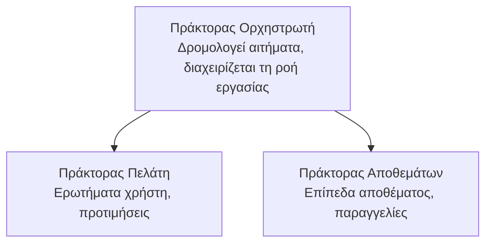

# Κεφάλαιο 5: Λύσεις πολλαπλών πρακτόρων AI

**📚 Μάθημα**: [AZD For Beginners](../../README.md) | **⏱️ Διάρκεια**: 2-3 hours | **⭐ Πολυπλοκότητα**: Προχωρημένο

---

## Επισκόπηση

Αυτό το κεφάλαιο καλύπτει προχωρημένα μοτίβα αρχιτεκτονικής πολλαπλών πρακτόρων, ορχήστρωση πρακτόρων και παραγωγικές αναπτύξεις AI για σύνθετα σενάρια.

## Στόχοι Μάθησης

Με την ολοκλήρωση αυτού του κεφαλαίου, θα:
- Κατανοείτε τα μοτίβα αρχιτεκτονικής πολλαπλών πρακτόρων
- Αναπτύσσετε συντονισμένα συστήματα πρακτόρων AI
- Υλοποιείτε επικοινωνία πράκτορα προς πράκτορα
- Δημιουργείτε παραγωγικές λύσεις πολλαπλών πρακτόρων

---

## 📚 Μαθήματα

| # | Μάθημα | Περιγραφή | Χρόνος |
|---|--------|-------------|------|
| 1 | [Retail Multi-Agent Solution](../../examples/retail-scenario.md) | Ολοκληρωμένος οδηγός υλοποίησης | 90 min |
| 2 | [Coordination Patterns](../chapter-06-pre-deployment/coordination-patterns.md) | Στρατηγικές ορχήστρωσης πρακτόρων | 30 min |
| 3 | [ARM Template Deployment](../../examples/retail-multiagent-arm-template/README.md) | Ανάπτυξη με ένα κλικ | 30 min |

---

## 🚀 Γρήγορη Εκκίνηση

```bash
# Επιλογή 1: Ανάπτυξη από ένα πρότυπο
azd init --template agent-openai-python-prompty
azd up

# Επιλογή 2: Ανάπτυξη από manifest του πράκτορα (απαιτεί την επέκταση azure.ai.agents)
azd extension install azure.ai.agents
azd ai agent init -m agent-manifest.yaml
azd up
```

> **Ποια προσέγγιση;** Χρησιμοποιήστε `azd init --template` για να ξεκινήσετε από ένα δείγμα που λειτουργεί. Χρησιμοποιήστε `azd ai agent init` όταν έχετε το δικό σας manifest πράκτορα. Δείτε την [αναφορά CLI του AZD AI](../chapter-08-production/production-ai-practices.md#azd-ai-cli-commands-and-extensions) για πλήρεις λεπτομέρειες.

---

## 🤖 Αρχιτεκτονική Πολλών Πρακτόρων


---

## 🎯 Επιλεγμένη Λύση: Πολλαπλοί Πράκτορες Λιανικής

Η [Λύση Πολλαπλών Πρακτόρων Λιανικής](../../examples/retail-scenario.md) επιδεικνύει:

- **Πράκτορας Πελάτη**: Διαχειρίζεται αλληλεπιδράσεις χρηστών και προτιμήσεις
- **Πράκτορας Αποθεμάτων**: Διαχειρίζεται απόθεμα και επεξεργασία παραγγελιών
- **Ορχηστρωτής**: Συντονίζει μεταξύ των πρακτόρων
- **Κοινή Μνήμη**: Διαχείριση πλαισίου συμφραζομένων δια-πρακτόρων

### Χρησιμοποιημένες Υπηρεσίες

| Υπηρεσία | Σκοπός |
|---------|---------|
| Microsoft Foundry Models | Κατανόηση γλώσσας |
| Azure AI Search | Κατάλογος προϊόντων |
| Cosmos DB | Κατάσταση και μνήμη πράκτορα |
| Container Apps | Φιλοξενία πρακτόρων |
| Application Insights | Παρακολούθηση |

---

## 🔗 Πλοήγηση

| Κατεύθυνση | Κεφάλαιο |
|-----------|---------|
| **Προηγούμενο** | [Κεφάλαιο 4: Infrastructure](../chapter-04-infrastructure/README.md) |
| **Επόμενο** | [Κεφάλαιο 6: Pre-Deployment](../chapter-06-pre-deployment/README.md) |

---

## 📖 Σχετικοί Πόροι

- [Οδηγός Πρακτόρων AI](../chapter-02-ai-development/agents.md)
- [Πρακτικές Παραγωγής AI](../chapter-08-production/production-ai-practices.md)
- [Αντιμετώπιση Προβλημάτων AI](../chapter-07-troubleshooting/ai-troubleshooting.md)

---

<!-- CO-OP TRANSLATOR DISCLAIMER START -->
Αποποίηση ευθυνών:
Το παρόν έγγραφο έχει μεταφραστεί χρησιμοποιώντας την υπηρεσία αυτόματης μετάφρασης AI Co-op Translator (https://github.com/Azure/co-op-translator). Παρόλο που επιδιώκουμε την ακρίβεια, λάβετε υπόψη ότι οι αυτοματοποιημένες μεταφράσεις ενδέχεται να περιέχουν σφάλματα ή ανακρίβειες. Το πρωτότυπο έγγραφο στη γλώσσα του θα πρέπει να θεωρείται ως η αυθεντική πηγή. Για κρίσιμες πληροφορίες, συνιστάται επαγγελματική μετάφραση από επαγγελματία μεταφραστή. Δεν ευθυνόμαστε για οποιεσδήποτε παρεξηγήσεις ή λανθασμένες ερμηνείες που προκύπτουν από τη χρήση αυτής της μετάφρασης.
<!-- CO-OP TRANSLATOR DISCLAIMER END -->