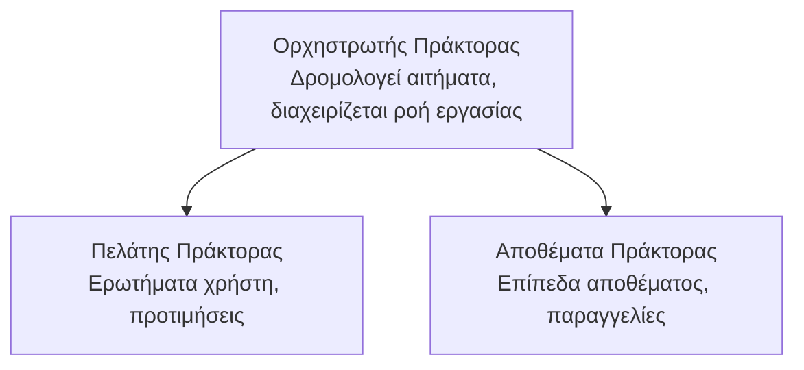

# Κεφάλαιο 5: Λύσεις Πολλαπλών Πρακτόρων AI

**📚 Μάθημα**: [AZD For Beginners](../../README.md) | **⏱️ Διάρκεια**: 2-3 ώρες | **⭐ Πολυπλοκότητα**: Προχωρημένο

---

## Επισκόπηση

Αυτό το κεφάλαιο καλύπτει προχωρημένα μοτίβα αρχιτεκτονικής για πολλούς πράκτορες, ορχήστρωση πρακτόρων και παραγωγικές αναπτύξεις AI για πολύπλοκα σενάρια.

> Επικυρώθηκε έναντι του `azd 1.25.6` τον Ιούνιο του 2026.

## Στόχοι Μάθησης

Με την ολοκλήρωση αυτού του κεφαλαίου, θα:
- Κατανοήσετε τα μοτίβα αρχιτεκτονικής πολλαπλών πρακτόρων
- Αναπτύξετε συντονισμένα συστήματα πρακτόρων AI
- Υλοποιήσετε επικοινωνία πράκτορα-προς-πράκτορα
- Δημιουργήσετε παραγωγικές λύσεις πολλαπλών πρακτόρων

---

## 📚 Μαθήματα

| # | Μάθημα | Περιγραφή | Χρόνος |
|---|--------|-------------|------|
| 1 | [Βασικά για Πολυπράκτορες](multi-agent-basics.md) | Πρακτική άσκηση: αναπτύξτε μια λειτουργική εφαρμογή πολλαπλών πρακτόρων με `azd up` | 45 λεπ. |
| 2 | [Πρότυπα Συντονισμού](../chapter-06-pre-deployment/coordination-patterns.md) | Στρατηγικές ορχήστρωσης πρακτόρων (συνεχίζεται στο Κεφάλαιο 6) | 30 λεπ. |
| 3 | [Ανάπτυξη Προτύπου ARM](../../examples/retail-multiagent-arm-template/README.md) | Παράδειγμα ανάπτυξης με ένα κλικ | 30 λεπ. |

> **Ξεκινήστε με το Μάθημα 1.** Είναι το μόνο πλήρως πρακτικό μάθημα που μπορεί να αναπτυχθεί. Το Μάθημα 2 βρίσκεται στο Κεφάλαιο 6 (μοιράζεται με τον προγραμματισμό προ-ανάπτυξης), και η [Λύση Πολυπρακτόρων Λιανικής](../../examples/retail-scenario.md) είναι ένα αρχιτεκτονικό υπόδειγμα — μια αναφορά σχεδίασης, όχι ένα πρότυπο εκτέλεσης με μία εντολή.

---

## 🚀 Γρήγορη Εκκίνηση

```bash
# Επιλογή 1: Ανάπτυξη από πρότυπο
azd init --template agent-openai-python-prompty
azd up

# Επιλογή 2: Ανάπτυξη από manifest πράκτορα (απαιτεί την επέκταση azure.ai.agents)
azd extension install azure.ai.agents
azd ai agent init -m agent-manifest.yaml
azd up
```

> **Ποια προσέγγιση;** Χρησιμοποιήστε `azd init --template` για να ξεκινήσετε από ένα λειτουργικό δείγμα. Χρησιμοποιήστε `azd ai agent init` όταν έχετε το δικό σας manifest πράκτορα. Δείτε το [AZD AI CLI reference](../chapter-08-production/production-ai-practices.md#azd-ai-cli-commands-and-extensions) για πλήρεις λεπτομέρειες.

---

## 🤖 Αρχιτεκτονική Πολυπρακτόρων



---

## 🎯 Επιλεγμένη Λύση: Λύση Πολυπρακτόρων Λιανικής

Η [Λύση Πολυπρακτόρων Λιανικής](../../examples/retail-scenario.md) παρουσιάζει:

- **Πράκτορας Πελάτη**: Διαχειρίζεται αλληλεπιδράσεις χρήστη και προτιμήσεις
- **Πράκτορας Αποθέματος**: Διαχειρίζεται το απόθεμα και την επεξεργασία παραγγελιών
- **Ορχηστρωτής**: Συντονίζει μεταξύ των πρακτόρων
- **Κοινή Μνήμη**: Διαχείριση κοινών συμφραζομένων μεταξύ πρακτόρων

### Χρησιμοποιούμενες Υπηρεσίες

| Υπηρεσία | Σκοπός |
|---------|---------|
| Microsoft Foundry Models | Κατανόηση γλώσσας |
| Azure AI Search | Κατάλογος προϊόντων |
| Cosmos DB | Κατάσταση και μνήμη πρακτόρων |
| Container Apps | Φιλοξενία πρακτόρων |
| Application Insights | Παρακολούθηση |

---

## 🔗 Πλοήγηση

| Κατεύθυνση | Κεφάλαιο |
|-----------|---------|
| **Προηγούμενο** | [Κεφάλαιο 4: Υποδομή](../chapter-04-infrastructure/README.md) |
| **Επόμενο** | [Κεφάλαιο 6: Προ-Ανάπτυξη](../chapter-06-pre-deployment/README.md) |

---

## 📖 Σχετικοί Πόροι

- [Οδηγός Πρακτόρων AI](../chapter-02-ai-development/agents.md)
- [Πρακτικές Παραγωγής AI](../chapter-08-production/production-ai-practices.md)
- [Αντιμετώπιση προβλημάτων AI](../chapter-07-troubleshooting/ai-troubleshooting.md)

---

<!-- CO-OP TRANSLATOR DISCLAIMER START -->
**Αποποίηση ευθυνών**:
Αυτό το έγγραφο έχει μεταφραστεί χρησιμοποιώντας την υπηρεσία μετάφρασης με τεχνητή νοημοσύνη [Co-op Translator](https://github.com/Azure/co-op-translator). Ενώ επιδιώκουμε την ακρίβεια, παρακαλούμε να έχετε υπόψη ότι οι αυτοματοποιημένες μεταφράσεις ενδέχεται να περιέχουν λάθη ή ανακρίβειες. Το πρωτότυπο έγγραφο στη μητρική του γλώσσα πρέπει να θεωρείται η αυθεντική πηγή. Για κρίσιμες πληροφορίες, συνιστάται επαγγελματική ανθρώπινη μετάφραση. Δεν φέρουμε ευθύνη για τυχόν παρεξηγήσεις ή λανθασμένες ερμηνείες που προκύπτουν από τη χρήση αυτής της μετάφρασης.
<!-- CO-OP TRANSLATOR DISCLAIMER END -->