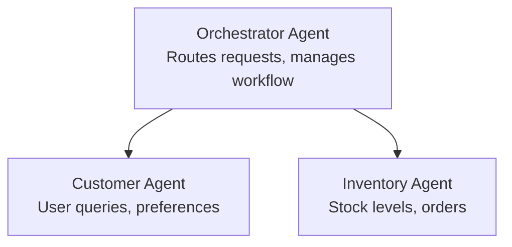

# Κεφάλαιο 5: Λύσεις Τεχνητής Νοημοσύνης με Πολλαπλούς Πράκτορες

**📚 Μάθημα**: [AZD Για Αρχάριους](../../README.md) | **⏱️ Διάρκεια**: 2-3 ώρες | **⭐ Πολυπλοκότητα**: Προχωρημένο

---

## Επισκόπηση

Αυτό το κεφάλαιο καλύπτει προχωρημένα πρότυπα αρχιτεκτονικής πολλαπλών πρακτόρων, ορχήστρωση πρακτόρων και αναπτύξεις τεχνητής νοημοσύνης έτοιμες για παραγωγή σε σύνθετα σενάρια.

> Η καθοδήγηση εντολών ελέχθηκε με βάση την απελευθερωμένη `azd 1.37.2` αναφορά. Δεν εκτελέστηκαν αναπτύξεις στο cloud.

## Στόχοι Μάθησης

Με την ολοκλήρωση αυτού του κεφαλαίου, θα:
- Κατανοήσετε πρότυπα αρχιτεκτονικής πολλαπλών πρακτόρων
- Αναπτύξετε συντονισμένα συστήματα πρακτόρων τεχνητής νοημοσύνης
- Υλοποιήσετε επικοινωνία πράκτορα προς πράκτορα
- Δημιουργήσετε λύσεις πολλαπλών πρακτόρων έτοιμες για παραγωγή

---

## 📚 Μαθήματα

| # | Μάθημα | Περιγραφή | Χρόνος |
|---|--------|-------------|------|
| 1 | [Βασικά Πολλαπλών Πρακτόρων](multi-agent-basics.md) | Πρακτική: αναπτύξτε μια λειτουργική εφαρμογή πολλαπλών πρακτόρων με `azd up` | 45 λεπτά |
| 2 | [Πρότυπα Συντονισμού](../chapter-06-pre-deployment/coordination-patterns.md) | Στρατηγικές ορχήστρωσης πρακτόρων (συνεχίζεται στο Κεφάλαιο 6) | 30 λεπτά |
| 3 | [Ανάπτυξη με ARM Template](../../examples/retail-multiagent-arm-template/README.md) | Παράδειγμα ανάπτυξης με ένα κλικ | 30 λεπτά |

> **Ξεκινήστε με το Μάθημα 1.** Είναι το μοναδικό πλήρως πρακτικό μάθημα αυτού του κεφαλαίου που μπορεί να αναπτυχθεί. Το Μάθημα 2 περιλαμβάνεται στο Κεφάλαιο 6 (συμπεριλαμβάνεται στον προγραμματισμό πριν την ανάπτυξη) και η [Λύση Πολλαπλών Πρακτόρων Λιανικής](../../examples/retail-scenario.md) είναι ένα αρχιτεκτονικό πρότυπο - μια αναφορά σχεδιασμού, όχι ένα πρότυπο εντολής.

---

## 🚀 Γρήγορη Εκκίνηση

```bash
# Option 1: Deploy the multi-agent template used in Lesson 1
azd init --template Azure-Samples/contoso-creative-writer .
azd up

# Option 2: Initialize a Foundry agent interactively (requires azure.ai.agents)
azd extension install azure.ai.agents
azd ai agent init
azd up
```

> **Ποια προσέγγιση;** Χρησιμοποιήστε `azd init --template` για να ξεκινήσετε από ένα λειτουργικό δείγμα. Χρησιμοποιήστε `azd ai agent init` διαδραστικά, ή `azd ai agent init --template <path-to-azure.yaml>` για να υιοθετήσετε ένα τρέχον έργο πράκτορα. Δείτε την [αναφορά AZD AI CLI](../chapter-08-production/production-ai-practices.md#azd-ai-cli-commands-and-extensions) για απαιτήσεις έκδοσης και διαχείριση μετάβασης.

Τρέξτε αυτές τις εναλλακτικές σε ξεχωριστούς άδειους φακέλους. Η επέκταση πρακτόρων `1.0.0-beta.23` απαιτεί `azd >= 1.37.0`· η διαδραστική ροή της δεν δημιουργεί το προσαρμοσμένο κανάλι Service Bus στο μάθημα συντονισμού.

---

## 🤖 Αρχιτεκτονική Πολλαπλών Πρακτόρων


```mermaid
graph TD
    Orchestrator[Orchestrator Agent<br/>Routes requests, manages workflow] --> Customer[Customer Agent<br/>User queries, preferences]
    Orchestrator --> Inventory[Inventory Agent<br/>Stock levels, orders]
```

---

## 🎯 Προτεινόμενη Λύση: Λιανική Πολλαπλών Πρακτόρων

Η [Λύση Πολλαπλών Πρακτόρων Λιανικής](../../examples/retail-scenario.md) demonstrάει:

- **Πράκτορας Πελάτη**: Διαχειρίζεται αλληλεπιδράσεις και προτιμήσεις χρήστη
- **Πράκτορας Αποθεμάτων**: Διαχειρίζεται απόθεμα και επεξεργασία παραγγελιών
- **Ορχήστρα**: Συντονίζει μεταξύ των πρακτόρων
- **Κοινή Μνήμη**: Διαχείριση περιβάλλοντος μεταξύ πρακτόρων

### Χρησιμοποιούμενες Υπηρεσίες

| Υπηρεσία | Σκοπός |
|---------|---------|
| Microsoft Foundry Models | Κατανόηση γλώσσας |
| Azure AI Search | Κατάλογος προϊόντων |
| Cosmos DB | Κατάσταση και μνήμη πρακτόρων |
| Container Apps | Φιλοξενία πρακτόρων |
| Application Insights | Παρακολούθηση |

---

## 🔗 Πλοήγηση

| Κατεύθυνση | Κεφάλαιο |
|-----------|---------|
| **Προηγούμενο** | [Κεφάλαιο 4: Υποδομή](../chapter-04-infrastructure/README.md) |
| **Επόμενο** | [Κεφάλαιο 6: Προ-Ανάπτυξη](../chapter-06-pre-deployment/README.md) |

---

## 📖 Σχετικοί Πόροι

- [Οδηγός Πρακτόρων ΤΝ](../chapter-02-ai-development/agents.md)
- [Πρακτικές Παραγωγής ΤΝ](../chapter-08-production/production-ai-practices.md)
- [Αντιμετώπιση Προβλημάτων ΤΝ](../chapter-07-troubleshooting/ai-troubleshooting.md)

---

<!-- CO-OP TRANSLATOR DISCLAIMER START -->
**Αποποίηση ευθυνών**:
Αυτό το έγγραφο έχει μεταφραστεί χρησιμοποιώντας την υπηρεσία μετάφρασης με τεχνητή νοημοσύνη [Co-op Translator](https://github.com/Azure/co-op-translator). Ενώ επιδιώκουμε την ακρίβεια, παρακαλούμε να έχετε υπόψη ότι οι αυτοματοποιημένες μεταφράσεις ενδέχεται να περιέχουν λάθη ή ανακρίβειες. Το πρωτότυπο έγγραφο στη μητρική του γλώσσα πρέπει να θεωρείται η αυθεντική πηγή. Για κρίσιμες πληροφορίες, συνιστάται επαγγελματική ανθρώπινη μετάφραση. Δεν φέρουμε ευθύνη για τυχόν παρεξηγήσεις ή λανθασμένες ερμηνείες που προκύπτουν από τη χρήση αυτής της μετάφρασης.
<!-- CO-OP TRANSLATOR DISCLAIMER END -->