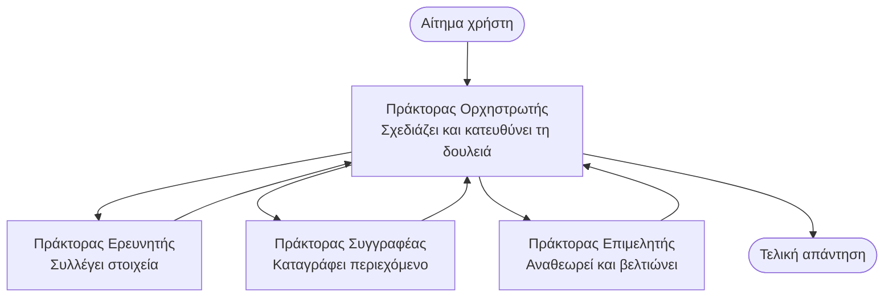

# Βασικά για Πολυ-Πρακτορικά Συστήματα - Αναπτύξτε το Πρώτο Συντονισμένο Σύστημά σας Τεχνητής Νοημοσύνης  

**Πλοήγηση Κεφαλαίου:**  
- **📚 Αρχική Μαθήματος**: [AZD Για Αρχάριους](../../README.md)  
- **📖 Τρέχον Κεφάλαιο**: Κεφάλαιο 5 - Πολυ-Πρακτορικές Λύσεις AI  
- **⬅️ Προηγούμενο**: [Κεφάλαιο 4: Υποδομή](../chapter-04-infrastructure/README.md)  
- **➡️ Επόμενο**: [Πρότυπα Συντονισμού](../chapter-06-pre-deployment/coordination-patterns.md)  

> Επαληθεύτηκε με `azd 1.27.1` τον Ιούλιο του 2026.  

## Εισαγωγή  

Στα πρώτα κεφάλαια αναπτύξατε μια μοναδική εφαρμογή—και στο Κεφάλαιο 2 αναπτύξατε έναν μοναδικό πράκτορα AI. Αυτό το μάθημα παίρνει το επόμενο βήμα: την ανάπτυξη ενός **πολυ-πρακτορικού συστήματος**, όπου αρκετοί εξειδικευμένοι πράκτορες συνεργάζονται για να λύσουν ένα πρόβλημα που κανένας μεμονωμένος πράκτορας δεν θα μπορούσε να διαχειριστεί καλά από μόνος του.  

Τα καλά νέα για αρχάριους: **δεν χρειάζεστε νέες εντολές.** Μια πολυ-πρακτορική λύση είναι ακόμα ένα έργο azd. Θα κάνετε `azd init`, `azd up`, δοκιμές, και `azd down`—ακριβώς τη ροή εργασίας που ήδη γνωρίζετε. Αυτό που αλλάζει είναι το *σχήμα* της εφαρμογής στο εσωτερικό.  

## Στόχοι Μάθησης  

Μέχρι το τέλος αυτού του μαθήματος, θα:  
- Κατανοήσετε τι σημαίνει "πολυ-πρακτορικό" και πότε αξίζει την επιπλέον πολυπλοκότητα  
- Αναγνωρίσετε τους κοινούς ρόλους σε ένα πολυ-πρακτορικό σύστημα (συντονιστής + ειδικοί)  
- Αναπτύξετε ένα πραγματικό, λειτουργικό πολυ-πρακτορικό πρότυπο με `azd up`  
- Κατανοήσετε τους πόρους Azure που υποστηρίζουν μια πολυ-πρακτορική εφαρμογή  
- Ξέρετε πώς να επαληθεύσετε, να προσαρμόσετε και να απενεργοποιήσετε με ασφάλεια τη λύση  

## Επιτεύγματα Μάθησης  

Αφού ολοκληρώσετε αυτό το μάθημα, θα μπορείτε να:  
- Εξηγήσετε τη διαφορά μεταξύ ενός μοναδικού πράκτορα και ενός πολυ-πρακτορικού συστήματος  
- Επιλέξετε ανάμεσα σε έναν μοναδικό πράκτορα με εργαλεία και ένα πραγματικό πολυ-πρακτορικό σχέδιο  
- Αναπτύξετε και να δοκιμάσετε ένα πολυ-πρακτορικό πρότυπο από άκρο σε άκρο με azd  
- Εντοπίσετε πού τρέχει ο κάθε πράκτορας και πώς επικοινωνούν  
- Καθαρίσετε όλους τους πόρους ώστε να αποφύγετε διαρκείς χρεώσεις  

---  

## Τι Είναι ένα Πολυ-Πρακτορικό Σύστημα;  

Ένας μοναδικός πράκτορας AI είναι ένα μοντέλο με ένα σύνολο οδηγιών και (προαιρετικά) κάποια εργαλεία. Αυτό λειτουργεί καλά για εστιασμένες εργασίες. Αλλά καθώς μια εργασία μεγαλώνει—έρευνα, μετά συγγραφή, μετά επιμέλεια, μετά έλεγχος στοιχείων—το να συσσωρεύεις τα πάντα σε ένα μόνο prompt κάνει τον πράκτορα πιο αργό, λιγότερο αξιόπιστο και δυσκολότερο στο να εντοπιστούν σφάλματα.  

Ένα **πολυ-πρακτορικό σύστημα** χωρίζει τη δουλειά σε ειδικούς που κάνουν καθένας μια δουλειά καλά, συντονισμένους από έναν συντονιστή:  


  
### Οι δύο ρόλοι που πάντα θα βλέπετε  

| Ρόλος | Δουλειά | Παράδειγμα |  
|------|--------|------------|  
| **Συντονιστής** | Αποφασίζει *τι θα γίνει στη συνέχεια* και κατευθύνει τη δουλειά ανάμεσα στους πράκτορες | "Πρώτα έρευνα, μετά γράψιμο, μετά επιμέλεια" |  
| **Ειδικός** | Κάνει μία συγκεκριμένη δουλειά και επιστρέφει ένα αποτέλεσμα | Ένας "ερευνητής" που μόνο συλλέγει στοιχεία |  

### Χρειάζεστε πραγματικά πολλούς πράκτορες;  

Ξεκινήστε απλά. Χρησιμοποιήστε πολυ-πρακτορικό **μόνο** όταν ισχύει ένα από τα εξής:  

- ✅ Η εργασία έχει **διακριτά στάδια** που ωφελούνται από διαφορετικές οδηγίες (έρευνα vs. γράψιμο vs. επανεξέταση)  
- ✅ Θέλετε οι ειδικοί να τρέχουν **παράλληλα** για εξοικονόμηση χρόνου  
- ✅ Διαφορετικά βήματα χρειάζονται **διαφορετικά εργαλεία ή πηγές δεδομένων**  
- ✅ Χρειάζεται κάθε βήμα να είναι **ανεξάρτητα δοκιμάσιμο και επιθεωρήσιμο**  

Αν η εργασία σας είναι μια απλή ερώτηση-απάντηση ή μια απλή κλήση εργαλείου, ένας **μοναδικός πράκτορας με εργαλεία** (Κεφάλαιο 2) είναι πιο απλός, οικονομικός και εύκολος στη χρήση.  

> **Συμβουλή για αρχάριους:** "Περισσότεροι πράκτορες" δεν σημαίνει "καλύτερο." Κάθε πράκτορας προσθέτει καθυστέρηση, κόστος και κάτι νέο για παρακολούθηση. Πρόσθεσε πράκτορες μόνο όταν το πρόβλημα χωρίζεται ξεκάθαρα σε μέρη.  

---  

## Δύο Τρόποι Να Δημιουργήσετε Πολυ-Πρακτορικό στο Azure  

| Προσέγγιση | Τι είναι | Καλύτερο για |  
|-----------|----------|------------|  
| **Μοναδικός πράκτορας + εργαλεία** | Ένας πράκτορας Foundry που καλεί λειτουργίες/εργαλεία | Απλές ροές εργασίας, ξεκινώντας |  
| **Πολλαπλοί συντονισμένοι πράκτορες** | Πολλοί πράκτορες με έναν συντονιστή | Διακριτά στάδια, παράλληλη εργασία, εξειδίκευση |  

Αυτό το μάθημα εστιάζει στη δεύτερη προσέγγιση χρησιμοποιώντας ένα **έτοιμο πρότυπο**, ώστε να δείτε ένα πραγματικό πολυ-πρακτορικό σύστημα να λειτουργεί πριν φτιάξετε το δικό σας.  

---  

## Πρακτική Άσκηση: Αναπτύξτε μια Λειτουργική Πολυ-Πρακτορική Εφαρμογή  

Θα αναπτύξουμε το **Contoso Creative Writer**, ένα επίσημο δείγμα Azure που χρησιμοποιεί πολλαπλούς πράκτορες (ερευνητή, συγγραφέα, επιμελητή) συντονισμένους για την παραγωγή άρθρου. Είναι μια εξαιρετική πρώτη πολυ-πρακτορική εφαρμογή γιατί οι ρόλοι είναι εύκολοι στην κατανόηση.  

### Βήμα 1: Αρχικοποιήστε το πρότυπο  

```bash
# Δημιουργήστε έναν φάκελο εργασίας
mkdir creative-writer && cd creative-writer

# Αρχικοποιήστε από το επίσημο πρότυπο πολλαπλών πρακτόρων
azd init --template contoso-creative-writer
```
  
> Περιηγηθείτε σε περισσότερα πολυ-πρακτορικά πρότυπα οποιαδήποτε στιγμή στην [Καταπληκτική Συλλογή AZD AI](https://azure.github.io/awesome-azd/?tags=ai). Άλλες επιλογές φιλικές για αρχάριους περιλαμβάνουν το `get-started-with-ai-agents` και `azure-ai-travel-agents`.  

### Βήμα 2: Πιστοποιηθείτε  

```bash
# Απαιτείται για ροές εργασίας azd
azd auth login
```
  
### Βήμα 3: Δημιουργήστε ένα περιβάλλον  

```bash
azd env new dev
```
  
### Βήμα 4: Προεπισκόπηση, μετά ανάπτυξη  

```bash
# Δείτε τι θα δημιουργηθεί πριν ξοδέψετε οτιδήποτε (συνιστάται)
azd provision --preview

# Παρέχετε υποδομές και αναπτύξτε όλους τους πράκτορες σε ένα βήμα
azd up
```
  
`azd up` θα ζητήσει συνδρομή και περιοχή, μετά θα παραχωρήσει τους πόρους Azure και θα αναπτύξει την εφαρμογή. Οι αναπτύξεις AI μπορεί να πάρουν περισσότερο χρόνο από μια απλή εφαρμογή ιστού—αν αναπτύσσετε μεγαλύτερα μοντέλα, μπορείτε να αυξήσετε το χρόνο λήξης της ανάπτυξης:  

```bash
azd deploy --timeout 1800
```
  
> **Προειδοποίηση για κόστος και χωρητικότητα:** Οι πολυ-πρακτορικές εφαρμογές αναπτύσσουν μοντέλα AI που καταναλώνουν όριο και επιφέρουν κόστος. Αν το `azd up` αποτύχει λόγω ορίου μοντέλου, δείτε [Επίλυση Προβλημάτων AI](../chapter-07-troubleshooting/ai-troubleshooting.md) για διορθώσεις περιοχής και ορίου, και το Κεφάλαιο 6 [Σχεδιασμός Χωρητικότητας](../chapter-06-pre-deployment/capacity-planning.md).  

---  

## Κατανόηση Τι Αναπτύξατε  

Μια τυπική πολυ-πρακτορική εφαρμογή όπως αυτή παραχωρεί ένα σύνολο πόρων Azure που αντιστοιχούν απευθείας στις ευθύνες στο παραπάνω διάγραμμα:  

| Πόρος | Γιατί υπάρχει |  
|--------|---------------|  
| **Microsoft Foundry / Μοντέλα** | Φιλοξενεί τα γλωσσικά μοντέλα που κάθε πράκτορας χρησιμοποιεί |  
| **Azure AI Search** | Δίνει στον πράκτορα ερευνητή γεωθετημένα δεδομένα για αναζήτηση |  
| **Container Apps** (ή App Service) | Φιλοξενεί τον συντονιστή και τον κώδικα των πρακτόρων |  
| **Cosmos DB** (σε κάποια δείγματα) | Αποθηκεύει κοινόχρηστη κατάσταση/μνήμη που μεταβιβάζεται ανάμεσα στους πράκτορες |  
| **Application Insights** | Παρακολουθεί τα αιτήματα *μεταξύ* πρακτόρων ώστε να μπορείτε να εντοπίσετε σφάλματα στη ροή |  

### Πώς επικοινωνούν οι πράκτορες μεταξύ τους  

Στις περισσότερες δειγματοληψίες azd πολυ-πρακτορικών, ο **συντονιστής τρέχει στον κώδικα της εφαρμογής σας** (για παράδειγμα, χρησιμοποιώντας πλαίσιο σαν το Semantic Kernel ή το Microsoft Agent Framework). Ο συντονιστής καλεί κάθε εξειδικευμένο πράκτορα με τη σειρά, μεταβιβάζει τα αποτελέσματα, και συγκεντρώνει την τελική απάντηση. Οι πράκτορες μοιράζονται το πλαίσιο μέσω:  

- **Κλήσεις λειτουργίας/εργαλείων** — ο συντονιστής καλεί έναν ειδικό και παίρνει πίσω ένα αποτέλεσμα  
- **Κοινή μνήμη** — μια βάση δεδομένων (συνήθως Cosmos DB) κρατά την κατάσταση που μπορούν να διαβάσουν και οι δύο πράκτορες  
- **Μηνύματα/γεγονότα** — για πιο χαλαρή σύνδεση, οι πράκτορες επικοινωνούν μέσω ουράς ή Service Bus  

> **Γιατί έχει σημασία αυτό για την εντόπιση σφαλμάτων:** επειδή κάθε βήμα είναι ξεχωριστό, το Application Insights σας δείχνει *ποιος* πράκτορας ήταν αργός ή απέτυχε. Αυτός είναι ένας σημαντικός λόγος να διαχωρίσετε τη δουλειά στους πράκτορες εξαρχής.  

---  

## Επαληθεύστε την Ανάπτυξη  

Επιβεβαιώστε ότι το σύστημα λειτουργεί πραγματικά πριν προχωρήσετε:  

```bash
# Εμφάνιση των αναπτυγμένων τελικών σημείων
azd show

# Άνοιγμα του πίνακα ελέγχου παρακολούθησης της εφαρμογής
azd monitor

# Παρακολούθηση αρχείων καταγραφής αν κάτι φαίνεται περίεργο
azd monitor --logs
```
  
Μετά, ανοίξτε το URL της εφαρμογής από `azd show` και δοκιμάστε ένα αίτημα που ενεργοποιεί όλους τους πράκτορες (για τον Creative Writer, ζητήστε του να γράψει ένα σύντομο άρθρο για ένα θέμα). Στην **αναζήτηση συναλλαγών** του Application Insights, θα πρέπει να δείτε το αίτημα να εξαπλώνεται στα βήματα ερευνητή, συγγραφέα και επιμελητή.  

**Κριτήρια επιτυχίας:**  
- ✅ Το `azd show` εμφανίζει ένα προσβάσιμο σημείο λήξης  
- ✅ Ένα αίτημα παράγει ένα αποτέλεσμα που περνά σαφώς από πολλαπλά στάδια  
- ✅ Το Application Insights δείχνει ιχνηλασίες για πάνω από ένα βήμα πράκτορα  

---  

## Προσαρμογή: Προσθήκη ή Ρύθμιση Πράκτορα  

Επειδή κάθε πράκτορας είναι απλώς οδηγίες συν εργαλεία, η προσαρμογή είναι προσιτή:  

1. **Βρείτε τους ορισμούς πρακτόρων** στο πρότυπο (συχνά ένα σύνολο αρχείων `prompts/`, `agents/`, ή `*.prompty`).  
2. **Ρυθμίστε τις οδηγίες ενός πράκτορα** — για παράδειγμα, πείτε στον πράκτορα επιμελητή να εφαρμόζει συγκεκριμένο τόνο ή μέτρηση λέξεων.  
3. **Αναπτύξτε μόνο τον κώδικα ξανά** (η υποδομή μένει ίδια):  

   ```bash
   azd deploy
   ```
  
Για να προχωρήσετε περισσότερο και να δημιουργήσετε πράκτορες από το *δικό* σας μανιφέστο, χρησιμοποιήστε την επέκταση του πράκτορα και ολόκληρο τον κύκλο ζωής του:  

```bash
azd extension install azure.ai.agents
azd ai agent init -m agent-manifest.yaml
azd up
azd ai agent invoke      # δοκιμή, με χρονισμό απόκρισης
```
  
Δείτε το [Κεφάλαιο 2: Πράκτορες](../chapter-02-ai-development/agents.md) και την [αναφορά AZD AI CLI](../chapter-08-production/production-ai-practices.md#azd-ai-cli-commands-and-extensions) για τον πλήρη κύκλο ζωής πράκτορα (`invoke`, `eval generate`, `optimize`, `delete`).  

---  

## Καθαρισμός  

Οι πολυ-πρακτορικές εφαρμογές τρέχουν πολλαπλές υπηρεσίες με χρέωση. Κατεβάστε τα όλα όταν τελειώσετε:  

```bash
azd down --force --purge
```
  
Η σημαία `--purge` αφαιρεί επίσης πόρους AI που διαγράφηκαν ήπια (όπως λογαριασμοί Foundry/Azure AI Services) ώστε να μην μπλοκάρουν μελλοντική ανάπτυξη ή να συνεχίζουν να προκαλούν κόστος.  

---  

## Σημείωση για Πολυ-Πρακτορικά Συστήματα Παραγωγής  

Η [Λύση Πολυ-Πρακτορικού Λιανικού Εμπορίου](../../examples/retail-scenario.md) σε αυτό το αποθετήριο είναι ένα **σχέδιο αρχιτεκτονικής**, όχι ένα πρότυπο ενός εντολής—τεκμηριώνει πώς *θα* κατασκευαζόταν ένα παραγωγικό σύστημα λιανικής (και δηλώνει ρητά ότι μια πλήρης υλοποίηση είναι μεγάλη προσπάθεια). Χρησιμοποιήστε το ως αναφορά σχεδιασμού *μετά* την ανάπτυξη ενός λειτουργικού δείγματος εδώ. Για θέματα παραγωγής (ανθεκτικότητα, κόστος, παρακολούθηση, διακυβέρνηση), συνεχίστε στο [Κεφάλαιο 8: Πρακτικές Παραγωγής AI](../chapter-08-production/production-ai-practices.md).  

---  

## Σύνοψη  

- Ένα πολυ-πρακτορικό σύστημα χωρίζει τη δουλειά σε ειδικούς συντονισμένους από έναν συντονιστή.  
- Χρησιμοποιήστε το μόνο όταν η εργασία έχει διακριτά στάδια, παραλληλισμό ή διαφορετικά εργαλεία ανά βήμα—διαφορετικά προτιμήστε έναν μοναδικό πράκτορα.  
- Η ροή εργασίας azd παραμένει ίδια: `azd init` → `azd up` → δοκιμή → `azd down`.  
- Ένα πραγματικό πρότυπο όπως το `contoso-creative-writer` σας αφήνει να δείτε και να προσαρμόσετε μια λειτουργική πολυ-πρακτορική εφαρμογή σήμερα.  
- Η ιχνηλασία Application Insights ανάμεσα σε πράκτορες είναι ένα από τα μεγαλύτερα πρακτικά οφέλη του πολυ-πρακτορικού σχεδιασμού.  

---  

## 🔗 Πλοήγηση  

| Κατεύθυνση | Μάθημα |  
|-----------|--------|  
| **Προηγούμενο** | [Κεφάλαιο 4: Υποδομή](../chapter-04-infrastructure/README.md) |  
| **Επόμενο** | [Πρότυπα Συντονισμού](../chapter-06-pre-deployment/coordination-patterns.md) |  

## 📖 Σχετικοί Πόροι  

- [Οδηγός Πρακτόρων AI](../chapter-02-ai-development/agents.md)  
- [Πρότυπα Συντονισμού](../chapter-06-pre-deployment/coordination-patterns.md)  
- [Πρακτικές Παραγωγής AI](../chapter-08-production/production-ai-practices.md)  
- [Επίλυση Προβλημάτων AI](../chapter-07-troubleshooting/ai-troubleshooting.md)  

---

<!-- CO-OP TRANSLATOR DISCLAIMER START -->
**Αποποίηση ευθυνών**:
Αυτό το έγγραφο έχει μεταφραστεί χρησιμοποιώντας την υπηρεσία μετάφρασης με τεχνητή νοημοσύνη [Co-op Translator](https://github.com/Azure/co-op-translator). Ενώ επιδιώκουμε την ακρίβεια, παρακαλούμε να έχετε υπόψη ότι οι αυτοματοποιημένες μεταφράσεις ενδέχεται να περιέχουν λάθη ή ανακρίβειες. Το πρωτότυπο έγγραφο στη μητρική του γλώσσα πρέπει να θεωρείται η αυθεντική πηγή. Για κρίσιμες πληροφορίες, συνιστάται επαγγελματική ανθρώπινη μετάφραση. Δεν φέρουμε ευθύνη για τυχόν παρεξηγήσεις ή λανθασμένες ερμηνείες που προκύπτουν από τη χρήση αυτής της μετάφρασης.
<!-- CO-OP TRANSLATOR DISCLAIMER END -->