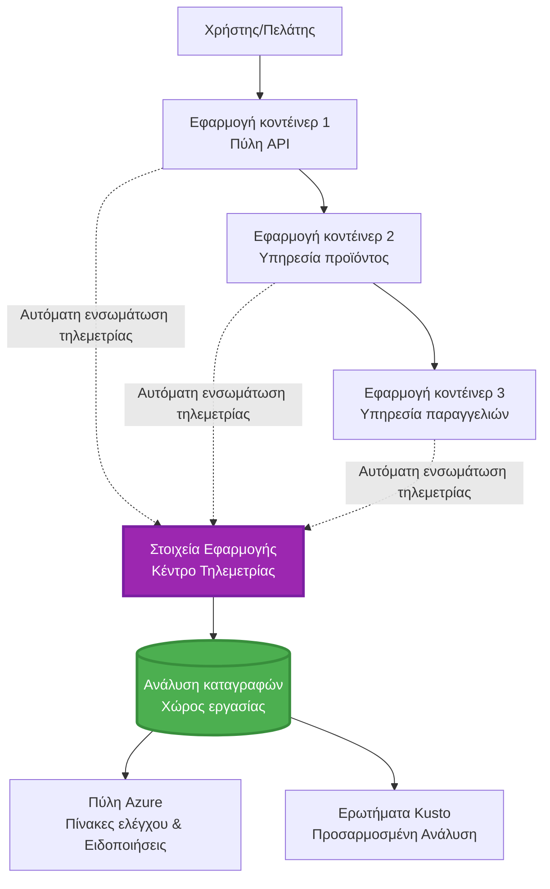
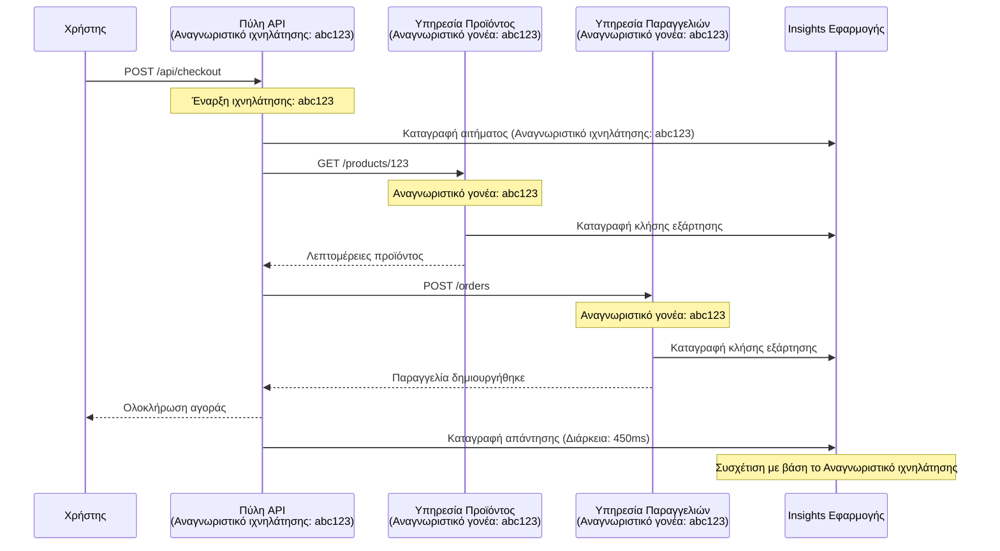

# Ενσωμάτωση του Application Insights με το AZD

⏱️ **Εκτιμώμενος Χρόνος**: 40-50 minutes | 💰 **Επίπτωση Κόστους**: ~$5-15/month | ⭐ **Πολυπλοκότητα**: Intermediate

**📚 Μονοπάτι Μάθησης:**
- ← Προηγούμενο: [Έλεγχοι πριν την ανάπτυξη](preflight-checks.md) - Προ-ανάπτυξης επαλήθευση
- 🎯 **Βρίσκεστε εδώ**: Ενσωμάτωση Application Insights (Παρακολούθηση, τηλεμετρία, αποσφαλμάτωση)
- → Επόμενο: [Deployment Guide](../chapter-04-infrastructure/deployment-guide.md) - Deploy to Azure
- 🏠 [Course Home](../../README.md)

---

## Τι θα μάθετε

Με την ολοκλήρωση αυτού του μαθήματος, θα:
- Ενσωματώσετε αυτόματα το **Application Insights** σε έργα AZD
- Διαμορφώσετε **κατανεμημένη ιχνηλάτηση** για μικροϋπηρεσίες
- Υλοποιήσετε **προσαρμοσμένη τηλεμετρία** (μετρικές, γεγονότα, εξαρτήσεις)
- Ενεργοποιήσετε **Live Metrics** για παρακολούθηση σε πραγματικό χρόνο
- Δημιουργήσετε **ειδοποιήσεις και πίνακες ελέγχου** από αναπτύξεις AZD
- Αποσφαλματώσετε ζητήματα παραγωγής με **ερωτήματα τηλεμετρίας**
- Βελτιστοποιήσετε **κόστη και στρατηγικές δειγματοληψίας**
- Παρακολουθήσετε **εφαρμογές AI/LLM** (tokens, καθυστέρηση, κόστη)

## Γιατί έχει σημασία το Application Insights με το AZD

### Η Πρόκληση: Παρατηρησιμότητα στην Παραγωγή

**Χωρίς το Application Insights:**
```
❌ No visibility into production behavior
❌ Manual log aggregation across services
❌ Reactive debugging (wait for customer complaints)
❌ No performance metrics
❌ Cannot trace requests across services
❌ Unknown failure rates and bottlenecks
```

**Με το Application Insights + AZD:**
```
✅ Automatic telemetry collection
✅ Centralized logs from all services
✅ Proactive issue detection
✅ End-to-end request tracing
✅ Performance metrics and insights
✅ Real-time dashboards
✅ AZD provisions everything automatically
```

**Αναλογία**: Το Application Insights είναι σαν να έχετε ένα «black box» καταγραφέα πτήσης + πίνακα οργάνων πιλοτηρίου για την εφαρμογή σας. Βλέπετε όλα όσα συμβαίνουν σε πραγματικό χρόνο και μπορείτε να αναπαράγετε οποιοδήποτε περιστατικό.

---

## Επισκόπηση Αρχιτεκτονικής

### Application Insights στην Αρχιτεκτονική AZD


### Τι παρακολουθείται αυτόματα

| Είδος Τηλεμετρίας | Τι καταγράφει | Σενάριο χρήσης |
|------------------|------------------|----------|
| **Αιτήσεις** | HTTP requests, status codes, duration | Παρακολούθηση απόδοσης API |
| **Εξαρτήσεις** | Εξωτερικές κλήσεις (DB, APIs, storage) | Εντοπισμός σημείων συμφόρησης |
| **Εξαιρέσεις** | Μη χειριζόμενα σφάλματα με stack traces | Αποσφαλμάτωση αποτυχιών |
| **Προσαρμοσμένα Γεγονότα** | Επιχειρηματικά γεγονότα (signup, purchase) | Αναλύσεις και χωνιά |
| **Μετρικές** | Counters απόδοσης, προσαρμοσμένες μετρικές | Σχεδιασμός χωρητικότητας |
| **Ιχνη** | Μηνύματα καταγραφής με severity | Αποσφαλμάτωση και έλεγχος |
| **Διαθεσιμότητα** | Έλεγχοι uptime και response time | Παρακολούθηση SLA |

---

## Προαπαιτούμενα

### Απαιτούμενα Εργαλεία

```bash
# Επαλήθευση του Azure Developer CLI
azd version
# ✅ Αναμενόμενο: έκδοση azd 1.0.0 ή νεότερη

# Επαλήθευση του Azure CLI
az --version
# ✅ Αναμενόμενο: έκδοση azure-cli 2.50.0 ή νεότερη
```

### Απαιτήσεις Azure

- Ενεργή συνδρομή Azure
- Δικαιώματα για δημιουργία:
  - Application Insights resources
  - Log Analytics workspaces
  - Container Apps
  - Resource groups

### Προαπαιτούμενες Γνώσεις

Θα πρέπει να έχετε ολοκληρώσει:
- [Βασικά AZD](../chapter-01-foundation/azd-basics.md) - Βασικές έννοιες AZD
- [Ρυθμίσεις](../chapter-03-configuration/configuration.md) - Ρύθμιση περιβάλλοντος
- [Πρώτο Έργο](../chapter-01-foundation/first-project.md) - Βασική ανάπτυξη

---

## Μάθημα 1: Αυτόματη ενσωμάτωση Application Insights με το AZD

### Πώς το AZD δημιουργεί το Application Insights

Το AZD δημιουργεί και διαμορφώνει αυτόματα το Application Insights όταν κάνετε ανάπτυξη. Ας δούμε πώς λειτουργεί.

### Δομή Έργου

```
monitored-app/
├── azure.yaml                     # AZD configuration
├── infra/
│   ├── main.bicep                # Main infrastructure
│   ├── core/
│   │   └── monitoring.bicep      # Application Insights + Log Analytics
│   └── app/
│       └── api.bicep             # Container App with monitoring
└── src/
    ├── app.py                    # Application with telemetry
    ├── requirements.txt
    └── Dockerfile
```

---

### Βήμα 1: Ρύθμιση AZD (azure.yaml)

**Αρχείο: `azure.yaml`**

```yaml
name: monitored-app
metadata:
  template: monitored-app@1.0.0

services:
  api:
    project: ./src
    language: python
    host: containerapp

# AZD automatically provisions monitoring!
```

**Αυτό ήταν!** Το AZD θα δημιουργήσει το Application Insights από προεπιλογή. Δεν απαιτείται επιπλέον ρύθμιση για βασική παρακολούθηση.

---

### Βήμα 2: Υποδομή Παρακολούθησης (Bicep)

**Αρχείο: `infra/core/monitoring.bicep`**

```bicep
param logAnalyticsName string
param applicationInsightsName string
param location string = resourceGroup().location
param tags object = {}

// Log Analytics Workspace (required for Application Insights)
resource logAnalytics 'Microsoft.OperationalInsights/workspaces@2022-10-01' = {
  name: logAnalyticsName
  location: location
  tags: tags
  properties: {
    sku: {
      name: 'PerGB2018'  // Pay-as-you-go pricing
    }
    retentionInDays: 30  // Keep logs for 30 days
    features: {
      enableLogAccessUsingOnlyResourcePermissions: true
    }
  }
}

// Application Insights
resource applicationInsights 'Microsoft.Insights/components@2020-02-02' = {
  name: applicationInsightsName
  location: location
  tags: tags
  kind: 'web'
  properties: {
    Application_Type: 'web'
    WorkspaceResourceId: logAnalytics.id
    IngestionMode: 'LogAnalytics'
    publicNetworkAccessForIngestion: 'Enabled'
    publicNetworkAccessForQuery: 'Enabled'
  }
}

// Outputs for Container Apps
output logAnalyticsWorkspaceId string = logAnalytics.id
output logAnalyticsWorkspaceName string = logAnalytics.name
output applicationInsightsConnectionString string = applicationInsights.properties.ConnectionString
output applicationInsightsInstrumentationKey string = applicationInsights.properties.InstrumentationKey
output applicationInsightsName string = applicationInsights.name
```

---

### Βήμα 3: Σύνδεση Container App με το Application Insights

**Αρχείο: `infra/app/api.bicep`**

```bicep
param name string
param location string
param tags object = {}
param containerAppsEnvironmentName string
param applicationInsightsConnectionString string

resource containerApp 'Microsoft.App/containerApps@2023-05-01' = {
  name: name
  location: location
  tags: tags
  properties: {
    configuration: {
      ingress: {
        external: true
        targetPort: 8000
      }
      secrets: [
        {
          name: 'appinsights-connection-string'
          value: applicationInsightsConnectionString
        }
      ]
    }
    template: {
      containers: [
        {
          name: 'api'
          image: 'myregistry.azurecr.io/api:latest'
          resources: {
            cpu: json('0.5')
            memory: '1Gi'
          }
          env: [
            {
              name: 'APPLICATIONINSIGHTS_CONNECTION_STRING'
              secretRef: 'appinsights-connection-string'
            }
            {
              name: 'APPLICATIONINSIGHTS_ENABLED'
              value: 'true'
            }
          ]
        }
      ]
    }
  }
}

output uri string = 'https://${containerApp.properties.configuration.ingress.fqdn}'
```

---

### Βήμα 4: Κώδικας Εφαρμογής με Τηλεμετρία

**Αρχείο: `src/app.py`**

```python
from flask import Flask, request, jsonify
from opencensus.ext.azure.log_exporter import AzureLogHandler
from opencensus.ext.azure.trace_exporter import AzureExporter
from opencensus.ext.flask.flask_middleware import FlaskMiddleware
from opencensus.trace.samplers import ProbabilitySampler
import logging
import os

app = Flask(__name__)

# Λήψη της συμβολοσειράς σύνδεσης του Application Insights
connection_string = os.environ.get('APPLICATIONINSIGHTS_CONNECTION_STRING')

if connection_string:
    # Διαμόρφωση διανεμημένης ιχνηλάτησης
    middleware = FlaskMiddleware(
        app,
        exporter=AzureExporter(connection_string=connection_string),
        sampler=ProbabilitySampler(rate=1.0)  # Δειγματοληψία 100% για ανάπτυξη
    )
    
    # Διαμόρφωση καταγραφής
    logger = logging.getLogger(__name__)
    logger.addHandler(AzureLogHandler(connection_string=connection_string))
    logger.setLevel(logging.INFO)
    
    print("✅ Application Insights enabled")
else:
    logger = logging.getLogger(__name__)
    logger.setLevel(logging.INFO)
    print("⚠️ Application Insights not configured")

@app.route('/health')
def health():
    logger.info('Health check endpoint called')
    return jsonify({'status': 'healthy', 'monitoring': 'enabled'})

@app.route('/api/products')
def get_products():
    logger.info('Fetching products')
    
    # Προσομοίωση κλήσης βάσης δεδομένων (αυτόματα παρακολουθείται ως εξάρτηση)
    products = [
        {'id': 1, 'name': 'Laptop', 'price': 999.99},
        {'id': 2, 'name': 'Mouse', 'price': 29.99},
        {'id': 3, 'name': 'Keyboard', 'price': 79.99}
    ]
    
    logger.info(f'Returned {len(products)} products')
    return jsonify(products)

@app.route('/api/error-test')
def error_test():
    """Test error tracking"""
    logger.error('Testing error tracking')
    try:
        raise ValueError('This is a test exception')
    except Exception as e:
        logger.exception('Exception occurred in error-test endpoint')
        return jsonify({'error': str(e)}), 500

@app.route('/api/slow')
def slow_endpoint():
    """Test performance tracking"""
    import time
    logger.info('Slow endpoint called')
    time.sleep(3)  # Προσομοίωση αργής λειτουργίας
    logger.warning('Endpoint took 3 seconds to respond')
    return jsonify({'message': 'Slow operation completed'})

if __name__ == '__main__':
    app.run(host='0.0.0.0', port=8000)
```

**Αρχείο: `src/requirements.txt`**

```txt
Flask==3.0.0
opencensus-ext-azure==1.1.13
opencensus-ext-flask==0.8.1
gunicorn==21.2.0
```

---

### Βήμα 5: Ανάπτυξη και Επαλήθευση

```bash
# Αρχικοποιήστε το AZD
azd init

# Ανάπτυξη (δημιουργεί αυτόματα το Application Insights)
azd up

# Λήψη του URL της εφαρμογής
APP_URL=$(azd env get-values | grep API_URL | cut -d '=' -f2 | tr -d '"')

# Δημιουργία τηλεμετρίας
curl $APP_URL/health
curl $APP_URL/api/products
curl $APP_URL/api/error-test
curl $APP_URL/api/slow
```

**✅ Αναμενόμενο αποτέλεσμα:**
```json
{
  "status": "healthy",
  "monitoring": "enabled"
}
```

---

### Βήμα 6: Προβολή Τηλεμετρίας στο Azure Portal

```bash
# Λήψη λεπτομερειών του Application Insights
azd env get-values | grep APPLICATIONINSIGHTS

# Άνοιγμα στο Azure Portal
az monitor app-insights component show \
  --app $(azd env get-values | grep APPLICATIONINSIGHTS_NAME | cut -d '=' -f2 | tr -d '"') \
  --resource-group $(azd env get-values | grep AZURE_RESOURCE_GROUP | cut -d '=' -f2 | tr -d '"') \
  --query "appId" -o tsv
```

**Πλοηγηθείτε στο Azure Portal → Application Insights → Transaction Search**

Θα πρέπει να δείτε:
- ✅ HTTP requests με status codes
- ✅ Διάρκεια αιτήσεων (3+ δευτερόλεπτα για `/api/slow`)
- ✅ Λεπτομέρειες εξαιρέσεων από `/api/error-test`
- ✅ Προσαρμοσμένα μηνύματα καταγραφής

---

## Μάθημα 2: Προσαρμοσμένη Τηλεμετρία και Γεγονότα

### Καταγραφή Επιχειρηματικών Γεγονότων

Ας προσθέσουμε προσαρμοσμένη τηλεμετρία για επιχειρηματικά κρίσιμα γεγονότα.

**Αρχείο: `src/telemetry.py`**

```python
from opencensus.ext.azure import metrics_exporter
from opencensus.stats import aggregation as aggregation_module
from opencensus.stats import measure as measure_module
from opencensus.stats import stats as stats_module
from opencensus.stats import view as view_module
from opencensus.tags import tag_map as tag_map_module
from opencensus.ext.azure.log_exporter import AzureLogHandler
from opencensus.ext.azure.trace_exporter import AzureExporter
from opencensus.trace import tracer as tracer_module
import logging
import os

class TelemetryClient:
    """Custom telemetry client for Application Insights"""
    
    def __init__(self, connection_string=None):
        self.connection_string = connection_string or os.environ.get('APPLICATIONINSIGHTS_CONNECTION_STRING')
        
        if not self.connection_string:
            print("⚠️ Application Insights connection string not found")
            return
        
        # Ρύθμιση καταγραφέα
        self.logger = logging.getLogger(__name__)
        self.logger.addHandler(AzureLogHandler(connection_string=self.connection_string))
        self.logger.setLevel(logging.INFO)
        
        # Ρύθμιση εξαγωγέα μετρικών
        self.stats = stats_module.stats
        self.view_manager = self.stats.view_manager
        self.stats_recorder = self.stats.stats_recorder
        
        exporter = metrics_exporter.new_metrics_exporter(
            connection_string=self.connection_string
        )
        self.view_manager.register_exporter(exporter)
        
        # Ρύθμιση ιχνηλάτη
        self.tracer = tracer_module.Tracer(
            exporter=AzureExporter(connection_string=self.connection_string)
        )
        
        print("✅ Custom telemetry client initialized")
    
    def track_event(self, event_name: str, properties: dict = None):
        """Track custom business event"""
        properties = properties or {}
        self.logger.info(
            f"CustomEvent: {event_name}",
            extra={
                'custom_dimensions': {
                    'event_name': event_name,
                    **properties
                }
            }
        )
    
    def track_metric(self, metric_name: str, value: float, properties: dict = None):
        """Track custom metric"""
        properties = properties or {}
        self.logger.info(
            f"CustomMetric: {metric_name} = {value}",
            extra={
                'custom_dimensions': {
                    'metric_name': metric_name,
                    'value': value,
                    **properties
                }
            }
        )
    
    def track_dependency(self, name: str, dependency_type: str, duration: float, success: bool):
        """Track external dependency call"""
        with self.tracer.span(name=name) as span:
            span.add_attribute('dependency.type', dependency_type)
            span.add_attribute('duration', duration)
            span.add_attribute('success', success)

# Παγκόσμιος πελάτης τηλεμετρίας
telemetry = TelemetryClient()
```

### Ενημέρωση Εφαρμογής με Προσαρμοσμένα Γεγονότα

**Αρχείο: `src/app.py` (enhanced)**

```python
from flask import Flask, request, jsonify
from telemetry import telemetry
import time
import random

app = Flask(__name__)

@app.route('/api/purchase', methods=['POST'])
def purchase():
    """Track purchase event with custom telemetry"""
    data = request.json
    product_id = data.get('product_id')
    quantity = data.get('quantity', 1)
    price = data.get('price', 0)
    
    # Παρακολούθηση επιχειρηματικού συμβάντος
    telemetry.track_event('Purchase', {
        'product_id': product_id,
        'quantity': quantity,
        'total_amount': price * quantity,
        'user_id': request.headers.get('X-User-Id', 'anonymous')
    })
    
    # Παρακολούθηση δείκτη εσόδων
    telemetry.track_metric('Revenue', price * quantity, {
        'product_id': product_id,
        'currency': 'USD'
    })
    
    return jsonify({
        'order_id': f'ORD-{random.randint(1000, 9999)}',
        'status': 'confirmed',
        'total': price * quantity
    })

@app.route('/api/search')
def search():
    """Track search queries"""
    query = request.args.get('q', '')
    
    start_time = time.time()
    
    # Προσομοίωση αναζήτησης (θα ήταν πραγματικό ερώτημα βάσης δεδομένων)
    results = [{'id': 1, 'name': f'Result for {query}'}]
    
    duration = (time.time() - start_time) * 1000  # Μετατροπή σε ms
    
    # Παρακολούθηση συμβάντος αναζήτησης
    telemetry.track_event('Search', {
        'query': query,
        'results_count': len(results),
        'duration_ms': duration
    })
    
    # Παρακολούθηση δείκτη απόδοσης αναζήτησης
    telemetry.track_metric('SearchDuration', duration, {
        'query_length': len(query)
    })
    
    return jsonify({'results': results, 'count': len(results)})

@app.route('/api/external-call')
def external_call():
    """Track external API dependency"""
    import requests
    
    start_time = time.time()
    success = True
    
    try:
        # Προσομοίωση κλήσης εξωτερικού API
        response = requests.get('https://api.example.com/data', timeout=5)
        result = response.json()
    except Exception as e:
        success = False
        result = {'error': str(e)}
    
    duration = (time.time() - start_time) * 1000
    
    # Παρακολούθηση εξάρτησης
    telemetry.track_dependency(
        name='ExternalAPI',
        dependency_type='HTTP',
        duration=duration,
        success=success
    )
    
    return jsonify(result)

if __name__ == '__main__':
    app.run(host='0.0.0.0', port=8000)
```

### Δοκιμή Προσαρμοσμένης Τηλεμετρίας

```bash
# Παρακολούθηση συμβάντος αγοράς
curl -X POST $APP_URL/api/purchase \
  -H "Content-Type: application/json" \
  -H "X-User-Id: user123" \
  -d '{"product_id": 1, "quantity": 2, "price": 29.99}'

# Παρακολούθηση συμβάντος αναζήτησης
curl "$APP_URL/api/search?q=laptop"

# Παρακολούθηση εξωτερικής εξάρτησης
curl $APP_URL/api/external-call
```

**Προβολή στο Azure Portal:**

Πλοηγηθείτε στο Application Insights → Logs, στη συνέχεια εκτελέστε:

```kusto
// View purchase events
traces
| where customDimensions.event_name == "Purchase"
| project 
    timestamp,
    product_id = tostring(customDimensions.product_id),
    total_amount = todouble(customDimensions.total_amount),
    user_id = tostring(customDimensions.user_id)
| order by timestamp desc

// View revenue metrics
traces
| where customDimensions.metric_name == "Revenue"
| summarize TotalRevenue = sum(todouble(customDimensions.value)) by bin(timestamp, 1h)
| render timechart

// View search performance
traces
| where customDimensions.event_name == "Search"
| summarize 
    AvgDuration = avg(todouble(customDimensions.duration_ms)),
    SearchCount = count()
  by bin(timestamp, 5m)
| render timechart
```

---

## Μάθημα 3: Κατανεμημένη Ιχνηλάτηση για Μικροϋπηρεσίες

### Ενεργοποίηση ιχνηλάτησης μεταξύ υπηρεσιών

Για μικροϋπηρεσίες, το Application Insights συσχετίζει αυτόματα τα αιτήματα μεταξύ υπηρεσιών.

**Αρχείο: `infra/main.bicep`**

```bicep
targetScope = 'subscription'

param environmentName string
param location string = 'eastus'

var tags = { 'azd-env-name': environmentName }

resource rg 'Microsoft.Resources/resourceGroups@2021-04-01' = {
  name: 'rg-${environmentName}'
  location: location
  tags: tags
}

// Monitoring (shared by all services)
module monitoring './core/monitoring.bicep' = {
  name: 'monitoring'
  scope: rg
  params: {
    logAnalyticsName: 'log-${environmentName}'
    applicationInsightsName: 'appi-${environmentName}'
    location: location
    tags: tags
  }
}

// API Gateway
module apiGateway './app/api-gateway.bicep' = {
  name: 'api-gateway'
  scope: rg
  params: {
    name: 'ca-gateway-${environmentName}'
    location: location
    tags: union(tags, { 'azd-service-name': 'gateway' })
    applicationInsightsConnectionString: monitoring.outputs.applicationInsightsConnectionString
  }
}

// Product Service
module productService './app/product-service.bicep' = {
  name: 'product-service'
  scope: rg
  params: {
    name: 'ca-products-${environmentName}'
    location: location
    tags: union(tags, { 'azd-service-name': 'products' })
    applicationInsightsConnectionString: monitoring.outputs.applicationInsightsConnectionString
  }
}

// Order Service
module orderService './app/order-service.bicep' = {
  name: 'order-service'
  scope: rg
  params: {
    name: 'ca-orders-${environmentName}'
    location: location
    tags: union(tags, { 'azd-service-name': 'orders' })
    applicationInsightsConnectionString: monitoring.outputs.applicationInsightsConnectionString
  }
}

output APPLICATIONINSIGHTS_CONNECTION_STRING string = monitoring.outputs.applicationInsightsConnectionString
output GATEWAY_URL string = apiGateway.outputs.uri
```

### Προβολή End-to-End Συναλλαγής


**Ερώτημα end-to-end trace:**

```kusto
// Find complete request flow
let traceId = "abc123...";  // Get from response header
dependencies
| union requests
| where operation_Id == traceId
| project 
    timestamp,
    type = itemType,
    name,
    duration,
    success,
    cloud_RoleName
| order by timestamp asc
```

---

## Μάθημα 4: Live Metrics και Παρακολούθηση σε Πραγματικό Χρόνο

### Ενεργοποίηση Live Metrics Stream

Το Live Metrics παρέχει τηλεμετρία σε πραγματικό χρόνο με καθυστέρηση <1 δευτερόλεπτο.

**Πρόσβαση στο Live Metrics:**

```bash
# Λήψη πόρου του Application Insights
APPI_NAME=$(azd env get-values | grep APPLICATIONINSIGHTS_NAME | cut -d '=' -f2 | tr -d '"')

# Λήψη ομάδας πόρων
RG_NAME=$(azd env get-values | grep AZURE_RESOURCE_GROUP | cut -d '=' -f2 | tr -d '"')

echo "Navigate to: Azure Portal → Resource Groups → $RG_NAME → $APPI_NAME → Live Metrics"
```

**Τι βλέπετε σε πραγματικό χρόνο:**
- ✅ Ρυθμός εισερχόμενων αιτήσεων (requests/sec)
- ✅ Εξερχόμενες κλήσεις εξαρτήσεων
- ✅ Πλήθος εξαιρέσεων
- ✅ Χρήση CPU και μνήμης
- ✅ Αριθμός ενεργών servers
- ✅ Δειγματοληπτική τηλεμετρία

### Παραγωγή Φόρτου για Δοκιμή

```bash
# Δημιουργήστε φόρτο για να δείτε τις ζωντανές μετρήσεις
for i in {1..100}; do
  curl $APP_URL/api/products &
  curl $APP_URL/api/search?q=test$i &
done

# Παρακολουθήστε τις ζωντανές μετρήσεις στο Azure Portal
# Θα πρέπει να δείτε απότομη αύξηση στο ρυθμό αιτήσεων
```

---

## Πρακτικές Ασκήσεις

### Άσκηση 1: Ρύθμιση Ειδοποιήσεων ⭐⭐ (Μέτρια)

**Στόχος**: Δημιουργήστε ειδοποιήσεις για υψηλό ποσοστό σφαλμάτων και αργές αποκρίσεις.

**Βήματα:**

1. **Δημιουργία ειδοποίησης για ποσοστό σφαλμάτων:**

```bash
# Λήψη του αναγνωριστικού πόρου του Application Insights
APPI_ID=$(az monitor app-insights component show \
  --app $APPI_NAME \
  --resource-group $RG_NAME \
  --query "id" -o tsv)

# Δημιουργία ειδοποίησης μετρικής για αποτυχημένα αιτήματα
az monitor metrics alert create \
  --name "High-Error-Rate" \
  --resource-group $RG_NAME \
  --scopes $APPI_ID \
  --condition "count requests/failed > 10" \
  --window-size 5m \
  --evaluation-frequency 1m \
  --description "Alert when error rate exceeds 10 per 5 minutes"
```

2. **Δημιουργία ειδοποίησης για αργές αποκρίσεις:**

```bash
az monitor metrics alert create \
  --name "Slow-Responses" \
  --resource-group $RG_NAME \
  --scopes $APPI_ID \
  --condition "avg requests/duration > 3000" \
  --window-size 5m \
  --evaluation-frequency 1m \
  --description "Alert when average response time exceeds 3 seconds"
```

3. **Δημιουργία ειδοποίησης μέσω Bicep (προτιμητέο για AZD):**

**Αρχείο: `infra/core/alerts.bicep`**

```bicep
param applicationInsightsId string
param actionGroupId string = ''
param location string = resourceGroup().location

// High error rate alert
resource errorRateAlert 'Microsoft.Insights/metricAlerts@2018-03-01' = {
  name: 'high-error-rate'
  location: 'global'
  properties: {
    description: 'Alert when error rate exceeds threshold'
    severity: 2
    enabled: true
    scopes: [
      applicationInsightsId
    ]
    evaluationFrequency: 'PT1M'
    windowSize: 'PT5M'
    criteria: {
      'odata.type': 'Microsoft.Azure.Monitor.SingleResourceMultipleMetricCriteria'
      allOf: [
        {
          name: 'Error rate'
          metricName: 'requests/failed'
          operator: 'GreaterThan'
          threshold: 10
          timeAggregation: 'Count'
        }
      ]
    }
    actions: actionGroupId != '' ? [
      {
        actionGroupId: actionGroupId
      }
    ] : []
  }
}

// Slow response alert
resource slowResponseAlert 'Microsoft.Insights/metricAlerts@2018-03-01' = {
  name: 'slow-responses'
  location: 'global'
  properties: {
    description: 'Alert when response time is too high'
    severity: 3
    enabled: true
    scopes: [
      applicationInsightsId
    ]
    evaluationFrequency: 'PT1M'
    windowSize: 'PT5M'
    criteria: {
      'odata.type': 'Microsoft.Azure.Monitor.SingleResourceMultipleMetricCriteria'
      allOf: [
        {
          name: 'Response duration'
          metricName: 'requests/duration'
          operator: 'GreaterThan'
          threshold: 3000
          timeAggregation: 'Average'
        }
      ]
    }
  }
}

output errorAlertId string = errorRateAlert.id
output slowResponseAlertId string = slowResponseAlert.id
```

4. **Δοκιμή ειδοποιήσεων:**

```bash
# Δημιουργήστε σφάλματα
for i in {1..20}; do
  curl $APP_URL/api/error-test
done

# Δημιουργήστε αργές απαντήσεις
for i in {1..10}; do
  curl $APP_URL/api/slow
done

# Ελέγξτε την κατάσταση ειδοποίησης (περιμένετε 5-10 λεπτά)
az monitor metrics alert list \
  --resource-group $RG_NAME \
  --query "[].{Name:name, Enabled:enabled, State:properties.enabled}" \
  --output table
```

**✅ Κριτήρια επιτυχίας:**
- ✅ Ειδοποιήσεις δημιουργήθηκαν επιτυχώς
- ✅ Οι ειδοποιήσεις πυροδοτούνται όταν ξεπεραστούν τα όρια
- ✅ Μπορείτε να δείτε το ιστορικό ειδοποιήσεων στο Azure Portal
- ✅ Ενσωματωμένο με την ανάπτυξη AZD

**Χρόνος**: 20-25 minutes

---

### Άσκηση 2: Δημιουργία Προσαρμοσμένου Πίνακα Ελέγχου ⭐⭐ (Μέτρια)

**Στόχος**: Δημιουργήστε έναν πίνακα που εμφανίζει βασικές μετρικές εφαρμογής.

**Βήματα:**

1. **Δημιουργία πίνακα μέσω Azure Portal:**

Πλοηγηθείτε σε: Azure Portal → Dashboards → New Dashboard

2. **Προσθήκη πλακιδίων για βασικές μετρικές:**

- Αριθμός αιτήσεων (τελευταίες 24 ώρες)
- Μέσος χρόνος απόκρισης
- Ποσοστό σφαλμάτων
- Top 5 πιο αργές λειτουργίες
- Γεωγραφική κατανομή χρηστών

3. **Δημιουργία πίνακα μέσω Bicep:**

**Αρχείο: `infra/core/dashboard.bicep`**

```bicep
param dashboardName string
param applicationInsightsId string
param location string = resourceGroup().location

resource dashboard 'Microsoft.Portal/dashboards@2020-09-01-preview' = {
  name: dashboardName
  location: location
  properties: {
    lenses: [
      {
        order: 0
        parts: [
          // Request count
          {
            position: { x: 0, y: 0, rowSpan: 4, colSpan: 6 }
            metadata: {
              type: 'Extension/Microsoft_OperationsManagementSuite_Workspace/PartType/LogsDashboardPart'
              inputs: [
                {
                  name: 'resourceId'
                  value: applicationInsightsId
                }
                {
                  name: 'query'
                  value: '''
                    requests
                    | summarize RequestCount = count() by bin(timestamp, 1h)
                    | render timechart
                  '''
                }
              ]
            }
          }
          // Error rate
          {
            position: { x: 6, y: 0, rowSpan: 4, colSpan: 6 }
            metadata: {
              type: 'Extension/Microsoft_OperationsManagementSuite_Workspace/PartType/LogsDashboardPart'
              inputs: [
                {
                  name: 'resourceId'
                  value: applicationInsightsId
                }
                {
                  name: 'query'
                  value: '''
                    requests
                    | summarize 
                        Total = count(),
                        Failed = countif(success == false)
                    | extend ErrorRate = (Failed * 100.0) / Total
                    | project ErrorRate
                  '''
                }
              ]
            }
          }
        ]
      }
    ]
  }
}

output dashboardId string = dashboard.id
```

4. **Ανάπτυξη πίνακα:**

```bash
# Προσθέστε στο main.bicep
module dashboard './core/dashboard.bicep' = {
  name: 'dashboard'
  scope: rg
  params: {
    dashboardName: 'dashboard-${environmentName}'
    applicationInsightsId: monitoring.outputs.applicationInsightsId
    location: location
  }
}

# Αναπτύξτε
azd up
```

**✅ Κριτήρια επιτυχίας:**
- ✅ Ο πίνακας εμφανίζει βασικές μετρικές
- ✅ Μπορεί να καρφιτσωθεί στην αρχική σελίδα του Azure Portal
- ✅ Ενημερώνεται σε πραγματικό χρόνο
- ✅ Αναπτύσσεται μέσω AZD

**Χρόνος**: 25-30 minutes

---

### Άσκηση 3: Παρακολούθηση εφαρμογής AI/LLM ⭐⭐⭐ (Προχωρημένο)

**Στόχος**: Παρακολουθήστε τη χρήση μοντέλων Microsoft Foundry (tokens, κόστη, καθυστέρηση).

**Βήματα:**

1. **Δημιουργία wrapper παρακολούθησης για AI:**

**Αρχείο: `src/ai_telemetry.py`**

```python
from telemetry import telemetry
from openai import AzureOpenAI
import time

class MonitoredAzureOpenAI:
    """Microsoft Foundry Models client with automatic telemetry"""
    
    def __init__(self, api_key, endpoint, api_version="2024-02-01"):
        self.client = AzureOpenAI(
            api_key=api_key,
            api_version=api_version,
            azure_endpoint=endpoint
        )
    
    def chat_completion(self, model: str, messages: list, **kwargs):
        """Track chat completion with telemetry"""
        start_time = time.time()
        
        try:
            # Κλήση μοντέλων Microsoft Foundry
            response = self.client.chat.completions.create(
                model=model,
                messages=messages,
                **kwargs
            )
            
            duration = (time.time() - start_time) * 1000  # ms
            
            # Εξαγωγή χρήσης
            usage = response.usage
            prompt_tokens = usage.prompt_tokens
            completion_tokens = usage.completion_tokens
            total_tokens = usage.total_tokens
            
            # Υπολογισμός κόστους (τιμολόγηση gpt-4.1)
            prompt_cost = (prompt_tokens / 1000) * 0.03  # $0.03 ανά 1K tokens
            completion_cost = (completion_tokens / 1000) * 0.06  # $0.06 ανά 1K tokens
            total_cost = prompt_cost + completion_cost
            
            # Παρακολούθηση προσαρμοσμένου συμβάντος
            telemetry.track_event('OpenAI_Request', {
                'model': model,
                'prompt_tokens': prompt_tokens,
                'completion_tokens': completion_tokens,
                'total_tokens': total_tokens,
                'duration_ms': duration,
                'cost_usd': total_cost,
                'success': True
            })
            
            # Παρακολούθηση μετρικών
            telemetry.track_metric('OpenAI_Tokens', total_tokens, {
                'model': model,
                'type': 'total'
            })
            
            telemetry.track_metric('OpenAI_Cost', total_cost, {
                'model': model,
                'currency': 'USD'
            })
            
            telemetry.track_metric('OpenAI_Duration', duration, {
                'model': model
            })
            
            return response
            
        except Exception as e:
            duration = (time.time() - start_time) * 1000
            
            telemetry.track_event('OpenAI_Request', {
                'model': model,
                'duration_ms': duration,
                'success': False,
                'error': str(e)
            })
            
            raise
```

2. **Χρήση παρακολουθούμενου client:**

```python
from flask import Flask, request, jsonify
from ai_telemetry import MonitoredAzureOpenAI
import os

app = Flask(__name__)

# Αρχικοποιήστε τον παρακολουθούμενο πελάτη OpenAI
openai_client = MonitoredAzureOpenAI(
    api_key=os.environ['AZURE_OPENAI_API_KEY'],
    endpoint=os.environ['AZURE_OPENAI_ENDPOINT']
)

@app.route('/api/chat', methods=['POST'])
def chat():
    data = request.json
    user_message = data.get('message')
    
    # Καλέστε με αυτόματη παρακολούθηση
    response = openai_client.chat_completion(
        model='gpt-4.1',
        messages=[
            {'role': 'user', 'content': user_message}
        ]
    )
    
    return jsonify({
        'response': response.choices[0].message.content,
        'tokens': response.usage.total_tokens
    })
```

3. **Ερώτημα μετρικών AI:**

```kusto
// Total AI spend over time
traces
| where customDimensions.event_name == "OpenAI_Request"
| where customDimensions.success == "True"
| summarize TotalCost = sum(todouble(customDimensions.cost_usd)) by bin(timestamp, 1h)
| render timechart

// Token usage by model
traces
| where customDimensions.event_name == "OpenAI_Request"
| summarize 
    TotalTokens = sum(toint(customDimensions.total_tokens)),
    RequestCount = count()
  by Model = tostring(customDimensions.model)

// Average latency
traces
| where customDimensions.event_name == "OpenAI_Request"
| summarize AvgDuration = avg(todouble(customDimensions.duration_ms))
| project AvgDurationSeconds = AvgDuration / 1000

// Cost per request
traces
| where customDimensions.event_name == "OpenAI_Request"
| extend Cost = todouble(customDimensions.cost_usd)
| summarize 
    TotalCost = sum(Cost),
    RequestCount = count(),
    AvgCostPerRequest = avg(Cost)
```

**✅ Κριτήρια επιτυχίας:**
- ✅ Κάθε κλήση OpenAI καταγράφεται αυτόματα
- ✅ Η χρήση token και τα κόστη είναι ορατά
- ✅ Η καθυστέρηση παρακολουθείται
- ✅ Μπορούν να οριστούν ειδοποιήσεις προϋπολογισμού

**Χρόνος**: 35-45 minutes

---

## Βελτιστοποίηση Κόστους

### Στρατηγικές Δειγματοληψίας

Ελέγξτε τα κόστη μέσω δειγματοληψίας τηλεμετρίας:

```python
from opencensus.trace.samplers import ProbabilitySampler

# Ανάπτυξη: δειγματοληψία 100%
sampler = ProbabilitySampler(rate=1.0)

# Παραγωγή: δειγματοληψία 10% (μείωση κόστους κατά 90%)
sampler = ProbabilitySampler(rate=0.1)

# Προσαρμοστική δειγματοληψία (προσαρμόζεται αυτόματα)
from opencensus.trace.samplers import AdaptiveSampler
sampler = AdaptiveSampler()
```

**Στο Bicep:**

```bicep
resource applicationInsights 'Microsoft.Insights/components@2020-02-02' = {
  name: applicationInsightsName
  properties: {
    SamplingPercentage: 10  // 10% sampling
  }
}
```

### Διατήρηση Δεδομένων

```bicep
resource logAnalytics 'Microsoft.OperationalInsights/workspaces@2022-10-01' = {
  name: logAnalyticsName
  properties: {
    retentionInDays: 30  // Minimum (cheapest)
    // Options: 30, 31, 60, 90, 120, 180, 270, 365, 550, 730
  }
}
```

### Μηνιαίες Εκτιμήσεις Κόστους

| Όγκος Δεδομένων | Διάρκεια Διατήρησης | Μηνιαίο Κόστος |
|-------------|-----------|--------------|
| 1 GB/month | 30 days | ~$2-5 |
| 5 GB/month | 30 days | ~$10-15 |
| 10 GB/month | 90 days | ~$25-40 |
| 50 GB/month | 90 days | ~$100-150 |

**Δωρεάν επίπεδο**: περιλαμβάνεται 5 GB/month

---

## Σημείο Ελέγχου Γνώσης

### 1. Βασική Ενσωμάτωση ✓

Δοκιμάστε την κατανόησή σας:

- [ ] **Q1**: Πώς το AZD δημιουργεί το Application Insights;
  - **A**: Αυτόματα μέσω προτύπων Bicep στο `infra/core/monitoring.bicep`

- [ ] **Q2**: Ποια μεταβλητή περιβάλλοντος ενεργοποιεί το Application Insights;
  - **A**: `APPLICATIONINSIGHTS_CONNECTION_STRING`

- [ ] **Q3**: Ποιοι είναι οι τρεις κύριοι τύποι τηλεμετρίας;
  - **A**: Αιτήσεις (HTTP κλήσεις), Εξαρτήσεις (εξωτερικές κλήσεις), Εξαιρέσεις (σφάλματα)

**Hands-On Verification:**
```bash
# Ελέγξτε εάν το Application Insights έχει ρυθμιστεί
azd env get-values | grep APPLICATIONINSIGHTS

# Επαληθεύστε ότι η τηλεμετρία μεταδίδεται
az monitor app-insights metrics show \
  --app $APPI_NAME \
  --resource-group $RG_NAME \
  --metric "requests/count"
```

---

### 2. Προσαρμοσμένη Τηλεμετρία ✓

Δοκιμάστε την κατανόησή σας:

- [ ] **Q1**: Πώς καταγράφετε προσαρμοσμένα επιχειρηματικά γεγονότα;
  - **A**: Χρησιμοποιήστε logger με `custom_dimensions` ή `TelemetryClient.track_event()`

- [ ] **Q2**: Ποια είναι η διαφορά μεταξύ γεγονότων και μετρικών;
  - **A**: Τα γεγονότα είναι διακριτές εμφανίσεις, οι μετρικές είναι αριθμητικές μετρήσεις

- [ ] **Q3**: Πώς συσχετίζετε την τηλεμετρία μεταξύ υπηρεσιών;
  - **A**: Το Application Insights χρησιμοποιεί αυτόματα το `operation_Id` για συσχέτιση

**Hands-On Verification:**
```kusto
// Verify custom events
traces
| where customDimensions.event_name != ""
| summarize count() by tostring(customDimensions.event_name)
```

---

### 3. Παρακολούθηση στην Παραγωγή ✓

Δοκιμάστε την κατανόησή σας:

- [ ] **Q1**: Τι είναι η δειγματοληψία και γιατί τη χρησιμοποιούμε;
  - **A**: Η δειγματοληψία μειώνει τον όγκο δεδομένων (και το κόστος) καταγράφοντας μόνο ένα ποσοστό της τηλεμετρίας

- [ ] **Q2**: Πώς ρυθμίζετε ειδοποιήσεις;
  - **A**: Χρησιμοποιήστε metric alerts στο Bicep ή στο Azure Portal βασισμένα σε μετρικές του Application Insights

- [ ] **Q3**: Ποια η διαφορά μεταξύ Log Analytics και Application Insights;
  - **A**: Το Application Insights αποθηκεύει δεδομένα σε Log Analytics workspace· το App Insights παρέχει προβολές ειδικές για εφαρμογές

**Hands-On Verification:**
```bash
# Ελέγξτε τη διαμόρφωση δειγματοληψίας
az monitor app-insights component show \
  --app $APPI_NAME \
  --resource-group $RG_NAME \
  --query "properties.SamplingPercentage"
```

---

## Καλές Πρακτικές

### ✅ ΚΑΝΤΕ:

1. **Χρησιμοποιήστε correlation IDs**
   ```python
   logger.info('Processing order', extra={
       'custom_dimensions': {
           'order_id': order_id,
           'user_id': user_id
       }
   })
   ```

2. **Ρυθμίστε ειδοποιήσεις για κρίσιμες μετρικές**
   ```bicep
   // Error rate, slow responses, availability
   ```

3. **Χρησιμοποιήστε structured logging**
   ```python
   # ✅ ΚΑΛΟ: Δομημένο
   logger.info('User signup', extra={'custom_dimensions': {'user_id': 123}})
   
   # ❌ ΚΑΚΟ: Μη δομημένο
   logger.info(f'User 123 signed up')
   ```

4. **Παρακολουθείστε εξαρτήσεις**
   ```python
   # Παρακολουθεί αυτόματα κλήσεις σε βάσεις δεδομένων, αιτήματα HTTP κ.λπ.
   ```

5. **Χρησιμοποιήστε Live Metrics κατά τις αναπτύξεις**

### ❌ ΜΗΝ:

1. **Μην καταγράφετε ευαίσθητα δεδομένα**
   ```python
   # ❌ ΚΑΚΟ
   logger.info(f'Login: {username}:{password}')
   
   # ✅ ΚΑΛΟ
   logger.info('Login attempt', extra={'custom_dimensions': {'username': username}})
   ```

2. **Μην χρησιμοποιείτε 100% sampling στην παραγωγή**
   ```python
   # ❌ Ακριβό
   sampler = ProbabilitySampler(rate=1.0)
   
   # ✅ Οικονομικά αποδοτικό
   sampler = ProbabilitySampler(rate=0.1)
   ```

3. **Μην αγνοείτε dead letter queues**

4. **Μην ξεχνάτε να ορίσετε όρια διατήρησης δεδομένων**

---

## Αντιμετώπιση Προβλημάτων

### Πρόβλημα: Δεν εμφανίζεται τηλεμετρία

**Διάγνωση:**
```bash
# Ελέγξτε ότι η συμβολοσειρά σύνδεσης έχει οριστεί
azd env get-values | grep APPLICATIONINSIGHTS

# Ελέγξτε τα αρχεία καταγραφής της εφαρμογής μέσω του Azure Monitor
azd monitor --logs

# Ή χρησιμοποιήστε το Azure CLI για τις Container Apps:
az containerapp logs show --name $APP_NAME --resource-group $RG_NAME --tail 50
```

**Λύση:**
```bash
# Επαληθεύστε τη συμβολοσειρά σύνδεσης στην εφαρμογή Container App
az containerapp show \
  --name $APP_NAME \
  --resource-group $RG_NAME \
  --query "properties.template.containers[0].env" \
  | grep -i applicationinsights
```

---

### Πρόβλημα: Υψηλά κόστη

**Διάγνωση:**
```bash
# Ελέγξτε την εισαγωγή δεδομένων
az monitor app-insights metrics show \
  --app $APPI_NAME \
  --resource-group $RG_NAME \
  --metric "availabilityResults/count"
```

**Λύση:**
- Μειώστε το sampling rate
- Μειώστε την περίοδο διατήρησης
- Αφαιρέστε περιττή εκτενή καταγραφή

---

## Μάθετε Περισσότερα

### Επίσημη Τεκμηρίωση
- [Επισκόπηση του Application Insights](https://learn.microsoft.com/azure/azure-monitor/app/app-insights-overview)
- [Application Insights για Python](https://learn.microsoft.com/azure/azure-monitor/app/opencensus-python)
- [Γλώσσα Ερωτήσεων Kusto](https://learn.microsoft.com/azure/data-explorer/kusto/query/)
- [Παρακολούθηση AZD](https://learn.microsoft.com/azure/developer/azure-developer-cli/monitor-your-app)

### Επόμενα Βήματα σε Αυτό το Μάθημα
- ← Προηγούμενο: [Έλεγχοι πριν την ανάπτυξη](preflight-checks.md)
- → Επόμενο: [Deployment Guide](../chapter-04-infrastructure/deployment-guide.md)
- 🏠 [Course Home](../../README.md)

### Σχετικά Παραδείγματα
- [Παράδειγμα Microsoft Foundry Models](../../../../examples/azure-openai-chat) - AI τηλεμετρία
- [Παράδειγμα Μικροϋπηρεσιών](../../../../examples/microservices) - Κατανεμημένη ιχνηλάτηση

---

## Περίληψη

**Έχετε μάθει:**
- ✅ Αυτόματη προμήθεια Application Insights με το AZD
- ✅ Προσαρμοσμένη τηλεμετρία (γεγονότα, μετρικές, εξαρτήσεις)
- ✅ Κατανεμημένη ιχνηλάτηση μεταξύ μικροϋπηρεσιών
- ✅ Live Metrics και παρακολούθηση σε πραγματικό χρόνο
- ✅ Ειδοποιήσεις και πίνακες ελέγχου
- ✅ Παρακολούθηση εφαρμογών AI/LLM
- ✅ Στρατηγικές βελτιστοποίησης κόστους

**Κύρια Συμπεράσματα:**
1. **Το AZD παρέχει αυτόματη παρακολούθηση** - Δεν απαιτείται χειροκίνητη ρύθμιση
2. **Χρησιμοποιήστε δομημένη καταγραφή** - Διευκολύνει την εκτέλεση ερωτημάτων
3. **Παρακολουθήστε επιχειρηματικά γεγονότα** - Όχι μόνο τεχνικούς δείκτες
4. **Παρακολουθήστε το κόστος του AI** - Παρακολουθήστε tokens και δαπάνες
5. **Ορίστε ειδοποιήσεις** - Να είστε προληπτικοί, όχι αντιδραστικοί
6. **Βελτιστοποιήστε τα κόστη** - Χρησιμοποιήστε δειγματοληψία και όρια διατήρησης

**Επόμενα Βήματα:**
1. Ολοκληρώστε τις πρακτικές ασκήσεις
2. Προσθέστε το Application Insights στα έργα AZD σας
3. Δημιουργήστε προσαρμοσμένους πίνακες ελέγχου για την ομάδα σας
4. Μάθετε [Οδηγός Ανάπτυξης](../chapter-04-infrastructure/deployment-guide.md)

---

<!-- CO-OP TRANSLATOR DISCLAIMER START -->
Αποποίηση ευθυνών:
Το παρόν έγγραφο μεταφράστηκε με χρήση της υπηρεσίας μετάφρασης με τεχνητή νοημοσύνη Co‑op Translator (https://github.com/Azure/co-op-translator). Παρά τις προσπάθειές μας για ακρίβεια, λάβετε υπόψη ότι οι αυτοματοποιημένες μεταφράσεις ενδέχεται να περιέχουν σφάλματα ή ανακρίβειες. Το πρωτότυπο έγγραφο στην αρχική του γλώσσα θα πρέπει να θεωρείται η αυθεντική πηγή. Για κρίσιμες πληροφορίες συνιστάται επαγγελματική μετάφραση από άνθρωπο. Δεν φέρουμε ευθύνη για τυχόν παρεξηγήσεις ή λανθασμένες ερμηνείες που προκύπτουν από τη χρήση αυτής της μετάφρασης.
<!-- CO-OP TRANSLATOR DISCLAIMER END -->