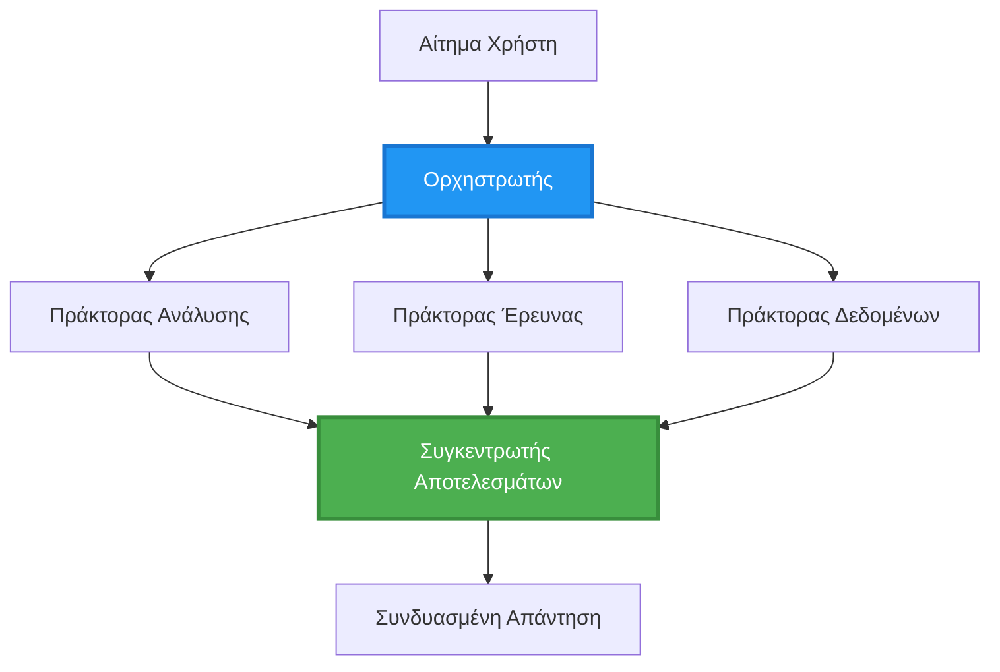
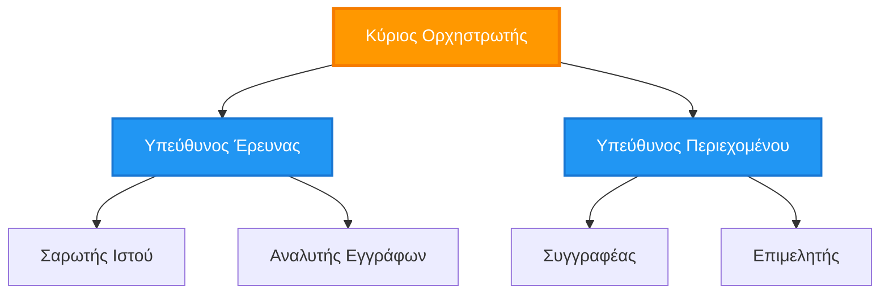
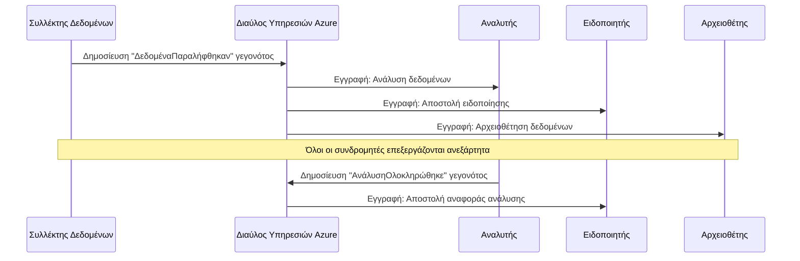
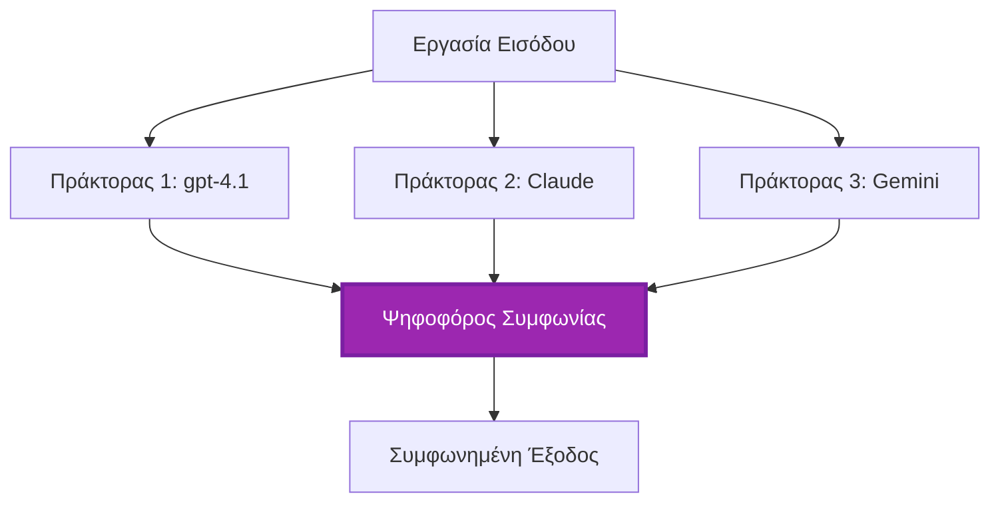
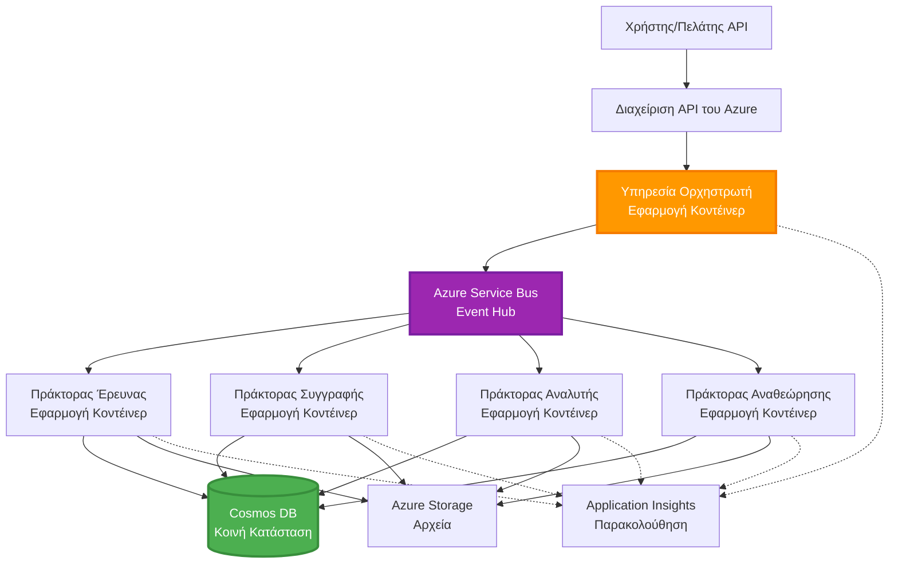

# Πρότυπα Συντονισμού Πολλών Πρακτόρων

⏱️ **Εκτιμώμενος χρόνος**: 60-75 λεπτά | 💰 **Εκτιμώμενο κόστος**: ~$100-300/month | ⭐ **Πολυπλοκότητα**: Προχωρημένο

**📚 Διαδρομή Μάθησης:**
- ← Προηγούμενο: [Σχεδιασμός Χωρητικότητας](capacity-planning.md) - Μέγεθος πόρων και στρατηγικές κλιμάκωσης
- 🎯 **Είστε εδώ**: Πρότυπα Συντονισμού Πολλών Πρακτόρων (Ορχήστρωση, επικοινωνία, διαχείριση κατάστασης)
- → Επόμενο: [Επιλογή SKU](sku-selection.md) - Επιλογή των κατάλληλων υπηρεσιών Azure
- 🏠 [Αρχική Μαθήματος](../../README.md)

---

## Τι θα μάθετε

Ολοκληρώνοντας αυτό το μάθημα, θα:
- Θα κατανοήσετε τα πρότυπα **αρχιτεκτονικής πολλαπλών πρακτόρων** και πότε να τα χρησιμοποιείτε
- Θα υλοποιήσετε **πρότυπα ορχήστρωσης** (κεντρικοποιημένα, αποκεντρωμένα, ιεραρχικά)
- Θα σχεδιάσετε στρατηγικές **επικοινωνίας πρακτόρων** (συγχρονικές, ασύγχρονες, βασισμένες σε γεγονότα)
- Θα διαχειριστείτε **κοινή κατάσταση** σε κατανεμημένους πράκτορες
- Θα αναπτύξετε **συστήματα πολλαπλών πρακτόρων** στο Azure με AZD
- Θα εφαρμόσετε **πρότυπα συντονισμού** σε πραγματικά σενάρια AI
- Θα παρακολουθείτε και θα αποσφαλματώνετε κατανεμημένα συστήματα πρακτόρων

## Γιατί ο Συντονισμός Πολλών Πρακτόρων έχει Σημασία

### Η Εξέλιξη: Από έναν Πράκτορα σε Πολλούς Πράκτορες

**Μοναδικός Πράκτορας (Απλό):**
```
User → Agent → Response
```
- ✅ Εύκολο στην κατανόηση και υλοποίηση
- ✅ Γρήγορο για απλές εργασίες
- ❌ Περιορισμένο από τις δυνατότητες ενός μοντέλου
- ❌ Δεν μπορεί να παραλληλοποιήσει σύνθετες εργασίες
- ❌ Δεν υπάρχει εξειδίκευση

**Σύστημα Πολλών Πρακτόρων (Προχωρημένο):**
```mermaid
graph TD
    Orchestrator[Ορχηστρωτής] --> Agent1[Πράκτορας1<br/>Σχέδιο]
    Orchestrator --> Agent2[Πράκτορας2<br/>Κώδικας]
    Orchestrator --> Agent3[Πράκτορας3<br/>Ανασκόπηση]
```- ✅ Εξειδικευμένοι πράκτορες για συγκεκριμένες εργασίες
- ✅ Παράλληλη εκτέλεση για ταχύτητα
- ✅ Δομημένο σε μονάδες και ευκολοσυντηρήσιμο
- ✅ Καλύτερο σε σύνθετες ροές εργασίας
- ⚠️ Απαιτεί λογική συντονισμού

**Αναλογία**: Ο μοναδικός πράκτορας είναι σαν ένα άτομο που κάνει όλες τις εργασίες. Το σύστημα πολλών πρακτόρων είναι σαν μια ομάδα όπου κάθε μέλος έχει εξειδικευμένες δεξιότητες (ερευνητής, προγραμματιστής, επιμελητής, συγγραφέας) που συνεργάζονται.

---

## Κύρια Πρότυπα Συντονισμού

### Πρότυπο 1: Διαδοχικός Συντονισμός (Αλυσίδα Ευθύνης)

**Πότε να χρησιμοποιηθεί**: Οι εργασίες πρέπει να ολοκληρωθούν σε συγκεκριμένη σειρά, κάθε πράκτορας βασίζεται στην έξοδο του προηγούμενου.

```mermaid
sequenceDiagram
    participant User
    participant Orchestrator
    participant Agent1 as Πράκτορας Έρευνας
    participant Agent2 as Πράκτορας Συγγραφής
    participant Agent3 as Πράκτορας Επιμέλειας
    
    User->>Orchestrator: "Γράψε άρθρο για την τεχνητή νοημοσύνη"
    Orchestrator->>Agent1: Ερεύνησε το θέμα
    Agent1-->>Orchestrator: Αποτελέσματα έρευνας
    Orchestrator->>Agent2: Γράψε προσχέδιο (με χρήση της έρευνας)
    Agent2-->>Orchestrator: Προσχέδιο άρθρου
    Orchestrator->>Agent3: Επιμέλεια και βελτίωση
    Agent3-->>Orchestrator: Τελικό άρθρο
    Orchestrator-->>User: Επεξεργασμένο άρθρο
    
    Note over User,Agent3: Σειριακά: Κάθε βήμα περιμένει το προηγούμενο
```
**Οφέλη:**
- ✅ Σαφής ροή δεδομένων
- ✅ Εύκολο στον εντοπισμό σφαλμάτων
- ✅ Προβλέψιμη σειρά εκτέλεσης

**Περιορισμοί:**
- ❌ Πιο αργό (χωρίς παραλληλισμό)
- ❌ Μια αποτυχία μπλοκάρει ολόκληρη την αλυσίδα
- ❌ Δεν μπορεί να χειριστεί αλληλεξαρτώμενες εργασίες

**Παραδείγματα Χρήσης:**
- Pipeline δημιουργίας περιεχομένου (έρευνα → συγγραφή → επιμέλεια → δημοσίευση)
- Γενιά κώδικα (σχεδιασμός → υλοποίηση → δοκιμή → ανάπτυξη)
- Δημιουργία αναφορών (συλλογή δεδομένων → ανάλυση → οπτικοποίηση → σύνοψη)

---

### Πρότυπο 2: Παράλληλος Συντονισμός (Fan-Out/Fan-In)

**Πότε να χρησιμοποιηθεί**: Ανεξάρτητες εργασίες μπορούν να εκτελεστούν ταυτόχρονα, τα αποτελέσματα συνδυάζονται στο τέλος.


**Οφέλη:**
- ✅ Γρήγορο (παράλληλη εκτέλεση)
- ✅ Ανθεκτικό σε σφάλματα (επιτρέπονται μερικά αποτελέσματα)
- ✅ Κλιμακώνεται οριζόντια

**Περιορισμοί:**
- ⚠️ Τα αποτελέσματα μπορεί να φτάσουν εκτός σειράς
- ⚠️ Απαιτείται λογική συγκέντρωσης αποτελεσμάτων
- ⚠️ Σύνθετη διαχείριση κατάστασης

**Παραδείγματα Χρήσης:**
- Συλλογή δεδομένων από πολλαπλές πηγές (API + βάσεις δεδομένων + web scraping)
- Ανταγωνιστική ανάλυση (πολλαπλά μοντέλα παράγουν λύσεις, επιλέγεται η καλύτερη)
- Υπηρεσίες μετάφρασης (μεταφράσεις σε πολλαπλές γλώσσες ταυτόχρονα)

---

### Πρότυπο 3: Ιεραρχικός Συντονισμός (Manager-Worker)

**Πότε να χρησιμοποιηθεί**: Σύνθετες ροές εργασίας με υπο-εργασίες, απαιτείται ανάθεση.


**Οφέλη:**
- ✅ Χειρίζεται σύνθετες ροές εργασίας
- ✅ Δομημένο σε μονάδες και ευκολοσυντηρήσιμο
- ✅ Σαφή όρια ευθυνών

**Περιορισμοί:**
- ⚠️ Πιο πολύπλοκη αρχιτεκτονική
- ⚠️ Μεγαλύτερη καθυστέρηση (πολλαπλά επίπεδα συντονισμού)
- ⚠️ Απαιτεί προηγμένη ορχήστρωση

**Παραδείγματα Χρήσης:**
- Επεξεργασία εγγράφων επιχείρησης (κατηγοριοποίηση → δρομολόγηση → επεξεργασία → αρχειοθέτηση)
- Πολυ-σταδιακά data pipelines (εισαγωγή → καθαρισμός → μετασχηματισμός → ανάλυση → αναφορά)
- Σύνθετες ροές αυτοματοποίησης (σχεδιασμός → κατανομή πόρων → εκτέλεση → παρακολούθηση)

---

### Πρότυπο 4: Συντονισμός Βασισμένος σε Γεγονότα (Publish-Subscribe)

**Πότε να χρησιμοποιηθεί**: Όταν οι πράκτορες πρέπει να αντιδρούν σε γεγονότα και επιθυμείται χαλαρή σύζευξη.


**Οφέλη:**
- ✅ Χαλαρή σύνδεση μεταξύ πρακτόρων
- ✅ Εύκολο να προστεθούν νέοι πράκτορες (απλά εγγραφή)
- ✅ Ασύγχρονη επεξεργασία
- ✅ Ανθεκτικό (επίμονη αποθήκευση μηνυμάτων)

**Περιορισμοί:**
- ⚠️ Τελική συνοχή
- ⚠️ Σύνθετη αποσφαλμάτωση
- ⚠️ Προκλήσεις στην σειρά των μηνυμάτων

**Παραδείγματα Χρήσης:**
- Συστήματα παρακολούθησης σε πραγματικό χρόνο (ειδοποιήσεις, πίνακες ελέγχου, αρχεία καταγραφής)
- Πολυ-καναλικές ειδοποιήσεις (email, SMS, push, Slack)
- Data pipelines επεξεργασίας (πολλαπλοί καταναλωτές των ίδιων δεδομένων)

---

### Πρότυπο 5: Συντονισμός Βασισμένος σε Συμφωνία (Ψηφοφορία/Απαρτία)

**Πότε να χρησιμοποιηθεί**: Όταν χρειάζεται συμφωνία από πολλούς πράκτορες πριν προχωρήσετε.


**Οφέλη:**
- ✅ Υψηλότερη ακρίβεια (πολλαπλές απόψεις)
- ✅ Ανθεκτικό σε σφάλματα (αποδεκτές οι αποτυχίες μειοψηφίας)
- ✅ Ενσωματωμένη διασφάλιση ποιότητας

**Περιορισμοί:**
- ❌ Ακριβό (πολλαπλές κλήσεις σε μοντέλα)
- ❌ Πιο αργό (αναμονή για όλους τους πράκτορες)
- ⚠️ Απαιτείται επίλυση συγκρούσεων

**Παραδείγματα Χρήσης:**
- Εποπτεία περιεχομένου (πολλαπλά μοντέλα ελέγχουν το περιεχόμενο)
- Ανασκόπηση κώδικα (πολλαπλοί linters/αναλυτές)
- Ιατρική διάγνωση (πολλαπλά μοντέλα AI, επικύρωση από ειδικούς)

---

## Επισκόπηση Αρχιτεκτονικής

### Ολοκληρωμένο Σύστημα Πολλών Πρακτόρων στο Azure


**Κύρια Συστατικά:**

| Συστατικό | Σκοπός | Υπηρεσία Azure |
|-----------|---------|---------------|
| **Πύλη API** | Σημείο εισόδου, περιορισμός αιτήσεων, εξουσιοδότηση | API Management |
| **Ορχηστρωτής** | Συντονίζει ροές εργασίας πρακτόρων | Container Apps |
| **Ουρά Μηνυμάτων** | Ασύγχρονη επικοινωνία | Service Bus / Event Hubs |
| **Πράκτορες** | Εξειδικευμένοι AI εργαζόμενοι | Container Apps / Functions |
| **Αποθήκη Κατάστασης** | Κοινή κατάσταση, παρακολούθηση εργασιών | Cosmos DB |
| **Αποθήκευση Αρχείων** | Έγγραφα, αποτελέσματα, αρχεία καταγραφής | Blob Storage |
| **Παρακολούθηση** | Κατανεμημένη ιχνηλάτηση, αρχεία καταγραφής | Application Insights |

---

## Προαπαιτούμενα

### Απαιτούμενα Εργαλεία

```bash
# Επαληθεύστε το Azure Developer CLI
azd version
# ✅ Αναμενόμενο: azd έκδοση 1.0.0 ή νεότερη

# Επαληθεύστε το Azure CLI
az --version
# ✅ Αναμενόμενο: azure-cli 2.50.0 ή νεότερη

# Επαληθεύστε το Docker (για τοπικές δοκιμές)
docker --version
# ✅ Αναμενόμενο: έκδοση Docker 20.10 ή νεότερη
```

### Απαιτήσεις Azure

- Ενεργή συνδρομή Azure
- Δικαιώματα για δημιουργία:
  - Container Apps
  - Service Bus namespaces
  - Cosmos DB accounts
  - Storage accounts
  - Application Insights

### Προαπαιτούμενες Γνώσεις

Θα πρέπει να έχετε ολοκληρώσει:
- [Διαχείριση Διαμόρφωσης](../chapter-03-configuration/configuration.md)
- [Έλεγχος ταυτότητας & Ασφάλεια](../chapter-03-configuration/authsecurity.md)
- [Παράδειγμα Μικροϋπηρεσιών](../../../../examples/microservices)

---

## Οδηγός Υλοποίησης

### Δομή Έργου

```
multi-agent-system/
├── azure.yaml                    # AZD configuration
├── infra/
│   ├── main.bicep               # Main infrastructure
│   ├── core/
│   │   ├── servicebus.bicep     # Message queue
│   │   ├── cosmos.bicep         # State store
│   │   ├── storage.bicep        # Artifact storage
│   │   └── monitoring.bicep     # Application Insights
│   └── app/
│       ├── orchestrator.bicep   # Orchestrator service
│       └── agent.bicep          # Agent template
└── src/
    ├── orchestrator/            # Orchestration logic
    │   ├── app.py
    │   ├── workflows.py
    │   └── Dockerfile
    ├── agents/
    │   ├── research/            # Research agent
    │   ├── writer/              # Writer agent
    │   ├── analyst/             # Analyst agent
    │   └── reviewer/            # Reviewer agent
    └── shared/
        ├── state_manager.py     # Shared state logic
        └── message_handler.py   # Message handling
```

---

## Μάθημα 1: Πρότυπο Διαδοχικού Συντονισμού

### Υλοποίηση: Pipeline Δημιουργίας Περιεχομένου

Ας δημιουργήσουμε ένα διαδοχικό pipeline: Έρευνα → Συγγραφή → Επιμέλεια → Δημοσίευση

### 1. Διαμόρφωση AZD

**Αρχείο: `azure.yaml`**

```yaml
name: content-pipeline
metadata:
  template: multi-agent-sequential@1.0.0

services:
  orchestrator:
    project: ./src/orchestrator
    language: python
    host: containerapp
  
  research-agent:
    project: ./src/agents/research
    language: python
    host: containerapp
  
  writer-agent:
    project: ./src/agents/writer
    language: python
    host: containerapp
  
  editor-agent:
    project: ./src/agents/editor
    language: python
    host: containerapp
```

### 2. Υποδομή: Service Bus για Συντονισμό

**Αρχείο: `infra/core/servicebus.bicep`**

```bicep
param name string
param location string
param tags object = {}

resource serviceBusNamespace 'Microsoft.ServiceBus/namespaces@2022-10-01-preview' = {
  name: name
  location: location
  tags: tags
  sku: {
    name: 'Standard'
    tier: 'Standard'
  }
  properties: {
    minimumTlsVersion: '1.2'
  }
}

// Queue for orchestrator → research agent
resource researchQueue 'Microsoft.ServiceBus/namespaces/queues@2022-10-01-preview' = {
  parent: serviceBusNamespace
  name: 'research-tasks'
  properties: {
    maxDeliveryCount: 3
    lockDuration: 'PT5M'
    deadLetteringOnMessageExpiration: true
  }
}

// Queue for research agent → writer agent
resource writerQueue 'Microsoft.ServiceBus/namespaces/queues@2022-10-01-preview' = {
  parent: serviceBusNamespace
  name: 'writer-tasks'
  properties: {
    maxDeliveryCount: 3
    lockDuration: 'PT5M'
  }
}

// Queue for writer agent → editor agent
resource editorQueue 'Microsoft.ServiceBus/namespaces/queues@2022-10-01-preview' = {
  parent: serviceBusNamespace
  name: 'editor-tasks'
  properties: {
    maxDeliveryCount: 3
    lockDuration: 'PT5M'
  }
}

output namespace string = serviceBusNamespace.name
output connectionString string = listKeys('${serviceBusNamespace.id}/AuthorizationRules/RootManageSharedAccessKey', serviceBusNamespace.apiVersion).primaryConnectionString
```

### 3. Διαχειριστής Κοινής Κατάστασης

**Αρχείο: `src/shared/state_manager.py`**

```python
from azure.cosmos import CosmosClient, PartitionKey
from datetime import datetime
import os

class StateManager:
    """Manages shared state across agents using Cosmos DB"""
    
    def __init__(self):
        endpoint = os.environ['COSMOS_ENDPOINT']
        key = os.environ['COSMOS_KEY']
        
        self.client = CosmosClient(endpoint, key)
        self.database = self.client.get_database_client('agent-state')
        self.container = self.database.get_container_client('tasks')
    
    def create_task(self, task_id: str, task_type: str, input_data: dict):
        """Create a new task"""
        task = {
            'id': task_id,
            'type': task_type,
            'status': 'pending',
            'input': input_data,
            'created_at': datetime.utcnow().isoformat(),
            'steps': []
        }
        self.container.create_item(task)
        return task
    
    def update_task_step(self, task_id: str, step_name: str, result: dict):
        """Update task with completed step"""
        task = self.container.read_item(task_id, partition_key=task_id)
        
        task['steps'].append({
            'name': step_name,
            'completed_at': datetime.utcnow().isoformat(),
            'result': result
        })
        
        self.container.replace_item(task_id, task)
        return task
    
    def complete_task(self, task_id: str, final_result: dict):
        """Mark task as complete"""
        task = self.container.read_item(task_id, partition_key=task_id)
        task['status'] = 'completed'
        task['result'] = final_result
        task['completed_at'] = datetime.utcnow().isoformat()
        self.container.replace_item(task_id, task)
        return task
    
    def get_task(self, task_id: str):
        """Retrieve task state"""
        return self.container.read_item(task_id, partition_key=task_id)
```

### 4. Υπηρεσία Ορχηστρωτή

**Αρχείο: `src/orchestrator/app.py`**

```python
from flask import Flask, request, jsonify
from azure.servicebus import ServiceBusClient, ServiceBusMessage
import json
import uuid
import os
from shared.state_manager import StateManager

app = Flask(__name__)
state_manager = StateManager()

# Σύνδεση Service Bus
servicebus_connection_str = os.environ['SERVICEBUS_CONNECTION_STRING']
servicebus_client = ServiceBusClient.from_connection_string(servicebus_connection_str)

@app.route('/health', methods=['GET'])
def health():
    return jsonify({'status': 'healthy', 'service': 'orchestrator'})

@app.route('/create-content', methods=['POST'])
def create_content():
    """
    Sequential workflow: Research → Write → Edit → Publish
    """
    data = request.json
    topic = data.get('topic')
    
    if not topic:
        return jsonify({'error': 'Topic required'}), 400
    
    # Δημιουργία εργασίας στην αποθήκη κατάστασης
    task_id = str(uuid.uuid4())
    task = state_manager.create_task(
        task_id=task_id,
        task_type='content_creation',
        input_data={'topic': topic}
    )
    
    # Αποστολή μηνύματος στον πράκτορα έρευνας (πρώτο βήμα)
    sender = servicebus_client.get_queue_sender('research-tasks')
    message = ServiceBusMessage(
        body=json.dumps({
            'task_id': task_id,
            'topic': topic,
            'next_queue': 'writer-tasks'  # Πού να αποσταλούν τα αποτελέσματα
        }),
        content_type='application/json'
    )
    
    with sender:
        sender.send_messages(message)
    
    return jsonify({
        'task_id': task_id,
        'status': 'started',
        'workflow': 'sequential',
        'steps': ['research', 'write', 'edit', 'publish'],
        'message': 'Content creation pipeline initiated'
    }), 202

@app.route('/task/<task_id>', methods=['GET'])
def get_task_status(task_id):
    """Check task status"""
    try:
        task = state_manager.get_task(task_id)
        return jsonify(task)
    except Exception as e:
        return jsonify({'error': str(e)}), 404

if __name__ == '__main__':
    app.run(host='0.0.0.0', port=8080)
```

### 5. Πράκτορας Έρευνας

**Αρχείο: `src/agents/research/app.py`**

```python
from azure.servicebus import ServiceBusClient, ServiceBusMessage
from openai import AzureOpenAI
import json
import os
import time
from shared.state_manager import StateManager

# Αρχικοποίηση πελατών
state_manager = StateManager()
servicebus_client = ServiceBusClient.from_connection_string(
    os.environ['SERVICEBUS_CONNECTION_STRING']
)

openai_client = AzureOpenAI(
    api_key=os.environ['AZURE_OPENAI_API_KEY'],
    api_version="2024-02-01",
    azure_endpoint=os.environ['AZURE_OPENAI_ENDPOINT']
)

def process_research_task(message_data):
    """Process research request and pass to writer"""
    task_id = message_data['task_id']
    topic = message_data['topic']
    next_queue = message_data['next_queue']
    
    print(f"🔬 Researching: {topic}")
    
    # Κλήση μοντέλων Microsoft Foundry για έρευνα
    response = openai_client.chat.completions.create(
        model="gpt-4.1",
        messages=[
            {"role": "system", "content": "You are a research assistant. Provide comprehensive research on the given topic."},
            {"role": "user", "content": f"Research this topic thoroughly: {topic}"}
        ],
        max_tokens=1500
    )
    
    research_results = response.choices[0].message.content
    
    # Ενημέρωση κατάστασης
    state_manager.update_task_step(
        task_id=task_id,
        step_name='research',
        result={'research': research_results}
    )
    
    # Αποστολή στον επόμενο πράκτορα (συγγραφέα)
    sender = servicebus_client.get_queue_sender(next_queue)
    message = ServiceBusMessage(
        body=json.dumps({
            'task_id': task_id,
            'topic': topic,
            'research': research_results,
            'next_queue': 'editor-tasks'
        }),
        content_type='application/json'
    )
    
    with sender:
        sender.send_messages(message)
    
    print(f"✅ Research complete for task {task_id}")

def main():
    """Listen to research queue"""
    receiver = servicebus_client.get_queue_receiver('research-tasks')
    
    print("🔬 Research Agent started, listening for tasks...")
    
    with receiver:
        while True:
            messages = receiver.receive_messages(max_wait_time=5)
            for message in messages:
                try:
                    message_data = json.loads(str(message))
                    process_research_task(message_data)
                    receiver.complete_message(message)
                except Exception as e:
                    print(f"❌ Error processing message: {e}")
                    receiver.abandon_message(message)

if __name__ == '__main__':
    main()
```

### 6. Πράκτορας Συγγραφής

**Αρχείο: `src/agents/writer/app.py`**

```python
from azure.servicebus import ServiceBusClient, ServiceBusMessage
from openai import AzureOpenAI
import json
import os
from shared.state_manager import StateManager

state_manager = StateManager()
servicebus_client = ServiceBusClient.from_connection_string(
    os.environ['SERVICEBUS_CONNECTION_STRING']
)

openai_client = AzureOpenAI(
    api_key=os.environ['AZURE_OPENAI_API_KEY'],
    api_version="2024-02-01",
    azure_endpoint=os.environ['AZURE_OPENAI_ENDPOINT']
)

def process_writing_task(message_data):
    """Write article based on research"""
    task_id = message_data['task_id']
    topic = message_data['topic']
    research = message_data['research']
    next_queue = message_data['next_queue']
    
    print(f"✍️ Writing article: {topic}")
    
    # Καλέστε τα Microsoft Foundry Models για να γράψουν ένα άρθρο
    response = openai_client.chat.completions.create(
        model="gpt-4.1",
        messages=[
            {"role": "system", "content": "You are a professional writer. Write engaging, well-structured articles."},
            {"role": "user", "content": f"Based on this research:\n\n{research}\n\nWrite a comprehensive article about: {topic}"}
        ],
        max_tokens=2000
    )
    
    article_draft = response.choices[0].message.content
    
    # Ενημέρωση κατάστασης
    state_manager.update_task_step(
        task_id=task_id,
        step_name='writing',
        result={'draft': article_draft}
    )
    
    # Αποστολή στον συντάκτη
    sender = servicebus_client.get_queue_sender(next_queue)
    message = ServiceBusMessage(
        body=json.dumps({
            'task_id': task_id,
            'topic': topic,
            'draft': article_draft
        }),
        content_type='application/json'
    )
    
    with sender:
        sender.send_messages(message)
    
    print(f"✅ Article draft complete for task {task_id}")

def main():
    """Listen to writer queue"""
    receiver = servicebus_client.get_queue_receiver('writer-tasks')
    
    print("✍️ Writer Agent started, listening for tasks...")
    
    with receiver:
        while True:
            messages = receiver.receive_messages(max_wait_time=5)
            for message in messages:
                try:
                    message_data = json.loads(str(message))
                    process_writing_task(message_data)
                    receiver.complete_message(message)
                except Exception as e:
                    print(f"❌ Error: {e}")
                    receiver.abandon_message(message)

if __name__ == '__main__':
    main()
```

### 7. Πράκτορας Επιμέλειας

**Αρχείο: `src/agents/editor/app.py`**

```python
from azure.servicebus import ServiceBusClient
from openai import AzureOpenAI
import json
import os
from shared.state_manager import StateManager

state_manager = StateManager()
servicebus_client = ServiceBusClient.from_connection_string(
    os.environ['SERVICEBUS_CONNECTION_STRING']
)

openai_client = AzureOpenAI(
    api_key=os.environ['AZURE_OPENAI_API_KEY'],
    api_version="2024-02-01",
    azure_endpoint=os.environ['AZURE_OPENAI_ENDPOINT']
)

def process_editing_task(message_data):
    """Edit and finalize article"""
    task_id = message_data['task_id']
    topic = message_data['topic']
    draft = message_data['draft']
    
    print(f"📝 Editing article: {topic}")
    
    # Καλέστε τα Microsoft Foundry Models για επεξεργασία
    response = openai_client.chat.completions.create(
        model="gpt-4.1",
        messages=[
            {"role": "system", "content": "You are an expert editor. Improve grammar, clarity, and structure."},
            {"role": "user", "content": f"Edit and improve this article:\n\n{draft}"}
        ],
        max_tokens=2000
    )
    
    final_article = response.choices[0].message.content
    
    # Σημειώστε την εργασία ως ολοκληρωμένη
    state_manager.complete_task(
        task_id=task_id,
        final_result={
            'topic': topic,
            'final_article': final_article,
            'word_count': len(final_article.split())
        }
    )
    
    print(f"✅ Article finalized for task {task_id}")

def main():
    """Listen to editor queue"""
    receiver = servicebus_client.get_queue_receiver('editor-tasks')
    
    print("📝 Editor Agent started, listening for tasks...")
    
    with receiver:
        while True:
            messages = receiver.receive_messages(max_wait_time=5)
            for message in messages:
                try:
                    message_data = json.loads(str(message))
                    process_editing_task(message_data)
                    receiver.complete_message(message)
                except Exception as e:
                    print(f"❌ Error: {e}")
                    receiver.abandon_message(message)

if __name__ == '__main__':
    main()
```

### 8. Ανάπτυξη και Δοκιμή

```bash
# Επιλογή A: Ανάπτυξη βάσει προτύπου
azd init
azd up

# Επιλογή B: Ανάπτυξη με manifest του πράκτορα (απαιτεί επέκταση)
azd extension install azure.ai.agents
azd ai agent init -m agent-manifest.yaml
azd up
```

> Δείτε [Εντολές AZD AI CLI](../chapter-08-production/production-ai-practices.md#azd-ai-cli-commands-and-extensions) για όλες τις παραμέτρους και επιλογές του `azd ai`.

```bash
# Λήψη του URL του ορχηστρωτή
ORCHESTRATOR_URL=$(azd env get-values | grep ORCHESTRATOR_URL | cut -d '=' -f2 | tr -d '"')

# Δημιουργία περιεχομένου
curl -X POST $ORCHESTRATOR_URL/create-content \
  -H "Content-Type: application/json" \
  -d '{"topic": "The Future of AI in Healthcare"}'
```

**✅ Αναμενόμενη έξοδος:**
```json
{
  "task_id": "a1b2c3d4-e5f6-7890-abcd-ef1234567890",
  "status": "started",
  "workflow": "sequential",
  "steps": ["research", "write", "edit", "publish"],
  "message": "Content creation pipeline initiated"
}
```

**Έλεγχος προόδου εργασίας:**
```bash
TASK_ID="a1b2c3d4-e5f6-7890-abcd-ef1234567890"
curl $ORCHESTRATOR_URL/task/$TASK_ID
```

**✅ Αναμενόμενη έξοδος (ολοκληρώθηκε):**
```json
{
  "id": "a1b2c3d4-e5f6-7890-abcd-ef1234567890",
  "type": "content_creation",
  "status": "completed",
  "steps": [
    {
      "name": "research",
      "completed_at": "2025-11-19T10:30:00Z",
      "result": {"research": "..."}
    },
    {
      "name": "writing",
      "completed_at": "2025-11-19T10:32:00Z",
      "result": {"draft": "..."}
    }
  ],
  "result": {
    "topic": "The Future of AI in Healthcare",
    "final_article": "...",
    "word_count": 1500
  }
}
```

---

## Μάθημα 2: Πρότυπο Παράλληλου Συντονισμού

### Υλοποίηση: Συλλέκτης Έρευνας από Πολλαπλές Πηγές

Ας δημιουργήσουμε ένα παράλληλο σύστημα που συγκεντρώνει πληροφορίες από πολλαπλές πηγές ταυτόχρονα.

### Παράλληλος Ορχηστρωτής

**Αρχείο: `src/orchestrator/parallel_workflow.py`**

```python
from flask import Flask, request, jsonify
from azure.servicebus import ServiceBusClient, ServiceBusMessage
import json
import uuid
import os
from shared.state_manager import StateManager

app = Flask(__name__)
state_manager = StateManager()

servicebus_client = ServiceBusClient.from_connection_string(
    os.environ['SERVICEBUS_CONNECTION_STRING']
)

@app.route('/research-parallel', methods=['POST'])
def research_parallel():
    """
    Parallel workflow: Multiple agents work simultaneously
    """
    data = request.json
    query = data.get('query')
    
    task_id = str(uuid.uuid4())
    task = state_manager.create_task(
        task_id=task_id,
        task_type='parallel_research',
        input_data={
            'query': query,
            'agents': ['web', 'academic', 'news', 'social']
        }
    )
    
    # Fan-out: Αποστολή σε όλους τους πράκτορες ταυτόχρονα
    agents = [
        ('web-research-queue', 'web'),
        ('academic-research-queue', 'academic'),
        ('news-research-queue', 'news'),
        ('social-research-queue', 'social')
    ]
    
    for queue_name, agent_type in agents:
        sender = servicebus_client.get_queue_sender(queue_name)
        message = ServiceBusMessage(
            body=json.dumps({
                'task_id': task_id,
                'query': query,
                'agent_type': agent_type,
                'result_queue': 'aggregation-queue'
            }),
            content_type='application/json'
        )
        
        with sender:
            sender.send_messages(message)
    
    return jsonify({
        'task_id': task_id,
        'status': 'started',
        'workflow': 'parallel',
        'agents_dispatched': 4,
        'message': 'Parallel research initiated'
    }), 202

if __name__ == '__main__':
    app.run(host='0.0.0.0', port=8080)
```

### Λογική Συγκέντρωσης

**Αρχείο: `src/agents/aggregator/app.py`**

```python
from azure.servicebus import ServiceBusClient
import json
import os
from collections import defaultdict
from shared.state_manager import StateManager

state_manager = StateManager()
servicebus_client = ServiceBusClient.from_connection_string(
    os.environ['SERVICEBUS_CONNECTION_STRING']
)

# Παρακολούθηση αποτελεσμάτων ανά εργασία
task_results = defaultdict(list)
expected_agents = 4  # διαδίκτυο, ακαδημαϊκά, ειδήσεις, κοινωνικά

def process_result(message_data):
    """Aggregate results from parallel agents"""
    task_id = message_data['task_id']
    agent_type = message_data['agent_type']
    result = message_data['result']
    
    # Αποθήκευση αποτελέσματος
    task_results[task_id].append({
        'agent': agent_type,
        'data': result
    })
    
    print(f"📊 Received result from {agent_type} agent ({len(task_results[task_id])}/{expected_agents})")
    
    # Έλεγχος αν όλοι οι πράκτορες ολοκλήρωσαν (fan-in)
    if len(task_results[task_id]) == expected_agents:
        print(f"✅ All agents completed for task {task_id}. Aggregating...")
        
        # Συνδυασμός αποτελεσμάτων
        aggregated = {
            'query': message_data['query'],
            'sources': task_results[task_id],
            'summary': generate_summary(task_results[task_id])
        }
        
        # Σήμανση ως ολοκληρωμένο
        state_manager.complete_task(task_id, aggregated)
        
        # Καθαρισμός
        del task_results[task_id]
        
        print(f"✅ Aggregation complete for task {task_id}")

def generate_summary(results):
    """Generate summary from all sources"""
    summaries = [r['data'].get('summary', '') for r in results]
    return '\n\n'.join(summaries)

def main():
    """Listen to aggregation queue"""
    receiver = servicebus_client.get_queue_receiver('aggregation-queue')
    
    print("📊 Aggregator started, listening for results...")
    
    with receiver:
        while True:
            messages = receiver.receive_messages(max_wait_time=5)
            for message in messages:
                try:
                    message_data = json.loads(str(message))
                    process_result(message_data)
                    receiver.complete_message(message)
                except Exception as e:
                    print(f"❌ Error: {e}")
                    receiver.abandon_message(message)

if __name__ == '__main__':
    main()
```

**Οφέλη του Παράλληλου Προτύπου:**
- ⚡ **4x ταχύτερο** (οι πράκτορες τρέχουν ταυτόχρονα)
- 🔄 **Ανθεκτικό σε σφάλματα** (επιτρέπονται μερικά αποτελέσματα)
- 📈 **Κλιμακούμενο** (προσθέστε περισσότερους πράκτορες εύκολα)

---

## Πρακτικές Ασκήσεις

### Άσκηση 1: Προσθήκη Χειρισμού Χρονικού Ορίου ⭐⭐ (Μέτριο)

**Στόχος**: Υλοποιήστε λογική χρονικού ορίου ώστε ο συλλέκτης να μην περιμένει επ' αόριστον τους αργούς πράκτορες.

**Βήματα**:

1. **Προσθέστε παρακολούθηση χρονικού ορίου στον συλλέκτη:**

```python
from datetime import datetime, timedelta

task_timeouts = {}  # αναγνωριστικό_εργασίας -> χρόνος_λήξης

def process_result(message_data):
    task_id = message_data['task_id']
    
    # Ορισμός χρονικού ορίου στο πρώτο αποτέλεσμα
    if task_id not in task_timeouts:
        task_timeouts[task_id] = datetime.utcnow() + timedelta(seconds=30)
    
    task_results[task_id].append({
        'agent': message_data['agent_type'],
        'data': message_data['result']
    })
    
    # Ελέγξτε αν ολοκληρώθηκε ή αν έληξε το χρονικό όριο
    if len(task_results[task_id]) == expected_agents or \
       datetime.utcnow() > task_timeouts[task_id]:
        
        print(f"📊 Aggregating with {len(task_results[task_id])}/{expected_agents} results")
        
        aggregated = {
            'query': message_data['query'],
            'sources': task_results[task_id],
            'completed_agents': len(task_results[task_id]),
            'timed_out': len(task_results[task_id]) < expected_agents
        }
        
        state_manager.complete_task(task_id, aggregated)
        
        # Καθαρισμός
        del task_results[task_id]
        del task_timeouts[task_id]
```

2. **Δοκιμάστε με τεχνητές καθυστερήσεις:**

```python
# Σε έναν πράκτορα, πρόσθεσε καθυστέρηση για να προσομοιώσεις αργή επεξεργασία
import time
time.sleep(35)  # Υπερβαίνει το χρονικό όριο των 30 δευτερολέπτων
```

3. **Αναπτύξτε και επαληθεύστε:**

```bash
azd deploy aggregator

# Υποβολή εργασίας
curl -X POST $ORCHESTRATOR_URL/research-parallel \
  -H "Content-Type: application/json" \
  -d '{"query": "AI safety research"}'

# Ελέγξτε τα αποτελέσματα μετά από 30 δευτερόλεπτα
curl $ORCHESTRATOR_URL/task/$TASK_ID
```

**✅ Κριτήρια Επιτυχίας:**
- ✅ Η εργασία ολοκληρώνεται μετά από 30 δευτερόλεπτα ακόμη κι αν οι πράκτορες δεν έχουν ολοκληρώσει
- ✅ Η απάντηση υποδεικνύει μερικά αποτελέσματα (`"timed_out": true`)
- ✅ Τα διαθέσιμα αποτελέσματα επιστρέφονται (3 από 4 πράκτορες)

**Χρόνος**: 20-25 λεπτά

---

### Άσκηση 2: Υλοποίηση Λογικής Επαναπροσπάθειας ⭐⭐⭐ (Προχωρημένο)

**Στόχος**: Επαναπροσπαθήστε αυτόματα τις αποτυχημένες εργασίες πρακτόρων πριν εγκαταλείψετε.

**Βήματα**:

1. **Προσθέστε παρακολούθηση επαναπροσπαθειών στον ορχηστρωτή:**

```python
from dataclasses import dataclass
from typing import Dict

@dataclass
class RetryConfig:
    max_retries: int = 3
    backoff_seconds: int = 5

retry_counts: Dict[str, int] = {}  # αναγνωριστικό_μηνύματος -> αριθμός_επαναπροσπαθειών

def send_with_retry(queue_name: str, message_data: dict, retry_config: RetryConfig):
    """Send message with retry metadata"""
    message_id = message_data.get('message_id', str(uuid.uuid4()))
    message_data['message_id'] = message_id
    message_data['retry_count'] = retry_counts.get(message_id, 0)
    message_data['max_retries'] = retry_config.max_retries
    
    sender = servicebus_client.get_queue_sender(queue_name)
    message = ServiceBusMessage(
        body=json.dumps(message_data),
        content_type='application/json',
        message_id=message_id
    )
    
    with sender:
        sender.send_messages(message)
```

2. **Προσθέστε χειριστή επαναπροσπάθειας στους πράκτορες:**

```python
def process_with_retry(message, receiver, process_func):
    """Process message with automatic retry on failure"""
    try:
        message_data = json.loads(str(message))
        
        # Επεξεργασία του μηνύματος
        process_func(message_data)
        
        # Επιτυχία - ολοκληρώθηκε
        receiver.complete_message(message)
        
    except Exception as e:
        message_id = message.message_id
        retry_count = message_data.get('retry_count', 0)
        max_retries = message_data.get('max_retries', 3)
        
        if retry_count < max_retries:
            # Επανάληψη: εγκατάλειψη και επανατοποθέτηση στην ουρά με αυξημένο μετρητή
            print(f"⚠️ Retry {retry_count + 1}/{max_retries} for message {message_id}")
            
            message_data['retry_count'] = retry_count + 1
            
            # Αποστολή πίσω στην ίδια ουρά με καθυστέρηση
            time.sleep(5 * (retry_count + 1))  # Εκθετική καθυστέρηση
            send_with_retry(queue_name, message_data, RetryConfig())
            
            receiver.complete_message(message)  # Αφαίρεση του αρχικού μηνύματος
        else:
            # Ο μέγιστος αριθμός επαναπροσπαθειών υπερβήθηκε - μεταφορά στην ουρά νεκρών μηνυμάτων
            print(f"❌ Max retries exceeded for message {message_id}")
            receiver.dead_letter_message(
                message,
                reason="MaxRetriesExceeded",
                error_description=str(e)
            )
```

3. **Παρακολουθήστε την ουρά dead letter:**

```python
def monitor_dead_letters():
    """Check dead letter queue for failed messages"""
    receiver = servicebus_client.get_queue_receiver(
        'research-queue',
        sub_queue='deadletter'
    )
    
    with receiver:
        messages = receiver.receive_messages(max_wait_time=5)
        for message in messages:
            print(f"☠️ Dead letter: {message.message_id}")
            print(f"Reason: {message.dead_letter_reason}")
            print(f"Description: {message.dead_letter_error_description}")
```

**✅ Κριτήρια Επιτυχίας:**
- ✅ Οι αποτυχημένες εργασίες επαναπροσπαθούν αυτόματα (έως 3 φορές)
- ✅ Εκθετική καθυστέρηση μεταξύ επαναπροσπαθειών (5s, 10s, 15s)
- ✅ Μετά τις μέγιστες επαναπροσπάθειες, τα μηνύματα πηγαίνουν στην ουρά dead letter
- ✅ Η ουρά dead letter μπορεί να παρακολουθείται και να αναπαράγεται

**Χρόνος**: 30-40 λεπτά

---

### Άσκηση 3: Υλοποίηση Circuit Breaker ⭐⭐⭐ (Προχωρημένο)

**Στόχος**: Να αποτραπούν καταρρεύσεις αλυσιδωτών σφαλμάτων σταματώντας τα αιτήματα προς αποτυχόντες πράκτορες.

**Βήματα**:

1. **Δημιουργήστε κλάση circuit breaker:**

```python
from enum import Enum
from datetime import datetime, timedelta

class CircuitState(Enum):
    CLOSED = "closed"      # Κανονική λειτουργία
    OPEN = "open"          # Αποτυγχάνει, απορρίψτε αιτήματα
    HALF_OPEN = "half_open"  # Έλεγχος αν έχει ανακάμψει

class CircuitBreaker:
    def __init__(self, failure_threshold=5, timeout_seconds=60):
        self.failure_threshold = failure_threshold
        self.timeout_seconds = timeout_seconds
        self.failure_count = 0
        self.last_failure_time = None
        self.state = CircuitState.CLOSED
    
    def call(self, func):
        """Execute function with circuit breaker protection"""
        if self.state == CircuitState.OPEN:
            # Ελέγξτε αν έχει λήξει το χρονικό όριο
            if datetime.utcnow() - self.last_failure_time > timedelta(seconds=self.timeout_seconds):
                self.state = CircuitState.HALF_OPEN
                print("🔄 Circuit breaker: HALF_OPEN (testing)")
            else:
                raise Exception(f"Circuit breaker OPEN for agent. Try again in {self.timeout_seconds}s")
        
        try:
            result = func()
            
            # Επιτυχία
            if self.state == CircuitState.HALF_OPEN:
                self.state = CircuitState.CLOSED
                self.failure_count = 0
                print("✅ Circuit breaker: CLOSED (recovered)")
            
            return result
            
        except Exception as e:
            self.failure_count += 1
            self.last_failure_time = datetime.utcnow()
            
            if self.failure_count >= self.failure_threshold:
                self.state = CircuitState.OPEN
                print(f"🔴 Circuit breaker: OPEN (too many failures)")
            
            raise e
```

2. **Εφαρμόστε στις κλήσεις προς πράκτορες:**

```python
# Στον ορχηστρωτή
agent_circuits = {
    'web': CircuitBreaker(failure_threshold=5, timeout_seconds=60),
    'academic': CircuitBreaker(failure_threshold=5, timeout_seconds=60),
    'news': CircuitBreaker(failure_threshold=5, timeout_seconds=60),
    'social': CircuitBreaker(failure_threshold=5, timeout_seconds=60)
}

def send_to_agent(agent_type, message_data):
    """Send with circuit breaker protection"""
    circuit = agent_circuits[agent_type]
    
    try:
        circuit.call(lambda: send_message(agent_type, message_data))
    except Exception as e:
        print(f"⚠️ Skipping {agent_type} agent: {e}")
        # Συνεχίστε με άλλους πράκτορες
```

3. **Δοκιμάστε τον circuit breaker:**

```bash
# Προσομοιώστε επανειλημμένες αποτυχίες (διακόψτε έναν πράκτορα)
az containerapp stop --name web-research-agent --resource-group rg-agents

# Στείλτε πολλαπλά αιτήματα
for i in {1..10}; do
  curl -X POST $ORCHESTRATOR_URL/research-parallel \
    -H "Content-Type: application/json" \
    -d '{"query": "test query '$i'"}'
  sleep 2
done

# Ελέγξτε τα αρχεία καταγραφής - θα πρέπει να δείτε το κύκλωμα ανοιχτό μετά από 5 αποτυχίες
# Χρησιμοποιήστε το Azure CLI για τα αρχεία καταγραφής της εφαρμογής Container App:
az containerapp logs show --name orchestrator --resource-group $RG_NAME --tail 50
```

**✅ Κριτήρια Επιτυχίας:**
- ✅ Μετά από 5 αποτυχίες, το κύκλωμα ανοίγει (απορρίπτει αιτήματα)
- ✅ Μετά από 60 δευτερόλεπτα, το κύκλωμα γίνεται ημι-ανοιχτό (half-open) (δοκιμάζει την ανάκαμψη)
- ✅ Οι άλλοι πράκτορες συνεχίζουν να λειτουργούν κανονικά
- ✅ Το κύκλωμα κλείνει αυτόματα όταν ο πράκτορας ανακάμψει

**Χρόνος**: 40-50 λεπτά

---

## Παρακολούθηση και Αποσφαλμάτωση

### Κατανεμημένη ιχνηλάτηση με το Application Insights

**Αρχείο: `src/shared/tracing.py`**

```python
from opencensus.ext.azure.log_exporter import AzureLogHandler
from opencensus.ext.azure.trace_exporter import AzureExporter
from opencensus.trace import config_integration
from opencensus.trace.tracer import Tracer
from opencensus.trace.samplers import AlwaysOnSampler
import logging
import os

# Ρυθμίστε την ιχνηλάτηση
config_integration.trace_integrations(['requests', 'logging'])

connection_string = os.environ.get('APPLICATIONINSIGHTS_CONNECTION_STRING')

# Δημιουργήστε ιχνηλάτη
tracer = Tracer(
    exporter=AzureExporter(connection_string=connection_string),
    sampler=AlwaysOnSampler()
)

# Ρυθμίστε την καταγραφή
logger = logging.getLogger(__name__)
logger.addHandler(AzureLogHandler(connection_string=connection_string))
logger.setLevel(logging.INFO)

def trace_agent_call(agent_name, task_id, operation):
    """Trace agent operations"""
    with tracer.span(name=f'{agent_name}.{operation}') as span:
        span.add_attribute('agent', agent_name)
        span.add_attribute('task_id', task_id)
        span.add_attribute('operation', operation)
        
        try:
            result = operation()
            span.add_attribute('status', 'success')
            return result
        except Exception as e:
            span.add_attribute('status', 'error')
            span.add_attribute('error', str(e))
            raise
```

### Ερωτήματα Application Insights

**Παρακολούθηση ροών εργασίας πολλών πρακτόρων:**

```kusto
// Trace complete workflow for a task
traces
| where customDimensions.task_id == "a1b2c3d4-..."
| project timestamp, message, customDimensions.agent, customDimensions.operation
| order by timestamp asc
```

**Σύγκριση απόδοσης πρακτόρων:**

```kusto
// Compare agent execution times
dependencies
| where name contains "agent"
| summarize 
    avg_duration = avg(duration),
    p95_duration = percentile(duration, 95),
    count = count()
  by agent = tostring(customDimensions.agent)
| order by avg_duration desc
```

**Ανάλυση αποτυχιών:**

```kusto
// Find which agents fail most
exceptions
| where customDimensions.agent != ""
| summarize 
    failure_count = count(),
    unique_errors = dcount(outerMessage)
  by agent = tostring(customDimensions.agent)
| order by failure_count desc
```

---

## Ανάλυση Κόστους

### Κόστη Συστήματος Πολλών Πρακτόρων (Μηνιαίες Εκτιμήσεις)

| Συστατικό | Διαμόρφωση | Κόστος |
|-----------|--------------|------|
| **Ορχηστρωτής** | 1 Container App (1 vCPU, 2GB) | $30-50 |
| **4 Πράκτορες** | 4 Container Apps (0.5 vCPU, 1GB each) | $60-120 |
| **Service Bus** | Επίπεδο Standard, 10M μηνύματα | $10-20 |
| **Cosmos DB** | Serverless, 5GB storage, 1M RUs | $25-50 |
| **Blob Storage** | 10GB αποθήκευση, 100K λειτουργίες | $5-10 |
| **Application Insights** | 5GB εισροή δεδομένων | $10-15 |
| **Microsoft Foundry Models** | gpt-4.1, 10M tokens | $100-300 |
| **Σύνολο** | | **$240-565/month** |

### Στρατηγικές Βελτιστοποίησης Κόστους

1. **Χρησιμοποιήστε serverless όπου είναι δυνατόν:**
   ```bicep
   // Cosmos DB serverless (no minimum cost)
   properties: {
     databaseAccountOfferType: 'Standard'
     capabilities: [{ name: 'EnableServerless' }]
   }
   ```

2. **Κλιμακώστε τους πράκτορες στο μηδέν όταν είναι αδρανείς:**
   ```bicep
   scale: {
     minReplicas: 0  // Scale to zero when no messages
     maxReplicas: 10
   }
   ```

3. **Χρησιμοποιήστε ομαδοποίηση για το Service Bus:**
   ```python
   # Αποστολή μηνυμάτων σε παρτίδες (φθηνότερο)
   sender.send_messages([message1, message2, message3])
   ```

4. **Κάντε cache συχνά χρησιμοποιούμενων αποτελεσμάτων:**
   ```python
   # Χρησιμοποιήστε το Azure Cache for Redis
   if cache.exists(query_hash):
       return cache.get(query_hash)
   ```

---

## Καλές Πρακτικές

### ✅ ΝΑ ΚΑΝΕΤΕ:

1. **Χρησιμοποιήστε idempotent λειτουργίες**
   ```python
   # Ο πράκτορας μπορεί να επεξεργαστεί με ασφάλεια το ίδιο μήνυμα πολλές φορές
   def process_task(task_id):
       if state_manager.task_exists(task_id):
           print(f"Task {task_id} already processed, skipping")
           return
       # Επεξεργασία εργασίας...
   ```

2. **Υλοποιήστε ολοκληρωμένη καταγραφή (logging)**
   ```python
   logger.info(f"Agent: {agent_name}, Task: {task_id}, Action: {action}")
   ```

3. **Χρησιμοποιήστε correlation IDs**
   ```python
   # Διαβιβάστε το task_id σε ολόκληρη τη ροή εργασίας
   message_data = {
       'task_id': task_id,  # Αναγνωριστικό συσχέτισης
       'timestamp': datetime.utcnow().isoformat()
   }
   ```

4. **Ορίστε TTL μηνυμάτων (time-to-live)**
   ```bicep
   properties: {
     defaultMessageTimeToLive: 'PT1H'  // 1 hour max
   }
   ```

5. **Παρακολουθήστε τις ουρές dead letter**
   ```python
   # Τακτική παρακολούθηση αποτυχημένων μηνυμάτων
   monitor_dead_letters()
   ```

### ❌ ΜΗΝ:

1. **Μην δημιουργείτε κυκλικές εξαρτήσεις**
   ```python
   # ❌ ΚΑΚΟ: Πράκτορας A → Πράκτορας B → Πράκτορας A (ατέρμονος βρόχος)
   # ✅ ΚΑΛΟ: Καθορίστε σαφές προσανατολισμένο ακυκλικό γράφημα (DAG)
   ```

2. **Μην μπλοκάρετε νήματα πρακτόρων**
   ```python
   # ❌ ΚΑΚΟ: Συγχρονική αναμονή
   while not task_complete:
       time.sleep(1)
   
   # ✅ ΚΑΛΟ: Χρησιμοποιήστε callbacks της ουράς μηνυμάτων
   ```

3. **Μην αγνοείτε μερικές αποτυχίες**
   ```python
   # ❌ ΚΑΚΟ: Αποτυχία ολόκληρης της ροής εργασίας αν ένας πράκτορας αποτύχει
   # ✅ ΚΑΛΟ: Επιστροφή μερικών αποτελεσμάτων με ενδείξεις σφάλματος
   ```

4. **Μην χρησιμοποιείτε άπειρες επαναπροσπάθειες**
   ```python
   # ❌ ΚΑΚΟ: επανειλημμένες προσπάθειες επ' άπειρον
   # ✅ ΚΑΛΟ: max_retries = 3, και μετά σε ουρά νεκρών μηνυμάτων
   ```

---

## Οδηγός Επίλυσης Προβλημάτων

### Πρόβλημα: Μηνύματα κολλημένα στην ουρά

**Συμπτώματα:**
- Τα μηνύματα συσσωρεύονται στην ουρά
- Οι πράκτορες δεν επεξεργάζονται
- Η κατάσταση εργασίας κολλημένη στο "pending"

**Διάγνωση:**
```bash
# Ελέγξτε το βάθος της ουράς
az servicebus queue show \
  --namespace-name mybus \
  --name research-tasks \
  --query "countDetails"

# Ελέγξτε τα αρχεία καταγραφής του πράκτορα χρησιμοποιώντας το Azure CLI
az containerapp logs show --name research-agent --resource-group $RG_NAME --tail 50
```

**Λύσεις:**

1. **Αυξήστε τα αντίγραφα των πρακτόρων:**
   ```bash
   az containerapp update \
     --name research-agent \
     --min-replicas 3 \
     --max-replicas 10
   ```

2. **Ελέγξτε την ουρά νεκρών μηνυμάτων:**
   ```bash
   az servicebus queue show \
     --namespace-name mybus \
     --name research-tasks \
     --query "countDetails.deadLetterMessageCount"
   ```

---

### Πρόβλημα: Χρονικό όριο εργασίας/δεν ολοκληρώνεται ποτέ

**Συμπτώματα:**
- Η κατάσταση της εργασίας παραμένει "in_progress"
- Ορισμένοι πράκτορες ολοκληρώνουν, άλλοι όχι
- Δεν υπάρχουν μηνύματα σφάλματος

**Διάγνωση:**
```bash
# Ελέγξτε την κατάσταση της εργασίας
curl $ORCHESTRATOR_URL/task/$TASK_ID

# Ελέγξτε το Application Insights
# Εκτελέστε το ερώτημα: traces | where customDimensions.task_id == "..."
```

**Λύσεις:**

1. **Υλοποιήστε χρονικό όριο στον aggregator (Άσκηση 1)**

2. **Ελέγξτε για σφάλματα πρακτόρων χρησιμοποιώντας το Azure Monitor:**
   ```bash
   # Προβολή αρχείων καταγραφής μέσω azd monitor
   azd monitor --logs
   
   # Ή χρησιμοποιήστε το Azure CLI για να ελέγξετε τα αρχεία καταγραφής μιας συγκεκριμένης εφαρμογής κοντέινερ
   az containerapp logs show --name <agent-name> --resource-group $RG_NAME --follow | grep "ERROR\|FAIL"
   ```

3. **Επαληθεύστε ότι όλοι οι πράκτορες εκτελούνται:**
   ```bash
   az containerapp list \
     --resource-group rg-agents \
     --query "[].{name:name, status:properties.runningStatus}"
   ```

---

## Μάθετε Περισσότερα

### Επίσημη Τεκμηρίωση
- [Azure Service Bus](https://learn.microsoft.com/azure/service-bus-messaging/service-bus-messaging-overview)
- [Cosmos DB](https://learn.microsoft.com/azure/cosmos-db/introduction)
- [Container Apps DAPR](https://learn.microsoft.com/azure/container-apps/dapr-overview)
- [Multi-Agent Design Patterns](https://learn.microsoft.com/azure/architecture/guide/ai/multi-agent-systems)

### Επόμενα Βήματα σε Αυτό το Μάθημα
- ← Προηγούμενο: [Σχεδιασμός Χωρητικότητας](capacity-planning.md)
- → Επόμενο: [Επιλογή SKU](sku-selection.md)
- 🏠 [Αρχική Μαθήματος](../../README.md)

### Σχετικά Παραδείγματα
- [Παράδειγμα Μικροϋπηρεσιών](../../../../examples/microservices) - Σχήματα επικοινωνίας υπηρεσιών
- [Παράδειγμα Microsoft Foundry Models](../../../../examples/azure-openai-chat) - Ενσωμάτωση AI

---

## Σύνοψη

**Έχετε μάθει:**
- ✅ Πέντε πρότυπα συντονισμού (διαδοχικό, παράλληλο, ιεραρχικό, καθοδηγούμενο από γεγονότα, συναίνεση)
- ✅ Αρχιτεκτονική πολλαπλών πρακτόρων στο Azure (Service Bus, Cosmos DB, Container Apps)
- ✅ Διαχείριση κατάστασης μεταξύ κατανεμημένων πρακτόρων
- ✅ Διαχείριση χρονικών ορίων, επαναπροσπάθειες και circuit breakers
- ✅ Παρακολούθηση και αποσφαλμάτωση κατανεμημένων συστημάτων
- ✅ Στρατηγικές βελτιστοποίησης κόστους

**Κύρια Συμπεράσματα:**
1. **Επιλέξτε το σωστό πρότυπο** - Διαδοχικό για σειριακές ροές εργασίας, παράλληλο για ταχύτητα, καθοδηγούμενο από γεγονότα για ευελιξία
2. **Διαχειριστείτε την κατάσταση με προσοχή** - Χρησιμοποιήστε το Cosmos DB ή παρόμοιο για κοινόχρηστη κατάσταση
3. **Αντιμετωπίστε τις αποτυχίες με επιδεξιότητα** - Χρονικά όρια, επαναπροσπάθειες, circuit breakers, ουρές νεκρών μηνυμάτων
4. **Παρακολουθήστε τα πάντα** - Η κατανεμημένη ιχνηλάτηση είναι απαραίτητη για την αποσφαλμάτωση
5. **Βελτιστοποιήστε τα κόστη** - Κλιμάκωση στο μηδέν, χρησιμοποιήστε serverless, υλοποιήστε caching

**Επόμενα Βήματα:**
1. Ολοκληρώστε τις πρακτικές ασκήσεις
2. Κατασκευάστε ένα σύστημα πολλαπλών πρακτόρων για την περίπτωσή χρήσης σας
3. Μελετήστε [Επιλογή SKU](sku-selection.md) για να βελτιστοποιήσετε την απόδοση και το κόστος

---

<!-- CO-OP TRANSLATOR DISCLAIMER START -->
**Αποποίηση ευθυνών**:
Το παρόν έγγραφο έχει μεταφραστεί χρησιμοποιώντας την υπηρεσία αυτόματης μετάφρασης με τεχνητή νοημοσύνη [Co-op Translator](https://github.com/Azure/co-op-translator). Παρότι επιδιώκουμε την ακρίβεια, λάβετε υπόψη ότι οι αυτοματοποιημένες μεταφράσεις ενδέχεται να περιέχουν σφάλματα ή ανακρίβειες. Το πρωτότυπο έγγραφο στην αρχική του γλώσσα πρέπει να θεωρείται ως η επίσημη πηγή. Για κρίσιμες πληροφορίες, συνιστάται επαγγελματική ανθρώπινη μετάφραση. Δεν φέρουμε ευθύνη για τυχόν παρεξηγήσεις ή λανθασμένες ερμηνείες που προκύπτουν από τη χρήση αυτής της μετάφρασης.
<!-- CO-OP TRANSLATOR DISCLAIMER END -->