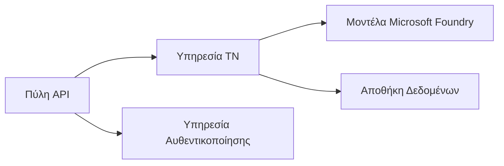
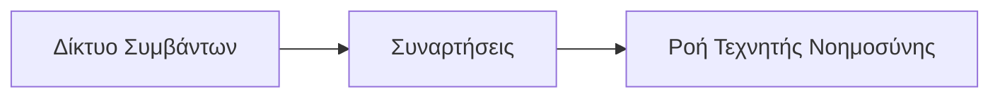

# Chapter 8: Παραγωγή & Επιχειρηματικά Πρότυπα

**📚 Μάθημα**: [AZD για Αρχάριους](../../README.md) | **⏱️ Διάρκεια**: 2-3 ώρες | **⭐ Πολυπλοκότητα**: Προχωρημένο

---

## Επισκόπηση

Αυτό το κεφάλαιο καλύπτει πρότυπα ανάπτυξης έτοιμα για επιχειρήσεις, ενίσχυση ασφάλειας, παρακολούθηση και βελτιστοποίηση κόστους για παραγωγικά φορτία εργασίας AI.

> Επικυρώθηκε με `azd 1.23.12` τον Μάρτιο 2026.

## Στόχοι Μάθησης

By completing this chapter, you will:
- Ανάπτυξη ανθεκτικών εφαρμογών σε πολλαπλές περιοχές
- Υλοποίηση επιχειρηματικών προτύπων ασφάλειας
- Διαμόρφωση ολοκληρωμένης παρακολούθησης
- Βελτιστοποίηση κόστους σε μεγάλη κλίμακα
- Ρύθμιση pipelines CI/CD με AZD

---

## 📚 Μαθήματα

| # | Μάθημα | Περιγραφή | Χρόνος |
|---|--------|-------------|------|
| 1 | [Πρακτικές Παραγωγής AI](production-ai-practices.md) | Πρότυπα ανάπτυξης για επιχειρήσεις | 90 λεπτά |

---

## 🚀 Λίστα Ελέγχου Παραγωγής

- [ ] Ανάπτυξη σε πολλαπλές περιοχές για ανθεκτικότητα
- [ ] Διαχειριζόμενη ταυτότητα για αυθεντικοποίηση (χωρίς κλειδιά)
- [ ] Application Insights για παρακολούθηση
- [ ] Ρύθμιση προϋπολογισμών κόστους και ειδοποιήσεων
- [ ] Ενεργοποίηση σάρωσης ασφαλείας
- [ ] Ενσωμάτωση pipeline CI/CD
- [ ] Σχέδιο ανάκτησης από καταστροφές

---

## 🏗️ Προτύπα Αρχιτεκτονικής

### Πρότυπο 1: Microservices AI


### Πρότυπο 2: Event-Driven AI


---

## 🔐 Καλύτερες Πρακτικές Ασφαλείας

```bicep
// Use managed identity
identity: {
  type: 'SystemAssigned'
}

// Private endpoints for AI services
properties: {
  publicNetworkAccess: 'Disabled'
  networkAcls: {
    defaultAction: 'Deny'
  }
}
```

---

## 💰 Βελτιστοποίηση Κόστους

| Στρατηγική | Εξοικονόμηση |
|----------|---------|
| Κλιμάκωση στο μηδέν (Container Apps) | 60-80% |
| Χρήση επιπέδων κατανάλωσης για ανάπτυξη | 50-70% |
| Προγραμματισμένη κλιμάκωση | 30-50% |
| Κράτηση χωρητικότητας | 20-40% |

```bash
# Ορισμός ειδοποιήσεων προϋπολογισμού
az consumption budget create \
  --budget-name "AI-Budget" \
  --amount 500 \
  --category Cost \
  --time-grain Monthly
```

---

## 📊 Ρυθμίσεις Παρακολούθησης

```bash
# Ροή καταγραφών
azd monitor --logs

# Ελέγξτε το Application Insights
azd monitor --overview

# Προβολή μετρικών
az monitor metrics list --resource <resource-id>
```

---

## 🔗 Πλοήγηση

| Κατεύθυνση | Κεφάλαιο |
|-----------|---------|
| **Προηγούμενο** | [Κεφάλαιο 7: Επίλυση Προβλημάτων](../chapter-07-troubleshooting/README.md) |
| **Ολοκλήρωση Μαθήματος** | [Αρχική Μαθήματος](../../README.md) |

---

## 📖 Σχετικοί Πόροι

- [Οδηγός Πρακτόρων AI](../chapter-02-ai-development/agents.md)
- [Application Insights](../chapter-06-pre-deployment/application-insights.md)
- [Λύσεις Πολλαπλών Πρακτόρων](../chapter-05-multi-agent/README.md)
- [Παράδειγμα Μικροϋπηρεσιών](../../examples/microservices/README.md)

---

<!-- CO-OP TRANSLATOR DISCLAIMER START -->
**Αποποίηση ευθύνης**:
Το παρόν έγγραφο έχει μεταφραστεί χρησιμοποιώντας την υπηρεσία μετάφρασης με τεχνητή νοημοσύνη [Co-op Translator](https://github.com/Azure/co-op-translator). Παρόλο που επιδιώκουμε την ακρίβεια, παρακαλούμε να λάβετε υπόψη ότι οι αυτοματοποιημένες μεταφράσεις ενδέχεται να περιέχουν σφάλματα ή ανακρίβειες. Το πρωτότυπο έγγραφο στην αρχική του γλώσσα πρέπει να θεωρείται η αυθεντική πηγή. Για κρίσιμες πληροφορίες, συνιστάται επαγγελματική μετάφραση από ανθρώπινο μεταφραστή. Δεν ευθυνόμαστε για οποιεσδήποτε παρεξηγήσεις ή εσφαλμένες ερμηνείες που προκύπτουν από τη χρήση αυτής της μετάφρασης.
<!-- CO-OP TRANSLATOR DISCLAIMER END -->