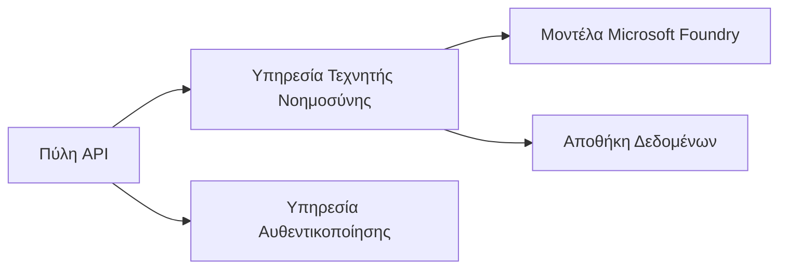
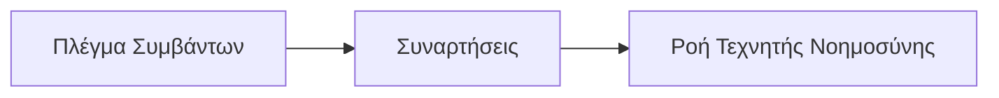

# Chapter 8: Παραγωγή & Επιχειρηματικά Πρότυπα

**📚 Μάθημα**: [AZD για Αρχάριους](../../README.md) | **⏱️ Διάρκεια**: 2-3 ώρες | **⭐ Πολυπλοκότητα**: Προχωρημένο

---

## Επισκόπηση

Αυτό το κεφάλαιο καλύπτει πρότυπα ανάπτυξης έτοιμα για επιχειρήσεις, ενίσχυση ασφάλειας, παρακολούθηση και βελτιστοποίηση κόστους για παραγωγικά φορτία AI.

> Επαληθεύτηκε με `azd 1.25.6` τον Ιούνιο του 2026.

## Στόχοι Μάθησης

Με την ολοκλήρωση αυτού του κεφαλαίου, θα:
- Αναπτύξετε εφαρμογές με ανθεκτικότητα σε πολλαπλές περιοχές
- Εφαρμόσετε επιχειρηματικά πρότυπα ασφάλειας
- Διαμορφώσετε ολοκληρωμένη παρακολούθηση
- Βελτιστοποιήσετε το κόστος σε κλίμακα
- Ρυθμίσετε pipelines CI/CD με AZD

---

## 📚 Μαθήματα

| # | Μάθημα | Περιγραφή | Διάρκεια |
|---|--------|-------------|------|
| 1 | [Πρακτικές Παραγωγής AI](production-ai-practices.md) | Εταιρικά πρότυπα ανάπτυξης | 90 λεπτά |

---

## 🚀 Λίστα ελέγχου Παραγωγής

- [ ] Ανάπτυξη σε πολλαπλές περιοχές για ανθεκτικότητα
- [ ] Διαχειριζόμενη ταυτότητα για αυθεντικοποίηση (χωρίς κλειδιά)
- [ ] Application Insights για παρακολούθηση
- [ ] Ρυθμισμένοι προϋπολογισμοί κόστους και ειδοποιήσεις
- [ ] Ενεργοποιημένος έλεγχος ασφάλειας
- [ ] Ενσωμάτωση pipeline CI/CD
- [ ] Σχέδιο ανάκτησης από καταστροφή

---

## 🏗️ Πρότυπα Αρχιτεκτονικής

### Πρότυπο 1: Μικροϋπηρεσίες AI



### Πρότυπο 2: AI βάσει συμβάντων



---

## 🔐 Καλύτερες πρακτικές ασφάλειας

```bicep
// Use managed identity
identity: {
  type: 'SystemAssigned'
}

// Private endpoints for AI services
properties: {
  publicNetworkAccess: 'Disabled'
  networkAcls: {
    defaultAction: 'Deny'
  }
}
```

---

## 💰 Βελτιστοποίηση κόστους

| Στρατηγική | Εξοικονόμηση |
|----------|---------|
| Κλιμάκωση στο μηδέν (Container Apps) | 60-80% |
| Χρήση επιπέδων κατανάλωσης για dev | 50-70% |
| Προγραμματισμένη κλιμάκωση | 30-50% |
| Δεσμευμένη χωρητικότητα | 20-40% |

```bash
# Ορίστε ειδοποιήσεις προϋπολογισμού
az consumption budget create \
  --budget-name "AI-Budget" \
  --amount 500 \
  --category Cost \
  --time-grain Monthly
```

---

## 📊 Ρύθμιση παρακολούθησης

```bash
# Ροή καταγραφών
azd monitor --logs

# Ελέγξτε το Application Insights
azd monitor --overview

# Προβολή μετρήσεων
az monitor metrics list --resource <resource-id>
```

---

## 🔗 Πλοήγηση

| Κατεύθυνση | Κεφάλαιο |
|-----------|---------|
| **Προηγούμενο** | [Κεφάλαιο 7: Επίλυση προβλημάτων](../chapter-07-troubleshooting/README.md) |
| **Ολοκλήρωση μαθήματος** | [Αρχική Σελίδα Μαθήματος](../../README.md) |

---

## 📖 Σχετικοί Πόροι

- [Οδηγός Πρακτόρων AI](../chapter-02-ai-development/agents.md)
- [Application Insights](../chapter-06-pre-deployment/application-insights.md)
- [Λύσεις πολλαπλών πρακτόρων](../chapter-05-multi-agent/README.md)
- [Παράδειγμα Μικροϋπηρεσιών](../../examples/microservices/README.md)

---

<!-- CO-OP TRANSLATOR DISCLAIMER START -->
**Αποποίηση ευθυνών**:
Αυτό το έγγραφο έχει μεταφραστεί χρησιμοποιώντας την υπηρεσία μετάφρασης με τεχνητή νοημοσύνη [Co-op Translator](https://github.com/Azure/co-op-translator). Ενώ επιδιώκουμε την ακρίβεια, παρακαλούμε να έχετε υπόψη ότι οι αυτοματοποιημένες μεταφράσεις ενδέχεται να περιέχουν λάθη ή ανακρίβειες. Το πρωτότυπο έγγραφο στη μητρική του γλώσσα πρέπει να θεωρείται η αυθεντική πηγή. Για κρίσιμες πληροφορίες, συνιστάται επαγγελματική ανθρώπινη μετάφραση. Δεν φέρουμε ευθύνη για τυχόν παρεξηγήσεις ή λανθασμένες ερμηνείες που προκύπτουν από τη χρήση αυτής της μετάφρασης.
<!-- CO-OP TRANSLATOR DISCLAIMER END -->