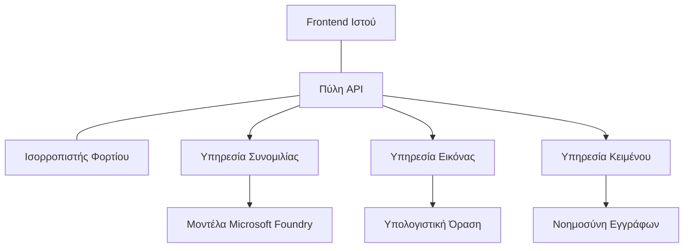

# Καλές Πρακτικές για Παραγωγικά Φορτία Εργασίας Τεχνητής Νοημοσύνης με το AZD

**Πλοήγηση Κεφαλαίου:**
- **📚 Αρχική Μαθήματος**: [AZD For Beginners](../../README.md)
- **📖 Τρέχον Κεφάλαιο**: Κεφάλαιο 8 - Πρότυπα Παραγωγής & Επιχειρήσεων
- **⬅️ Προηγούμενο Κεφάλαιο**: [Κεφάλαιο 7: Αντιμετώπιση Προβλημάτων](../chapter-07-troubleshooting/debugging.md)
- **⬅️ Σχετικό Επίσης**: [Εργαστήριο AI](ai-workshop-lab.md)
- **🎯 Ολοκλήρωση Μαθήματος**: [AZD For Beginners](../../README.md)

## Επισκόπηση

Αυτός ο οδηγός παρέχει ολοκληρωμένες βέλτιστες πρακτικές για την ανάπτυξη παραγωγικών φορτίων εργασίας ΤΝ χρησιμοποιώντας το Azure Developer CLI (AZD). Βασισμένο σε σχόλια από την κοινότητα Microsoft Foundry Discord και σε πραγματικές αναπτύξεις πελατών, αυτές οι πρακτικές αντιμετωπίζουν τις πιο κοινές προκλήσεις σε παραγωγικά συστήματα ΤΝ.

## Κύριες Προκλήσεις που Αντιμετωπίζονται

Βάσει των αποτελεσμάτων της δημοσκόπησης της κοινότητάς μας, αυτά είναι τα κορυφαία προβλήματα που αντιμετωπίζουν οι προγραμματιστές:

- **45%** δυσκολεύονται με αναπτύξεις ΤΝ που περιλαμβάνουν πολλαπλές υπηρεσίες
- **38%** έχουν προβλήματα με τη διαχείριση διαπιστευτηρίων και μυστικών  
- **35%** θεωρούν δύσκολη την ετοιμότητα για παραγωγή και την κλιμάκωση
- **32%** χρειάζονται καλύτερες στρατηγικές βελτιστοποίησης κόστους
- **29%** απαιτούν βελτιωμένη παρακολούθηση και αντιμετώπιση προβλημάτων

## Πρότυπα Αρχιτεκτονικής για Παραγωγικά Συστήματα Τεχνητής Νοημοσύνης

### Pattern 1: Αρχιτεκτονική ΤΝ με Μικροϋπηρεσίες

**Πότε να χρησιμοποιήσετε**: Πολύπλοκες εφαρμογές ΤΝ με πολλαπλές δυνατότητες



**Εφαρμογή με AZD**:

```yaml
# azure.yaml
name: enterprise-ai-platform
services:
  web:
    project: ./web
    host: staticwebapp
  api-gateway:
    project: ./api-gateway
    host: containerapp
  chat-service:
    project: ./services/chat
    host: containerapp
  vision-service:
    project: ./services/vision
    host: containerapp
  text-service:
    project: ./services/text
    host: containerapp
```

### Pattern 2: Επεξεργασία ΤΝ με Event-Driven προσέγγιση

**Πότε να χρησιμοποιήσετε**: Επεξεργασία παρτίδων, ανάλυση εγγράφων, ασύγχρονες ροές εργασίας

```bicep
// Event Hub for AI processing pipeline
resource eventHub 'Microsoft.EventHub/namespaces@2023-01-01-preview' = {
  name: eventHubNamespaceName
  location: location
  sku: {
    name: 'Standard'
    tier: 'Standard'
    capacity: 1
  }
}

// Service Bus for reliable message processing
resource serviceBus 'Microsoft.ServiceBus/namespaces@2022-10-01-preview' = {
  name: serviceBusNamespaceName
  location: location
  sku: {
    name: 'Premium'
    tier: 'Premium'
    capacity: 1
  }
}

// Function App for processing
resource functionApp 'Microsoft.Web/sites@2023-01-01' = {
  name: functionAppName
  location: location
  kind: 'functionapp,linux'
  properties: {
    siteConfig: {
      appSettings: [
        {
          name: 'FUNCTIONS_EXTENSION_VERSION'
          value: '~4'
        }
        {
          name: 'AZURE_OPENAI_ENDPOINT'
          value: '@Microsoft.KeyVault(VaultName=${keyVault.name};SecretName=openai-endpoint)'
        }
      ]
    }
  }
}
```

## Σκέψεις για την Υγεία του Πράκτορα ΤΝ

Όταν μια παραδοσιακή web εφαρμογή σπάει, τα συμπτώματα είναι οικεία: μια σελίδα δεν φορτώνει, ένα API επιστρέφει σφάλμα ή μια ανάπτυξη αποτυγχάνει. Οι εφαρμογές που βασίζονται σε ΤΝ μπορούν να σπάσουν με όλους αυτούς τους ίδιους τρόπους—αλλά μπορούν επίσης να λειτουργούν λάθος με πιο λεπτούς τρόπους που δεν παράγουν εμφανή μηνύματα σφάλματος.

Αυτή η ενότητα σας βοηθά να χτίσετε ένα νοητικό μοντέλο για την παρακολούθηση φορτίων εργασίας ΤΝ ώστε να ξέρετε πού να κοιτάξετε όταν τα πράγματα δεν φαίνονται σωστά.

### Πώς Διαφέρει η Υγεία του Πράκτορα από την Υγεία μιας Παραδοσιακής Εφαρμογής

Μια παραδοσιακή εφαρμογή είτε λειτουργεί είτε όχι. Ένας πράκτορας ΤΝ μπορεί να φαίνεται ότι λειτουργεί αλλά να παράγει φτωχά αποτελέσματα. Σκεφτείτε την υγεία του πράκτορα σε δύο επίπεδα:

| Επίπεδο | Τι να Παρακολουθήσετε | Πού να Ψάξετε |
|-------|--------------|---------------|
| **Υγεία υποδομής** | Τρέχει η υπηρεσία; Έχουν παραχωρηθεί πόροι; Είναι τα endpoints προσβάσιμα; | `azd monitor`, υγεία πόρων στο Azure Portal, αρχεία καταγραφής container/app |
| **Υγεία συμπεριφοράς** | Ανταποκρίνεται ο πράκτορας με ακρίβεια; Είναι οι απαντήσεις έγκαιρες; Καλείται σωστά το μοντέλο; | ιχνηλατήσεις του Application Insights, μετρήσεις λανθάνουσας κλήσης μοντέλου, αρχεία καταγραφής ποιότητας απάντησης |

Η υγεία υποδομής είναι οικεία—είναι η ίδια για οποιαδήποτε εφαρμογή azd. Η υγεία συμπεριφοράς είναι το νέο επίπεδο που εισάγουν τα φορτία εργασίας ΤΝ.

### Πού να Ψάξετε Όταν οι Εφαρμογές ΤΝ Δεν Συμπεριφέρονται όπως Αναμένεται

Αν η εφαρμογή ΤΝ σας δεν παράγει τα αποτελέσματα που περιμένετε, ορίστε μια εννοιολογική λίστα ελέγχου:

1. **Ξεκινήστε με τα βασικά.** Τρέχει η εφαρμογή; Μπορεί να φτάσει στις εξαρτήσεις της; Ελέγξτε `azd monitor` και την υγεία των πόρων όπως θα κάνατε για οποιαδήποτε εφαρμογή.
2. **Ελέγξτε τη σύνδεση με το μοντέλο.** Καλεί επιτυχώς η εφαρμογή το μοντέλο ΤΝ; Οι αποτυχημένες ή οι κλήσεις που λήγουν είναι η πιο συνηθισμένη αιτία προβλημάτων σε εφαρμογές ΤΝ και θα εμφανιστούν στα αρχεία καταγραφής της εφαρμογής σας.
3. **Δείτε τι έλαβε το μοντέλο.** Οι απαντήσεις ΤΝ εξαρτώνται από την είσοδο (το prompt και οποιοδήποτε ανακτημένο πλαίσιο). Αν το αποτέλεσμα είναι λάθος, συνήθως η είσοδος είναι λάθος. Ελέγξτε αν η εφαρμογή στέλνει τα σωστά δεδομένα στο μοντέλο.
4. **Ανασκοπήστε τη λανθάνουσα απόκριση.** Οι κλήσεις σε μοντέλα ΤΝ είναι πιο αργές από τις τυπικές κλήσεις API. Αν η εφαρμογή φαίνεται αργή, ελέγξτε αν οι χρόνοι απόκρισης του μοντέλου έχουν αυξηθεί—αυτό μπορεί να υποδεικνύει περιορισμό (throttling), όρια χωρητικότητας ή συμφόρηση σε επίπεδο περιοχής.
5. **Παρατηρήστε τα σήματα κόστους.** Απροσδόκητα άλματα στη χρήση token ή στις κλήσεις API μπορούν να υποδεικνύουν βρόχο, λανθασμένη διαμόρφωση prompt ή υπερβολικές επαναλήψεις.

Δεν χρειάζεται να κυριαρχήσετε αμέσως τα εργαλεία παρατηρησιμότητας. Το κύριο συμπέρασμα είναι ότι οι εφαρμογές ΤΝ έχουν ένα επιπλέον επίπεδο συμπεριφοράς για παρακολούθηση, και το ενσωματωμένο monitoring του azd (`azd monitor`) σας δίνει ένα σημείο εκκίνησης για διερεύνηση και των δύο επιπέδων.

---

## Καλές Πρακτικές Ασφάλειας

### 1. Μοντέλο Ασφάλειας Μηδενικής Εμπιστοσύνης

**Στρατηγική Υλοποίησης**:
- Καμία επικοινωνία υπηρεσίας-προς-υπηρεσία χωρίς ταυτοποίηση
- Όλες οι κλήσεις API χρησιμοποιούν διαχειριζόμενες ταυτότητες
- Απομόνωση δικτύου με ιδιωτικά endpoints
- Έλεγχοι πρόσβασης με αρχή του ελάχιστου προνομίου

```bicep
// Managed Identity for each service
resource chatServiceIdentity 'Microsoft.ManagedIdentity/userAssignedIdentities@2023-01-31' = {
  name: 'chat-service-identity'
  location: location
}

// Role assignments with minimal permissions
resource openAIUserRole 'Microsoft.Authorization/roleAssignments@2022-04-01' = {
  scope: openAIAccount
  name: guid(openAIAccount.id, chatServiceIdentity.id, openAIUserRoleDefinitionId)
  properties: {
    roleDefinitionId: subscriptionResourceId('Microsoft.Authorization/roleDefinitions', '5e0bd9bd-7b93-4f28-af87-19fc36ad61bd')
    principalId: chatServiceIdentity.properties.principalId
    principalType: 'ServicePrincipal'
  }
}
```

### 2. Ασφαλής Διαχείριση Μυστικών

**Πρότυπο Ενσωμάτωσης Key Vault**:

```bicep
// Key Vault with proper access policies
resource keyVault 'Microsoft.KeyVault/vaults@2023-02-01' = {
  name: keyVaultName
  location: location
  properties: {
    tenantId: tenant().tenantId
    sku: {
      family: 'A'
      name: 'premium'  // Use premium for production
    }
    enableRbacAuthorization: true  // Use RBAC instead of access policies
    enablePurgeProtection: true    // Prevent accidental deletion
    enableSoftDelete: true
    softDeleteRetentionInDays: 90
  }
}

// Store all AI service credentials
resource openAIKeySecret 'Microsoft.KeyVault/vaults/secrets@2023-02-01' = {
  parent: keyVault
  name: 'openai-api-key'
  properties: {
    value: openAIAccount.listKeys().key1
    attributes: {
      enabled: true
    }
  }
}
```

### 3. Ασφάλεια Δικτύου

**Διαμόρφωση Ιδιωτικών Endpoints**:

```bicep
// Virtual Network for AI services
resource virtualNetwork 'Microsoft.Network/virtualNetworks@2023-04-01' = {
  name: vnetName
  location: location
  properties: {
    addressSpace: {
      addressPrefixes: ['10.0.0.0/16']
    }
    subnets: [
      {
        name: 'ai-services-subnet'
        properties: {
          addressPrefix: '10.0.1.0/24'
          privateEndpointNetworkPolicies: 'Disabled'
        }
      }
      {
        name: 'app-services-subnet'
        properties: {
          addressPrefix: '10.0.2.0/24'
          delegations: [
            {
              name: 'Microsoft.Web/serverFarms'
              properties: {
                serviceName: 'Microsoft.Web/serverFarms'
              }
            }
          ]
        }
      }
    ]
  }
}

// Private endpoints for all AI services
resource openAIPrivateEndpoint 'Microsoft.Network/privateEndpoints@2023-04-01' = {
  name: '${openAIAccountName}-pe'
  location: location
  properties: {
    subnet: {
      id: virtualNetwork.properties.subnets[0].id
    }
    privateLinkServiceConnections: [
      {
        name: 'openai-connection'
        properties: {
          privateLinkServiceId: openAIAccount.id
          groupIds: ['account']
        }
      }
    ]
  }
}
```

## Επιδόσεις και Κλιμάκωση

### 1. Στρατηγικές Αυτόματης Κλιμάκωσης

**Αυτόματη κλιμάκωση για Container Apps**:

```bicep
resource containerApp 'Microsoft.App/containerApps@2023-05-01' = {
  name: containerAppName
  location: location
  properties: {
    configuration: {
      ingress: {
        external: true
        targetPort: 8000
        transport: 'http'
      }
    }
    template: {
      scale: {
        minReplicas: 2  // Always have 2 instances minimum
        maxReplicas: 50 // Scale up to 50 for high load
        rules: [
          {
            name: 'http-scaling'
            http: {
              metadata: {
                concurrentRequests: '20'  // Scale when >20 concurrent requests
              }
            }
          }
          {
            name: 'cpu-scaling'
            custom: {
              type: 'cpu'
              metadata: {
                type: 'Utilization'
                value: '70'  // Scale when CPU >70%
              }
            }
          }
        ]
      }
    }
  }
}
```

### 2. Στρατηγικές Cache

**Redis Cache για Απαντήσεις ΤΝ**:

```bicep
// Redis Premium for production workloads
resource redisCache 'Microsoft.Cache/redis@2023-04-01' = {
  name: redisCacheName
  location: location
  properties: {
    sku: {
      name: 'Premium'
      family: 'P'
      capacity: 1
    }
    enableNonSslPort: false
    minimumTlsVersion: '1.2'
    redisConfiguration: {
      'maxmemory-policy': 'allkeys-lru'
    }
    // Enable clustering for high availability
    redisVersion: '6.0'
    shardCount: 2
  }
}

// Cache configuration in application
var cacheConnectionString = '${redisCache.properties.hostName}:6380,password=${redisCache.listKeys().primaryKey},ssl=True,abortConnect=False'
```

### 3. Ισορροπία Φορτίου και Διαχείριση Κυκλοφορίας

**Application Gateway με WAF**:

```bicep
// Application Gateway with Web Application Firewall
resource applicationGateway 'Microsoft.Network/applicationGateways@2023-04-01' = {
  name: appGatewayName
  location: location
  properties: {
    sku: {
      name: 'WAF_v2'
      tier: 'WAF_v2'
      capacity: 2
    }
    webApplicationFirewallConfiguration: {
      enabled: true
      firewallMode: 'Prevention'
      ruleSetType: 'OWASP'
      ruleSetVersion: '3.2'
    }
    // Backend pools for AI services
    backendAddressPools: [
      {
        name: 'ai-services-pool'
        properties: {
          backendAddresses: [
            {
              fqdn: '${containerApp.properties.configuration.ingress.fqdn}'
            }
          ]
        }
      }
    ]
  }
}
```

## 💰 Βελτιστοποίηση Κόστους

### 1. Κατάλληλο Μέγεθος Πόρων

**Διαμορφώσεις ανά Περιβάλλον**:

```bash
# Περιβάλλον ανάπτυξης
azd env new development
azd env set AZURE_OPENAI_SKU "S0"
azd env set AZURE_OPENAI_CAPACITY 10
azd env set AZURE_SEARCH_SKU "basic"
azd env set CONTAINER_CPU 0.5
azd env set CONTAINER_MEMORY 1.0

# Περιβάλλον παραγωγής
azd env new production
azd env set AZURE_OPENAI_SKU "S0"
azd env set AZURE_OPENAI_CAPACITY 100
azd env set AZURE_SEARCH_SKU "standard"
azd env set CONTAINER_CPU 2.0
azd env set CONTAINER_MEMORY 4.0
```

### 2. Παρακολούθηση Κόστους και Προϋπολογισμοί

```bicep
// Cost management and budgets
resource budget 'Microsoft.Consumption/budgets@2023-05-01' = {
  name: 'ai-workload-budget'
  properties: {
    timePeriod: {
      startDate: '2024-01-01'
      endDate: '2024-12-31'
    }
    timeGrain: 'Monthly'
    amount: 2000  // $2000 monthly budget
    category: 'Cost'
    notifications: {
      warning: {
        enabled: true
        operator: 'GreaterThan'
        threshold: 80
        contactEmails: [
          'finance@company.com'
          'engineering@company.com'
        ]
        contactRoles: [
          'Owner'
          'Contributor'
        ]
      }
      critical: {
        enabled: true
        operator: 'GreaterThan'
        threshold: 95
        contactEmails: [
          'cto@company.com'
        ]
      }
    }
  }
}
```

### 3. Βελτιστοποίηση Χρήσης Token

**Διαχείριση Κόστους OpenAI**:

```typescript
// Βελτιστοποίηση token σε επίπεδο εφαρμογής
class TokenOptimizer {
  private readonly maxTokens = 4000;
  private readonly reserveTokens = 500;
  
  optimizePrompt(userInput: string, context: string): string {
    const availableTokens = this.maxTokens - this.reserveTokens;
    const estimatedTokens = this.estimateTokens(userInput + context);
    
    if (estimatedTokens > availableTokens) {
      // Περικόψτε το πλαίσιο, όχι την είσοδο του χρήστη
      context = this.truncateContext(context, availableTokens - this.estimateTokens(userInput));
    }
    
    return `${context}\n\nUser: ${userInput}`;
  }
  
  private estimateTokens(text: string): number {
    // Χονδρική εκτίμηση: 1 token ≈ 4 χαρακτήρες
    return Math.ceil(text.length / 4);
  }
}
```

## Παρακολούθηση και Παρατηρησιμότητα

### 1. Ολοκληρωμένο Application Insights

```bicep
// Application Insights with advanced features
resource applicationInsights 'Microsoft.Insights/components@2020-02-02' = {
  name: applicationInsightsName
  location: location
  kind: 'web'
  properties: {
    Application_Type: 'web'
    WorkspaceResourceId: logAnalyticsWorkspace.id
    SamplingPercentage: 100  // Full sampling for AI apps
    DisableIpMasking: false  // Enable for security
  }
}

// Custom metrics for AI operations
resource aiMetricAlerts 'Microsoft.Insights/metricAlerts@2018-03-01' = {
  name: 'ai-high-error-rate'
  location: 'global'
  properties: {
    description: 'Alert when AI service error rate is high'
    severity: 2
    enabled: true
    scopes: [
      applicationInsights.id
    ]
    evaluationFrequency: 'PT1M'
    windowSize: 'PT5M'
    criteria: {
      'odata.type': 'Microsoft.Azure.Monitor.SingleResourceMultipleMetricCriteria'
      allOf: [
        {
          name: 'high-error-rate'
          metricName: 'requests/failed'
          operator: 'GreaterThan'
          threshold: 10
          timeAggregation: 'Count'
        }
      ]
    }
  }
}
```

### 2. Παρακολούθηση Ειδικά για ΤΝ

**Προσαρμοσμένες Πίνακες Ελέγχου για Μετρικές ΤΝ**:

```json
// Dashboard configuration for AI workloads
{
  "dashboard": {
    "name": "AI Application Monitoring",
    "tiles": [
      {
        "name": "OpenAI Request Volume",
        "query": "requests | where name contains 'openai' | summarize count() by bin(timestamp, 5m)"
      },
      {
        "name": "AI Response Latency",
        "query": "requests | where name contains 'openai' | summarize avg(duration) by bin(timestamp, 5m)"
      },
      {
        "name": "Token Usage",
        "query": "customMetrics | where name == 'openai_tokens_used' | summarize sum(value) by bin(timestamp, 1h)"
      },
      {
        "name": "Cost per Hour",
        "query": "customMetrics | where name == 'openai_cost' | summarize sum(value) by bin(timestamp, 1h)"
      }
    ]
  }
}
```

### 3. Έλεγχοι Υγείας και Παρακολούθηση Διαθεσιμότητας

```bicep
// Application Insights availability tests
resource availabilityTest 'Microsoft.Insights/webtests@2022-06-15' = {
  name: 'ai-app-availability-test'
  location: location
  tags: {
    'hidden-link:${applicationInsights.id}': 'Resource'
  }
  properties: {
    SyntheticMonitorId: 'ai-app-availability-test'
    Name: 'AI Application Availability Test'
    Description: 'Tests AI application endpoints'
    Enabled: true
    Frequency: 300  // 5 minutes
    Timeout: 120    // 2 minutes
    Kind: 'ping'
    Locations: [
      {
        Id: 'us-east-2-azr'
      }
      {
        Id: 'us-west-2-azr'
      }
    ]
    Configuration: {
      WebTest: '''
        <WebTest Name="AI Health Check" 
                 Id="8d2de8d2-a2b0-4c2e-9a0d-8f9c9a0b8c8d" 
                 Enabled="True" 
                 CssProjectStructure="" 
                 CssIteration="" 
                 Timeout="120" 
                 WorkItemIds="" 
                 xmlns="http://microsoft.com/schemas/VisualStudio/TeamTest/2010" 
                 Description="" 
                 CredentialUserName="" 
                 CredentialPassword="" 
                 PreAuthenticate="True" 
                 Proxy="default" 
                 StopOnError="False" 
                 RecordedResultFile="" 
                 ResultsLocale="">
          <Items>
            <Request Method="GET" 
                     Guid="a5f10126-e4cd-570d-961c-cea43999a200" 
                     Version="1.1" 
                     Url="${webApp.properties.defaultHostName}/health" 
                     ThinkTime="0" 
                     Timeout="120" 
                     ParseDependentRequests="True" 
                     FollowRedirects="True" 
                     RecordResult="True" 
                     Cache="False" 
                     ResponseTimeGoal="0" 
                     Encoding="utf-8" 
                     ExpectedHttpStatusCode="200" 
                     ExpectedResponseUrl="" 
                     ReportingName="" 
                     IgnoreHttpStatusCode="False" />
          </Items>
        </WebTest>
      '''
    }
  }
}
```

## Ανάκαμψη από Καταστροφές και Υψηλή Διαθεσιμότητα

### 1. Ανάπτυξη σε Πολλές Περιοχές

```yaml
# azure.yaml - Multi-region configuration
name: ai-app-multiregion
services:
  api-primary:
    project: ./api
    host: containerapp
    env:
      - AZURE_REGION=eastus
  api-secondary:
    project: ./api
    host: containerapp
    env:
      - AZURE_REGION=westus2
```

```bicep
// Traffic Manager for global load balancing
resource trafficManager 'Microsoft.Network/trafficManagerProfiles@2022-04-01' = {
  name: trafficManagerProfileName
  location: 'global'
  properties: {
    profileStatus: 'Enabled'
    trafficRoutingMethod: 'Priority'
    dnsConfig: {
      relativeName: trafficManagerProfileName
      ttl: 30
    }
    monitorConfig: {
      protocol: 'HTTPS'
      port: 443
      path: '/health'
      intervalInSeconds: 30
      toleratedNumberOfFailures: 3
      timeoutInSeconds: 10
    }
    endpoints: [
      {
        name: 'primary-endpoint'
        type: 'Microsoft.Network/trafficManagerProfiles/azureEndpoints'
        properties: {
          targetResourceId: primaryAppService.id
          endpointStatus: 'Enabled'
          priority: 1
        }
      }
      {
        name: 'secondary-endpoint'
        type: 'Microsoft.Network/trafficManagerProfiles/azureEndpoints'
        properties: {
          targetResourceId: secondaryAppService.id
          endpointStatus: 'Enabled'
          priority: 2
        }
      }
    ]
  }
}
```

### 2. Αντίγραφα Ασφαλείας και Ανάκτηση Δεδομένων

```bicep
// Backup configuration for critical data
resource backupVault 'Microsoft.DataProtection/backupVaults@2023-05-01' = {
  name: backupVaultName
  location: location
  identity: {
    type: 'SystemAssigned'
  }
  properties: {
    storageSettings: [
      {
        datastoreType: 'VaultStore'
        type: 'LocallyRedundant'
      }
    ]
  }
}

// Backup policy for AI models and data
resource backupPolicy 'Microsoft.DataProtection/backupVaults/backupPolicies@2023-05-01' = {
  parent: backupVault
  name: 'ai-data-backup-policy'
  properties: {
    policyRules: [
      {
        backupParameters: {
          backupType: 'Full'
          objectType: 'AzureBackupParams'
        }
        trigger: {
          schedule: {
            repeatingTimeIntervals: [
              'R/2024-01-01T02:00:00+00:00/P1D'  // Daily at 2 AM
            ]
          }
          objectType: 'ScheduleBasedTriggerContext'
        }
        dataStore: {
          datastoreType: 'VaultStore'
          objectType: 'DataStoreInfoBase'
        }
        name: 'BackupDaily'
        objectType: 'AzureBackupRule'
      }
    ]
  }
}
```

## DevOps και Ενσωμάτωση CI/CD

### 1. Ροή Εργασίας GitHub Actions

```yaml
# .github/workflows/deploy-ai-app.yml
name: Deploy AI Application

on:
  push:
    branches: [main]
  pull_request:
    branches: [main]

jobs:
  test:
    runs-on: ubuntu-latest
    steps:
      - uses: actions/checkout@v4
      
      - name: Setup Python
        uses: actions/setup-python@v4
        with:
          python-version: '3.11'
          
      - name: Install dependencies
        run: |
          pip install -r requirements.txt
          pip install pytest
          
      - name: Run tests
        run: pytest tests/
        
      - name: AI Safety Tests
        run: |
          python scripts/test_ai_safety.py
          python scripts/validate_prompts.py

  deploy-staging:
    needs: test
    if: github.event_name == 'pull_request'
    runs-on: ubuntu-latest
    steps:
      - uses: actions/checkout@v4
      
      - name: Setup AZD
        uses: Azure/setup-azd@v2
        
      - name: Login to Azure
        uses: azure/login@v1
        with:
          creds: ${{ secrets.AZURE_CREDENTIALS }}
          
      - name: Deploy to Staging
        run: |
          azd env select staging
          azd deploy

  deploy-production:
    needs: test
    if: github.ref == 'refs/heads/main'
    runs-on: ubuntu-latest
    steps:
      - uses: actions/checkout@v4
      
      - name: Setup AZD
        uses: Azure/setup-azd@v2
        
      - name: Login to Azure
        uses: azure/login@v1
        with:
          creds: ${{ secrets.AZURE_CREDENTIALS }}
          
      - name: Deploy to Production
        run: |
          azd env select production
          azd deploy
          
      - name: Run Production Health Checks
        run: |
          python scripts/health_check.py --env production
```

### 2. Επικύρωση Υποδομής

```bash
# scripts/validate_infrastructure.sh
#!/bin/bash

echo "Validating AI infrastructure deployment..."

# Έλεγχος αν όλες οι απαιτούμενες υπηρεσίες εκτελούνται
services=("openai" "search" "storage" "keyvault")
for service in "${services[@]}"; do
    echo "Checking $service..."
    if ! az resource list --resource-type "Microsoft.CognitiveServices/accounts" --query "[?contains(name, '$service')]" -o tsv; then
        echo "ERROR: $service not found"
        exit 1
    fi
done

# Επαλήθευση των αναπτύξεων μοντέλων OpenAI
echo "Validating OpenAI model deployments..."
models=$(az cognitiveservices account deployment list --name $AZURE_OPENAI_NAME --resource-group $AZURE_RESOURCE_GROUP --query "[].name" -o tsv)
if [[ ! $models == *"gpt-4.1-mini"* ]]; then
  echo "ERROR: Required model gpt-4.1-mini not deployed"
    exit 1
fi

# Δοκιμή της συνδεσιμότητας της υπηρεσίας AI
echo "Testing AI service connectivity..."
python scripts/test_connectivity.py

echo "Infrastructure validation completed successfully!"
```

## Λίστα Ελέγχου Ετοιμότητας για Παραγωγή

### Ασφάλεια ✅
- [ ] Όλες οι υπηρεσίες χρησιμοποιούν διαχειριζόμενες ταυτότητες
- [ ] Μυστικά αποθηκευμένα στο Key Vault
- [ ] Διαμορφωμένα ιδιωτικά endpoints
- [ ] Υλοποίηση Network Security Groups
- [ ] RBAC με ελάχιστα προνόμια
- [ ] WAF ενεργό στα δημόσια endpoints

### Απόδοση ✅
- [ ] Διαμορφωμένη αυτόματη κλιμάκωση
- [ ] Υλοποίηση caching
- [ ] Ρύθμιση ισορροπίας φορτίου
- [ ] CDN για στατικό περιεχόμενο
- [ ] Pooling συνδέσεων προς τη βάση δεδομένων
- [ ] Βελτιστοποίηση χρήσης token

### Παρακολούθηση ✅
- [ ] Application Insights διαμορφωμένο
- [ ] Ορισμένες προσαρμοσμένες μετρικές
- [ ] Ρυθμισμένοι κανόνες ειδοποίησης
- [ ] Δημιουργία πίνακα ελέγχου
- [ ] Εφαρμοσμένοι έλεγχοι υγείας
- [ ] Πολιτικές διατήρησης αρχείων καταγραφής

### Αξιοπιστία ✅
- [ ] Ανάπτυξη σε πολλές περιοχές
- [ ] Σχέδιο backup και ανάκτησης
- [ ] Εφαρμογή μηχανισμών circuit breakers
- [ ] Διαμόρφωση πολιτικών επαναπροσπάθειας
- [ ] Ομαλή υποβάθμιση λειτουργιών
- [ ] Endpoints ελέγχου υγείας

### Διαχείριση Κόστους ✅
- [ ] Ρυθμισμένοι ειδοποιητές προϋπολογισμού
- [ ] Σωστό μέγεθος πόρων
- [ ] Εφαρμογή εκπτώσεων για dev/test
- [ ] Αγορά reserved instances
- [ ] Πίνακας ελέγχου παρακολούθησης κόστους
- [ ] Τακτικές ανασκοπήσεις κόστους

### Συμμόρφωση ✅
- [ ] Ικανοποίηση απαιτήσεων τοπικής διαμονής δεδομένων
- [ ] Ενεργοποιημένη καταγραφή ελέγχου
- [ ] Εφαρμοσμένες πολιτικές συμμόρφωσης
- [ ] Υλοποιημένα security baselines
- [ ] Τακτικές αξιολογήσεις ασφάλειας
- [ ] Σχέδιο αντιμετώπισης περιστατικών

## Δείκτες Απόδοσης

### Τυπικές Μετρικές Παραγωγής

| Μετρική | Στόχος | Παρακολούθηση |
|--------|--------|------------|
| **Χρόνος Απόκρισης** | < 2 seconds | Application Insights |
| **Διαθεσιμότητα** | 99.9% | Παρακολούθηση uptime |
| **Ποσοστό Σφαλμάτων** | < 0.1% | Application logs |
| **Χρήση Token** | < $500/month | Cost management |
| **Ταυτόχρονοι Χρήστες** | 1000+ | Load testing |
| **Χρόνος Ανάκτησης** | < 1 hour | Δοκιμές ανάκαμψης από καταστροφή |

### Δοκιμές Φόρτου

```bash
# Σενάριο δοκιμών φόρτου για εφαρμογές τεχνητής νοημοσύνης
python scripts/load_test.py \
  --endpoint https://your-ai-app.azurewebsites.net \
  --concurrent-users 100 \
  --duration 300 \
  --ramp-up 60
```

## 🤝 Βέλτιστες Πρακτικές από την Κοινότητα

Βασισμένο σε σχόλια της κοινότητας Microsoft Foundry στο Discord:

### Κορυφαίες Συστάσεις από την Κοινότητα:

1. **Ξεκινήστε Μικρά, Κλιμακώστε Σταδιακά**: Ξεκινήστε με βασικά SKUs και αυξήστε ανάλογα με τη χρήση
2. **Παρακολουθείτε τα Πάντα**: Ρυθμίστε ολοκληρωμένη παρακολούθηση από την πρώτη μέρα
3. **Αυτοματοποιήστε την Ασφάλεια**: Χρησιμοποιήστε υποδομή ως κώδικα για συνεπή ασφάλεια
4. **Δοκιμάστε Ενδελεχώς**: Συμπεριλάβετε δοκιμές ειδικές για ΤΝ στο pipeline σας
5. **Σχεδιάστε για Κόστος**: Παρακολουθήστε τη χρήση token και ρυθμίστε ειδοποιήσεις προϋπολογισμού νωρίς

### Συνήθη Σφάλματα που Πρέπει να Αποφεύγετε:

- ❌ Σκληροκωδικοποίηση κλειδιών API μέσα στον κώδικα
- ❌ Μη ρύθμιση κατάλληλης παρακολούθησης
- ❌ Αγνόηση βελτιστοποίησης κόστους
- ❌ Μη δοκιμή σε σενάρια αποτυχίας
- ❌ Ανάπτυξη χωρίς ελέγχους υγείας

## Εντολές AZD AI CLI και Επεκτάσεις

Το AZD περιλαμβάνει ένα αναπτυσσόμενο σύνολο εντολών και επεκτάσεων ειδικών για ΤΝ που απλοποιούν ροές εργασίας παραγωγικής ΤΝ. Αυτά τα εργαλεία γεφυρώνουν το κενό μεταξύ τοπικής ανάπτυξης και παραγωγικής ανάπτυξης για φορτία εργασίας ΤΝ.

### Επεκτάσεις AZD για ΤΝ

Το AZD χρησιμοποιεί ένα σύστημα επεκτάσεων για να προσθέσει δυνατότητες ειδικές για ΤΝ. Εγκαταστήστε και διαχειριστείτε επεκτάσεις με:

```bash
# Απαρίθμησε όλες τις διαθέσιμες επεκτάσεις (συμπεριλαμβανομένης της τεχνητής νοημοσύνης)
azd extension list

# Εξέτασε τις λεπτομέρειες της εγκατεστημένης επέκτασης
azd extension show azure.ai.agents

# Εγκατέστησε την επέκταση Foundry agents
azd extension install azure.ai.agents

# Εγκατέστησε την επέκταση fine-tuning
azd extension install azure.ai.finetune

# Εγκατέστησε την επέκταση custom models
azd extension install azure.ai.models

# Αναβάθμισε όλες τις εγκατεστημένες επεκτάσεις
azd extension upgrade --all
```

**Διαθέσιμες επεκτάσεις για ΤΝ:**

| Επέκταση | Σκοπός | Κατάσταση |
|-----------|---------|--------|
| `azure.ai.agents` | Διαχείριση Foundry Agent Service | Προεπισκόπηση |
| `azure.ai.skills` | Επαναχρησιμοποιήσιμες δεξιότητες agent | Προεπισκόπηση |
| `azure.ai.connections` | Συνδέσεις Foundry (πηγές δεδομένων, εργαλεία) | Προεπισκόπηση |
| `azure.ai.finetune` | Fine-tuning μοντέλων Foundry | Προεπισκόπηση |
| `azure.ai.models` | Προσαρμοσμένα μοντέλα Foundry | Προεπισκόπηση |
| `azure.coding-agent` | Διαμόρφωση coding agent | Διαθέσιμο |

> Η επέκταση `azure.ai.agents` εξελίσσεται γρήγορα. Αυτό το μάθημα επικυρώνεται με `0.1.40-preview`. Εκτελέστε `azd extension upgrade --all` για να λάβετε το τελευταίο σύνολο εντολών, και `azd extension show azure.ai.agents` για να επιβεβαιώσετε την εγκατεστημένη έκδοσή σας.

**Τι είναι οι νεότερες επεκτάσεις `skills` και `connections`;**

Δύο επεκτάσεις preview εμφανίστηκαν παράλληλα με τα εργαλεία agent και αξίζει να τις κατανοήσετε ακόμη και ως αρχάριος:

- **`azure.ai.skills`** — Μια **δεξιότητα (skill)** είναι μια επαναχρησιμοποιήσιμη ικανότητα (ένα πακεταρισμένο εργαλείο ή συμπεριφορά) που μπορείτε να επισυνάψετε σε έναν ή περισσότερους agents αντί να την αναπαράγετε κάθε φορά. Σκεφτείτε την ως ένα κοινό δομικό στοιχείο: ορίστε μια δεξιότητα "αναζήτηση τεκμηρίωσης" ή "αναζήτηση παραγγελίας" μια φορά και επαναχρησιμοποιήστε την σε πολλούς agents. Αυτό διατηρεί τα πολυ-agent συστήματα (Κεφάλαιο 5) συνεπή και αποφεύγει το copy-paste.
- **`azure.ai.connections`** — Μια **σύνδεση (connection)** είναι ένας διαχειριζόμενος σύνδεσμος από το έργο Foundry σε έναν εξωτερικό πόρο που χρειάζονται οι agents σας—μια πηγή δεδομένων (όπως το Azure AI Search), ένα endpoint εργαλείου ή κάποια άλλη υπηρεσία. Οι συνδέσεις κεντροθετούν το *πού* και *πώς* οι agents έχουν πρόσβαση στα δεδομένα, ώστε διαπιστευτήρια και endpoints να βρίσκονται σε ένα ελεγχόμενο σημείο αντί να είναι διασκορπισμένα στον κώδικα.

Δεν χρειάζεστε αυτά για να αναπτύξετε τους πρώτους σας agents—μείνετε με `azure.ai.agents` ενώ μαθαίνετε. Προσθέστε `skills` όταν βρείτε ότι αναπαράγετε το ίδιο εργαλείο σε πολλούς agents, και `connections` όταν αρκετοί agents μοιράζονται την ίδια πηγή δεδομένων.

### Αρχικοποίηση Έργων Agent με `azd ai agent init`

Η εντολή `azd ai agent init` δημιουργεί ένα project agent έτοιμο για παραγωγή ενσωματωμένο με το Microsoft Foundry Agent Service:

```bash
# Αρχικοποιήστε ένα νέο έργο πράκτορα από το manifest του πράκτορα
azd ai agent init -m <manifest-path-or-uri>

# Αρχικοποιήστε και στοχεύστε ένα συγκεκριμένο έργο Foundry
azd ai agent init -m agent-manifest.yaml --project-id <foundry-project-id>

# Αρχικοποιήστε με προσαρμοσμένο φάκελο πηγής
azd ai agent init -m agent-manifest.yaml --src ./agents/my-agent

# Στοχεύστε τα Container Apps ως οικοδεσπότη
azd ai agent init -m agent-manifest.yaml --host containerapp
```

**Βασικές σημαίες:**

| Flag | Description |
|------|-------------|
| `-m, --manifest` | Path or URI to an agent manifest to add to your project |
| `-p, --project-id` | Existing Microsoft Foundry Project ID for your azd environment |
| `-s, --src` | Directory to download the agent definition (defaults to `src/<agent-id>`) |
| `--host` | Override the default host (e.g., `containerapp`) |
| `-e, --environment` | The azd environment to use |

**Συμβουλή για παραγωγή**: Χρησιμοποιήστε `--project-id` για να συνδεθείτε απευθείας σε ένα υπάρχον Foundry project, κρατώντας τον κώδικα του agent και τους cloud πόρους σας συνδεδεμένους από την αρχή.

### Διαχείριση Κύκλου Ζωής του Πράκτορα

Πέρα από το `init`, η επέκταση `azure.ai.agents` παρέχει εντολές για ολόκληρο τον κύκλο ζωής ενός hosted agent—δοκιμή, αξιολόγηση, βελτιστοποίηση και απόσυρση:

```bash
# Κλήση ενός αναπτυγμένου πράκτορα και προβολή του χρόνου απόκρισης του διακομιστή
# (συνολική καθυστέρηση και χρόνος έως το πρώτο byte)
azd ai agent invoke

# Εμφάνιση της διαμόρφωσης του ενεργού τερματικού σημείου πριν την αλλαγή της
azd ai agent endpoint show

# Δημιουργία ενός συνόλου δεδομένων αξιολόγησης για τον πράκτορα
azd ai agent eval generate --dataset ./eval/dataset.jsonl

# Βελτιστοποιήστε τις οδηγίες του πράκτορα βάσει των δεδομένων αξιολόγησής σας
# (απαιτεί ένα optimization_model στο έργο του πράκτορα)
azd ai agent optimize

# Κατεβάστε τον αναπτυγμένο πηγαίο κώδικα ενός φιλοξενούμενου πράκτορα που βασίζεται σε κώδικα
# (με επαλήθευση SHA-256)
azd ai agent code download

# Διαγραφή ενός φιλοξενούμενου πράκτορα και όλων των εκδόσεών του
# (--force τερματίζει ενεργές συνεδρίες)
azd ai agent delete --force
```

**Κύκλος ζωής με μια ματιά:**

| Στάδιο | Εντολή | Χρήση σε Παραγωγή |
|-------|---------|----------------|
| Test | `azd ai agent invoke` | Επικύρωση απαντήσεων και μέτρηση λανθάνουσας πριν την κυκλοφορία |
| Inspect | `azd ai agent endpoint show` | Ανασκόπηση auth/config endpoint· εντοπισμός αλλαγών που σπάνε νωρίς |
| Measure | `azd ai agent eval generate` | Δημιουργία επαναλήψιμου συνόλου αξιολόγησης από πραγματικά traces |
| Improve | `azd ai agent optimize` | Βελτιστοποίηση οδηγιών βάσει μετρημένης ποιότητας |
| Recover | `azd ai agent code download` | Ανάκτηση του ακριβούς αναπτυγμένου πηγαίου για έλεγχο/rollback |
| Retire | `azd ai agent delete --force` | Απομάκρυνση agent και των εκδόσεών του με καθαρό τρόπο |

> Αυτές είναι εντολές σε preview και μπορεί να αλλάξουν ανάμεσα σε εκδόσεις επεκτάσεων. Εκτελέστε `azd ai agent --help` για να δείτε τις ακριβείς υποεντολές που είναι διαθέσιμες στην εγκατεστημένη έκδοσή σας.

### Model Context Protocol (MCP) με `azd mcp`
AZD περιλαμβάνει ενσωματωμένη υποστήριξη διακομιστή MCP (Alpha), επιτρέποντας σε πράκτορες και εργαλεία AI να αλληλεπιδρούν με τους πόρους Azure σας μέσω ενός τυποποιημένου πρωτοκόλλου:

```bash
# Ξεκινήστε τον MCP διακομιστή για το έργο σας
azd mcp start

# Επανεξετάστε τους τρέχοντες κανόνες συναίνεσης του Copilot για την εκτέλεση εργαλείων
azd copilot consent list
```

Ο διακομιστής MCP εκθέτει το πλαίσιο έργου azd—περιβάλλοντα, υπηρεσίες και πόρους Azure—σε εργαλεία ανάπτυξης με δυνατότητα AI. Αυτό επιτρέπει:

- **Υποβοηθούμενη από AI ανάπτυξη**: Επιτρέψτε σε πράκτορες κωδικοποίησης να ερωτήσουν την κατάσταση του έργου σας και να ενεργοποιήσουν αναπτύξεις
- **Ανακάλυψη πόρων**: Τα εργαλεία AI μπορούν να εντοπίσουν ποιους πόρους Azure χρησιμοποιεί το έργο σας
- **Διαχείριση περιβάλλοντος**: Οι πράκτορες μπορούν να αλλάζουν μεταξύ περιβάλλοντος ανάπτυξης/δοκιμών/παραγωγής

### Infrastructure Generation with `azd infra generate`

Για παραγωγικά φορτία εργασίας AI, μπορείτε να δημιουργήσετε και να προσαρμόσετε Infrastructure as Code αντί να βασίζεστε στην αυτόματη προμήθεια:

```bash
# Δημιουργήστε αρχεία Bicep/Terraform από τον ορισμό του έργου σας
azd infra generate
```

Αυτό γράφει IaC στο δίσκο ώστε να μπορείτε:
- Να ελέγξετε και να ελέγξετε την υποδομή πριν την ανάπτυξη
- Να προσθέσετε προσαρμοσμένες πολιτικές ασφαλείας (κανόνες δικτύου, ιδιωτικά endpoints)
- Να ενσωματώσετε με υπάρχοντες διαδικασίες ελέγχου IaC
- Να διατηρείτε τις αλλαγές υποδομής σε έλεγχο εκδόσεων χωριστά από τον κώδικα της εφαρμογής

### Production Lifecycle Hooks

Τα hooks του AZD σας επιτρέπουν να εισάγετε προσαρμοσμένη λογική σε κάθε στάδιο του κύκλου ζωής ανάπτυξης—κρίσιμο για παραγωγικές ροές εργασίας AI:

```yaml
# azure.yaml - Production hooks example
name: ai-production-app
hooks:
  preprovision:
    shell: sh
    run: scripts/validate-quotas.sh    # Check AI model quota before provisioning
  postprovision:
    shell: sh
    run: scripts/configure-networking.sh  # Set up private endpoints
  predeploy:
    shell: sh
    run: scripts/run-ai-safety-tests.sh  # Run prompt safety checks
  postdeploy:
    shell: sh
    run: scripts/smoke-test.sh           # Verify agent responses post-deploy
services:
  agent-api:
    project: ./src/agent
    host: containerapp
    hooks:
      predeploy:
        shell: sh
        run: scripts/validate-model-access.sh  # Per-service hook
```

```bash
# Εκτελέστε χειροκίνητα ένα συγκεκριμένο hook κατά την ανάπτυξη
azd hooks run predeploy
```

**Συνιστώμενα hooks παραγωγής για φορτία εργασίας AI:**

| Hook | Περίπτωση χρήσης |
|------|------------------|
| `preprovision` | Επικύρωση ορίων συνδρομής για χωρητικότητα μοντέλου AI |
| `postprovision` | Διαμόρφωση ιδιωτικών endpoints, ανάπτυξη βαρών μοντέλου |
| `predeploy` | Εκτέλεση δοκιμών ασφάλειας AI, επικύρωση προτύπων προτροπών |
| `postdeploy` | Εκτέλεση γρήγορων ελέγχων στις απαντήσεις των πρακτόρων, επαλήθευση συνδεσιμότητας μοντέλου |

### CI/CD Pipeline Configuration

Χρησιμοποιήστε `azd pipeline config` για να συνδέσετε το έργο σας με GitHub Actions ή Azure Pipelines με ασφαλή αυθεντικοποίηση Azure:

```bash
# Ρυθμίστε τον αγωγό CI/CD (διαδραστικά)
azd pipeline config

# Ρυθμίστε με συγκεκριμένο πάροχο
azd pipeline config --provider github
```

Αυτή η εντολή:
- Δημιουργεί ένα service principal με πρόσβαση ελάχιστων δικαιωμάτων
- Διαμορφώνει federated credentials (χωρίς αποθηκευμένα μυστικά)
- Δημιουργεί ή ενημερώνει το αρχείο ορισμού pipeline
- Ορίζει τις απαιτούμενες μεταβλητές περιβάλλοντος στο σύστημά CI/CD σας

#### Step-by-step: your first GitHub Actions pipeline

Εδώ είναι ο πλήρης οδηγός από ένα λειτουργικό έργο azd σε αυτοματοποιημένες αναπτύξεις σε κάθε push.

**1. Make sure your project is on GitHub**

```bash
git init
git add .
git commit -m "Initial azd project"
gh repo create my-ai-app --private --source=. --push
```

**2. Run pipeline config**

```bash
azd pipeline config --provider github
```

azd θα, με διαδραστικό τρόπο:
- Θα ρωτήσει ποια συνδρομή Azure και ποιο περιβάλλον να στοχεύσει
- Θα δημιουργήσει ένα Entra **εγγραφή εφαρμογής + service principal** για το pipeline
- Θα ρυθμίσει **federated credentials (OIDC)**—ώστε το GitHub να αυθεντικοποιείται στο Azure με βραχύβια tokens και **να μην αποθηκεύονται μυστικά**
- Θα σπρώξει τις απαιτούμενες **μεταβλητές** στο repo σας στο GitHub (`AZURE_CLIENT_ID`, `AZURE_TENANT_ID`, `AZURE_SUBSCRIPTION_ID`, `AZURE_ENV_NAME`, `AZURE_LOCATION`)

**3. Understand the generated workflow**

azd προσθέτει `.github/workflows/azure-dev.yml`. Τα βασικά μέρη μοιάζουν ως εξής:

```yaml
# .github/workflows/azure-dev.yml
on:
  push:
    branches: [ main ]
  workflow_dispatch:        # lets you run it manually too

permissions:
  id-token: write           # required for OIDC federated login
  contents: read

jobs:
  build:
    runs-on: ubuntu-latest
    env:
      AZURE_CLIENT_ID: ${{ vars.AZURE_CLIENT_ID }}
      AZURE_TENANT_ID: ${{ vars.AZURE_TENANT_ID }}
      AZURE_SUBSCRIPTION_ID: ${{ vars.AZURE_SUBSCRIPTION_ID }}
      AZURE_ENV_NAME: ${{ vars.AZURE_ENV_NAME }}
      AZURE_LOCATION: ${{ vars.AZURE_LOCATION }}
    steps:
      - uses: actions/checkout@v4
      - name: Install azd
        uses: Azure/setup-azd@v2
      - name: Log in with OIDC
        run: azd auth login --client-id "$AZURE_CLIENT_ID" --federated-credential-provider "github" --tenant-id "$AZURE_TENANT_ID"
      - name: Provision infrastructure
        run: azd provision --no-prompt
      - name: Deploy application
        run: azd deploy --no-prompt
```

**4. Verify it works**

```bash
# Προώθησε μια αλλαγή για να ενεργοποιηθεί το pipeline
git commit -am "Trigger pipeline" --allow-empty
git push
```

Ανοίξτε την καρτέλα **Actions** στο repo σας στο GitHub και παρακολουθήστε τον workflow να εκτελεί αυτόματα `azd provision` και `azd deploy`.

> **Γιατί έχουν σημασία τα federated credentials:** παλαιότερα pipelines αποθήκευαν ένα client secret στο GitHub. Τα OIDC federated credentials καταργούν εντελώς αυτό το μυστικό—το GitHub ζητάει ένα βραχύβιo token κατά την εκτέλεση, το οποίο είναι πιο ασφαλές και δεν υπάρχει κάτι για να περιστραφεί ή να διαρρεύσει. Αυτή είναι η προεπιλογή που ρυθμίζει το `azd pipeline config`.

> **Μυστικά vs. μεταβλητές:** μη ευαίσθητοι αναγνωριστικοί (`AZURE_CLIENT_ID`, κ.λπ.) τοποθετούνται στις **μεταβλητές** του repo. Αν η εφαρμογή σας χρειάζεται πραγματικά ένα μυστικό κατά το build, προσθέστε το ως GitHub **secret** και αναφερθείτε σε αυτό με `${{ secrets.NAME }}`—αλλά προτιμήστε Key Vault + managed identity κατά το runtime (δείτε [Κεφάλαιο 3](../chapter-03-configuration/authsecurity.md)).

**Ροή εργασίας παραγωγής με pipeline config:**

```bash
# 1. Ρύθμιση περιβάλλοντος παραγωγής
azd env new production
azd env set AZURE_OPENAI_CAPACITY 100

# 2. Διαμόρφωση του pipeline
azd pipeline config --provider github

# 3. Το pipeline εκτελεί azd deploy σε κάθε push στο main
```

#### Step-by-step: Azure DevOps Pipelines

Προτιμάτε Azure DevOps αντί για GitHub Actions; Το azd το υποστηρίζει εγγενώς με τον provider `azdo`. Η ροή είναι σχεδόν ίδια—το azd δημιουργεί το αρχείο pipeline, δημιουργεί μια υπηρεσιακή σύνδεση και ρυθμίζει την αυθεντικοποίηση.

**1. Make sure you have an Azure DevOps project**

Χρειάζεστε έναν οργανισμό και ένα έργο στο `https://dev.azure.com/<your-org>`. Δημιουργήστε ένα Personal Access Token (PAT) με δικαιώματα **Build (Read & execute)**, **Code (Read & write)** και **Service Connections (Read, query & manage)**—το azd θα σας το ζητήσει.

**2. Configure the pipeline**

```bash
azd pipeline config --provider azdo
```

azd θα:
- Θα ρωτήσει για τον οργανισμό και το έργο Azure DevOps σας
- Θα δημιουργήσει (ή θα επαναχρησιμοποιήσει) μια **service connection** στο Azure χρησιμοποιώντας ένα service principal
- Θα διαμορφώσει **workload identity federation (OIDC)** ώστε να μην αποθηκεύεται client secret
- Θα κάνει commit ένα `azure-dev.yml` αρχείο ορισμού pipeline στο repo σας

**3. Review the generated `azure-dev.yml`**

azd γράφει ένα pipeline που προμηθεύει και αναπτύσσει σε κάθε push στο `main`:

```yaml
# azure-dev.yml
trigger:
  - main

pool:
  vmImage: ubuntu-latest

steps:
  - task: setup-azd@1
    displayName: Install azd

  - script: azd provision --no-prompt
    displayName: Provision Infrastructure
    env:
      AZURE_SUBSCRIPTION_ID: $(AZURE_SUBSCRIPTION_ID)
      AZURE_ENV_NAME: $(AZURE_ENV_NAME)
      AZURE_LOCATION: $(AZURE_LOCATION)

  - script: azd deploy --no-prompt
    displayName: Deploy Application
    env:
      AZURE_SUBSCRIPTION_ID: $(AZURE_SUBSCRIPTION_ID)
      AZURE_ENV_NAME: $(AZURE_ENV_NAME)
      AZURE_LOCATION: $(AZURE_LOCATION)
```

**4. Where the variables come from**

azd αποθηκεύει τις τιμές περιβάλλοντος (`AZURE_ENV_NAME`, `AZURE_LOCATION`, `AZURE_SUBSCRIPTION_ID`) ως **variable group** στο Azure DevOps ώστε το pipeline να μπορεί να τις διαβάσει. Μπορείτε να τις δείτε και να τις επεξεργαστείτε κάτω από **Pipelines → Library**.

> **Ίδιο όφελος OIDC όπως στο GitHub:** ο provider `azdo` επίσης διαμορφώνει workload identity federation από προεπιλογή, οπότε δεν υπάρχει client secret αποθηκευμένο στην service connection—το Azure DevOps ανταλλάσσει ένα βραχύβιο token κατά το runtime. Χρησιμοποιήστε `--auth-type client-credentials` μόνο αν ο οργανισμός σας δεν μπορεί να χρησιμοποιήσει ακόμη OIDC.

**5. Run it**

```bash
git commit -am "Add Azure DevOps pipeline" --allow-empty
git push
```

Ανοίξτε **Pipelines** στο Azure DevOps για να παρακολουθήσετε το `azd provision` και το `azd deploy`.

### Adding Components with `azd add`

Προσθέστε σταδιακά υπηρεσίες Azure σε ένα υπάρχον έργο:

```bash
# Προσθέστε ένα νέο συστατικό υπηρεσίας διαδραστικά
azd add
```

Αυτό είναι ιδιαίτερα χρήσιμο για την επέκταση παραγωγικών εφαρμογών AI—για παράδειγμα, προσθήκη υπηρεσίας αναζήτησης διανυσμάτων, ενός νέου endpoint πράκτορα, ή ενός συστατικού παρακολούθησης σε μια υπάρχουσα ανάπτυξη.

## Additional Resources

- **Azure Well-Architected Framework**: [AI workload guidance](https://learn.microsoft.com/azure/well-architected/ai/)
- **Microsoft Foundry Documentation**: [Official docs](https://learn.microsoft.com/azure/ai-studio/)
- **Community Templates**: [Azure Samples](https://github.com/Azure-Samples)
- **Discord Community**: [#Azure channel](https://discord.gg/microsoft-azure)
- **Agent Skills for Azure**: [microsoft/github-copilot-for-azure on skills.sh](https://skills.sh/microsoft/github-copilot-for-azure) - 37 ανοιχτές δεξιότητες πρακτόρων για Azure AI, Foundry, ανάπτυξη, βελτιστοποίηση κόστους και διαγνωστικά. Εγκαταστήστε στον επεξεργαστή σας:
  ```bash
  npx skills add microsoft/github-copilot-for-azure
  ```

---

**Πλοήγηση Κεφαλαίου:**
- **📚 Αρχική Μαθήματος**: [AZD For Beginners](../../README.md)
- **📖 Τρέχον Κεφάλαιο**: Κεφάλαιο 8 - Προτύπα Παραγωγής και Επιχειρηματικά
- **⬅️ Προηγούμενο Κεφάλαιο**: [Κεφάλαιο 7: Αντιμετώπιση προβλημάτων](../chapter-07-troubleshooting/debugging.md)
- **⬅️ Επίσης Σχετικό**: [Εργαστήριο AI](ai-workshop-lab.md)
- **� Μάθημα Ολοκληρώθηκε**: [AZD For Beginners](../../README.md)

**Θυμηθείτε**: Τα παραγωγικά φορτία εργασίας AI απαιτούν προσεκτικό σχεδιασμό, παρακολούθηση και συνεχή βελτιστοποίηση. Ξεκινήστε με αυτά τα πρότυπα και προσαρμόστε τα στις συγκεκριμένες απαιτήσεις σας.

---

<!-- CO-OP TRANSLATOR DISCLAIMER START -->
**Αποποίηση ευθυνών**:
Αυτό το έγγραφο έχει μεταφραστεί χρησιμοποιώντας την υπηρεσία μετάφρασης με τεχνητή νοημοσύνη [Co-op Translator](https://github.com/Azure/co-op-translator). Ενώ επιδιώκουμε την ακρίβεια, παρακαλούμε να έχετε υπόψη ότι οι αυτοματοποιημένες μεταφράσεις ενδέχεται να περιέχουν λάθη ή ανακρίβειες. Το πρωτότυπο έγγραφο στη μητρική του γλώσσα πρέπει να θεωρείται η αυθεντική πηγή. Για κρίσιμες πληροφορίες, συνιστάται επαγγελματική ανθρώπινη μετάφραση. Δεν φέρουμε ευθύνη για τυχόν παρεξηγήσεις ή λανθασμένες ερμηνείες που προκύπτουν από τη χρήση αυτής της μετάφρασης.
<!-- CO-OP TRANSLATOR DISCLAIMER END -->