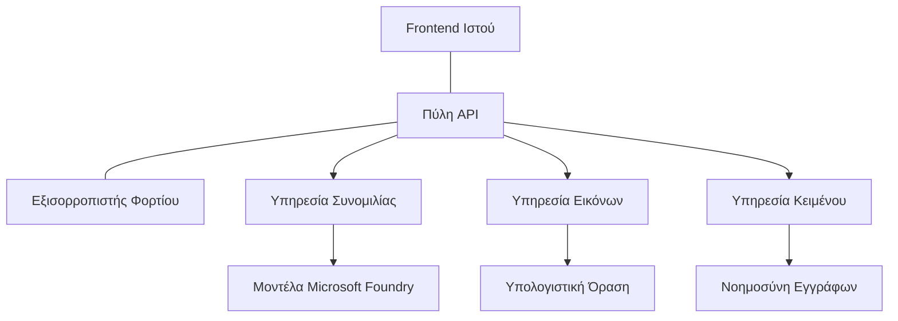

# Βέλτιστες Πρακτικές για Παραγωγικά AI Workloads με το AZD

**Πλοήγηση Κεφαλαίου:**
- **📚 Αρχική Μαθήματος**: [AZD For Beginners](../../README.md)
- **📖 Τρέχον Κεφάλαιο**: Κεφάλαιο 8 - Πρότυπα Παραγωγής & Επιχειρηματικά
- **⬅️ Προηγούμενο Κεφάλαιο**: [Chapter 7: Troubleshooting](../chapter-07-troubleshooting/debugging.md)
- **⬅️ Επίσης Σχετικό**: [AI Workshop Lab](ai-workshop-lab.md)
- **🎯 Μαθηματικό Ολοκληρώθηκε**: [AZD For Beginners](../../README.md)

## Επισκόπηση

Αυτός ο οδηγός παρέχει ολοκληρωμένες βέλτιστες πρακτικές για την ανάπτυξη παραγωγικών AI φορτίων εργασίας χρησιμοποιώντας το Azure Developer CLI (AZD). Βασισμένες σε σχόλια από την κοινότητα Microsoft Foundry Discord και σε πραγματικές αναπτύξεις πελατών, αυτές οι πρακτικές αντιμετωπίζουν τις πιο κοινές προκλήσεις σε συστήματα AI παραγωγής.

## Κύριες Προκλήσεις που Αντιμετωπίζονται

Βασισμένο στα αποτελέσματα της δημοσκόπησης της κοινότητάς μας, αυτές είναι οι κορυφαίες προκλήσεις που αντιμετωπίζουν οι προγραμματιστές:

- **45%** δυσκολεύονται με αναπτύξεις πολλαπλών υπηρεσιών AI
- **38%** έχουν προβλήματα με τη διαχείριση διαπιστευτηρίων και μυστικών  
- **35%** θεωρούν δύσκολη την προετοιμασία για παραγωγή και την κλιμάκωση
- **32%** χρειάζονται καλύτερες στρατηγικές βελτιστοποίησης κόστους
- **29%** απαιτούν βελτιωμένη παρακολούθηση και αντιμετώπιση προβλημάτων

## Πρότυπα Αρχιτεκτονικής για Παραγωγικό AI

### Πρότυπο 1: Αρχιτεκτονική Microservices AI

**Πότε να χρησιμοποιήσετε**: Πολύπλοκες εφαρμογές AI με πολλαπλές δυνατότητες


**Υλοποίηση με AZD**:

```yaml
# azure.yaml
name: enterprise-ai-platform
services:
  web:
    project: ./web
    host: staticwebapp
  api-gateway:
    project: ./api-gateway
    host: containerapp
  chat-service:
    project: ./services/chat
    host: containerapp
  vision-service:
    project: ./services/vision
    host: containerapp
  text-service:
    project: ./services/text
    host: containerapp
```

### Πρότυπο 2: Event-Driven Επεξεργασία AI

**Πότε να χρησιμοποιήσετε**: Επεξεργασία σε παρτίδες, ανάλυση εγγράφων, ασύγχρονα ροή εργασιών

```bicep
// Event Hub for AI processing pipeline
resource eventHub 'Microsoft.EventHub/namespaces@2023-01-01-preview' = {
  name: eventHubNamespaceName
  location: location
  sku: {
    name: 'Standard'
    tier: 'Standard'
    capacity: 1
  }
}

// Service Bus for reliable message processing
resource serviceBus 'Microsoft.ServiceBus/namespaces@2022-10-01-preview' = {
  name: serviceBusNamespaceName
  location: location
  sku: {
    name: 'Premium'
    tier: 'Premium'
    capacity: 1
  }
}

// Function App for processing
resource functionApp 'Microsoft.Web/sites@2023-01-01' = {
  name: functionAppName
  location: location
  kind: 'functionapp,linux'
  properties: {
    siteConfig: {
      appSettings: [
        {
          name: 'FUNCTIONS_EXTENSION_VERSION'
          value: '~4'
        }
        {
          name: 'AZURE_OPENAI_ENDPOINT'
          value: '@Microsoft.KeyVault(VaultName=${keyVault.name};SecretName=openai-endpoint)'
        }
      ]
    }
  }
}
```

## Σκέψεις για την Υγεία των AI Agents

Όταν μια παραδοσιακή web εφαρμογή σπάει, τα συμπτώματα είναι οικεία: μια σελίδα δεν φορτώνει, ένα API επιστρέφει σφάλμα ή μια ανάπτυξη αποτυγχάνει. Οι εφαρμογές με AI μπορούν να σπάσουν με όλους αυτούς τους ίδιους τρόπους—αλλά μπορούν επίσης να συμπεριφέρονται ακατάλληλα με πιο λεπτούς τρόπους που δεν παράγουν εμφανή μηνύματα σφάλματος.

Αυτό το τμήμα σας βοηθά να χτίσετε ένα νοητικό μοντέλο για την παρακολούθηση φορτίων εργασίας AI ώστε να ξέρετε πού να κοιτάξετε όταν κάτι δεν φαίνεται σωστό.

### Πώς Διαφέρει η Υγεία Agent από την Υγεία Παραδοσιακής Εφαρμογής

Μια παραδοσιακή εφαρμογή είτε λειτουργεί είτε όχι. Ένας AI agent μπορεί να φαίνεται ότι λειτουργεί αλλά να παράγει κακά αποτελέσματα. Σκεφτείτε την υγεία του agent σε δύο επίπεδα:

| Layer | What to Watch | Where to Look |
|-------|--------------|---------------|
| **Infrastructure health** | Is the service running? Are resources provisioned? Are endpoints reachable? | `azd monitor`, Azure Portal resource health, container/app logs |
| **Behavior health** | Is the agent responding accurately? Are responses timely? Is the model being called correctly? | Application Insights traces, model call latency metrics, response quality logs |

Η υγεία της υποδομής είναι οικεία—είναι η ίδια για οποιαδήποτε εφαρμογή azd. Η υγεία της συμπεριφοράς είναι το νέο επίπεδο που εισάγουν τα φορτία εργασίας AI.

### Πού να Κοιτάξετε Όταν οι Εφαρμογές AI Δεν Συμπεριφέρονται Όπως Αναμένεται

Αν η εφαρμογή AI σας δεν παράγει τα αποτελέσματα που περιμένετε, ιδού ένας εννοιολογικός κατάλογος ελέγχου:

1. **Ξεκινήστε από τα βασικά.** Η εφαρμογή λειτουργεί; Μπορεί να φτάσει τις εξαρτήσεις της; Ελέγξτε `azd monitor` και την υγεία των πόρων όπως θα κάνατε για οποιαδήποτε εφαρμογή.
2. **Ελέγξτε τη σύνδεση με το μοντέλο.** Καλεί επιτυχώς η εφαρμογή σας το AI μοντέλο; Οι αποτυχημένες ή χρονικά υπερβαμένες κλήσεις μοντέλου είναι η πιο κοινή αιτία προβλημάτων εφαρμογών AI και θα εμφανιστούν στα logs της εφαρμογής σας.
3. **Δείτε τι έλαβε το μοντέλο.** Οι απαντήσεις του AI εξαρτώνται από την είσοδο (το prompt και οποιοδήποτε ανακτηθέν πλαίσιο). Αν το αποτέλεσμα είναι λανθασμένο, συνήθως η είσοδος είναι λανθασμένη. Ελέγξτε αν η εφαρμογή σας στέλνει τα σωστά δεδομένα στο μοντέλο.
4. **Ανασκοπήστε τη λανθάνουσα απόκριση.** Οι κλήσεις σε μοντέλα AI είναι πιο αργές από τις τυπικές κλήσεις API. Αν η εφαρμογή σας φαίνεται αργή, ελέγξτε αν οι χρόνοι απόκρισης του μοντέλου έχουν αυξηθεί—αυτό μπορεί να υποδηλώνει throttling, όρια χωρητικότητας ή συμφόρηση σε επίπεδο περιοχής.
5. **Παρακολουθήστε σήματα κόστους.** Απρόσμενες αιχμές στη χρήση tokens ή στις κλήσεις API μπορεί να υποδηλώνουν βρόχο, λανθασμένη διαμόρφωση prompt ή υπερβολικές επανεκκινήσεις.

Δεν χρειάζεται να κυριαρχήσετε εργαλεία παρατηρησιμότητας αμέσως. Το βασικό συμπέρασμα είναι ότι οι εφαρμογές AI έχουν ένα επιπλέον επίπεδο συμπεριφοράς για παρακολούθηση, και η ενσωματωμένη παρακολούθηση του azd (`azd monitor`) σας δίνει ένα σημείο εκκίνησης για διερεύνηση και των δύο επιπέδων.

---

## Βέλτιστες Πρακτικές Ασφαλείας

### 1. Μοντέλο Ασφάλειας Zero-Trust

**Στρατηγική Υλοποίησης**:
- Καμία επικοινωνία υπηρεσίας προς υπηρεσία χωρίς αυθεντικοποίηση
- Όλες οι κλήσεις API χρησιμοποιούν managed identities
- Δικτυακή απομόνωση με private endpoints
- Έλεγχοι πρόσβασης με την αρχή του ελάχιστου προνομίου

```bicep
// Managed Identity for each service
resource chatServiceIdentity 'Microsoft.ManagedIdentity/userAssignedIdentities@2023-01-31' = {
  name: 'chat-service-identity'
  location: location
}

// Role assignments with minimal permissions
resource openAIUserRole 'Microsoft.Authorization/roleAssignments@2022-04-01' = {
  scope: openAIAccount
  name: guid(openAIAccount.id, chatServiceIdentity.id, openAIUserRoleDefinitionId)
  properties: {
    roleDefinitionId: subscriptionResourceId('Microsoft.Authorization/roleDefinitions', '5e0bd9bd-7b93-4f28-af87-19fc36ad61bd')
    principalId: chatServiceIdentity.properties.principalId
    principalType: 'ServicePrincipal'
  }
}
```

### 2. Ασφαλής Διαχείριση Μυστικών

**Πρότυπο Ενσωμάτωσης Key Vault**:

```bicep
// Key Vault with proper access policies
resource keyVault 'Microsoft.KeyVault/vaults@2023-02-01' = {
  name: keyVaultName
  location: location
  properties: {
    tenantId: tenant().tenantId
    sku: {
      family: 'A'
      name: 'premium'  // Use premium for production
    }
    enableRbacAuthorization: true  // Use RBAC instead of access policies
    enablePurgeProtection: true    // Prevent accidental deletion
    enableSoftDelete: true
    softDeleteRetentionInDays: 90
  }
}

// Store all AI service credentials
resource openAIKeySecret 'Microsoft.KeyVault/vaults/secrets@2023-02-01' = {
  parent: keyVault
  name: 'openai-api-key'
  properties: {
    value: openAIAccount.listKeys().key1
    attributes: {
      enabled: true
    }
  }
}
```

### 3. Δικτυακή Ασφάλεια

**Διαμόρφωση Private Endpoint**:

```bicep
// Virtual Network for AI services
resource virtualNetwork 'Microsoft.Network/virtualNetworks@2023-04-01' = {
  name: vnetName
  location: location
  properties: {
    addressSpace: {
      addressPrefixes: ['10.0.0.0/16']
    }
    subnets: [
      {
        name: 'ai-services-subnet'
        properties: {
          addressPrefix: '10.0.1.0/24'
          privateEndpointNetworkPolicies: 'Disabled'
        }
      }
      {
        name: 'app-services-subnet'
        properties: {
          addressPrefix: '10.0.2.0/24'
          delegations: [
            {
              name: 'Microsoft.Web/serverFarms'
              properties: {
                serviceName: 'Microsoft.Web/serverFarms'
              }
            }
          ]
        }
      }
    ]
  }
}

// Private endpoints for all AI services
resource openAIPrivateEndpoint 'Microsoft.Network/privateEndpoints@2023-04-01' = {
  name: '${openAIAccountName}-pe'
  location: location
  properties: {
    subnet: {
      id: virtualNetwork.properties.subnets[0].id
    }
    privateLinkServiceConnections: [
      {
        name: 'openai-connection'
        properties: {
          privateLinkServiceId: openAIAccount.id
          groupIds: ['account']
        }
      }
    ]
  }
}
```

## Απόδοση και Κλιμάκωση

### 1. Στρατηγικές Auto-Scaling

**Auto-scaling για Container Apps**:

```bicep
resource containerApp 'Microsoft.App/containerApps@2023-05-01' = {
  name: containerAppName
  location: location
  properties: {
    configuration: {
      ingress: {
        external: true
        targetPort: 8000
        transport: 'http'
      }
    }
    template: {
      scale: {
        minReplicas: 2  // Always have 2 instances minimum
        maxReplicas: 50 // Scale up to 50 for high load
        rules: [
          {
            name: 'http-scaling'
            http: {
              metadata: {
                concurrentRequests: '20'  // Scale when >20 concurrent requests
              }
            }
          }
          {
            name: 'cpu-scaling'
            custom: {
              type: 'cpu'
              metadata: {
                type: 'Utilization'
                value: '70'  // Scale when CPU >70%
              }
            }
          }
        ]
      }
    }
  }
}
```

### 2. Στρατηγικές Caching

**Redis Cache για Απαντήσεις AI**:

```bicep
// Redis Premium for production workloads
resource redisCache 'Microsoft.Cache/redis@2023-04-01' = {
  name: redisCacheName
  location: location
  properties: {
    sku: {
      name: 'Premium'
      family: 'P'
      capacity: 1
    }
    enableNonSslPort: false
    minimumTlsVersion: '1.2'
    redisConfiguration: {
      'maxmemory-policy': 'allkeys-lru'
    }
    // Enable clustering for high availability
    redisVersion: '6.0'
    shardCount: 2
  }
}

// Cache configuration in application
var cacheConnectionString = '${redisCache.properties.hostName}:6380,password=${redisCache.listKeys().primaryKey},ssl=True,abortConnect=False'
```

### 3. Εξισορρόπηση Φορτίου και Διαχείριση Κυκλοφορίας

**Application Gateway με WAF**:

```bicep
// Application Gateway with Web Application Firewall
resource applicationGateway 'Microsoft.Network/applicationGateways@2023-04-01' = {
  name: appGatewayName
  location: location
  properties: {
    sku: {
      name: 'WAF_v2'
      tier: 'WAF_v2'
      capacity: 2
    }
    webApplicationFirewallConfiguration: {
      enabled: true
      firewallMode: 'Prevention'
      ruleSetType: 'OWASP'
      ruleSetVersion: '3.2'
    }
    // Backend pools for AI services
    backendAddressPools: [
      {
        name: 'ai-services-pool'
        properties: {
          backendAddresses: [
            {
              fqdn: '${containerApp.properties.configuration.ingress.fqdn}'
            }
          ]
        }
      }
    ]
  }
}
```

## 💰 Βελτιστοποίηση Κόστους

### 1. Σωστό Μέγεθος Πόρων

**Διαμορφώσεις κατά Περιβάλλον**:

```bash
# Περιβάλλον ανάπτυξης
azd env new development
azd env set AZURE_OPENAI_SKU "S0"
azd env set AZURE_OPENAI_CAPACITY 10
azd env set AZURE_SEARCH_SKU "basic"
azd env set CONTAINER_CPU 0.5
azd env set CONTAINER_MEMORY 1.0

# Περιβάλλον παραγωγής
azd env new production
azd env set AZURE_OPENAI_SKU "S0"
azd env set AZURE_OPENAI_CAPACITY 100
azd env set AZURE_SEARCH_SKU "standard"
azd env set CONTAINER_CPU 2.0
azd env set CONTAINER_MEMORY 4.0
```

### 2. Παρακολούθηση Κόστους και Προϋπολογισμοί

```bicep
// Cost management and budgets
resource budget 'Microsoft.Consumption/budgets@2023-05-01' = {
  name: 'ai-workload-budget'
  properties: {
    timePeriod: {
      startDate: '2024-01-01'
      endDate: '2024-12-31'
    }
    timeGrain: 'Monthly'
    amount: 2000  // $2000 monthly budget
    category: 'Cost'
    notifications: {
      warning: {
        enabled: true
        operator: 'GreaterThan'
        threshold: 80
        contactEmails: [
          'finance@company.com'
          'engineering@company.com'
        ]
        contactRoles: [
          'Owner'
          'Contributor'
        ]
      }
      critical: {
        enabled: true
        operator: 'GreaterThan'
        threshold: 95
        contactEmails: [
          'cto@company.com'
        ]
      }
    }
  }
}
```

### 3. Βελτιστοποίηση Χρήσης Tokens

**Διαχείριση Κόστους OpenAI**:

```typescript
// Βελτιστοποίηση tokens σε επίπεδο εφαρμογής
class TokenOptimizer {
  private readonly maxTokens = 4000;
  private readonly reserveTokens = 500;
  
  optimizePrompt(userInput: string, context: string): string {
    const availableTokens = this.maxTokens - this.reserveTokens;
    const estimatedTokens = this.estimateTokens(userInput + context);
    
    if (estimatedTokens > availableTokens) {
      // Περικόψτε το πλαίσιο, όχι την είσοδο του χρήστη
      context = this.truncateContext(context, availableTokens - this.estimateTokens(userInput));
    }
    
    return `${context}\n\nUser: ${userInput}`;
  }
  
  private estimateTokens(text: string): number {
    // Χονδρική εκτίμηση: 1 token ≈ 4 χαρακτήρες
    return Math.ceil(text.length / 4);
  }
}
```

## Παρακολούθηση και Παρατηρησιμότητα

### 1. Ολοκληρωμένο Application Insights

```bicep
// Application Insights with advanced features
resource applicationInsights 'Microsoft.Insights/components@2020-02-02' = {
  name: applicationInsightsName
  location: location
  kind: 'web'
  properties: {
    Application_Type: 'web'
    WorkspaceResourceId: logAnalyticsWorkspace.id
    SamplingPercentage: 100  // Full sampling for AI apps
    DisableIpMasking: false  // Enable for security
  }
}

// Custom metrics for AI operations
resource aiMetricAlerts 'Microsoft.Insights/metricAlerts@2018-03-01' = {
  name: 'ai-high-error-rate'
  location: 'global'
  properties: {
    description: 'Alert when AI service error rate is high'
    severity: 2
    enabled: true
    scopes: [
      applicationInsights.id
    ]
    evaluationFrequency: 'PT1M'
    windowSize: 'PT5M'
    criteria: {
      'odata.type': 'Microsoft.Azure.Monitor.SingleResourceMultipleMetricCriteria'
      allOf: [
        {
          name: 'high-error-rate'
          metricName: 'requests/failed'
          operator: 'GreaterThan'
          threshold: 10
          timeAggregation: 'Count'
        }
      ]
    }
  }
}
```

### 2. AI-Εξειδικευμένη Παρακολούθηση

**Προσαρμοσμένα Dashboards για Μετρικές AI**:

```json
// Dashboard configuration for AI workloads
{
  "dashboard": {
    "name": "AI Application Monitoring",
    "tiles": [
      {
        "name": "OpenAI Request Volume",
        "query": "requests | where name contains 'openai' | summarize count() by bin(timestamp, 5m)"
      },
      {
        "name": "AI Response Latency",
        "query": "requests | where name contains 'openai' | summarize avg(duration) by bin(timestamp, 5m)"
      },
      {
        "name": "Token Usage",
        "query": "customMetrics | where name == 'openai_tokens_used' | summarize sum(value) by bin(timestamp, 1h)"
      },
      {
        "name": "Cost per Hour",
        "query": "customMetrics | where name == 'openai_cost' | summarize sum(value) by bin(timestamp, 1h)"
      }
    ]
  }
}
```

### 3. Health Checks και Παρακολούθηση Διαθεσιμότητας

```bicep
// Application Insights availability tests
resource availabilityTest 'Microsoft.Insights/webtests@2022-06-15' = {
  name: 'ai-app-availability-test'
  location: location
  tags: {
    'hidden-link:${applicationInsights.id}': 'Resource'
  }
  properties: {
    SyntheticMonitorId: 'ai-app-availability-test'
    Name: 'AI Application Availability Test'
    Description: 'Tests AI application endpoints'
    Enabled: true
    Frequency: 300  // 5 minutes
    Timeout: 120    // 2 minutes
    Kind: 'ping'
    Locations: [
      {
        Id: 'us-east-2-azr'
      }
      {
        Id: 'us-west-2-azr'
      }
    ]
    Configuration: {
      WebTest: '''
        <WebTest Name="AI Health Check" 
                 Id="8d2de8d2-a2b0-4c2e-9a0d-8f9c9a0b8c8d" 
                 Enabled="True" 
                 CssProjectStructure="" 
                 CssIteration="" 
                 Timeout="120" 
                 WorkItemIds="" 
                 xmlns="http://microsoft.com/schemas/VisualStudio/TeamTest/2010" 
                 Description="" 
                 CredentialUserName="" 
                 CredentialPassword="" 
                 PreAuthenticate="True" 
                 Proxy="default" 
                 StopOnError="False" 
                 RecordedResultFile="" 
                 ResultsLocale="">
          <Items>
            <Request Method="GET" 
                     Guid="a5f10126-e4cd-570d-961c-cea43999a200" 
                     Version="1.1" 
                     Url="${webApp.properties.defaultHostName}/health" 
                     ThinkTime="0" 
                     Timeout="120" 
                     ParseDependentRequests="True" 
                     FollowRedirects="True" 
                     RecordResult="True" 
                     Cache="False" 
                     ResponseTimeGoal="0" 
                     Encoding="utf-8" 
                     ExpectedHttpStatusCode="200" 
                     ExpectedResponseUrl="" 
                     ReportingName="" 
                     IgnoreHttpStatusCode="False" />
          </Items>
        </WebTest>
      '''
    }
  }
}
```

## Ανάκτηση από Καταστροφές και Υψηλή Διαθεσιμότητα

### 1. Ανάπτυξη σε Πολλές Περιοχές

```yaml
# azure.yaml - Multi-region configuration
name: ai-app-multiregion
services:
  api-primary:
    project: ./api
    host: containerapp
    env:
      - AZURE_REGION=eastus
  api-secondary:
    project: ./api
    host: containerapp
    env:
      - AZURE_REGION=westus2
```

```bicep
// Traffic Manager for global load balancing
resource trafficManager 'Microsoft.Network/trafficManagerProfiles@2022-04-01' = {
  name: trafficManagerProfileName
  location: 'global'
  properties: {
    profileStatus: 'Enabled'
    trafficRoutingMethod: 'Priority'
    dnsConfig: {
      relativeName: trafficManagerProfileName
      ttl: 30
    }
    monitorConfig: {
      protocol: 'HTTPS'
      port: 443
      path: '/health'
      intervalInSeconds: 30
      toleratedNumberOfFailures: 3
      timeoutInSeconds: 10
    }
    endpoints: [
      {
        name: 'primary-endpoint'
        type: 'Microsoft.Network/trafficManagerProfiles/azureEndpoints'
        properties: {
          targetResourceId: primaryAppService.id
          endpointStatus: 'Enabled'
          priority: 1
        }
      }
      {
        name: 'secondary-endpoint'
        type: 'Microsoft.Network/trafficManagerProfiles/azureEndpoints'
        properties: {
          targetResourceId: secondaryAppService.id
          endpointStatus: 'Enabled'
          priority: 2
        }
      }
    ]
  }
}
```

### 2. Εφεδρικά Αντίγραφα και Ανάκτηση Δεδομένων

```bicep
// Backup configuration for critical data
resource backupVault 'Microsoft.DataProtection/backupVaults@2023-05-01' = {
  name: backupVaultName
  location: location
  identity: {
    type: 'SystemAssigned'
  }
  properties: {
    storageSettings: [
      {
        datastoreType: 'VaultStore'
        type: 'LocallyRedundant'
      }
    ]
  }
}

// Backup policy for AI models and data
resource backupPolicy 'Microsoft.DataProtection/backupVaults/backupPolicies@2023-05-01' = {
  parent: backupVault
  name: 'ai-data-backup-policy'
  properties: {
    policyRules: [
      {
        backupParameters: {
          backupType: 'Full'
          objectType: 'AzureBackupParams'
        }
        trigger: {
          schedule: {
            repeatingTimeIntervals: [
              'R/2024-01-01T02:00:00+00:00/P1D'  // Daily at 2 AM
            ]
          }
          objectType: 'ScheduleBasedTriggerContext'
        }
        dataStore: {
          datastoreType: 'VaultStore'
          objectType: 'DataStoreInfoBase'
        }
        name: 'BackupDaily'
        objectType: 'AzureBackupRule'
      }
    ]
  }
}
```

## DevOps και Ενσωμάτωση CI/CD

### 1. GitHub Actions Workflow

```yaml
# .github/workflows/deploy-ai-app.yml
name: Deploy AI Application

on:
  push:
    branches: [main]
  pull_request:
    branches: [main]

jobs:
  test:
    runs-on: ubuntu-latest
    steps:
      - uses: actions/checkout@v4
      
      - name: Setup Python
        uses: actions/setup-python@v4
        with:
          python-version: '3.11'
          
      - name: Install dependencies
        run: |
          pip install -r requirements.txt
          pip install pytest
          
      - name: Run tests
        run: pytest tests/
        
      - name: AI Safety Tests
        run: |
          python scripts/test_ai_safety.py
          python scripts/validate_prompts.py

  deploy-staging:
    needs: test
    if: github.event_name == 'pull_request'
    runs-on: ubuntu-latest
    steps:
      - uses: actions/checkout@v4
      
      - name: Setup AZD
        uses: Azure/setup-azd@v2
        
      - name: Login to Azure
        uses: azure/login@v1
        with:
          creds: ${{ secrets.AZURE_CREDENTIALS }}
          
      - name: Deploy to Staging
        run: |
          azd env select staging
          azd deploy

  deploy-production:
    needs: test
    if: github.ref == 'refs/heads/main'
    runs-on: ubuntu-latest
    steps:
      - uses: actions/checkout@v4
      
      - name: Setup AZD
        uses: Azure/setup-azd@v2
        
      - name: Login to Azure
        uses: azure/login@v1
        with:
          creds: ${{ secrets.AZURE_CREDENTIALS }}
          
      - name: Deploy to Production
        run: |
          azd env select production
          azd deploy
          
      - name: Run Production Health Checks
        run: |
          python scripts/health_check.py --env production
```

### 2. Επικύρωση Υποδομής

```bash
# scripts/validate_infrastructure.sh
#!/bin/bash

echo "Validating AI infrastructure deployment..."

# Έλεγχος αν όλες οι απαιτούμενες υπηρεσίες τρέχουν
services=("openai" "search" "storage" "keyvault")
for service in "${services[@]}"; do
    echo "Checking $service..."
    if ! az resource list --resource-type "Microsoft.CognitiveServices/accounts" --query "[?contains(name, '$service')]" -o tsv; then
        echo "ERROR: $service not found"
        exit 1
    fi
done

# Επαλήθευση των αναπτύξεων μοντέλων OpenAI
echo "Validating OpenAI model deployments..."
models=$(az cognitiveservices account deployment list --name $AZURE_OPENAI_NAME --resource-group $AZURE_RESOURCE_GROUP --query "[].name" -o tsv)
if [[ ! $models == *"gpt-4.1-mini"* ]]; then
  echo "ERROR: Required model gpt-4.1-mini not deployed"
    exit 1
fi

# Δοκιμή της συνδεσιμότητας της υπηρεσίας AI
echo "Testing AI service connectivity..."
python scripts/test_connectivity.py

echo "Infrastructure validation completed successfully!"
```

## Έλεγχος Ετοιμότητας για Παραγωγή

### Ασφάλεια ✅
- [ ] Όλες οι υπηρεσίες χρησιμοποιούν managed identities
- [ ] Τα μυστικά αποθηκεύονται στο Key Vault
- [ ] Οι private endpoints έχουν διαμορφωθεί
- [ ] Υλοποιήθηκαν network security groups
- [ ] RBAC με αρχή του ελάχιστου προνομίου
- [ ] WAF ενεργοποιημένο στα δημόσια endpoints

### Απόδοση ✅
- [ ] Auto-scaling διαμορφωμένο
- [ ] Υλοποιήθηκε caching
- [ ] Ρύθμιση εξισορρόπησης φορτίου
- [ ] CDN για στατικό περιεχόμενο
- [ ] Connection pooling για βάσεις δεδομένων
- [ ] Βελτιστοποίηση χρήσης tokens

### Παρακολούθηση ✅
- [ ] Application Insights διαμορφωμένο
- [ ] Ορισμένες προσαρμοσμένες μετρικές
- [ ] Ρυθμισμένοι κανόνες ειδοποίησης
- [ ] Δημιουργημένο dashboard
- [ ] Υλοποιημένα health checks
- [ ] Πολιτικές διατήρησης logs

### Αξιοπιστία ✅
- [ ] Ανάπτυξη σε πολλές περιοχές
- [ ] Σχέδιο εφεδρικών αντιγράφων και ανάκτησης
- [ ] Υλοποιημένοι circuit breakers
- [ ] Διαμορφωμένες πολιτικές επανεκκίνησης (retries)
- [ ] Ομαλή υποβάθμιση (graceful degradation)
- [ ] Endpoints για health checks

### Διαχείριση Κόστους ✅
- [ ] Διαμορφωμένες ειδοποιήσεις προϋπολογισμού
- [ ] Σωστό μέγεθος πόρων
- [ ] Εφαρμοσμένες εκπτώσεις για dev/test
- [ ] Αγορασμένες reserved instances
- [ ] Dashboard παρακολούθησης κόστους
- [ ] Τακτικές ανασκοπήσεις κόστους

### Συμμόρφωση ✅
- [ ] Τηρούνται απαιτήσεις κατοικίας δεδομένων
- [ ] Ενεργοποιημένο audit logging
- [ ] Εφαρμοσμένες πολιτικές συμμόρφωσης
- [ ] Υλοποιημένα security baselines
- [ ] Τακτικές αξιολογήσεις ασφαλείας
- [ ] Σχέδιο ανταπόκρισης σε περιστατικά

## Μετρήσεις Απόδοσης

### Τυπικές Μετρικές Παραγωγής

| Metric | Target | Monitoring |
|--------|--------|------------|
| **Response Time** | < 2 seconds | Application Insights |
| **Availability** | 99.9% | Uptime monitoring |
| **Error Rate** | < 0.1% | Application logs |
| **Token Usage** | < $500/month | Cost management |
| **Concurrent Users** | 1000+ | Load testing |
| **Recovery Time** | < 1 hour | Disaster recovery tests |

### Load Testing

```bash
# Σενάριο δοκιμών φόρτου για εφαρμογές τεχνητής νοημοσύνης
python scripts/load_test.py \
  --endpoint https://your-ai-app.azurewebsites.net \
  --concurrent-users 100 \
  --duration 300 \
  --ramp-up 60
```

## 🤝 Βέλτιστες Πρακτικές της Κοινότητας

Βασισμένο σε σχόλια της κοινότητας Microsoft Foundry Discord:

### Κορυφαίες Συστάσεις από την Κοινότητα:

1. **Ξεκινήστε μικρά, κλιμακώστε σταδιακά**: Ξεκινήστε με βασικά SKUs και αυξήστε ανάλογα με τη πραγματική χρήση
2. **Παρακολουθήστε τα πάντα**: Ρυθμίστε ολοκληρωμένη παρακολούθηση από την πρώτη μέρα
3. **Αυτοματοποιήστε την ασφάλεια**: Χρησιμοποιήστε υποδομή ως κώδικα για συνεπή ασφάλεια
4. **Δοκιμάστε διεξοδικά**: Συμπεριλάβετε εξειδικευμένες δοκιμές AI στο pipeline σας
5. **Σχεδιάστε για κόστη**: Παρακολουθήστε τη χρήση tokens και ρυθμίστε ειδοποιήσεις προϋπολογισμού νωρίς

### Συνηθισμένα Σφάλματα που Πρέπει να Αποφύγετε:

- ❌ Ενσωμάτωση API keys μέσα στον κώδικα
- ❌ Μη ρύθμιση κατάλληλης παρακολούθησης
- ❌ Αγνόηση βελτιστοποίησης κόστους
- ❌ Μη δοκιμή σε σενάρια αποτυχίας
- ❌ Ανάπτυξη χωρίς health checks

## Εντολές και Επεκτάσεις AZD AI CLI

Το AZD περιλαμβάνει ένα αναπτυσσόμενο σύνολο εντολών και επεκτάσεων ειδικών για AI που απλοποιούν ροές εργασίας παραγωγικού AI. Αυτά τα εργαλεία γεφυρώνουν το χάσμα μεταξύ τοπικής ανάπτυξης και παραγωγικής ανάπτυξης για φορτία εργασίας AI.

### Επεκτάσεις AZD για AI

Το AZD χρησιμοποιεί ένα σύστημα επεκτάσεων για να προσθέσει δυνατότητες ειδικές για AI. Εγκαταστήστε και διαχειριστείτε επεκτάσεις με:

```bash
# Εμφάνιση όλων των διαθέσιμων επεκτάσεων (συμπεριλαμβανομένης της τεχνητής νοημοσύνης)
azd extension list

# Προβολή λεπτομερειών εγκατεστημένης επέκτασης
azd extension show azure.ai.agents

# Εγκατάσταση της επέκτασης Foundry agents
azd extension install azure.ai.agents

# Εγκατάσταση της επέκτασης fine-tuning
azd extension install azure.ai.finetune

# Εγκατάσταση της επέκτασης προσαρμοσμένων μοντέλων
azd extension install azure.ai.models

# Αναβάθμιση όλων των εγκατεστημένων επεκτάσεων
azd extension upgrade --all
```

**Διαθέσιμες επεκτάσεις AI:**

| Extension | Purpose | Status |
|-----------|---------|--------|
| `azure.ai.agents` | Foundry Agent Service management | Προεπισκόπηση |
| `azure.ai.finetune` | Foundry model fine-tuning | Προεπισκόπηση |
| `azure.ai.models` | Foundry custom models | Προεπισκόπηση |
| `azure.coding-agent` | Coding agent configuration | Διαθέσιμο |

### Αρχικοποίηση Έργων Agent με το `azd ai agent init`

Η εντολή `azd ai agent init` δημιουργεί τη δομή ενός παραγωγικού έργου agent AI ενσωματωμένου με το Microsoft Foundry Agent Service:

```bash
# Αρχικοποιήστε ένα νέο έργο πράκτορα από το manifest του πράκτορα
azd ai agent init -m <manifest-path-or-uri>

# Αρχικοποιήστε και ορίστε ως στόχο ένα συγκεκριμένο έργο Foundry
azd ai agent init -m agent-manifest.yaml --project-id <foundry-project-id>

# Αρχικοποιήστε με προσαρμοσμένο φάκελο πηγής
azd ai agent init -m agent-manifest.yaml --src ./agents/my-agent

# Ορίστε τα Container Apps ως οικοδεσπότη
azd ai agent init -m agent-manifest.yaml --host containerapp
```

**Κύριες σημαίες:**

| Flag | Description |
|------|-------------|
| `-m, --manifest` | Path or URI to an agent manifest to add to your project |
| `-p, --project-id` | Existing Microsoft Foundry Project ID for your azd environment |
| `-s, --src` | Directory to download the agent definition (defaults to `src/<agent-id>`) |
| `--host` | Override the default host (e.g., `containerapp`) |
| `-e, --environment` | The azd environment to use |

**Συμβουλή για παραγωγή**: Χρησιμοποιήστε `--project-id` για να συνδεθείτε απευθείας σε ένα υπάρχον Foundry project, κρατώντας τον κώδικα του agent και τους πόρους cloud συνδεδεμένους από την αρχή.

### Model Context Protocol (MCP) με το `azd mcp`

Το AZD περιλαμβάνει ενσωματωμένη υποστήριξη MCP server (Alpha), επιτρέποντας σε agents και εργαλεία AI να αλληλεπιδρούν με τους Azure πόρους σας μέσω ενός τυποποιημένου πρωτοκόλλου:

```bash
# Ξεκινήστε τον διακομιστή MCP για το έργο σας
azd mcp start

# Αναθεωρήστε τους τρέχοντες κανόνες συγκατάθεσης του Copilot για την εκτέλεση εργαλείων
azd copilot consent list
```

Ο MCP server εκθέτει το context του azd project σας—περιβάλλοντα, υπηρεσίες και πόρους Azure—σε εργαλεία ανάπτυξης με ισχύ AI. Αυτό επιτρέπει:

- **AI-υποβοηθούμενη ανάπτυξη**: Επιτρέψτε σε coding agents να ερωτήσουν την κατάσταση του έργου σας και να ενεργοποιήσουν αναπτύξεις
- **Ανακάλυψη πόρων**: Τα εργαλεία AI μπορούν να ανακαλύψουν ποιους πόρους Azure χρησιμοποιεί το έργο σας
- **Διαχείριση περιβαλλόντων**: Οι agents μπορούν να αλλάζουν μεταξύ dev/staging/production περιβαλλόντων

### Γεννήτρια Υποδομής με το `azd infra generate`

Για παραγωγικά φορτία εργασίας AI, μπορείτε να δημιουργήσετε και να προσαρμόσετε Υποδομή ως Κώδικα αντί να βασίζεστε σε αυτόματη παροχή:

```bash
# Δημιουργήστε αρχεία Bicep/Terraform από τον ορισμό του έργου σας
azd infra generate
```

Αυτό γράφει IaC στο δίσκο ώστε να μπορείτε να:
- Ελέγξετε και να ελέγξετε την υποδομή πριν την ανάπτυξη
- Προσθέσετε προσαρμοσμένες πολιτικές ασφαλείας (κανόνες δικτύου, private endpoints)
- Ενσωματωθείτε με υπάρχοντες διαδικασίες ανασκόπησης IaC
- Ελέγξετε τις αλλαγές υποδομής στο version control ξεχωριστά από τον κώδικα της εφαρμογής

### Production Lifecycle Hooks

Τα hooks του AZD σας επιτρέπουν να εισάγετε προσαρμοσμένη λογική σε κάθε στάδιο του κύκλου ζωής της ανάπτυξης—κρίσιμο για ροές εργασίας παραγωγικού AI:

```yaml
# azure.yaml - Production hooks example
name: ai-production-app
hooks:
  preprovision:
    shell: sh
    run: scripts/validate-quotas.sh    # Check AI model quota before provisioning
  postprovision:
    shell: sh
    run: scripts/configure-networking.sh  # Set up private endpoints
  predeploy:
    shell: sh
    run: scripts/run-ai-safety-tests.sh  # Run prompt safety checks
  postdeploy:
    shell: sh
    run: scripts/smoke-test.sh           # Verify agent responses post-deploy
services:
  agent-api:
    project: ./src/agent
    host: containerapp
    hooks:
      predeploy:
        shell: sh
        run: scripts/validate-model-access.sh  # Per-service hook
```

```bash
# Εκτελέστε ένα συγκεκριμένο hook χειροκίνητα κατά την ανάπτυξη
azd hooks run predeploy
```

**Συνιστώμενα hooks για παραγωγικά φορτία AI:**

| Hook | Use Case |
|------|----------|
| `preprovision` | Validate subscription quotas for AI model capacity |
| `postprovision` | Configure private endpoints, deploy model weights |
| `predeploy` | Run AI safety tests, validate prompt templates |
| `postdeploy` | Smoke test agent responses, verify model connectivity |

### Διαμόρφωση CI/CD Pipeline

Χρησιμοποιήστε `azd pipeline config` για να συνδέσετε το έργο σας με GitHub Actions ή Azure Pipelines με ασφαλή Azure authentication:

```bash
# Διαμόρφωση pipeline CI/CD (διαδραστικό)
azd pipeline config

# Διαμόρφωση με συγκεκριμένο πάροχο
azd pipeline config --provider github
```

Αυτή η εντολή:
- Δημιουργεί ένα service principal με δικαιώματα ελάχιστου προνομίου
- Διαμορφώνει federated credentials (χωρίς αποθηκευμένα μυστικά)
- Δημιουργεί ή ενημερώνει το αρχείο ορισμού pipeline
- Ορίζει τα απαραίτητα environment variables στο CI/CD σύστημά σας

**Παραγωγική ροή εργασίας με pipeline config**:

```bash
# 1. Ρύθμιση περιβάλλοντος παραγωγής
azd env new production
azd env set AZURE_OPENAI_CAPACITY 100

# 2. Διαμόρφωση του pipeline
azd pipeline config --provider github

# 3. Το pipeline εκτελεί azd deploy σε κάθε push στο main
```

### Προσθήκη Συστατικών με `azd add`

Προσθέστε σταδιακά υπηρεσίες Azure σε ένα υπάρχον έργο:

```bash
# Προσθέστε ένα νέο συστατικό υπηρεσίας διαδραστικά
azd add
```

Αυτό είναι ιδιαίτερα χρήσιμο για την επέκταση παραγωγικών εφαρμογών AI—για παράδειγμα, προσθήκη υπηρεσίας vector search, νέου endpoint agent ή ενός στοιχείου παρακολούθησης σε μια υπάρχουσα ανάπτυξη.

## Επιπλέον Πόροι
- **Azure Well-Architected Framework**: [Οδηγίες για φόρτο εργασίας AI](https://learn.microsoft.com/azure/well-architected/ai/)
- **Microsoft Foundry Documentation**: [Επίσημη τεκμηρίωση](https://learn.microsoft.com/azure/ai-studio/)
- **Community Templates**: [Azure Samples](https://github.com/Azure-Samples)
- **Discord Community**: [#Azure channel](https://discord.gg/microsoft-azure)
- **Agent Skills for Azure**: [microsoft/github-copilot-for-azure on skills.sh](https://skills.sh/microsoft/github-copilot-for-azure) - 37 ανοιχτές δεξιότητες πράκτορα για Azure AI, Foundry, ανάπτυξη, βελτιστοποίηση κόστους και διαγνωστικά. Εγκαταστήστε στον επεξεργαστή σας:
  ```bash
  npx skills add microsoft/github-copilot-for-azure
  ```

---

**Πλοήγηση Κεφαλαίου:**
- **📚 Αρχική Μαθήματος**: [AZD For Beginners](../../README.md)
- **📖 Τρέχον Κεφάλαιο**: Κεφάλαιο 8 - Πρότυπα Παραγωγής & Επιχειρησιακά Πρότυπα
- **⬅️ Προηγούμενο Κεφάλαιο**: [Κεφάλαιο 7: Αντιμετώπιση προβλημάτων](../chapter-07-troubleshooting/debugging.md)
- **⬅️ Επίσης Σχετικό**: [Εργαστήριο AI](ai-workshop-lab.md)
- **� Ολοκλήρωση Μαθήματος**: [AZD For Beginners](../../README.md)

**Θυμηθείτε**: Οι παραγωγικές εργασίες AI απαιτούν προσεκτικό σχεδιασμό, παρακολούθηση και συνεχή βελτιστοποίηση. Ξεκινήστε με αυτά τα πρότυπα και προσαρμόστε τα στις συγκεκριμένες απαιτήσεις σας.

---

<!-- CO-OP TRANSLATOR DISCLAIMER START -->
**Αποποίηση ευθυνών**:
Αυτό το έγγραφο έχει μεταφραστεί χρησιμοποιώντας την υπηρεσία μετάφρασης με τεχνητή νοημοσύνη [Co-op Translator](https://github.com/Azure/co-op-translator). Παρότι καταβάλουμε προσπάθεια για ακρίβεια, λάβετε υπόψη ότι οι αυτοματοποιημένες μεταφράσεις ενδέχεται να περιέχουν λάθη ή ανακρίβειες. Το πρωτότυπο έγγραφο στη μητρική του γλώσσα πρέπει να θεωρείται η αυθεντική πηγή. Για κρίσιμες πληροφορίες, συνιστάται επαγγελματική (ανθρώπινη) μετάφραση. Δεν φέρουμε ευθύνη για τυχόν παρεξηγήσεις ή λανθασμένες ερμηνείες που προκύπτουν από τη χρήση αυτής της μετάφρασης.
<!-- CO-OP TRANSLATOR DISCLAIMER END -->