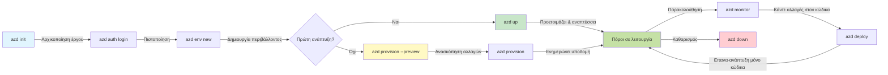

# AZD Βασικά - Κατανόηση του Azure Developer CLI

# AZD Βασικά - Κύριες Έννοιες και Θεμελιώδη

**Πλοήγηση Κεφαλαίου:**
- **📚 Αρχική Σελίδα Μαθήματος**: [AZD Για Αρχάριους](../../README.md)
- **📖 Τρέχον Κεφάλαιο**: Κεφάλαιο 1 - Βάσεις & Γρήγορη Εκκίνηση
- **⬅️ Προηγούμενο**: [Επισκόπηση Μαθήματος](../../README.md#-chapter-1-foundation--quick-start)
- **➡️ Επόμενο**: [Εγκατάσταση & Ρύθμιση](installation.md)
- **🚀 Επόμενο Κεφάλαιο**: [Κεφάλαιο 2: Ανάπτυξη με Προτεραιότητα στην Τεχνητή Νοημοσύνη](../microsoft-foundry/microsoft-foundry-integration.md)

## Εισαγωγή

Αυτό το μάθημα σας εισάγει στο Azure Developer CLI (azd), ένα ισχυρό εργαλείο γραμμής εντολών που επιταχύνει τη μετάβασή σας από την τοπική ανάπτυξη στην ανάπτυξη στο Azure. Θα μάθετε τις βασικές έννοιες, τα κύρια χαρακτηριστικά και πώς το azd απλοποιεί την ανάπτυξη εφαρμογών cloud-native.

## Στόχοι Μάθησης

Μέχρι το τέλος αυτού του μαθήματος, θα:
- Κατανοήσετε τι είναι το Azure Developer CLI και τον κύριο σκοπό του
- Μάθετε τις βασικές έννοιες των προτύπων, περιβαλλόντων και υπηρεσιών
- Εξερευνήσετε βασικά χαρακτηριστικά όπως η ανάπτυξη με βάση πρότυπα και το Infrastructure as Code
- Κατανοήσετε τη δομή και τη ροή εργασίας ενός έργου azd
- Είστε έτοιμοι να εγκαταστήσετε και να ρυθμίσετε το azd για το περιβάλλον ανάπτυξής σας

## Αποτελέσματα Μάθησης

Μετά την ολοκλήρωση αυτού του μαθήματος, θα μπορείτε να:
- Εξηγήσετε τον ρόλο του azd στις σύγχρονες ροές εργασίας ανάπτυξης cloud
- Αναγνωρίσετε τα στοιχεία της δομής ενός έργου azd
- Περιγράψετε πώς τα πρότυπα, τα περιβάλλοντα και οι υπηρεσίες συνεργάζονται
- Κατανοήσετε τα οφέλη του Infrastructure as Code με το azd
- Αναγνωρίσετε διαφορετικές εντολές azd και τους σκοπούς τους

## Τι είναι το Azure Developer CLI (azd);

Το Azure Developer CLI (azd) είναι ένα εργαλείο γραμμής εντολών σχεδιασμένο να επιταχύνει τη μετάβασή σας από την τοπική ανάπτυξη στην ανάπτυξη στο Azure. Απλοποιεί τη διαδικασία δημιουργίας, ανάπτυξης και διαχείρισης εφαρμογών cloud-native στο Azure.

### 🎯 Γιατί να Χρησιμοποιήσετε το AZD; Μια Σύγκριση από τον Πραγματικό Κόσμο

Ας συγκρίνουμε την ανάπτυξη μιας απλής web εφαρμογής με βάση δεδομένων:

#### ❌ ΧΩΡΙΣ AZD: Χειροκίνητη Ανάπτυξη στο Azure (30+ λεπτά)

```bash
# Βήμα 1: Δημιουργία ομάδας πόρων
az group create --name myapp-rg --location eastus

# Βήμα 2: Δημιουργία Σχεδίου Υπηρεσίας Εφαρμογών
az appservice plan create --name myapp-plan \
  --resource-group myapp-rg \
  --sku B1 --is-linux

# Βήμα 3: Δημιουργία Εφαρμογής Ιστού
az webapp create --name myapp-web-unique123 \
  --resource-group myapp-rg \
  --plan myapp-plan \
  --runtime "NODE:18-lts"

# Βήμα 4: Δημιουργία λογαριασμού Cosmos DB (10-15 λεπτά)
az cosmosdb create --name myapp-cosmos-unique123 \
  --resource-group myapp-rg \
  --kind MongoDB

# Βήμα 5: Δημιουργία βάσης δεδομένων
az cosmosdb mongodb database create \
  --account-name myapp-cosmos-unique123 \
  --resource-group myapp-rg \
  --name tododb

# Βήμα 6: Δημιουργία συλλογής
az cosmosdb mongodb collection create \
  --account-name myapp-cosmos-unique123 \
  --resource-group myapp-rg \
  --database-name tododb \
  --name todos

# Βήμα 7: Λήψη συμβολοσειράς σύνδεσης
CONN_STR=$(az cosmosdb keys list \
  --name myapp-cosmos-unique123 \
  --resource-group myapp-rg \
  --type connection-strings \
  --query "connectionStrings[0].connectionString" -o tsv)

# Βήμα 8: Ρύθμιση παραμέτρων εφαρμογής
az webapp config appsettings set \
  --name myapp-web-unique123 \
  --resource-group myapp-rg \
  --settings MONGODB_URI="$CONN_STR"

# Βήμα 9: Ενεργοποίηση καταγραφής
az webapp log config --name myapp-web-unique123 \
  --resource-group myapp-rg \
  --application-logging filesystem \
  --detailed-error-messages true

# Βήμα 10: Ρύθμιση Application Insights
az monitor app-insights component create \
  --app myapp-insights \
  --location eastus \
  --resource-group myapp-rg

# Βήμα 11: Σύνδεση App Insights με την Εφαρμογή Ιστού
INSTRUMENTATION_KEY=$(az monitor app-insights component show \
  --app myapp-insights \
  --resource-group myapp-rg \
  --query "instrumentationKey" -o tsv)

az webapp config appsettings set \
  --name myapp-web-unique123 \
  --resource-group myapp-rg \
  --settings APPINSIGHTS_INSTRUMENTATIONKEY="$INSTRUMENTATION_KEY"

# Βήμα 12: Δημιουργία εφαρμογής τοπικά
npm install
npm run build

# Βήμα 13: Δημιουργία πακέτου ανάπτυξης
zip -r app.zip . -x "*.git*" "node_modules/*"

# Βήμα 14: Ανάπτυξη εφαρμογής
az webapp deployment source config-zip \
  --resource-group myapp-rg \
  --name myapp-web-unique123 \
  --src app.zip

# Βήμα 15: Περιμένετε και προσευχηθείτε να λειτουργήσει 🙏
# (Δεν υπάρχει αυτοματοποιημένη επαλήθευση, απαιτείται χειροκίνητη δοκιμή)
```

**Προβλήματα:**
- ❌ 15+ εντολές που πρέπει να θυμάστε και να εκτελέσετε με τη σωστή σειρά
- ❌ 30-45 λεπτά χειροκίνητης εργασίας
- ❌ Εύκολα λάθη (τυπογραφικά, λάθος παράμετροι)
- ❌ Οι συμβολοσειρές σύνδεσης εμφανίζονται στο ιστορικό του τερματικού
- ❌ Καμία αυτόματη επαναφορά αν κάτι αποτύχει
- ❌ Δύσκολο να αναπαραχθεί από τα μέλη της ομάδας
- ❌ Διαφορετικό κάθε φορά (μη αναπαραγώγιμο)

#### ✅ ΜΕ AZD: Αυτοματοποιημένη Ανάπτυξη (5 εντολές, 10-15 λεπτά)

```bash
# Βήμα 1: Αρχικοποίηση από πρότυπο
azd init --template todo-nodejs-mongo

# Βήμα 2: Επαλήθευση ταυτότητας
azd auth login

# Βήμα 3: Δημιουργία περιβάλλοντος
azd env new dev

# Βήμα 4: Προεπισκόπηση αλλαγών (προαιρετικό αλλά συνιστάται)
azd provision --preview

# Βήμα 5: Ανάπτυξη όλων
azd up

# ✨ Έγινε! Όλα έχουν αναπτυχθεί, ρυθμιστεί και παρακολουθούνται
```

**Οφέλη:**
- ✅ **5 εντολές** έναντι 15+ χειροκίνητων βημάτων
- ✅ **10-15 λεπτά** συνολικός χρόνος (κυρίως αναμονή για το Azure)
- ✅ **Μηδενικά λάθη** - αυτοματοποιημένο και δοκιμασμένο
- ✅ **Διαχείριση μυστικών με ασφάλεια** μέσω Key Vault
- ✅ **Αυτόματη επαναφορά** σε περίπτωση αποτυχίας
- ✅ **Πλήρως αναπαραγώγιμο** - ίδιο αποτέλεσμα κάθε φορά
- ✅ **Έτοιμο για την ομάδα** - οποιοσδήποτε μπορεί να αναπτύξει με τις ίδιες εντολές
- ✅ **Infrastructure as Code** - πρότυπα Bicep υπό έλεγχο έκδοσης
- ✅ **Ενσωματωμένη παρακολούθηση** - Application Insights ρυθμισμένο αυτόματα

### 📊 Μείωση Χρόνου & Λαθών

| Μετρική | Χειροκίνητη Ανάπτυξη | Ανάπτυξη με AZD | Βελτίωση |
|:-------|:---------------------|:----------------|:---------|
| **Εντολές** | 15+ | 5 | 67% λιγότερες |
| **Χρόνος** | 30-45 λεπτά | 10-15 λεπτά | 60% ταχύτερα |
| **Ποσοστό Λαθών** | ~40% | <5% | 88% μείωση |
| **Συνέπεια** | Χαμηλή (χειροκίνητη) | 100% (αυτοματοποιημένη) | Τέλεια |
| **Εκπαίδευση Ομάδας** | 2-4 ώρες | 30 λεπτά | 75% ταχύτερα |
| **Χρόνος Επαναφοράς** | 30+ λεπτά (χειροκίνητη) | 2 λεπτά (αυτοματοποιημένη) | 93% ταχύτερα |

## Βασικές Έννοιες

### Πρότυπα
Τα πρότυπα είναι το θεμέλιο του azd. Περιλαμβάνουν:
- **Κώδικα εφαρμογής** - Ο πηγαίος κώδικας και οι εξαρτήσεις σας
- **Ορισμούς υποδομής** - Πόροι Azure ορισμένοι σε Bicep ή Terraform
- **Αρχεία ρύθμισης** - Ρυθμίσεις και μεταβλητές περιβάλλοντος
- **Σενάρια ανάπτυξης** - Αυτοματοποιημένες ροές εργασίας ανάπτυξης

### Περιβάλλοντα
Τα περιβάλλοντα αντιπροσωπεύουν διαφορετικούς στόχους ανάπτυξης:
- **Ανάπτυξη** - Για δοκιμές και ανάπτυξη
- **Δοκιμαστικό** - Περιβάλλον προπαραγωγής
- **Παραγωγή** - Ζωντανό περιβάλλον παραγωγής

Κάθε περιβάλλον διατηρεί το δικό του:
- Ομάδα πόρων Azure
- Ρυθμίσεις διαμόρφωσης
- Κατάσταση ανάπτυξης

### Υπηρεσίες
Οι υπηρεσίες είναι τα δομικά στοιχεία της εφαρμογής σας:
- **Frontend** - Web εφαρμογές, SPAs
- **Backend** - APIs, μικροϋπηρεσίες
- **Βάση δεδομένων** - Λύσεις αποθήκευσης δεδομένων
- **Αποθήκευση** - Αποθήκευση αρχείων και blob

## Κύρια Χαρακτηριστικά

### 1. Ανάπτυξη με Βάση Πρότυπα
```bash
# Περιήγηση διαθέσιμων προτύπων
azd template list

# Αρχικοποίηση από ένα πρότυπο
azd init --template <template-name>
```

### 2. Infrastructure as Code
- **Bicep** - Ειδική γλώσσα για το Azure
- **Terraform** - Εργαλείο υποδομής πολλαπλών cloud
- **ARM Templates** - Πρότυπα Azure Resource Manager

### 3. Ενσωματωμένες Ροές Εργασίας
```bash
# Ολοκληρώστε τη ροή εργασίας ανάπτυξης
azd up            # Παροχή + Ανάπτυξη, αυτό είναι χωρίς παρέμβαση για την πρώτη ρύθμιση

# 🧪 ΝΕΟ: Προεπισκόπηση αλλαγών υποδομής πριν από την ανάπτυξη (ΑΣΦΑΛΕΣ)
azd provision --preview    # Προσομοίωση ανάπτυξης υποδομής χωρίς να γίνουν αλλαγές

azd provision     # Δημιουργήστε πόρους Azure αν ενημερώσετε την υποδομή χρησιμοποιήστε αυτό
azd deploy        # Αναπτύξτε κώδικα εφαρμογής ή επαναπροσδιορίστε τον κώδικα εφαρμογής μετά την ενημέρωση
azd down          # Καθαρίστε τους πόρους
```

#### 🛡️ Ασφαλής Σχεδιασμός Υποδομής με Προεπισκόπηση
Η εντολή `azd provision --preview` είναι επαναστατική για ασφαλείς αναπτύξεις:
- **Ανάλυση δοκιμαστικής εκτέλεσης** - Δείχνει τι θα δημιουργηθεί, τροποποιηθεί ή διαγραφεί
- **Μηδενικός κίνδυνος** - Δεν γίνονται πραγματικές αλλαγές στο περιβάλλον Azure
- **Συνεργασία ομάδας** - Μοιραστείτε τα αποτελέσματα της προεπισκόπησης πριν την ανάπτυξη
- **Εκτίμηση κόστους** - Κατανοήστε το κόστος των πόρων πριν τη δέσμευση

```bash
# Παράδειγμα ροής εργασίας προεπισκόπησης
azd provision --preview           # Δείτε τι θα αλλάξει
# Εξετάστε την έξοδο, συζητήστε με την ομάδα
azd provision                     # Εφαρμόστε αλλαγές με αυτοπεποίθηση
```

### 📊 Οπτική Αναπαράσταση: Ροή Εργασίας Ανάπτυξης AZD


**Επεξήγηση Ροής Εργασίας:**
1. **Init** - Ξεκινήστε με πρότυπο ή νέο έργο
2. **Auth** - Εξουσιοδότηση με το Azure
3. **Environment** - Δημιουργία απομονωμένου περιβάλλοντος ανάπτυξης
4. **Preview** - 🆕 Πάντα προεπισκόπηση αλλαγών υποδομής πρώτα (ασφαλής πρακτική)
5. **Provision** - Δημιουργία/ενημέρωση πόρων Azure
6. **Deploy** - Ανάπτυξη του κώδικα της εφαρμογής σας
7. **Monitor** - Παρακολούθηση απόδοσης εφαρμογής
8. **Iterate** - Κάντε αλλαγές και αναπτύξτε ξανά τον κώδικα
9. **Cleanup** - Αφαίρεση πόρων όταν τελειώσετε

### 4. Διαχείριση Περιβαλλόντων
```bash
# Δημιουργία και διαχείριση περιβαλλόντων
azd env new <environment-name>
azd env select <environment-name>
azd env list
```

## 📁 Δομή Έργου

Μια τυπική δομή έργου azd:
```
my-app/
├── .azd/                    # azd configuration
│   └── config.json
├── .azure/                  # Azure deployment artifacts
├── .devcontainer/          # Development container config
├── .github/workflows/      # GitHub Actions
├── .vscode/               # VS Code settings
├── infra/                 # Infrastructure code
│   ├── main.bicep        # Main infrastructure template
│   ├── main.parameters.json
│   └── modules/          # Reusable modules
├── src/                  # Application source code
│   ├── api/             # Backend services
│   └── web/             # Frontend application
├── azure.yaml           # azd project configuration
└── README.md
```

## 🔧 Αρχεία Ρύθμισης

### azure.yaml
Το κύριο αρχείο ρύθμισης έργου:
```yaml
name: my-awesome-app
metadata:
  template: my-template@1.0.0

services:
  web:
    project: ./src/web
    language: js
    host: appservice
  api:
    project: ./src/api
    language: js
    host: appservice

hooks:
  preprovision:
    shell: pwsh
    run: echo "Preparing to provision..."
```

### .azure/config.json
Ρύθμιση συγκεκριμένη για το περιβάλλον:
```json
{
  "version": 1,
  "defaultEnvironment": "dev",
  "environments": {
    "dev": {
      "subscriptionId": "your-subscription-id",
      "location": "eastus"
    }
  }
}
```

## 🎪 Συνήθεις Ροές Εργασίας με Πρακτικές Ασκήσεις

> **💡 Συμβουλή Μάθησης:** Ακολουθήστε αυτές τις ασκήσεις με τη σειρά για να αναπτύξετε σταδιακά τις δεξιότητές σας στο AZD.

### 🎯 Άσκηση 1: Αρχικοποίηση του Πρώτου σας Έργου

**Στόχος:** Δημιουργήστε ένα έργο AZD και εξερευνήστε τη δομή του

**Βήματα:**
```bash
# Χρησιμοποιήστε ένα αποδεδειγμένο πρότυπο
azd init --template todo-nodejs-mongo

# Εξερευνήστε τα παραγόμενα αρχεία
ls -la  # Δείτε όλα τα αρχεία, συμπεριλαμβανομένων των κρυφών

# Δημιουργήθηκαν βασικά αρχεία:
# - azure.yaml (κύρια ρύθμιση)
# - infra/ (κώδικας υποδομής)
# - src/ (κώδικας εφαρμογής)
```

**✅ Επιτυχία:** Έχετε τους φακέλους azure.yaml, infra/ και src/

---

### 🎯 Άσκηση 2: Ανάπτυξη στο Azure

**Στόχος:** Ολοκληρώστε την ανάπτυξη από άκρη σε άκρη

**Βήματα:**
```bash
# 1. Επαλήθευση ταυτότητας
az login && azd auth login

# 2. Δημιουργία περιβάλλοντος
azd env new dev
azd env set AZURE_LOCATION eastus

# 3. Προεπισκόπηση αλλαγών (ΣΥΝΙΣΤΑΤΑΙ)
azd provision --preview

# 4. Ανάπτυξη όλων
azd up

# 5. Επαλήθευση ανάπτυξης
azd show    # Προβολή του URL της εφαρμογής σας
```

**Αναμενόμενος Χρόνος:** 10-15 λεπτά  
**✅ Επιτυχία:** Το URL της εφαρμογής ανοίγει στον περιηγητή

---

### 🎯 Άσκηση 3: Πολλαπλά Περιβάλλοντα

**Στόχος:** Ανάπτυξη σε dev και staging

**Βήματα:**
```bash
# Ήδη υπάρχει dev, δημιουργήστε staging
azd env new staging
azd env set AZURE_LOCATION westus2
azd up

# Εναλλαγή μεταξύ τους
azd env list
azd env select dev
```

**✅ Επιτυχία:** Δύο ξεχωριστές ομάδες πόρων στο Azure Portal

---

### 🛡️ Καθαρή Αρχή: `azd down --force --purge`

Όταν χρειάζεστε πλήρη επαναφορά:

```bash
azd down --force --purge
```

**Τι κάνει:**
- `--force`: Χωρίς επιβεβαιωτικά μηνύματα
- `--purge`: Διαγράφει όλη την τοπική κατάσταση και τους πόρους Azure

**Χρήση όταν:**
- Η ανάπτυξη απέτυχε στη μέση
- Αλλαγή έργων
- Χρειάζεστε νέα αρχή

---

## 🎪 Αναφορά Αρχικής Ροής Εργασίας

### Ξεκινώντας Ένα Νέο Έργο
```bash
# Μέθοδος 1: Χρησιμοποιήστε υπάρχον πρότυπο
azd init --template todo-nodejs-mongo

# Μέθοδος 2: Ξεκινήστε από την αρχή
azd init

# Μέθοδος 3: Χρησιμοποιήστε τον τρέχοντα κατάλογο
azd init .
```

### Κύκλος Ανάπτυξης
```bash
# Ρυθμίστε το περιβάλλον ανάπτυξης
azd auth login
azd env new dev
azd env select dev

# Αναπτύξτε τα πάντα
azd up

# Κάντε αλλαγές και επανααναπτύξτε
azd deploy

# Καθαρίστε όταν τελειώσετε
azd down --force --purge # η εντολή στο Azure Developer CLI είναι μια **σκληρή επαναφορά** για το περιβάλλον σας—ιδιαίτερα χρήσιμη όταν αντιμετωπίζετε προβλήματα με αποτυχημένες αναπτύξεις, καθαρίζετε ορφανές πόρους ή προετοιμάζεστε για μια νέα επανααναπτύξη.
```

## Κατανόηση του `azd down --force --purge`
Η εντολή `azd down --force --purge` είναι ένας ισχυρός τρόπος για πλήρη κατάργηση του περιβάλλοντος azd και όλων των σχετικών πόρων. Εδώ είναι μια ανάλυση του τι κάνει κάθε σημαία:
```
--force
```

- [Εγκατάσταση & Ρύθμιση](installation.md) - Εγκαταστήστε και ρυθμίστε το azd
- [Το Πρώτο σας Έργο](first-project.md) - Ολοκληρωμένο πρακτικό σεμινάριο
- [Οδηγός Ρύθμισης](configuration.md) - Προχωρημένες επιλογές ρύθμισης

**🎯 Έτοιμοι για το Επόμενο Κεφάλαιο;**
- [Κεφάλαιο 2: Ανάπτυξη με Προτεραιότητα στην Τεχνητή Νοημοσύνη](../microsoft-foundry/microsoft-foundry-integration.md) - Ξεκινήστε να δημιουργείτε εφαρμογές AI

## Πρόσθετοι Πόροι

- [Επισκόπηση Azure Developer CLI](https://learn.microsoft.com/en-us/azure/developer/azure-developer-cli/)
- [Γκαλερί Προτύπων](https://azure.github.io/awesome-azd/)
- [Δείγματα Κοινότητας](https://github.com/Azure-Samples)

---

## 🙋 Συχνές Ερωτήσεις

### Γενικές Ερωτήσεις

**Ε: Ποια είναι η διαφορά μεταξύ AZD και Azure CLI;**

Α: Το Azure CLI (`az`) χρησιμοποιείται για τη διαχείριση μεμονωμένων πόρων Azure. Το AZD (`azd`) χρησιμοποιείται για τη διαχείριση ολόκληρων εφαρμογών:

```bash
# Azure CLI - Διαχείριση πόρων χαμηλού επιπέδου
az webapp create --name myapp --resource-group rg
az sql server create --name myserver --resource-group rg
# ...απαιτούνται πολλές περισσότερες εντολές

# AZD - Διαχείριση σε επίπεδο εφαρμογής
azd up  # Αναπτύσσει ολόκληρη την εφαρμογή με όλους τους πόρους
```

**Σκεφτείτε το έτσι:**
- `az` = Εργασία με μεμονωμένα κομμάτια Lego
- `azd` = Εργασία με ολοκληρωμένα σετ Lego

---

**Ε: Χρειάζεται να γνωρίζω Bicep ή Terraform για να χρησιμοποιήσω το AZD;**

Α: Όχι! Ξεκινήστε με πρότυπα:
```bash
# Χρησιμοποιήστε υπάρχον πρότυπο - δεν απαιτείται γνώση IaC
azd init --template todo-nodejs-mongo
azd up
```

Μπορείτε να μάθετε Bicep αργότερα για να προσαρμόσετε την υποδομή. Τα πρότυπα παρέχουν λειτουργικά παραδείγματα για να μάθετε.

---

**Ε: Πόσο κοστίζει η εκτέλεση προτύπων AZD;**

Α: Το κόστος ποικίλλει ανά πρότυπο. Τα περισσότερα πρότυπα ανάπτυξης κοστίζουν $50-150/μήνα:

```bash
# Προεπισκόπηση κόστους πριν την ανάπτυξη
azd provision --preview

# Πάντα καθαρισμός όταν δεν χρησιμοποιείται
azd down --force --purge  # Αφαιρεί όλους τους πόρους
```

**Συμβουλή:** Χρησιμοποιήστε δωρεάν επίπεδα όπου είναι διαθέσιμα:
- App Service: Επίπεδο F1 (Δωρεάν)
- Azure OpenAI: 50,000 tokens/μήνα δωρεάν
- Cosmos DB: 1000 RU/s δωρεάν επίπεδο

---

**Ε: Μπορώ να χρησιμοποιήσω το AZD με υπάρχοντες πόρους Azure;**

Α: Ναι, αλλά είναι πιο εύκολο να ξεκινήσετε από την αρχή. Το AZD λειτουργεί καλύτερα όταν διαχειρίζεται ολόκληρο τον κύκλο ζωής. Για υπάρχοντες πόρους:

```bash
# Επιλογή 1: Εισαγωγή υπαρχόντων πόρων (προχωρημένο)
azd init
# Στη συνέχεια τροποποιήστε το infra/ για να αναφέρεται σε υπάρχοντες πόρους

# Επιλογή 2: Ξεκινήστε από την αρχή (συνιστάται)
azd init --template matching-your-stack
azd up  # Δημιουργεί νέο περιβάλλον
```

---

**Ε: Πώς μπορώ να μοιραστώ το έργο μου με την ομάδα μου;**

Α: Κάντε commit το έργο AZD στο Git (αλλά ΟΧΙ τον φάκελο .azure):

```bash
# Ήδη στο .gitignore από προεπιλογή
.azure/        # Περιέχει μυστικά και δεδομένα περιβάλλοντος
*.env          # Μεταβλητές περιβάλλοντος

# Τα μέλη της ομάδας τότε:
git clone <your-repo>
azd auth login
azd env new <their-name>-dev
azd up
```

Όλοι αποκτούν ίδια υποδομή από τα ίδια πρότυπα.

---

### Ερωτήσεις Αντιμετώπισης Προβλημάτων

**Ε: Το "azd up" απέτυχε στη μέση. Τι να κάνω;**

Α: Ελέγξτε το σφάλμα, διορθώστε το και δοκιμάστε ξανά:

```bash
# Προβολή λεπτομερών καταγραφών
azd show

# Κοινές διορθώσεις:

# 1. Εάν ξεπεράστηκε το όριο:
azd env set AZURE_LOCATION "westus2"  # Δοκιμάστε διαφορετική περιοχή

# 2. Εάν υπάρχει σύγκρουση ονόματος πόρου:
azd down --force --purge  # Καθαρίστε τα πάντα
azd up  # Δοκιμάστε ξανά

# 3. Εάν η εξουσιοδότηση έχει λήξει:
az login
azd auth login
azd up
```

**Το πιο συνηθισμένο πρόβλημα:** Επιλέχθηκε λάθος συνδρομή Azure
```bash
az account list --output table
az account set --subscription "<correct-subscription>"
```

---

**Ε: Πώς μπορώ να αναπτύξω μόνο αλλαγές στον κώδικα χωρίς να επαναπροβλέψω;**

Α: Χρησιμοποιήστε το `azd deploy` αντί για `azd up`:

```bash
azd up          # Πρώτη φορά: προμήθεια + ανάπτυξη (αργό)

# Κάντε αλλαγές στον κώδικα...

azd deploy      # Επόμενες φορές: μόνο ανάπτυξη (γρήγορο)
```

Σύγκριση ταχύτητας:
- `azd up`: 10-15 λεπτά (προβλέπει υποδομή)
- `azd deploy`: 2-5 λεπτά (μόνο κώδικας)

---

**Ε: Μπορώ να προσαρμόσω τα πρότυπα υποδομής;**

Α: Ναι! Επεξεργαστείτε τα αρχεία Bicep στον φάκελο `infra/`:

```bash
# Μετά το azd init
cd infra/
code main.bicep  # Επεξεργασία στο VS Code

# Προεπισκόπηση αλλαγών
azd provision --preview

# Εφαρμογή αλλαγών
azd provision
```

**Συμβουλή:** Ξεκινήστε μικρά - αλλάξτε πρώτα τα SKUs:
```bicep
// infra/main.bicep
sku: {
  name: 'B1'  // Change to 'P1V2' for production
}
```

---

**Ε: Πώς μπορώ να διαγράψω όλα όσα δημιούργησε το AZD;**

Α: Μια εντολή αφαιρεί όλους τους πόρους:

```bash
azd down --force --purge

# Αυτό διαγράφει:
# - Όλους τους πόρους Azure
# - Ομάδα πόρων
# - Κατάσταση τοπικού περιβάλλοντος
# - Αποθηκευμένα δεδομένα ανάπτυξης
```

**Πάντα να το εκτελείτε όταν:**
- Ολοκληρώσετε τη δοκιμή ενός προτύπου
- Μεταβαίνετε σε διαφορετικό έργο
- Θέλετε να ξεκινήσετε από την αρχή

**Εξοικονόμηση κόστους:** Διαγραφή αχρησιμοποίητων πόρων = $0 χρεώσεις

---

**Ε: Τι γίνεται αν διαγράψω κατά λάθος πόρους στο Azure Portal;**

Α: Η κατάσταση του AZD μπορεί να μην συγχρονίζεται. Προσέγγιση καθαρού πίνακα:

```bash
# 1. Αφαιρέστε την τοπική κατάσταση
azd down --force --purge

# 2. Ξεκινήστε από την αρχή
azd up

# Εναλλακτική: Αφήστε το AZD να ανιχνεύσει και να διορθώσει
azd provision  # Θα δημιουργήσει ελλείποντες πόρους
```

---

### Προχωρημένες Ερωτήσεις

**Ε: Μπορώ να χρησιμοποιήσω το AZD σε pipelines CI/CD;**

Α: Ναι! Παράδειγμα GitHub Actions:

```yaml
# .github/workflows/deploy.yml
name: Deploy with AZD

on:
  push:
    branches: [main]

jobs:
  deploy:
    runs-on: ubuntu-latest
    steps:
      - uses: actions/checkout@v2
      
      - name: Install azd
        run: curl -fsSL https://aka.ms/install-azd.sh | bash
      
      - name: Azure Login
        run: |
          azd auth login \
            --client-id ${{ secrets.AZURE_CLIENT_ID }} \
            --client-secret ${{ secrets.AZURE_CLIENT_SECRET }} \
            --tenant-id ${{ secrets.AZURE_TENANT_ID }}
      
      - name: Deploy
        run: azd up --no-prompt
```

---

**Ε: Πώς μπορώ να χειριστώ μυστικά και ευαίσθητα δεδομένα;**

Α: Το AZD ενσωματώνεται αυτόματα με το Azure Key Vault:

```bash
# Τα μυστικά αποθηκεύονται στο Key Vault, όχι στον κώδικα
azd env set DATABASE_PASSWORD "$(openssl rand -base64 32)"

# Το AZD αυτόματα:
# 1. Δημιουργεί Key Vault
# 2. Αποθηκεύει το μυστικό
# 3. Παρέχει πρόσβαση στην εφαρμογή μέσω Managed Identity
# 4. Εισάγει κατά την εκτέλεση
```

**Ποτέ μην κάνετε commit:**
- Φάκελο `.azure/` (περιέχει δεδομένα περιβάλλοντος)
- Αρχεία `.env` (τοπικά μυστικά)
- Σειρές σύνδεσης

---

**Ε: Μπορώ να αναπτύξω σε πολλαπλές περιοχές;**

Α: Ναι, δημιουργήστε περιβάλλον ανά περιοχή:

```bash
# Περιβάλλον Ανατολικών ΗΠΑ
azd env new prod-eastus
azd env set AZURE_LOCATION eastus
azd up

# Περιβάλλον Δυτικής Ευρώπης
azd env new prod-westeurope
azd env set AZURE_LOCATION westeurope
azd up

# Κάθε περιβάλλον είναι ανεξάρτητο
azd env list
```

Για πραγματικές εφαρμογές πολλαπλών περιοχών, προσαρμόστε τα πρότυπα Bicep για ανάπτυξη σε πολλαπλές περιοχές ταυτόχρονα.

---

**Ε: Πού μπορώ να βρω βοήθεια αν κολλήσω;**

1. **Τεκμηρίωση AZD:** https://learn.microsoft.com/azure/developer/azure-developer-cli/
2. **GitHub Issues:** https://github.com/Azure/azure-dev/issues
3. **Discord:** [Azure Discord](https://discord.gg/microsoft-azure) - κανάλι #azure-developer-cli
4. **Stack Overflow:** Ετικέτα `azure-developer-cli`
5. **Αυτό το Μάθημα:** [Οδηγός Αντιμετώπισης Προβλημάτων](../troubleshooting/common-issues.md)

**Συμβουλή:** Πριν ρωτήσετε, εκτελέστε:
```bash
azd show       # Εμφανίζει την τρέχουσα κατάσταση
azd version    # Εμφανίζει την έκδοσή σας
```
Συμπεριλάβετε αυτές τις πληροφορίες στην ερώτησή σας για γρηγορότερη βοήθεια.

---

## 🎓 Τι Ακολουθεί;

Τώρα κατανοείτε τα βασικά του AZD. Επιλέξτε την πορεία σας:

### 🎯 Για Αρχάριους:
1. **Επόμενο:** [Εγκατάσταση & Ρύθμιση](installation.md) - Εγκαταστήστε το AZD στον υπολογιστή σας
2. **Μετά:** [Το Πρώτο σας Έργο](first-project.md) - Αναπτύξτε την πρώτη σας εφαρμογή
3. **Πρακτική:** Ολοκληρώστε και τις 3 ασκήσεις αυτού του μαθήματος

### 🚀 Για Προγραμματιστές AI:
1. **Μεταβείτε στο:** [Κεφάλαιο 2: Ανάπτυξη με Προτεραιότητα στην Τεχνητή Νοημοσύνη](../microsoft-foundry/microsoft-foundry-integration.md)
2. **Αναπτύξτε:** Ξεκινήστε με `azd init --template get-started-with-ai-chat`
3. **Μάθετε:** Δημιουργήστε ενώ αναπτύσσετε

### 🏗️ Για Έμπειρους Προγραμματιστές:
1. **Ανασκόπηση:** [Οδηγός Ρύθμισης](configuration.md) - Προχωρημένες ρυθμίσεις
2. **Εξερεύνηση:** [Υποδομή ως Κώδικας](../deployment/provisioning.md) - Εμβάθυνση στο Bicep
3. **Δημιουργία:** Δημιουργήστε προσαρμοσμένα πρότυπα για το stack σας

---

**Πλοήγηση Κεφαλαίων:**
- **📚 Αρχική Μαθήματος**: [AZD Για Αρχάριους](../../README.md)
- **📖 Τρέχον Κεφάλαιο**: Κεφάλαιο 1 - Βάση & Γρήγορη Εκκίνηση  
- **⬅️ Προηγούμενο**: [Επισκόπηση Μαθήματος](../../README.md#-chapter-1-foundation--quick-start)
- **➡️ Επόμενο**: [Εγκατάσταση & Ρύθμιση](installation.md)
- **🚀 Επόμενο Κεφάλαιο**: [Κεφάλαιο 2: Ανάπτυξη με Προτεραιότητα στην Τεχνητή Νοημοσύνη](../microsoft-foundry/microsoft-foundry-integration.md)

---

<!-- CO-OP TRANSLATOR DISCLAIMER START -->
**Αποποίηση ευθύνης**:  
Αυτό το έγγραφο έχει μεταφραστεί χρησιμοποιώντας την υπηρεσία μετάφρασης AI [Co-op Translator](https://github.com/Azure/co-op-translator). Παρόλο που καταβάλλουμε προσπάθειες για ακρίβεια, παρακαλούμε να έχετε υπόψη ότι οι αυτοματοποιημένες μεταφράσεις ενδέχεται να περιέχουν λάθη ή ανακρίβειες. Το πρωτότυπο έγγραφο στη μητρική του γλώσσα θα πρέπει να θεωρείται η αυθεντική πηγή. Για κρίσιμες πληροφορίες, συνιστάται επαγγελματική ανθρώπινη μετάφραση. Δεν φέρουμε ευθύνη για τυχόν παρεξηγήσεις ή εσφαλμένες ερμηνείες που προκύπτουν από τη χρήση αυτής της μετάφρασης.
<!-- CO-OP TRANSLATOR DISCLAIMER END -->