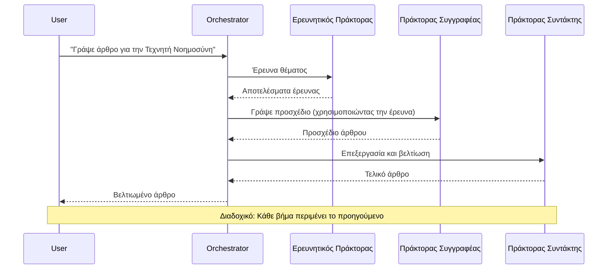
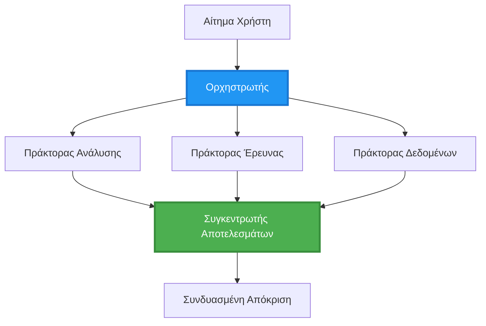
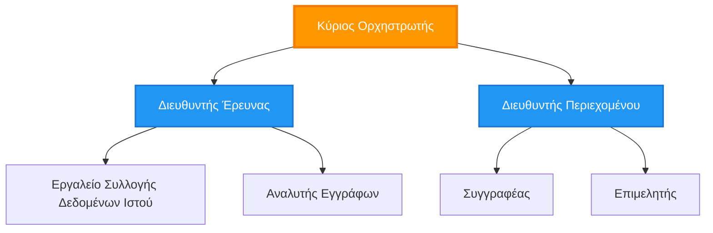
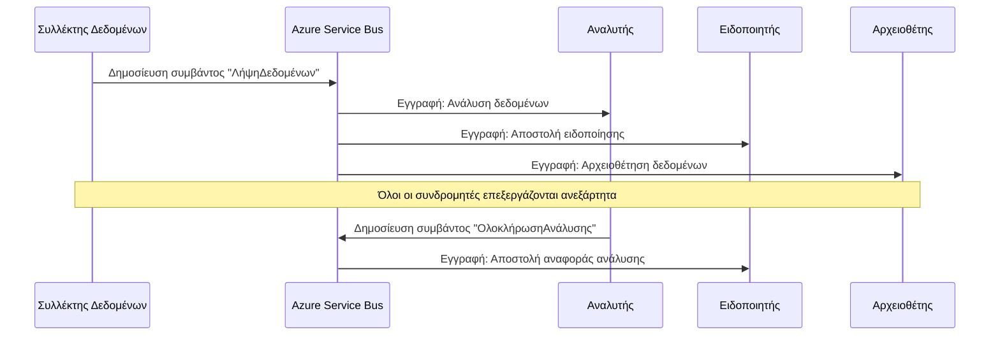
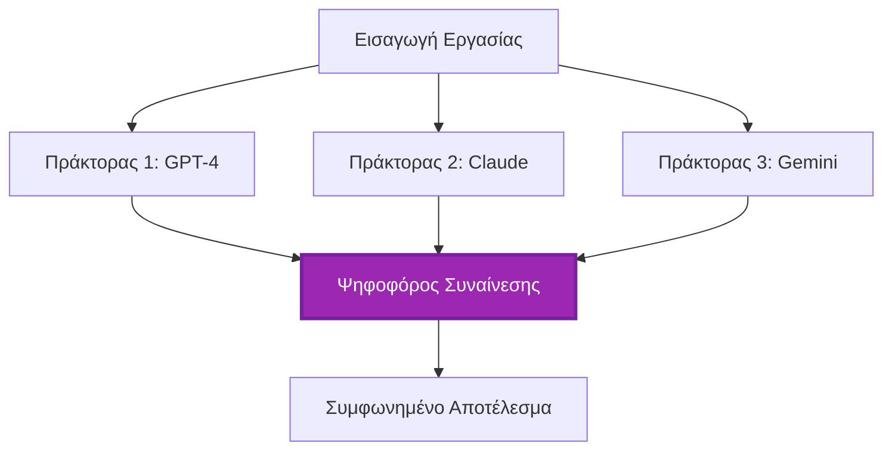
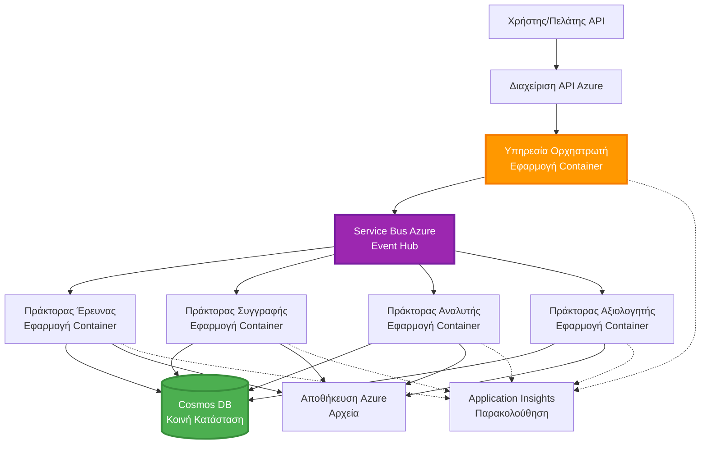

<!--
CO_OP_TRANSLATOR_METADATA:
{
  "original_hash": "bcefbd5d0107691ef3e6e33ba694d6f4",
  "translation_date": "2025-11-21T10:43:18+00:00",
  "source_file": "docs/pre-deployment/coordination-patterns.md",
  "language_code": "el"
}
-->
# Πρότυπα Συντονισμού Πολλαπλών Πρακτόρων

⏱️ **Εκτιμώμενος Χρόνος**: 60-75 λεπτά | 💰 **Εκτιμώμενο Κόστος**: ~$100-300/μήνα | ⭐ **Πολυπλοκότητα**: Προχωρημένο

**📚 Διαδρομή Μάθησης:**
- ← Προηγούμενο: [Σχεδιασμός Ικανότητας](capacity-planning.md) - Στρατηγικές μεγέθους και κλιμάκωσης πόρων
- 🎯 **Είστε Εδώ**: Πρότυπα Συντονισμού Πολλαπλών Πρακτόρων (Ορχήστρωση, επικοινωνία, διαχείριση κατάστασης)
- → Επόμενο: [Επιλογή SKU](sku-selection.md) - Επιλογή των κατάλληλων υπηρεσιών Azure
- 🏠 [Αρχική Σελίδα Μαθήματος](../../README.md)

---

## Τι Θα Μάθετε

Με την ολοκλήρωση αυτού του μαθήματος, θα:
- Κατανοήσετε τα πρότυπα αρχιτεκτονικής **πολλαπλών πρακτόρων** και πότε να τα χρησιμοποιείτε
- Υλοποιήσετε **πρότυπα ορχήστρωσης** (κεντρική, αποκεντρωμένη, ιεραρχική)
- Σχεδιάσετε στρατηγικές **επικοινωνίας πρακτόρων** (σύγχρονη, ασύγχρονη, βασισμένη σε γεγονότα)
- Διαχειριστείτε την **κοινή κατάσταση** μεταξύ διανεμημένων πρακτόρων
- Αναπτύξετε **συστήματα πολλαπλών πρακτόρων** στο Azure με AZD
- Εφαρμόσετε **πρότυπα συντονισμού** για σενάρια AI στον πραγματικό κόσμο
- Παρακολουθήσετε και αποσφαλματώσετε διανεμημένα συστήματα πρακτόρων

## Γιατί Είναι Σημαντικός ο Συντονισμός Πολλαπλών Πρακτόρων

### Η Εξέλιξη: Από Μοναδικό Πράκτορα σε Πολλαπλούς Πράκτορες

**Μοναδικός Πράκτορας (Απλός):**
```
User → Agent → Response
```
- ✅ Εύκολος στην κατανόηση και υλοποίηση
- ✅ Γρήγορος για απλές εργασίες
- ❌ Περιορισμένος από τις δυνατότητες ενός μοντέλου
- ❌ Δεν μπορεί να παραλληλίσει σύνθετες εργασίες
- ❌ Χωρίς εξειδίκευση

**Σύστημα Πολλαπλών Πρακτόρων (Προχωρημένο):**
```
           ┌─────────────┐
           │ Orchestrator│
           └──────┬──────┘
        ┌─────────┼─────────┐
        │         │         │
    ┌───▼──┐  ┌──▼───┐  ┌──▼────┐
    │Agent1│  │Agent2│  │Agent3 │
    │(Plan)│  │(Code)│  │(Review)│
    └──────┘  └──────┘  └───────┘
```
- ✅ Εξειδικευμένοι πράκτορες για συγκεκριμένες εργασίες
- ✅ Παράλληλη εκτέλεση για ταχύτητα
- ✅ Μοναδιαίο και συντηρήσιμο
- ✅ Καλύτερο σε σύνθετες ροές εργασίας
- ⚠️ Απαιτεί λογική συντονισμού

**Αναλογία**: Ο μοναδικός πράκτορας είναι σαν ένα άτομο που κάνει όλες τις εργασίες. Το σύστημα πολλαπλών πρακτόρων είναι σαν μια ομάδα όπου κάθε μέλος έχει εξειδικευμένες δεξιότητες (ερευνητής, προγραμματιστής, αναθεωρητής, συγγραφέας) και συνεργάζονται.

---

## Βασικά Πρότυπα Συντονισμού

### Πρότυπο 1: Διαδοχικός Συντονισμός (Αλυσίδα Ευθύνης)

**Πότε να το χρησιμοποιήσετε**: Οι εργασίες πρέπει να ολοκληρωθούν με συγκεκριμένη σειρά, κάθε πράκτορας βασίζεται στην έξοδο του προηγούμενου.


**Οφέλη:**
- ✅ Σαφής ροή δεδομένων
- ✅ Εύκολο στην αποσφαλμάτωση
- ✅ Προβλέψιμη σειρά εκτέλεσης

**Περιορισμοί:**
- ❌ Πιο αργό (χωρίς παραλληλισμό)
- ❌ Μια αποτυχία μπλοκάρει ολόκληρη την αλυσίδα
- ❌ Δεν μπορεί να χειριστεί αλληλεξαρτώμενες εργασίες

**Παραδείγματα Χρήσης:**
- Ροή δημιουργίας περιεχομένου (έρευνα → συγγραφή → επεξεργασία → δημοσίευση)
- Δημιουργία κώδικα (σχεδιασμός → υλοποίηση → δοκιμή → ανάπτυξη)
- Δημιουργία αναφορών (συλλογή δεδομένων → ανάλυση → οπτικοποίηση → σύνοψη)

---

### Πρότυπο 2: Παράλληλος Συντονισμός (Fan-Out/Fan-In)

**Πότε να το χρησιμοποιήσετε**: Ανεξάρτητες εργασίες μπορούν να εκτελεστούν ταυτόχρονα, τα αποτελέσματα συνδυάζονται στο τέλος.


**Οφέλη:**
- ✅ Γρήγορο (παράλληλη εκτέλεση)
- ✅ Ανθεκτικό σε σφάλματα (αποδεκτά μερικά αποτελέσματα)
- ✅ Κλιμακώνεται οριζόντια

**Περιορισμοί:**
- ⚠️ Τα αποτελέσματα μπορεί να φτάσουν εκτός σειράς
- ⚠️ Απαιτείται λογική συγκέντρωσης
- ⚠️ Πολύπλοκη διαχείριση κατάστασης

**Παραδείγματα Χρήσης:**
- Συλλογή δεδομένων από πολλές πηγές (APIs + βάσεις δεδομένων + web scraping)
- Ανταγωνιστική ανάλυση (πολλαπλά μοντέλα δημιουργούν λύσεις, επιλέγεται η καλύτερη)
- Υπηρεσίες μετάφρασης (μετάφραση σε πολλές γλώσσες ταυτόχρονα)

---

### Πρότυπο 3: Ιεραρχικός Συντονισμός (Διαχειριστής-Εργαζόμενος)

**Πότε να το χρησιμοποιήσετε**: Σύνθετες ροές εργασίας με υπο-εργασίες, απαιτείται ανάθεση.


**Οφέλη:**
- ✅ Χειρίζεται σύνθετες ροές εργασίας
- ✅ Μοναδιαίο και συντηρήσιμο
- ✅ Σαφή όρια ευθύνης

**Περιορισμοί:**
- ⚠️ Πιο πολύπλοκη αρχιτεκτονική
- ⚠️ Υψηλότερη καθυστέρηση (πολλαπλά επίπεδα συντονισμού)
- ⚠️ Απαιτεί εξελιγμένη ορχήστρωση

**Παραδείγματα Χρήσης:**
- Επεξεργασία εγγράφων σε επιχειρήσεις (ταξινόμηση → δρομολόγηση → επεξεργασία → αρχειοθέτηση)
- Πολυσταδιακές ροές δεδομένων (εισαγωγή → καθαρισμός → μετασχηματισμός → ανάλυση → αναφορά)
- Σύνθετες αυτοματοποιημένες ροές εργασίας (σχεδιασμός → κατανομή πόρων → εκτέλεση → παρακολούθηση)

---

### Πρότυπο 4: Συντονισμός Βασισμένος σε Γεγονότα (Δημοσίευση-Συνδρομή)

**Πότε να το χρησιμοποιήσετε**: Οι πράκτορες πρέπει να αντιδρούν σε γεγονότα, επιθυμητή η χαλαρή σύζευξη.


**Οφέλη:**
- ✅ Χαλαρή σύζευξη μεταξύ πρακτόρων
- ✅ Εύκολη προσθήκη νέων πρακτόρων (απλά εγγραφείτε)
- ✅ Ασύγχρονη επεξεργασία
- ✅ Ανθεκτικό (επιμονή μηνυμάτων)

**Περιορισμοί:**
- ⚠️ Τελικά συνεπές
- ⚠️ Πολύπλοκη αποσφαλμάτωση
- ⚠️ Προκλήσεις στην ακολουθία μηνυμάτων

**Παραδείγματα Χρήσης:**
- Συστήματα παρακολούθησης σε πραγματικό χρόνο (ειδοποιήσεις, πίνακες ελέγχου, καταγραφές)
- Ειδοποιήσεις πολλαπλών καναλιών (email, SMS, push, Slack)
- Ροές επεξεργασίας δεδομένων (πολλαπλοί καταναλωτές των ίδιων δεδομένων)

---

### Πρότυπο 5: Συντονισμός Βασισμένος σε Συναίνεση (Ψηφοφορία/Πλειοψηφία)

**Πότε να το χρησιμοποιήσετε**: Απαιτείται συμφωνία από πολλούς πράκτορες πριν προχωρήσετε.


**Οφέλη:**
- ✅ Υψηλότερη ακρίβεια (πολλαπλές απόψεις)
- ✅ Ανθεκτικό σε σφάλματα (αποδεκτές αποτυχίες μειοψηφίας)
- ✅ Ενσωματωμένη διασφάλιση ποιότητας

**Περιορισμοί:**
- ❌ Ακριβό (πολλαπλές κλήσεις μοντέλων)
- ❌ Πιο αργό (αναμονή για όλους τους πράκτορες)
- ⚠️ Απαιτείται επίλυση συγκρούσεων

**Παραδείγματα Χρήσης:**
- Εποπτεία περιεχομένου (πολλαπλά μοντέλα εξετάζουν περιεχόμενο)
- Αναθεώρηση κώδικα (πολλαπλοί αναλυτές/ελεγκτές)
- Ιατρική διάγνωση (πολλαπλά μοντέλα AI, επικύρωση από ειδικούς)

---

## Επισκόπηση Αρχιτεκτονικής

### Πλήρες Σύστημα Πολλαπλών Πρακτόρων στο Azure


**Κύρια Συστατικά:**

| Συστατικό | Σκοπός | Υπηρεσία Azure |
|-----------|---------|---------------|
| **API Gateway** | Σημείο εισόδου, περιορισμός ρυθμού, έλεγχος ταυτότητας | API Management |
| **Ορχηστρωτής** | Συντονίζει τις ροές εργασίας πρακτόρων | Container Apps |
| **Ουρά Μηνυμάτων** | Ασύγχρονη επικοινωνία | Service Bus / Event Hubs |
| **Πράκτορες** | Εξειδικευμένοι AI εργαζόμενοι | Container Apps / Functions |
| **Αποθήκη Κατάστασης** | Κοινή κατάσταση, παρακολούθηση εργασιών | Cosmos DB |
| **Αποθήκευση Αρχείων** | Έγγραφα, αποτελέσματα, καταγραφές | Blob Storage |
| **Παρακολούθηση** | Διανεμημένη ιχνηλάτηση, καταγραφές | Application Insights |

---
## Οδηγός Αντιμετώπισης Προβλημάτων

### Πρόβλημα: Μηνύματα κολλημένα στην ουρά

**Συμπτώματα:**
- Τα μηνύματα συσσωρεύονται στην ουρά
- Οι πράκτορες δεν επεξεργάζονται
- Η κατάσταση της εργασίας παραμένει "εκκρεμής"

**Διάγνωση:**
```bash
# Ελέγξτε το βάθος της ουράς
az servicebus queue show \
  --namespace-name mybus \
  --name research-tasks \
  --query "countDetails"

# Ελέγξτε την κατάσταση του πράκτορα
azd logs research-agent --tail 50
```

**Λύσεις:**

1. **Αύξηση των αντιγράφων πρακτόρων:**
   ```bash
   az containerapp update \
     --name research-agent \
     --min-replicas 3 \
     --max-replicas 10
   ```

2. **Έλεγχος της ουράς dead letter:**
   ```bash
   az servicebus queue show \
     --namespace-name mybus \
     --name research-tasks \
     --query "countDetails.deadLetterMessageCount"
   ```

---

### Πρόβλημα: Χρονικό όριο εργασίας/δεν ολοκληρώνεται ποτέ

**Συμπτώματα:**
- Η κατάσταση της εργασίας παραμένει "σε εξέλιξη"
- Κάποιοι πράκτορες ολοκληρώνουν, άλλοι όχι
- Δεν υπάρχουν μηνύματα σφάλματος

**Διάγνωση:**
```bash
# Ελέγξτε την κατάσταση της εργασίας
curl $ORCHESTRATOR_URL/task/$TASK_ID

# Ελέγξτε το Application Insights
# Εκτελέστε ερώτημα: traces | where customDimensions.task_id == "..."
```

**Λύσεις:**

1. **Εφαρμογή χρονικού ορίου στον aggregator (Άσκηση 1)**

2. **Έλεγχος για αποτυχίες πρακτόρων:**
   ```bash
   azd logs --follow | grep "ERROR\|FAIL"
   ```

3. **Επιβεβαίωση ότι όλοι οι πράκτορες λειτουργούν:**
   ```bash
   az containerapp list \
     --resource-group rg-agents \
     --query "[].{name:name, status:properties.runningStatus}"
   ```

---

## Μάθετε Περισσότερα

### Επίσημη Τεκμηρίωση
- [Azure Service Bus](https://learn.microsoft.com/azure/service-bus-messaging/service-bus-messaging-overview)
- [Cosmos DB](https://learn.microsoft.com/azure/cosmos-db/introduction)
- [Container Apps DAPR](https://learn.microsoft.com/azure/container-apps/dapr-overview)
- [Multi-Agent Design Patterns](https://learn.microsoft.com/azure/architecture/guide/ai/multi-agent-systems)

### Επόμενα Βήματα σε Αυτό το Μάθημα
- ← Προηγούμενο: [Σχεδιασμός Χωρητικότητας](capacity-planning.md)
- → Επόμενο: [Επιλογή SKU](sku-selection.md)
- 🏠 [Αρχική Σελίδα Μαθήματος](../../README.md)

### Σχετικά Παραδείγματα
- [Παράδειγμα Microservices](../../../../examples/microservices) - Μοτίβα επικοινωνίας υπηρεσιών
- [Παράδειγμα Azure OpenAI](../../../../examples/azure-openai-chat) - Ενσωμάτωση AI

---

## Περίληψη

**Μάθατε:**
- ✅ Πέντε μοτίβα συντονισμού (διαδοχικό, παράλληλο, ιεραρχικό, βασισμένο σε γεγονότα, συναίνεση)
- ✅ Αρχιτεκτονική πολλαπλών πρακτόρων στο Azure (Service Bus, Cosmos DB, Container Apps)
- ✅ Διαχείριση κατάστασης σε κατανεμημένους πράκτορες
- ✅ Χειρισμός χρονικών ορίων, επαναλήψεων και κυκλωμάτων διακοπής
- ✅ Παρακολούθηση και αποσφαλμάτωση κατανεμημένων συστημάτων
- ✅ Στρατηγικές βελτιστοποίησης κόστους

**Βασικά Σημεία:**
1. **Επιλέξτε το σωστό μοτίβο** - Διαδοχικό για διατεταγμένες ροές εργασίας, παράλληλο για ταχύτητα, βασισμένο σε γεγονότα για ευελιξία
2. **Διαχειριστείτε την κατάσταση προσεκτικά** - Χρησιμοποιήστε Cosmos DB ή παρόμοιο για κοινή κατάσταση
3. **Χειριστείτε τις αποτυχίες με χάρη** - Χρονικά όρια, επαναλήψεις, κυκλώματα διακοπής, ουρές dead letter
4. **Παρακολουθήστε τα πάντα** - Η κατανεμημένη ιχνηλάτηση είναι απαραίτητη για αποσφαλμάτωση
5. **Βελτιστοποιήστε το κόστος** - Κλιμάκωση στο μηδέν, χρήση serverless, εφαρμογή caching

**Επόμενα Βήματα:**
1. Ολοκληρώστε τις πρακτικές ασκήσεις
2. Δημιουργήστε ένα σύστημα πολλαπλών πρακτόρων για τη δική σας περίπτωση χρήσης
3. Μελετήστε [Επιλογή SKU](sku-selection.md) για βελτιστοποίηση απόδοσης και κόστους

---

<!-- CO-OP TRANSLATOR DISCLAIMER START -->
**Αποποίηση ευθύνης**:  
Αυτό το έγγραφο έχει μεταφραστεί χρησιμοποιώντας την υπηρεσία αυτόματης μετάφρασης [Co-op Translator](https://github.com/Azure/co-op-translator). Παρόλο που καταβάλλουμε προσπάθειες για ακρίβεια, παρακαλούμε να έχετε υπόψη ότι οι αυτόματες μεταφράσεις ενδέχεται να περιέχουν λάθη ή ανακρίβειες. Το πρωτότυπο έγγραφο στη μητρική του γλώσσα θα πρέπει να θεωρείται η αυθεντική πηγή. Για κρίσιμες πληροφορίες, συνιστάται επαγγελματική ανθρώπινη μετάφραση. Δεν φέρουμε ευθύνη για τυχόν παρεξηγήσεις ή εσφαλμένες ερμηνείες που προκύπτουν από τη χρήση αυτής της μετάφρασης.
<!-- CO-OP TRANSLATOR DISCLAIMER END -->