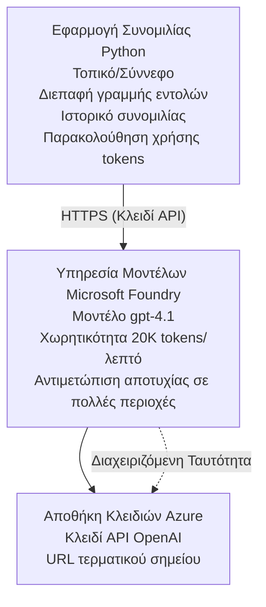

# Εφαρμογή Συνομιλίας Microsoft Foundry Models

**Learning Path:** Ενδιάμεσο ⭐⭐ | **Time:** 35-45 λεπτά | **Cost:** $50-200/μήνα

Μια πλήρης εφαρμογή συνομιλίας Microsoft Foundry Models αναπτυγμένη χρησιμοποιώντας το Azure Developer CLI (azd). Αυτό το παράδειγμα δείχνει την ανάπτυξη gpt-4.1, την ασφαλή πρόσβαση στο API και ένα απλό περιβάλλον συνομιλίας.

## 🎯 Τι θα μάθετε

- Αναπτύξτε την υπηρεσία Microsoft Foundry Models με το μοντέλο gpt-4.1
- Ασφαλίστε τα κλειδιά OpenAI API με το Key Vault
- Δημιουργήστε ένα απλό περιβάλλον συνομιλίας με Python
- Παρακολουθήστε τη χρήση token και τα κόστη
- Υλοποιήστε περιορισμό ρυθμού (rate limiting) και χειρισμό σφαλμάτων

## 📦 Τι περιλαμβάνεται

✅ **Microsoft Foundry Models Service** - ανάπτυξη μοντέλου gpt-4.1  
✅ **Python Chat App** - Απλό περιβάλλον συνομιλίας γραμμής εντολών  
✅ **Key Vault Integration** - Ασφαλής αποθήκευση κλειδιών API  
✅ **ARM Templates** - Πλήρης υποδομή ως κώδικας  
✅ **Cost Monitoring** - Παρακολούθηση χρήσης token  
✅ **Rate Limiting** - Αποφυγή εξάντλησης ποσοστώσεων  

## Architecture



## Προαπαιτούμενα

### Απαιτείται

- **Azure Developer CLI (azd)** - [Οδηγός εγκατάστασης](https://learn.microsoft.com/azure/developer/azure-developer-cli/install-azd)
- **Συνδρομή Azure** with OpenAI access - [Request access](https://aka.ms/oai/access)
- **Python 3.9+** - [Εγκαταστήστε Python](https://www.python.org/downloads/)

### Επαληθεύστε τα προαπαιτούμενα

```bash
# Έλεγχος έκδοσης azd (απαιτείται 1.5.0 ή νεότερη)
azd version

# Επαλήθευση σύνδεσης στο Azure
azd auth login

# Έλεγχος έκδοσης Python
python --version  # ή python3 --version

# Επαλήθευση πρόσβασης στο OpenAI (ελέγξτε στο Azure Portal)
az cognitiveservices account list-skus \
  --kind OpenAI \
  --location eastus
```

> **⚠️ Σημαντικό:** Microsoft Foundry Models requires application approval. If you haven't applied, visit [aka.ms/oai/access](https://aka.ms/oai/access). Approval typically takes 1-2 business days.

## ⏱️ Χρονοδιάγραμμα ανάπτυξης

| Φάση | Διάρκεια | Τι συμβαίνει |
|-------|----------|--------------|
| Έλεγχος προαπαιτούμενων | 2-3 λεπτά | Επαλήθευση διαθέσιμης ποσόστωσης OpenAI |
| Ανάπτυξη υποδομής | 8-12 λεπτά | Δημιουργία OpenAI, Key Vault, ανάπτυξη μοντέλου |
| Διαμόρφωση εφαρμογής | 2-3 λεπτά | Διαμόρφωση περιβάλλοντος και εξαρτήσεων |
| **Σύνολο** | **12-18 λεπτά** | Έτοιμο για συνομιλία με gpt-4.1 |

**Σημείωση:** Η πρώτη ανάπτυξη OpenAI ενδέχεται να διαρκέσει περισσότερο λόγω προμήθειας μοντέλου.

## Γρήγορη Εκκίνηση

```bash
# Μεταβείτε στο παράδειγμα
cd examples/azure-openai-chat

# Αρχικοποιήστε το περιβάλλον
azd env new myopenai

# Αναπτύξτε τα πάντα (υποδομή + διαμόρφωση)
azd up
# Θα σας ζητηθεί να:
# 1. Επιλέξτε συνδρομή Azure
# 2. Επιλέξτε τοποθεσία όπου είναι διαθέσιμο το OpenAI (π.χ., eastus, eastus2, westus)
# 3. Περιμένετε 12-18 λεπτά για την ανάπτυξη

# Εγκαταστήστε τις εξαρτήσεις Python
pip install -r requirements.txt

# Ξεκινήστε τη συνομιλία!
python chat.py
```

**Αναμενόμενο αποτέλεσμα:**
```
🤖 Microsoft Foundry Models Chat Application
Connected to: gpt-4.1 (eastus)
Type your message (or 'quit' to exit)

You: Hello! Tell me about Microsoft Foundry Models.
Assistant: Microsoft Foundry Models Service provides REST API access to OpenAI's powerful language models including gpt-4.1, GPT-3.5-Turbo, and Embeddings...

[Tokens used: 145 | Estimated cost: $0.0044]
```

## ✅ Επαληθεύστε την ανάπτυξη

### Βήμα 1: Ελέγξτε τους πόρους Azure

```bash
# Προβολή αναπτυγμένων πόρων
azd show

# Το αναμενόμενο αποτέλεσμα εμφανίζει:
# - Υπηρεσία OpenAI: (όνομα πόρου)
# - Αποθήκη Κλειδιών: (όνομα πόρου)
# - Ανάπτυξη: gpt-4.1
# - Τοποθεσία: eastus (ή η επιλεγμένη περιοχή σας)
```

### Βήμα 2: Δοκιμάστε το OpenAI API

```bash
# Λάβετε το endpoint και το κλειδί του OpenAI
OPENAI_ENDPOINT=$(azd env get-value AZURE_OPENAI_ENDPOINT)
OPENAI_KEY=$(azd env get-value AZURE_OPENAI_API_KEY)

# Δοκιμή κλήσης API
curl "$OPENAI_ENDPOINT/openai/deployments/gpt-4.1/chat/completions?api-version=2024-08-01-preview" \
  -H "Content-Type: application/json" \
  -H "api-key: $OPENAI_KEY" \
  -d '{
    "messages": [{"role": "user", "content": "Say hello!"}],
    "max_tokens": 50
  }'
```

**Αναμενόμενη απάντηση:**
```json
{
  "choices": [
    {
      "message": {
        "role": "assistant",
        "content": "Hello! How can I assist you today?"
      }
    }
  ],
  "usage": {
    "prompt_tokens": 8,
    "completion_tokens": 9,
    "total_tokens": 17
  }
}
```

### Βήμα 3: Επαληθεύστε την πρόσβαση στο Key Vault

```bash
# Απαρίθμηση μυστικών στο Key Vault
KV_NAME=$(azd env get-value AZURE_KEY_VAULT_NAME)

az keyvault secret list \
  --vault-name $KV_NAME \
  --query "[].name" \
  --output table
```

**Αναμενόμενα μυστικά:**
- `openai-api-key`
- `openai-endpoint`

**Κριτήρια επιτυχίας:**
- ✅ Η υπηρεσία OpenAI αναπτύχθηκε με gpt-4.1
- ✅ Η κλήση API επιστρέφει έγκυρη συμπλήρωση
- ✅ Τα μυστικά αποθηκεύτηκαν στο Key Vault
- ✅ Η παρακολούθηση χρήσης token λειτουργεί

## Δομή έργου

```
azure-openai-chat/
├── README.md                   ✅ This guide
├── azure.yaml                  ✅ AZD configuration
├── infra/                      ✅ Infrastructure as Code
│   ├── main.bicep             ✅ Main Bicep template
│   ├── main.parameters.json   ✅ Parameters
│   └── openai.bicep           ✅ OpenAI resource definition
├── src/                        ✅ Application code
│   ├── chat.py                ✅ Chat interface
│   ├── config.py              ✅ Configuration loader
│   └── requirements.txt       ✅ Python dependencies
└── .gitignore                  ✅ Git ignore rules
```

## Χαρακτηριστικά εφαρμογής

### Περιβάλλον συνομιλίας (`chat.py`)

Η εφαρμογή συνομιλίας περιλαμβάνει:

- **Ιστορικό συνομιλίας** - Διατηρεί το πλαίσιο μεταξύ μηνυμάτων
- **Αρίθμηση token** - Παρακολουθεί τη χρήση και εκτιμά τα κόστη
- **Χειρισμός σφαλμάτων** - Ομαλός χειρισμός περιορισμών ρυθμού και σφαλμάτων API
- **Εκτίμηση κόστους** - Υπολογισμός κόστους σε πραγματικό χρόνο ανά μήνυμα
- **Υποστήριξη streaming** - Προαιρετικές ροές απαντήσεων

### Εντολές

Κατά τη συνομιλία, μπορείτε να χρησιμοποιήσετε:
- `quit` ή `exit` - Τερματίστε τη συνεδρία
- `clear` - Διαγράψτε το ιστορικό συνομιλίας
- `tokens` - Δείξτε τη συνολική χρήση token
- `cost` - Δείξτε το εκτιμώμενο συνολικό κόστος

### Διαμόρφωση (`config.py`)

Φορτώνει τη διαμόρφωση από μεταβλητές περιβάλλοντος:
```python
AZURE_OPENAI_ENDPOINT  # Από το Key Vault
AZURE_OPENAI_API_KEY   # Από το Key Vault
AZURE_OPENAI_MODEL     # Προεπιλογή: gpt-4.1
AZURE_OPENAI_MAX_TOKENS # Προεπιλογή: 800
```

## Παραδείγματα χρήσης

### Βασική συνομιλία

```bash
python chat.py
```

### Συνομιλία με προσαρμοσμένο μοντέλο

```bash
export AZURE_OPENAI_MODEL=gpt-35-turbo
python chat.py
```

### Συνομιλία με streaming

```bash
python chat.py --stream
```

### Παράδειγμα συνομιλίας

```
You: Explain Microsoft Foundry Models Service in 3 sentences.
Assistant: Microsoft Foundry Models Service is Microsoft Azure's cloud platform offering 
that provides access to OpenAI's powerful language models. It enables developers 
to integrate capabilities like gpt-4.1 into their applications with enterprise-grade 
security and compliance. The service includes features for content filtering, 
abuse monitoring, and responsible AI practices.

[Tokens used: 89 | Estimated cost: $0.0027]

You: What models are available?
Assistant: Microsoft Foundry Models Service offers several model families including gpt-4.1 
(most capable), GPT-3.5-Turbo (faster and cost-effective), and Embeddings models 
for vector search. Each model has different capabilities, pricing, and token limits.

[Tokens used: 67 | Estimated cost: $0.0020]

Total session: 156 tokens | $0.0047
```

## Διαχείριση κόστους

### Τιμολόγηση token (gpt-4.1)

| Μοντέλο | Είσοδος (ανά 1K tokens) | Έξοδος (ανά 1K tokens) |
|-------|----------------------|------------------------|
| gpt-4.1 | $0.03 | $0.06 |
| GPT-3.5-Turbo | $0.0015 | $0.002 |

### Εκτιμώμενο μηνιαίο κόστος

Βασισμένο σε πρότυπα χρήσης:

| Επίπεδο χρήσης | Μηνύματα/ημέρα | Tokens/ημέρα | Μηνιαίο κόστος |
|-------------|--------------|------------|--------------|
| **Ελαφρύ** | 20 μηνύματα | 3,000 tokens | $3-5 |
| **Μέτριο** | 100 μηνύματα | 15,000 tokens | $15-25 |
| **Εντατικό** | 500 μηνύματα | 75,000 tokens | $75-125 |

**Βασικό κόστος υποδομής:** $1-2/μήνα (Key Vault + ελάχιστη υπολογιστική ισχύ)

### Συμβουλές βελτιστοποίησης κόστους

```bash
# 1. Χρησιμοποιήστε το GPT-3.5-Turbo για απλούστερες εργασίες (20 φορές φθηνότερο)
export AZURE_OPENAI_MODEL=gpt-35-turbo

# 2. Μειώστε τα μέγιστα tokens για συντομότερες απαντήσεις
export AZURE_OPENAI_MAX_TOKENS=400

# 3. Παρακολουθήστε τη χρήση των tokens
python chat.py --show-tokens

# 4. Ρυθμίστε ειδοποιήσεις προϋπολογισμού
az consumption budget create \
  --budget-name "openai-budget" \
  --amount 50 \
  --time-grain Monthly
```

## Παρακολούθηση

### Προβολή χρήσης token

```bash
# Στο Azure Portal:
# Πόρος OpenAI → Μετρικές → Επιλέξτε "Συναλλαγή Διακριτικού"

# Ή μέσω Azure CLI:
az monitor metrics list \
  --resource $(azd env get-value AZURE_OPENAI_RESOURCE_ID) \
  --metric "TokenTransaction" \
  --start-time $(date -u -d '1 hour ago' '+%Y-%m-%dT%H:%M:%S') \
  --interval PT1M
```

### Προβολή καταγραφών API

```bash
# Ροή διαγνωστικών καταγραφών
az monitor diagnostic-settings create \
  --resource $(azd env get-value AZURE_OPENAI_RESOURCE_ID) \
  --name openai-logs \
  --logs '[{"category": "Audit", "enabled": true}]' \
  --workspace $(azd env get-value LOG_ANALYTICS_WORKSPACE_ID)

# Καταγραφές ερωτημάτων
az monitor log-analytics query \
  --workspace $(azd env get-value LOG_ANALYTICS_WORKSPACE_ID) \
  --analytics-query "AzureDiagnostics | where Category == 'Audit' | top 10 by TimeGenerated"
```

## Αντιμετώπιση προβλημάτων

### Πρόβλημα: "Access Denied" Error

**Συμπτώματα:** 403 Forbidden κατά την κλήση του API

**Λύσεις:**
```bash
# 1. Επιβεβαιώστε ότι η πρόσβαση στο OpenAI έχει εγκριθεί
az cognitiveservices account show \
  --name $(azd env get-value AZURE_OPENAI_NAME) \
  --resource-group $(azd env get-value AZURE_RESOURCE_GROUP)

# 2. Ελέγξτε ότι το κλειδί API είναι σωστό
azd env get-value AZURE_OPENAI_API_KEY

# 3. Επαληθεύστε τη μορφή του URL του endpoint
azd env get-value AZURE_OPENAI_ENDPOINT
# Πρέπει να είναι: https://[name].openai.azure.com/
```

### Πρόβλημα: "Rate Limit Exceeded"

**Συμπτώματα:** 429 Too Many Requests

**Λύσεις:**
```bash
# 1. Ελέγξτε το τρέχον όριο
az cognitiveservices account deployment show \
  --name $(azd env get-value AZURE_OPENAI_NAME) \
  --resource-group $(azd env get-value AZURE_RESOURCE_GROUP) \
  --deployment-name gpt-4.1

# 2. Ζητήστε αύξηση ορίου (εάν χρειάζεται)
# Μεταβείτε στο Azure Portal → Πόρος OpenAI → Όρια → Ζητήστε Αύξηση

# 3. Υλοποιήστε λογική επαναπροσπάθειας (ήδη στο chat.py)
# Η εφαρμογή επαναπροσπαθεί αυτόματα με εκθετική αύξηση του χρόνου αναμονής
```

### Πρόβλημα: "Model Not Found"

**Συμπτώματα:** Σφάλμα 404 για την ανάπτυξη

**Λύσεις:**
```bash
# 1. Λίστα διαθέσιμων αναπτύξεων
az cognitiveservices account deployment list \
  --name $(azd env get-value AZURE_OPENAI_NAME) \
  --resource-group $(azd env get-value AZURE_RESOURCE_GROUP)

# 2. Επαληθεύστε το όνομα του μοντέλου στο περιβάλλον
echo $AZURE_OPENAI_MODEL

# 3. Ενημερώστε με το σωστό όνομα ανάπτυξης
export AZURE_OPENAI_MODEL=gpt-4.1  # ή gpt-35-turbo
```

### Πρόβλημα: Υψηλή καθυστέρηση

**Συμπτώματα:** Αργοί χρόνοι απόκρισης (>5 δευτερόλεπτα)

**Λύσεις:**
```bash
# 1. Ελέγξτε την καθυστέρηση ανά περιοχή
# Αναπτύξτε στην περιοχή που είναι πιο κοντά στους χρήστες

# 2. Μειώστε το max_tokens για γρηγορότερες απαντήσεις
export AZURE_OPENAI_MAX_TOKENS=400

# 3. Χρησιμοποιήστε streaming για καλύτερη εμπειρία χρήστη
python chat.py --stream
```

## Καλές πρακτικές ασφάλειας

### 1. Προστατέψτε τα κλειδιά API

```bash
# Μην αποθηκεύετε ποτέ τα κλειδιά στο σύστημα ελέγχου έκδοσης
# Χρησιμοποιήστε το Key Vault (ήδη διαμορφωμένο)

# Ανανεώστε τακτικά τα κλειδιά
az cognitiveservices account keys regenerate \
  --name $(azd env get-value AZURE_OPENAI_NAME) \
  --resource-group $(azd env get-value AZURE_RESOURCE_GROUP) \
  --key-name key1
```

### 2. Εφαρμόστε φιλτράρισμα περιεχομένου

```python
# Τα Microsoft Foundry Models περιλαμβάνουν ενσωματωμένο φιλτράρισμα περιεχομένου
# Ρυθμίστε στο Azure Portal:
# OpenAI πόρος → Φίλτρα περιεχομένου → Δημιουργία προσαρμοσμένου φίλτρου

# Κατηγορίες: Μίσος, Σεξουαλικό περιεχόμενο, Βία, Αυτο-βλάβη
# Επίπεδα: Χαμηλό, Μεσαίο, Υψηλό φιλτράρισμα
```

### 3. Χρησιμοποιήστε Managed Identity (Παραγωγή)

```bash
# Για παραγωγικές αναπτύξεις, χρησιμοποιήστε διαχειριζόμενη ταυτότητα
# αντί για κλειδιά API (απαιτείται φιλοξενία της εφαρμογής στο Azure)

# Ενημερώστε το infra/openai.bicep ώστε να περιλαμβάνει:
# identity: { type: 'SystemAssigned' }
```

## Ανάπτυξη

### Εκτέλεση τοπικά

```bash
# Εγκαταστήστε τις εξαρτήσεις
pip install -r src/requirements.txt

# Ορίστε τις μεταβλητές περιβάλλοντος
export AZURE_OPENAI_ENDPOINT="https://[name].openai.azure.com/"
export AZURE_OPENAI_API_KEY="your-api-key"
export AZURE_OPENAI_MODEL="gpt-4.1"

# Εκτελέστε την εφαρμογή
python src/chat.py
```

### Εκτέλεση δοκιμών

```bash
# Εγκαταστήστε τις εξαρτήσεις των δοκιμών
pip install pytest pytest-cov

# Εκτελέστε τις δοκιμές
pytest tests/ -v

# Με κάλυψη
pytest tests/ --cov=src --cov-report=html
```

### Ενημέρωση ανάπτυξης μοντέλου

```bash
# Αναπτύξτε διαφορετική έκδοση του μοντέλου
az cognitiveservices account deployment create \
  --name $(azd env get-value AZURE_OPENAI_NAME) \
  --resource-group $(azd env get-value AZURE_RESOURCE_GROUP) \
  --deployment-name gpt-35-turbo \
  --model-name gpt-35-turbo \
  --model-version "0613" \
  --model-format OpenAI \
  --sku-capacity 20 \
  --sku-name "Standard"
```

## Καθαρισμός

```bash
# Διαγράψτε όλους τους πόρους του Azure
azd down --force --purge

# Αυτό αφαιρεί:
# - Υπηρεσία OpenAI
# - Key Vault (με 90ήμερη μαλακή διαγραφή)
# - Ομάδα πόρων
# - Όλες οι αναπτύξεις και διαμορφώσεις
```

## Επόμενα βήματα

### Επεκτείνετε αυτό το παράδειγμα

1. **Προσθέστε διεπαφή Web** - Δημιουργήστε frontend με React/Vue
   ```bash
   # Προσθέστε την υπηρεσία frontend στο azure.yaml
   # Αναπτύξτε σε Azure Static Web Apps
   ```

2. **Εφαρμόστε RAG** - Προσθέστε αναζήτηση εγγράφων με Azure AI Search
   ```python
   # Ενσωματώστε το Azure AI Search
   # Μεταφορτώστε έγγραφα και δημιουργήστε ευρετήριο διανυσμάτων
   ```

3. **Προσθέστε Function Calling** - Ενεργοποιήστε τη χρήση εργαλείων
   ```python
   # Ορίστε συναρτήσεις στο chat.py
   # Επιτρέψτε στο gpt-4.1 να καλεί εξωτερικά APIs
   ```

4. **Υποστήριξη πολλαπλών μοντέλων** - Αναπτύξτε πολλαπλά μοντέλα
   ```bash
   # Προσθέστε τα μοντέλα gpt-35-turbo και embeddings
   # Υλοποιήστε τη λογική δρομολόγησης μοντέλων
   ```

### Σχετικά παραδείγματα

- **[Retail Multi-Agent](../retail-scenario.md)** - Προηγμένη αρχιτεκτονική πολλαπλών πρακτόρων
- **[Database App](../../../../examples/database-app)** - Προσθέστε μόνιμη αποθήκευση
- **[Container Apps](../../../../examples/container-app)** - Αναπτύξτε ως υπηρεσία σε κοντέινερ

### Πόροι μάθησης

- 📚 [Μάθημα AZD για αρχάριους](../../README.md) - Κύρια σελίδα μαθήματος
- 📚 [Τεκμηρίωση Microsoft Foundry Models](https://learn.microsoft.com/azure/ai-services/openai/) - Επίσημη τεκμηρίωση
- 📚 [Αναφορά OpenAI API](https://platform.openai.com/docs/api-reference) - Λεπτομέρειες API
- 📚 [Υπεύθυνη AI](https://www.microsoft.com/ai/responsible-ai) - Καλές πρακτικές

## Πρόσθετοι πόροι

### Τεκμηρίωση
- **[Microsoft Foundry Models Service](https://learn.microsoft.com/azure/ai-services/openai/)** - Πλήρης οδηγός
- **[gpt-4.1 Models](https://learn.microsoft.com/azure/ai-services/openai/concepts/models)** - Δυνατότητες μοντέλου
- **[Content Filtering](https://learn.microsoft.com/azure/ai-services/openai/concepts/content-filter)** - Λειτουργίες ασφάλειας
- **[Azure Developer CLI](https://learn.microsoft.com/azure/developer/azure-developer-cli/)** - αναφορά azd

### Σεμινάρια
- **[OpenAI Quickstart](https://learn.microsoft.com/azure/ai-services/openai/quickstart)** - Πρώτη ανάπτυξη
- **[Chat Completions](https://learn.microsoft.com/azure/ai-services/openai/how-to/chatgpt)** - Δημιουργία εφαρμογών συνομιλίας
- **[Function Calling](https://learn.microsoft.com/azure/ai-services/openai/how-to/function-calling)** - Προηγμένα χαρακτηριστικά

### Εργαλεία
- **[Microsoft Foundry Models Studio](https://oai.azure.com/)** - Διαδικτυακό περιβάλλον εργασίας
- **[Prompt Engineering Guide](https://platform.openai.com/docs/guides/prompt-engineering)** - Συγγραφή καλύτερων προτροπών
- **[Token Calculator](https://platform.openai.com/tokenizer)** - Εκτίμηση χρήσης token

### Κοινότητα
- **[Azure AI Discord](https://discord.gg/azure)** - Λάβετε βοήθεια από την κοινότητα
- **[GitHub Discussions](https://github.com/Azure-Samples/openai/discussions)** - Φόρουμ ερωτήσεων & απαντήσεων
- **[Azure Blog](https://azure.microsoft.com/blog/tag/azure-openai-service/)** - Τελευταίες ενημερώσεις

---

**🎉 Επιτυχία!** Έχετε αναπτύξει τα Microsoft Foundry Models και δημιουργήσει μια λειτουργική εφαρμογή συνομιλίας. Ξεκινήστε να εξερευνάτε τις δυνατότητες του gpt-4.1 και πειραματιστείτε με διαφορετικές προτροπές και σενάρια χρήσης.

**Ερωτήσεις;** [Ανοίξτε ένα θέμα](https://github.com/microsoft/AZD-for-beginners/issues) ή ελέγξτε τις [Συχνές Ερωτήσεις](../../resources/faq.md)

**Προειδοποίηση κόστους:** Θυμηθείτε να εκτελέσετε `azd down` όταν τελειώσετε τη δοκιμή για να αποφύγετε συνεχιζόμενες χρεώσεις (~$50-100/μήνα για ενεργή χρήση).

---

<!-- CO-OP TRANSLATOR DISCLAIMER START -->
**Αποποίηση ευθυνών**:
Αυτό το έγγραφο έχει μεταφραστεί χρησιμοποιώντας την υπηρεσία μετάφρασης με τεχνητή νοημοσύνη [Co-op Translator](https://github.com/Azure/co-op-translator). Ενώ επιδιώκουμε την ακρίβεια, παρακαλούμε να έχετε υπόψη ότι οι αυτοματοποιημένες μεταφράσεις ενδέχεται να περιέχουν λάθη ή ανακρίβειες. Το πρωτότυπο έγγραφο στη μητρική του γλώσσα πρέπει να θεωρείται η αυθεντική πηγή. Για κρίσιμες πληροφορίες, συνιστάται επαγγελματική ανθρώπινη μετάφραση. Δεν φέρουμε ευθύνη για τυχόν παρεξηγήσεις ή λανθασμένες ερμηνείες που προκύπτουν από τη χρήση αυτής της μετάφρασης.
<!-- CO-OP TRANSLATOR DISCLAIMER END -->