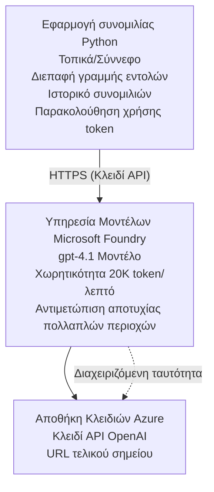

# Microsoft Foundry Models Chat Application

**Learning Path:** Intermediate ⭐⭐ | **Time:** 35-45 minutes | **Cost:** $50-200/month

Μια πλήρης εφαρμογή συνομιλίας Microsoft Foundry Models αναπτυγμένη χρησιμοποιώντας το Azure Developer CLI (azd). Αυτό το παράδειγμα δείχνει την ανάπτυξη gpt-4.1, την ασφαλή πρόσβαση στο API και μια απλή διεπαφή συνομιλίας.

## 🎯 Τι θα μάθετε

- Ανάπτυξη της υπηρεσίας Microsoft Foundry Models με το μοντέλο gpt-4.1
- Ασφάλεια κλειδιών OpenAI με Key Vault
- Δημιουργία απλής διεπαφής συνομιλίας με Python
- Παρακολούθηση χρήσης tokens και κόστους
- Εφαρμογή περιορισμού ρυθμού και διαχείρισης σφαλμάτων

## 📦 Τι περιλαμβάνεται

✅ **Microsoft Foundry Models Service** - ανάπτυξη μοντέλου gpt-4.1  
✅ **Python Chat App** - Απλή διεπαφή συνομιλίας στη γραμμή εντολών  
✅ **Key Vault Integration** - Ασφαλής αποθήκευση κλειδιών API  
✅ **ARM Templates** - Ολοκληρωμένη υποδομή ως κώδικας  
✅ **Cost Monitoring** - Παρακολούθηση χρήσης tokens  
✅ **Rate Limiting** - Πρόληψη εξάντλησης των ποσοστώσεων  

## Architecture


## Προαπαιτούμενα

### Απαιτείται

- **Azure Developer CLI (azd)** - [Install guide](https://learn.microsoft.com/azure/developer/azure-developer-cli/install-azd)
- **Azure subscription** with OpenAI access - [Request access](https://aka.ms/oai/access)
- **Python 3.9+** - [Install Python](https://www.python.org/downloads/)

### Επαλήθευση προαπαιτούμενων

```bash
# Ελέγξτε την έκδοση του azd (απαιτείται 1.5.0 ή νεότερη)
azd version

# Επαληθεύστε τη σύνδεση στο Azure
azd auth login

# Ελέγξτε την έκδοση της Python
python --version  # ή python3 --version

# Επαληθεύστε την πρόσβαση στο OpenAI (ελέγξτε στο Azure Portal)
az cognitiveservices account list-skus \
  --kind OpenAI \
  --location eastus
```

> **⚠️ Σπουδαίο:** Το Microsoft Foundry Models απαιτεί έγκριση αίτησης. Εάν δεν έχετε υποβάλει αίτηση, επισκεφτείτε [aka.ms/oai/access](https://aka.ms/oai/access). Η έγκριση συνήθως διαρκεί 1-2 εργάσιμες ημέρες.

## ⏱️ Χρονοδιάγραμμα ανάπτυξης

| Phase | Duration | What Happens |
|-------|----------|--------------|
| Prerequisites check | 2-3 minutes | Verify OpenAI quota availability |
| Deploy infrastructure | 8-12 minutes | Create OpenAI, Key Vault, model deployment |
| Configure application | 2-3 minutes | Set up environment and dependencies |
| **Total** | **12-18 minutes** | Ready to chat with gpt-4.1 |

**Σημείωση:** Η πρώτη ανάπτυξη OpenAI μπορεί να διαρκέσει περισσότερο λόγω παροχής του μοντέλου.

## Quick Start

```bash
# Μεταβείτε στο παράδειγμα
cd examples/azure-openai-chat

# Αρχικοποιήστε το περιβάλλον
azd env new myopenai

# Αναπτύξτε τα πάντα (υποδομή + διαμόρφωση)
azd up
# Θα σας ζητηθεί να:
# 1. Επιλέξτε τη συνδρομή Azure
# 2. Επιλέξτε τοποθεσία με διαθεσιμότητα OpenAI (π.χ., eastus, eastus2, westus)
# 3. Περιμένετε 12-18 λεπτά για την ανάπτυξη

# Εγκαταστήστε τις εξαρτήσεις Python
pip install -r requirements.txt

# Ξεκινήστε τη συνομιλία!
python chat.py
```

**Expected Output:**
```
🤖 Microsoft Foundry Models Chat Application
Connected to: gpt-4.1 (eastus)
Type your message (or 'quit' to exit)

You: Hello! Tell me about Microsoft Foundry Models.
Assistant: Microsoft Foundry Models Service provides REST API access to OpenAI's powerful language models including gpt-4.1, GPT-3.5-Turbo, and Embeddings...

[Tokens used: 145 | Estimated cost: $0.0044]
```

## ✅ Επαλήθευση Ανάπτυξης

### Βήμα 1: Έλεγχος πόρων Azure

```bash
# Προβολή αναπτυγμένων πόρων
azd show

# Η αναμενόμενη έξοδος εμφανίζει:
# - Υπηρεσία OpenAI: (όνομα πόρου)
# - Αποθήκη κλειδιών: (όνομα πόρου)
# - Ανάπτυξη: gpt-4.1
# - Τοποθεσία: eastus (ή την επιλεγμένη περιοχή σας)
```

### Βήμα 2: Δοκιμή του OpenAI API

```bash
# Λήψη του endpoint και του κλειδιού του OpenAI
OPENAI_ENDPOINT=$(azd env get-value AZURE_OPENAI_ENDPOINT)
OPENAI_KEY=$(azd env get-value AZURE_OPENAI_API_KEY)

# Δοκιμή κλήσης του API
curl "$OPENAI_ENDPOINT/openai/deployments/gpt-4.1/chat/completions?api-version=2024-08-01-preview" \
  -H "Content-Type: application/json" \
  -H "api-key: $OPENAI_KEY" \
  -d '{
    "messages": [{"role": "user", "content": "Say hello!"}],
    "max_tokens": 50
  }'
```

**Αναμενόμενη Απάντηση:**
```json
{
  "choices": [
    {
      "message": {
        "role": "assistant",
        "content": "Hello! How can I assist you today?"
      }
    }
  ],
  "usage": {
    "prompt_tokens": 8,
    "completion_tokens": 9,
    "total_tokens": 17
  }
}
```

### Βήμα 3: Επαλήθευση πρόσβασης στο Key Vault

```bash
# Απαρίθμηση μυστικών στο Key Vault
KV_NAME=$(azd env get-value AZURE_KEY_VAULT_NAME)

az keyvault secret list \
  --vault-name $KV_NAME \
  --query "[].name" \
  --output table
```

**Αναμενόμενα μυστικά:**
- `openai-api-key`
- `openai-endpoint`

**Κριτήρια Επιτυχίας:**
- ✅ Η υπηρεσία OpenAI αναπτύχθηκε με gpt-4.1
- ✅ Η κλήση API επιστρέφει έγκυρο completion
- ✅ Τα μυστικά αποθηκεύονται στο Key Vault
- ✅ Η παρακολούθηση χρήσης tokens λειτουργεί

## Δομή Έργου

```
azure-openai-chat/
├── README.md                   ✅ This guide
├── azure.yaml                  ✅ AZD configuration
├── infra/                      ✅ Infrastructure as Code
│   ├── main.bicep             ✅ Main Bicep template
│   ├── main.parameters.json   ✅ Parameters
│   └── openai.bicep           ✅ OpenAI resource definition
├── src/                        ✅ Application code
│   ├── chat.py                ✅ Chat interface
│   ├── config.py              ✅ Configuration loader
│   └── requirements.txt       ✅ Python dependencies
└── .gitignore                  ✅ Git ignore rules
```

## Χαρακτηριστικά Εφαρμογής

### Διεπαφή συνομιλίας (`chat.py`)

Η εφαρμογή συνομιλίας περιλαμβάνει:

- **Ιστορικό συνομιλίας** - Διατηρεί το πλαίσιο ανάμεσα σε μηνύματα
- **Μέτρηση tokens** - Παρακολουθεί τη χρήση και εκτιμά το κόστος
- **Διαχείριση σφαλμάτων** - Ομαλή διαχείριση ορίων ρυθμού και σφαλμάτων API
- **Εκτίμηση κόστους** - Υπολογισμός κόστους ανά μήνυμα σε πραγματικό χρόνο
- **Υποστήριξη ροής** - Προαιρετικές απαντήσεις σε ροή

### Εντολές

Κατά τη συνομιλία, μπορείτε να χρησιμοποιήσετε:
- `quit` or `exit` - End the session
- `clear` - Clear conversation history
- `tokens` - Show total token usage
- `cost` - Show estimated total cost

### Ρυθμίσεις (`config.py`)

Φορτώνει ρυθμίσεις από μεταβλητές περιβάλλοντος:
```python
AZURE_OPENAI_ENDPOINT  # Από το Key Vault
AZURE_OPENAI_API_KEY   # Από το Key Vault
AZURE_OPENAI_MODEL     # Προεπιλογή: gpt-4.1
AZURE_OPENAI_MAX_TOKENS # Προεπιλογή: 800
```

## Παραδείγματα χρήσης

### Βασική συνομιλία

```bash
python chat.py
```

### Συνομιλία με προσαρμοσμένο μοντέλο

```bash
export AZURE_OPENAI_MODEL=gpt-35-turbo
python chat.py
```

### Συνομιλία με ροή

```bash
python chat.py --stream
```

### Παράδειγμα συνομιλίας

```
You: Explain Microsoft Foundry Models Service in 3 sentences.
Assistant: Microsoft Foundry Models Service is Microsoft Azure's cloud platform offering 
that provides access to OpenAI's powerful language models. It enables developers 
to integrate capabilities like gpt-4.1 into their applications with enterprise-grade 
security and compliance. The service includes features for content filtering, 
abuse monitoring, and responsible AI practices.

[Tokens used: 89 | Estimated cost: $0.0027]

You: What models are available?
Assistant: Microsoft Foundry Models Service offers several model families including gpt-4.1 
(most capable), GPT-3.5-Turbo (faster and cost-effective), and Embeddings models 
for vector search. Each model has different capabilities, pricing, and token limits.

[Tokens used: 67 | Estimated cost: $0.0020]

Total session: 156 tokens | $0.0047
```

## Διαχείριση Κόστους

### Τιμολόγηση tokens (gpt-4.1)

| Model | Input (per 1K tokens) | Output (per 1K tokens) |
|-------|----------------------|------------------------|
| gpt-4.1 | $0.03 | $0.06 |
| GPT-3.5-Turbo | $0.0015 | $0.002 |

### Εκτιμώμενο Μηνιαίο Κόστος

Βασισμένο σε μοτίβα χρήσης:

| Usage Level | Messages/Day | Tokens/Day | Monthly Cost |
|-------------|--------------|------------|--------------|
| **Light** | 20 messages | 3,000 tokens | $3-5 |
| **Moderate** | 100 messages | 15,000 tokens | $15-25 |
| **Heavy** | 500 messages | 75,000 tokens | $75-125 |

**Βασικό κόστος υποδομής:** $1-2/month (Key Vault + minimal compute)

### Συμβουλές βελτιστοποίησης κόστους

```bash
# 1. Χρησιμοποιήστε το GPT-3.5-Turbo για απλούστερες εργασίες (20 φορές πιο φθηνό)
export AZURE_OPENAI_MODEL=gpt-35-turbo

# 2. Μειώστε τον μέγιστο αριθμό tokens για πιο σύντομες απαντήσεις
export AZURE_OPENAI_MAX_TOKENS=400

# 3. Παρακολουθήστε τη χρήση των tokens
python chat.py --show-tokens

# 4. Ρυθμίστε ειδοποιήσεις προϋπολογισμού
az consumption budget create \
  --budget-name "openai-budget" \
  --amount 50 \
  --time-grain Monthly
```

## Παρακολούθηση

### Προβολή χρήσης tokens

```bash
# Στο Azure Portal:
# OpenAI Resource → Metrics → Επιλέξτε "Token Transaction"

# Ή μέσω του Azure CLI:
az monitor metrics list \
  --resource $(azd env get-value AZURE_OPENAI_RESOURCE_ID) \
  --metric "TokenTransaction" \
  --start-time $(date -u -d '1 hour ago' '+%Y-%m-%dT%H:%M:%S') \
  --interval PT1M
```

### Προβολή καταγραφών API

```bash
# Ροή διαγνωστικών καταγραφών
az monitor diagnostic-settings create \
  --resource $(azd env get-value AZURE_OPENAI_RESOURCE_ID) \
  --name openai-logs \
  --logs '[{"category": "Audit", "enabled": true}]' \
  --workspace $(azd env get-value LOG_ANALYTICS_WORKSPACE_ID)

# Καταγραφές ερωτημάτων
az monitor log-analytics query \
  --workspace $(azd env get-value LOG_ANALYTICS_WORKSPACE_ID) \
  --analytics-query "AzureDiagnostics | where Category == 'Audit' | top 10 by TimeGenerated"
```

## Αντιμετώπιση προβλημάτων

### Πρόβλημα: "Access Denied" Error

**Συμπτώματα:** 403 Forbidden κατά την κλήση του API

**Λύσεις:**
```bash
# 1. Επαληθεύστε ότι η πρόσβαση στο OpenAI έχει εγκριθεί
az cognitiveservices account show \
  --name $(azd env get-value AZURE_OPENAI_NAME) \
  --resource-group $(azd env get-value AZURE_RESOURCE_GROUP)

# 2. Ελέγξτε ότι το κλειδί API είναι σωστό
azd env get-value AZURE_OPENAI_API_KEY

# 3. Επαληθεύστε τη μορφή του URL του endpoint
azd env get-value AZURE_OPENAI_ENDPOINT
# Πρέπει να είναι: https://[name].openai.azure.com/
```

### Πρόβλημα: "Rate Limit Exceeded"

**Συμπτώματα:** 429 Too Many Requests

**Λύσεις:**
```bash
# 1. Ελέγξτε το τρέχον όριο
az cognitiveservices account deployment show \
  --name $(azd env get-value AZURE_OPENAI_NAME) \
  --resource-group $(azd env get-value AZURE_RESOURCE_GROUP) \
  --deployment-name gpt-4.1

# 2. Ζητήστε αύξηση ορίου (εάν χρειάζεται)
# Μεταβείτε στο Azure Portal → Πόρος OpenAI → Όρια → Ζητήστε Αύξηση

# 3. Εφαρμόστε λογική επαναπροσπάθειας (ήδη στο chat.py)
# Η εφαρμογή επαναπροσπαθεί αυτόματα με εκθετική αύξηση του διαστήματος αναμονής
```

### Πρόβλημα: "Model Not Found"

**Συμπτώματα:** Σφάλμα 404 για την ανάπτυξη

**Λύσεις:**
```bash
# 1. Εμφανίστε τις διαθέσιμες αναπτύξεις
az cognitiveservices account deployment list \
  --name $(azd env get-value AZURE_OPENAI_NAME) \
  --resource-group $(azd env get-value AZURE_RESOURCE_GROUP)

# 2. Επαληθεύστε το όνομα του μοντέλου στο περιβάλλον
echo $AZURE_OPENAI_MODEL

# 3. Αλλάξτε στο σωστό όνομα ανάπτυξης
export AZURE_OPENAI_MODEL=gpt-4.1  # ή gpt-35-turbo
```

### Πρόβλημα: Υψηλή καθυστέρηση

**Συμπτώματα:** Αργές απαντήσεις (>5 δευτερόλεπτα)

**Λύσεις:**
```bash
# 1. Ελέγξτε την καθυστέρηση ανά περιοχή
# Αναπτύξτε στην περιοχή που είναι πιο κοντά στους χρήστες

# 2. Μειώστε το max_tokens για ταχύτερες απαντήσεις
export AZURE_OPENAI_MAX_TOKENS=400

# 3. Χρησιμοποιήστε streaming για καλύτερη εμπειρία χρήστη
python chat.py --stream
```

## Καλές Πρακτικές Ασφαλείας

### 1. Προστατέψτε τα κλειδιά API

```bash
# Μην αποθηκεύετε ποτέ κλειδιά στο σύστημα ελέγχου εκδόσεων
# Χρησιμοποιήστε το Key Vault (έχει ήδη ρυθμιστεί)

# Ανανεώστε τακτικά τα κλειδιά
az cognitiveservices account keys regenerate \
  --name $(azd env get-value AZURE_OPENAI_NAME) \
  --resource-group $(azd env get-value AZURE_RESOURCE_GROUP) \
  --key-name key1
```

### 2. Εφαρμόστε φιλτράρισμα περιεχομένου

```python
# Το Microsoft Foundry Models περιλαμβάνει ενσωματωμένο φιλτράρισμα περιεχομένου
# Διαμορφώστε στο Azure Portal:
# Πόρος OpenAI → Φίλτρα Περιεχομένου → Δημιουργία Προσαρμοσμένου Φίλτρου

# Κατηγορίες: Μίσος, Σεξουαλικό, Βία, Αυτοβλάβη
# Επίπεδα: Χαμηλό, Μεσαίο, Υψηλό φιλτράρισμα
```

### 3. Χρησιμοποιήστε Managed Identity (Production)

```bash
# Για παραγωγικές αναπτύξεις, χρησιμοποιήστε διαχειριζόμενη ταυτότητα
# αντί για κλειδιά API (απαιτεί φιλοξενία εφαρμογής στο Azure)

# Ενημερώστε το infra/openai.bicep ώστε να περιλαμβάνει:
# identity: { type: 'SystemAssigned' }
```

## Ανάπτυξη

### Εκτέλεση τοπικά

```bash
# Εγκαταστήστε τις εξαρτήσεις
pip install -r src/requirements.txt

# Ορίστε τις μεταβλητές περιβάλλοντος
export AZURE_OPENAI_ENDPOINT="https://[name].openai.azure.com/"
export AZURE_OPENAI_API_KEY="your-api-key"
export AZURE_OPENAI_MODEL="gpt-4.1"

# Εκτελέστε την εφαρμογή
python src/chat.py
```

### Εκτέλεση δοκιμών

```bash
# Εγκατάσταση εξαρτήσεων για τις δοκιμές
pip install pytest pytest-cov

# Εκτέλεση δοκιμών
pytest tests/ -v

# Με κάλυψη κώδικα
pytest tests/ --cov=src --cov-report=html
```

### Ενημέρωση ανάπτυξης μοντέλου

```bash
# Αναπτύξτε διαφορετική έκδοση του μοντέλου
az cognitiveservices account deployment create \
  --name $(azd env get-value AZURE_OPENAI_NAME) \
  --resource-group $(azd env get-value AZURE_RESOURCE_GROUP) \
  --deployment-name gpt-35-turbo \
  --model-name gpt-35-turbo \
  --model-version "0613" \
  --model-format OpenAI \
  --sku-capacity 20 \
  --sku-name "Standard"
```

## Καθαρισμός

```bash
# Διαγράψτε όλους τους πόρους του Azure
azd down --force --purge

# Αυτό αφαιρεί:
# - Υπηρεσία OpenAI
# - Key Vault (με 90ήμερη ήπια διαγραφή)
# - Ομάδα πόρων
# - Όλες οι αναπτύξεις και οι διαμορφώσεις
```

## Επόμενα Βήματα

### Επέκταση αυτού του παραδείγματος

1. **Add Web Interface** - Build React/Vue frontend
   ```bash
   # Προσθέστε την υπηρεσία frontend στο azure.yaml
   # Αναπτύξτε σε Azure Static Web Apps
   ```

2. **Implement RAG** - Add document search with Azure AI Search
   ```python
   # Ενσωματώστε το Azure Cognitive Search
   # Ανεβάστε έγγραφα και δημιουργήστε ευρετήριο διανυσμάτων
   ```

3. **Add Function Calling** - Enable tool use
   ```python
   # Ορίστε συναρτήσεις στο chat.py
   # Επιτρέψτε στο gpt-4.1 να καλεί εξωτερικά APIs
   ```

4. **Multi-Model Support** - Deploy multiple models
   ```bash
   # Προσθήκη gpt-35-turbo και μοντέλων ενσωματώσεων
   # Υλοποίηση λογικής δρομολόγησης μοντέλων
   ```

### Σχετικά Παραδείγματα

- **[Retail Multi-Agent](../retail-scenario.md)** - Advanced multi-agent architecture
- **[Database App](../../../../examples/database-app)** - Add persistent storage
- **[Container Apps](../../../../examples/container-app)** - Deploy as containerized service

### Πόροι Μάθησης

- 📚 [AZD For Beginners Course](../../README.md) - Main course home
- 📚 [Microsoft Foundry Models Documentation](https://learn.microsoft.com/azure/ai-services/openai/) - Official docs
- 📚 [OpenAI API Reference](https://platform.openai.com/docs/api-reference) - API details
- 📚 [Responsible AI](https://www.microsoft.com/ai/responsible-ai) - Best practices

## Επιπλέον Πόροι

### Τεκμηρίωση
- **[Microsoft Foundry Models Service](https://learn.microsoft.com/azure/ai-services/openai/)** - Complete guide
- **[gpt-4.1 Models](https://learn.microsoft.com/azure/ai-services/openai/concepts/models)** - Model capabilities
- **[Content Filtering](https://learn.microsoft.com/azure/ai-services/openai/concepts/content-filter)** - Safety features
- **[Azure Developer CLI](https://learn.microsoft.com/azure/developer/azure-developer-cli/)** - azd reference

### Σεμινάρια
- **[OpenAI Quickstart](https://learn.microsoft.com/azure/ai-services/openai/quickstart)** - First deployment
- **[Chat Completions](https://learn.microsoft.com/azure/ai-services/openai/how-to/chatgpt)** - Building chat apps
- **[Function Calling](https://learn.microsoft.com/azure/ai-services/openai/how-to/function-calling)** - Advanced features

### Εργαλεία
- **[Microsoft Foundry Models Studio](https://oai.azure.com/)** - Web-based playground
- **[Prompt Engineering Guide](https://platform.openai.com/docs/guides/prompt-engineering)** - Writing better prompts
- **[Token Calculator](https://platform.openai.com/tokenizer)** - Estimate token usage

### Κοινότητα
- **[Azure AI Discord](https://discord.gg/azure)** - Get help from community
- **[GitHub Discussions](https://github.com/Azure-Samples/openai/discussions)** - Q&A forum
- **[Azure Blog](https://azure.microsoft.com/blog/tag/azure-openai-service/)** - Latest updates

---

**🎉 Επιτυχία!** Έχετε αναπτύξει το Microsoft Foundry Models και δημιουργήσει μια λειτουργική εφαρμογή συνομιλίας. Ξεκινήστε να εξερευνάτε τις δυνατότητες του gpt-4.1 και πειραματιστείτε με διάφορα prompts και περιπτώσεις χρήσης.

**Ερωτήσεις;** [Open an issue](https://github.com/microsoft/AZD-for-beginners/issues) ή δείτε το [FAQ](../../resources/faq.md)

**Ειδοποίηση κόστους:** Θυμηθείτε να εκτελέσετε `azd down` όταν τελειώσετε τις δοκιμές για να αποφύγετε συνεχιζόμενες χρεώσεις (~$50-100/month for active usage).

---

<!-- CO-OP TRANSLATOR DISCLAIMER START -->
Αποποίηση ευθυνών:
Αυτό το έγγραφο έχει μεταφραστεί με χρήση της υπηρεσίας αυτόματης μετάφρασης τεχνητής νοημοσύνης Co-op Translator (https://github.com/Azure/co-op-translator). Παρόλο που καταβάλλουμε προσπάθεια για ακρίβεια, σημειώστε ότι οι αυτοματοποιημένες μεταφράσεις ενδέχεται να περιέχουν σφάλματα ή ανακρίβειες. Το πρωτότυπο έγγραφο στη γλώσσα του πρέπει να θεωρείται η επίσημη πηγή. Για κρίσιμες πληροφορίες συνιστάται επαγγελματική μετάφραση από ανθρώπινο μεταφραστή. Δεν φέρουμε ευθύνη για τυχόν παρεξηγήσεις ή λανθασμένες ερμηνείες που προκύπτουν από τη χρήση αυτής της μετάφρασης.
<!-- CO-OP TRANSLATOR DISCLAIMER END -->