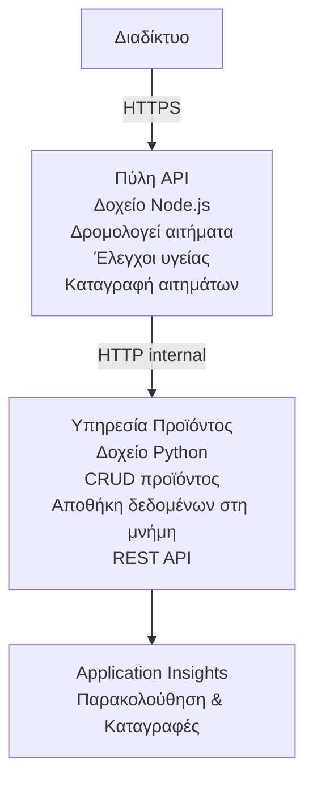

# Αρχιτεκτονική μικροϋπηρεσιών - Παράδειγμα Container App

⏱️ **Εκτιμώμενος Χρόνος**: 25-35 λεπτά | 💰 **Εκτιμώμενο Κόστος**: ~$50-100/μήνα | ⭐ **Πολυπλοκότητα**: Προχωρημένο

Μια **απλουστευμένη αλλά λειτουργική** αρχιτεκτονική μικροϋπηρεσιών αναπτυγμένη σε Azure Container Apps χρησιμοποιώντας το AZD CLI. Αυτό το παράδειγμα δείχνει επικοινωνία υπηρεσίας-προς-υπηρεσία, ορχήστρωση κοντέινερ και παρακολούθηση με μια πρακτική διάταξη 2 υπηρεσιών.

> **📚 Προσέγγιση Μάθησης**: Αυτό το παράδειγμα ξεκινά με μια ελάχιστη αρχιτεκτονική 2 υπηρεσιών (API Gateway + Backend Service) που μπορείτε πραγματικά να αναπτύξετε και να μάθετε. Αφού κατακτήσετε αυτά τα βασικά, παρέχουμε οδηγίες για επέκταση σε ένα πλήρες οικοσύστημα μικροϋπηρεσιών.

## Τι θα Μάθετε

Με την ολοκλήρωση αυτού του παραδείγματος, θα:
- Αναπτύξετε πολλαπλά κοντέινερ σε Azure Container Apps
- Υλοποιήσετε επικοινωνία υπηρεσίας-προς-υπηρεσία με εσωτερική δικτύωση
- Διαμορφώσετε κλιμάκωση βάσει περιβάλλοντος και ελέγχους υγείας
- Παρακολουθήσετε κατανεμημένες εφαρμογές με το Application Insights
- Κατανοήσετε πρότυπα ανάπτυξης μικροϋπηρεσιών και βέλτιστες πρακτικές
- Μάθετε προοδευτική επέκταση από απλές σε σύνθετες αρχιτεκτονικές

## Αρχιτεκτονική

### Φάση 1: Τι Δημιουργούμε (Συμπεριλαμβάνεται σε Αυτό το Παράδειγμα)


**Γιατί να Ξεκινήσετε Απλά;**
- ✅ Αναπτύξτε και κατανοήστε γρήγορα (25-35 λεπτά)
- ✅ Μάθετε βασικά πρότυπα μικροϋπηρεσιών χωρίς πολυπλοκότητα
- ✅ Λειτουργικός κώδικας που μπορείτε να τροποποιήσετε και να πειραματιστείτε
- ✅ Χαμηλότερο κόστος για μάθηση (~$50-100/μήνα έναντι $300-1400/μήνα)
- ✅ Αποκτήστε αυτοπεποίθηση πριν προσθέσετε βάσεις δεδομένων και ουρές μηνυμάτων

**Αναλογία**: Σκεφτείτε το σαν την εκμάθηση οδήγησης. Ξεκινάτε με ένα άδειο πάρκινγκ (2 υπηρεσίες), μαθαίνετε τα βασικά, και μετά προχωράτε στην κυκλοφορία στην πόλη (5+ υπηρεσίες με βάσεις δεδομένων).

### Φάση 2: Μελλοντική Επέκταση (Αναφορά Αρχιτεκτονικής)

Μόλις κατακτήσετε την αρχιτεκτονική 2 υπηρεσιών, μπορείτε να επεκταθείτε σε:

```
Full Architecture (Not Included - For Reference)
├── API Gateway (✅ Included)
├── Product Service (✅ Included)
├── Order Service (🔜 Add next)
├── User Service (🔜 Add next)
├── Notification Service (🔜 Add last)
├── Azure Service Bus (🔜 For async communication)
├── Cosmos DB (🔜 For product persistence)
├── Azure SQL (🔜 For order management)
└── Azure Storage (🔜 For file storage)
```

Δείτε την ενότητα "Οδηγός Επέκτασης" στο τέλος για οδηγίες βήμα προς βήμα.

## Περιλαμβανόμενα Χαρακτηριστικά

✅ **Ανακάλυψη Υπηρεσιών**: Αυτόματη ανακάλυψη βάσει DNS μεταξύ κοντέινερ  
✅ **Εξισορρόπηση Φορτίου**: Ενσωματωμένη εξισορρόπηση φορτίου μεταξύ αντιγράφων  
✅ **Αυτόματη κλιμάκωση**: Ανεξάρτητη κλιμάκωση ανά υπηρεσία βάσει HTTP αιτήσεων  
✅ **Παρακολούθηση Υγείας**: Liveness και readiness probes για τις υπηρεσίες  
✅ **Κατανεμημένη Καταγραφή**: Κεντρική καταγραφή με Application Insights  
✅ **Εσωτερική Δικτύωση**: Ασφαλής επικοινωνία υπηρεσίας-προς-υπηρεσία  
✅ **Ορχήστρωση Κοντέινερ**: Αυτόματη ανάπτυξη και κλιμάκωση  
✅ **Ενημερώσεις Χωρίς Διακοπή**: Rolling updates με διαχείριση εκδόσεων  

## Προαπαιτούμενα

### Απαιτούμενα Εργαλεία

Πριν ξεκινήσετε, ελέγξτε ότι έχετε εγκαταστήσει αυτά τα εργαλεία:

1. **[Azure Developer CLI (azd)](https://learn.microsoft.com/azure/developer/azure-developer-cli/install-azd)** (έκδοση 1.0.0 ή νεότερη)
   ```bash
   azd version
   # Αναμενόμενη έξοδος: azd έκδοση 1.0.0 ή νεότερη
   ```

2. **[Azure CLI](https://learn.microsoft.com/cli/azure/install-azure-cli)** (έκδοση 2.50.0 ή νεότερη)
   ```bash
   az --version
   # Αναμενόμενη έξοδος: azure-cli 2.50.0 ή νεότερη
   ```

3. **[Docker](https://www.docker.com/get-started)** (για τοπική ανάπτυξη/δοκιμές - προαιρετικό)
   ```bash
   docker --version
   # Αναμενόμενο αποτέλεσμα: Docker έκδοση 20.10 ή νεότερη
   ```

### Απαιτήσεις Azure

- Μια ενεργή **συνδρομή Azure** ([δημιουργήστε έναν δωρεάν λογαριασμό](https://azure.microsoft.com/free/))
- Δικαιώματα για δημιουργία πόρων στη συνδρομή σας
- Ρόλος **Contributor** στη συνδρομή ή στην ομάδα πόρων

### Προαπαιτούμενες Γνώσεις

Αυτό είναι ένα παράδειγμα **προχωρημένου επιπέδου**. Θα πρέπει να έχετε:
- Έχετε ολοκληρώσει το [Παράδειγμα Simple Flask API](../../../../../examples/container-app/simple-flask-api) 
- Βασική κατανόηση της αρχιτεκτονικής μικροϋπηρεσιών
- Εξοικείωση με REST APIs και HTTP
- Κατανόηση των εννοιών κοντέινερ

**Νέος στα Container Apps;** Ξεκινήστε πρώτα με το [Παράδειγμα Simple Flask API](../../../../../examples/container-app/simple-flask-api) για να μάθετε τα βασικά.

## Γρήγορη Εκκίνηση (Βήμα-Βήμα)

### Βήμα 1: Κλωνοποίηση και Πλοήγηση

```bash
git clone https://github.com/microsoft/AZD-for-beginners.git
cd AZD-for-beginners/examples/container-app/microservices
```

**✓ Έλεγχος Επιτυχίας**: Επαληθεύστε ότι βλέπετε `azure.yaml`:
```bash
ls
# Αναμενόμενο: README.md, azure.yaml, infra/, src/
```

### Βήμα 2: Πιστοποίηση με το Azure

```bash
azd auth login
```

Αυτό ανοίγει το πρόγραμμα περιήγησής σας για πιστοποίηση Azure. Συνδεθείτε με τα διαπιστευτήρια Azure σας.

**✓ Έλεγχος Επιτυχίας**: Πρέπει να δείτε:
```
Logged in to Azure.
```

### Βήμα 3: Αρχικοποίηση Περιβάλλοντος

```bash
azd init
```

**Ερωτήματα που θα δείτε**:
- **Όνομα περιβάλλοντος**: Εισάγετε ένα σύντομο όνομα (π.χ., `microservices-dev`)
- **Συνδρομή Azure**: Επιλέξτε τη συνδρομή σας
- **Περιοχή Azure**: Επιλέξτε μια περιοχή (π.χ., `eastus`, `westeurope`)

**✓ Έλεγχος Επιτυχίας**: Πρέπει να δείτε:
```
SUCCESS: New project initialized!
```

### Βήμα 4: Αναπτύξτε την Υποδομή και τις Υπηρεσίες

```bash
azd up
```

**Τι συμβαίνει** (διαρκεί 8-12 λεπτά):
1. Δημιουργεί περιβάλλον Container Apps
2. Δημιουργεί Application Insights για παρακολούθηση
3. Κατασκευάζει το κοντέινερ API Gateway (Node.js)
4. Κατασκευάζει το κοντέινερ Product Service (Python)
5. Αναπτύσσει και τα δύο κοντέινερ στο Azure
6. Διαμορφώνει δικτύωση και ελέγχους υγείας
7. Ρυθμίζει παρακολούθηση και καταγραφή

**✓ Έλεγχος Επιτυχίας**: Πρέπει να δείτε:
```
SUCCESS: Your application was deployed to Azure in X minutes Y seconds.
Endpoint: https://api-gateway-<unique-id>.azurecontainerapps.io
```

**⏱️ Χρόνος**: 8-12 λεπτά

### Βήμα 5: Δοκιμάστε την Ανάπτυξη

```bash
# Λάβετε το σημείο τερματισμού της πύλης API
GATEWAY_URL=$(azd env get-values | grep API_GATEWAY_URL | cut -d '=' -f2 | tr -d '"')

# Ελέγξτε την κατάσταση υγείας της πύλης API
curl $GATEWAY_URL/health

# Αναμενόμενη έξοδος:
# {"κατάσταση":"υγιής","υπηρεσία":"πύλη API","χρονοσφραγίδα":"2025-11-19T10:30:00Z"}
```

**Δοκιμάστε την υπηρεσία προϊόντων μέσω της πύλης**:
```bash
# Λίστα προϊόντων
curl $GATEWAY_URL/api/products

# Αναμενόμενη έξοδος:
# [
#   {"id":1,"name":"Φορητός υπολογιστής","price":999.99,"stock":50},
#   {"id":2,"name":"Ποντίκι","price":29.99,"stock":200},
#   {"id":3,"name":"Πληκτρολόγιο","price":79.99,"stock":150}
# ]
```

**✓ Έλεγχος Επιτυχίας**: Και τα δύο endpoints επιστρέφουν δεδομένα JSON χωρίς σφάλματα.

---

**🎉 Συγχαρητήρια!** Έχετε αναπτύξει μια αρχιτεκτονική μικροϋπηρεσιών στο Azure!

## Δομή Έργου

Όλα τα αρχεία υλοποίησης περιλαμβάνονται—αυτό είναι ένα πλήρες, λειτουργικό παράδειγμα:

```
microservices/
│
├── README.md                         # This file
├── azure.yaml                        # AZD configuration
├── .gitignore                        # Git ignore patterns
│
├── infra/                           # Infrastructure as Code (Bicep)
│   ├── main.bicep                   # Main orchestration
│   ├── abbreviations.json           # Naming conventions
│   ├── core/                        # Shared infrastructure
│   │   ├── container-apps-environment.bicep  # Container environment + registry
│   │   └── monitor.bicep            # Application Insights + Log Analytics
│   └── app/                         # Service definitions
│       ├── api-gateway.bicep        # API Gateway container app
│       └── product-service.bicep    # Product Service container app
│
└── src/                             # Application source code
    ├── api-gateway/                 # Node.js API Gateway
    │   ├── app.js                   # Express server with routing
    │   ├── package.json             # Node dependencies
    │   └── Dockerfile               # Container definition
    └── product-service/             # Python Product Service
        ├── main.py                  # Flask API with product data
        ├── requirements.txt         # Python dependencies
        └── Dockerfile               # Container definition
```

**Τι Κάνει Κάθε Συστατικό:**

**Υποδομή (infra/)**:
- `main.bicep`: Συντονίζει όλους τους πόρους Azure και τις εξαρτήσεις τους
- `core/container-apps-environment.bicep`: Δημιουργεί το περιβάλλον Container Apps και το Azure Container Registry
- `core/monitor.bicep`: Ρυθμίζει το Application Insights για κατανεμημένη καταγραφή
- `app/*.bicep`: Ορισμοί μεμονωμένων container app με κλιμάκωση και ελέγχους υγείας

**Πύλη API (src/api-gateway/)**:
- Υπηρεσία που βλέπει στο κοινό και δρομολογεί αιτήματα προς backend υπηρεσίες
- Υλοποιεί καταγραφή, χειρισμό σφαλμάτων και προώθηση αιτημάτων
- Δείχνει επικοινωνία υπηρεσίας-προς-υπηρεσία μέσω HTTP

**Υπηρεσία Προϊόντος (src/product-service/)**:
- Εσωτερική υπηρεσία με κατάλογο προϊόντων (στη μνήμη για απλότητα)
- REST API με ελέγχους υγείας
- Παράδειγμα προτύπου backend μικροϋπηρεσίας

## Επισκόπηση Υπηρεσιών

### Πύλη API (Node.js/Express)

**Θύρα**: 8080  
**Πρόσβαση**: Δημόσιο (εξωτερική πρόσβαση)  
**Σκοπός**: Δρομολογεί εισερχόμενα αιτήματα στις κατάλληλες backend υπηρεσίες  

**Endpoints**:
- `GET /` - Πληροφορίες υπηρεσίας
- `GET /health` - Endpoint ελέγχου υγείας
- `GET /api/products` - Προώθηση στην υπηρεσία προϊόντων (λίστα όλων)
- `GET /api/products/:id` - Προώθηση στην υπηρεσία προϊόντων (λήψη με βάση το ID)

**Κύρια Χαρακτηριστικά**:
- Δρομολόγηση αιτήσεων με axios
- Κεντρική καταγραφή
- Χειρισμός σφαλμάτων και διαχείριση χρονικών ορίων
- Ανακάλυψη υπηρεσιών μέσω μεταβλητών περιβάλλοντος
- Ενσωμάτωση με Application Insights

**Επισημείωση Κώδικα** (`src/api-gateway/app.js`):
```javascript
// Εσωτερική επικοινωνία υπηρεσιών
app.get('/api/products', async (req, res) => {
  const response = await axios.get(`${PRODUCT_SERVICE_URL}/products`);
  res.json(response.data);
});
```

### Υπηρεσία Προϊόντος (Python/Flask)

**Θύρα**: 8000  
**Πρόσβαση**: Μόνο εσωτερική (χωρίς εξωτερική πρόσβαση)  
**Σκοπός**: Διαχειρίζεται τον κατάλογο προϊόντων με δεδομένα στη μνήμη  

**Endpoints**:
- `GET /` - Πληροφορίες υπηρεσίας
- `GET /health` - Endpoint ελέγχου υγείας
- `GET /products` - Λίστα όλων των προϊόντων
- `GET /products/<id>` - Λήψη προϊόντος με ID

**Κύρια Χαρακτηριστικά**:
- RESTful API με Flask
- Αποθήκη προϊόντων στη μνήμη (απλή, χωρίς απαίτηση βάσης δεδομένων)
- Παρακολούθηση υγείας με probes
- Δομημένη καταγραφή
- Ενσωμάτωση με Application Insights

**Μοντέλο Δεδομένων**:
```python
{
  "id": 1,
  "name": "Laptop",
  "description": "High-performance laptop",
  "price": 999.99,
  "stock": 50
}
```

**Γιατί μόνο εσωτερική;**
Η υπηρεσία προϊόντων δεν είναι εκτεθειμένη δημόσια. Όλα τα αιτήματα πρέπει να περνούν μέσω της Πύλης API, η οποία παρέχει:
- Ασφάλεια: Ελεγχόμενο σημείο πρόσβασης
- Ευελιξία: Δυνατότητα αλλαγής του backend χωρίς επίπτωση στους πελάτες
- Παρακολούθηση: Κεντρική καταγραφή αιτημάτων

## Κατανόηση Επικοινωνίας Υπηρεσιών

### Πώς Επικοινωνούν οι Υπηρεσίες Μεταξύ τους

Σε αυτό το παράδειγμα, η Πύλη API επικοινωνεί με την Υπηρεσία Προϊόντος χρησιμοποιώντας **εσωτερικές κλήσεις HTTP**:

```javascript
// Πύλη API (src/api-gateway/app.js)
const PRODUCT_SERVICE_URL = process.env.PRODUCT_SERVICE_URL;

// Κάντε εσωτερικό αίτημα HTTP
const response = await axios.get(`${PRODUCT_SERVICE_URL}/products`);
```

**Σημεία Κλειδιά**:

1. **Ανακάλυψη με Βάση DNS**: Τα Container Apps παρέχουν αυτόματα DNS για εσωτερικές υπηρεσίες
   - FQDN Υπηρεσίας Προϊόντος: `product-service.internal.<environment>.azurecontainerapps.io`
   - Απλοποιημένο ως: `http://product-service` (τα Container Apps το επιλύουν)

2. **Καμία Δημόσια Έκθεση**: Η Υπηρεσία Προϊόντος έχει `external: false` στο Bicep
   - Προσβάσιμο μόνο εντός του περιβάλλοντος Container Apps
   - Δεν είναι προσβάσιμο από το διαδίκτυο

3. **Μεταβλητές Περιβάλλοντος**: Οι διευθύνσεις URL υπηρεσιών εισάγονται κατά το χρόνο ανάπτυξης
   - Το Bicep περνάει το εσωτερικό FQDN στην πύλη
   - Δεν υπάρχουν σκληροκωδικοποιημένα URLs στον κώδικα της εφαρμογής

**Αναλογία**: Σκεφτείτε το σαν δωμάτια γραφείου. Η Πύλη API είναι το γραφείο υποδοχής (προσανατολισμένο στο κοινό), και η Υπηρεσία Προϊόντος είναι ένα δωμάτιο γραφείου (μόνο εσωτερικό). Οι επισκέπτες πρέπει να περάσουν από τη ρεσεψιόν για να φτάσουν σε οποιοδήποτε δωμάτιο.

## Επιλογές Ανάπτυξης

### Πλήρης Ανάπτυξη (Συνιστάται)

```bash
# Ανάπτυξη υποδομής και των δύο υπηρεσιών
azd up
```

Αυτό αναπτύσσει:
1. Περιβάλλον Container Apps
2. Application Insights
3. Container Registry
4. Κοντέινερ Πύλης API
5. Κοντέινερ Υπηρεσίας Προϊόντος

**Χρόνος**: 8-12 λεπτά

### Ανάπτυξη Μίας Υπηρεσίας

```bash
# Αναπτύξτε μόνο μία υπηρεσία (μετά το αρχικό azd up)
azd deploy api-gateway

# Ή αναπτύξτε την υπηρεσία προϊόντος
azd deploy product-service
```

**Σενάριο Χρήσης**: Όταν έχετε ενημερώσει κώδικα σε μία υπηρεσία και θέλετε να αναπτύξετε μόνο αυτή την υπηρεσία.

### Ενημέρωση Διαμόρφωσης

```bash
# Αλλαγή παραμέτρων κλιμάκωσης
azd env set GATEWAY_MAX_REPLICAS 30

# Αναπτύξτε ξανά με τη νέα διαμόρφωση
azd up
```

## Διαμόρφωση

### Διαμόρφωση Κλιμάκωσης

Και οι δύο υπηρεσίες είναι ρυθμισμένες με αυτόματη κλιμάκωση βάσει HTTP στα αρχεία Bicep τους:

**Πύλη API**:
- Ελάχιστα αντίγραφα: 2 (πάντα τουλάχιστον 2 για διαθεσιμότητα)
- Μέγιστα αντίγραφα: 20
- Ενεργοποίηση κλιμάκωσης: 50 ταυτόχρονες αιτήσεις ανά αντίγραφο

**Υπηρεσία Προϊόντος**:
- Ελάχιστα αντίγραφα: 1 (μπορεί να κλιμακωθεί στο μηδέν αν χρειαστεί)
- Μέγιστα αντίγραφα: 10
- Ενεργοποίηση κλιμάκωσης: 100 ταυτόχρονες αιτήσεις ανά αντίγραφο

**Προσαρμογή Κλιμάκωσης** (στο `infra/app/*.bicep`):
```bicep
scale: {
  minReplicas: 1
  maxReplicas: 10
  rules: [
    {
      name: 'http-scale-rule'
      http: {
        metadata: {
          concurrentRequests: '100'  // Adjust this
        }
      }
    }
  ]
}
```

### Κατανομή Πόρων

**Πύλη API**:
- CPU: 1.0 vCPU
- Μνήμη: 2 GiB
- Λόγος: Διαχειρίζεται όλη την εξωτερική κίνηση

**Υπηρεσία Προϊόντος**:
- CPU: 0.5 vCPU
- Μνήμη: 1 GiB
- Λόγος: Ελαφριές λειτουργίες στη μνήμη

### Έλεγχοι Υγείας

Και οι δύο υπηρεσίες περιλαμβάνουν liveness και readiness probes:

```bicep
probes: [
  {
    type: 'Liveness'
    httpGet: {
      path: '/health'
      port: 8080
    }
    initialDelaySeconds: 10
    periodSeconds: 30
  }
  {
    type: 'Readiness'
    httpGet: {
      path: '/health'
      port: 8080
    }
    initialDelaySeconds: 5
    periodSeconds: 10
  }
]
```

**Τι Σημαίνει Αυτό**:
- **Liveness**: Αν αποτύχει ο έλεγχος υγείας, τα Container Apps επανεκκινούν το κοντέινερ
- **Readiness**: Εάν δεν είναι έτοιμο, τα Container Apps σταματούν να δρομολογούν κίνηση σε αυτό το αντίγραφο


## Παρακολούθηση & Παρατηρησιμότητα

### Προβολή Καταγραφών Υπηρεσιών

```bash
# Προβολή αρχείων καταγραφής με το azd monitor
azd monitor --logs

# Ή χρησιμοποιήστε το Azure CLI για συγκεκριμένες εφαρμογές Container:
# Ροή καταγραφών από το API Gateway
az containerapp logs show --name api-gateway --resource-group $RG_NAME --follow

# Προβολή πρόσφατων καταγραφών της υπηρεσίας προϊόντος
az containerapp logs show --name product-service --resource-group $RG_NAME --tail 100
```

**Αναμενόμενη Έξοδος**:
```
[api-gateway] API Gateway listening on port 8080
[api-gateway] Product Service URL: http://product-service
[api-gateway] GET /api/products 200 - 45ms
[product-service] Retrieved 5 products
```

### Ερωτήματα Application Insights

Ανοίξτε το Application Insights στο Azure Portal και στη συνέχεια εκτελέστε αυτά τα ερωτήματα:

**Εύρεση Αργών Αιτήσεων**:
```kusto
requests
| where timestamp > ago(1h)
| where duration > 1000  // Requests taking >1 second
| summarize count() by name, cloud_RoleName
| order by count_ desc
```

**Παρακολούθηση Κλήσεων Υπηρεσία-προς-Υπηρεσία**:
```kusto
dependencies
| where timestamp > ago(1h)
| where type == "Http"
| project timestamp, name, target, duration, success
| order by timestamp desc
```

**Ποσοστό Σφαλμάτων ανά Υπηρεσία**:
```kusto
exceptions
| where timestamp > ago(24h)
| summarize errorCount = count() by cloud_RoleName, type
| order by errorCount desc
```

**Όγκος Αιτήσεων με την Πάροδο του Χρόνου**:
```kusto
requests
| where timestamp > ago(1h)
| summarize requestCount = count() by bin(timestamp, 5m), cloud_RoleName
| render timechart
```

### Πρόσβαση στον Πίνακα Παρακολούθησης

```bash
# Λήψη λεπτομερειών του Application Insights
azd env get-values | grep APPLICATIONINSIGHTS

# Άνοιγμα παρακολούθησης στο Azure Portal
az monitor app-insights component show \
  --app $(azd env get-values | grep APPLICATIONINSIGHTS_CONNECTION_STRING | cut -d '=' -f2) \
  --resource-group $(azd env get-values | grep AZURE_RESOURCE_GROUP | cut -d '=' -f2) \
  --query "appId" -o tsv
```

### Ζωντανά Στατιστικά

1. Μεταβείτε στο Application Insights στο Azure Portal
2. Κάντε κλικ στο "Live Metrics"
3. Δείτε αιτήματα σε πραγματικό χρόνο, αποτυχίες και απόδοση
4. Δοκιμάστε εκτελώντας: `curl $(azd env get-values | grep API_GATEWAY_URL | cut -d '=' -f2 | tr -d '"')/api/products`

## Πρακτικές Ασκήσεις

[Σημείωση: Δείτε τις πλήρεις ασκήσεις παραπάνω στην ενότητα "Πρακτικές Ασκήσεις" για λεπτομερείς βήμα προς βήμα ασκήσεις που περιλαμβάνουν επαλήθευση ανάπτυξης, τροποποίηση δεδομένων, δοκιμές αυτόματης κλιμάκωσης, χειρισμό σφαλμάτων και προσθήκη τρίτης υπηρεσίας.]

## Ανάλυση Κόστους

### Εκτιμώμενα Μηνιαία Κόστη (για αυτό το παράδειγμα 2 υπηρεσιών)

| Πόρος | Διαμόρφωση | Εκτιμώμενο Κόστος |
|----------|--------------|----------------|
| Πύλη API | 2-20 αντίγραφα, 1 vCPU, 2GB RAM | $30-150 |
| Υπηρεσία Προϊόντος | 1-10 αντίγραφα, 0.5 vCPU, 1GB RAM | $15-75 |
| Container Registry | Βασικό επίπεδο | $5 |
| Application Insights | 1-2 GB/μήνα | $5-10 |
| Log Analytics | 1 GB/μήνα | $3 |
| **Σύνολο** | | **$58-243/μήνα** |

**Ανάλυση Κόστους ανά Χρήση**:
- **Χαμηλή κίνηση** (δοκιμές/μάθηση): ~$60/μήνα
- **Μέτρια κίνηση** (μικρή παραγωγή): ~$120/μήνα
- **Υψηλή κίνηση** (φορτωμένες περίοδοι): ~$240/μήνα

### Συμβουλές Βελτιστοποίησης Κόστους

1. **Κλιμάκωση στο Μηδέν για Ανάπτυξη**:
   ```bicep
   scale: {
     minReplicas: 0  // Save $30-40/month when not in use
     maxReplicas: 10
   }
   ```

2. **Χρησιμοποιήστε Σχέδιο Κατανάλωσης για Cosmos DB** (όταν το προσθέσετε):
   - Πληρώνετε μόνο για ό,τι χρησιμοποιείτε
   - Χωρίς ελάχιστη χρέωση

3. **Ρυθμίστε τα δείγματα (sampling) του Application Insights**:
   ```javascript
   appInsights.defaultClient.config.samplingPercentage = 50; // Δειγματοληψία στο 50% των αιτήσεων
   ```

4. **Καθαρίστε όταν δεν χρειάζεται**:
   ```bash
   azd down
   ```

### Επιλογές Δωρεάν Επιπέδου

Για μάθηση/δοκιμές, εξετάστε:
- Χρησιμοποιήστε τα δωρεάν πιστώματα Azure (πρώτες 30 μέρες)
- Κρατήστε τον αριθμό αντιγράφων στο ελάχιστο
- Διαγράψτε μετά τις δοκιμές (χωρίς συνεχιζόμενες χρεώσεις)

---

## Καθαρισμός

Για να αποφύγετε συνεχιζόμενες χρεώσεις, διαγράψτε όλους τους πόρους:

```bash
azd down --force --purge
```

**Πρόσκληση Επιβεβαίωσης**:
```
? Total resources to delete: 6, are you sure you want to continue? (y/N)
```

Πληκτρολογήστε `y` για επιβεβαίωση.

**Τι Διαγράφεται**:
- Περιβάλλον Container Apps
- Και τα δύο Container Apps (πύλη & υπηρεσία προϊόντος)
- Container Registry
- Application Insights
- Log Analytics Workspace
- Resource Group

**✓ Επαληθεύστε τον καθαρισμό**:
```bash
az group list --query "[?starts_with(name,'rg-microservices')]" --output table
```

Πρέπει να επιστρέψει κενό.

---

## Οδηγός Επέκτασης: Από 2 σε 5+ Υπηρεσίες

Μόλις κυριαρχήσετε σε αυτήν την αρχιτεκτονική με 2 υπηρεσίες, ιδού πώς να επεκταθείτε:

### Φάση 1: Προσθήκη Επιμονής Βάσης Δεδομένων (Επόμενο Βήμα)

**Προσθέστε Cosmos DB για την Υπηρεσία Προϊόντος**:

1. Δημιουργήστε `infra/core/cosmos.bicep`:
   ```bicep
   resource cosmosAccount 'Microsoft.DocumentDB/databaseAccounts@2023-04-15' = {
     name: name
     location: location
     kind: 'GlobalDocumentDB'
     properties: {
       databaseAccountOfferType: 'Standard'
       locations: [{ locationName: location, failoverPriority: 0 }]
     }
   }
   ```

2. Ενημερώστε την υπηρεσία προϊόντος να χρησιμοποιεί το Cosmos DB αντί για δεδομένα στη μνήμη

3. Εκτιμώμενο επιπλέον κόστος: περίπου $25/μήνα (serverless)

### Φάση 2: Προσθήκη Τρίτης Υπηρεσίας (Διαχείριση Παραγγελιών)

**Δημιουργία Υπηρεσίας Παραγγελιών**:

1. Νέος φάκελος: `src/order-service/` (Python/Node.js/C#)
2. Νέο Bicep: `infra/app/order-service.bicep`
3. Ενημερώστε το API Gateway για να δρομολογεί το `/api/orders`
4. Προσθέστε Azure SQL Database για επιμονή παραγγελιών

**Η αρχιτεκτονική γίνεται**:
```
API Gateway → Product Service (Cosmos DB)
           → Order Service (Azure SQL)
```

### Φάση 3: Προσθήκη Ασύγχρονης Επικοινωνίας (Service Bus)

**Υλοποιήστε Αρχιτεκτονική Βασισμένη σε Γεγονότα**:

1. Προσθέστε Azure Service Bus: `infra/core/servicebus.bicep`
2. Η υπηρεσία προϊόντος δημοσιεύει γεγονότα "ProductCreated"
3. Η Υπηρεσία Παραγγελιών εγγράφεται στα γεγονότα προϊόντος
4. Προσθέστε Υπηρεσία Ειδοποιήσεων για επεξεργασία γεγονότων

**Πρότυπο**: Αίτηση/Απάντηση (HTTP) + Βασισμένο σε Γεγονότα (Service Bus)

### Φάση 4: Προσθήκη Επαλήθευσης Χρήστη

**Υλοποίηση Υπηρεσίας Χρήστη**:

1. Δημιουργήστε `src/user-service/` (Go/Node.js)
2. Προσθέστε Azure AD B2C ή προσαρμοσμένη επαλήθευση JWT
3. Το API Gateway επικυρώνει τα tokens
4. Οι υπηρεσίες ελέγχουν τα δικαιώματα των χρηστών

### Φάση 5: Ετοιμότητα για Παραγωγή

**Προσθέστε αυτά τα Συστατικά**:
- Azure Front Door (παγκόσμια εξισορρόπηση φόρτου)
- Azure Key Vault (διαχείριση μυστικών)
- Azure Monitor Workbooks (προσαρμοσμένες ταμπλό)
- CI/CD Pipeline (GitHub Actions)
- Blue-Green Deployments
- Διαχειριζόμενη Ταυτότητα για όλες τις υπηρεσίες

**Κόστος Πλήρους Αρχιτεκτονικής Παραγωγής**: περίπου $300-1,400/μήνα

---

## Μάθετε Περισσότερα

### Σχετική Τεκμηρίωση
- [Τεκμηρίωση Azure Container Apps](https://learn.microsoft.com/azure/container-apps/)
- [Οδηγός Αρχιτεκτονικής Μικροϋπηρεσιών](https://learn.microsoft.com/azure/architecture/guide/architecture-styles/microservices)
- [Application Insights για κατανεμημένη ιχνηλάτηση](https://learn.microsoft.com/azure/azure-monitor/app/distributed-tracing)
- [Τεκμηρίωση Azure Developer CLI](https://learn.microsoft.com/azure/developer/azure-developer-cli/)

### Επόμενα Βήματα σε Αυτό το Μάθημα
- ← Προηγούμενο: [Απλό Flask API](../../../../../examples/container-app/simple-flask-api) - Παράδειγμα αρχάριου με ένα κοντέινερ
- → Επόμενο: [Οδηγός Ενσωμάτωσης AI](../../../../../examples/docs/ai-foundry) - Προσθήκη δυνατοτήτων AI
- 🏠 [Κεντρική Σελίδα Μαθήματος](../../README.md)

### Σύγκριση: Πότε να Χρησιμοποιήσετε Τι

**Μονο-Container Εφαρμογή** (Παράδειγμα Απλού Flask API):
- ✅ Απλές εφαρμογές
- ✅ Μονολιθική αρχιτεκτονική
- ✅ Γρήγορη ανάπτυξη
- ❌ Περιορισμένη επεκτασιμότητα
- **Κόστος**: περίπου $15-50/μήνα

**Μικροϋπηρεσίες** (Αυτό το παράδειγμα):
- ✅ Πολύπλοκες εφαρμογές
- ✅ Ανεξάρτητη κλιμάκωση ανά υπηρεσία
- ✅ Αυτονομία ομάδων (διαφορετικές υπηρεσίες, διαφορετικές ομάδες)
- ❌ Πιο περίπλοκο στη διαχείριση
- **Κόστος**: περίπου $60-250/μήνα

**Kubernetes (AKS)**:
- ✅ Μέγιστος έλεγχος και ευελιξία
- ✅ Φορητότητα σε πολλαπλά cloud
- ✅ Προηγμένες δυνατότητες δικτύωσης
- ❌ Απαιτεί εξειδίκευση στο Kubernetes
- **Κόστος**: περίπου $150-500/μήνα ελάχιστο

**Σύσταση**: Ξεκινήστε με Container Apps (αυτό το παράδειγμα), μεταβείτε σε AKS μόνο αν χρειάζεστε δυνατότητες ειδικές για Kubernetes.

---

## Συχνές Ερωτήσεις

**Q: Γιατί μόνο 2 υπηρεσίες αντί για 5+;**  
A: Εκπαιδευτική πορεία. Εξοικειωθείτε με τα βασικά (επικοινωνία υπηρεσιών, παρακολούθηση, κλιμάκωση) με ένα απλό παράδειγμα πριν προσθέσετε πολυπλοκότητα. Τα μοτίβα που μαθαίνετε εδώ εφαρμόζονται σε αρχιτεκτονικές με 100 υπηρεσίες.

**Q: Μπορώ να προσθέσω περισσότερες υπηρεσίες μόνος μου;**  
A: Φυσικά! Ακολουθήστε τον οδηγό επέκτασης παραπάνω. Κάθε νέα υπηρεσία ακολουθεί το ίδιο μοτίβο: δημιουργήστε φάκελο src, δημιουργήστε αρχείο Bicep, ενημερώστε το azure.yaml, αναπτύξτε.

**Q: Είναι αυτό έτοιμο για παραγωγή;**  
A: Είναι ένα ισχυρό θεμέλιο. Για παραγωγή, προσθέστε: διαχειριζόμενη ταυτότητα, Key Vault, επίμονες βάσεις δεδομένων, CI/CD pipeline, ειδοποιήσεις παρακολούθησης και στρατηγική αντιγράφων ασφαλείας.

**Q: Γιατί να μην χρησιμοποιήσετε το Dapr ή άλλο service mesh;**  
A: Κρατήστε το απλό για εκπαιδευτικούς σκοπούς. Μόλις κατανοήσετε τη βασική δικτύωση των Container Apps, μπορείτε να προσθέσετε Dapr για πιο προχωρημένα σενάρια.

**Q: Πώς κάνω debug τοπικά;**  
A: Εκτελέστε τις υπηρεσίες τοπικά με Docker:
```bash
cd src/api-gateway
docker build -t local-gateway .
docker run -p 8080:8080 -e PRODUCT_SERVICE_URL=http://localhost:8000 local-gateway
```

**Q: Μπορώ να χρησιμοποιήσω διαφορετικές γλώσσες προγραμματισμού;**  
A: Ναι! Αυτό το παράδειγμα δείχνει Node.js (gateway) + Python (υπηρεσία προϊόντος). Μπορείτε να συνδυάσετε οποιεσδήποτε γλώσσες τρέχουν σε κοντέινερ.

**Q: Τι γίνεται αν δεν έχω πιστώσεις Azure;**  
A: Χρησιμοποιήστε το δωρεάν επίπεδο Azure (πρώτες 30 μέρες για νέους λογαριασμούς) ή αναπτύξτε για σύντομες δοκιμές και διαγράψτε αμέσως.

---

> **🎓 Περίληψη Μαθησιακής Πορείας**: Έχετε μάθει να αναπτύσσετε μια αρχιτεκτονική με πολλαπλές υπηρεσίες με αυτόματη κλιμάκωση, εσωτερική δικτύωση, κεντρική παρακολούθηση και μοτίβα έτοιμα για παραγωγή. Αυτό το θεμέλιο σας προετοιμάζει για πολύπλοκα κατανεμημένα συστήματα και εταιρικές αρχιτεκτονικές μικροϋπηρεσιών.
  
**📚 Πλοήγηση Μαθήματος:**
- ← Προηγούμενο: [Απλό Flask API](../../../../../examples/container-app/simple-flask-api)
- → Επόμενο: [Παράδειγμα Ενσωμάτωσης Βάσης Δεδομένων](../../../../../examples/database-app)
- 🏠 [Κεντρική Σελίδα Μαθήματος](../../../README.md)
- 📖 [Καλύτερες Πρακτικές Container Apps](../../../docs/chapter-04-infrastructure/deployment-guide.md)

---

<!-- CO-OP TRANSLATOR DISCLAIMER START -->
**Αποποίηση ευθυνών**:
Αυτό το έγγραφο έχει μεταφραστεί χρησιμοποιώντας την υπηρεσία μετάφρασης με τεχνητή νοημοσύνη [Co-op Translator](https://github.com/Azure/co-op-translator). Παρότι καταβάλλουμε προσπάθειες για ακρίβεια, παρακαλούμε να λάβετε υπόψη ότι οι αυτοματοποιημένες μεταφράσεις ενδέχεται να περιέχουν σφάλματα ή ανακρίβειες. Το πρωτότυπο έγγραφο στην αρχική του γλώσσα πρέπει να θεωρείται ως η αυθεντική πηγή. Για κρίσιμες πληροφορίες συνιστάται επαγγελματική ανθρώπινη μετάφραση. Δεν φέρουμε ευθύνη για τυχόν παρεξηγήσεις ή λανθασμένες ερμηνείες που προκύπτουν από τη χρήση αυτής της μετάφρασης.
<!-- CO-OP TRANSLATOR DISCLAIMER END -->