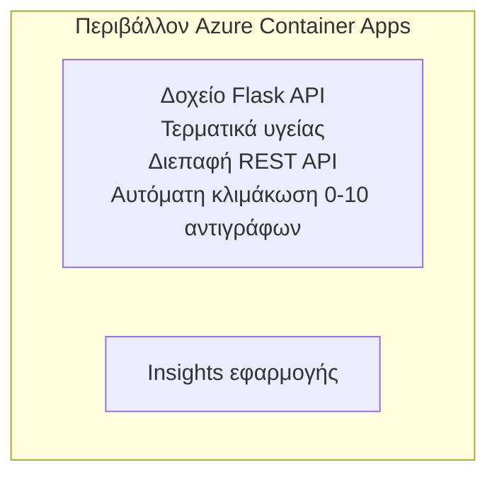

# Απλό Flask API - Παράδειγμα Container App

**Μονοπάτι Μάθησης:** Αρχάριος ⭐ | **Χρόνος:** 25-35 λεπτά | **Κόστος:** $0-15/μήνα

Μια πλήρης, λειτουργική Python Flask REST API αναπτυγμένη σε Azure Container Apps χρησιμοποιώντας το Azure Developer CLI (azd). Αυτό το παράδειγμα δείχνει την ανάπτυξη container, την αυτόματη κλιμάκωση και τα βασικά παρακολούθησης.

## 🎯 Τι θα μάθετε

- Αναπτύξτε μια εφαρμογή Python σε container στο Azure
- Διαμορφώστε αυτόματη κλιμάκωση με scale-to-zero
- Υλοποιήστε probes υγείας και ελέγχους ετοιμότητας
- Παρακολουθήστε τα αρχεία καταγραφής και τις μετρήσεις της εφαρμογής
- Χρησιμοποιήστε το Azure Developer CLI για γρήγορη ανάπτυξη

## 📦 Τι περιλαμβάνεται

✅ **Εφαρμογή Flask** - Πλήρες REST API με λειτουργίες CRUD (`src/app.py`)  
✅ **Dockerfile** - Ρυθμίσεις container έτοιμες για παραγωγή  
✅ **Bicep Infrastructure** - Περιβάλλον Container Apps και ανάπτυξη του API  
✅ **Διαμόρφωση AZD** - Ρύθμιση ανάπτυξης με μία εντολή  
✅ **Probes Υγείας** - Διαμορφωμένοι έλεγχοι liveness και readiness  
✅ **Αυτόματη κλιμάκωση** - 0-10 αντίγραφα ανάλογα με το HTTP φορτίο  

## Architecture



## Προαπαιτούμενα

### Απαιτείται
- **Azure Developer CLI (azd)** - [Οδηγός εγκατάστασης](https://learn.microsoft.com/azure/developer/azure-developer-cli/install-azd)
- **Συνδρομή Azure** - [Δωρεάν λογαριασμός](https://azure.microsoft.com/free/)
- **Docker Desktop** - [Εγκατάσταση Docker](https://www.docker.com/products/docker-desktop/) (για τοπικές δοκιμές)

### Επαλήθευση προαπαιτούμενων

```bash
# Έλεγχος έκδοσης azd (απαιτείται 1.5.0 ή νεότερη)
azd version

# Επαλήθευση σύνδεσης στο Azure
azd auth login

# Έλεγχος Docker (προαιρετικό, για τοπικές δοκιμές)
docker --version
```

## ⏱️ Χρονοδιάγραμμα Ανάπτυξης

| Phase | Duration | What Happens |
|-------|----------|--------------||
| Ρύθμιση περιβάλλοντος | 30 δευτερόλεπτα | Δημιουργία περιβάλλοντος azd |
| Κατασκευή container | 2-3 λεπτά | Εκτέλεση Docker build για την εφαρμογή Flask |
| Προετοιμασία υποδομής | 3-5 λεπτά | Δημιουργία Container Apps, registry και υπηρεσιών παρακολούθησης |
| Ανάπτυξη εφαρμογής | 2-3 λεπτά | Αποστολή εικόνας και ανάπτυξη σε Container Apps |
| **Σύνολο** | **8-12 λεπτά** | Ολοκληρωμένη ανάπτυξη έτοιμη |

## Γρήγορη Εκκίνηση

```bash
# Μεταβείτε στο παράδειγμα
cd examples/container-app/simple-flask-api

# Αρχικοποιήστε το περιβάλλον (επιλέξτε μοναδικό όνομα)
azd env new myflaskapi

# Αναπτύξτε τα πάντα (υποδομή + εφαρμογή)
azd up
# Θα σας ζητηθεί να:
# 1. Επιλέξτε συνδρομή Azure
# 2. Επιλέξτε τοποθεσία (π.χ., eastus2)
# 3. Περιμένετε 8-12 λεπτά για την ανάπτυξη

# Λάβετε το endpoint του API σας
azd env get-values

# Δοκιμάστε το API
curl $(azd env get-value API_ENDPOINT)/health
```

**Αναμενόμενο αποτέλεσμα:**
```json
{
  "status": "healthy",
  "timestamp": "2025-11-19T10:30:00Z",
  "service": "simple-flask-api",
  "version": "1.0.0"
}
```

## ✅ Επαλήθευση Ανάπτυξης

### Βήμα 1: Έλεγχος κατάστασης ανάπτυξης

```bash
# Προβολή αναπτυγμένων υπηρεσιών
azd show

# Το αναμενόμενο αποτέλεσμα δείχνει:
# - Υπηρεσία: api
# - Σημείο τερματισμού: https://ca-api-[env].xxx.azurecontainerapps.io
# - Κατάσταση: Σε λειτουργία
```

### Βήμα 2: Δοκιμή τελικών σημείων API

```bash
# Λήψη του endpoint του API
API_URL=$(azd env get-value API_ENDPOINT)

# Έλεγχος υγείας
curl $API_URL/health

# Δοκιμή του ριζικού endpoint
curl $API_URL/

# Δημιουργία ενός αντικειμένου
curl -X POST $API_URL/api/items \
  -H "Content-Type: application/json" \
  -d '{"name": "Test Item", "description": "My first item"}'

# Λήψη όλων των αντικειμένων
curl $API_URL/api/items
```

**Κριτήρια επιτυχίας:**
- ✅ Το endpoint υγείας (/health) επιστρέφει HTTP 200
- ✅ Το κύριο endpoint εμφανίζει πληροφορίες του API
- ✅ Το POST δημιουργεί στοιχείο και επιστρέφει HTTP 201
- ✅ Το GET επιστρέφει τα δημιουργημένα στοιχεία

### Βήμα 3: Προβολή καταγραφών

```bash
# Μεταδώστε ζωντανά αρχεία καταγραφής χρησιμοποιώντας azd monitor
azd monitor --logs

# Ή χρησιμοποιήστε το Azure CLI:
az containerapp logs show --name api --resource-group $RG_NAME --follow

# Θα πρέπει να δείτε:
# - Μηνύματα εκκίνησης του Gunicorn
# - Καταγραφές αιτημάτων HTTP
# - Καταγραφές πληροφοριών εφαρμογής
```

## Δομή έργου

```
simple-flask-api/
├── azure.yaml              # AZD configuration
├── infra/
│   ├── main.bicep         # Main infrastructure
│   ├── main.parameters.json
│   └── app/
│       ├── container-env.bicep
│       └── api.bicep
└── src/
    ├── app.py             # Flask application
    ├── requirements.txt
    └── Dockerfile
```

## Τερματικά API

| Endpoint | Method | Description |
|----------|--------|-------------|
| `/health` | GET | Έλεγχος υγείας |
| `/api/items` | GET | Λίστα όλων των αντικειμένων |
| `/api/items` | POST | Δημιουργία νέου αντικειμένου |
| `/api/items/{id}` | GET | Λήψη συγκεκριμένου αντικειμένου |
| `/api/items/{id}` | PUT | Ενημέρωση αντικειμένου |
| `/api/items/{id}` | DELETE | Διαγραφή αντικειμένου |

## Διαμόρφωση

### Μεταβλητές περιβάλλοντος

```bash
# Ορίστε προσαρμοσμένη διαμόρφωση
azd env set PORT 8000
azd env set LOG_LEVEL info
azd env set MAX_REPLICAS 20
```

### Ρυθμίσεις κλιμάκωσης

Το API κλιμακώνεται αυτόματα με βάση την κίνηση HTTP:
- **Ελάχιστα αντίγραφα**: 0 (κλιμακώνεται στο μηδέν όταν είναι αδρανές)
- **Μέγιστα αντίγραφα**: 10
- **Ταυτόχρονες αιτήσεις ανά αντίγραφο**: 50

## Ανάπτυξη

### Εκτέλεση τοπικά

```bash
# Εγκαταστήστε τις εξαρτήσεις
cd src
pip install -r requirements.txt

# Εκτελέστε την εφαρμογή
python app.py

# Δοκιμάστε το τοπικά
curl http://localhost:8000/health
```

### Κατασκευή και δοκιμή container

```bash
# Δημιουργία εικόνας Docker
docker build -t flask-api:local ./src

# Εκτέλεση κοντέινερ τοπικά
docker run -p 8000:8000 flask-api:local

# Δοκιμή κοντέινερ
curl http://localhost:8000/health
```

## Ανάπτυξη

### Πλήρης ανάπτυξη

```bash
# Αναπτύξτε την υποδομή και την εφαρμογή
azd up
```

### Ανάπτυξη μόνο με κώδικα

```bash
# Αναπτύξτε μόνο τον κώδικα της εφαρμογής (χωρίς αλλαγή στην υποδομή)
azd deploy api
```

### Ενημέρωση διαμόρφωσης

```bash
# Ενημερώστε τις μεταβλητές περιβάλλοντος
azd env set API_KEY "new-api-key"

# Αναπτύξτε ξανά με τη νέα διαμόρφωση
azd deploy api
```

## Παρακολούθηση

### Προβολή καταγραφών

```bash
# Μετάδωσε ζωντανά αρχεία καταγραφής χρησιμοποιώντας το azd monitor
azd monitor --logs

# Ή χρησιμοποιήστε το Azure CLI για τα Container Apps:
az containerapp logs show --name api --resource-group $RG_NAME --follow

# Προβολή των τελευταίων 100 γραμμών
az containerapp logs show --name api --resource-group $RG_NAME --tail 100
```

### Παρακολούθηση μετρικών

```bash
# Άνοιγμα του πίνακα εργαλείων του Azure Monitor
azd monitor --overview

# Προβολή συγκεκριμένων μετρικών
az monitor metrics list \
  --resource $(azd show --output json | jq -r '.services.api.resourceId') \
  --metric "Requests,ResponseTime"
```

## Δοκιμές

### Έλεγχος υγείας

```bash
curl $(azd show --output json | jq -r '.services.api.endpoint')/health
```

Αναμενόμενη απάντηση:
```json
{
  "status": "healthy",
  "timestamp": "2025-11-19T10:30:00Z"
}
```

### Δημιουργία αντικειμένου

```bash
curl -X POST $(azd show --output json | jq -r '.services.api.endpoint')/api/items \
  -H "Content-Type: application/json" \
  -d '{"name": "Test Item", "description": "A test item"}'
```

### Λήψη όλων των αντικειμένων

```bash
curl $(azd show --output json | jq -r '.services.api.endpoint')/api/items
```

## Βελτιστοποίηση κόστους

Αυτή η ανάπτυξη χρησιμοποιεί scale-to-zero, οπότε πληρώνετε μόνο όταν το API επεξεργάζεται αιτήσεις:

- **Κόστος αδράνειας**: ~$0/μήνα (κλιμακώνεται στο μηδέν)
- **Κόστος κατά την ενεργή λειτουργία**: ~$0.000024/δευτερόλεπτο ανά αντίγραφο
- **Αναμενόμενο μηνιαίο κόστος** (ελαφριά χρήση): $5-15

### Περαιτέρω μείωση κόστους

```bash
# Μείωσε τον μέγιστο αριθμό αντιγράφων για το περιβάλλον ανάπτυξης
azd env set MAX_REPLICAS 3

# Χρησιμοποίησε μικρότερο χρονικό όριο αδράνειας
azd env set SCALE_TO_ZERO_TIMEOUT 300  # 5 λεπτά
```

## Επίλυση προβλημάτων

### Το container δεν ξεκινάει

```bash
# Ελέγξτε τα αρχεία καταγραφής του κοντέινερ χρησιμοποιώντας το Azure CLI
az containerapp logs show --name api --resource-group $RG_NAME --tail 100

# Επαληθεύστε ότι η εικόνα Docker χτίζεται τοπικά
docker build -t test ./src
```

### Το API δεν είναι προσβάσιμο

```bash
# Επιβεβαιώστε ότι το ingress είναι εξωτερικό
az containerapp show --name api --resource-group rg-simple-flask-api \
  --query properties.configuration.ingress.external
```

### Υψηλοί χρόνοι απόκρισης

```bash
# Ελέγξτε τη χρήση CPU/μνήμης
az monitor metrics list \
  --resource $(azd show --output json | jq -r '.services.api.resourceId') \
  --metric "CPUPercentage,MemoryPercentage"

# Αυξήστε τους πόρους αν χρειάζεται
az containerapp update --name api --resource-group rg-simple-flask-api \
  --cpu 1.0 --memory 2Gi
```

## Καθαρισμός

```bash
# Διαγράψτε όλους τους πόρους
azd down --force --purge
```

## Επόμενα βήματα

### Επέκταση αυτού του παραδείγματος

1. **Προσθήκη βάσης δεδομένων** - Ενσωμάτωση Azure Cosmos DB ή SQL Database
   ```bash
   # Προσθέστε τη μονάδα Cosmos DB στο infra/main.bicep
   # Ενημερώστε το app.py με τη σύνδεση στη βάση δεδομένων
   ```

2. **Προσθήκη αυθεντικοποίησης** - Υλοποίηση Microsoft Entra ID ή κλειδιών API
   ```python
   # Προσθέστε middleware αυθεντικοποίησης στο app.py
   from functools import wraps
   ```

3. **Ρύθμιση CI/CD** - Workflow GitHub Actions
   ```yaml
   # Create .github/workflows/deploy.yml
   name: Deploy to Azure
   on: [push]
   ```

4. **Προσθήκη Managed Identity** - Ασφαλής πρόσβαση σε υπηρεσίες Azure
   ```bicep
   # Update infra/app/api.bicep
   identity: { type: 'SystemAssigned' }
   ```

### Σχετικά παραδείγματα

- **[Εφαρμογή βάσης δεδομένων](../../../../../examples/database-app)** - Πλήρες παράδειγμα με SQL Database
- **[Μικροϋπηρεσίες](../../../../../examples/container-app/microservices)** - Αρχιτεκτονική πολλαπλών υπηρεσιών
- **[Οδηγός Container Apps](../README.md)** - Όλα τα μοτίβα container

### Πόροι εκμάθησης

- 📚 [Μάθημα AZD για αρχάριους](../../../README.md) - Κύρια σελίδα μαθήματος
- 📚 [Πρότυπα Container Apps](../README.md) - Περισσότερα μοτίβα ανάπτυξης
- 📚 [Συλλογή προτύπων AZD](https://azure.github.io/awesome-azd/) - Πρότυπα της κοινότητας

## Πρόσθετοι πόροι

### Τεκμηρίωση
- **[Τεκμηρίωση Flask](https://flask.palletsprojects.com/)** - Οδηγός του πλαισίου Flask
- **[Azure Container Apps](https://learn.microsoft.com/azure/container-apps/)** - Επίσημη τεκμηρίωση Azure
- **[Azure Developer CLI](https://learn.microsoft.com/azure/developer/azure-developer-cli/)** - Αναφορά εντολών azd

### Σεμινάρια
- **[Container Apps Quickstart](https://learn.microsoft.com/azure/container-apps/quickstart-portal)** - Αναπτύξτε την πρώτη σας εφαρμογή
- **[Python on Azure](https://learn.microsoft.com/azure/developer/python/)** - Οδηγός ανάπτυξης Python
- **[Bicep Language](https://learn.microsoft.com/azure/azure-resource-manager/bicep/)** - Υποδομή ως κώδικας

### Εργαλεία
- **[Azure Portal](https://portal.azure.com)** - Διαχειριστείτε πόρους οπτικά
- **[VS Code Azure Extension](https://marketplace.visualstudio.com/items?itemName=ms-azuretools.vscode-azurecontainerapps)** - Ενσωμάτωση IDE

---

**🎉 Συγχαρητήρια!** Έχετε αναπτύξει ένα έτοιμο για παραγωγή Flask API σε Azure Container Apps με αυτόματη κλιμάκωση και παρακολούθηση.

**Ερωτήσεις;** [Ανοίξτε ένα issue](https://github.com/microsoft/AZD-for-beginners/issues) ή ελέγξτε το [FAQ](../../../resources/faq.md)

---

<!-- CO-OP TRANSLATOR DISCLAIMER START -->
**Αποποίηση ευθυνών**:
Αυτό το έγγραφο έχει μεταφραστεί χρησιμοποιώντας την υπηρεσία μετάφρασης με τεχνητή νοημοσύνη [Co-op Translator](https://github.com/Azure/co-op-translator). Ενώ επιδιώκουμε την ακρίβεια, παρακαλούμε να έχετε υπόψη ότι οι αυτοματοποιημένες μεταφράσεις ενδέχεται να περιέχουν λάθη ή ανακρίβειες. Το πρωτότυπο έγγραφο στη μητρική του γλώσσα πρέπει να θεωρείται η αυθεντική πηγή. Για κρίσιμες πληροφορίες, συνιστάται επαγγελματική ανθρώπινη μετάφραση. Δεν φέρουμε ευθύνη για τυχόν παρεξηγήσεις ή λανθασμένες ερμηνείες που προκύπτουν από τη χρήση αυτής της μετάφρασης.
<!-- CO-OP TRANSLATOR DISCLAIMER END -->