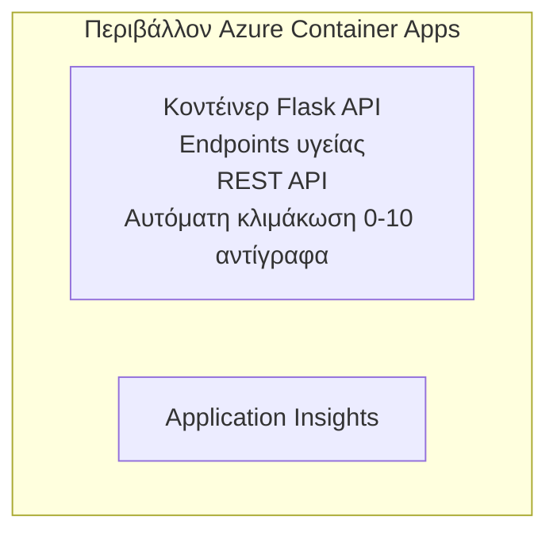

# Απλό Flask API - Παράδειγμα Container App

**Μονοπάτι Μάθησης:** Αρχάριος ⭐ | **Χρόνος:** 25-35 λεπτά | **Κόστος:** $0-15/μήνα

Μια πλήρης, λειτουργική REST API σε Python Flask, αναπτυγμένη σε Azure Container Apps χρησιμοποιώντας το Azure Developer CLI (azd). Αυτό το παράδειγμα παρουσιάζει τις βασικές έννοιες ανάπτυξης κοντέινερ, αυτόματης κλιμάκωσης και παρακολούθησης.

## 🎯 Τι θα μάθετε

- Αναπτύσσετε μια εφαρμογή Python container σε Azure
- Διαμορφώνετε αυτόματη κλιμάκωση με scale-to-zero
- Υλοποιείτε health probes και readiness checks
- Παρακολουθείτε καταγραφές και μετρήσεις εφαρμογής
- Χρησιμοποιείτε το Azure Developer CLI για γρήγορη ανάπτυξη

## 📦 Τι περιλαμβάνεται

✅ **Εφαρμογή Flask** - Πλήρης REST API με λειτουργίες CRUD (`src/app.py`)  
✅ **Dockerfile** - Διαμόρφωση κοντέινερ έτοιμη για παραγωγή  
✅ **Bicep Infrastructure** - Container Apps environment και ανάπτυξη API  
✅ **AZD Configuration** - Ρύθμιση ανάπτυξης με μία εντολή  
✅ **Health Probes** - Διαμορφώθηκαν έλεγχοι liveness και readiness  
✅ **Αυτόματη κλιμάκωση** - 0-10 αντίγραφα ανάλογα με το φορτίο HTTP  

## Αρχιτεκτονική


## Προαπαιτούμενα

### Απαιτείται
- **Azure Developer CLI (azd)** - [Οδηγός εγκατάστασης](https://learn.microsoft.com/azure/developer/azure-developer-cli/install-azd)
- **Azure subscription** - [Δωρεάν λογαριασμός](https://azure.microsoft.com/free/)
- **Docker Desktop** - [Εγκαταστήστε το Docker](https://www.docker.com/products/docker-desktop/) (για τοπική δοκιμή)

### Επιβεβαίωση προαπαιτουμένων

```bash
# Έλεγχος έκδοσης azd (απαιτείται 1.5.0 ή νεότερη)
azd version

# Επαλήθευση σύνδεσης στο Azure
azd auth login

# Έλεγχος Docker (προαιρετικό, για τοπικές δοκιμές)
docker --version
```

## ⏱️ Χρονοδιάγραμμα ανάπτυξης

| Phase | Duration | What Happens |
|-------|----------|--------------||
| Environment setup | 30 seconds | Create azd environment |
| Build container | 2-3 minutes | Docker build Flask app |
| Provision infrastructure | 3-5 minutes | Create Container Apps, registry, monitoring |
| Deploy application | 2-3 minutes | Push image and deploy to Container Apps |
| **Total** | **8-12 minutes** | Complete deployment ready |

## Γρήγορη εκκίνηση

```bash
# Μεταβείτε στο παράδειγμα
cd examples/container-app/simple-flask-api

# Αρχικοποιήστε το περιβάλλον (επιλέξτε μοναδικό όνομα)
azd env new myflaskapi

# Αναπτύξτε τα πάντα (υποδομή + εφαρμογή)
azd up
# Θα σας ζητηθεί να:
# 1. Επιλέξτε συνδρομή Azure
# 2. Επιλέξτε τοποθεσία (π.χ., eastus2)
# 3. Περιμένετε 8-12 λεπτά για την ανάπτυξη

# Λάβετε το endpoint του API σας
azd env get-values

# Δοκιμάστε το API
curl $(azd env get-value API_ENDPOINT)/health
```

**Αναμενόμενη έξοδος:**
```json
{
  "status": "healthy",
  "timestamp": "2025-11-19T10:30:00Z",
  "service": "simple-flask-api",
  "version": "1.0.0"
}
```

## ✅ Επιβεβαίωση ανάπτυξης

### Βήμα 1: Έλεγχος κατάστασης ανάπτυξης

```bash
# Προβολή αναπτυγμένων υπηρεσιών
azd show

# Το αναμενόμενο αποτέλεσμα δείχνει:
# - Υπηρεσία: api
# - Τερματικό σημείο: https://ca-api-[env].xxx.azurecontainerapps.io
# - Κατάσταση: Εκτελείται
```

### Βήμα 2: Δοκιμή τελικών σημείων API

```bash
# Λήψη τελικού σημείου API
API_URL=$(azd env get-value API_ENDPOINT)

# Έλεγχος υγείας
curl $API_URL/health

# Δοκιμή ριζικού σημείου τερματισμού
curl $API_URL/

# Δημιουργία αντικειμένου
curl -X POST $API_URL/api/items \
  -H "Content-Type: application/json" \
  -d '{"name": "Test Item", "description": "My first item"}'

# Λήψη όλων των αντικειμένων
curl $API_URL/api/items
```

**Κριτήρια επιτυχίας:**
- ✅ Το endpoint υγείας επιστρέφει HTTP 200
- ✅ Το root endpoint εμφανίζει πληροφορίες για το API
- ✅ Το POST δημιουργεί αντικείμενο και επιστρέφει HTTP 201
- ✅ Το GET επιστρέφει τα δημιουργημένα αντικείμενα

### Βήμα 3: Προβολή καταγραφών

```bash
# Μετάδωσε ζωντανά αρχεία καταγραφής χρησιμοποιώντας το azd monitor
azd monitor --logs

# Ή χρησιμοποίησε το Azure CLI:
az containerapp logs show --name api --resource-group $RG_NAME --follow

# Θα πρέπει να δείτε:
# - μηνύματα εκκίνησης του Gunicorn
# - αρχεία καταγραφής αιτήσεων HTTP
# - αρχεία καταγραφής πληροφοριών εφαρμογής
```

## Δομή έργου

```
simple-flask-api/
├── azure.yaml              # AZD configuration
├── infra/
│   ├── main.bicep         # Main infrastructure
│   ├── main.parameters.json
│   └── app/
│       ├── container-env.bicep
│       └── api.bicep
└── src/
    ├── app.py             # Flask application
    ├── requirements.txt
    └── Dockerfile
```

## Τελικά σημεία API

| Τελικό σημείο | Μέθοδος | Περιγραφή |
|----------|--------|-------------|
| `/health` | GET | Έλεγχος υγείας |
| `/api/items` | GET | Λίστα όλων των αντικειμένων |
| `/api/items` | POST | Δημιουργία νέου αντικειμένου |
| `/api/items/{id}` | GET | Λήψη συγκεκριμένου αντικειμένου |
| `/api/items/{id}` | PUT | Ενημέρωση αντικειμένου |
| `/api/items/{id}` | DELETE | Διαγραφή αντικειμένου |

## Διαμόρφωση

### Μεταβλητές περιβάλλοντος

```bash
# Ορίστε προσαρμοσμένη διαμόρφωση
azd env set PORT 8000
azd env set LOG_LEVEL info
azd env set MAX_REPLICAS 20
```

### Ρύθμιση κλιμάκωσης

Το API κλιμακώνεται αυτόματα βάσει της κίνησης HTTP:
- **Min Replicas**: 0 (κλιμακώνεται στο μηδέν όταν είναι αδρανές)
- **Max Replicas**: 10
- **Concurrent Requests per Replica**: 50

## Development

### Εκτέλεση τοπικά

```bash
# Εγκαταστήστε τις εξαρτήσεις
cd src
pip install -r requirements.txt

# Τρέξτε την εφαρμογή
python app.py

# Δοκιμάστε το τοπικά
curl http://localhost:8000/health
```

### Κατασκευή και δοκιμή κοντέινερ

```bash
# Δημιουργία εικόνας Docker
docker build -t flask-api:local ./src

# Εκτέλεση κοντέινερ τοπικά
docker run -p 8000:8000 flask-api:local

# Δοκιμή κοντέινερ
curl http://localhost:8000/health
```

## Deployment

### Πλήρης ανάπτυξη

```bash
# Αναπτύξτε την υποδομή και την εφαρμογή
azd up
```

### Ανάπτυξη μόνο κώδικα

```bash
# Ανάπτυξη μόνο του κώδικα της εφαρμογής (η υποδομή αμετάβλητη)
azd deploy api
```

### Ενημέρωση ρυθμίσεων

```bash
# Ενημερώστε τις μεταβλητές περιβάλλοντος
azd env set API_KEY "new-api-key"

# Αναπτύξτε ξανά με τη νέα διαμόρφωση
azd deploy api
```

## Παρακολούθηση

### Προβολή καταγραφών

```bash
# Μετάδοση ζωντανών αρχείων καταγραφής χρησιμοποιώντας το azd monitor
azd monitor --logs

# Ή χρησιμοποιήστε το Azure CLI για τις Container Apps:
az containerapp logs show --name api --resource-group $RG_NAME --follow

# Προβολή των τελευταίων 100 γραμμών
az containerapp logs show --name api --resource-group $RG_NAME --tail 100
```

### Παρακολούθηση μετρήσεων

```bash
# Άνοιγμα πίνακα ελέγχου του Azure Monitor
azd monitor --overview

# Προβολή συγκεκριμένων μετρικών
az monitor metrics list \
  --resource $(azd show --output json | jq -r '.services.api.resourceId') \
  --metric "Requests,ResponseTime"
```

## Δοκιμές

### Έλεγχος υγείας

```bash
curl $(azd show --output json | jq -r '.services.api.endpoint')/health
```

Αναμενόμενη απάντηση:
```json
{
  "status": "healthy",
  "timestamp": "2025-11-19T10:30:00Z"
}
```

### Δημιουργία αντικειμένου

```bash
curl -X POST $(azd show --output json | jq -r '.services.api.endpoint')/api/items \
  -H "Content-Type: application/json" \
  -d '{"name": "Test Item", "description": "A test item"}'
```

### Λήψη όλων των αντικειμένων

```bash
curl $(azd show --output json | jq -r '.services.api.endpoint')/api/items
```

## Βελτιστοποίηση κόστους

Αυτή η ανάπτυξη χρησιμοποιεί scale-to-zero, οπότε πληρώνετε μόνο όταν το API επεξεργάζεται αιτήματα:

- **Κόστος όταν αδρανεί**: ~$0/μήνα (κλιμακώνεται στο μηδέν)
- **Κόστος κατά την ενεργή λειτουργία**: ~$0.000024/δευτερόλεπτο ανά αντίγραφο
- **Εκτιμώμενο μηνιαίο κόστος** (ελαφριά χρήση): $5-15

### Μειώστε περαιτέρω τα κόστη

```bash
# Μείωση του μέγιστου αριθμού αντιγράφων για το περιβάλλον ανάπτυξης
azd env set MAX_REPLICAS 3

# Χρησιμοποιήστε μικρότερο χρονικό όριο αδράνειας
azd env set SCALE_TO_ZERO_TIMEOUT 300  # 5 λεπτά
```

## Αντιμετώπιση προβλημάτων

### Το κοντέινερ δεν ξεκινά

```bash
# Ελέγξτε τα αρχεία καταγραφής του κοντέινερ χρησιμοποιώντας το Azure CLI
az containerapp logs show --name api --resource-group $RG_NAME --tail 100

# Επαληθεύστε ότι η εικόνα Docker χτίζεται τοπικά
docker build -t test ./src
```

### Το API δεν είναι προσβάσιμο

```bash
# Επαληθεύστε ότι το ingress είναι εξωτερικό
az containerapp show --name api --resource-group rg-simple-flask-api \
  --query properties.configuration.ingress.external
```

### Υψηλοί χρόνοι απόκρισης

```bash
# Ελέγξτε τη χρήση της CPU/μνήμης
az monitor metrics list \
  --resource $(azd show --output json | jq -r '.services.api.resourceId') \
  --metric "CPUPercentage,MemoryPercentage"

# Αυξήστε τους πόρους εάν χρειάζεται
az containerapp update --name api --resource-group rg-simple-flask-api \
  --cpu 1.0 --memory 2Gi
```

## Καθαρισμός

```bash
# Διαγράψτε όλους τους πόρους
azd down --force --purge
```

## Επόμενα βήματα

### Επέκταση αυτού του παραδείγματος

1. **Προσθήκη βάσης δεδομένων** - Ενσωμάτωση Azure Cosmos DB ή SQL Database
   ```bash
   # Προσθέστε τη μονάδα Cosmos DB στο infra/main.bicep
   # Ενημερώστε το app.py με τη σύνδεση στη βάση δεδομένων
   ```

2. **Προσθήκη αυθεντικοποίησης** - Εφαρμογή Azure AD ή API keys
   ```python
   # Προσθέστε middleware αυθεντικοποίησης στο app.py
   from functools import wraps
   ```

3. **Ρύθμιση CI/CD** - Ροή εργασίας GitHub Actions
   ```yaml
   # Create .github/workflows/deploy.yml
   name: Deploy to Azure
   on: [push]
   ```

4. **Προσθήκη Managed Identity** - Ασφαλής πρόσβαση σε υπηρεσίες Azure
   ```bicep
   # Update infra/app/api.bicep
   identity: { type: 'SystemAssigned' }
   ```

### Σχετικά παραδείγματα

- **[Εφαρμογή βάσης δεδομένων](../../../../../examples/database-app)** - Πλήρες παράδειγμα με SQL Database
- **[Microservices](../../../../../examples/container-app/microservices)** - Αρχιτεκτονική πολλαπλών υπηρεσιών
- **[Container Apps Master Guide](../README.md)** - Όλα τα μοτίβα για κοντέινερ

### Πόροι μάθησης

- 📚 [Μάθημα AZD για Αρχάριους](../../../README.md) - Κύρια σελίδα του μαθήματος
- 📚 [Πρότυπα Container Apps](../README.md) - Περισσότερα πρότυπα ανάπτυξης
- 📚 [AZD Templates Gallery](https://azure.github.io/awesome-azd/) - Πρότυπα της κοινότητας

## Επιπλέον πόροι

### Τεκμηρίωση
- **[Τεκμηρίωση Flask](https://flask.palletsprojects.com/)** - Οδηγός του Flask framework
- **[Azure Container Apps](https://learn.microsoft.com/azure/container-apps/)** - Επίσημη τεκμηρίωση Azure
- **[Azure Developer CLI](https://learn.microsoft.com/azure/developer/azure-developer-cli/)** - Αναφορά εντολών azd

### Οδηγοί
- **[Container Apps Quickstart](https://learn.microsoft.com/azure/container-apps/quickstart-portal)** - Αναπτύξτε την πρώτη σας εφαρμογή
- **[Python on Azure](https://learn.microsoft.com/azure/developer/python/)** - Οδηγός ανάπτυξης Python
- **[Bicep Language](https://learn.microsoft.com/azure/azure-resource-manager/bicep/)** - Υποδομή ως κώδικας

### Εργαλεία
- **[Azure Portal](https://portal.azure.com)** - Διαχείριση πόρων με γραφικό περιβάλλον
- **[VS Code Azure Extension](https://marketplace.visualstudio.com/items?itemName=ms-azuretools.vscode-azurecontainerapps)** - Ενσωμάτωση στο IDE

---

**🎉 Συγχαρητήρια!** Έχετε αναπτύξει ένα Flask API έτοιμο για παραγωγή σε Azure Container Apps με αυτόματη κλιμάκωση και παρακολούθηση.

**Ερωτήσεις;** [Ανοίξτε ένα issue](https://github.com/microsoft/AZD-for-beginners/issues) ή ελέγξτε το [FAQ](../../../resources/faq.md)

---

<!-- CO-OP TRANSLATOR DISCLAIMER START -->
Αποποίηση ευθυνών:
Αυτό το έγγραφο έχει μεταφραστεί χρησιμοποιώντας την υπηρεσία μετάφρασης με τεχνητή νοημοσύνη [Co-op Translator](https://github.com/Azure/co-op-translator). Παρόλο που επιδιώκουμε την ακρίβεια, παρακαλούμε να έχετε υπόψη ότι οι αυτοματοποιημένες μεταφράσεις ενδέχεται να περιέχουν λάθη ή ανακρίβειες. Η πρωτότυπη έκδοση του εγγράφου στην αρχική γλώσσα πρέπει να θεωρείται η έγκυρη πηγή. Για κρίσιμες πληροφορίες, συνιστάται επαγγελματική μετάφραση από άνθρωπο. Δεν φέρουμε ευθύνη για τυχόν παρεξηγήσεις ή λανθασμένες ερμηνείες που προκύπτουν από τη χρήση αυτής της μετάφρασης.
<!-- CO-OP TRANSLATOR DISCLAIMER END -->