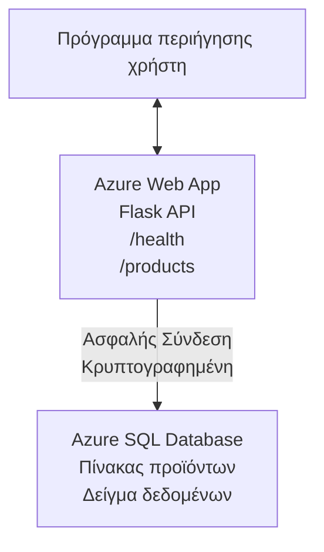

# Ανάπτυξη μιας βάσης δεδομένων Microsoft SQL και Web App με AZD

⏱️ **Εκτιμώμενος Χρόνος**: 20-30 λεπτά | 💰 **Εκτιμώμενο Κόστος**: ~$15-25/μήνα | ⭐ **Πολυπλοκότητα**: Ενδιάμεση

Αυτό το **πλήρες, λειτουργικό παράδειγμα** δείχνει πώς να χρησιμοποιήσετε το [Azure Developer CLI (azd)](https://learn.microsoft.com/azure/developer/azure-developer-cli/) για να αναπτύξετε μια εφαρμογή Python Flask web με μια βάση δεδομένων Microsoft SQL στο Azure. Όλος ο κώδικας συμπεριλαμβάνεται και έχει δοκιμαστεί—χωρίς εξωτερικές εξαρτήσεις.

## Τι θα μάθετε

Με την ολοκλήρωση αυτού του παραδείγματος, θα:
- Αναπτύξετε μια πολυεπίπεδη εφαρμογή (web app + βάση δεδομένων) χρησιμοποιώντας υποδομή ως κώδικα
- Διαμορφώσετε ασφαλείς συνδέσεις βάσης δεδομένων χωρίς ενσωμάτωση μυστικών στο κώδικα
- Παρακολουθήσετε την υγεία της εφαρμογής με το Application Insights
- Διαχειριστείτε πόρους Azure αποδοτικά με το AZD CLI
- Ακολουθήσετε τις βέλτιστες πρακτικές του Azure για ασφάλεια, βελτιστοποίηση κόστους και παρατηρησιμότητα

## Επισκόπηση Σεναρίου
- **Web App**: Python Flask REST API με σύνδεση σε βάση δεδομένων
- **Database**: Azure SQL Database με δείγμα δεδομένων
- **Infrastructure**: Παρέχεται με Bicep (μοσουλαρισμένα, επαναχρησιμοποιήσιμα πρότυπα)
- **Deployment**: Πλήρως αυτοματοποιημένο με εντολές `azd`
- **Monitoring**: Application Insights για logs και τηλεμετρία

## Προαπαιτούμενα

### Απαιτούμενα Εργαλεία

Πριν ξεκινήσετε, επαληθεύστε ότι έχετε εγκαταστήσει τα παρακάτω εργαλεία:

1. **[Azure CLI](https://learn.microsoft.com/cli/azure/install-azure-cli)** (έκδοση 2.50.0 ή νεότερη)
   ```sh
   az --version
   # Αναμενόμενη έξοδος: azure-cli 2.50.0 ή νεότερη
   ```

2. **[Azure Developer CLI (azd)](https://learn.microsoft.com/azure/developer/azure-developer-cli/install-azd)** (έκδοση 1.0.0 ή νεότερη)
   ```sh
   azd version
   # Αναμενόμενη έξοδος: azd έκδοση 1.0.0 ή νεότερη
   ```

3. **[Python 3.8+](https://www.python.org/downloads/)** (για τοπική ανάπτυξη)
   ```sh
   python --version
   # Αναμενόμενη έξοδος: Python 3.8 ή νεότερη
   ```

4. **[Docker](https://www.docker.com/get-started)** (προαιρετικό, για τοπική ανάπτυξη με κοντέινερ)
   ```sh
   docker --version
   # Αναμενόμενη έξοδος: Docker έκδοση 20.10 ή νεότερη
   ```

### Απαιτήσεις Azure

- Ένας ενεργός **Azure subscription** ([δημιουργήστε δωρεάν λογαριασμό](https://azure.microsoft.com/free/))
- Δικαιώματα για δημιουργία πόρων στο subscription σας
- **Owner** ή **Contributor** ρόλος στο subscription ή στο resource group

### Προαπαιτούμενες Γνώσεις

Αυτό είναι ένα παράδειγμα **ενδιάμεσου επιπέδου**. Θα πρέπει να είστε εξοικειωμένοι με:
- Βασικές λειτουργίες γραμμής εντολών
- Θεμελιώδεις έννοιες cloud (πόροι, resource groups)
- Βασική κατανόηση εφαρμογών web και βάσεων δεδομένων

**Νέος στο AZD;** Ξεκινήστε πρώτα με τον [Οδηγό εκκίνησης](../../docs/chapter-01-foundation/azd-basics.md).

## Αρχιτεκτονική

Αυτό το παράδειγμα αναπτύσσει μια δύο-επίπεδη αρχιτεκτονική με μια web εφαρμογή και μια βάση SQL:


**Ανάπτυξη Πόρων:**
- **Resource Group**: Κουτί για όλους τους πόρους
- **App Service Plan**: Φιλοξενία σε Linux (tier B1 για οικονομία)
- **Web App**: Python 3.11 runtime με εφαρμογή Flask
- **SQL Server**: Διαχειριζόμενος διακομιστής βάσης δεδομένων με TLS 1.2 ως ελάχιστο
- **SQL Database**: Basic tier (2GB, κατάλληλο για ανάπτυξη/δοκιμές)
- **Application Insights**: Παρακολούθηση και logging
- **Log Analytics Workspace**: Κεντρική αποθήκη logs

**Παρομοίωση**: Σκεφτείτε το σαν ένα εστιατόριο (web app) με έναν μεγάλο καταψύκτη (βάση δεδομένων). Οι πελάτες παραγγέλνουν από το μενού (API endpoints), και η κουζίνα (Flask app) παίρνει τα υλικά (δεδομένα) από τον καταψύκτη. Ο μάνατζερ του εστιατορίου (Application Insights) παρακολουθεί ό,τι συμβαίνει.

## Δομή Φακέλων

Όλα τα αρχεία περιλαμβάνονται σε αυτό το παράδειγμα—χωρίς εξωτερικές εξαρτήσεις:

```
examples/database-app/
│
├── README.md                    # This file
├── azure.yaml                   # AZD configuration file
├── .env.sample                  # Sample environment variables
├── .gitignore                   # Git ignore patterns
│
├── infra/                       # Infrastructure as Code (Bicep)
│   ├── main.bicep              # Main orchestration template
│   ├── abbreviations.json      # Azure naming conventions
│   └── resources/              # Modular resource templates
│       ├── sql-server.bicep    # SQL Server configuration
│       ├── sql-database.bicep  # Database configuration
│       ├── app-service-plan.bicep  # Hosting plan
│       ├── app-insights.bicep  # Monitoring setup
│       └── web-app.bicep       # Web application
│
└── src/
    └── web/                    # Application source code
        ├── app.py              # Flask REST API
        ├── requirements.txt    # Python dependencies
        └── Dockerfile          # Container definition
```

**Τι Κάνει Κάθε Αρχείο:**
- **azure.yaml**: Υποδεικνύει στο AZD τι να αναπτυχθεί και πού
- **infra/main.bicep**: Συντονίζει όλους τους πόρους Azure
- **infra/resources/*.bicep**: Ορισμοί μεμονωμένων πόρων (μοσουλαρισμένα για επαναχρησιμοποίηση)
- **src/web/app.py**: Εφαρμογή Flask με λογική βάσης δεδομένων
- **requirements.txt**: Εξαρτήσεις πακέτων Python
- **Dockerfile**: Οδηγίες containerization για ανάπτυξη

## Γρήγορη Εκκίνηση (Βήμα-Βήμα)

### Βήμα 1: Κλωνοποίηση και Μετάβαση

```sh
git clone https://github.com/microsoft/AZD-for-beginners.git
cd AZD-for-beginners/examples/database-app
```

**✓ Έλεγχος Επιτυχίας**: Επιβεβαιώστε ότι βλέπετε τα `azure.yaml` και τον φάκελο `infra/`:
```sh
ls
# Αναμενόμενο: README.md, azure.yaml, infra/, src/
```

### Βήμα 2: Πιστοποίηση στο Azure

```sh
azd auth login
```

Αυτό ανοίγει το πρόγραμμα περιήγησης για πιστοποίηση στο Azure. Συνδεθείτε με τα διαπιστευτήρια Azure.

**✓ Έλεγχος Επιτυχίας**: Θα πρέπει να δείτε:
```
Logged in to Azure.
```

### Βήμα 3: Αρχικοποίηση του Περιβάλλοντος

```sh
azd init
```

**Τι συμβαίνει**: Το AZD δημιουργεί μια τοπική διαμόρφωση για την ανάπτυξή σας.

**Προτροπές που θα δείτε**:
- **Environment name**: Εισάγετε ένα σύντομο όνομα (π.χ., `dev`, `myapp`)
- **Azure subscription**: Επιλέξτε το subscription σας από τη λίστα
- **Azure location**: Επιλέξτε μια περιοχή (π.χ., `eastus`, `westeurope`)

**✓ Έλεγχος Επιτυχίας**: Θα πρέπει να δείτε:
```
SUCCESS: New project initialized!
```

### Βήμα 4: Παροχή Πόρων Azure

```sh
azd provision
```

**Τι συμβαίνει**: Το AZD αναπτύσσει όλη την υποδομή (χρειάζεται 5-8 λεπτά):
1. Δημιουργεί resource group
2. Δημιουργεί SQL Server και Database
3. Δημιουργεί App Service Plan
4. Δημιουργεί Web App
5. Δημιουργεί Application Insights
6. Διαμορφώνει δικτύωση και ασφάλεια

**Θα σας ζητηθούν**:
- **SQL admin username**: Εισάγετε ένα username (π.χ., `sqladmin`)
- **SQL admin password**: Εισάγετε έναν ισχυρό κωδικό (αποθηκεύστε τον!)

**✓ Έλεγχος Επιτυχίας**: Θα πρέπει να δείτε:
```
SUCCESS: Your application was provisioned in Azure in X minutes Y seconds.
You can view the resources created under the resource group rg-<env-name> in Azure Portal:
https://portal.azure.com/#@/resource/subscriptions/.../resourceGroups/rg-<env-name>
```

**⏱️ Χρόνος**: 5-8 λεπτά

### Βήμα 5: Ανάπτυξη της Εφαρμογής

```sh
azd deploy
```

**Τι συμβαίνει**: Το AZD χτίζει και αναπτύσσει την εφαρμογή Flask σας:
1. Πακετάρει την εφαρμογή Python
2. Χτίζει το Docker container
3. Σπρώχνει στο Azure Web App
4. Αρχικοποιεί τη βάση δεδομένων με δείγμα δεδομένων
5. Εκκινεί την εφαρμογή

**✓ Έλεγχος Επιτυχίας**: Θα πρέπει να δείτε:
```
SUCCESS: Your application was deployed to Azure in X minutes Y seconds.
You can view the resources created under the resource group rg-<env-name> in Azure Portal:
https://portal.azure.com/#@/resource/subscriptions/.../resourceGroups/rg-<env-name>
```

**⏱️ Χρόνος**: 3-5 λεπτά

### Βήμα 6: Περιήγηση στην Εφαρμογή

```sh
azd browse
```

Αυτό ανοίγει την αναπτυγμένη web app σας στο πρόγραμμα περιήγησης στη διεύθυνση `https://app-<unique-id>.azurewebsites.net`

**✓ Έλεγχος Επιτυχίας**: Θα πρέπει να δείτε JSON έξοδο:
```json
{
  "message": "Welcome to the Database App API",
  "endpoints": {
    "/": "This help message",
    "/health": "Health check endpoint",
    "/products": "List all products",
    "/products/<id>": "Get product by ID"
  }
}
```

### Βήμα 7: Δοκιμή των API Endpoints

**Έλεγχος υγείας** (επαληθεύστε τη σύνδεση στη βάση δεδομένων):
```sh
curl https://app-<your-id>.azurewebsites.net/health
```

**Αναμενόμενη Απάντηση**:
```json
{
  "status": "healthy",
  "database": "connected"
}
```

**Λίστα Προϊόντων** (δείγμα δεδομένων):
```sh
curl https://app-<your-id>.azurewebsites.net/products
```

**Αναμενόμενη Απάντηση**:
```json
[
  {
    "id": 1,
    "name": "Laptop",
    "description": "High-performance laptop",
    "price": 1299.99,
    "created_at": "2025-11-19T10:30:00"
  },
  ...
]
```

**Λήψη ενός Προϊόντος**:
```sh
curl https://app-<your-id>.azurewebsites.net/products/1
```

**✓ Έλεγχος Επιτυχίας**: Όλα τα endpoints επιστρέφουν δεδομένα JSON χωρίς σφάλματα.

---

**🎉 Συγχαρητήρια!** Έχετε αναπτύξει επιτυχώς μια web εφαρμογή με βάση δεδομένων στο Azure χρησιμοποιώντας το AZD.

## Βαθιά Εμβάθυνση στη Διαμόρφωση

### Μεταβλητές Περιβάλλοντος

Τα μυστικά διαχειρίζονται με ασφάλεια μέσω της διαμόρφωσης του Azure App Service—**μην ενσωματώνετε ποτέ μυστικά στον πηγαίο κώδικα**.

**Διαμορφώνονται αυτόματα από το AZD**:
- `SQL_CONNECTION_STRING`: Σύνδεση βάσης δεδομένων με κωδικούς κρυπτογραφημένους
- `APPLICATIONINSIGHTS_CONNECTION_STRING`: Τελεία τηλεμετρίας για παρακολούθηση
- `SCM_DO_BUILD_DURING_DEPLOYMENT`: Ενεργοποιεί αυτόματη εγκατάσταση εξαρτήσεων

**Πού αποθηκεύονται τα μυστικά**:
1. Κατά τη διάρκεια του `azd provision`, παρέχετε τα credentials SQL μέσω ασφαλών προτροπών
2. Το AZD τα αποθηκεύει στο τοπικό αρχείο `.azure/<env-name>/.env` (που αγνοείται από το Git)
3. Το AZD τα εγχέει στη διαμόρφωση του Azure App Service (κρυπτογραφημένα σε κατάσταση ηρεμίας)
4. Η εφαρμογή τα διαβάζει μέσω `os.getenv()` κατά το runtime

### Τοπική Ανάπτυξη

Για τοπικές δοκιμές, δημιουργήστε ένα `.env` αρχείο από το δείγμα:

```sh
cp .env.sample .env
# Επεξεργαστείτε το .env με τη σύνδεση στη τοπική σας βάση δεδομένων
```

**Τοπική Ροή Εργασίας Ανάπτυξης**:
```sh
# Εγκατάσταση εξαρτήσεων
cd src/web
pip install -r requirements.txt

# Ορισμός μεταβλητών περιβάλλοντος
export SQL_CONNECTION_STRING="your-local-connection-string"

# Εκτέλεση της εφαρμογής
python app.py
```

**Δοκιμή τοπικά**:
```sh
curl http://localhost:8000/health
# Αναμενόμενο: {"status": "healthy", "database": "connected"}
```

### Υποδομή ως Κώδικας

Όλοι οι πόροι Azure ορίζονται σε **Bicep templates** (φάκελος `infra/`):

- **Μοσουλαρισμένος Σχεδιασμός**: Κάθε τύπος πόρου έχει το δικό του αρχείο για επαναχρησιμοποίηση
- **Παραμετροποιημένος**: Εξατομικεύστε SKUs, περιοχές, κανόνες ονοματολογίας
- **Βέλτιστες Πρακτικές**: Ακολουθεί πρότυπα ονοματολογίας και προεπιλογές ασφαλείας του Azure
- **Έλεγχος Έκδοσης**: Οι αλλαγές υποδομής παρακολουθούνται στο Git

**Παράδειγμα Προσαρμογής**:
Για να αλλάξετε το επίπεδο της βάσης δεδομένων, επεξεργαστείτε το `infra/resources/sql-database.bicep`:
```bicep
sku: {
  name: 'Standard'  // Changed from 'Basic'
  tier: 'Standard'
  capacity: 10
}
```

## Καλές Πρακτικές Ασφαλείας

Αυτό το παράδειγμα ακολουθεί τις βέλτιστες πρακτικές ασφαλείας του Azure:

### 1. **Χωρίς Μυστικά στον Πηγαίο Κώδικα**
- ✅ Τα credentials αποθηκεύονται στη διαμόρφωση του Azure App Service (κρυπτογραφημένα)
- ✅ Τα αρχεία `.env` εξαιρούνται από το Git μέσω `.gitignore`
- ✅ Τα μυστικά περνάνε μέσω ασφαλών παραμέτρων κατά την παροχή

### 2. **Κρυπτογραφημένες Συνδέσεις**
- ✅ TLS 1.2 τουλάχιστον για τον SQL Server
- ✅ Εφαρμογή μόνο HTTPS για το Web App
- ✅ Οι συνδέσεις στη βάση δεδομένων χρησιμοποιούν κρυπτογραφημένα κανάλια

### 3. **Ασφάλεια Δικτύου**
- ✅ Ο τείχος προστασίας του SQL Server διαμορφώνεται ώστε να επιτρέπει μόνο υπηρεσίες Azure
- ✅ Η δημόσια πρόσβαση δικτύου περιορίζεται (μπορεί να κλειδωθεί περαιτέρω με Private Endpoints)
- ✅ Το FTPS απενεργοποιημένο στο Web App

### 4. **Πιστοποίηση & Εξουσιοδότηση**
- ⚠️ **Τρέχον**: SQL authentication (username/password)
- ✅ **Συνιστώμενο για Παραγωγή**: Χρήση Azure Managed Identity για πιστοποίηση χωρίς κωδικό

**Για Αναβάθμιση σε Managed Identity** (για παραγωγή):
1. Ενεργοποιήστε managed identity στο Web App
2. Χορηγήστε δικαιώματα SQL στην ταυτότητα
3. Ενημερώστε τη συμβολοσειρά σύνδεσης για χρήση managed identity
4. Αφαιρέστε την πιστοποίηση με βάση κωδικό

### 5. **Έλεγχος & Συμμόρφωση**
- ✅ Το Application Insights καταγράφει όλα τα αιτήματα και τα σφάλματα
- ✅ Η καταγραφή (auditing) της SQL Database ενεργοποιείται (μπορεί να ρυθμιστεί για συμμόρφωση)
- ✅ Όλοι οι πόροι είναι επισημασμένοι για διακυβέρνηση

**Λίστα Ελέγχου Ασφαλείας πριν την Παραγωγή**:
- [ ] Ενεργοποιήστε το Azure Defender για SQL
- [ ] Διαμορφώστε Private Endpoints για τη SQL Database
- [ ] Ενεργοποιήστε Web Application Firewall (WAF)
- [ ] Υλοποιήστε Azure Key Vault για περιστροφή μυστικών
- [ ] Διαμορφώστε πιστοποίηση Azure AD
- [ ] Ενεργοποιήστε διαγνωστική καταγραφή για όλους τους πόρους

## Βελτιστοποίηση Κόστους

**Εκτιμώμενα Μηνιαία Έξοδα** (όπως τον Νοέμβριο 2025):

| Resource | SKU/Tier | Estimated Cost |
|----------|----------|----------------|
| App Service Plan | B1 (Basic) | ~$13/month |
| SQL Database | Basic (2GB) | ~$5/month |
| Application Insights | Pay-as-you-go | ~$2/month (low traffic) |
| **Total** | | **~$20/month** |

**💡 Συμβουλές για Εξοικονόμηση Κόστους**:

1. **Χρησιμοποιήστε Δωρεάν Επίπεδο για Μάθηση**:
   - App Service: F1 tier (δωρεάν, περιορισμένες ώρες)
   - SQL Database: Χρησιμοποιήστε Azure SQL Database serverless
   - Application Insights: 5GB/μήνα δωρεάν εισροή

2. **Σταματήστε τους Πόρους Όταν Δεν Χρησιμοποιούνται**:
   ```sh
   # Διακόψτε την web εφαρμογή (η βάση δεδομένων εξακολουθεί να χρεώνεται)
   az webapp stop --name <app-name> --resource-group <rg-name>
   
   # Επανεκκινήστε όταν χρειάζεται
   az webapp start --name <app-name> --resource-group <rg-name>
   ```

3. **Διαγράψτε τα Πάντα Μετά τις Δοκιμές**:
   ```sh
   azd down
   ```
   Αυτό αφαιρεί ΟΛΟΥΣ τους πόρους και σταματά τους χρεώσεις.

4. **SKUs για Ανάπτυξη vs Παραγωγή**:
   - **Ανάπτυξη**: Basic tier (χρησιμοποιείται σε αυτό το παράδειγμα)
   - **Παραγωγή**: Standard/Premium tier με ανθεκτικότητα

**Παρακολούθηση Κόστους**:
- Δείτε τα κόστη στο [Azure Cost Management](https://portal.azure.com/#view/Microsoft_Azure_CostManagement)
- Ρυθμίστε ειδοποιήσεις κόστους για να αποφύγετε εκπλήξεις
- Επισυνάψτε tag σε όλους τους πόρους με `azd-env-name` για παρακολούθηση

**Εναλλακτική Δωρεάν Επίπεδου**:
Για εκπαιδευτικούς σκοπούς, μπορείτε να τροποποιήσετε το `infra/resources/app-service-plan.bicep`:
```bicep
sku: {
  name: 'F1'  // Free tier
  tier: 'Free'
}
```
**Σημείωση**: Το δωρεάν επίπεδο έχει περιορισμούς (60 min/day CPU, δεν υποστηρίζει always-on).

## Παρακολούθηση & Παρατηρησιμότητα

### Ενσωμάτωση Application Insights

Αυτό το παράδειγμα περιλαμβάνει **Application Insights** για ολοκληρωμένη παρακολούθηση:

**Τι Παρακολουθείται**:
- ✅ HTTP αιτήματα (καθυστέρηση, κωδικοί κατάστασης, endpoints)
- ✅ Σφάλματα και εξαιρέσεις εφαρμογής
- ✅ Προσαρμοσμένα logs από την εφαρμογή Flask
- ✅ Υγεία σύνδεσης βάσης δεδομένων
- ✅ Μετρικές απόδοσης (CPU, μνήμη)

**Πρόσβαση στο Application Insights**:
1. Ανοίξτε το [Azure Portal](https://portal.azure.com)
2. Μεταβείτε στο resource group σας (`rg-<env-name>`)
3. Κάντε κλικ στον πόρο Application Insights (`appi-<unique-id>`)

**Χρήσιμες Ερωτήσεις** (Application Insights → Logs):

**Προβολή Όλων των Αιτήσεων**:
```kusto
requests
| where timestamp > ago(1h)
| order by timestamp desc
| project timestamp, name, url, resultCode, duration
```

**Εύρεση Σφαλμάτων**:
```kusto
exceptions
| where timestamp > ago(24h)
| order by timestamp desc
| project timestamp, type, outerMessage, operation_Name
```

**Έλεγχος Endpoint Υγείας**:
```kusto
requests
| where name contains "health"
| summarize count() by resultCode, bin(timestamp, 1h)
```

### Καταγραφή Auditing της SQL Database

**Η καταγραφή (auditing) της SQL Database είναι ενεργοποιημένη** για παρακολούθηση:
- Πρότυπα πρόσβασης στη βάση δεδομένων
- Ανεπιτυχείς προσπάθειες σύνδεσης
- Αλλαγές στο σχήμα
- Πρόσβαση σε δεδομένα (για συμμόρφωση)

**Πρόσβαση στα Audit Logs**:
1. Azure Portal → SQL Database → Auditing
2. Δείτε logs στο Log Analytics workspace

### Παρακολούθηση σε Πραγματικό Χρόνο

**Προβολή Live Metrics**:
1. Application Insights → Live Metrics
2. Δείτε αιτήματα, αποτυχίες και απόδοση σε πραγματικό χρόνο

**Ρύθμιση Ειδοποιήσεων**:
Δημιουργήστε ειδοποιήσεις για κρίσιμα περιστατικά:
- HTTP 500 > 5 σε 5 λεπτά
- Αποτυχίες σύνδεσης στη βάση δεδομένων
- Υψηλοί χρόνοι απόκρισης (>2 δευτερόλεπτα)

**Παράδειγμα Δημιουργίας Ειδοποίησης**:
```sh
az monitor metrics alert create \
  --name "High-Response-Time" \
  --resource-group <rg-name> \
  --scopes <app-insights-resource-id> \
  --condition "avg requests/duration > 2000" \
  --description "Alert when response time exceeds 2 seconds"
```

## Αντιμετώπιση Προβλημάτων
### Συχνά Προβλήματα και Λύσεις

#### 1. `azd provision` fails with "Location not available"

**Symptom**:
```
Error: The subscription is not registered for the resource type 'components' in the location 'centralus'.
```

**Solution**:
Επιλέξτε διαφορετική περιοχή Azure ή εγγράψτε τον πάροχο πόρων:
```sh
az provider register --namespace Microsoft.Insights
```

#### 2. SQL Connection Fails During Deployment

**Symptom**:
```
pyodbc.OperationalError: ('08001', '[08001] [Microsoft][ODBC Driver 18 for SQL Server]TCP Provider...')
```

**Solution**:
- Επαληθεύστε ότι το firewall του SQL Server επιτρέπει τις υπηρεσίες Azure (ρυθμίζεται αυτόματα)
- Ελέγξτε ότι ο κωδικός διαχειριστή SQL εισήχθη σωστά κατά το `azd provision`
- Βεβαιωθείτε ότι ο SQL Server έχει ολοκληρώσει την προμήθεια (μπορεί να πάρει 2-3 λεπτά)

**Verify Connection**:
```sh
# Από το Azure Portal, μεταβείτε στην SQL Database → Επεξεργαστής ερωτημάτων
# Δοκιμάστε να συνδεθείτε με τα διαπιστευτήριά σας
```

#### 3. Web App Shows "Application Error"

**Symptom**:
Ο περιηγητής εμφανίζει γενική σελίδα σφάλματος.

**Solution**:
Ελέγξτε τα αρχεία καταγραφής εφαρμογής:
```sh
# Προβολή πρόσφατων καταγραφών
az webapp log tail --name <app-name> --resource-group <rg-name>
```

**Common causes**:
- Λείπουν μεταβλητές περιβάλλοντος (ελέγξτε App Service → Configuration)
- Η εγκατάσταση των πακέτων Python απέτυχε (ελέγξτε τα αρχεία καταγραφής ανάπτυξης)
- Σφάλμα αρχικοποίησης βάσης δεδομένων (ελέγξτε τη συνδεσιμότητα SQL)

#### 4. `azd deploy` Fails with "Build Error"

**Symptom**:
```
Error: Failed to build project
```

**Solution**:
- Βεβαιωθείτε ότι το `requirements.txt` δεν έχει συντακτικά λάθη
- Ελέγξτε ότι η Python 3.11 έχει καθοριστεί στο `infra/resources/web-app.bicep`
- Επαληθεύστε ότι το Dockerfile έχει τη σωστή βασική εικόνα

**Debug locally**:
```sh
cd src/web
docker build -t test-app .
docker run -p 8000:8000 test-app
```

#### 5. "Unauthorized" When Running AZD Commands

**Symptom**:
```
ERROR: (Unauthorized) The client '<id>' with object id '<id>' does not have authorization
```

**Solution**:
Επανασυνδεθείτε με το Azure:
```sh
azd auth login
az login
```

Επαληθεύστε ότι έχετε τα σωστά δικαιώματα (ρόλος Contributor) στη συνδρομή.

#### 6. High Database Costs

**Symptom**:
Απροσδόκητος λογαριασμός Azure.

**Solution**:
- Ελέγξτε αν ξεχάσατε να εκτελέσετε `azd down` μετά τις δοκιμές
- Βεβαιωθείτε ότι η SQL Database χρησιμοποιεί το Basic tier (όχι Premium)
- Εξετάστε τα κόστη στο Azure Cost Management
- Ρυθμίστε ειδοποιήσεις κόστους

### Getting Help

**View All AZD Environment Variables**:
```sh
azd env get-values
```

**Check Deployment Status**:
```sh
az webapp show --name <app-name> --resource-group <rg-name> --query state
```

**Access Application Logs**:
```sh
az webapp log download --name <app-name> --resource-group <rg-name> --log-file app-logs.zip
```

**Need More Help?**
- [Οδηγός Αντιμετώπισης Προβλημάτων AZD](../../docs/chapter-07-troubleshooting/common-issues.md)
- [Azure App Service Troubleshooting](https://learn.microsoft.com/azure/app-service/troubleshoot-diagnostic-logs)
- [Azure SQL Troubleshooting](https://learn.microsoft.com/azure/azure-sql/database/troubleshoot-common-errors-issues)

## Practical Exercises

### Exercise 1: Verify Your Deployment (Beginner)

**Goal**: Επιβεβαιώστε ότι όλοι οι πόροι έχουν αναπτυχθεί και η εφαρμογή λειτουργεί.

**Steps**:
1. Καταγράψτε όλους τους πόρους στην ομάδα πόρων σας:
   ```sh
   az resource list --resource-group rg-<env-name> --output table
   ```
   **Expected**: 6-7 resources (Web App, SQL Server, SQL Database, App Service Plan, Application Insights, Log Analytics)

2. Δοκιμάστε όλα τα API endpoints:
   ```sh
   curl https://app-<your-id>.azurewebsites.net/
   curl https://app-<your-id>.azurewebsites.net/health
   curl https://app-<your-id>.azurewebsites.net/products
   curl https://app-<your-id>.azurewebsites.net/products/1
   ```
   **Expected**: All return valid JSON without errors

3. Ελέγξτε το Application Insights:
   - Μεταβείτε στο Application Insights στο Azure Portal
   - Πηγαίνετε στο "Live Metrics"
   - Ανανέωση του περιηγητή στην web app
   **Expected**: Δείτε αιτήματα να εμφανίζονται σε πραγματικό χρόνο

**Success Criteria**: Όλοι οι 6-7 πόροι υπάρχουν, όλα τα endpoints επιστρέφουν δεδομένα, τα Live Metrics εμφανίζουν δραστηριότητα.

---

### Exercise 2: Add a New API Endpoint (Intermediate)

**Goal**: Επεκτείνετε την εφαρμογή Flask με ένα νέο endpoint.

**Starter Code**: Current endpoints in `src/web/app.py`

**Steps**:
1. Επεξεργαστείτε το `src/web/app.py` και προσθέστε ένα νέο endpoint μετά τη συνάρτηση `get_product()`:
   ```python
   @app.route('/products/search/<keyword>')
   def search_products(keyword):
       """Search products by name or description."""
       try:
           conn = get_db_connection()
           cursor = conn.cursor()
           cursor.execute(
               "SELECT id, name, description, price, created_at FROM products WHERE name LIKE ? OR description LIKE ?",
               (f'%{keyword}%', f'%{keyword}%')
           )
           
           products = []
           for row in cursor.fetchall():
               products.append({
                   'id': row[0],
                   'name': row[1],
                   'description': row[2],
                   'price': float(row[3]) if row[3] else None,
                   'created_at': row[4].isoformat() if row[4] else None
               })
           
           cursor.close()
           conn.close()
           
           logger.info(f"Search for '{keyword}' returned {len(products)} results")
           return jsonify(products), 200
           
       except Exception as e:
           logger.error(f"Error searching products: {str(e)}")
           return jsonify({'error': str(e)}), 500
   ```

2. Αναπτύξτε την ενημερωμένη εφαρμογή:
   ```sh
   azd deploy
   ```

3. Δοκιμάστε το νέο endpoint:
   ```sh
   curl https://app-<your-id>.azurewebsites.net/products/search/laptop
   ```
   **Expected**: Επιστρέφει προϊόντα που ταιριάζουν με "laptop"

**Success Criteria**: Το νέο endpoint λειτουργεί, επιστρέφει φιλτραρισμένα αποτελέσματα, εμφανίζεται στα αρχεία καταγραφής του Application Insights.

---

### Exercise 3: Add Monitoring and Alerts (Advanced)

**Goal**: Ρυθμίστε προληπτική παρακολούθηση με ειδοποιήσεις.

**Steps**:
1. Δημιουργήστε ένα alert για σφάλματα HTTP 500:
   ```sh
   # Λήψη αναγνωριστικού πόρου Application Insights
   AI_ID=$(az monitor app-insights component show \
     --app appi-<your-id> \
     --resource-group rg-<env-name> \
     --query id -o tsv)
   
   # Δημιουργία ειδοποίησης
   az monitor metrics alert create \
     --name "High-Error-Rate" \
     --resource-group rg-<env-name> \
     --scopes $AI_ID \
     --condition "count requests/failed > 5" \
     --window-size 5m \
     --evaluation-frequency 1m \
     --description "Alert when >5 failed requests in 5 minutes"
   ```

2. Προκαλέστε την ειδοποίηση προκαλώντας σφάλματα:
   ```sh
   # Ζητήστε ένα ανύπαρκτο προϊόν
   for i in {1..10}; do curl https://app-<your-id>.azurewebsites.net/products/999; done
   ```

3. Ελέγξτε αν πυροδοτήθηκε η ειδοποίηση:
   - Azure Portal → Alerts → Alert Rules
   - Ελέγξτε το email σας (αν έχει ρυθμιστεί)

**Success Criteria**: Ο κανόνας ειδοποίησης δημιουργήθηκε, ενεργοποιείται σε σφάλματα, λαμβάνονται ειδοποιήσεις.

---

### Exercise 4: Database Schema Changes (Advanced)

**Goal**: Προσθέστε έναν νέο πίνακα και τροποποιήστε την εφαρμογή για να τον χρησιμοποιεί.

**Steps**:
1. Συνδεθείτε στη SQL Database μέσω του Azure Portal Query Editor

2. Δημιουργήστε έναν νέο πίνακα `categories`:
   ```sql
   CREATE TABLE categories (
       id INT PRIMARY KEY IDENTITY(1,1),
       name NVARCHAR(50) NOT NULL,
       description NVARCHAR(200)
   );
   
   INSERT INTO categories (name, description) VALUES
   ('Electronics', 'Electronic devices and accessories'),
   ('Office Supplies', 'Office equipment and supplies');
   
   -- Add category to products table
   ALTER TABLE products ADD category_id INT;
   UPDATE products SET category_id = 1; -- Set all to Electronics
   ```

3. Ενημερώστε το `src/web/app.py` ώστε να περιλαμβάνει πληροφορίες κατηγορίας στις απαντήσεις

4. Αναπτύξτε και δοκιμάστε

**Success Criteria**: Ο νέος πίνακας υπάρχει, τα προϊόντα εμφανίζουν πληροφορίες κατηγορίας, η εφαρμογή εξακολουθεί να λειτουργεί.

---

### Exercise 5: Implement Caching (Expert)

**Goal**: Προσθέστε Azure Redis Cache για βελτίωση της απόδοσης.

**Steps**:
1. Προσθέστε Redis Cache στο `infra/main.bicep`
2. Ενημερώστε το `src/web/app.py` για να κάνετε cache τα ερωτήματα προϊόντων
3. Μετρήστε τη βελτίωση απόδοσης με το Application Insights
4. Συγκρίνετε τους χρόνους απόκρισης πριν/μετά το caching

**Success Criteria**: Το Redis έχει αναπτυχθεί, το caching λειτουργεί, οι χρόνοι απόκρισης βελτιώνονται κατά >50%.

**Hint**: Ξεκινήστε με την [Τεκμηρίωση Azure Cache for Redis](https://learn.microsoft.com/azure/azure-cache-for-redis/).

---

## Cleanup

Για να αποφύγετε συνεχιζόμενες χρεώσεις, διαγράψτε όλους τους πόρους όταν τελειώσετε:

```sh
azd down
```

**Confirmation prompt**:
```
? Total resources to delete: 7, are you sure you want to continue? (y/N)
```

Type `y` to confirm.

**✓ Έλεγχος Επιτυχίας**: 
- Όλοι οι πόροι έχουν διαγραφεί από το Azure Portal
- Δεν υπάρχουν συνεχιζόμενες χρεώσεις
- Ο τοπικός φάκελος `.azure/<env-name>` μπορεί να διαγραφεί

**Alternative** (keep infrastructure, delete data):
```sh
# Διαγράψτε μόνο την ομάδα πόρων (κρατήστε τη διαμόρφωση AZD)
az group delete --name rg-<env-name> --yes
```
## Μάθε Περισσότερα

### Related Documentation
- [Azure Developer CLI Documentation](https://learn.microsoft.com/azure/developer/azure-developer-cli/)
- [Azure SQL Database Documentation](https://learn.microsoft.com/azure/azure-sql/database/)
- [Azure App Service Documentation](https://learn.microsoft.com/azure/app-service/)
- [Application Insights Documentation](https://learn.microsoft.com/azure/azure-monitor/app/app-insights-overview)
- [Bicep Language Reference](https://learn.microsoft.com/azure/azure-resource-manager/bicep/)

### Next Steps in This Course
- **[Παράδειγμα Container Apps](../../../../examples/container-app)**: Αναπτύξτε μικροϋπηρεσίες με Azure Container Apps
- **[Οδηγός Ενσωμάτωσης AI](../../../../docs/ai-foundry)**: Προσθέστε δυνατότητες AI στην εφαρμογή σας
- **[Καλές Πρακτικές Ανάπτυξης](../../docs/chapter-04-infrastructure/deployment-guide.md)**: Σχέδια ανάπτυξης για παραγωγή

### Advanced Topics
- **Managed Identity**: Αφαιρέστε τους κωδικούς και χρησιμοποιήστε την αυθεντικοποίηση Azure AD
- **Private Endpoints**: Ασφαλίστε τις συνδέσεις βάσης δεδομένων εντός ιδιωτικού δικτύου
- **CI/CD Integration**: Αυτοματοποιήστε τις αναπτύξεις με GitHub Actions ή Azure DevOps
- **Multi-Environment**: Ρυθμίστε περιβάλλοντα dev, staging και production
- **Database Migrations**: Χρησιμοποιήστε Alembic ή Entity Framework για versioning του σχήματος

### Comparison to Other Approaches

**AZD vs. ARM Templates**:
- ✅ AZD: Υψηλότερου επιπέδου αφαίρεση, απλούστερες εντολές
- ⚠️ ARM: Πιο εκτενές, λεπτομερής έλεγχος

**AZD vs. Terraform**:
- ✅ AZD: Azure-native, ενσωματωμένο με τις υπηρεσίες Azure
- ⚠️ Terraform: Υποστήριξη multi-cloud, μεγαλύτερο οικοσύστημα

**AZD vs. Azure Portal**:
- ✅ AZD: Επαναλήψιμο, ελεγχόμενο με έκδοση, αυτοματοποιήσιμο
- ⚠️ Portal: Χειροκίνητα κλικ, δύσκολο στην αναπαραγωγή

**Think of AZD as**: Docker Compose for Azure—απλοποιημένη διαμόρφωση για πολύπλοκες αναπτύξεις.

---

## Συχνές Ερωτήσεις

**Q: Can I use a different programming language?**  
A: Ναι! Αντικαταστήστε το `src/web/` με Node.js, C#, Go ή οποιαδήποτε γλώσσα. Ενημερώστε τα `azure.yaml` και Bicep ανάλογα.

**Q: How do I add more databases?**  
A: Προσθέστε ένα ακόμη module SQL Database στο `infra/main.bicep` ή χρησιμοποιήστε PostgreSQL/MySQL από τις υπηρεσίες Azure Database.

**Q: Can I use this for production?**  
A: Αυτό είναι ένα σημείο εκκίνησης. Για παραγωγή, προσθέστε: managed identity, private endpoints, redundancy, στρατηγική backup, WAF και ενισχυμένη παρακολούθηση.

**Q: What if I want to use containers instead of code deployment?**  
A: Δείτε το [Παράδειγμα Container Apps](../../../../examples/container-app) που χρησιμοποιεί Docker containers σε όλη τη διαδικασία.

**Q: How do I connect to the database from my local machine?**  
A: Προσθέστε την IP σας στο firewall του SQL Server:
```sh
az sql server firewall-rule create \
  --resource-group rg-<env-name> \
  --server sql-<unique-id> \
  --name AllowMyIP \
  --start-ip-address <your-ip> \
  --end-ip-address <your-ip>
```

**Q: Can I use an existing database instead of creating a new one?**  
A: Ναι, τροποποιήστε το `infra/main.bicep` για να αναφερθείτε σε έναν υπάρχοντα SQL Server και ενημερώστε τα παραμέτρους της συμβολοσειράς σύνδεσης.

---

> **Note:** Αυτό το παράδειγμα παρουσιάζει βέλτιστες πρακτικές για την ανάπτυξη μιας web app με βάση δεδομένων χρησιμοποιώντας AZD. Περιλαμβάνει λειτουργικό κώδικα, εκτενή τεκμηρίωση και πρακτικές ασκήσεις για την εμπέδωση της μάθησης. Για παραγωγικές αναπτύξεις, ελέγξτε τα ζητήματα ασφάλειας, κλιμάκωσης, συμμόρφωσης και κόστους που αφορούν τον οργανισμό σας.

**📚 Course Navigation:**
- ← Previous: [Παράδειγμα Container Apps](../../../../examples/container-app)
- → Next: [Οδηγός Ενσωμάτωσης AI](../../../../docs/ai-foundry)
- 🏠 [Course Home](../../README.md)

---

<!-- CO-OP TRANSLATOR DISCLAIMER START -->
Αποποίηση ευθυνών:
Αυτό το έγγραφο έχει μεταφραστεί με τη χρήση της υπηρεσίας αυτόματης μετάφρασης τεχνητής νοημοσύνης Co-op Translator (https://github.com/Azure/co-op-translator). Παρά τις προσπάθειές μας για ακρίβεια, λάβετε υπόψη ότι οι αυτοματοποιημένες μεταφράσεις ενδέχεται να περιέχουν λάθη ή ανακρίβειες. Το πρωτότυπο έγγραφο στην αρχική του γλώσσα πρέπει να θεωρείται η επίσημη πηγή. Για κρίσιμες πληροφορίες συνιστάται επαγγελματική μετάφραση από έμπειρο μεταφραστή. Δεν φέρουμε ευθύνη για τυχόν παρεξηγήσεις ή λανθασμένες ερμηνείες που προκύπτουν από τη χρήση αυτής της μετάφρασης.
<!-- CO-OP TRANSLATOR DISCLAIMER END -->