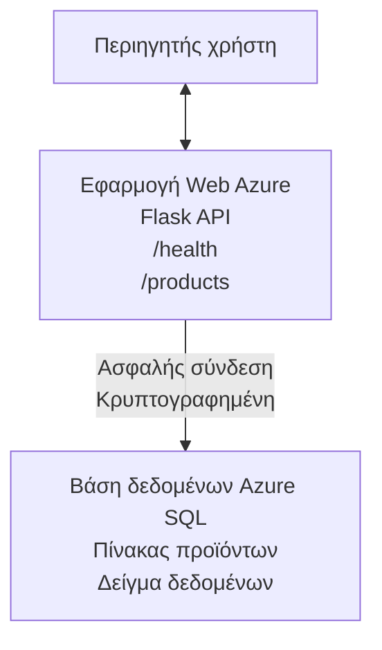

# Ανάπτυξη βάσης δεδομένων Microsoft SQL και Web App με AZD

⏱️ **Εκτιμώμενος Χρόνος**: 20-30 λεπτά | 💰 **Εκτιμώμενο Κόστος**: ~$15-25/μήνα | ⭐ **Πολυπλοκότητα**: Ενδιάμεσο

Αυτό το **πλήρες, λειτουργικό παράδειγμα** δείχνει πώς να χρησιμοποιήσετε το [Azure Developer CLI (azd)](https://learn.microsoft.com/azure/developer/azure-developer-cli/) για να αναπτύξετε μια web εφαρμογή Python Flask με μια βάση δεδομένων Microsoft SQL στο Azure. Όλος ο κώδικας περιλαμβάνεται και έχει ελεγχθεί — δεν απαιτούνται εξωτερικές εξαρτήσεις.

## Τι θα μάθετε

Με την ολοκλήρωση αυτού του παραδείγματος, θα:
- Αναπτύξετε μια εφαρμογή πολλαπλών επιπέδων (web app + βάση δεδομένων) χρησιμοποιώντας υποδομή ως κώδικα
- Διαμορφώσετε ασφαλείς συνδέσεις βάσης δεδομένων χωρίς ενσωμάτωση μυστικών στον κώδικα
- Παρακολουθήσετε την υγεία της εφαρμογής με το Application Insights
- Διαχειριστείτε πόρους Azure αποδοτικά με το AZD CLI
- Ακολουθήσετε τις βέλτιστες πρακτικές του Azure για ασφάλεια, βελτιστοποίηση κόστους και παρατηρησιμότητα

## Επισκόπηση Σεναρίου
- **Web App**: REST API με Python Flask και σύνδεση σε βάση δεδομένων
- **Database**: Azure SQL Database με δείγμα δεδομένων
- **Infrastructure**: Παρέχεται μέσω Bicep (αρθρωτά, επαναχρησιμοποιήσιμα πρότυπα)
- **Deployment**: Πλήρως αυτοματοποιημένο με εντολές `azd`
- **Monitoring**: Application Insights για logs και τηλεμετρία

## Προαπαιτούμενα

### Απαιτούμενα Εργαλεία

Πριν ξεκινήσετε, επιβεβαιώστε ότι έχετε εγκατεστημένα αυτά τα εργαλεία:

1. **[Azure CLI](https://learn.microsoft.com/cli/azure/install-azure-cli)** (έκδοση 2.50.0 ή νεότερη)
   ```sh
   az --version
   # Αναμενόμενη έξοδος: azure-cli 2.50.0 ή νεότερη έκδοση
   ```

2. **[Azure Developer CLI (azd)](https://learn.microsoft.com/azure/developer/azure-developer-cli/install-azd)** (έκδοση 1.0.0 ή νεότερη)
   ```sh
   azd version
   # Αναμενόμενη έξοδος: azd έκδοση 1.0.0 ή νεότερη
   ```

3. **[Python 3.8+](https://www.python.org/downloads/)** (για τοπική ανάπτυξη)
   ```sh
   python --version
   # Αναμενόμενη έξοδος: Python 3.8 ή νεότερη
   ```

4. **[Docker](https://www.docker.com/get-started)** (προαιρετικό, για τοπική ανάπτυξη σε container)
   ```sh
   docker --version
   # Αναμενόμενη έξοδος: Docker έκδοση 20.10 ή νεότερη
   ```

### Απαιτήσεις Azure

- Μια ενεργή **συνδρομή Azure** ([δημιουργήστε ένα δωρεάν λογαριασμό](https://azure.microsoft.com/free/))
- Δικαιώματα για δημιουργία πόρων στη συνδρομή σας
- Ρόλος **Owner** ή **Contributor** στη συνδρομή ή στο resource group

### Προαπαιτούμενες Γνώσεις

Αυτό είναι ένα παράδειγμα **μεσαίου επιπέδου**. Θα πρέπει να είστε εξοικειωμένοι με:
- Βασικές εργασίες στη γραμμή εντολών
- Βασικές έννοιες cloud (resources, ομάδες πόρων)
- Βασική κατανόηση web εφαρμογών και βάσεων δεδομένων

**Νέος στο AZD;** Ξεκινήστε με τον [Getting Started guide](../../docs/chapter-01-foundation/azd-basics.md) πρώτα.

## Αρχιτεκτονική

Αυτό το παράδειγμα αναπτύσσει μια αρχιτεκτονική δύο επιπέδων με μια web εφαρμογή και μια βάση δεδομένων:



**Resource Deployment:**
- **Resource Group**: Δοχείο για όλους τους πόρους
- **App Service Plan**: Φιλοξενία βασισμένη σε Linux (B1 tier για οικονομία κόστους)
- **Web App**: Runtime Python 3.11 με εφαρμογή Flask
- **SQL Server**: Διαχειριζόμενος διακομιστής βάσης δεδομένων με TLS 1.2 ως ελάχιστο
- **SQL Database**: Basic tier (2GB, κατάλληλο για ανάπτυξη/δοκιμές)
- **Application Insights**: Παρακολούθηση και καταγραφή
- **Log Analytics Workspace**: Κεντρική αποθήκευση αρχείων καταγραφής

**Αναλογία**: Σκεφτείτε το σαν ένα εστιατόριο (web app) με μια ψυκτική αποθήκη (βάση δεδομένων). Οι πελάτες παραγγέλνουν από το μενού (API endpoints), και η κουζίνα (Flask app) παίρνει υλικά (δεδομένα) από την αποθήκη. Ο διευθυντής του εστιατορίου (Application Insights) παρακολουθεί τα πάντα που συμβαίνουν.

## Δομή Φακέλων

Όλα τα αρχεία περιλαμβάνονται σε αυτό το παράδειγμα—δεν απαιτούνται εξωτερικές εξαρτήσεις:

```
examples/database-app/
│
├── README.md                    # This file
├── azure.yaml                   # AZD configuration file
├── .env.sample                  # Sample environment variables
├── .gitignore                   # Git ignore patterns
│
├── infra/                       # Infrastructure as Code (Bicep)
│   ├── main.bicep              # Main orchestration template
│   ├── abbreviations.json      # Azure naming conventions
│   └── resources/              # Modular resource templates
│       ├── sql-server.bicep    # SQL Server configuration
│       ├── sql-database.bicep  # Database configuration
│       ├── app-service-plan.bicep  # Hosting plan
│       ├── app-insights.bicep  # Monitoring setup
│       └── web-app.bicep       # Web application
│
└── src/
    └── web/                    # Application source code
        ├── app.py              # Flask REST API
        ├── requirements.txt    # Python dependencies
        └── Dockerfile          # Container definition
```

**Τι κάνει κάθε αρχείο:**
- **azure.yaml**: Ενημερώνει το AZD τι να αναπτύξει και πού
- **infra/main.bicep**: Ορχηστρώνει όλους τους πόρους Azure
- **infra/resources/*.bicep**: Ατομικοί ορισμοί πόρων (αρθρωτοί για επαναχρησιμοποίηση)
- **src/web/app.py**: Εφαρμογή Flask με λογική βάσης δεδομένων
- **requirements.txt**: Εξαρτήσεις πακέτων Python
- **Dockerfile**: Οδηγίες containerization για ανάπτυξη

## Γρήγορη Εκκίνηση (Βήμα-βήμα)

### Βήμα 1: Κλωνοποίηση και Πλοήγηση

```sh
git clone https://github.com/microsoft/AZD-for-beginners.git
cd AZD-for-beginners/examples/database-app
```

**✓ Έλεγχος Επιτυχίας**: Επιβεβαιώστε ότι βλέπετε `azure.yaml` και τον φάκελο `infra/`:
```sh
ls
# Αναμενόμενα: README.md, azure.yaml, infra/, src/
```

### Βήμα 2: Επαλήθευση ταυτότητας με το Azure

```sh
azd auth login
```

Αυτό ανοίγει το πρόγραμμα περιήγησής σας για επαλήθευση ταυτότητας στο Azure. Συνδεθείτε με τα διαπιστευτήρια Azure σας.

**✓ Έλεγχος Επιτυχίας**: Θα πρέπει να δείτε:
```
Logged in to Azure.
```

### Βήμα 3: Αρχικοποίηση του Περιβάλλοντος

```sh
azd init
```

**Τι συμβαίνει**: Το AZD δημιουργεί μια τοπική διαμόρφωση για την ανάπτυξή σας.

**Ερωτήσεις που θα δείτε**:
- **Environment name**: Εισάγετε ένα σύντομο όνομα (π.χ., `dev`, `myapp`)
- **Azure subscription**: Επιλέξτε τη συνδρομή σας από τη λίστα
- **Azure location**: Επιλέξτε μια περιοχή (π.χ., `eastus`, `westeurope`)

**✓ Έλεγχος Επιτυχίας**: Θα πρέπει να δείτε:
```
SUCCESS: New project initialized!
```

### Βήμα 4: Παροχή Πόρων Azure

```sh
azd provision
```

**Τι συμβαίνει**: Το AZD αναπτύσσει ολόκληρη την υποδομή (διαρκεί 5-8 λεπτά):
1. Δημιουργεί ομάδα πόρων
2. Δημιουργεί SQL Server και Database
3. Δημιουργεί App Service Plan
4. Δημιουργεί Web App
5. Δημιουργεί Application Insights
6. Διαμορφώνει δικτύωση και ασφάλεια

**Θα σας ζητηθούν τα εξής**:
- **SQL admin username**: Εισάγετε ένα όνομα χρήστη (π.χ., `sqladmin`)
- **SQL admin password**: Εισάγετε έναν ισχυρό κωδικό πρόσβασης (αποθηκεύστε τον!)

**✓ Έλεγχος Επιτυχίας**: Θα πρέπει να δείτε:
```
SUCCESS: Your application was provisioned in Azure in X minutes Y seconds.
You can view the resources created under the resource group rg-<env-name> in Azure Portal:
https://portal.azure.com/#@/resource/subscriptions/.../resourceGroups/rg-<env-name>
```

**⏱️ Χρόνος**: 5-8 λεπτά

### Βήμα 5: Ανάπτυξη της Εφαρμογής

```sh
azd deploy
```

**Τι συμβαίνει**: Το AZD χτίζει και αναπτύσσει την εφαρμογή Flask σας:
1. Συσκευάζει την εφαρμογή Python
2. Δημιουργεί το Docker container
3. Ανεβάζει στο Azure Web App
4. Αρχικοποιεί τη βάση δεδομένων με δείγμα δεδομένων
5. Εκκινεί την εφαρμογή

**✓ Έλεγχος Επιτυχίας**: Θα πρέπει να δείτε:
```
SUCCESS: Your application was deployed to Azure in X minutes Y seconds.
You can view the resources created under the resource group rg-<env-name> in Azure Portal:
https://portal.azure.com/#@/resource/subscriptions/.../resourceGroups/rg-<env-name>
```

**⏱️ Χρόνος**: 3-5 λεπτά

### Βήμα 6: Περιήγηση στην Εφαρμογή

```sh
azd browse
```

Αυτό ανοίγει την αναπτυγμένη web εφαρμογή σας στο πρόγραμμα περιήγησης στη διεύθυνση `https://app-<unique-id>.azurewebsites.net`

**✓ Έλεγχος Επιτυχίας**: Θα πρέπει να δείτε έξοδο JSON:
```json
{
  "message": "Welcome to the Database App API",
  "endpoints": {
    "/": "This help message",
    "/health": "Health check endpoint",
    "/products": "List all products",
    "/products/<id>": "Get product by ID"
  }
}
```

### Βήμα 7: Δοκιμάστε τα API Endpoints

**Έλεγχος Υγείας** (επιβεβαίωση σύνδεσης με τη βάση δεδομένων):
```sh
curl https://app-<your-id>.azurewebsites.net/health
```

**Αναμενόμενη Απάντηση**:
```json
{
  "status": "healthy",
  "database": "connected"
}
```

**Λίστα Προϊόντων** (δείγμα δεδομένων):
```sh
curl https://app-<your-id>.azurewebsites.net/products
```

**Αναμενόμενη Απάντηση**:
```json
[
  {
    "id": 1,
    "name": "Laptop",
    "description": "High-performance laptop",
    "price": 1299.99,
    "created_at": "2025-11-19T10:30:00"
  },
  ...
]
```

**Λήψη Ενός Προϊόντος**:
```sh
curl https://app-<your-id>.azurewebsites.net/products/1
```

**✓ Έλεγχος Επιτυχίας**: Όλα τα endpoints επιστρέφουν δεδομένα JSON χωρίς σφάλματα.

---

**🎉 Συγχαρητήρια!** Έχετε αναπτύξει με επιτυχία μια web εφαρμογή με βάση δεδομένων στο Azure χρησιμοποιώντας το AZD.

## Βαθύτερη Εξέταση Διαμόρφωσης

### Μεταβλητές Περιβάλλοντος

Τα μυστικά διαχειρίζονται με ασφάλεια μέσω της διαμόρφωσης του Azure App Service — **μην τα ενσωματώνετε ποτέ στον πηγαίο κώδικα**.

**Διαμορφώνονται αυτόματα από το AZD**:
- `SQL_CONNECTION_STRING`: Σύνδεση βάσης δεδομένων με κρυπτογραφημένα διαπιστευτήρια
- `APPLICATIONINSIGHTS_CONNECTION_STRING`: Τερματικό τηλεμετρίας για παρακολούθηση
- `SCM_DO_BUILD_DURING_DEPLOYMENT`: Ενεργοποιεί αυτόματη εγκατάσταση εξαρτήσεων

**Πού αποθηκεύονται τα μυστικά**:
1. Κατά τη διάρκεια του `azd provision`, παρέχετε τα SQL διαπιστευτήρια μέσω ασφαλών προτροπών
2. Το AZD τα αποθηκεύει στο τοπικό αρχείο `.azure/<env-name>/.env` (αγνοείται από το git)
3. Το AZD τα εισάγει στη διαμόρφωση του Azure App Service (κρυπτογραφημένα σε κατάσταση ανάπαυσης)
4. Η εφαρμογή τα διαβάζει μέσω `os.getenv()` κατά την εκτέλεση

### Τοπική Ανάπτυξη

Για τοπικό έλεγχο, δημιουργήστε ένα αρχείο `.env` από το δείγμα:

```sh
cp .env.sample .env
# Επεξεργαστείτε το αρχείο .env ώστε να περιέχει τη σύνδεση στην τοπική βάση δεδομένων σας
```

**Διεργασία Τοπικής Ανάπτυξης**:
```sh
# Εγκαταστήστε τις εξαρτήσεις
cd src/web
pip install -r requirements.txt

# Ορίστε τις μεταβλητές περιβάλλοντος
export SQL_CONNECTION_STRING="your-local-connection-string"

# Εκτελέστε την εφαρμογή
python app.py
```

**Δοκιμάστε το τοπικά**:
```sh
curl http://localhost:8000/health
# Αναμενόμενο: {"status": "healthy", "database": "connected"}
```

### Υποδομή ως Κώδικας

Όλοι οι πόροι Azure ορίζονται σε **Bicep templates** (`infra/` folder):

- **Modular Design**: Κάθε τύπος πόρου έχει το δικό του αρχείο για επαναχρησιμοποίηση
- **Parameterized**: Προσαρμόστε SKUs, περιοχές, συμβάσεις ονομάτων
- **Best Practices**: Ακολουθεί τα πρότυπα ονοματοδοσίας του Azure και τις προεπιλογές ασφάλειας
- **Version Controlled**: Οι αλλαγές στην υποδομή παρακολουθούνται στο Git

**Παράδειγμα Προσαρμογής**:
Για να αλλάξετε το επίπεδο της βάσης δεδομένων, επεξεργαστείτε το `infra/resources/sql-database.bicep`:
```bicep
sku: {
  name: 'Standard'  // Changed from 'Basic'
  tier: 'Standard'
  capacity: 10
}
```

## Βέλτιστες Πρακτικές Ασφαλείας

Αυτό το παράδειγμα ακολουθεί τις βέλτιστες πρακτικές ασφαλείας του Azure:

### 1. **Καμία αποθήκευση μυστικών στον πηγαίο κώδικα**
- ✅ Τα διαπιστευτήρια αποθηκεύονται στη διαμόρφωση του Azure App Service (κρυπτογραφημένα)
- ✅ Τα αρχεία `.env` εξαιρούνται από το Git μέσω του `.gitignore`
- ✅ Τα μυστικά μεταβιβάζονται μέσω ασφαλών παραμέτρων κατά την παροχή

### 2. **Κρυπτογραφημένες Συνδέσεις**
- ✅ TLS 1.2 ως ελάχιστο για το SQL Server
- ✅ Επιβολή μόνο HTTPS για το Web App
- ✅ Οι συνδέσεις στη βάση δεδομένων χρησιμοποιούν κρυπτογραφημένα κανάλια

### 3. **Ασφάλεια Δικτύου**
- ✅ Τείχος προστασίας SQL Server διαμορφωμένο να επιτρέπει μόνο υπηρεσίες Azure
- ✅ Η δημόσια πρόσβαση δικτύου περιορίζεται (μπορεί να κλειδωθεί περαιτέρω με Private Endpoints)
- ✅ Το FTPS απενεργοποιημένο στο Web App

### 4. **Αυθεντικοποίηση & Εξουσιοδότηση**
- ⚠️ **Τρέχον**: SQL authentication (username/password)
- ✅ **Σύσταση για Παραγωγή**: Χρησιμοποιήστε Azure Managed Identity για αυθεντικοποίηση χωρίς κωδικό πρόσβασης

**Για Αναβάθμιση σε Managed Identity** (για παραγωγή):
1. Ενεργοποιήστε managed identity στο Web App
2. Παραχωρήστε στην ταυτότητα δικαιώματα στο SQL
3. Ενημερώστε το connection string για να χρησιμοποιεί managed identity
4. Αφαιρέστε την αυθεντικοποίηση με κωδικό πρόσβασης

### 5. **Έλεγχος & Συμμόρφωση**
- ✅ Το Application Insights καταγράφει όλα τα αιτήματα και τα σφάλματα
- ✅ Ο έλεγχος δραστηριοτήτων της SQL Database είναι ενεργοποιημένος (μπορεί να διαμορφωθεί για συμμόρφωση)
- ✅ Όλοι οι πόροι έχουν ετικέτες για διακυβέρνηση

**Λίστα Ελέγχου Ασφαλείας πριν την Παραγωγή**:
- [ ] Ενεργοποιήστε το Azure Defender για SQL
- [ ] Διαμορφώστε Private Endpoints για τη SQL Database
- [ ] Ενεργοποιήστε Web Application Firewall (WAF)
- [ ] Υλοποιήστε Azure Key Vault για περιστροφή μυστικών
- [ ] Διαμορφώστε αυθεντικοποίηση Microsoft Entra ID
- [ ] Ενεργοποιήστε διαγνωστική καταγραφή για όλους τους πόρους

## Βελτιστοποίηση Κόστους

**Εκτιμώμενα Μηνιαία Κόστη** (κατά τον Νοέμβριο 2025):

| Πόρος | SKU/Επίπεδο | Εκτιμώμενο Κόστος |
|----------|----------|----------------|
| App Service Plan | B1 (Basic) | ~$13/μήνα |
| SQL Database | Basic (2GB) | ~$5/μήνα |
| Application Insights | Pay-as-you-go | ~$2/μήνα (χαμηλή κυκλοφορία) |
| **Σύνολο** | | **~$20/μήνα** |

**💡 Συμβουλές Εξοικονόμησης Κόστους**:

1. **Χρησιμοποιήστε το Free Tier για μάθηση**:
   - App Service: F1 tier (δωρεάν, περιορισμένες ώρες)
   - SQL Database: Χρησιμοποιήστε Azure SQL Database serverless
   - Application Insights: 5GB/μήνα δωρεάν εισαγωγή

2. **Stop Resources When Not in Use**:
   ```sh
   # Διακόψτε την εφαρμογή ιστού (η χρέωση για τη βάση δεδομένων συνεχίζεται)
   az webapp stop --name <app-name> --resource-group <rg-name>
   
   # Επανεκκινήστε όταν χρειάζεται
   az webapp start --name <app-name> --resource-group <rg-name>
   ```

3. **Διαγράψτε τα πάντα μετά τις δοκιμές**:
   ```sh
   azd down
   ```
   Αυτό αφαιρεί ΟΛΟΥΣ τους πόρους και σταματά τις χρεώσεις.

4. **SKUs για Ανάπτυξη vs Παραγωγή**:
   - **Development**: Basic tier (χρησιμοποιείται σε αυτό το παράδειγμα)
   - **Production**: Standard/Premium tier με πλεονασμό

**Παρακολούθηση Κόστους**:
- Δείτε κόστη στο [Azure Cost Management](https://portal.azure.com/#view/Microsoft_Azure_CostManagement)
- Ρυθμίστε ειδοποιήσεις κόστους για να αποφύγετε εκπλήξεις
- Επισυνάψτε ετικέτες σε όλους τους πόρους με `azd-env-name` για παρακολούθηση

**Εναλλακτική Δωρεάν Επιλογή**:
Για σκοπούς εκμάθησης, μπορείτε να τροποποιήσετε το `infra/resources/app-service-plan.bicep`:
```bicep
sku: {
  name: 'F1'  // Free tier
  tier: 'Free'
}
```
**Σημείωση**: Το δωρεάν επίπεδο έχει περιορισμούς (60 λεπτά/ημέρα CPU, χωρίς always-on).

## Παρακολούθηση & Παρατηρησιμότητα

### Ενσωμάτωση Application Insights

Αυτό το παράδειγμα περιλαμβάνει **Application Insights** για ολοκληρωμένη παρακολούθηση:

**Τι παρακολουθείται**:
- ✅ Αιτήματα HTTP (καθυστέρηση, κωδικοί κατάστασης, endpoints)
- ✅ Σφάλματα και εξαιρέσεις της εφαρμογής
- ✅ Προσαρμοσμένη καταγραφή από την εφαρμογή Flask
- ✅ Υγεία σύνδεσης βάσης δεδομένων
- ✅ Μετρήσεις απόδοσης (CPU, μνήμη)

**Πρόσβαση στο Application Insights**:
1. Ανοίξτε το [Azure Portal](https://portal.azure.com)
2. Μεταβείτε στην ομάδα πόρων σας (`rg-<env-name>`)
3. Κάντε κλικ στον πόρο Application Insights (`appi-<unique-id>`)

**Χρήσιμες Ερωτήσεις** (Application Insights → Logs):

**Προβολή Όλων των Αιτημάτων**:
```kusto
requests
| where timestamp > ago(1h)
| order by timestamp desc
| project timestamp, name, url, resultCode, duration
```

**Εύρεση Σφαλμάτων**:
```kusto
exceptions
| where timestamp > ago(24h)
| order by timestamp desc
| project timestamp, type, outerMessage, operation_Name
```

**Έλεγχος Endpoint Υγείας**:
```kusto
requests
| where name contains "health"
| summarize count() by resultCode, bin(timestamp, 1h)
```

### Έλεγχος SQL Database

**Ο έλεγχος της SQL Database είναι ενεργοποιημένος** για παρακολούθηση:
- Πρότυπα πρόσβασης στη βάση δεδομένων
- Αποτυχημένες προσπάθειες σύνδεσης
- Αλλαγές στο σχήμα
- Πρόσβαση σε δεδομένα (για συμμόρφωση)

**Πρόσβαση στα Αρχεία Ελέγχου**:
1. Azure Portal → SQL Database → Auditing
2. Προβολή καταγραφών στο Log Analytics workspace

### Παρακολούθηση σε Πραγματικό Χρόνο

**Προβολή Ζωντανών Μετρήσεων**:
1. Application Insights → Live Metrics
2. Δείτε αιτήματα, αποτυχίες και απόδοση σε πραγματικό χρόνο

**Ρύθμιση Ειδοποιήσεων**:
Δημιουργήστε ειδοποιήσεις για κρίσιμα γεγονότα:
- Σφάλματα HTTP 500 > 5 σε 5 λεπτά
- Αποτυχίες σύνδεσης στη βάση δεδομένων
- Υψηλοί χρόνοι απόκρισης (>2 δευτερόλεπτα)

**Παράδειγμα Δημιουργίας Ειδοποίησης**:
```sh
az monitor metrics alert create \
  --name "High-Response-Time" \
  --resource-group <rg-name> \
  --scopes <app-insights-resource-id> \
  --condition "avg requests/duration > 2000" \
  --description "Alert when response time exceeds 2 seconds"
```

## Επίλυση Προβλημάτων
### Συνηθισμένα Προβλήματα και Λύσεις

#### 1. `azd provision` αποτυγχάνει με "Location not available"

**Σύμπτωμα**:
```
Error: The subscription is not registered for the resource type 'components' in the location 'centralus'.
```

**Λύση**:
Επιλέξτε άλλη περιοχή Azure ή εγγράψτε τον πάροχο πόρων:
```sh
az provider register --namespace Microsoft.Insights
```

#### 2. Σφάλμα Σύνδεσης SQL κατά την Ανάπτυξη

**Σύμπτωμα**:
```
pyodbc.OperationalError: ('08001', '[08001] [Microsoft][ODBC Driver 18 for SQL Server]TCP Provider...')
```

**Λύση**:
- Επαληθεύστε ότι το firewall του SQL Server επιτρέπει τις υπηρεσίες Azure (ρυθμίζεται αυτόματα)
- Ελέγξτε ότι ο κωδικός διαχειριστή SQL εισήχθη σωστά κατά το `azd provision`
- Βεβαιωθείτε ότι ο SQL Server έχει ολοκληρώσει την παροχή (μπορεί να χρειαστεί 2-3 λεπτά)

**Επαλήθευση Σύνδεσης**:
```sh
# Από το Azure Portal, μεταβείτε στο SQL Database → Επεξεργαστής ερωτημάτων
# Προσπαθήστε να συνδεθείτε με τα διαπιστευτήριά σας
```

#### 3. Η Web App εμφανίζει "Application Error"

**Σύμπτωμα**:
Ο περιηγητής εμφανίζει γενικό μήνυμα σφάλματος.

**Λύση**:
Ελέγξτε τα αρχεία καταγραφής της εφαρμογής:
```sh
# Προβολή πρόσφατων καταγραφών
az webapp log tail --name <app-name> --resource-group <rg-name>
```

**Συνηθισμένες αιτίες**:
- Ελλείπουσες μεταβλητές περιβάλλοντος (ελέγξτε App Service → Configuration)
- Η εγκατάσταση πακέτων Python απέτυχε (ελέγξτε τα αρχεία καταγραφής ανάπτυξης)
- Σφάλμα αρχικοποίησης βάσης δεδομένων (ελέγξτε τη συνδεσιμότητα SQL)

#### 4. `azd deploy` Αποτυγχάνει με "Build Error"

**Σύμπτωμα**:
```
Error: Failed to build project
```

**Λύση**:
- Βεβαιωθείτε ότι το `requirements.txt` δεν περιέχει συντακτικά σφάλματα
- Ελέγξτε ότι η Python 3.11 έχει καθοριστεί στο `infra/resources/web-app.bicep`
- Επαληθεύστε ότι το Dockerfile έχει σωστή βασική εικόνα

**Αντιμετώπιση τοπικά**:
```sh
cd src/web
docker build -t test-app .
docker run -p 8000:8000 test-app
```

#### 5. "Unauthorized" κατά την εκτέλεση εντολών AZD

**Σύμπτωμα**:
```
ERROR: (Unauthorized) The client '<id>' with object id '<id>' does not have authorization
```

**Λύση**:
Επανα-εισέλθετε στο Azure:
```sh
# Απαραίτητο για τις ροές εργασίας του AZD
azd auth login

# Προαιρετικό αν χρησιμοποιείτε επίσης απευθείας εντολές του Azure CLI
az login
```

Επαληθεύστε ότι έχετε τα σωστά δικαιώματα (ρόλος Contributor) στο subscription.

#### 6. Υψηλό Κόστος Βάσης Δεδομένων

**Σύμπτωμα**:
Απροσδόκητος λογαριασμός Azure.

**Λύση**:
- Ελέγξτε αν ξεχάσατε να εκτελέσετε `azd down` μετά τις δοκιμές
- Επαληθεύστε ότι η SQL Database χρησιμοποιεί το επίπεδο Basic (όχι Premium)
- Εξετάστε τα κόστη στο Azure Cost Management
- Ρυθμίστε ειδοποιήσεις κόστους

### Λήψη Βοήθειας

**Προβολή όλων των μεταβλητών περιβάλλοντος AZD**:
```sh
azd env get-values
```

**Έλεγχος κατάστασης ανάπτυξης**:
```sh
az webapp show --name <app-name> --resource-group <rg-name> --query state
```

**Πρόσβαση σε αρχεία καταγραφής εφαρμογής**:
```sh
az webapp log download --name <app-name> --resource-group <rg-name> --log-file app-logs.zip
```

**Χρειάζεστε περισσότερη βοήθεια;**
- [Οδηγός αντιμετώπισης προβλημάτων AZD](../../docs/chapter-07-troubleshooting/common-issues.md)
- [Troubleshooting Azure App Service](https://learn.microsoft.com/azure/app-service/troubleshoot-diagnostic-logs)
- [Troubleshooting Azure SQL](https://learn.microsoft.com/azure/azure-sql/database/troubleshoot-common-errors-issues)

## Πρακτικές Ασκήσεις

### Άσκηση 1: Επαλήθευση της Ανάπτυξής Σας (Αρχάριος)

**Στόχος**: Επιβεβαιώστε ότι όλοι οι πόροι έχουν αναπτυχθεί και η εφαρμογή λειτουργεί.

**Βήματα**:
1. Λίστα όλων των πόρων στο resource group σας:
   ```sh
   az resource list --resource-group rg-<env-name> --output table
   ```
   **Αναμενόμενο**: 6-7 πόροι (Web App, SQL Server, SQL Database, App Service Plan, Application Insights, Log Analytics)

2. Δοκιμάστε όλα τα API endpoints:
   ```sh
   curl https://app-<your-id>.azurewebsites.net/
   curl https://app-<your-id>.azurewebsites.net/health
   curl https://app-<your-id>.azurewebsites.net/products
   curl https://app-<your-id>.azurewebsites.net/products/1
   ```
   **Αναμενόμενο**: Όλα επιστρέφουν έγκυρο JSON χωρίς σφάλματα

3. Ελέγξτε το Application Insights:
   - Πλοηγηθείτε στο Application Insights στο Azure Portal
   - Μεταβείτε στο "Live Metrics"
   - Ανανέωση του προγράμματος περιήγησης στη web app
   **Αναμενόμενο**: Να εμφανίζονται αιτήματα σε πραγματικό χρόνο

**Κριτήρια Επιτυχίας**: Όλοι οι 6-7 πόροι υπάρχουν, όλα τα endpoints επιστρέφουν δεδομένα, τα Live Metrics δείχνουν δραστηριότητα.

---

### Άσκηση 2: Προσθήκη νέου API Endpoint (Ενδιάμεσο)

**Στόχος**: Επεκτείνετε την εφαρμογή Flask με ένα νέο endpoint.

**Αρχικό Κώδικα**: Τρέχοντα endpoints στο `src/web/app.py`

**Βήματα**:
1. Επεξεργαστείτε το `src/web/app.py` και προσθέστε ένα νέο endpoint μετά τη συνάρτηση `get_product()`:
   ```python
   @app.route('/products/search/<keyword>')
   def search_products(keyword):
       """Search products by name or description."""
       try:
           conn = get_db_connection()
           cursor = conn.cursor()
           cursor.execute(
               "SELECT id, name, description, price, created_at FROM products WHERE name LIKE ? OR description LIKE ?",
               (f'%{keyword}%', f'%{keyword}%')
           )
           
           products = []
           for row in cursor.fetchall():
               products.append({
                   'id': row[0],
                   'name': row[1],
                   'description': row[2],
                   'price': float(row[3]) if row[3] else None,
                   'created_at': row[4].isoformat() if row[4] else None
               })
           
           cursor.close()
           conn.close()
           
           logger.info(f"Search for '{keyword}' returned {len(products)} results")
           return jsonify(products), 200
           
       except Exception as e:
           logger.error(f"Error searching products: {str(e)}")
           return jsonify({'error': str(e)}), 500
   ```

2. Αναπτύξτε την ενημερωμένη εφαρμογή:
   ```sh
   azd deploy
   ```

3. Δοκιμάστε το νέο endpoint:
   ```sh
   curl https://app-<your-id>.azurewebsites.net/products/search/laptop
   ```
   **Αναμενόμενο**: Επιστρέφει προϊόντα που ταιριάζουν με "laptop"

**Κριτήρια Επιτυχίας**: Το νέο endpoint λειτουργεί, επιστρέφει φιλτραρισμένα αποτελέσματα, εμφανίζεται στα logs του Application Insights.

---

### Άσκηση 3: Προσθήκη Παρακολούθησης και Ειδοποιήσεων (Προχωρημένο)

**Στόχος**: Ρυθμίστε προληπτική παρακολούθηση με ειδοποιήσεις.

**Βήματα**:
1. Δημιουργήστε μια ειδοποίηση για σφάλματα HTTP 500:
   ```sh
   # Λήψη αναγνωριστικού πόρου του Application Insights
   AI_ID=$(az monitor app-insights component show \
     --app appi-<your-id> \
     --resource-group rg-<env-name> \
     --query id -o tsv)
   
   # Δημιουργία ειδοποίησης
   az monitor metrics alert create \
     --name "High-Error-Rate" \
     --resource-group rg-<env-name> \
     --scopes $AI_ID \
     --condition "count requests/failed > 5" \
     --window-size 5m \
     --evaluation-frequency 1m \
     --description "Alert when >5 failed requests in 5 minutes"
   ```

2. Προκαλέστε την ειδοποίηση δημιουργώντας σφάλματα:
   ```sh
   # Ζητήστε ένα μη υπάρχον προϊόν
   for i in {1..10}; do curl https://app-<your-id>.azurewebsites.net/products/999; done
   ```

3. Ελέγξτε αν η ειδοποίηση ενεργοποιήθηκε:
   - Azure Portal → Alerts → Alert Rules
   - Ελέγξτε το email σας (αν έχει ρυθμιστεί)

**Κριτήρια Επιτυχίας**: Ο κανόνας ειδοποίησης έχει δημιουργηθεί, ενεργοποιείται σε σφάλματα, λαμβάνονται ειδοποιήσεις.

---

### Άσκηση 4: Αλλαγές Σχήματος Βάσης Δεδομένων (Προχωρημένο)

**Στόχος**: Προσθέστε έναν νέο πίνακα και τροποποιήστε την εφαρμογή για να τον χρησιμοποιεί.

**Βήματα**:
1. Συνδεθείτε στη SQL Database μέσω του Azure Portal Query Editor

2. Δημιουργήστε έναν νέο πίνακα `categories`:
   ```sql
   CREATE TABLE categories (
       id INT PRIMARY KEY IDENTITY(1,1),
       name NVARCHAR(50) NOT NULL,
       description NVARCHAR(200)
   );
   
   INSERT INTO categories (name, description) VALUES
   ('Electronics', 'Electronic devices and accessories'),
   ('Office Supplies', 'Office equipment and supplies');
   
   -- Add category to products table
   ALTER TABLE products ADD category_id INT;
   UPDATE products SET category_id = 1; -- Set all to Electronics
   ```

3. Ενημερώστε το `src/web/app.py` για να συμπεριλαμβάνει πληροφορίες κατηγορίας στις απαντήσεις

4. Αναπτύξτε και δοκιμάστε

**Κριτήρια Επιτυχίας**: Ο νέος πίνακας υπάρχει, τα προϊόντα εμφανίζουν πληροφορίες κατηγορίας, η εφαρμογή λειτουργεί κανονικά.

---

### Άσκηση 5: Εφαρμογή Caching (Ειδικός)

**Στόχος**: Προσθέστε Azure Redis Cache για βελτίωση της απόδοσης.

**Βήματα**:
1. Προσθέστε Redis Cache στο `infra/main.bicep`
2. Ενημερώστε το `src/web/app.py` για να κάνει caching τα queries προϊόντων
3. Μετρήστε τη βελτίωση της απόδοσης με το Application Insights
4. Συγκρίνετε τους χρόνους απόκρισης πριν/μετά το caching

**Κριτήρια Επιτυχίας**: Το Redis έχει αναπτυχθεί, το caching λειτουργεί, οι χρόνοι απόκρισης βελτιώνονται κατά >50%.

**Υπόδειξη**: Ξεκινήστε με την [Τεκμηρίωση Azure Cache for Redis](https://learn.microsoft.com/azure/azure-cache-for-redis/).

---

## Καθαρισμός

Για να αποφύγετε συνεχιζόμενες χρεώσεις, διαγράψτε όλους τους πόρους όταν ολοκληρώσετε:

```sh
azd down
```

**Επιβεβαίωση**:
```
? Total resources to delete: 7, are you sure you want to continue? (y/N)
```

Πληκτρολογήστε `y` για επιβεβαίωση.

**✓ Έλεγχος Επιτυχίας**: 
- Όλοι οι πόροι έχουν διαγραφεί από το Azure Portal
- Δεν υπάρχουν συνεχιζόμενες χρεώσεις
- Ο τοπικός φάκελος `.azure/<env-name>` μπορεί να διαγραφεί

**Εναλλακτική** (κρατήστε την υποδομή, διαγράψτε τα δεδομένα):
```sh
# Διαγράψτε μόνο την ομάδα πόρων (κρατήστε τη διαμόρφωση AZD)
az group delete --name rg-<env-name> --yes
```
## Μάθετε περισσότερα

### Σχετική Τεκμηρίωση
- [Azure Developer CLI Documentation](https://learn.microsoft.com/azure/developer/azure-developer-cli/)
- [Azure SQL Database Documentation](https://learn.microsoft.com/azure/azure-sql/database/)
- [Azure App Service Documentation](https://learn.microsoft.com/azure/app-service/)
- [Application Insights Documentation](https://learn.microsoft.com/azure/azure-monitor/app/app-insights-overview)
- [Bicep Language Reference](https://learn.microsoft.com/azure/azure-resource-manager/bicep/)

### Επόμενα Βήματα σε Αυτό το Μάθημα
- **[Παράδειγμα Container Apps](../../../../examples/container-app)**: Αναπτύξτε μικροϋπηρεσίες με Azure Container Apps
- **[Οδηγός Ενσωμάτωσης AI](../../../../docs/ai-foundry)**: Προσθέστε δυνατότητες AI στην εφαρμογή σας
- **[Βέλτιστες Πρακτικές Ανάπτυξης](../../docs/chapter-04-infrastructure/deployment-guide.md)**: Πρότυπα ανάπτυξης για παραγωγή

### Προχωρημένα Θέματα
- **Managed Identity**: Αφαιρέστε κωδικούς πρόσβασης και χρησιμοποιήστε Microsoft Entra ID authentication
- **Private Endpoints**: Ασφαλίστε τις συνδέσεις βάσης δεδομένων εντός virtual network
- **CI/CD Integration**: Αυτοματοποιήστε τις αναπτύξεις με GitHub Actions ή Azure DevOps
- **Multi-Environment**: Ρυθμίστε περιβάλλοντα dev, staging και production
- **Database Migrations**: Χρησιμοποιήστε Alembic ή Entity Framework για διαχείριση εκδόσεων σχήματος

### Σύγκριση με άλλες Προσεγγίσεις

**AZD vs. ARM Templates**:
- ✅ AZD: Υψηλότερου επιπέδου αφαίρεση, απλούστερες εντολές
- ⚠️ ARM: Πιο εκτενής, λεπτομερής έλεγχος

**AZD vs. Terraform**:
- ✅ AZD: Native για Azure, ενσωματώνεται με υπηρεσίες Azure
- ⚠️ Terraform: Υποστήριξη πολλαπλών cloud, μεγαλύτερο οικοσύστημα

**AZD vs. Azure Portal**:
- ✅ AZD: Επαναλήψιμο, ελεγχόμενο με έκδοση, αυτοματοποιήσιμο
- ⚠️ Portal: Χειροκίνητες ενέργειες, δύσκολη αναπαραγωγή

Σκεφτείτε το AZD ως: Docker Compose για Azure — απλουστευμένη διαμόρφωση για περίπλοκες αναπτύξεις.

---

## Συχνές Ερωτήσεις

**Q: Can I use a different programming language?**  
A: Ναι! Αντικαταστήστε το `src/web/` με Node.js, C#, Go, ή οποιαδήποτε γλώσσα. Ενημερώστε το `azure.yaml` και τα Bicep ανάλογα.

**Q: How do I add more databases?**  
A: Προσθέστε ένα ακόμα module SQL Database στο `infra/main.bicep` ή χρησιμοποιήστε PostgreSQL/MySQL από τις υπηρεσίες βάσεων δεδομένων του Azure.

**Q: Can I use this for production?**  
A: Αυτό είναι ένα σημείο εκκίνησης. Για παραγωγή, προσθέστε: managed identity, private endpoints, πλεονασμό, στρατηγική backup, WAF, και βελτιωμένη παρακολούθηση.

**Q: What if I want to use containers instead of code deployment?**  
A: Δείτε το [Παράδειγμα Container Apps](../../../../examples/container-app) που χρησιμοποιεί Docker containers καθ’ όλη τη διαδικασία.

**Q: How do I connect to the database from my local machine?**  
A: Προσθέστε τη διεύθυνση IP σας στο firewall του SQL Server:
```sh
az sql server firewall-rule create \
  --resource-group rg-<env-name> \
  --server sql-<unique-id> \
  --name AllowMyIP \
  --start-ip-address <your-ip> \
  --end-ip-address <your-ip>
```

**Q: Can I use an existing database instead of creating a new one?**  
A: Ναι, τροποποιήστε το `infra/main.bicep` για να αναφέρετε έναν υπάρχοντα SQL Server και ενημερώστε τις παραμέτρους connection string.

---

> **Σημείωση:** Αυτό το παράδειγμα παρουσιάζει βέλτιστες πρακτικές για την ανάπτυξη μιας web app με βάση δεδομένων χρησιμοποιώντας AZD. Περιλαμβάνει λειτουργικό κώδικα, εκτενή τεκμηρίωση και πρακτικές ασκήσεις για ενίσχυση της μάθησης. Για αναπτύξεις σε παραγωγή, εξετάστε θέματα ασφάλειας, κλιμάκωσης, συμμόρφωσης και κόστους ειδικά για τον οργανισμό σας.

**📚 Πλοήγηση Μαθήματος:**
- ← Προηγούμενο: [Παράδειγμα Container Apps](../../../../examples/container-app)
- → Επόμενο: [Οδηγός Ενσωμάτωσης AI](../../../../docs/ai-foundry)
- 🏠 [Αρχική Μαθήματος](../../README.md)

---

<!-- CO-OP TRANSLATOR DISCLAIMER START -->
**Αποποίηση ευθυνών**:
Αυτό το έγγραφο έχει μεταφραστεί χρησιμοποιώντας την υπηρεσία μετάφρασης με τεχνητή νοημοσύνη [Co-op Translator](https://github.com/Azure/co-op-translator). Ενώ επιδιώκουμε την ακρίβεια, παρακαλούμε να έχετε υπόψη ότι οι αυτοματοποιημένες μεταφράσεις ενδέχεται να περιέχουν λάθη ή ανακρίβειες. Το πρωτότυπο έγγραφο στη μητρική του γλώσσα πρέπει να θεωρείται η αυθεντική πηγή. Για κρίσιμες πληροφορίες, συνιστάται επαγγελματική ανθρώπινη μετάφραση. Δεν φέρουμε ευθύνη για τυχόν παρεξηγήσεις ή λανθασμένες ερμηνείες που προκύπτουν από τη χρήση αυτής της μετάφρασης.
<!-- CO-OP TRANSLATOR DISCLAIMER END -->