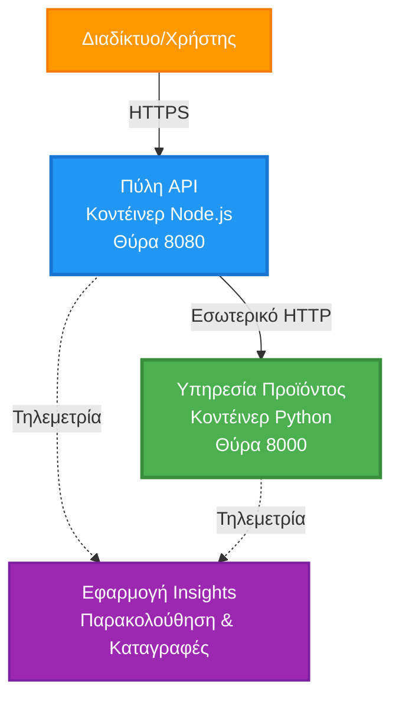
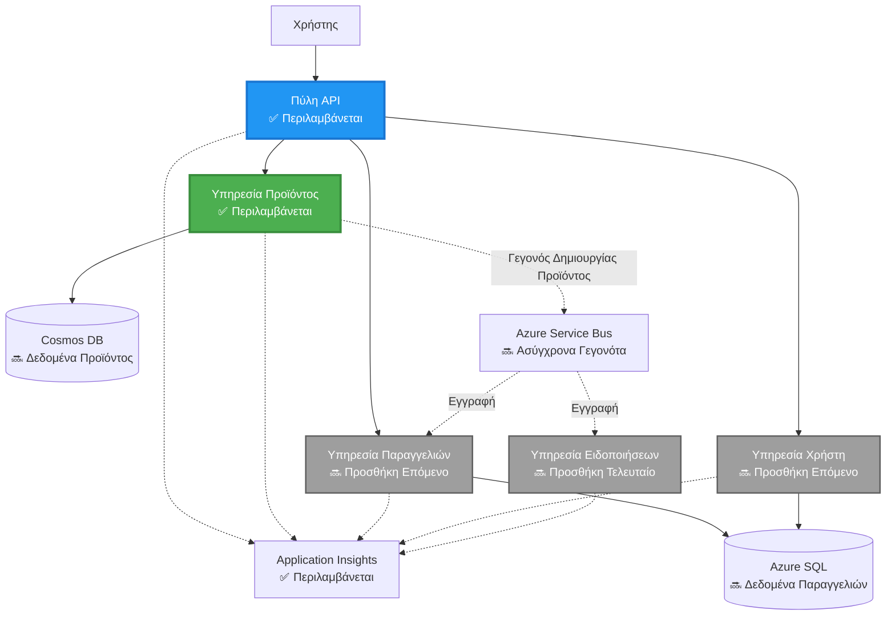
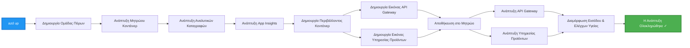

<!--
CO_OP_TRANSLATOR_METADATA:
{
  "original_hash": "eb3a4803a1e80a7f2e64f6bf63738c0f",
  "translation_date": "2025-11-21T10:15:26+00:00",
  "source_file": "examples/microservices/README.md",
  "language_code": "el"
}
-->
# Αρχιτεκτονική Microservices - Παράδειγμα Εφαρμογής Container

⏱️ **Εκτιμώμενος Χρόνος**: 25-35 λεπτά | 💰 **Εκτιμώμενο Κόστος**: ~$50-100/μήνα | ⭐ **Πολυπλοκότητα**: Προχωρημένο

**📚 Διαδρομή Μάθησης:**
- ← Προηγούμενο: [Απλό Flask API](../../../../examples/container-app/simple-flask-api) - Βασικά για ένα container
- 🎯 **Εδώ Είστε**: Αρχιτεκτονική Microservices (Βάση 2 υπηρεσιών)
- → Επόμενο: [Ενσωμάτωση AI](../../../../docs/ai-foundry) - Προσθέστε ευφυΐα στις υπηρεσίες σας
- 🏠 [Αρχική Σελίδα Μαθήματος](../../README.md)

---

Μια **απλοποιημένη αλλά λειτουργική** αρχιτεκτονική microservices που αναπτύσσεται σε Azure Container Apps χρησιμοποιώντας το AZD CLI. Αυτό το παράδειγμα δείχνει επικοινωνία μεταξύ υπηρεσιών, ορχήστρωση containers και παρακολούθηση με μια πρακτική ρύθμιση 2 υπηρεσιών.

> **📚 Προσέγγιση Μάθησης**: Αυτό το παράδειγμα ξεκινά με μια ελάχιστη αρχιτεκτονική 2 υπηρεσιών (API Gateway + Backend Service) που μπορείτε πραγματικά να αναπτύξετε και να μάθετε. Αφού κατακτήσετε αυτή τη βάση, παρέχουμε καθοδήγηση για επέκταση σε ένα πλήρες οικοσύστημα microservices.

## Τι Θα Μάθετε

Ολοκληρώνοντας αυτό το παράδειγμα, θα:
- Αναπτύξετε πολλαπλά containers σε Azure Container Apps
- Υλοποιήσετε επικοινωνία μεταξύ υπηρεσιών με εσωτερική δικτύωση
- Ρυθμίσετε κλιμάκωση βάσει περιβάλλοντος και ελέγχους υγείας
- Παρακολουθήσετε διανεμημένες εφαρμογές με Application Insights
- Κατανοήσετε μοτίβα ανάπτυξης microservices και βέλτιστες πρακτικές
- Μάθετε προοδευτική επέκταση από απλές σε σύνθετες αρχιτεκτονικές

## Αρχιτεκτονική

### Φάση 1: Τι Δημιουργούμε (Περιλαμβάνεται σε Αυτό το Παράδειγμα)


**Λεπτομέρειες Συστατικών:**

| Συστατικό | Σκοπός | Πρόσβαση | Πόροι |
|-----------|---------|--------|-----------|
| **API Gateway** | Δρομολογεί εξωτερικά αιτήματα σε backend υπηρεσίες | Δημόσιο (HTTPS) | 1 vCPU, 2GB RAM, 2-20 αντίγραφα |
| **Υπηρεσία Προϊόντων** | Διαχειρίζεται τον κατάλογο προϊόντων με δεδομένα στη μνήμη | Μόνο Εσωτερικό | 0.5 vCPU, 1GB RAM, 1-10 αντίγραφα |
| **Application Insights** | Κεντρική καταγραφή και διανεμημένη ιχνηλάτηση | Azure Portal | 1-2 GB/μήνα εισαγωγή δεδομένων |

**Γιατί Ξεκινάμε Απλά;**
- ✅ Αναπτύξτε και κατανοήστε γρήγορα (25-35 λεπτά)
- ✅ Μάθετε βασικά μοτίβα microservices χωρίς πολυπλοκότητα
- ✅ Λειτουργικός κώδικας που μπορείτε να τροποποιήσετε και να πειραματιστείτε
- ✅ Χαμηλότερο κόστος για μάθηση (~$50-100/μήνα έναντι $300-1400/μήνα)
- ✅ Χτίστε αυτοπεποίθηση πριν προσθέσετε βάσεις δεδομένων και ουρές μηνυμάτων

**Αναλογία**: Σκεφτείτε το σαν να μαθαίνετε να οδηγείτε. Ξεκινάτε σε ένα άδειο πάρκινγκ (2 υπηρεσίες), κατακτάτε τα βασικά και μετά προχωράτε στην κυκλοφορία της πόλης (5+ υπηρεσίες με βάσεις δεδομένων).

### Φάση 2: Μελλοντική Επέκταση (Αναφορά Αρχιτεκτονικής)

Αφού κατακτήσετε την αρχιτεκτονική 2 υπηρεσιών, μπορείτε να επεκταθείτε σε:


Δείτε την ενότητα "Οδηγός Επέκτασης" στο τέλος για βήμα-βήμα οδηγίες.

## Περιλαμβανόμενα Χαρακτηριστικά

✅ **Ανακάλυψη Υπηρεσιών**: Αυτόματη ανακάλυψη DNS μεταξύ containers  
✅ **Εξισορρόπηση Φορτίου**: Ενσωματωμένη εξισορρόπηση φορτίου μεταξύ αντιγράφων  
✅ **Αυτόματη Κλιμάκωση**: Ανεξάρτητη κλιμάκωση ανά υπηρεσία βάσει HTTP αιτημάτων  
✅ **Παρακολούθηση Υγείας**: Έλεγχοι ζωντάνιας και ετοιμότητας για και τις δύο υπηρεσίες  
✅ **Διανεμημένη Καταγραφή**: Κεντρική καταγραφή με Application Insights  
✅ **Εσωτερική Δικτύωση**: Ασφαλής επικοινωνία μεταξύ υπηρεσιών  
✅ **Ορχήστρωση Containers**: Αυτόματη ανάπτυξη και κλιμάκωση  
✅ **Ενημερώσεις Χωρίς Διακοπή**: Ενημερώσεις με διαχείριση αναθεωρήσεων  

## Προαπαιτούμενα

### Απαιτούμενα Εργαλεία

Πριν ξεκινήσετε, βεβαιωθείτε ότι έχετε εγκαταστήσει αυτά τα εργαλεία:

1. **[Azure Developer CLI (azd)](https://learn.microsoft.com/azure/developer/azure-developer-cli/install-azd)** (έκδοση 1.0.0 ή νεότερη)
   ```bash
   azd version
   # Αναμενόμενο αποτέλεσμα: έκδοση azd 1.0.0 ή υψηλότερη
   ```

2. **[Azure CLI](https://learn.microsoft.com/cli/azure/install-azure-cli)** (έκδοση 2.50.0 ή νεότερη)
   ```bash
   az --version
   # Αναμενόμενο αποτέλεσμα: azure-cli 2.50.0 ή νεότερη έκδοση
   ```

3. **[Docker](https://www.docker.com/get-started)** (για τοπική ανάπτυξη/δοκιμή - προαιρετικό)
   ```bash
   docker --version
   # Αναμενόμενο αποτέλεσμα: Έκδοση Docker 20.10 ή νεότερη
   ```

### Επαλήθευση Ρύθμισης

Εκτελέστε αυτές τις εντολές για να επιβεβαιώσετε ότι είστε έτοιμοι:

```bash
# Ελέγξτε το Azure Developer CLI
azd version
# ✅ Αναμενόμενο: έκδοση azd 1.0.0 ή νεότερη

# Ελέγξτε το Azure CLI
az --version
# ✅ Αναμενόμενο: azure-cli 2.50.0 ή νεότερη

# Ελέγξτε το Docker (προαιρετικό)
docker --version
# ✅ Αναμενόμενο: έκδοση Docker 20.10 ή νεότερη
```

**Κριτήρια Επιτυχίας**: Όλες οι εντολές επιστρέφουν αριθμούς εκδόσεων που ταιριάζουν ή υπερβαίνουν τα ελάχιστα.

### Απαιτήσεις Azure

- Ενεργή **συνδρομή Azure** ([δημιουργήστε δωρεάν λογαριασμό](https://azure.microsoft.com/free/))
- Δικαιώματα για δημιουργία πόρων στη συνδρομή σας
- Ρόλος **Συνεισφέροντα** στη συνδρομή ή την ομάδα πόρων

### Γνώσεις Προαπαιτούμενες

Αυτό είναι ένα παράδειγμα **προχωρημένου επιπέδου**. Θα πρέπει να έχετε:
- Ολοκληρώσει το [παράδειγμα Απλού Flask API](../../../../examples/container-app/simple-flask-api) 
- Βασική κατανόηση της αρχιτεκτονικής microservices
- Εξοικείωση με REST APIs και HTTP
- Κατανόηση των εννοιών container

**Νέοι στα Container Apps;** Ξεκινήστε με το [παράδειγμα Απλού Flask API](../../../../examples/container-app/simple-flask-api) για να μάθετε τα βασικά.

## Γρήγορη Εκκίνηση (Βήμα-Βήμα)

### Βήμα 1: Κλωνοποίηση και Πλοήγηση

```bash
git clone https://github.com/microsoft/AZD-for-beginners.git
cd AZD-for-beginners/examples/microservices
```

**✓ Έλεγχος Επιτυχίας**: Επαληθεύστε ότι βλέπετε το `azure.yaml`:
```bash
ls
# Αναμενόμενο: README.md, azure.yaml, infra/, src/
```

### Βήμα 2: Αυθεντικοποίηση με Azure

```bash
azd auth login
```

Αυτό ανοίγει τον περιηγητή σας για αυθεντικοποίηση στο Azure. Συνδεθείτε με τα διαπιστευτήρια Azure σας.

**✓ Έλεγχος Επιτυχίας**: Θα πρέπει να δείτε:
```
Logged in to Azure.
```

### Βήμα 3: Αρχικοποίηση Περιβάλλοντος

```bash
azd init
```

**Προτροπές που θα δείτε**:
- **Όνομα περιβάλλοντος**: Εισάγετε ένα σύντομο όνομα (π.χ., `microservices-dev`)
- **Συνδρομή Azure**: Επιλέξτε τη συνδρομή σας
- **Τοποθεσία Azure**: Επιλέξτε μια περιοχή (π.χ., `eastus`, `westeurope`)

**✓ Έλεγχος Επιτυχίας**: Θα πρέπει να δείτε:
```
SUCCESS: New project initialized!
```

### Βήμα 4: Ανάπτυξη Υποδομής και Υπηρεσιών

```bash
azd up
```

**Τι συμβαίνει** (διαρκεί 8-12 λεπτά):


**✓ Έλεγχος Επιτυχίας**: Θα πρέπει να δείτε:
```
SUCCESS: Your application was deployed to Azure in X minutes Y seconds.
Endpoint: https://api-gateway-<unique-id>.azurecontainerapps.io
```

**⏱️ Χρόνος**: 8-12 λεπτά

### Βήμα 5: Δοκιμή Ανάπτυξης

```bash
# Λάβετε το σημείο πρόσβασης της πύλης
GATEWAY_URL=$(azd env get-values | grep API_GATEWAY_URL | cut -d '=' -f2 | tr -d '"')

# Δοκιμάστε την υγεία του API Gateway
curl $GATEWAY_URL/health
```

**✅ Αναμενόμενη έξοδος:**
```json
{
  "status": "healthy",
  "service": "api-gateway",
  "timestamp": "2025-11-19T10:30:00Z"
}
```

**Δοκιμή υπηρεσίας προϊόντων μέσω gateway**:
```bash
# Λίστα προϊόντων
curl $GATEWAY_URL/api/products
```

**✅ Αναμενόμενη έξοδος:**
```json
[
  {"id":1,"name":"Laptop","price":999.99,"stock":50},
  {"id":2,"name":"Mouse","price":29.99,"stock":200},
  {"id":3,"name":"Keyboard","price":79.99,"stock":150}
]
```

**✓ Έλεγχος Επιτυχίας**: Και τα δύο endpoints επιστρέφουν δεδομένα JSON χωρίς σφάλματα.

---

**🎉 Συγχαρητήρια!** Έχετε αναπτύξει μια αρχιτεκτονική microservices στο Azure!
3. Επαναδιάθεση και των δύο υπηρεσιών:

```bash
azd deploy product-service
azd deploy api-gateway
```

4. Δοκιμάστε το νέο endpoint:

```bash
GATEWAY_URL=$(azd env get-values | grep API_GATEWAY_URL | cut -d '=' -f2 | tr -d '"')

# Δημιουργήστε ένα νέο προϊόν
curl -X POST $GATEWAY_URL/api/products \
  -H "Content-Type: application/json" \
  -d '{"name":"USB Cable","price":9.99,"stock":500}'
```

**✅ Αναμενόμενο αποτέλεσμα:**
```json
{"id":6,"name":"USB Cable","description":"","price":9.99,"stock":500}
```

5. Επαληθεύστε ότι εμφανίζεται στη λίστα:

```bash
curl $GATEWAY_URL/api/products
# Θα πρέπει τώρα να εμφανίζει 6 προϊόντα, συμπεριλαμβανομένου του νέου καλωδίου USB
```

**Κριτήρια Επιτυχίας**:
- ✅ Το αίτημα POST επιστρέφει HTTP 201
- ✅ Το νέο προϊόν εμφανίζεται στη λίστα GET /api/products
- ✅ Το προϊόν έχει αυτόματα αυξανόμενο ID

**Χρόνος**: 10-15 λεπτά

---

### Άσκηση 2: Τροποποίηση Κανόνων Αυτόματης Κλιμάκωσης ⭐⭐ (Μεσαίο)

**Στόχος**: Αλλάξτε την Υπηρεσία Προϊόντων ώστε να κλιμακώνεται πιο επιθετικά

**Αφετηρία**: `infra/app/product-service.bicep`

**Βήματα**:

1. Ανοίξτε το `infra/app/product-service.bicep` και βρείτε το μπλοκ `scale` (γύρω στη γραμμή 95)

2. Αλλάξτε από:
```bicep
scale: {
  minReplicas: 1
  maxReplicas: 10
  rules: [
    {
      name: 'http-scale-rule'
      http: {
        metadata: {
          concurrentRequests: '100'  // OLD
        }
      }
    }
  ]
}
```

Σε:
```bicep
scale: {
  minReplicas: 2  // Always have 2 running
  maxReplicas: 20  // Allow more scaling
  rules: [
    {
      name: 'http-scale-rule'
      http: {
        metadata: {
          concurrentRequests: '20'  // Scale at lower threshold
        }
      }
    }
  ]
}
```

3. Επαναδιάθεση υποδομής:

```bash
azd up
```

4. Επαληθεύστε τη νέα ρύθμιση κλιμάκωσης:

```bash
az containerapp show \
  --name $(azd env get-values | grep PRODUCT_SERVICE | head -1 | cut -d '/' -f5) \
  --resource-group $(azd env get-values | grep AZURE_RESOURCE_GROUP | cut -d '=' -f2 | tr -d '"') \
  --query "properties.template.scale" -o json
```

**✅ Αναμενόμενο αποτέλεσμα:**
```json
{
  "minReplicas": 2,
  "maxReplicas": 20,
  "rules": [...]
}
```

5. Δοκιμάστε την αυτόματη κλιμάκωση με φόρτο:

```bash
# Δημιουργήστε ταυτόχρονες αιτήσεις
for i in {1..500}; do curl $GATEWAY_URL/api/products & done

# Παρακολουθήστε την κλιμάκωση να συμβαίνει
azd logs product-service --follow
# Αναζητήστε: Συμβάντα κλιμάκωσης εφαρμογών κοντέινερ
```

**Κριτήρια Επιτυχίας**:
- ✅ Η Υπηρεσία Προϊόντων λειτουργεί πάντα με τουλάχιστον 2 αντίγραφα
- ✅ Υπό φόρτο, κλιμακώνεται σε περισσότερα από 2 αντίγραφα
- ✅ Το Azure Portal δείχνει τους νέους κανόνες κλιμάκωσης

**Χρόνος**: 15-20 λεπτά

---

### Άσκηση 3: Προσθήκη Εξατομικευμένου Ερωτήματος Παρακολούθησης ⭐⭐ (Μεσαίο)

**Στόχος**: Δημιουργήστε ένα εξατομικευμένο ερώτημα Application Insights για την παρακολούθηση της απόδοσης του API προϊόντων

**Βήματα**:

1. Μεταβείτε στο Application Insights στο Azure Portal:
   - Πηγαίνετε στο Azure Portal
   - Βρείτε την ομάδα πόρων σας (rg-microservices-*)
   - Κάντε κλικ στον πόρο Application Insights

2. Κάντε κλικ στο "Logs" στο αριστερό μενού

3. Δημιουργήστε αυτό το ερώτημα:

```kusto
requests
| where timestamp > ago(1h)
| where name contains "products"
| summarize 
    RequestCount = count(),
    AvgDuration = avg(duration),
    P95Duration = percentile(duration, 95),
    SuccessRate = 100.0 * countif(success == true) / count()
  by bin(timestamp, 5m)
| render timechart
```

4. Κάντε κλικ στο "Run" για να εκτελέσετε το ερώτημα

5. Αποθηκεύστε το ερώτημα:
   - Κάντε κλικ στο "Save"
   - Όνομα: "Product API Performance"
   - Κατηγορία: "Performance"

6. Δημιουργήστε δοκιμαστική κίνηση:

```bash
for i in {1..100}; do curl $GATEWAY_URL/api/products; sleep 1; done
```

7. Ανανεώστε το ερώτημα για να δείτε δεδομένα

**✅ Αναμενόμενο αποτέλεσμα:**
- Γράφημα που δείχνει τον αριθμό αιτημάτων με την πάροδο του χρόνου
- Μέση διάρκεια < 500ms
- Ποσοστό επιτυχίας = 100%
- Χρονικά διαστήματα των 5 λεπτών

**Κριτήρια Επιτυχίας**:
- ✅ Το ερώτημα δείχνει 100+ αιτήματα
- ✅ Ποσοστό επιτυχίας είναι 100%
- ✅ Μέση διάρκεια < 500ms
- ✅ Το γράφημα εμφανίζει χρονικά διαστήματα των 5 λεπτών

**Αποτέλεσμα Μάθησης**: Κατανόηση της παρακολούθησης της απόδοσης υπηρεσιών με εξατομικευμένα ερωτήματα

**Χρόνος**: 10-15 λεπτά

---

### Άσκηση 4: Υλοποίηση Λογικής Επαναπροσπάθειας ⭐⭐⭐ (Προχωρημένο)

**Στόχος**: Προσθέστε λογική επαναπροσπάθειας στο API Gateway όταν η Υπηρεσία Προϊόντων είναι προσωρινά μη διαθέσιμη

**Αφετηρία**: `src/api-gateway/app.js`

**Βήματα**:

1. Εγκαταστήστε τη βιβλιοθήκη επαναπροσπάθειας:

```bash
cd src/api-gateway
npm install axios-retry --save
cd ../..
```

2. Ενημερώστε το `src/api-gateway/app.js` (προσθέστε μετά την εισαγωγή του axios):

```javascript
const axiosRetry = require('axios-retry');

// Διαμόρφωση λογικής επαναπροσπάθειας
axiosRetry(axios, {
  retries: 3,
  retryDelay: (retryCount) => {
    return retryCount * 1000; // 1s, 2s, 3s
  },
  retryCondition: (error) => {
    // Επανάληψη σε σφάλματα δικτύου ή αποκρίσεις 5xx
    return axiosRetry.isNetworkOrIdempotentRequestError(error) ||
           (error.response && error.response.status >= 500);
  }
});

console.log('Retry logic configured: 3 retries with exponential backoff');
```

3. Επαναδιάθεση του API Gateway:

```bash
azd deploy api-gateway
```

4. Δοκιμάστε τη συμπεριφορά επαναπροσπάθειας προσομοιώνοντας αποτυχία υπηρεσίας:

```bash
# Κλιμακώστε την υπηρεσία προϊόντων σε 0 (προσομοίωση αποτυχίας)
az containerapp update \
  --name $(azd env get-values | grep PRODUCT_SERVICE | head -1 | cut -d '/' -f5) \
  --resource-group $(azd env get-values | grep AZURE_RESOURCE_GROUP | cut -d '=' -f2 | tr -d '"') \
  --min-replicas 0 \
  --max-replicas 0

# Προσπαθήστε να αποκτήσετε πρόσβαση στα προϊόντα (θα επαναληφθεί 3 φορές)
time curl -v $GATEWAY_URL/api/products
# Παρατηρήστε: Η απόκριση διαρκεί ~6 δευτερόλεπτα (1s + 2s + 3s επαναλήψεις)

# Επαναφέρετε την υπηρεσία προϊόντων
az containerapp update \
  --name $(azd env get-values | grep PRODUCT_SERVICE | head -1 | cut -d '/' -f5) \
  --resource-group $(azd env get-values | grep AZURE_RESOURCE_GROUP | cut -d '=' -f2 | tr -d '"') \
  --min-replicas 1 \
  --max-replicas 10
```

5. Δείτε τα αρχεία καταγραφής επαναπροσπάθειας:

```bash
azd logs api-gateway --tail 50
# Αναζητήστε: Μηνύματα προσπάθειας επανάληψης
```

**✅ Αναμενόμενη συμπεριφορά:**
- Τα αιτήματα επαναπροσπαθούν 3 φορές πριν αποτύχουν
- Κάθε επαναπροσπάθεια περιμένει περισσότερο (1s, 2s, 3s)
- Επιτυχημένα αιτήματα μετά την επανεκκίνηση της υπηρεσίας
- Τα αρχεία καταγραφής δείχνουν τις προσπάθειες επαναπροσπάθειας

**Κριτήρια Επιτυχίας**:
- ✅ Τα αιτήματα επαναπροσπαθούν 3 φορές πριν αποτύχουν
- ✅ Κάθε επαναπροσπάθεια περιμένει περισσότερο (εκθετική καθυστέρηση)
- ✅ Επιτυχημένα αιτήματα μετά την επανεκκίνηση της υπηρεσίας
- ✅ Τα αρχεία καταγραφής δείχνουν τις προσπάθειες επαναπροσπάθειας

**Αποτέλεσμα Μάθησης**: Κατανόηση μοτίβων ανθεκτικότητας στις μικροϋπηρεσίες (κυκλώματα ασφαλείας, επαναπροσπάθειες, χρονικά όρια)

**Χρόνος**: 20-25 λεπτά

---

## Σημείο Ελέγχου Γνώσεων

Αφού ολοκληρώσετε αυτό το παράδειγμα, επαληθεύστε την κατανόησή σας:

### 1. Επικοινωνία Υπηρεσιών ✓

Δοκιμάστε τις γνώσεις σας:
- [ ] Μπορείτε να εξηγήσετε πώς το API Gateway ανακαλύπτει την Υπηρεσία Προϊόντων; (Ανακάλυψη υπηρεσίας βάσει DNS)
- [ ] Τι συμβαίνει αν η Υπηρεσία Προϊόντων είναι εκτός λειτουργίας; (Το Gateway επιστρέφει σφάλμα 503)
- [ ] Πώς θα προσθέσετε μια τρίτη υπηρεσία; (Δημιουργία νέου αρχείου Bicep, προσθήκη στο main.bicep, δημιουργία φακέλου src)

**Επαλήθευση με Πρακτική**:
```bash
# Προσομοίωση αποτυχίας υπηρεσίας
az containerapp update --name <product-service-name> --min-replicas 0 --max-replicas 0
curl $GATEWAY_URL/api/products
# ✅ Αναμενόμενο: 503 Υπηρεσία Μη Διαθέσιμη

# Επαναφορά υπηρεσίας
az containerapp update --name <product-service-name> --min-replicas 1 --max-replicas 10
```

### 2. Παρακολούθηση & Παρατηρησιμότητα ✓

Δοκιμάστε τις γνώσεις σας:
- [ ] Πού βλέπετε κατανεμημένα αρχεία καταγραφής; (Application Insights στο Azure Portal)
- [ ] Πώς παρακολουθείτε αργά αιτήματα; (Ερώτημα Kusto: `requests | where duration > 1000`)
- [ ] Μπορείτε να εντοπίσετε ποια υπηρεσία προκάλεσε ένα σφάλμα; (Ελέγξτε το πεδίο `cloud_RoleName` στα αρχεία καταγραφής)

**Επαλήθευση με Πρακτική**:
```bash
# Δημιουργήστε μια προσομοίωση αργής αίτησης
curl "$GATEWAY_URL/api/products?delay=2000"

# Ερωτήστε το Application Insights για αργές αιτήσεις
# Μεταβείτε στο Azure Portal → Application Insights → Logs
# Εκτελέστε: requests | where duration > 1000 | project timestamp, name, duration, cloud_RoleName
```

### 3. Κλιμάκωση & Απόδοση ✓

Δοκιμάστε τις γνώσεις σας:
- [ ] Τι ενεργοποιεί την αυτόματη κλιμάκωση; (Κανόνες αιτημάτων HTTP: 50 για το gateway, 100 για το προϊόν)
- [ ] Πόσα αντίγραφα λειτουργούν τώρα; (Ελέγξτε με `az containerapp revision list`)
- [ ] Πώς θα κλιμακώσετε την Υπηρεσία Προϊόντων σε 5 αντίγραφα; (Ενημερώστε το minReplicas στο Bicep)

**Επαλήθευση με Πρακτική**:
```bash
# Δημιουργήστε φόρτο για δοκιμή αυτόματης κλιμάκωσης
for i in {1..1000}; do curl $GATEWAY_URL/api/products & done

# Παρακολουθήστε την αύξηση των αντιγράφων
azd logs api-gateway --follow
# ✅ Αναμενόμενο: Δείτε γεγονότα κλιμάκωσης στα αρχεία καταγραφής
```

**Κριτήρια Επιτυχίας**: Μπορείτε να απαντήσετε σε όλες τις ερωτήσεις και να επαληθεύσετε με πρακτικές εντολές.

---

## Ανάλυση Κόστους

### Εκτιμώμενο Μηνιαίο Κόστος (Για Αυτό το Παράδειγμα με 2 Υπηρεσίες)

| Πόρος | Ρύθμιση | Εκτιμώμενο Κόστος |
|-------|---------|-------------------|
| API Gateway | 2-20 αντίγραφα, 1 vCPU, 2GB RAM | $30-150 |
| Υπηρεσία Προϊόντων | 1-10 αντίγραφα, 0.5 vCPU, 1GB RAM | $15-75 |
| Registry Container | Βασικό επίπεδο | $5 |
| Application Insights | 1-2 GB/μήνα | $5-10 |
| Log Analytics | 1 GB/μήνα | $3 |
| **Σύνολο** | | **$58-243/μήνα** |

### Ανάλυση Κόστους ανά Χρήση

**Ελαφριά κίνηση** (δοκιμές/εκμάθηση): ~$60/μήνα
- API Gateway: 2 αντίγραφα × 24/7 = $30
- Υπηρεσία Προϊόντων: 1 αντίγραφο × 24/7 = $15
- Παρακολούθηση + Registry = $13

**Μέτρια κίνηση** (μικρή παραγωγή): ~$120/μήνα
- API Gateway: 5 μέσες αντίγραφα = $75
- Υπηρεσία Προϊόντων: 3 μέσες αντίγραφα = $45
- Παρακολούθηση + Registry = $13

**Υψηλή κίνηση** (περίοδοι αιχμής): ~$240/μήνα
- API Gateway: 15 μέσες αντίγραφα = $225
- Υπηρεσία Προϊόντων: 8 μέσες αντίγραφα = $120
- Παρακολούθηση + Registry = $13

### Συμβουλές Βελτιστοποίησης Κόστους

1. **Κλιμάκωση στο Μηδέν για Ανάπτυξη**:
   ```bicep
   scale: {
     minReplicas: 0  // Save $30-40/month when not in use
     maxReplicas: 10
   }
   ```

2. **Χρησιμοποιήστε Consumption Plan για Cosmos DB** (όταν το προσθέσετε):
   - Πληρώστε μόνο για ό,τι χρησιμοποιείτε
   - Χωρίς ελάχιστη χρέωση

3. **Ρυθμίστε Sampling στο Application Insights**:
   ```javascript
   appInsights.defaultClient.config.samplingPercentage = 50; // Δειγματοληψία 50% των αιτημάτων
   ```

4. **Καθαρισμός Όταν Δεν Χρειάζεται**:
   ```bash
   azd down --force --purge
   ```

### Δωρεάν Επιλογές

Για εκμάθηση/δοκιμές, σκεφτείτε:
- ✅ Χρησιμοποιήστε δωρεάν credits Azure ($200 για τις πρώτες 30 ημέρες με νέους λογαριασμούς)
- ✅ Κρατήστε ελάχιστα αντίγραφα (εξοικονομεί ~50% κόστος)
- ✅ Διαγραφή μετά από δοκιμές (χωρίς συνεχιζόμενες χρεώσεις)
- ✅ Κλιμάκωση στο μηδέν μεταξύ συνεδριών εκμάθησης

**Παράδειγμα**: Εκτέλεση αυτού του παραδείγματος για 2 ώρες/ημέρα × 30 ημέρες = ~$5/μήνα αντί για $60/μήνα

---

## Γρήγορη Αναφορά Αντιμετώπισης Προβλημάτων

### Πρόβλημα: `azd up` αποτυγχάνει με "Subscription not found"

**Λύση**:
```bash
# Συνδεθείτε ξανά με ρητή συνδρομή
az account set --subscription <your-subscription-id>
azd env set AZURE_SUBSCRIPTION_ID <your-subscription-id>
azd up
```

### Πρόβλημα: Το API Gateway επιστρέφει 503 "Η υπηρεσία προϊόντων δεν είναι διαθέσιμη"

**Διάγνωση**:
```bash
# Ελέγξτε τα αρχεία καταγραφής υπηρεσιών προϊόντος
azd logs product-service --tail 50

# Ελέγξτε την υγεία της υπηρεσίας προϊόντος
az containerapp show \
  --name $(azd env get-values | grep PRODUCT_SERVICE | head -1 | cut -d '/' -f5) \
  --resource-group $(azd env get-values | grep AZURE_RESOURCE_GROUP | cut -d '=' -f2 | tr -d '"') \
  --query "properties.runningStatus"
```

**Συνηθισμένες Αιτίες**:
1. Η υπηρεσία προϊόντων δεν ξεκίνησε (ελέγξτε τα αρχεία καταγραφής για σφάλματα Python)
2. Η υγειονομική επιθεώρηση αποτυγχάνει (επαληθεύστε ότι το endpoint `/health` λειτουργεί)
3. Η κατασκευή εικόνας κοντέινερ απέτυχε (ελέγξτε το registry για εικόνα)

### Πρόβλημα: Η αυτόματη κλιμάκωση δεν λειτουργεί

**Διάγνωση**:
```bash
# Ελέγξτε τον τρέχοντα αριθμό αντιγράφων
az containerapp revision list \
  --name $(azd env get-values | grep API_GATEWAY | head -1 | cut -d '/' -f5) \
  --resource-group $(azd env get-values | grep AZURE_RESOURCE_GROUP | cut -d '=' -f2 | tr -d '"') \
  --query "[].properties.replicas"

# Δημιουργήστε φορτίο για δοκιμή
for i in {1..1000}; do curl $GATEWAY_URL/api/products & done

# Παρακολουθήστε γεγονότα κλιμάκωσης
azd logs api-gateway --follow | grep -i scale
```

**Συνηθισμένες Αιτίες**:
1. Ο φόρτος δεν είναι αρκετά υψηλός για να ενεργοποιήσει τον κανόνα κλιμάκωσης (χρειάζονται >50 ταυτόχρονα αιτήματα)
2. Έχουν ήδη επιτευχθεί τα μέγιστα αντίγραφα (ελέγξτε τη ρύθμιση Bicep)
3. Ο κανόνας κλιμάκωσης έχει ρυθμιστεί λανθασμένα στο Bicep (επαληθεύστε την τιμή concurrentRequests)

### Πρόβλημα: Το Application Insights δεν δείχνει αρχεία καταγραφής

**Διάγνωση**:
```bash
# Επαληθεύστε ότι έχει οριστεί η συμβολοσειρά σύνδεσης
azd env get-values | grep APPLICATIONINSIGHTS

# Ελέγξτε αν οι υπηρεσίες στέλνουν τηλεμετρία
az monitor app-insights component show \
  --app $(azd env get-values | grep APPLICATIONINSIGHTS_NAME | cut -d '=' -f2 | tr -d '"') \
  --resource-group $(azd env get-values | grep AZURE_RESOURCE_GROUP | cut -d '=' -f2 | tr -d '"') \
  --query "properties.InstrumentationKey"
```

**Συνηθισμένες Αιτίες**:
1. Η συμβολοσειρά σύνδεσης δεν έχει περάσει στο κοντέινερ (ελέγξτε τις μεταβλητές περιβάλλοντος)
2. Το SDK του Application Insights δεν έχει ρυθμιστεί (επαληθεύστε τις εισαγωγές στον κώδικα)
3. Το τείχος προστασίας μπλοκάρει την τηλεμετρία (σπάνιο, ελέγξτε τους κανόνες δικτύου)

### Πρόβλημα: Η κατασκευή Docker αποτυγχάνει τοπικά

**Διάγνωση**:
```bash
# Δοκιμή κατασκευής API Gateway
cd src/api-gateway
docker build -t test-gateway .

# Δοκιμή κατασκευής Υπηρεσίας Προϊόντων
cd ../product-service
docker build -t test-product .
```

**Συνηθισμένες Αιτίες**:
1. Λείπουν εξαρτήσεις στο package.json/requirements.txt
2. Σφάλματα σύνταξης στο Dockerfile
3. Προβλήματα δικτύου κατά τη λήψη εξαρτήσεων

**Ακόμα Κολλημένοι;** Δείτε [Οδηγό Συνηθισμένων Προβλημάτων](../../docs/troubleshooting/common-issues.md) ή [Αντιμετώπιση Προβλημάτων Azure Container Apps](https://learn.microsoft.com/azure/container-apps/troubleshooting)

---

## Καθαρισμός

Για να αποφύγετε συνεχιζόμενες χρεώσεις, διαγράψτε όλους τους πόρους:

```bash
azd down --force --purge
```

**Προτροπή Επιβεβαίωσης**:
```
? Total resources to delete: 6, are you sure you want to continue? (y/N)
```

Πληκτρολογήστε `y` για επιβεβαίωση.

**Τι Διαγράφεται**:
- Περιβάλλον Container Apps
- Και οι δύο Container Apps (gateway & υπηρεσία προϊόντων)
- Registry Container
- Application Insights
- Χώρος Εργασίας Log Analytics
- Ομάδα Πόρων

**✓ Επαληθεύστε τον Καθαρισμό**:
```bash
az group list --query "[?starts_with(name,'rg-microservices')]" --output table
```

Πρέπει να επιστρέψει κενό.

---

## Οδηγός Επέκτασης: Από 2 σε 5+ Υπηρεσίες

Αφού κατακτήσετε αυτήν την αρχιτεκτονική με 2 υπηρεσίες, δείτε πώς να επεκταθείτε:

### Φάση 1: Προσθήκη Επίμονης Βάσης Δεδομένων (Επόμενο Βήμα)

**Προσθήκη Cosmos DB για την Υπηρεσία Προϊόντων**:

1. Δημιουργήστε `infra/core/cosmos.bicep`:
   ```bicep
   resource cosmosAccount 'Microsoft.DocumentDB/databaseAccounts@2023-04-15' = {
     name: name
     location: location
     kind: 'GlobalDocumentDB'
     properties: {
       databaseAccountOfferType: 'Standard'
       consistencyPolicy: { defaultConsistencyLevel: 'Session' }
       locations: [{ locationName: location, failoverPriority: 0 }]
     }
   }
   ```

2. Ενημερώστε την υπηρεσία προϊόντων να χρησιμοποιεί το Azure Cosmos DB Python SDK αντί για δεδομένα στη μνήμη

3. Εκτιμώμενο πρόσθετο κόστος: ~$25/μήνα (serverless)

### Φάση 2: Προσθήκη Τρίτης Υπηρεσίας (Διαχείριση Παραγγελιών)

**Δημιουργία Υπηρεσίας Παραγγελιών**:

1. Νέος φάκελος: `src/order-service/` (Python/Node.js/C#)
2. Νέο Bicep: `infra/app/order-service.bicep`
3. Ενημερώστε το API Gateway να δρομολογεί `/api/orders`
4. Προσθέστε Azure SQL Database για επίμονη αποθήκευση παραγγελιών

**Η αρχιτεκτονική γίνεται**:
```
API Gateway → Product Service (Cosmos DB)
           → Order Service (Azure SQL)
```

### Φάση 3: Προσθήκη Ασύγχρονης Επικοινωνίας (Service Bus)

**Υλοποίηση Αρχιτεκτονικής Βασισμένης σε Γεγονότα**:

1. Προσθέστε Azure Service Bus: `infra/core/servicebus.bicep`
2. Η Υπηρεσία Προϊόντων δημοσιεύει γεγονότα "ProductCreated"
3. Η Υπηρεσία Παραγγελιών εγγράφεται στα γεγονότα προϊόντων
4. Προσθέστε Υπηρεσία Ειδοποιήσεων για επεξεργασία γεγονότων

**Μοτίβο**: Αίτηση/Απάντηση (HTTP) + Βασισμένο σε Γεγονότα (Service Bus)

### Φάση 4: Προσθήκη Αυθεντικοποίησης Χρηστών

**Υλοποίηση Υπηρεσίας Χρηστών
| **Καλύτερο για** | MVPs, πρωτότυπα | Εφαρμογές παραγωγής | Multi-cloud, προηγμένα δίκτυα |

**Σύσταση**: Ξεκινήστε με Container Apps (αυτό το παράδειγμα), προχωρήστε σε AKS μόνο αν χρειάζεστε χαρακτηριστικά που είναι ειδικά για Kubernetes.

---

## Συχνές Ερωτήσεις

**Ε: Γιατί μόνο 2 υπηρεσίες αντί για 5+;**  
Α: Εκπαιδευτική πρόοδος. Μάθετε τα βασικά (επικοινωνία υπηρεσιών, παρακολούθηση, κλιμάκωση) με ένα απλό παράδειγμα πριν προσθέσετε πολυπλοκότητα. Τα μοτίβα που μαθαίνετε εδώ εφαρμόζονται σε αρχιτεκτονικές με 100 υπηρεσίες.

**Ε: Μπορώ να προσθέσω περισσότερες υπηρεσίες μόνος μου;**  
Α: Φυσικά! Ακολουθήστε τον οδηγό επέκτασης παραπάνω. Κάθε νέα υπηρεσία ακολουθεί το ίδιο μοτίβο: δημιουργήστε φάκελο src, δημιουργήστε αρχείο Bicep, ενημερώστε το azure.yaml, αναπτύξτε.

**Ε: Είναι αυτό έτοιμο για παραγωγή;**  
Α: Είναι μια σταθερή βάση. Για παραγωγή, προσθέστε: managed identity, Key Vault, επίμονες βάσεις δεδομένων, CI/CD pipeline, ειδοποιήσεις παρακολούθησης και στρατηγική αντιγράφων ασφαλείας.

**Ε: Γιατί να μην χρησιμοποιήσω Dapr ή άλλο service mesh;**  
Α: Κρατήστε το απλό για μάθηση. Μόλις κατανοήσετε τη δικτύωση των Container Apps, μπορείτε να προσθέσετε το Dapr για προηγμένα σενάρια (διαχείριση κατάστασης, pub/sub, bindings).

**Ε: Πώς μπορώ να κάνω εντοπισμό σφαλμάτων τοπικά;**  
Α: Εκτελέστε τις υπηρεσίες τοπικά με Docker:  
```bash
cd src/api-gateway
docker build -t local-gateway .
docker run -p 8080:8080 -e PRODUCT_SERVICE_URL=http://localhost:8000 local-gateway
```
  
**Ε: Μπορώ να χρησιμοποιήσω διαφορετικές γλώσσες προγραμματισμού;**  
Α: Ναι! Αυτό το παράδειγμα δείχνει Node.js (gateway) + Python (product service). Μπορείτε να συνδυάσετε οποιεσδήποτε γλώσσες που εκτελούνται σε containers: C#, Go, Java, Ruby, PHP, κ.λπ.

**Ε: Τι γίνεται αν δεν έχω credits στο Azure;**  
Α: Χρησιμοποιήστε το δωρεάν επίπεδο του Azure (οι πρώτες 30 ημέρες με νέους λογαριασμούς παρέχουν $200 credits) ή αναπτύξτε για σύντομες περιόδους δοκιμών και διαγράψτε αμέσως. Αυτό το παράδειγμα κοστίζει περίπου $2/ημέρα.

**Ε: Πώς διαφέρει αυτό από το Azure Kubernetes Service (AKS);**  
Α: Το Container Apps είναι πιο απλό (δεν απαιτείται γνώση Kubernetes) αλλά λιγότερο ευέλικτο. Το AKS σας δίνει πλήρη έλεγχο Kubernetes αλλά απαιτεί περισσότερη εξειδίκευση. Ξεκινήστε με Container Apps, προχωρήστε σε AKS αν χρειαστεί.

**Ε: Μπορώ να το χρησιμοποιήσω με υπάρχουσες υπηρεσίες Azure;**  
Α: Ναι! Μπορείτε να συνδεθείτε με υπάρχουσες βάσεις δεδομένων, λογαριασμούς αποθήκευσης, Service Bus, κ.λπ. Ενημερώστε τα αρχεία Bicep για να αναφέρονται σε υπάρχοντες πόρους αντί να δημιουργούν νέους.

---

> **🎓 Περίληψη Εκπαιδευτικής Διαδρομής**: Μάθατε πώς να αναπτύσσετε μια αρχιτεκτονική πολλαπλών υπηρεσιών με αυτόματη κλιμάκωση, εσωτερική δικτύωση, κεντρική παρακολούθηση και πρότυπα έτοιμα για παραγωγή. Αυτή η βάση σας προετοιμάζει για σύνθετα κατανεμημένα συστήματα και αρχιτεκτονικές μικροϋπηρεσιών για επιχειρήσεις.

**📚 Πλοήγηση Μαθήματος:**
- ← Προηγούμενο: [Απλό Flask API](../../../../examples/container-app/simple-flask-api)
- → Επόμενο: [Παράδειγμα Ενσωμάτωσης Βάσης Δεδομένων](../../../../database-app)
- 🏠 [Αρχική Σελίδα Μαθήματος](../../README.md)
- 📖 [Καλύτερες Πρακτικές για Container Apps](../../docs/deployment/deployment-guide.md)

---

**✨ Συγχαρητήρια!** Ολοκληρώσατε το παράδειγμα μικροϋπηρεσιών. Τώρα κατανοείτε πώς να δημιουργείτε, να αναπτύσσετε και να παρακολουθείτε κατανεμημένες εφαρμογές στα Azure Container Apps. Έτοιμοι να προσθέσετε δυνατότητες AI; Δείτε τον [Οδηγό Ενσωμάτωσης AI](../../../../docs/ai-foundry)!

---

<!-- CO-OP TRANSLATOR DISCLAIMER START -->
**Αποποίηση ευθύνης**:  
Αυτό το έγγραφο έχει μεταφραστεί χρησιμοποιώντας την υπηρεσία μετάφρασης AI [Co-op Translator](https://github.com/Azure/co-op-translator). Παρόλο που καταβάλλουμε προσπάθειες για ακρίβεια, παρακαλούμε να γνωρίζετε ότι οι αυτοματοποιημένες μεταφράσεις ενδέχεται να περιέχουν λάθη ή ανακρίβειες. Το πρωτότυπο έγγραφο στη μητρική του γλώσσα θα πρέπει να θεωρείται η αυθεντική πηγή. Για κρίσιμες πληροφορίες, συνιστάται επαγγελματική ανθρώπινη μετάφραση. Δεν φέρουμε ευθύνη για τυχόν παρεξηγήσεις ή εσφαλμένες ερμηνείες που προκύπτουν από τη χρήση αυτής της μετάφρασης.
<!-- CO-OP TRANSLATOR DISCLAIMER END -->