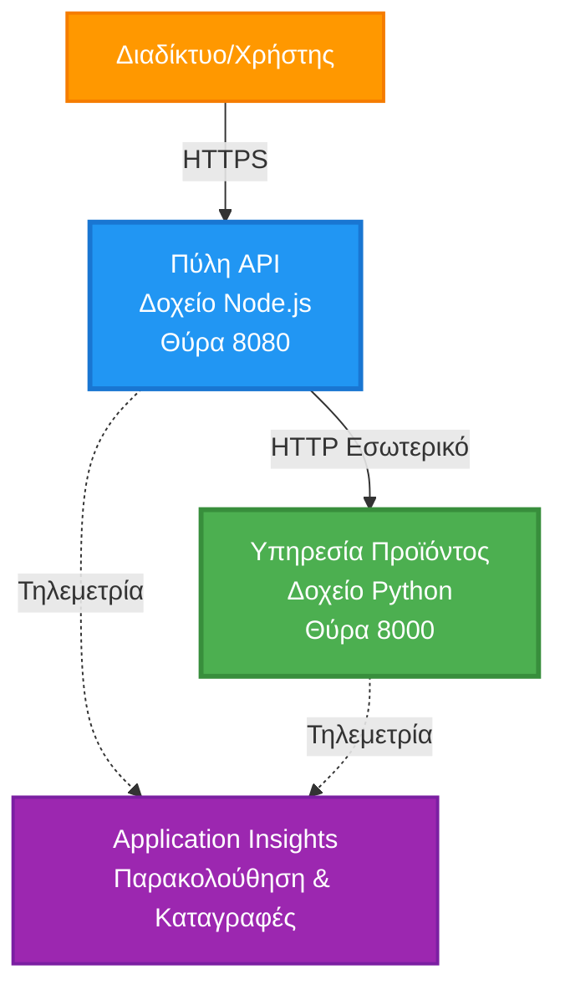
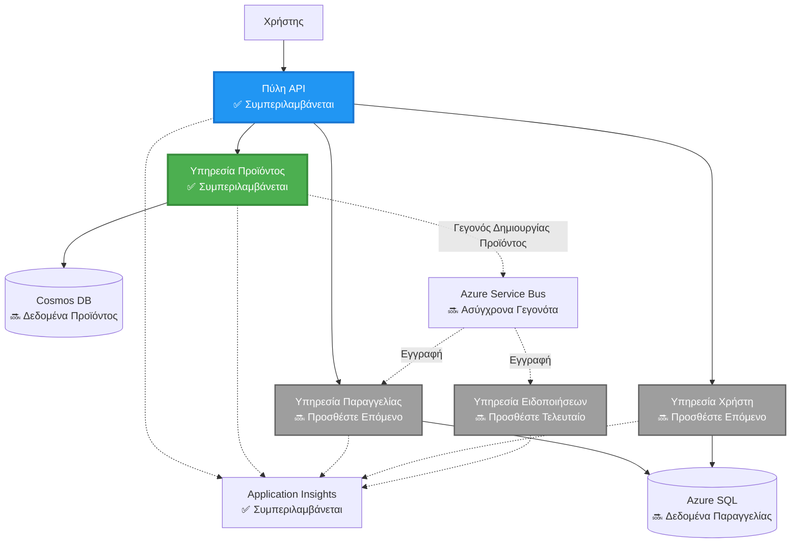
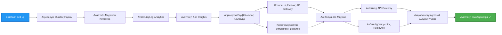
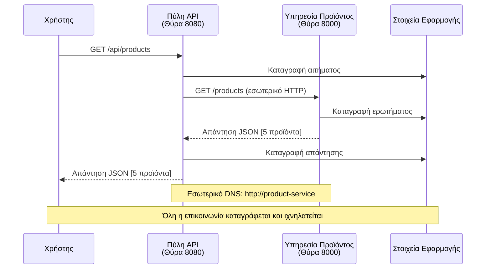

# Microservices Architecture - Container App Example

⏱️ **Εκτιμώμενος Χρόνος**: 25-35 λεπτά | 💰 **Εκτιμώμενο Κόστος**: ~$50-100/μήνα | ⭐ **Πορυσμότητα**: Προχωρημένο

**📚 Διαδρομή Μάθησης:**
- ← Προηγούμενο: [Simple Flask API](../../../../examples/container-app/simple-flask-api) - Βασικά για μεμονωμένο κοντέινερ
- 🎯 **Είστε Εδώ**: Αρχιτεκτονική Microservices (θεμελίωση 2 υπηρεσιών)
- → Επόμενο: [AI Integration](../../../../docs/ai-foundry) - Προσθήκη νοημοσύνης στις υπηρεσίες σας
- 🏠 [Course Home](../../README.md)

---

Μια **απλοποιημένη αλλά λειτουργική** αρχιτεκτονική microservices αναπτυγμένη σε Azure Container Apps χρησιμοποιώντας το AZD CLI. Αυτό το παράδειγμα επιδεικνύει επικοινωνία υπηρεσιών, ορχήστρωση κοντέινερ και παρακολούθηση με μια πρακτική ρύθμιση 2 υπηρεσιών.

> **📚 Προσέγγιση Μάθησης**: Αυτό το παράδειγμα ξεκινά με μια ελάχιστη αρχιτεκτονική 2 υπηρεσιών (API Gateway + Backend Service) που μπορείτε πραγματικά να αναπτύξετε και να μάθετε από αυτήν. Αφού κατακτήσετε αυτή τη θεμελίωση, παρέχουμε οδηγίες για επέκταση σε ένα πλήρες οικοσύστημα μικροϋπηρεσιών.

## Τι Θα Μάθετε

Ολοκληρώνοντας αυτό το παράδειγμα, θα:
- Αναπτύξετε πολλαπλά κοντέινερ σε Azure Container Apps
- Υλοποιήσετε επικοινωνία υπηρεσίας-προς-υπηρεσία με εσωτερικό δικτύωμα
- Διαμορφώσετε κλιμάκωση με βάση το περιβάλλον και health checks
- Παρακολουθήσετε κατανεμημένες εφαρμογές με Application Insights
- Κατανοήσετε μοτίβα ανάπτυξης microservices και βέλτιστες πρακτικές
- Μάθετε προοδευτική επέκταση από απλές σε σύνθετες αρχιτεκτονικές

## Αρχιτεκτονική

### Φάση 1: Τι Κατασκευάζουμε (Συμπεριλαμβάνεται σε Αυτό το Παράδειγμα)


```mermaid
graph TB
    Internet[Διαδίκτυο/Χρήστης]
    Gateway[Πύλη API<br/>Δοχείο Node.js<br/>Θύρα 8080]
    Product[Υπηρεσία Προϊόντος<br/>Δοχείο Python<br/>Θύρα 8000]
    AppInsights[Application Insights<br/>Παρακολούθηση & Καταγραφές]
    
    Internet -->|HTTPS| Gateway
    Gateway -->|HTTP Εσωτερικό| Product
    Gateway -.->|Τηλεμετρία| AppInsights
    Product -.->|Τηλεμετρία| AppInsights
    
    style Gateway fill:#2196F3,stroke:#1976D2,stroke-width:3px,color:#fff
    style Product fill:#4CAF50,stroke:#388E3C,stroke-width:3px,color:#fff
    style Internet fill:#FF9800,stroke:#F57C00,stroke-width:2px,color:#fff
    style AppInsights fill:#9C27B0,stroke:#7B1FA2,stroke-width:2px,color:#fff
```
**Λεπτομέρειες Συνιστωσών:**

| Component | Purpose | Access | Resources |
|-----------|---------|--------|-----------|
| **API Gateway** | Δρομολογεί εξωτερικά αιτήματα προς backend υπηρεσίες | Δημόσιο (HTTPS) | 1 vCPU, 2GB RAM, 2-20 replicas |
| **Product Service** | Διαχειρίζεται τον κατάλογο προϊόντων με δεδομένα εντός μνήμης | Μόνο εσωτερικό | 0.5 vCPU, 1GB RAM, 1-10 replicas |
| **Application Insights** | Κεντρική καταγραφή και κατανεμημένη παρακολούθηση | Azure Portal | 1-2 GB/μήνα εισαγωγή δεδομένων |

**Γιατί να Ξεκινήσετε Απλά;**
- ✅ Αναπτύξτε και κατανοήστε γρήγορα (25-35 λεπτά)
- ✅ Μάθετε βασικά μοτίβα microservices χωρίς πολυπλοκότητα
- ✅ Έτοιμος κώδικας που μπορείτε να τροποποιήσετε και να πειραματιστείτε
- ✅ Χαμηλότερο κόστος για μάθηση (~$50-100/μήνα αντί για $300-1400/μήνα)
- ✅ Απόκτηση αυτοπεποίθησης πριν προσθέσετε βάσεις δεδομένων και ουρές μηνυμάτων

**Αναλογία**: Σκεφτείτε το σαν να μαθαίνετε να οδηγείτε. Ξεκινάτε με ένα άδειο πάρκινγκ (2 υπηρεσίες), μαθαίνετε τα βασικά, και μετά προχωράτε στην κίνηση της πόλης (5+ υπηρεσίες με βάσεις δεδομένων).

### Φάση 2: Μελλοντική Επέκταση (Αναφορά Αρχιτεκτονικής)

Μόλις κατακτήσετε την αρχιτεκτονική 2 υπηρεσιών, μπορείτε να επεκταθείτε σε:


```mermaid
graph TB
    User[Χρήστης]
    Gateway[Πύλη API<br/>✅ Συμπεριλαμβάνεται]
    Product[Υπηρεσία Προϊόντος<br/>✅ Συμπεριλαμβάνεται]
    Order[Υπηρεσία Παραγγελίας<br/>🔜 Προσθέστε Επόμενο]
    UserSvc[Υπηρεσία Χρήστη<br/>🔜 Προσθέστε Επόμενο]
    Notify[Υπηρεσία Ειδοποιήσεων<br/>🔜 Προσθέστε Τελευταίο]
    
    CosmosDB[(Cosmos DB<br/>🔜 Δεδομένα Προϊόντος)]
    AzureSQL[(Azure SQL<br/>🔜 Δεδομένα Παραγγελίας)]
    ServiceBus[Azure Service Bus<br/>🔜 Ασύγχρονα Γεγονότα]
    AppInsights[Application Insights<br/>✅ Συμπεριλαμβάνεται]
    
    User --> Gateway
    Gateway --> Product
    Gateway --> Order
    Gateway --> UserSvc
    
    Product --> CosmosDB
    Order --> AzureSQL
    UserSvc --> AzureSQL
    
    Product -.->|Γεγονός Δημιουργίας Προϊόντος| ServiceBus
    ServiceBus -.->|Εγγραφή| Notify
    ServiceBus -.->|Εγγραφή| Order
    
    Gateway -.-> AppInsights
    Product -.-> AppInsights
    Order -.-> AppInsights
    UserSvc -.-> AppInsights
    Notify -.-> AppInsights
    
    style Product fill:#4CAF50,stroke:#388E3C,stroke-width:3px,color:#fff
    style Gateway fill:#2196F3,stroke:#1976D2,stroke-width:3px,color:#fff
    style Order fill:#9E9E9E,stroke:#616161,stroke-width:2px,color:#fff
    style UserSvc fill:#9E9E9E,stroke:#616161,stroke-width:2px,color:#fff
    style Notify fill:#9E9E9E,stroke:#616161,stroke-width:2px,color:#fff
```
Δείτε την ενότητα "Expansion Guide" στο τέλος για βήμα προς βήμα οδηγίες.

## Χαρακτηριστικά που Περιλαμβάνονται

✅ **Ανακάλυψη Υπηρεσιών**: Αυτόματη ανακάλυψη με βάση το DNS μεταξύ κοντέινερ  
✅ **Ισορροπία Φόρτου**: Ενσωματωμένη ισορροπία φόρτου ανάμεσα σε replicas  
✅ **Αυτόματη Κλιμάκωση**: Ανεξάρτητη κλιμάκωση ανά υπηρεσία βάσει HTTP αιτημάτων  
✅ **Παρακολούθηση Υγείας**: Liveness και readiness probes για αμφότερες τις υπηρεσίες  
✅ **Κατανεμημένη Καταγραφή**: Κεντρική καταγραφή με Application Insights  
✅ **Εσωτερικό Δίκτυο**: Ασφαλής επικοινωνία υπηρεσία-προς-υπηρεσία  
✅ **Ορχήστρωση Κοντέινερ**: Αυτόματη ανάπτυξη και κλιμάκωση  
✅ **Ενημερώσεις Χωρίς Διακοπή**: Rolling updates με διαχείριση εκδόσεων  

## Προαπαιτούμενα

### Απαιτούμενα Εργαλεία

Πριν ξεκινήσετε, βεβαιωθείτε ότι έχετε εγκατεστημένα αυτά τα εργαλεία:

1. **[Azure Developer CLI (azd)](https://learn.microsoft.com/azure/developer/azure-developer-cli/install-azd)** (έκδοση 1.0.0 ή νεότερη)
   ```bash
   azd version
   # Αναμενόμενη έξοδος: azd έκδοση 1.0.0 ή νεότερη
   ```

2. **[Azure CLI](https://learn.microsoft.com/cli/azure/install-azure-cli)** (έκδοση 2.50.0 ή νεότερη)
   ```bash
   az --version
   # Αναμενόμενη έξοδος: azure-cli 2.50.0 ή νεότερη
   ```

3. **[Docker](https://www.docker.com/get-started)** (για τοπική ανάπτυξη/δοκιμές - προαιρετικό)
   ```bash
   docker --version
   # Αναμενόμενη έξοδος: Docker έκδοση 20.10 ή νεότερη
   ```

### Επαλήθευση Ρυθμίσεών σας

Εκτελέστε αυτές τις εντολές για να επιβεβαιώσετε ότι είστε έτοιμοι:

```bash
# Ελέγξτε το Azure Developer CLI
azd version
# ✅ Αναμενόμενο: azd έκδοση 1.0.0 ή νεότερη

# Ελέγξτε το Azure CLI
az --version
# ✅ Αναμενόμενο: azure-cli 2.50.0 ή νεότερη

# Ελέγξτε το Docker (προαιρετικό)
docker --version
# ✅ Αναμενόμενο: έκδοση Docker 20.10 ή νεότερη
```

**Κριτήρια Επιτυχίας**: Όλες οι εντολές επιστρέφουν αριθμούς εκδόσεων που αντιστοιχούν ή υπερβαίνουν τα ελάχιστα απαιτούμενα.

### Απαιτήσεις Azure

- Ένας ενεργός **Azure subscription** ([δημιουργήστε δωρεάν λογαριασμό](https://azure.microsoft.com/free/))
- Δικαιώματα για δημιουργία πόρων στο subscription σας
- Ρόλος **Contributor** στο subscription ή στο resource group

### Προαπαιτούμενες Γνώσεις

Αυτό είναι ένα παράδειγμα **προχωρημένου επιπέδου**. Θα πρέπει να έχετε:
- Ολοκληρώσει το [Simple Flask API example](../../../../examples/container-app/simple-flask-api) 
- Βασική κατανόηση της αρχιτεκτονικής microservices
- Εξοικείωση με REST APIs και HTTP
- Κατανόηση των εννοιών των κοντέινερ

**Νέος στα Container Apps;** Ξεκινήστε πρώτα με το [Simple Flask API example](../../../../examples/container-app/simple-flask-api) για να μάθετε τα βασικά.

## Γρήγορη Εκκίνηση (Βήμα-βήμα)

### Βήμα 1: Κλωνοποίηση και Πλοήγηση

```bash
git clone https://github.com/microsoft/AZD-for-beginners.git
cd AZD-for-beginners/examples/microservices
```

**✓ Έλεγχος Επιτυχίας**: Επαληθεύστε ότι βλέπετε `azure.yaml`:
```bash
ls
# Αναμενόμενα: README.md, azure.yaml, infra/, src/
```

### Βήμα 2: Πιστοποίηση με το Azure

```bash
azd auth login
```

Αυτό θα ανοίξει τον περιηγητή σας για πιστοποίηση στο Azure. Συνδεθείτε με τα διαπιστευτήριά σας Azure.

**✓ Έλεγχος Επιτυχίας**: Θα πρέπει να δείτε:
```
Logged in to Azure.
```

### Βήμα 3: Αρχικοποίηση του Περιβάλλοντος

```bash
azd init
```

**Προτροπές που θα δείτε**:
- **Όνομα περιβάλλοντος**: Εισάγετε ένα σύντομο όνομα (π.χ., `microservices-dev`)
- **Azure subscription**: Επιλέξτε το subscription σας
- **Τοποθεσία Azure**: Επιλέξτε μία περιοχή (π.χ., `eastus`, `westeurope`)

**✓ Έλεγχος Επιτυχίας**: Θα πρέπει να δείτε:
```
SUCCESS: New project initialized!
```

### Βήμα 4: Ανάπτυξη Υποδομής και Υπηρεσιών

```bash
azd up
```

**Τι συμβαίνει** (παίρνει 8-12 λεπτά):


```mermaid
graph LR
    A[Εκτέλεση azd up] --> B[Δημιουργία Ομάδας Πόρων]
    B --> C[Ανάπτυξη Μητρώου Κοντέινερ]
    C --> D[Ανάπτυξη Log Analytics]
    D --> E[Ανάπτυξη App Insights]
    E --> F[Δημιουργία Περιβάλλοντος Κοντέινερ]
    F --> G[Κατασκευή Εικόνας API Gateway]
    F --> H[Κατασκευή Εικόνας Υπηρεσίας Προϊόντος]
    G --> I[Ανέβασμα στο Μητρώο]
    H --> I
    I --> J[Ανάπτυξη API Gateway]
    I --> K[Ανάπτυξη Υπηρεσίας Προϊόντος]
    J --> L[Διαμόρφωση Ingress & Ελέγχων Υγείας]
    K --> L
    L --> M[Ανάπτυξη ολοκληρώθηκε ✓]
    
    style A fill:#2196F3,stroke:#1976D2,stroke-width:3px,color:#fff
    style M fill:#4CAF50,stroke:#388E3C,stroke-width:3px,color:#fff
```
**✓ Έλεγχος Επιτυχίας**: Θα πρέπει να δείτε:
```
SUCCESS: Your application was deployed to Azure in X minutes Y seconds.
Endpoint: https://api-gateway-<unique-id>.azurecontainerapps.io
```

**⏱️ Χρόνος**: 8-12 λεπτά

### Βήμα 5: Δοκιμάστε την Ανάπτυξη

```bash
# Λήψη του σημείου τερματισμού της πύλης
GATEWAY_URL=$(azd env get-values | grep API_GATEWAY_URL | cut -d '=' -f2 | tr -d '"')

# Έλεγχος υγείας της πύλης API
curl $GATEWAY_URL/health
```

**✅ Αναμενόμενο αποτέλεσμα:**
```json
{
  "status": "healthy",
  "service": "api-gateway",
  "timestamp": "2025-11-19T10:30:00Z"
}
```

**Δοκιμή υπηρεσίας προϊόντος μέσω του gateway**:
```bash
# Λίστα προϊόντων
curl $GATEWAY_URL/api/products
```

**✅ Αναμενόμενο αποτέλεσμα:**
```json
[
  {"id":1,"name":"Laptop","price":999.99,"stock":50},
  {"id":2,"name":"Mouse","price":29.99,"stock":200},
  {"id":3,"name":"Keyboard","price":79.99,"stock":150}
]
```

**✓ Έλεγχος Επιτυχίας**: Και τα δύο endpoints επιστρέφουν δεδομένα JSON χωρίς σφάλματα.

---

**🎉 Συγχαρητήρια!** Έχετε αναπτύξει μια αρχιτεκτονική microservices στο Azure!

## Δομή Έργου

Όλα τα αρχεία υλοποίησης περιλαμβάνονται—αυτό είναι ένα πλήρες, λειτουργικό παράδειγμα:

```
microservices/
│
├── README.md                         # This file
├── azure.yaml                        # AZD configuration
├── .gitignore                        # Git ignore patterns
│
├── infra/                           # Infrastructure as Code (Bicep)
│   ├── main.bicep                   # Main orchestration
│   ├── abbreviations.json           # Naming conventions
│   ├── core/                        # Shared infrastructure
│   │   ├── container-apps-environment.bicep  # Container environment + registry
│   │   └── monitor.bicep            # Application Insights + Log Analytics
│   └── app/                         # Service definitions
│       ├── api-gateway.bicep        # API Gateway container app
│       └── product-service.bicep    # Product Service container app
│
└── src/                             # Application source code
    ├── api-gateway/                 # Node.js API Gateway
    │   ├── app.js                   # Express server with routing
    │   ├── package.json             # Node dependencies
    │   └── Dockerfile               # Container definition
    └── product-service/             # Python Product Service
        ├── main.py                  # Flask API with product data
        ├── requirements.txt         # Python dependencies
        └── Dockerfile               # Container definition
```

**Τι Κάνει Κάθε Συνιστώσα:**

**Infrastructure (infra/)**:
- `main.bicep`: Ορχηστρώνει όλους τους πόρους Azure και τις εξαρτήσεις τους
- `core/container-apps-environment.bicep`: Δημιουργεί το Container Apps environment και το Azure Container Registry
- `core/monitor.bicep`: Ρυθμίζει το Application Insights για κατανεμημένη καταγραφή
- `app/*.bicep`: Ορισμοί μεμονωμένων container app με κλιμάκωση και health checks

**API Gateway (src/api-gateway/)**:
- Δημόσια υπηρεσία που δρομολογεί αιτήματα προς backend υπηρεσίες
- Υλοποιεί καταγραφή, χειρισμό σφαλμάτων και προώθηση αιτημάτων
- Επιδεικνύει HTTP επικοινωνία υπηρεσίας-υπηρεσίας

**Product Service (src/product-service/)**:
- Εσωτερική υπηρεσία με κατάλογο προϊόντων (εντός μνήμης για απλότητα)
- REST API με health checks
- Παράδειγμα μοτίβου backend microservice

## Επισκόπηση Υπηρεσιών

### API Gateway (Node.js/Express)

**Port**: 8080  
**Πρόσβαση**: Δημόσιο (εξωτερικό ingress)  
**Σκοπός**: Δρομολογεί εισερχόμενα αιτήματα στις κατάλληλες backend υπηρεσίες  

**Endpoints**:
- `GET /` - Πληροφορίες υπηρεσίας
- `GET /health` - Endpoint ελέγχου υγείας
- `GET /api/products` - Προώθηση στην product service (λίστα)
- `GET /api/products/:id` - Προώθηση στην product service (ανά ID)

**Κύρια Χαρακτηριστικά**:
- Δρομολόγηση αιτημάτων με axios
- Κεντρική καταγραφή
- Χειρισμός σφαλμάτων και διαχείριση χρονικών ορίων
- Ανακάλυψη υπηρεσιών μέσω μεταβλητών περιβάλλοντος
- Ενσωμάτωση με Application Insights

**Ανάδειξη Κώδικα** (`src/api-gateway/app.js`):
```javascript
// Εσωτερική επικοινωνία υπηρεσιών
app.get('/api/products', async (req, res) => {
  const response = await axios.get(`${PRODUCT_SERVICE_URL}/products`, {
    timeout: 5000
  });
  res.json(response.data);
});
```

### Product Service (Python/Flask)

**Port**: 8000  
**Πρόσβαση**: Μόνο εσωτερικό (χωρίς εξωτερικό ingress)  
**Σκοπός**: Διαχειρίζεται τον κατάλογο προϊόντων με δεδομένα εντός μνήμης  

**Endpoints**:
- `GET /` - Πληροφορίες υπηρεσίας
- `GET /health` - Endpoint ελέγχου υγείας
- `GET /products` - Λίστα όλων των προϊόντων
- `GET /products/<id>` - Λήψη προϊόντος ανά ID

**Κύρια Χαρακτηριστικά**:
- RESTful API με Flask
- Αποθήκη προϊόντων εντός μνήμης (απλή, χωρίς βάση δεδομένων)
- Παρακολούθηση υγείας με probes
- Δομημένη καταγραφή
- Ενσωμάτωση με Application Insights

**Μοντέλο Δεδομένων**:
```python
{
  "id": 1,
  "name": "Laptop",
  "description": "High-performance laptop",
  "price": 999.99,
  "stock": 50
}
```

**Γιατί Μόνο Εσωτερικό;**
Η υπηρεσία προϊόντος δεν είναι εκτεθειμένη δημόσια. Όλα τα αιτήματα πρέπει να περάσουν μέσω του API Gateway, το οποίο παρέχει:
- Ασφάλεια: Ελεγχόμενο σημείο πρόσβασης
- Ευελιξία: Μπορεί να αλλάξει το backend χωρίς να επηρεαστούν οι πελάτες
- Παρακολούθηση: Κεντρική καταγραφή αιτημάτων

## Κατανόηση Επικοινωνίας Υπηρεσιών

### Πώς Επικοινωνούν οι Υπηρεσίες


```mermaid
sequenceDiagram
    participant User as Χρήστης
    participant Gateway as Πύλη API<br/>(Θύρα 8080)
    participant Product as Υπηρεσία Προϊόντος<br/>(Θύρα 8000)
    participant AI as Στοιχεία Εφαρμογής
    
    User->>Gateway: GET /api/products
    Gateway->>AI: Καταγραφή αιτήματος
    Gateway->>Product: GET /products (εσωτερικό HTTP)
    Product->>AI: Καταγραφή ερωτήματος
    Product-->>Gateway: Απάντηση JSON [5 προϊόντα]
    Gateway->>AI: Καταγραφή απάντησης
    Gateway-->>User: Απάντηση JSON [5 προϊόντα]
    
    Note over Gateway,Product: Εσωτερικό DNS: http://product-service
    Note over User,AI: Όλη η επικοινωνία καταγράφεται και ιχνηλατείται
```
Σε αυτό το παράδειγμα, το API Gateway επικοινωνεί με το Product Service χρησιμοποιώντας **εσωτερικές κλήσεις HTTP**:

```javascript
// Πύλη API (src/api-gateway/app.js)
const PRODUCT_SERVICE_URL = process.env.PRODUCT_SERVICE_URL;

// Κάντε εσωτερικό αίτημα HTTP
const response = await axios.get(`${PRODUCT_SERVICE_URL}/products`);
```

**Βασικά Σημεία**:

1. **Ανακάλυψη με βάση το DNS**: Τα Container Apps παρέχουν αυτόματα DNS για εσωτερικές υπηρεσίες
   - Product Service FQDN: `product-service.internal.<environment>.azurecontainerapps.io`
   - Απλοποιημένο ως: `http://product-service` (το Container Apps το επιλύει)

2. **Καμία Δημόσια Έκθεση**: Το Product Service έχει `external: false` στο Bicep
   - Προσβάσιμο μόνο εντός του Container Apps environment
   - Δεν μπορεί να προσεγγιστεί από το διαδίκτυο

3. **Μεταβλητές Περιβάλλοντος**: Τα URLs υπηρεσιών εγχέονται κατά το χρόνο ανάπτυξης
   - Το Bicep περνάει το εσωτερικό FQDN στο gateway
   - Καθόλου σκληροκωδικοποιημένα URLs στον κώδικα της εφαρμογής

**Αναλογία**: Σκεφτείτε το σαν δωμάτια σε γραφείο. Το API Gateway είναι η υποδοχή (δημόσια), και το Product Service είναι ένα δωμάτιο γραφείου (εσωτερικό). Οι επισκέπτες πρέπει να περάσουν από την υποδοχή για να φτάσουν σε κάποιο γραφείο.

## Επιλογές Ανάπτυξης

### Πλήρης Ανάπτυξη (Συνιστάται)

```bash
# Αναπτύξτε την υποδομή και τις δύο υπηρεσίες
azd up
```

Αυτό αναπτύσσει:
1. Το Container Apps environment
2. Το Application Insights
3. Το Container Registry
4. Το container του API Gateway
5. Το container του Product Service

**Χρόνος**: 8-12 λεπτά

### Ανάπτυξη μεμονωμένης υπηρεσίας

```bash
# Αναπτύξτε μόνο μία υπηρεσία (μετά το αρχικό azd up)
azd deploy api-gateway

# Ή αναπτύξτε την υπηρεσία προϊόντος
azd deploy product-service
```

**Χρήση**: Όταν έχετε ενημερώσει τον κώδικα σε μία υπηρεσία και θέλετε να αναπτύξετε μόνο εκείνη την υπηρεσία.

### Ενημέρωση Διαμόρφωσης

```bash
# Αλλάξτε τις παραμέτρους κλιμάκωσης
azd env set GATEWAY_MAX_REPLICAS 30

# Αναπτύξτε ξανά με τη νέα διαμόρφωση
azd up
```

## Διαμόρφωση

### Διαμόρφωση Κλιμάκωσης

Και οι δύο υπηρεσίες είναι διαμορφωμένες με αυτόματη κλιμάκωση βάσει HTTP στα αρχεία Bicep τους:

**API Gateway**:
- Ελάχιστα replicas: 2 (τουλάχιστον 2 για διαθεσιμότητα)
- Μέγιστα replicas: 20
- Trigger κλιμάκωσης: 50 ταυτόχρονα αιτήματα ανά replica

**Product Service**:
- Ελάχιστα replicas: 1 (μπορεί να κλιμακωθεί σε μηδέν αν χρειαστεί)
- Μέγιστα replicas: 10
- Trigger κλιμάκωσης: 100 ταυτόχρονα αιτήματα ανά replica

**Προσαρμογή Κλιμάκωσης** (στο `infra/app/*.bicep`):
```bicep
scale: {
  minReplicas: 1
  maxReplicas: 10
  rules: [
    {
      name: 'http-scale-rule'
      http: {
        metadata: {
          concurrentRequests: '100'  // Adjust this
        }
      }
    }
  ]
}
```

### Κατανομή Πόρων

**API Gateway**:
- CPU: 1.0 vCPU
- Μνήμη: 2 GiB
- Λόγος: Διαχειρίζεται όλη την εξωτερική κίνηση

**Product Service**:
- CPU: 0.5 vCPU
- Μνήμη: 1 GiB
- Λόγος: Ελαφριές λειτουργίες εντός μνήμης

### Health Checks

Και οι δύο υπηρεσίες περιλαμβάνουν liveness και readiness probes:

```bicep
probes: [
  {
    type: 'Liveness'
    httpGet: {
      path: '/health'
      port: 8080
    }
    initialDelaySeconds: 10
    periodSeconds: 30
  }
  {
    type: 'Readiness'
    httpGet: {
      path: '/health'
      port: 8080
    }
    initialDelaySeconds: 5
    periodSeconds: 10
  }
]
```

**Τι Σημαίνει Αυτό**:
- **Liveness**: Εάν ο έλεγχος υγείας αποτύχει, τα Container Apps επανεκκινούν το κοντέινερ
- **Readiness**: Εάν δεν είναι έτοιμο, τα Container Apps σταματούν να δρομολογούν κίνηση σε αυτό το replica

## Παρακολούθηση & Παρατηρησιμότητα

### Προβολή Logs Υπηρεσίας

```bash
# Προβολή καταγραφών χρησιμοποιώντας azd monitor
azd monitor --logs

# Ή χρησιμοποιήστε το Azure CLI για συγκεκριμένα Container Apps:
# Ροή καταγραφών από το API Gateway
az containerapp logs show --name api-gateway --resource-group $RG_NAME --follow

# Προβολή πρόσφατων καταγραφών της υπηρεσίας προϊόντος
az containerapp logs show --name product-service --resource-group $RG_NAME --tail 100
```

**Αναμενόμενο Έξοδο**:
```
[api-gateway] API Gateway listening on port 8080
[api-gateway] Product Service URL: http://product-service
[api-gateway] GET /api/products 200 - 45ms
[product-service] Retrieved 5 products
```

### Ερωτήματα Application Insights

Αποκτήστε πρόσβαση στο Application Insights στο Azure Portal, και τρέξτε αυτά τα ερωτήματα:

**Εύρεση Αργών Αιτημάτων**:
```kusto
requests
| where timestamp > ago(1h)
| where duration > 1000  // Requests taking >1 second
| summarize count() by name, cloud_RoleName
| order by count_ desc
```

**Καταγραφή Κλήσεων Υπηρεσίας-προς-Υπηρεσία**:
```kusto
dependencies
| where timestamp > ago(1h)
| where type == "Http"
| project timestamp, name, target, duration, success
| order by timestamp desc
```

**Ποσοστό Σφαλμάτων ανά Υπηρεσία**:
```kusto
exceptions
| where timestamp > ago(24h)
| summarize errorCount = count() by cloud_RoleName, type
| order by errorCount desc
```

**Όγκος Αιτημάτων με την Πάροδο του Χρόνου**:
```kusto
requests
| where timestamp > ago(1h)
| summarize requestCount = count() by bin(timestamp, 5m), cloud_RoleName
| render timechart
```

### Πρόσβαση στον Πίνακα Παρακολούθησης

```bash
# Λήψη λεπτομερειών του Application Insights
azd env get-values | grep APPLICATIONINSIGHTS

# Άνοιγμα της παρακολούθησης στο Azure Portal
az monitor app-insights component show \
  --app $(azd env get-values | grep APPLICATIONINSIGHTS_CONNECTION_STRING | cut -d '=' -f2) \
  --resource-group $(azd env get-values | grep AZURE_RESOURCE_GROUP | cut -d '=' -f2) \
  --query "appId" -o tsv
```

### Live Metrics

1. Μεταβείτε στο Application Insights στο Azure Portal
2. Κάντε κλικ στο "Live Metrics"
3. Δείτε σε πραγματικό χρόνο αιτήματα, αποτυχίες και απόδοση
4. Δοκιμάστε τρέχοντας: `curl $(azd env get-values | grep API_GATEWAY_URL | cut -d '=' -f2 | tr -d '"')/api/products`

## Πρακτικές Ασκήσεις

### Άσκηση 1: Προσθέστε ένα Νέο Endpoint Προϊόντος ⭐ (Εύκολο)

**Στόχος**: Προσθέστε ένα POST endpoint για δημιουργία νέων προϊόντων

**Σημείο Εκκίνησης**: `src/product-service/main.py`

**Βήματα**:

1. Προσθέστε αυτό το endpoint μετά τη συνάρτηση `get_product` στο `main.py`:

```python
@app.route('/products', methods=['POST'])
def create_product():
    """Create a new product"""
    data = request.get_json()
    
    # Επαλήθευση υποχρεωτικών πεδίων
    if not data or 'name' not in data or 'price' not in data:
        return jsonify({'error': 'Missing required fields: name, price'}), 400
    
    new_id = max(p['id'] for p in products) + 1
    new_product = {
        'id': new_id,
        'name': data['name'],
        'description': data.get('description', ''),
        'price': float(data['price']),
        'stock': int(data.get('stock', 0))
    }
    products.append(new_product)
    logger.info(f"Created product {new_id}")
    return jsonify(new_product), 201
```

2. Προσθέστε τη διαδρομή POST στο API Gateway (`src/api-gateway/app.js`):

```javascript
// Προσθέστε αυτό μετά τη διαδρομή GET /api/products
app.post('/api/products', async (req, res) => {
  try {
    console.log(`Forwarding POST request to ${PRODUCT_SERVICE_URL}/products`);
    const response = await axios.post(`${PRODUCT_SERVICE_URL}/products`, req.body, {
      timeout: 5000
    });
    res.status(201).json(response.data);
  } catch (error) {
    console.error('Error calling product service:', error.message);
    res.status(503).json({
      error: 'Product service unavailable',
      message: error.message
    });
  }
});
```

3. Επανααναπτύξτε και τις δύο υπηρεσίες:

```bash
azd deploy product-service
azd deploy api-gateway
```

4. Δοκιμάστε το νέο τερματικό σημείο:

```bash
GATEWAY_URL=$(azd env get-values | grep API_GATEWAY_URL | cut -d '=' -f2 | tr -d '"')

# Δημιουργήστε ένα νέο προϊόν
curl -X POST $GATEWAY_URL/api/products \
  -H "Content-Type: application/json" \
  -d '{"name":"USB Cable","price":9.99,"stock":500}'
```

**✅ Αναμενόμενη έξοδος:**
```json
{"id":6,"name":"USB Cable","description":"","price":9.99,"stock":500}
```

5. Επαληθεύστε ότι εμφανίζεται στη λίστα:

```bash
curl $GATEWAY_URL/api/products
# Πρέπει τώρα να εμφανίζει 6 προϊόντα συμπεριλαμβανομένου του νέου καλωδίου USB
```

**Κριτήρια Επιτυχίας**:
- ✅ Το αίτημα POST επιστρέφει HTTP 201
- ✅ Το νέο προϊόν εμφανίζεται στη λίστα GET /api/products
- ✅ Το προϊόν έχει αυτόματα αυξανόμενο ID

**Χρόνος**: 10-15 λεπτά

---

### Άσκηση 2: Τροποποιήστε τους κανόνες αυτόματης κλιμάκωσης ⭐⭐ (Μεσαίο)

**Στόχος**: Αλλάξτε το Product Service ώστε να κλιμακώνεται πιο επιθετικά

**Αρχικό Σημείο**: `infra/app/product-service.bicep`

**Βήματα**:

1. Ανοίξτε `infra/app/product-service.bicep` και βρείτε το μπλοκ `scale` (περίπου στη γραμμή 95)

2. Αλλάξτε από:
```bicep
scale: {
  minReplicas: 1
  maxReplicas: 10
  rules: [
    {
      name: 'http-scale-rule'
      http: {
        metadata: {
          concurrentRequests: '100'  // OLD
        }
      }
    }
  ]
}
```

Σε:
```bicep
scale: {
  minReplicas: 2  // Always have 2 running
  maxReplicas: 20  // Allow more scaling
  rules: [
    {
      name: 'http-scale-rule'
      http: {
        metadata: {
          concurrentRequests: '20'  // Scale at lower threshold
        }
      }
    }
  ]
}
```

3. Επανααναπτύξτε την υποδομή:

```bash
azd up
```

4. Επαληθεύστε τη νέα διαμόρφωση κλιμάκωσης:

```bash
az containerapp show \
  --name $(azd env get-values | grep PRODUCT_SERVICE | head -1 | cut -d '/' -f5) \
  --resource-group $(azd env get-values | grep AZURE_RESOURCE_GROUP | cut -d '=' -f2 | tr -d '"') \
  --query "properties.template.scale" -o json
```

**✅ Αναμενόμενη έξοδος:**
```json
{
  "minReplicas": 2,
  "maxReplicas": 20,
  "rules": [...]
}
```

5. Δοκιμάστε την αυτόματη κλιμάκωση με φόρτο:

```bash
# Δημιουργήστε παράλληλα αιτήματα
for i in {1..500}; do curl $GATEWAY_URL/api/products & done

# Παρακολουθήστε την κλιμάκωση μέσω του Azure CLI
az containerapp logs show --name product-service --resource-group $RG_NAME --follow
# Αναζητήστε: συμβάντα κλιμάκωσης των Container Apps
```

**Κριτήρια Επιτυχίας**:
- ✅ Το Product Service τρέχει πάντα τουλάχιστον 2 αντίγραφα
- ✅ Σε φόρτο, κλιμακώνεται σε περισσότερα από 2 αντίγραφα
- ✅ Το Azure Portal δείχνει τους νέους κανόνες κλιμάκωσης

**Χρόνος**: 15-20 λεπτά

---

### Άσκηση 3: Προσθέστε προσαρμοσμένο ερώτημα παρακολούθησης ⭐⭐ (Μεσαίο)

**Στόχος**: Δημιουργήστε ένα προσαρμοσμένο ερώτημα Application Insights για να παρακολουθείτε την απόδοση του API προϊόντος

**Βήματα**:

1. Μεταβείτε στο Application Insights στο Azure Portal:
   - Μεταβείτε στο Azure Portal
   - Βρείτε την ομάδα πόρων σας (rg-microservices-*)
   - Κάντε κλικ στον πόρο Application Insights

2. Κάντε κλικ στο "Logs" στο αριστερό μενού

3. Δημιουργήστε αυτό το ερώτημα:

```kusto
requests
| where timestamp > ago(1h)
| where name contains "products"
| summarize 
    RequestCount = count(),
    AvgDuration = avg(duration),
    P95Duration = percentile(duration, 95),
    SuccessRate = 100.0 * countif(success == true) / count()
  by bin(timestamp, 5m)
| render timechart
```

4. Κάντε κλικ στο "Run" για να εκτελέσετε το ερώτημα

5. Αποθηκεύστε το ερώτημα:
   - Κάντε κλικ στο "Save"
   - Όνομα: "Απόδοση API προϊόντος"
   - Κατηγορία: "Απόδοση"

6. Δημιουργήστε δοκιμαστική κίνηση:

```bash
for i in {1..100}; do curl $GATEWAY_URL/api/products; sleep 1; done
```

7. Ανανεώστε το ερώτημα για να δείτε τα δεδομένα

**✅ Αναμενόμενη έξοδος:**
- Γράφημα που δείχνει το πλήθος αιτημάτων με την πάροδο του χρόνου
- Μέση διάρκεια < 500ms
- Ποσοστό επιτυχίας = 100%
- Χρονικά διαστήματα των 5 λεπτών

**Κριτήρια Επιτυχίας**:
- ✅ Το ερώτημα δείχνει 100+ αιτήματα
- ✅ Το ποσοστό επιτυχίας είναι 100%
- ✅ Η μέση διάρκεια < 500ms
- ✅ Το γράφημα εμφανίζει χρονικά διαστήματα 5 λεπτών

**Αποτέλεσμα Μάθησης**: Κατανοήστε πώς να παρακολουθείτε την απόδοση μιας υπηρεσίας με προσαρμοσμένα ερωτήματα

**Χρόνος**: 10-15 λεπτά

---

### Άσκηση 4: Υλοποιήστε λογική επαναπροσπάθειας ⭐⭐⭐ (Προχωρημένο)

**Στόχος**: Προσθέστε λογική επαναπροσπάθειας στο API Gateway όταν το Product Service είναι προσωρινά μη διαθέσιμο

**Αρχικό Σημείο**: `src/api-gateway/app.js`

**Βήματα**:

1. Εγκαταστήστε τη βιβλιοθήκη επαναπροσπάθειας:

```bash
cd src/api-gateway
npm install axios-retry --save
cd ../..
```

2. Ενημερώστε το `src/api-gateway/app.js` (προσθέστε μετά το import του axios):

```javascript
const axiosRetry = require('axios-retry');

// Ρυθμίστε τη λογική επαναπροσπάθειας
axiosRetry(axios, {
  retries: 3,
  retryDelay: (retryCount) => {
    return retryCount * 1000; // 1s, 2s, 3s
  },
  retryCondition: (error) => {
    // Κάντε επαναπροσπάθεια σε σφάλματα δικτύου ή απαντήσεις 5xx
    return axiosRetry.isNetworkOrIdempotentRequestError(error) ||
           (error.response && error.response.status >= 500);
  }
});

console.log('Retry logic configured: 3 retries with exponential backoff');
```

3. Επανααναπτύξτε το API Gateway:

```bash
azd deploy api-gateway
```

4. Δοκιμάστε τη συμπεριφορά επαναπροσπάθειας προσομοιώνοντας αποτυχία της υπηρεσίας:

```bash
# Κλιμακώστε την υπηρεσία προϊόντος στο 0 (προσομοίωση αποτυχίας)
az containerapp update \
  --name $(azd env get-values | grep PRODUCT_SERVICE | head -1 | cut -d '/' -f5) \
  --resource-group $(azd env get-values | grep AZURE_RESOURCE_GROUP | cut -d '=' -f2 | tr -d '"') \
  --min-replicas 0 \
  --max-replicas 0

# Προσπαθήστε να αποκτήσετε πρόσβαση στα προϊόντα (θα γίνουν 3 προσπάθειες)
time curl -v $GATEWAY_URL/api/products
# Παρατηρήστε: Η απόκριση διαρκεί περίπου 6 δευτερόλεπτα (1s + 2s + 3s απόπειρες)

# Επαναφέρετε την υπηρεσία προϊόντος
az containerapp update \
  --name $(azd env get-values | grep PRODUCT_SERVICE | head -1 | cut -d '/' -f5) \
  --resource-group $(azd env get-values | grep AZURE_RESOURCE_GROUP | cut -d '=' -f2 | tr -d '"') \
  --min-replicas 1 \
  --max-replicas 10
```

5. Δείτε τα logs επαναπροσπάθειας:

```bash
az containerapp logs show --name api-gateway --resource-group $RG_NAME --tail 50
# Αναζητήστε: μηνύματα για προσπάθειες επανάληψης
```

**✅ Αναμενόμενη συμπεριφορά:**
- Τα αιτήματα επαναπροσπαθούν 3 φορές πριν αποτύχουν
- Κάθε επαναπροσπάθεια περιμένει περισσότερο (1s, 2s, 3s)
- Επιτυχημένα αιτήματα μετά την επανεκκίνηση της υπηρεσίας
- Τα logs δείχνουν προσπάθειες επαναπροσπάθειας

**Κριτήρια Επιτυχίας**:
- ✅ Τα αιτήματα επαναπροσπαθούν 3 φορές πριν αποτύχουν
- ✅ Κάθε επαναπροσπάθεια περιμένει περισσότερο (εκθετική υστέρηση)
- ✅ Επιτυχημένα αιτήματα μετά την επανεκκίνηση της υπηρεσίας
- ✅ Τα logs δείχνουν προσπάθειες επαναπροσπάθειας

**Αποτέλεσμα Μάθησης**: Κατανόηση προτύπων ανθεκτικότητας στα μικροϋπηρεσίες (circuit breakers, επαναπροσπάθειες, χρονικά όρια)

**Χρόνος**: 20-25 λεπτά

---

## Σημείο Ελέγχου Γνώσης

Μετά την ολοκλήρωση αυτού του παραδείγματος, επαληθεύστε την κατανόησή σας:

### 1. Επικοινωνία Υπηρεσιών ✓

Ελέγξτε τις γνώσεις σας:
- [ ] Μπορείτε να εξηγήσετε πώς το API Gateway εντοπίζει το Product Service; (ανίχνευση υπηρεσίας με βάση το DNS)
- [ ] Τι συμβαίνει αν το Product Service είναι εκτός λειτουργίας; (Το Gateway επιστρέφει σφάλμα 503)
- [ ] Πώς θα προσθέσετε μια τρίτη υπηρεσία; (Δημιουργήστε νέο αρχείο Bicep, προσθέστε το στο main.bicep, δημιουργήστε φάκελο src)

**Πρακτική Επαλήθευση:**
```bash
# Προσομοιώστε αποτυχία υπηρεσίας
az containerapp update --name <product-service-name> --min-replicas 0 --max-replicas 0
curl $GATEWAY_URL/api/products
# ✅ Αναμενόμενο: 503 Υπηρεσία μη διαθέσιμη

# Επαναφέρετε την υπηρεσία
az containerapp update --name <product-service-name> --min-replicas 1 --max-replicas 10
```

### 2. Παρακολούθηση & Παρατηρησιμότητα ✓

Ελέγξτε τις γνώσεις σας:
- [ ] Πού βλέπετε κατανεμημένα logs; (Application Insights στο Azure Portal)
- [ ] Πώς παρακολουθείτε αργά αιτήματα; (Kusto query: `requests | where duration > 1000`)
- [ ] Μπορείτε να προσδιορίσετε ποια υπηρεσία προκάλεσε ένα σφάλμα; (Ελέγξτε το πεδίο `cloud_RoleName` στα logs)

**Πρακτική Επαλήθευση:**
```bash
# Δημιουργήστε μια προσομοίωση αργής αίτησης
curl "$GATEWAY_URL/api/products?delay=2000"

# Εκτελέστε ερώτημα στο Application Insights για αργές αιτήσεις
# Μεταβείτε στο Azure Portal → Application Insights → Logs
# Εκτέλεση: requests | where duration > 1000 | project timestamp, name, duration, cloud_RoleName
```

### 3. Κλιμάκωση & Απόδοση ✓

Ελέγξτε τις γνώσεις σας:
- [ ] Τι πυροδοτεί την αυτόματη κλιμάκωση; (Κανόνες ταυτόχρονων HTTP αιτημάτων: 50 για το gateway, 100 για το product)
- [ ] Πόσα αντίγραφα τρέχουν τώρα; (Ελέγξτε με `az containerapp revision list`)
- [ ] Πώς θα κλιμακώνατε το Product Service σε 5 αντίγραφα; (Ενημερώστε το minReplicas στο Bicep)

**Πρακτική Επαλήθευση:**
```bash
# Δημιουργήστε φόρτο για να δοκιμάσετε την αυτόματη κλιμάκωση
for i in {1..1000}; do curl $GATEWAY_URL/api/products & done

# Παρακολουθήστε την αύξηση των αντιγράφων χρησιμοποιώντας το Azure CLI
az containerapp logs show --name api-gateway --resource-group $RG_NAME --follow
# ✅ Αναμενόμενο: να δείτε συμβάντα κλιμάκωσης στα αρχεία καταγραφής
```

**Κριτήρια Επιτυχίας**: Μπορείτε να απαντήσετε σε όλες τις ερωτήσεις και να επαληθεύσετε με πρακτικές εντολές.

---

## Ανάλυση Κόστους

### Εκτιμώμενο Μηνιαίο Κόστος (Για αυτό το παράδειγμα με 2 υπηρεσίες)

| Πόρος | Διαμόρφωση | Εκτιμώμενο Κόστος |
|----------|--------------|----------------|
| API Gateway | 2-20 αντίγραφα, 1 vCPU, 2GB RAM | $30-150 |
| Product Service | 1-10 αντίγραφα, 0.5 vCPU, 1GB RAM | $15-75 |
| Container Registry | Basic tier | $5 |
| Application Insights | 1-2 GB/month | $5-10 |
| Log Analytics | 1 GB/month | $3 |
| **Σύνολο** | | **$58-243/month** |

### Ανάλυση Κόστους ανά Χρήση

**Ελαφρύς φόρτος** (δοκιμές/μάθηση): ~$60/month
- API Gateway: 2 αντίγραφα × 24/7 = $30
- Product Service: 1 αντίγραφο × 24/7 = $15
- Παρακολούθηση + Registry = $13

**Μέτριος φόρτος** (μικρή παραγωγή): ~$120/month
- API Gateway: κατά μέσο όρο 5 αντίγραφα = $75
- Product Service: κατά μέσο όρο 3 αντίγραφα = $45
- Παρακολούθηση + Registry = $13

**Υψηλός φόρτος** (περίοδοι αιχμής): ~$240/month
- API Gateway: κατά μέσο όρο 15 αντίγραφα = $225
- Product Service: κατά μέσο όρο 8 αντίγραφα = $120
- Παρακολούθηση + Registry = $13

### Συμβουλές Βελτιστοποίησης Κόστους

1. **Κλιμάκωση στο μηδέν για ανάπτυξη**:
   ```bicep
   scale: {
     minReplicas: 0  // Save $30-40/month when not in use
     maxReplicas: 10
   }
   ```

2. **Χρησιμοποιήστε το Consumption Plan για το Cosmos DB** (όταν το προσθέσετε):
   - Πληρώστε μόνο για αυτά που χρησιμοποιείτε
   - Χωρίς ελάχιστη χρέωση

3. **Ρυθμίστε το Sampling του Application Insights**:
   ```javascript
   appInsights.defaultClient.config.samplingPercentage = 50; // Δειγματοληψία του 50% των αιτημάτων
   ```

4. **Καθαρίστε όταν δεν χρειάζεται**:
   ```bash
   azd down --force --purge
   ```

### Επιλογές Δωρεάν Επιπέδου

Για μάθηση/δοκιμή, εξετάστε:
- ✅ Χρησιμοποιήστε τα δωρεάν credits του Azure ($200 για τις πρώτες 30 ημέρες για νέους λογαριασμούς)
- ✅ Κρατήστε στα ελάχιστα αντίγραφα (εξοικονομεί ~50% κόστος)
- ✅ Διαγράψτε μετά τις δοκιμές (χωρίς συνεχιζόμενες χρεώσεις)
- ✅ Κλιμακώστε στο μηδέν μεταξύ συνεδριών μάθησης

**Παράδειγμα**: Η εκτέλεση αυτού του παραδείγματος για 2 ώρες/ημέρα × 30 ημέρες = ~$5/μήνα αντί για $60/μήνα

---

## Γρήγορος Οδηγός Επίλυσης Προβλημάτων

### Πρόβλημα: `azd up` αποτυγχάνει με "Subscription not found"

**Λύση**:
```bash
# Συνδεθείτε ξανά με ρητή συνδρομή
az account set --subscription <your-subscription-id>
azd env set AZURE_SUBSCRIPTION_ID <your-subscription-id>
azd up
```

### Πρόβλημα: Το API Gateway επιστρέφει 503 "Product service unavailable"

**Διάγνωση**:
```bash
# Ελέγξτε τα αρχεία καταγραφής της υπηρεσίας προϊόντος χρησιμοποιώντας το Azure CLI
az containerapp logs show --name product-service --resource-group $RG_NAME --tail 50

# Ελέγξτε την υγεία της υπηρεσίας προϊόντος
az containerapp show \
  --name $(azd env get-values | grep PRODUCT_SERVICE | head -1 | cut -d '/' -f5) \
  --resource-group $(azd env get-values | grep AZURE_RESOURCE_GROUP | cut -d '=' -f2 | tr -d '"') \
  --query "properties.runningStatus"
```

**Συνήθεις Αιτίες**:
1. Το Product service δεν ξεκίνησε (ελέγξτε τα logs για σφάλματα Python)
2. Η υγεία ελέγχου αποτυγχάνει (επαληθεύστε ότι το `/health` endpoint λειτουργεί)
3. Η δημιουργία της εικόνας container απέτυχε (ελέγξτε το registry για την εικόνα)

### Πρόβλημα: Η αυτόματη κλιμάκωση δεν λειτουργεί

**Διάγνωση**:
```bash
# Ελέγξτε τον τρέχοντα αριθμό αντιγράφων
az containerapp revision list \
  --name $(azd env get-values | grep API_GATEWAY | head -1 | cut -d '/' -f5) \
  --resource-group $(azd env get-values | grep AZURE_RESOURCE_GROUP | cut -d '=' -f2 | tr -d '"') \
  --query "[].properties.replicas"

# Δημιουργήστε φόρτο για δοκιμή
for i in {1..1000}; do curl $GATEWAY_URL/api/products & done

# Παρακολουθήστε τα συμβάντα κλιμάκωσης χρησιμοποιώντας το Azure CLI
az containerapp logs show --name api-gateway --resource-group $RG_NAME --follow | grep -i scale
```

**Συνήθεις Αιτίες**:
1. Ο φόρτος δεν είναι αρκετά υψηλός για να ενεργοποιήσει τον κανόνα κλιμάκωσης (χρειάζονται >50 ταυτόχρονα αιτήματα)
2. Έχει ήδη επιτευχθεί το μέγιστο των αντιγράφων (ελέγξτε τη διαμόρφωση Bicep)
3. Ο κανόνας κλιμάκωσης είναι εσφαλμένα διαμορφωμένος στο Bicep (επαληθεύστε την τιμή concurrentRequests)

### Πρόβλημα: Το Application Insights δεν εμφανίζει logs

**Διάγνωση**:
```bash
# Επαληθεύστε ότι η συμβολοσειρά σύνδεσης έχει οριστεί
azd env get-values | grep APPLICATIONINSIGHTS

# Ελέγξτε εάν οι υπηρεσίες στέλνουν τηλεμετρία
az monitor app-insights component show \
  --app $(azd env get-values | grep APPLICATIONINSIGHTS_NAME | cut -d '=' -f2 | tr -d '"') \
  --resource-group $(azd env get-values | grep AZURE_RESOURCE_GROUP | cut -d '=' -f2 | tr -d '"') \
  --query "properties.InstrumentationKey"
```

**Συνήθεις Αιτίες**:
1. Το connection string δεν έχει περαστεί στο container (ελέγξτε τις μεταβλητές περιβάλλοντος)
2. Το SDK του Application Insights δεν έχει ρυθμιστεί (επαληθεύστε τα imports στον κώδικα)
3. Το firewall μπλοκάρει την τηλεμετρία (σπάνιο, ελέγξτε τους κανόνες δικτύου)

### Πρόβλημα: Η κατασκευή Docker αποτυγχάνει τοπικά

**Διάγνωση**:
```bash
# Δοκιμή δημιουργίας του API Gateway
cd src/api-gateway
docker build -t test-gateway .

# Δοκιμή δημιουργίας της υπηρεσίας προϊόντων
cd ../product-service
docker build -t test-product .
```

**Συνήθεις Αιτίες**:
1. Λείπουν εξαρτήσεις στο package.json/requirements.txt
2. Σφάλματα σύνταξης στο Dockerfile
3. Προβλήματα δικτύου κατά τη λήψη εξαρτήσεων

**Ακόμα μπλοκαρισμένοι;** Δείτε [Οδηγό Συνηθισμένων Προβλημάτων](../../docs/chapter-07-troubleshooting/common-issues.md) ή [Αντιμετώπιση Προβλημάτων Azure Container Apps](https://learn.microsoft.com/azure/container-apps/troubleshooting)

---

## Καθαρισμός

Για να αποφύγετε συνεχιζόμενες χρεώσεις, διαγράψτε όλους τους πόρους:

```bash
azd down --force --purge
```

**Ερώτημα Επιβεβαίωσης**:
```
? Total resources to delete: 6, are you sure you want to continue? (y/N)
```

Πληκτρολογήστε `y` για επιβεβαίωση.

**Τι Διαγράφεται**:
- Περιβάλλον Container Apps
- Και οι δύο Container Apps (gateway & product service)
- Container Registry
- Application Insights
- Log Analytics Workspace
- Resource Group

**✓ Επαληθεύστε τον Καθαρισμό**:
```bash
az group list --query "[?starts_with(name,'rg-microservices')]" --output table
```

Πρέπει να επιστρέψει κενό.

---

## Οδηγός Επέκτασης: Από 2 σε 5+ Υπηρεσίες

Μόλις κατακτήσετε αυτή την αρχιτεκτονική με 2 υπηρεσίες, δείτε πώς να επεκταθείτε:

### Φάση 1: Προσθήκη Επιμονής Βάσης Δεδομένων (Επόμενο Βήμα)

**Προσθέστε Cosmos DB για το Product Service**:

1. Δημιουργήστε `infra/core/cosmos.bicep`:
   ```bicep
   resource cosmosAccount 'Microsoft.DocumentDB/databaseAccounts@2023-04-15' = {
     name: name
     location: location
     kind: 'GlobalDocumentDB'
     properties: {
       databaseAccountOfferType: 'Standard'
       consistencyPolicy: { defaultConsistencyLevel: 'Session' }
       locations: [{ locationName: location, failoverPriority: 0 }]
     }
   }
   ```

2. Ενημερώστε το product service ώστε να χρησιμοποιεί το Azure Cosmos DB Python SDK αντί για δεδομένα στη μνήμη

3. Εκτιμώμενο επιπλέον κόστος: ~$25/μήνα (serverless)

### Φάση 2: Προσθήκη Τρίτης Υπηρεσίας (Διαχείριση Παραγγελιών)

**Δημιουργήστε την Order Service**:

1. Νέος φάκελος: `src/order-service/` (Python/Node.js/C#)
2. Νέο Bicep: `infra/app/order-service.bicep`
3. Ενημερώστε το API Gateway για να δρομολογεί στο `/api/orders`
4. Προσθέστε Azure SQL Database για επιμονή παραγγελιών

**Η αρχιτεκτονική γίνεται**:
```
API Gateway → Product Service (Cosmos DB)
           → Order Service (Azure SQL)
```

### Φάση 3: Προσθήκη Ασύγχρονης Επικοινωνίας (Service Bus)

**Υλοποιήστε Αρχιτεκτονική Καθοδηγούμενη από Γεγονότα**:

1. Προσθέστε Azure Service Bus: `infra/core/servicebus.bicep`
2. Το Product Service δημοσιεύει γεγονότα "ProductCreated"
3. Η Order Service εγγράφεται σε γεγονότα προϊόντος
4. Προσθέστε Notification Service για επεξεργασία γεγονότων

**Πρότυπο**: Request/Response (HTTP) + Event-Driven (Service Bus)

### Φάση 4: Προσθήκη Αυθεντικοποίησης Χρηστών

**Υλοποιήστε την User Service**:

1. Δημιουργήστε `src/user-service/` (Go/Node.js)
2. Προσθέστε Azure AD B2C ή προσαρμοσμένη αυθεντικοποίηση JWT
3. Το API Gateway επικυρώνει τα tokens πριν τη δρομολόγηση
4. Οι υπηρεσίες ελέγχουν τα δικαιώματα χρήστη

### Φάση 5: Ετοιμότητα για Παραγωγή

**Προσθέστε αυτά τα στοιχεία**:
- ✅ Azure Front Door (παγκόσμια εξισορρόπηση φορτίου)
- ✅ Azure Key Vault (διαχείριση μυστικών)
- ✅ Azure Monitor Workbooks (προσαρμοσμένα dashboards)
- ✅ CI/CD Pipeline (GitHub Actions)
- ✅ Blue-Green Deployments
- ✅ Managed Identity για όλες τις υπηρεσίες

**Κόστος Πλήρους Παραγωγικής Αρχιτεκτονικής**: ~$300-1,400/μήνα

---

## Μάθετε Περισσότερα

### Σχετική Τεκμηρίωση
- [Τεκμηρίωση Azure Container Apps](https://learn.microsoft.com/azure/container-apps/)
- [Οδηγός Αρχιτεκτονικής Μικροϋπηρεσιών](https://learn.microsoft.com/azure/architecture/guide/architecture-styles/microservices)
- [Application Insights για Κατανεμημένη Ανίχνευση](https://learn.microsoft.com/azure/azure-monitor/app/distributed-tracing)
- [Τεκμηρίωση Azure Developer CLI](https://learn.microsoft.com/azure/developer/azure-developer-cli/)

### Επόμενα Βήματα σε Αυτό το Μάθημα
- ← Προηγούμενο: [Simple Flask API](../../../../examples/container-app/simple-flask-api) - Παράδειγμα για αρχάριους με ένα κοντέινερ
- → Επόμενο: [Οδηγός Ενσωμάτωσης AI](../../../../docs/ai-foundry) - Προσθέστε δυνατότητες AI
- 🏠 [Αρχική Μαθήματος](../../README.md)

### Σύγκριση: Πότε να Χρησιμοποιήσετε Τι

| Χαρακτηριστικό | Μονό Κοντέινερ | Μικροϋπηρεσίες (Αυτό) | Kubernetes (AKS) |
|---------|-----------------|---------------------|------------------|
| **Χρήση** | Απλές εφαρμογές | Πολύπλοκες εφαρμογές | Εταιρικές εφαρμογές |
| **Κλιμακωσιμότητα** | Μία υπηρεσία | Κλιμάκωση ανά υπηρεσία | Μέγιστη ευελιξία |
| **Πολυπλοκότητα** | Χαμηλή | Μεσαία | Υψηλή |
| **Μέγεθος Ομάδας** | 1-3 προγραμματιστές | 3-10 προγραμματιστές | 10+ προγραμματιστές |
| **Κόστος** | ~$15-50/μήνα | ~$60-250/μήνα | ~$150-500/μήνα |
| **Χρόνος Ανάπτυξης** | 5-10 λεπτά | 8-12 λεπτά | 15-30 λεπτά |
| **Καλύτερο για** | MVPs, πρωτότυπα | Εφαρμογές παραγωγής | Πολλαπλά σύννεφα, προηγμένη δικτύωση |

**Σύσταση**: Ξεκινήστε με τα Container Apps (αυτό το παράδειγμα), μεταβείτε σε AKS μόνο αν χρειάζεστε δυνατότητες ειδικές για Kubernetes.

---

## Συχνές Ερωτήσεις

**Q: Γιατί μόνο 2 υπηρεσίες αντί για 5+;**  
A: Εκπαιδευτική πρόοδος. Κατακτήστε τα βασικά (επικοινωνία υπηρεσιών, παρακολούθηση, κλιμάκωση) με ένα απλό παράδειγμα πριν προσθέσετε πολυπλοκότητα. Τα μοτίβα που μαθαίνετε εδώ εφαρμόζονται σε αρχιτεκτονικές με 100 υπηρεσίες.

**Q: Μπορώ να προσθέσω περισσότερες υπηρεσίες μόνος μου;**  
A: Φυσικά! Ακολουθήστε τον οδηγό επέκτασης παραπάνω. Κάθε νέα υπηρεσία ακολουθεί το ίδιο μοτίβο: δημιουργήστε φάκελο src, δημιουργήστε αρχείο Bicep, ενημερώστε το azure.yaml, κάντε deploy.

**Q: Είναι αυτό έτοιμο για παραγωγή;**  
A: Είναι ένα στιβαρό θεμέλιο. Για παραγωγή, προσθέστε: managed identity, Key Vault, επίμονες βάσεις δεδομένων, pipeline CI/CD, ειδοποιήσεις παρακολούθησης, και στρατηγική αντιγράφων ασφαλείας.

**Q: Γιατί να μην χρησιμοποιήσω το Dapr ή άλλο service mesh;**  
A: Κρατήστε το απλό για μάθηση. Μόλις κατανοήσετε τη γηγενή δικτύωση των Container Apps, μπορείτε να προσθέσετε το Dapr για προηγμένα σενάρια (διαχείριση κατάστασης, pub/sub, bindings).

**Q: Πώς κάνω αποσφαλμάτωση τοπικά;**  
A: Εκτελέστε τις υπηρεσίες τοπικά με Docker:
```bash
cd src/api-gateway
docker build -t local-gateway .
docker run -p 8080:8080 -e PRODUCT_SERVICE_URL=http://localhost:8000 local-gateway
```

**Q: Μπορώ να χρησιμοποιήσω διαφορετικές γλώσσες προγραμματισμού;**  
A: Ναι! Αυτό το παράδειγμα δείχνει Node.js (gateway) + Python (product service). Μπορείτε να συνδυάσετε οποιεσδήποτε γλώσσες που τρέχουν σε κοντέινερ: C#, Go, Java, Ruby, PHP, κ.λπ.

**Q: Τι γίνεται αν δεν έχω πιστώσεις Azure;**  
A: Χρησιμοποιήστε το δωρεάν επίπεδο του Azure (οι νέοι λογαριασμοί παίρνουν $200 πιστώσεις για τις πρώτες 30 ημέρες) ή κάντε deploy για σύντομες δοκιμές και διαγράψτε αμέσως. Αυτό το παράδειγμα κοστίζει περίπου ~$2/day.

**Q: Πώς διαφέρει αυτό από το Azure Kubernetes Service (AKS);**  
A: Τα Container Apps είναι απλούστερα (δεν απαιτείται γνώση Kubernetes) αλλά λιγότερο ευέλικτα. Το AKS σας δίνει πλήρη έλεγχο του Kubernetes αλλά απαιτεί περισσότερη εξειδίκευση. Ξεκινήστε με τα Container Apps, προχωρήστε στο AKS αν χρειαστεί.

**Q: Μπορώ να το χρησιμοποιήσω με υπάρχουσες υπηρεσίες Azure;**  
A: Ναι! Μπορείτε να συνδεθείτε με υπάρχουσες βάσεις δεδομένων, λογαριασμούς αποθήκευσης, Service Bus, κ.λπ. Ενημερώστε τα αρχεία Bicep ώστε να αναφέρονται σε υπάρχοντες πόρους αντί να δημιουργούν νέους.

---

> **🎓 Περίληψη Διαδρομής Μάθησης**: Έχετε μάθει να αναπτύσσετε μια αρχιτεκτονική πολλαπλών υπηρεσιών με αυτόματη κλιμάκωση, εσωτερική δικτύωση, κεντρική παρακολούθηση και μοτίβα έτοιμα για παραγωγή. Αυτό το θεμέλιο σας προετοιμάζει για πολύπλοκα κατανεμημένα συστήματα και αρχιτεκτονικές μικροϋπηρεσιών σε επίπεδο επιχείρησης.

**📚 Πλοήγηση Μαθήματος:**
- ← Προηγούμενο: [Απλό Flask API](../../../../examples/container-app/simple-flask-api)
- → Επόμενο: [Παράδειγμα Ενσωμάτωσης Βάσης Δεδομένων](../../../../database-app)
- 🏠 [Αρχική Μαθήματος](../../README.md)
- 📖 [Καλές Πρακτικές για Container Apps](../../docs/chapter-04-infrastructure/deployment-guide.md)

---

**✨ Συγχαρητήρια!** Έχετε ολοκληρώσει το παράδειγμα μικροϋπηρεσιών. Τώρα καταλαβαίνετε πώς να κατασκευάζετε, να αναπτύσσετε και να παρακολουθείτε κατανεμημένες εφαρμογές στο Azure Container Apps. Έτοιμοι να προσθέσετε δυνατότητες AI; Δείτε τον [Οδηγό Ενσωμάτωσης AI](../../../../docs/ai-foundry)!

---

<!-- CO-OP TRANSLATOR DISCLAIMER START -->
Αποποίηση ευθυνών:
Αυτό το έγγραφο έχει μεταφραστεί χρησιμοποιώντας υπηρεσία αυτόματης μετάφρασης με τεχνητή νοημοσύνη [Co-op Translator](https://github.com/Azure/co-op-translator). Παρά τις προσπάθειές μας για ακρίβεια, λάβετε υπόψη ότι οι αυτοματοποιημένες μεταφράσεις ενδέχεται να περιέχουν σφάλματα ή ανακρίβειες. Το πρωτότυπο έγγραφο στη γλώσσα-πηγή του πρέπει να θεωρείται η αυθεντική πηγή. Για κρίσιμες πληροφορίες συνιστάται επαγγελματική μετάφραση από άνθρωπο. Δεν ευθυνόμαστε για οποιεσδήποτε παρεξηγήσεις ή λανθασμένες ερμηνείες που προκύπτουν από τη χρήση αυτής της μετάφρασης.
<!-- CO-OP TRANSLATOR DISCLAIMER END -->