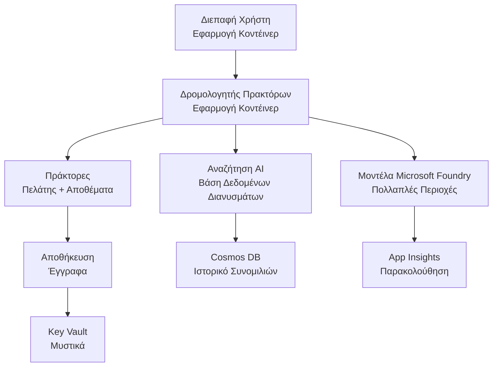

# Retail Multi-Agent Solution - Infrastructure Template

**Chapter 5: Production Deployment Package**
- **📚 Course Home**: [AZD For Beginners](../../README.md)
- **📖 Related Chapter**: [Chapter 5: Multi-Agent AI Solutions](../../README.md#-chapter-5-multi-agent-ai-solutions-advanced)
- **📝 Scenario Guide**: [Complete Architecture](../retail-scenario.md)
- **🎯 Quick Deploy**: [One-Click Deployment](../../../../examples/retail-multiagent-arm-template)

> **⚠️ INFRASTRUCTURE TEMPLATE ONLY**  
> Αυτό το ARM πρότυπο αναπτύσσει **πόρους Azure** για ένα σύστημα πολλαπλών agents.  
>  
> **Τι αναπτύσσεται (15-25 λεπτά):**
> - ✅ Microsoft Foundry Models (gpt-4.1, gpt-4.1-mini, embeddings σε 3 περιοχές)
> - ✅ AI Search service (κενό, έτοιμο για δημιουργία index)
> - ✅ Container Apps (εικόνες placeholder, έτοιμες για τον κώδικά σας)
> - ✅ Storage, Cosmos DB, Key Vault, Application Insights
>  
> **Τι ΔΕΝ περιλαμβάνεται (απαιτεί ανάπτυξη):**
> - ❌ Κώδικας υλοποίησης agents (Customer Agent, Inventory Agent)
> - ❌ Λογική δρομολόγησης και API endpoints
> - ❌ Frontend chat UI
> - ❌ Σχήματα index αναζήτησης και pipelines δεδομένων
> - ❌ **Εκτιμώμενη προσπάθεια ανάπτυξης: 80-120 ώρες**
>  
> **Χρησιμοποιήστε αυτό το πρότυπο αν:**
> - ✅ Θέλετε να προμηθεύσετε υποδομή Azure για ένα έργο πολλαπλών agents
> - ✅ Σκοπεύετε να αναπτύξετε την υλοποίηση του agent ξεχωριστά
> - ✅ Χρειάζεστε μια παραγωγική βάση υποδομής
>  
> **Μην το χρησιμοποιήσετε αν:**
> - ❌ Περιμένετε άμεσα ένα λειτουργικό demo πολλαπλών agents
> - ❌ Αναζητάτε πλήρη παραδείγματα κώδικα εφαρμογής

## Overview

Αυτός ο φάκελος περιέχει ένα ολοκληρωμένο Azure Resource Manager (ARM) πρότυπο για την ανάπτυξη του **θεμελιώδους υποδομής** ενός συστήματος υποστήριξης πελατών με πολλαπλούς agents. Το πρότυπο παρέχει όλες τις απαραίτητες υπηρεσίες Azure, σωστά διαμορφωμένες και διασυνδεδεμένες, έτοιμες για την ανάπτυξη της εφαρμογής σας.

**Μετά την ανάπτυξη, θα έχετε:** Παραγωγική υποδομή Azure  
**Για να ολοκληρώσετε το σύστημα, χρειάζεστε:** Κώδικα agents, frontend UI και ρύθμιση δεδομένων (βλέπε [Architecture Guide](../retail-scenario.md))

## 🎯 What Gets Deployed

### Core Infrastructure (Status After Deployment)

✅ **Microsoft Foundry Models Services** (Έτοιμο για κλήσεις API)
  - Primary region: gpt-4.1 deployment (20K TPM capacity)
  - Secondary region: gpt-4.1-mini deployment (10K TPM capacity)
  - Tertiary region: Text embeddings model (30K TPM capacity)
  - Evaluation region: gpt-4.1 grader model (15K TPM capacity)
  - **Κατάσταση:** Πλήρως λειτουργικό - μπορεί να κάνει κλήσεις API αμέσως

✅ **Azure AI Search** (Κενό - έτοιμο για διαμόρφωση)
  - Δυνατότητες αναζήτησης με vectors ενεργοποιημένες
  - Standard tier με 1 partition, 1 replica
  - **Κατάσταση:** Η υπηρεσία λειτουργεί, αλλά απαιτεί δημιουργία index
  - **Ενέργεια απαραίτητη:** Δημιουργήστε index αναζήτησης με το σχήμα σας

✅ **Azure Storage Account** (Κενό - έτοιμο για ανεβάσματα)
  - Blob containers: `documents`, `uploads`
  - Ασφαλής διαμόρφωση (μόνο HTTPS, χωρίς δημόσια πρόσβαση)
  - **Κατάσταση:** Έτοιμο να δεχτεί αρχεία
  - **Ενέργεια απαραίτητη:** Ανεβάστε τα δεδομένα προϊόντων και έγγραφά σας

⚠️ **Container Apps Environment** (Αναπτυγμένες εικόνες placeholder)
  - Agent router app (nginx default image)
  - Frontend app (nginx default image)
  - Αυτόματη κλιμάκωση διαμορφωμένη (0-10 instances)
  - **Κατάσταση:** Τρέχουν placeholder containers
  - **Ενέργεια απαραίτητη:** Δημιουργήστε και αναπτύξτε τις εφαρμογές των agents σας

✅ **Azure Cosmos DB** (Κενό - έτοιμο για δεδομένα)
  - Βάση δεδομένων και container προκαθορισμένα
  - Βελτιστοποιημένο για λειτουργίες χαμηλής καθυστέρησης
  - TTL ενεργοποιημένο για αυτόματο καθαρισμό
  - **Κατάσταση:** Έτοιμο για αποθήκευση ιστορικού συνομιλιών

✅ **Azure Key Vault** (Προαιρετικό - έτοιμο για μυστικά)
  - Soft delete ενεργοποιημένο
  - RBAC διαμορφωμένο για managed identities
  - **Κατάσταση:** Έτοιμο για αποθήκευση API keys και connection strings

✅ **Application Insights** (Προαιρετικό - παρακολούθηση ενεργή)
  - Συνδεδεμένο με Log Analytics workspace
  - Προσαρμοσμένα metrics και alerts διαμορφωμένα
  - **Κατάσταση:** Έτοιμο να λαμβάνει τηλεμετρία από τις εφαρμογές σας

✅ **Document Intelligence** (Έτοιμο για κλήσεις API)
  - S0 tier για παραγωγικά φορτία
  - **Κατάσταση:** Έτοιμο να επεξεργαστεί ανεβασμένα έγγραφα

✅ **Bing Search API** (Έτοιμο για κλήσεις API)
  - S1 tier για αναζητήσεις σε πραγματικό χρόνο
  - **Κατάσταση:** Έτοιμο για ερωτήματα web search

### Deployment Modes

| Mode | OpenAI Capacity | Container Instances | Search Tier | Storage Redundancy | Best For |
|------|-----------------|---------------------|-------------|-------------------|----------|
| **Minimal** | 10K-20K TPM | 0-2 replicas | Basic | LRS (Local) | Dev/test, learning, proof-of-concept |
| **Standard** | 30K-60K TPM | 2-5 replicas | Standard | ZRS (Zone) | Production, moderate traffic (<10K users) |
| **Premium** | 80K-150K TPM | 5-10 replicas, zone-redundant | Premium | GRS (Geo) | Enterprise, high traffic (>10K users), 99.99% SLA |

**Επίδραση στο Κόστος:**
- **Minimal → Standard:** ~4x αύξηση κόστους ($100-370/mo → $420-1,450/mo)
- **Standard → Premium:** ~3x αύξηση κόστους ($420-1,450/mo → $1,150-3,500/mo)
- **Επιλογή βάσει:** Αναμενόμενο φορτίο, απαιτήσεις SLA, περιορισμοί προϋπολογισμού

**Σχεδιασμός Χωρητικότητας:**
- **TPM (Tokens Per Minute):** Συνολικό across όλες τις αναπτύξεις μοντέλων
- **Container Instances:** Εύρος αυτόματης κλιμάκωσης (ελάχιστα-μέγιστα replicas)
- **Search Tier:** Επηρεάζει την απόδοση των ερωτημάτων και τα όρια μεγέθους index

## 📋 Prerequisites

### Required Tools
1. **Azure CLI** (version 2.50.0 or higher)
   ```bash
   az --version  # Ελέγξτε την έκδοση
   az login      # Αυθεντικοποιήστε
   ```

2. **Active Azure subscription** with Owner or Contributor access
   ```bash
   az account show  # Επαληθεύστε τη συνδρομή
   ```

### Required Azure Quotas

Πριν την ανάπτυξη, επαληθεύστε ότι υπάρχουν επαρκείς quota στις στοχευμένες περιοχές σας:

```bash
# Ελέγξτε τη διαθεσιμότητα των Microsoft Foundry Models στην περιοχή σας
az cognitiveservices account list-skus \
  --kind OpenAI \
  --location eastus2

# Επαληθεύστε το όριο χρήσης του OpenAI (παράδειγμα για gpt-4.1)
az cognitiveservices usage list \
  --location eastus2 \
  --query "[?name.value=='OpenAI.Standard.gpt-4.1']"

# Ελέγξτε το όριο για τα Container Apps
az provider show \
  --namespace Microsoft.App \
  --query "resourceTypes[?resourceType=='managedEnvironments'].locations"
```

**Ελάχιστες Απαιτούμενες Quotas:**
- **Microsoft Foundry Models:** 3-4 αναπτύξεις μοντέλων σε διάφορες περιοχές
  - gpt-4.1: 20K TPM (Tokens Per Minute)
  - gpt-4.1-mini: 10K TPM
  - text-embedding-ada-002: 30K TPM
  - **Σημείωση:** Το gpt-4.1 μπορεί να έχει λίστα αναμονής σε μερικές περιοχές - ελέγξτε [model availability](https://learn.microsoft.com/azure/ai-services/openai/concepts/models)
- **Container Apps:** Managed environment + 2-10 container instances
- **AI Search:** Standard tier (το Basic δεν επαρκεί για vector search)
- **Cosmos DB:** Standard provisioned throughput

**Εάν οι quotas είναι ανεπαρκείς:**
1. Μεταβείτε στο Azure Portal → Quotas → Request increase
2. Ή χρησιμοποιήστε το Azure CLI:
   ```bash
   az support tickets create \
     --ticket-name "OpenAI-Quota-Increase" \
     --severity "minimal" \
     --description "Request quota increase for Microsoft Foundry Models gpt-4.1 in eastus2"
   ```
3. Εξετάστε εναλλακτικές περιοχές με διαθεσιμότητα

## 🚀 Quick Deployment

### Option 1: Using Azure CLI

```bash
# Κλωνοποιήστε ή κατεβάστε τα αρχεία προτύπου
git clone <repository-url>
cd examples/retail-multiagent-arm-template

# Κάντε το script ανάπτυξης εκτελέσιμο
chmod +x deploy.sh

# Αναπτύξτε με τις προεπιλεγμένες ρυθμίσεις
./deploy.sh -g myResourceGroup

# Αναπτύξτε για παραγωγή με premium δυνατότητες
./deploy.sh -g myProdRG -e prod -m premium -l eastus2
```

### Option 2: Using Azure Portal

[](https://portal.azure.com/#create/Microsoft.Template/uri/https%3A%2F%2Fraw.githubusercontent.com%2Fmicrosoft%2Fazd-for-beginners%2Fmain%2Fexamples%2Fretail-multiagent-arm-template%2Fazuredeploy.json)

### Option 3: Using Azure CLI directly

```bash
# Δημιουργία ομάδας πόρων
az group create --name myResourceGroup --location eastus2

# Ανάπτυξη προτύπου
az deployment group create \
  --resource-group myResourceGroup \
  --template-file azuredeploy.json \
  --parameters azuredeploy.parameters.json
```

## ⏱️ Deployment Timeline

### Τι να Περιμένετε

| Phase | Duration | What Happens |
|-------|----------|--------------||
| **Template Validation** | 30-60 seconds | Το Azure επαληθεύει το σύνταξη και τις παραμέτρους του ARM template |
| **Resource Group Setup** | 10-20 seconds | Δημιουργεί το resource group (αν χρειάζεται) |
| **OpenAI Provisioning** | 5-8 minutes | Δημιουργεί 3-4 OpenAI accounts και αναπτύσσει τα μοντέλα |
| **Container Apps** | 3-5 minutes | Δημιουργεί environment και αναπτύσσει placeholder containers |
| **Search & Storage** | 2-4 minutes | Παρέχει AI Search service και storage accounts |
| **Cosmos DB** | 2-3 minutes | Δημιουργεί βάση δεδομένων και ρυθμίζει containers |
| **Monitoring Setup** | 2-3 minutes | Ρυθμίζει Application Insights και Log Analytics |
| **RBAC Configuration** | 1-2 minutes | Διαμορφώνει managed identities και άδειες |
| **Total Deployment** | **15-25 minutes** | Ολοκληρωμένη υποδομή έτοιμη |

**Μετά την Ανάπτυξη:**
- ✅ **Υποδομή Έτοιμη:** Όλες οι υπηρεσίες Azure παρεχόμενες και σε λειτουργία
- ⏱️ **Ανάπτυξη Εφαρμογής:** 80-120 ώρες (ευθύνη σας)
- ⏱️ **Διαμόρφωση Index:** 15-30 λεπτά (απαιτεί το σχήμα σας)
- ⏱️ **Ανέβασμα Δεδομένων:** Εξαρτάται από το μέγεθος του dataset
- ⏱️ **Δοκιμές & Επαλήθευση:** 2-4 ώρες

---

## ✅ Verify Deployment Success

### Step 1: Check Resource Provisioning (2 minutes)

```bash
# Επαληθεύστε ότι όλοι οι πόροι αναπτύχθηκαν επιτυχώς
az resource list \
  --resource-group myResourceGroup \
  --query "[?provisioningState!='Succeeded'].{Name:name, Status:provisioningState, Type:type}" \
  --output table
```

**Αναμενόμενο:** Κενός πίνακας (όλοι οι πόροι δείχνουν κατάσταση "Succeeded")

### Step 2: Verify Microsoft Foundry Models Deployments (3 minutes)

```bash
# Καταγράψτε όλους τους λογαριασμούς OpenAI
az cognitiveservices account list \
  --resource-group myResourceGroup \
  --query "[?kind=='OpenAI'].{Name:name, Location:location, Status:properties.provisioningState}" \
  --output table

# Ελέγξτε τις αναπτύξεις μοντέλων για την κύρια περιοχή
OPENAI_NAME=$(az cognitiveservices account list \
  --resource-group myResourceGroup \
  --query "[?kind=='OpenAI'] | [0].name" -o tsv)

az cognitiveservices account deployment list \
  --name $OPENAI_NAME \
  --resource-group myResourceGroup \
  --output table
```

**Αναμενόμενο:** 
- 3-4 OpenAI accounts (primary, secondary, tertiary, evaluation regions)
- 1-2 model deployments per account (gpt-4.1, gpt-4.1-mini, text-embedding-ada-002)

### Step 3: Test Infrastructure Endpoints (5 minutes)

```bash
# Λήψη διευθύνσεων URL της εφαρμογής κοντέινερ
az containerapp list \
  --resource-group myResourceGroup \
  --query "[].{Name:name, URL:properties.configuration.ingress.fqdn, Status:properties.runningStatus}" \
  --output table

# Δοκιμή τελικού σημείου δρομολογητή (θα απαντήσει μια εικόνα κράτησης θέσης)
ROUTER_URL=$(az containerapp show \
  --name retail-router \
  --resource-group myResourceGroup \
  --query "properties.configuration.ingress.fqdn" -o tsv)

echo "Testing: https://$ROUTER_URL"
curl -I https://$ROUTER_URL || echo "Container running (placeholder image - expected)"
```

**Αναμενόμενο:** 
- Τα Container Apps εμφανίζουν κατάσταση "Running"
- Το placeholder nginx απαντά με HTTP 200 ή 404 (δεν υπάρχει ακόμα κώδικας εφαρμογής)

### Step 4: Verify Microsoft Foundry Models API Access (3 minutes)

```bash
# Λήψη του endpoint και του κλειδιού της OpenAI
OPENAI_ENDPOINT=$(az cognitiveservices account show \
  --name $OPENAI_NAME \
  --resource-group myResourceGroup \
  --query "properties.endpoint" -o tsv)

OPENAI_KEY=$(az cognitiveservices account keys list \
  --name $OPENAI_NAME \
  --resource-group myResourceGroup \
  --query "key1" -o tsv)

# Δοκιμή ανάπτυξης gpt-4.1
curl "${OPENAI_ENDPOINT}openai/deployments/gpt-4.1/chat/completions?api-version=2024-08-01-preview" \
  -H "Content-Type: application/json" \
  -H "api-key: $OPENAI_KEY" \
  -d '{
    "messages": [{"role": "user", "content": "Say hello"}],
    "max_tokens": 10
  }'
```

**Αναμενόμενο:** JSON απόκριση με chat completion (επιβεβαιώνει ότι το OpenAI λειτουργεί)

### Τι Λειτουργεί vs. Τι Δεν Λειτουργεί

**✅ Λειτουργεί Μετά την Ανάπτυξη:**
- Τα Microsoft Foundry Models έχουν αναπτυχθεί και δέχονται κλήσεις API
- Η υπηρεσία AI Search τρέχει (κενή, χωρίς indexes)
- Τα Container Apps τρέχουν (εικόνες nginx placeholder)
- Οι Storage accounts είναι προσβάσιμοι και έτοιμοι για ανεβάσματα
- Το Cosmos DB είναι έτοιμο για λειτουργίες δεδομένων
- Το Application Insights συλλέγει τηλεμετρία υποδομής
- Το Key Vault έτοιμο για αποθήκευση μυστικών

**❌ Δεν Λειτουργούν Ακόμα (Απαιτείται Ανάπτυξη):**
- Endpoints των agents (δεν υπάρχει αναπτυγμένος κώδικας εφαρμογής)
- Λειτουργία chat (απαιτεί frontend + backend υλοποίηση)
- Ερωτήματα αναζήτησης (δεν έχει δημιουργηθεί index αναζήτησης)
- Pipeline επεξεργασίας εγγράφων (δεν έχουν ανέβει δεδομένα)
- Προσαρμοσμένη τηλεμετρία (απαιτεί instrumentation εφαρμογής)

**Επόμενα Βήματα:** Δείτε [Post-Deployment Configuration](../../../../examples/retail-multiagent-arm-template) για να αναπτύξετε και να ρυθμίσετε την εφαρμογή σας

---

## ⚙️ Configuration Options

### Template Parameters

| Parameter | Type | Default | Description |
|-----------|------|---------|-------------|
| `projectName` | string | "retail" | Prefix for all resource names |
| `location` | string | Resource group location | Primary deployment region |
| `secondaryLocation` | string | "westus2" | Secondary region for multi-region deployment |
| `tertiaryLocation` | string | "francecentral" | Region for embeddings model |
| `environmentName` | string | "dev" | Environment designation (dev/staging/prod) |
| `deploymentMode` | string | "standard" | Deployment configuration (minimal/standard/premium) |
| `enableMultiRegion` | bool | true | Enable multi-region deployment |
| `enableMonitoring` | bool | true | Enable Application Insights and logging |
| `enableSecurity` | bool | true | Enable Key Vault and enhanced security |

### Customizing Parameters

Edit `azuredeploy.parameters.json`:

```json
{
  "$schema": "https://schema.management.azure.com/schemas/2019-04-01/deploymentParameters.json#",
  "contentVersion": "1.0.0.0",
  "parameters": {
    "projectName": {
      "value": "mycompany"
    },
    "environmentName": {
      "value": "prod"
    },
    "deploymentMode": {
      "value": "premium"
    },
    "location": {
      "value": "eastus2"
    }
  }
}
```

## 🏗️ Architecture Overview


## 📖 Deployment Script Usage

Το script `deploy.sh` παρέχει μια διαδραστική εμπειρία ανάπτυξης:

```bash
# Εμφάνιση βοήθειας
./deploy.sh --help

# Βασική ανάπτυξη
./deploy.sh -g myResourceGroup

# Προηγμένη ανάπτυξη με προσαρμοσμένες ρυθμίσεις
./deploy.sh \
  -g myProductionRG \
  -p companyname \
  -e prod \
  -m premium \
  -l eastus2

# Ανάπτυξη για περιβάλλον ανάπτυξης χωρίς υποστήριξη πολλαπλών περιοχών
./deploy.sh \
  -g myDevRG \
  -e dev \
  -m minimal \
  --no-multi-region \
  --no-security
```

### Script Features

- ✅ **Έλεγχος προαπαιτούμενων** (Azure CLI, κατάσταση σύνδεσης, αρχεία template)
- ✅ **Διαχείριση resource group** (δημιουργεί αν δεν υπάρχει)
- ✅ **Επαλήθευση template** πριν την ανάπτυξη
- ✅ **Παρακολούθηση προόδου** με χρωματιστή έξοδο
- ✅ **Εξαγωγή αποτελεσμάτων ανάπτυξης**
- ✅ **Καθοδήγηση μετά την ανάπτυξη**

## 📊 Monitoring Deployment

### Έλεγχος Κατάστασης Ανάπτυξης

```bash
# Λίστα αναπτύξεων
az deployment group list --resource-group myResourceGroup --output table

# Λήψη λεπτομερειών ανάπτυξης
az deployment group show \
  --resource-group myResourceGroup \
  --name retail-deployment-YYYYMMDD-HHMMSS

# Παρακολούθηση προόδου ανάπτυξης
az deployment group create \
  --resource-group myResourceGroup \
  --template-file azuredeploy.json \
  --parameters azuredeploy.parameters.json \
  --verbose
```

### Deployment Outputs

Μετά από επιτυχή ανάπτυξη, είναι διαθέσιμα τα εξής outputs:

- **Frontend URL**: Δημόσιο endpoint για το web interface
- **Router URL**: API endpoint για τον agent router
- **OpenAI Endpoints**: Primary και secondary OpenAI service endpoints
- **Search Service**: Endpoint της υπηρεσίας Azure AI Search
- **Storage Account**: Όνομα του storage account για έγγραφα
- **Key Vault**: Όνομα του Key Vault (αν είναι ενεργοποιημένο)
- **Application Insights**: Όνομα της υπηρεσίας παρακολούθησης (αν είναι ενεργοποιημένο)

## 🔧 Post-Deployment: Next Steps
> **📝 Σημαντικό:** Η υποδομή έχει αναπτυχθεί, αλλά πρέπει να αναπτύξετε και να διανείμετε τον κώδικα της εφαρμογής.

### Φάση 1: Ανάπτυξη Εφαρμογών Πρακτόρων (Δική σας Ευθύνη)

Το πρότυπο ARM δημιουργεί **κενές Container Apps** με εικόνες nginx ως δείκτες θέσης. Πρέπει να:

**Απαιτούμενη Ανάπτυξη:**
1. **Agent Implementation** (30-40 hours)
   - Πράκτορας εξυπηρέτησης πελατών με ενσωμάτωση gpt-4.1
   - Πράκτορας αποθεμάτων με ενσωμάτωση gpt-4.1-mini
   - Λογική δρομολόγησης πρακτόρων

2. **Frontend Development** (20-30 hours)
   - Διεπαφή συνομιλίας UI (React/Vue/Angular)
   - Λειτουργία μεταφόρτωσης αρχείων
   - Απόδοση και μορφοποίηση απαντήσεων

3. **Backend Services** (12-16 hours)
   - FastAPI or Express router
   - Middleware ελέγχου ταυτότητας
   - Ενσωμάτωση τηλεμετρίας

**Δείτε:** [Architecture Guide](../retail-scenario.md) για λεπτομερή πρότυπα υλοποίησης και παραδείγματα κώδικα

### Φάση 2: Διαμορφώστε τον Δείκτη Αναζήτησης AI (15-30 λεπτά)

Δημιουργήστε έναν δείκτη αναζήτησης που ταιριάζει με το μοντέλο δεδομένων σας:

```bash
# Λήψη λεπτομερειών υπηρεσίας αναζήτησης
SEARCH_NAME=$(az search service list \
  --resource-group myResourceGroup \
  --query "[0].name" -o tsv)

SEARCH_KEY=$(az search admin-key show \
  --service-name $SEARCH_NAME \
  --resource-group myResourceGroup \
  --query "primaryKey" -o tsv)

# Δημιουργήστε ευρετήριο με το σχήμα σας (παράδειγμα)
curl -X POST "https://${SEARCH_NAME}.search.windows.net/indexes?api-version=2023-11-01" \
  -H "Content-Type: application/json" \
  -H "api-key: ${SEARCH_KEY}" \
  -d '{
    "name": "products",
    "fields": [
      {"name": "id", "type": "Edm.String", "key": true},
      {"name": "title", "type": "Edm.String", "searchable": true},
      {"name": "content", "type": "Edm.String", "searchable": true},
      {"name": "category", "type": "Edm.String", "filterable": true},
      {"name": "content_vector", "type": "Collection(Edm.Single)", 
       "searchable": true, "dimensions": 1536, "vectorSearchProfile": "default"}
    ],
    "vectorSearch": {
      "algorithms": [{"name": "default", "kind": "hnsw"}],
      "profiles": [{"name": "default", "algorithm": "default"}]
    }
  }'
```

**Πόροι:**
- [Σχεδιασμός Σχήματος Δείκτη Αναζήτησης AI](https://learn.microsoft.com/azure/search/search-what-is-an-index)
- [Διαμόρφωση Αναζήτησης Διανυσμάτων](https://learn.microsoft.com/azure/search/vector-search-how-to-create-index)

### Φάση 3: Μεταφορτώστε τα Δεδομένα σας (ο χρόνος διαφέρει)

Μόλις έχετε δεδομένα προϊόντων και έγγραφα:

```bash
# Λήψη στοιχείων λογαριασμού αποθήκευσης
STORAGE_NAME=$(az storage account list \
  --resource-group myResourceGroup \
  --query "[0].name" -o tsv)

STORAGE_KEY=$(az storage account keys list \
  --account-name $STORAGE_NAME \
  --resource-group myResourceGroup \
  --query "[0].value" -o tsv)

# Ανεβάστε τα έγγραφά σας
az storage blob upload-batch \
  --destination documents \
  --source /path/to/your/product/docs \
  --account-name $STORAGE_NAME \
  --account-key $STORAGE_KEY

# Παράδειγμα: Ανέβασμα ενός αρχείου
az storage blob upload \
  --container-name documents \
  --name "product-manual.pdf" \
  --file /path/to/product-manual.pdf \
  --account-name $STORAGE_NAME \
  --account-key $STORAGE_KEY
```

### Φάση 4: Κατασκευάστε και Αναπτύξτε τις Εφαρμογές σας (8-12 ώρες)

Μόλις αναπτύξετε τον κώδικα των πρακτόρων σας:

```bash
# 1. Δημιουργήστε το Azure Container Registry (εάν χρειάζεται)
az acr create \
  --name myregistry \
  --resource-group myResourceGroup \
  --sku Basic

# 2. Δημιουργήστε και ανεβάστε την εικόνα του agent router
docker build -t myregistry.azurecr.io/agent-router:v1 /path/to/your/router/code
az acr login --name myregistry
docker push myregistry.azurecr.io/agent-router:v1

# 3. Δημιουργήστε και ανεβάστε την εικόνα του frontend
docker build -t myregistry.azurecr.io/frontend:v1 /path/to/your/frontend/code
docker push myregistry.azurecr.io/frontend:v1

# 4. Ενημερώστε τα Container Apps με τις εικόνες σας
az containerapp update \
  --name retail-router \
  --resource-group myResourceGroup \
  --image myregistry.azurecr.io/agent-router:v1

az containerapp update \
  --name retail-frontend \
  --resource-group myResourceGroup \
  --image myregistry.azurecr.io/frontend:v1

# 5. Ρυθμίστε τις μεταβλητές περιβάλλοντος
az containerapp update \
  --name retail-router \
  --resource-group myResourceGroup \
  --set-env-vars \
    OPENAI_ENDPOINT=secretref:openai-endpoint \
    OPENAI_KEY=secretref:openai-key \
    SEARCH_ENDPOINT=secretref:search-endpoint \
    SEARCH_KEY=secretref:search-key
```

### Φάση 5: Δοκιμάστε την Εφαρμογή σας (2-4 ώρες)

```bash
# Αποκτήστε το URL της εφαρμογής σας
ROUTER_URL=$(az containerapp show \
  --name retail-router \
  --resource-group myResourceGroup \
  --query "properties.configuration.ingress.fqdn" -o tsv)

# Δοκιμάστε το endpoint του πράκτορα (μόλις ο κώδικάς σας αναπτυχθεί)
curl -X POST "https://${ROUTER_URL}/chat" \
  -H "Content-Type: application/json" \
  -d '{
    "message": "Hello, I need help with my order",
    "agent": "customer"
  }'

# Ελέγξτε τα αρχεία καταγραφής της εφαρμογής
az containerapp logs show \
  --name retail-router \
  --resource-group myResourceGroup \
  --follow
```

### Πόροι Υλοποίησης

**Αρχιτεκτονική & Σχεδιασμός:**
- 📖 [Πλήρης Οδηγός Αρχιτεκτονικής](../retail-scenario.md) - Λεπτομερή πρότυπα υλοποίησης
- 📖 [Σχεδιαστικά Πρότυπα Πολυπρακτορικών Συστημάτων](https://learn.microsoft.com/azure/architecture/ai-ml/guide/multi-agent-systems)

**Παραδείγματα Κώδικα:**
- 🔗 [Δείγμα Chat Microsoft Foundry Models](https://github.com/Azure-Samples/azure-search-openai-demo) - πρότυπο RAG
- 🔗 [Semantic Kernel](https://github.com/microsoft/semantic-kernel) - Πλαίσιο πρακτόρων (C#)
- 🔗 [LangChain Azure](https://github.com/langchain-ai/langchain) - Ορχήστρωση πρακτόρων (Python)
- 🔗 [AutoGen](https://github.com/microsoft/autogen) - Συνομιλίες πολυπρακτόρων

**Εκτιμώμενη Συνολική Προσπάθεια:**
- Ανάπτυξη υποδομής: 15-25 minutes (✅ Complete)
- Ανάπτυξη εφαρμογής: 80-120 hours (🔨 Η δική σας εργασία)
- Δοκιμές και βελτιστοποίηση: 15-25 hours (🔨 Η δική σας εργασία)

## 🛠️ Αντιμετώπιση προβλημάτων

### Συνηθισμένα Προβλήματα

#### 1. Υπέρβαση ποσοστώσεων Microsoft Foundry Models

```bash
# Ελέγξτε την τρέχουσα χρήση του ορίου
az cognitiveservices usage list --location eastus2

# Ζητήστε αύξηση του ορίου
az support tickets create \
  --ticket-name "OpenAI-Quota-Increase" \
  --severity "minimal" \
  --description "Request quota increase for Microsoft Foundry Models in region X"
```

#### 2. Η ανάπτυξη των Container Apps απέτυχε

```bash
# Έλεγχος των αρχείων καταγραφής της εφαρμογής κοντέινερ
az containerapp logs show \
  --name retail-router \
  --resource-group myResourceGroup \
  --follow

# Επανεκκίνηση της εφαρμογής κοντέινερ
az containerapp revision restart \
  --name retail-router \
  --resource-group myResourceGroup
```

#### 3. Αρχικοποίηση Υπηρεσίας Αναζήτησης

```bash
# Επαλήθευση κατάστασης υπηρεσίας αναζήτησης
az search service show \
  --name <search-service-name> \
  --resource-group myResourceGroup

# Δοκιμή συνδεσιμότητας υπηρεσίας αναζήτησης
curl -X GET "https://<search-service-name>.search.windows.net/indexes?api-version=2023-11-01" \
  -H "api-key: <search-admin-key>"
```

### Επικύρωση Ανάπτυξης

```bash
# Επαληθεύστε ότι όλοι οι πόροι έχουν δημιουργηθεί
az resource list \
  --resource-group myResourceGroup \
  --output table

# Ελέγξτε την υγεία των πόρων
az resource list \
  --resource-group myResourceGroup \
  --query "[?provisioningState!='Succeeded'].{Name:name, Status:provisioningState, Type:type}" \
  --output table
```

## 🔐 Ζητήματα Ασφαλείας

### Διαχείριση Κλειδιών
- Όλα τα μυστικά αποθηκεύονται στο Azure Key Vault (όταν είναι ενεργοποιημένο)
- Οι Container apps χρησιμοποιούν διαχειριζόμενη ταυτότητα για έλεγχο ταυτότητας
- Οι λογαριασμοί αποθήκευσης έχουν ασφαλείς προεπιλογές (μόνο HTTPS, χωρίς δημόσια πρόσβαση blob)

### Ασφάλεια Δικτύου
- Οι Container apps χρησιμοποιούν εσωτερική δικτύωση όπου είναι δυνατό
- Η υπηρεσία αναζήτησης είναι διαμορφωμένη με την επιλογή ιδιωτικών endpoints
- Το Cosmos DB είναι διαμορφωμένο με τις ελάχιστες απαραίτητες άδειες

### Διαμόρφωση RBAC
```bash
# Ανάθεση των απαραίτητων ρόλων στη διαχειριζόμενη ταυτότητα
az role assignment create \
  --assignee <container-app-managed-identity> \
  --role "Cognitive Services OpenAI User" \
  --scope <openai-resource-id>
```

## 💰 Βελτιστοποίηση Κόστους

### Εκτιμήσεις Κόστους (Μηνιαίο, USD)

| Λειτουργία | OpenAI | Container Apps | Αναζήτηση | Αποθήκευση | Συνολ. Εκτίμηση |
|------|--------|----------------|--------|---------|------------|
| Ελάχιστο | $50-200 | $20-50 | $25-100 | $5-20 | $100-370 |
| Τυπικό | $200-800 | $100-300 | $100-300 | $20-50 | $420-1450 |
| Premium | $500-2000 | $300-800 | $300-600 | $50-100 | $1150-3500 |

### Παρακολούθηση Κόστους

```bash
# Ρύθμιση ειδοποιήσεων προϋπολογισμού
az consumption budget create \
  --account-name <subscription-id> \
  --budget-name "retail-budget" \
  --amount 500 \
  --time-grain Monthly \
  --start-date 2024-01-01 \
  --end-date 2024-12-31
```

## 🔄 Ενημερώσεις και Συντήρηση

### Ενημερώσεις Προτύπου
- Χρησιμοποιήστε έλεγχο εκδόσεων για τα αρχεία προτύπου ARM
- Δοκιμάστε τις αλλαγές πρώτα στο περιβάλλον ανάπτυξης
- Χρησιμοποιήστε λειτουργία incremental deployment για ενημερώσεις

### Ενημερώσεις Πόρων
```bash
# Ενημέρωση με νέες παραμέτρους
az deployment group create \
  --resource-group myResourceGroup \
  --template-file azuredeploy.json \
  --parameters azuredeploy.parameters.json \
  --mode Incremental
```

### Δημιουργία αντιγράφων ασφαλείας και Αποκατάσταση
- Αυτόματη δημιουργία αντιγράφων ασφαλείας Cosmos DB ενεργοποιημένη
- Η δυνατότητα soft delete του Key Vault ενεργοποιημένη
- Οι αναθεωρήσεις των Container app διατηρούνται για επαναφορά

## 📞 Υποστήριξη

- **Ζητήματα Προτύπου**: [GitHub Issues](https://github.com/microsoft/azd-for-beginners/issues)
- **Υποστήριξη Azure**: [Azure Support Portal](https://portal.azure.com/#blade/Microsoft_Azure_Support/HelpAndSupportBlade)
- **Κοινότητα**: [Azure AI Discord](https://discord.gg/microsoft-azure)

---

**⚡ Έτοιμοι να αναπτύξετε τη λύση πολλαπλών πρακτόρων σας;**

Ξεκινήστε με: `./deploy.sh -g myResourceGroup`

---

<!-- CO-OP TRANSLATOR DISCLAIMER START -->
Αποποίηση ευθύνης:
Το παρόν έγγραφο έχει μεταφραστεί χρησιμοποιώντας την υπηρεσία μετάφρασης τεχνητής νοημοσύνης [Co-op Translator](https://github.com/Azure/co-op-translator). Παρότι καταβάλλουμε προσπάθειες για ακρίβεια, λάβετε υπόψη ότι οι αυτοματοποιημένες μεταφράσεις ενδέχεται να περιέχουν σφάλματα ή ανακρίβειες. Το πρωτότυπο έγγραφο στην αρχική του γλώσσα πρέπει να θεωρείται η αυθεντική πηγή. Για κρίσιμες πληροφορίες συνιστάται η επαγγελματική, ανθρώπινη μετάφραση. Δεν φέρουμε ευθύνη για τυχόν παρανοήσεις ή εσφαλμένες ερμηνείες που προκύπτουν από τη χρήση αυτής της μετάφρασης.
<!-- CO-OP TRANSLATOR DISCLAIMER END -->