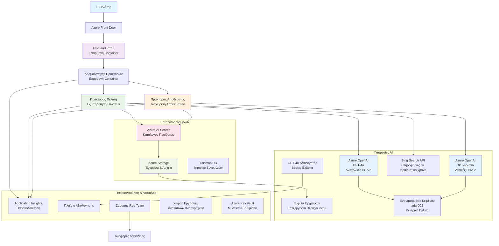

<!--
CO_OP_TRANSLATOR_METADATA:
{
  "original_hash": "77db71c83f2e7fbc9f50320bd1cc7116",
  "translation_date": "2025-11-21T06:23:26+00:00",
  "source_file": "examples/retail-scenario.md",
  "language_code": "el"
}
-->
# Λύση Υποστήριξης Πελατών με Πολλαπλούς Πράκτορες - Σενάριο Λιανικής

**Κεφάλαιο 5: Λύσεις Τεχνητής Νοημοσύνης με Πολλαπλούς Πράκτορες**  
- **📚 Αρχική Σελίδα Μαθήματος**: [AZD Για Αρχάριους](../README.md)  
- **📖 Τρέχον Κεφάλαιο**: [Κεφάλαιο 5: Λύσεις Τεχνητής Νοημοσύνης με Πολλαπλούς Πράκτορες](../README.md#-chapter-5-multi-agent-ai-solutions-advanced)  
- **⬅️ Προαπαιτούμενα**: [Κεφάλαιο 2: Ανάπτυξη με Προτεραιότητα στην ΤΝ](../docs/ai-foundry/azure-ai-foundry-integration.md)  
- **➡️ Επόμενο Κεφάλαιο**: [Κεφάλαιο 6: Επικύρωση πριν την Ανάπτυξη](../docs/pre-deployment/capacity-planning.md)  
- **🚀 ARM Templates**: [Πακέτο Ανάπτυξης](retail-multiagent-arm-template/README.md)  

> **⚠️ ΟΔΗΓΟΣ ΑΡΧΙΤΕΚΤΟΝΙΚΗΣ - ΟΧΙ ΕΤΟΙΜΗ ΥΛΟΠΟΙΗΣΗ**  
> Αυτό το έγγραφο παρέχει ένα **πλήρες σχέδιο αρχιτεκτονικής** για την κατασκευή ενός συστήματος με πολλαπλούς πράκτορες.  
> **Τι υπάρχει:** ARM template για ανάπτυξη υποδομής (Azure OpenAI, AI Search, Container Apps, κ.λπ.)  
> **Τι πρέπει να δημιουργήσετε:** Κώδικας πρακτόρων, λογική δρομολόγησης, frontend UI, pipelines δεδομένων (εκτιμώμενος χρόνος 80-120 ώρες)  
>  
> **Χρησιμοποιήστε το ως:**
> - ✅ Αναφορά αρχιτεκτονικής για το δικό σας έργο με πολλαπλούς πράκτορες  
> - ✅ Οδηγός εκμάθησης για μοτίβα σχεδίασης πολλαπλών πρακτόρων  
> - ✅ Template υποδομής για ανάπτυξη πόρων Azure  
> - ❌ ΟΧΙ έτοιμη εφαρμογή (απαιτεί σημαντική ανάπτυξη)

## Επισκόπηση

**Στόχος Εκμάθησης:** Κατανόηση της αρχιτεκτονικής, των αποφάσεων σχεδίασης και της προσέγγισης υλοποίησης για την κατασκευή ενός chatbot υποστήριξης πελατών με πολλαπλούς πράκτορες για έναν λιανοπωλητή, με προηγμένες δυνατότητες ΤΝ, όπως διαχείριση αποθεμάτων, επεξεργασία εγγράφων και έξυπνες αλληλεπιδράσεις με πελάτες.

**Χρόνος Ολοκλήρωσης:** Ανάγνωση + Κατανόηση (2-3 ώρες) | Πλήρης Υλοποίηση (80-120 ώρες)

**Τι θα Μάθετε:**
- Μοτίβα αρχιτεκτονικής και αρχές σχεδίασης πολλαπλών πρακτόρων  
- Στρατηγικές ανάπτυξης Azure OpenAI σε πολλές περιοχές  
- Ενσωμάτωση AI Search με RAG (Ανάκτηση-Ενισχυμένη Γενεά)  
- Πλαίσια αξιολόγησης πρακτόρων και δοκιμών ασφαλείας  
- Σκέψεις για ανάπτυξη σε παραγωγή και βελτιστοποίηση κόστους  

## Στόχοι Αρχιτεκτονικής

**Εκπαιδευτική Εστίαση:** Αυτή η αρχιτεκτονική παρουσιάζει μοτίβα επιχειρησιακής κλίμακας για συστήματα πολλαπλών πρακτόρων.

### Απαιτήσεις Συστήματος (Για τη Δική σας Υλοποίηση)

Μια λύση υποστήριξης πελατών σε παραγωγή απαιτεί:  
- **Πολλαπλούς εξειδικευμένους πράκτορες** για διαφορετικές ανάγκες πελατών (Εξυπηρέτηση Πελατών + Διαχείριση Αποθεμάτων)  
- **Ανάπτυξη πολλαπλών μοντέλων** με σωστό σχεδιασμό χωρητικότητας (GPT-4o, GPT-4o-mini, embeddings σε διάφορες περιοχές)  
- **Δυναμική ενσωμάτωση δεδομένων** με AI Search και μεταφορτώσεις αρχείων (αναζήτηση vector + επεξεργασία εγγράφων)  
- **Πλήρη παρακολούθηση** και δυνατότητες αξιολόγησης (Application Insights + προσαρμοσμένες μετρήσεις)  
- **Ασφάλεια επιπέδου παραγωγής** με επικύρωση red teaming (σάρωση ευπαθειών + αξιολόγηση πρακτόρων)  

### Τι Παρέχει Αυτός ο Οδηγός

✅ **Μοτίβα Αρχιτεκτονικής** - Αποδεδειγμένος σχεδιασμός για συστήματα πολλαπλών πρακτόρων  
✅ **Templates Υποδομής** - ARM templates για ανάπτυξη όλων των υπηρεσιών Azure  
✅ **Παραδείγματα Κώδικα** - Αναφορές υλοποίησης για βασικά στοιχεία  
✅ **Οδηγίες Ρύθμισης** - Βήμα-βήμα οδηγίες εγκατάστασης  
✅ **Βέλτιστες Πρακτικές** - Στρατηγικές ασφάλειας, παρακολούθησης, βελτιστοποίησης κόστους  

❌ **Δεν Περιλαμβάνεται** - Πλήρως λειτουργική εφαρμογή (απαιτεί προσπάθεια ανάπτυξης)

## 🗺️ Οδικός Χάρτης Υλοποίησης

### Φάση 1: Μελέτη Αρχιτεκτονικής (2-3 ώρες) - ΞΕΚΙΝΗΣΤΕ ΕΔΩ

**Στόχος:** Κατανόηση του σχεδιασμού του συστήματος και των αλληλεπιδράσεων των στοιχείων

- [ ] Διαβάστε αυτό το πλήρες έγγραφο  
- [ ] Ανασκόπηση του διαγράμματος αρχιτεκτονικής και των σχέσεων των στοιχείων  
- [ ] Κατανόηση μοτίβων πολλαπλών πρακτόρων και αποφάσεων σχεδίασης  
- [ ] Μελέτη παραδειγμάτων κώδικα για εργαλεία πρακτόρων και δρομολόγηση  
- [ ] Ανασκόπηση εκτιμήσεων κόστους και οδηγιών σχεδιασμού χωρητικότητας  

**Αποτέλεσμα:** Σαφής κατανόηση του τι πρέπει να δημιουργήσετε  

### Φάση 2: Ανάπτυξη Υποδομής (30-45 λεπτά)

**Στόχος:** Παροχή πόρων Azure χρησιμοποιώντας ARM template  

```bash
cd retail-multiagent-arm-template
./deploy.sh -g myResourceGroup -m standard
```
  
**Τι Αναπτύσσεται:**  
- ✅ Azure OpenAI (3 περιοχές: GPT-4o, GPT-4o-mini, embeddings)  
- ✅ Υπηρεσία AI Search (κενή, χρειάζεται διαμόρφωση index)  
- ✅ Περιβάλλον Container Apps (εικόνες placeholder)  
- ✅ Λογαριασμοί αποθήκευσης, Cosmos DB, Key Vault  
- ✅ Παρακολούθηση Application Insights  

**Τι Λείπει:**  
- ❌ Κώδικας υλοποίησης πρακτόρων  
- ❌ Λογική δρομολόγησης  
- ❌ Frontend UI  
- ❌ Σχήμα index αναζήτησης  
- ❌ Pipelines δεδομένων  

### Φάση 3: Δημιουργία Εφαρμογής (80-120 ώρες)

**Στόχος:** Υλοποίηση του συστήματος πολλαπλών πρακτόρων βάσει αυτής της αρχιτεκτονικής  

1. **Υλοποίηση Πρακτόρων** (30-40 ώρες)  
   - Βασική κλάση πρακτόρων και διεπαφές  
   - Πράκτορας εξυπηρέτησης πελατών με GPT-4o  
   - Πράκτορας αποθεμάτων με GPT-4o-mini  
   - Ενσωματώσεις εργαλείων (AI Search, Bing, επεξεργασία αρχείων)  

2. **Υπηρεσία Δρομολόγησης** (12-16 ώρες)  
   - Λογική ταξινόμησης αιτημάτων  
   - Επιλογή και ορχήστρα πρακτόρων  
   - Backend FastAPI/Express  

3. **Ανάπτυξη Frontend** (20-30 ώρες)  
   - Διεπαφή συνομιλίας UI  
   - Λειτουργικότητα μεταφόρτωσης αρχείων  
   - Απόδοση απαντήσεων  

4. **Pipeline Δεδομένων** (8-12 ώρες)  
   - Δημιουργία index AI Search  
   - Επεξεργασία εγγράφων με Document Intelligence  
   - Δημιουργία και ευρετηρίαση embeddings  

5. **Παρακολούθηση & Αξιολόγηση** (10-15 ώρες)  
   - Υλοποίηση προσαρμοσμένης τηλεμετρίας  
   - Πλαίσιο αξιολόγησης πρακτόρων  
   - Σαρωτής ασφαλείας red team  

### Φάση 4: Ανάπτυξη & Δοκιμή (8-12 ώρες)

- Δημιουργία εικόνων Docker για όλες τις υπηρεσίες  
- Ανέβασμα στο Azure Container Registry  
- Ενημέρωση Container Apps με πραγματικές εικόνες  
- Διαμόρφωση μεταβλητών περιβάλλοντος και μυστικών  
- Εκτέλεση σουίτας δοκιμών αξιολόγησης  
- Εκτέλεση σάρωσης ασφαλείας  

**Συνολική Εκτιμώμενη Προσπάθεια:** 80-120 ώρες για έμπειρους προγραμματιστές  

## Αρχιτεκτονική Λύσης

### Διάγραμμα Αρχιτεκτονικής


### Επισκόπηση Στοιχείων

| Στοιχείο | Σκοπός | Τεχνολογία | Περιοχή |  
|-----------|---------|------------|---------|  
| **Web Frontend** | Διεπαφή χρήστη για αλληλεπιδράσεις πελατών | Container Apps | Κύρια Περιοχή |  
| **Agent Router** | Δρομολογεί αιτήματα στον κατάλληλο πράκτορα | Container Apps | Κύρια Περιοχή |  
| **Customer Agent** | Διαχειρίζεται ερωτήματα εξυπηρέτησης πελατών | Container Apps + GPT-4o | Κύρια Περιοχή |  
| **Inventory Agent** | Διαχειρίζεται αποθέματα και εκπλήρωση | Container Apps + GPT-4o-mini | Κύρια Περιοχή |  
| **Azure OpenAI** | Επεξεργασία LLM για πράκτορες | Cognitive Services | Πολλαπλές Περιοχές |  
| **AI Search** | Αναζήτηση vector και RAG | Υπηρεσία AI Search | Κύρια Περιοχή |  
| **Storage Account** | Μεταφορτώσεις αρχείων και έγγραφα | Blob Storage | Κύρια Περιοχή |  
| **Application Insights** | Παρακολούθηση και τηλεμετρία | Monitor | Κύρια Περιοχή |  
| **Grader Model** | Σύστημα αξιολόγησης πρακτόρων | Azure OpenAI | Δευτερεύουσα Περιοχή |  

## 📁 Δομή Έργου

> **📍 Κατάσταση Στοιχείων:**  
> ✅ = Υπάρχει στο αποθετήριο  
> 📝 = Αναφορά υλοποίησης (παράδειγμα κώδικα σε αυτό το έγγραφο)  
> 🔨 = Πρέπει να δημιουργηθεί  

```
retail-multiagent-solution/              🔨 Your project directory
├── .azure/                              🔨 Azure environment configs
│   ├── config.json                      🔨 Global config
│   └── env/
│       ├── .env.development             🔨 Dev environment
│       ├── .env.staging                 🔨 Staging environment
│       └── .env.production              🔨 Production environment
│
├── azure.yaml                          🔨 AZD main configuration
├── azure.parameters.json               🔨 Deployment parameters
├── README.md                           🔨 Solution documentation
│
├── infra/                              🔨 Infrastructure as Code (you create)
│   ├── main.bicep                      🔨 Main Bicep template (optional, ARM exists)
│   ├── main.parameters.json            🔨 Parameters file
│   ├── modules/                        📝 Bicep modules (reference examples below)
│   │   ├── ai-services.bicep           📝 Azure OpenAI deployments
│   │   ├── search.bicep                📝 AI Search configuration
│   │   ├── storage.bicep               📝 Storage accounts
│   │   ├── container-apps.bicep        📝 Container Apps environment
│   │   ├── monitoring.bicep            📝 Application Insights
│   │   ├── security.bicep              📝 Key Vault and RBAC
│   │   └── networking.bicep            📝 Virtual networks and DNS
│   ├── arm-template/                   ✅ ARM template version (EXISTS)
│   │   ├── azuredeploy.json            ✅ ARM main template (retail-multiagent-arm-template/)
│   │   └── azuredeploy.parameters.json ✅ ARM parameters
│   └── scripts/                        ✅/🔨 Deployment scripts
│       ├── deploy.sh                   ✅ Main deployment script (EXISTS)
│       ├── setup-data.sh               🔨 Data setup script (you create)
│       └── configure-rbac.sh           🔨 RBAC configuration (you create)
│
├── src/                                🔨 Application source code (YOU BUILD THIS)
│   ├── agents/                         📝 Agent implementations (examples below)
│   │   ├── base/                       🔨 Base agent classes
│   │   │   ├── agent.py                🔨 Abstract agent class
│   │   │   └── tools.py                🔨 Tool interfaces
│   │   ├── customer/                   🔨 Customer service agent
│   │   │   ├── agent.py                📝 Customer agent implementation (see below)
│   │   │   ├── prompts.py              🔨 System prompts
│   │   │   └── tools/                  🔨 Agent-specific tools
│   │   │       ├── search_tool.py      📝 AI Search integration (example below)
│   │   │       ├── bing_tool.py        📝 Bing Search integration (example below)
│   │   │       └── file_tool.py        🔨 File processing tool
│   │   └── inventory/                  🔨 Inventory management agent
│   │       ├── agent.py                🔨 Inventory agent implementation
│   │       ├── prompts.py              🔨 System prompts
│   │       └── tools/                  🔨 Agent-specific tools
│   │           ├── inventory_search.py 🔨 Inventory search tool
│   │           └── database_tool.py    🔨 Database query tool
│   │
│   ├── router/                         🔨 Agent routing service (you build)
│   │   ├── main.py                     🔨 FastAPI router application
│   │   ├── routing_logic.py            🔨 Request routing logic
│   │   └── middleware.py               🔨 Authentication & logging
│   │
│   ├── frontend/                       🔨 Web user interface (you build)
│   │   ├── Dockerfile                  🔨 Container configuration
│   │   ├── package.json                🔨 Node.js dependencies
│   │   ├── src/                        🔨 React/Vue source code
│   │   │   ├── components/             🔨 UI components
│   │   │   ├── pages/                  🔨 Application pages
│   │   │   ├── services/               🔨 API services
│   │   │   └── styles/                 🔨 CSS and themes
│   │   └── public/                     🔨 Static assets
│   │
│   ├── shared/                         🔨 Shared utilities (you build)
│   │   ├── config.py                   🔨 Configuration management
│   │   ├── telemetry.py                📝 Telemetry utilities (example below)
│   │   ├── security.py                 🔨 Security utilities
│   │   └── models.py                   🔨 Data models
│   │
│   └── evaluation/                     🔨 Evaluation and testing (you build)
│       ├── evaluator.py                📝 Agent evaluator (example below)
│       ├── red_team_scanner.py         📝 Security scanner (example below)
│       ├── test_cases.json             📝 Evaluation test cases (example below)
│       └── reports/                    🔨 Generated reports
│
├── data/                               🔨 Data and configuration (you create)
│   ├── search-schema.json              📝 AI Search index schema (example below)
│   ├── initial-docs/                   🔨 Initial document corpus
│   │   ├── product-manuals/            🔨 Product documentation (your data)
│   │   ├── policies/                   🔨 Company policies (your data)
│   │   └── faqs/                       🔨 Frequently asked questions (your data)
│   ├── fine-tuning/                    🔨 Fine-tuning datasets (optional)
│   │   ├── training.jsonl              🔨 Training data
│   │   └── validation.jsonl            🔨 Validation data
│   └── evaluation/                     🔨 Evaluation datasets
│       ├── test-conversations.json     📝 Test conversation data (example below)
│       └── ground-truth.json           🔨 Expected responses
│
├── scripts/                            # Utility scripts
│   ├── setup/                          # Setup scripts
│   │   ├── bootstrap.sh                # Initial environment setup
│   │   ├── install-dependencies.sh     # Install required tools
│   │   └── configure-env.sh            # Environment configuration
│   ├── data-management/                # Data management scripts
│   │   ├── upload-documents.py         # Document upload utility
│   │   ├── create-search-index.py      # Search index creation
│   │   └── sync-data.py                # Data synchronization
│   ├── deployment/                     # Deployment automation
│   │   ├── deploy-agents.sh            # Agent deployment
│   │   ├── update-frontend.sh          # Frontend updates
│   │   └── rollback.sh                 # Rollback procedures
│   └── monitoring/                     # Monitoring scripts
│       ├── health-check.py             # Health monitoring
│       ├── performance-test.py         # Performance testing
│       └── security-scan.py            # Security scanning
│
├── tests/                              # Test suites
│   ├── unit/                           # Unit tests
│   │   ├── test_agents.py              # Agent unit tests
│   │   ├── test_router.py              # Router unit tests
│   │   └── test_tools.py               # Tool unit tests
│   ├── integration/                    # Integration tests
│   │   ├── test_end_to_end.py          # E2E test scenarios
│   │   └── test_api.py                 # API integration tests
│   └── load/                           # Load testing
│       ├── load_test_config.yaml       # Load test configuration
│       └── scenarios/                  # Load test scenarios
│
├── docs/                               # Documentation
│   ├── architecture.md                 # Architecture documentation
│   ├── deployment-guide.md             # Deployment instructions
│   ├── agent-configuration.md          # Agent setup guide
│   ├── troubleshooting.md              # Troubleshooting guide
│   └── api/                            # API documentation
│       ├── agent-api.md                # Agent API reference
│       └── router-api.md               # Router API reference
│
├── hooks/                              # AZD lifecycle hooks
│   ├── preprovision.sh                 # Pre-provisioning tasks
│   ├── postprovision.sh                # Post-provisioning setup
│   ├── prepackage.sh                   # Pre-packaging tasks
│   └── postdeploy.sh                   # Post-deployment validation
│
└── .github/                            # GitHub workflows
    └── workflows/
        ├── ci-cd.yml                   # CI/CD pipeline
        ├── security-scan.yml           # Security scanning
        └── performance-test.yml        # Performance testing
```
  
---

## 🚀 Γρήγορη Εκκίνηση: Τι Μπορείτε να Κάνετε Τώρα

### Επιλογή 1: Ανάπτυξη Μόνο Υποδομής (30 λεπτά)

**Τι λαμβάνετε:** Όλες οι υπηρεσίες Azure αναπτυγμένες και έτοιμες για ανάπτυξη  

```bash
# Κλωνοποίηση αποθετηρίου
git clone https://github.com/microsoft/AZD-for-beginners.git
cd AZD-for-beginners/examples/retail-multiagent-arm-template

# Ανάπτυξη υποδομής
./deploy.sh -g myResourceGroup -m standard

# Επαλήθευση ανάπτυξης
az resource list --resource-group myResourceGroup --output table
```
  
**Αναμενόμενο αποτέλεσμα:**  
- ✅ Υπηρεσίες Azure OpenAI αναπτυγμένες (3 περιοχές)  
- ✅ Υπηρεσία AI Search δημιουργημένη (κενή)  
- ✅ Περιβάλλον Container Apps έτοιμο  
- ✅ Αποθήκευση, Cosmos DB, Key Vault διαμορφωμένα  
- ❌ Χωρίς λειτουργικούς πράκτορες ακόμα (μόνο υποδομή)  

### Επιλογή 2: Μελέτη Αρχιτεκτονικής (2-3 ώρες)

**Τι λαμβάνετε:** Βαθιά κατανόηση μοτίβων πολλαπλών πρακτόρων  

1. Διαβάστε αυτό το πλήρες έγγραφο  
2. Ανασκόπηση παραδειγμάτων κώδικα για κάθε στοιχείο  
3. Κατανόηση αποφάσεων σχεδίασης και συμβιβασμών  
4. Μελέτη στρατηγικών βελτιστοποίησης κόστους  
5. Σχεδιασμός της προσέγγισης υλοποίησης  

**Αναμενόμενο αποτέλεσμα:**  
- ✅ Σαφές νοητικό μοντέλο της αρχιτεκτονικής του συστήματος  
- ✅ Κατανόηση των απαιτούμενων στοιχείων  
- ✅ Ρεαλιστικές εκτιμήσεις προσπάθειας  
- ✅ Σχέδιο υλοποίησης  

### Επιλογή 3: Δημιουργία Πλήρους Συστήματος (80-120 ώρες)

**Τι λαμβάνετε:** Λύση πολλαπλών πρακτόρων έτοιμη για παραγωγή  

1. **Φάση 1:** Ανάπτυξη υποδομής (ολοκληρωμένο παραπάνω)  
2. **Φάση 2:** Υλοποίηση πρακτόρων χρησιμοποιώντας παραδείγματα κώδικα παρακάτω (30-40 ώρες)  
3. **Φάση 3:** Δημιουργία υπηρεσίας δρομολόγησης (12-16 ώρες)  
4. **Φάση 4:** Δημιουργία frontend UI (20-30 ώρες)  
5. **Φάση 5:** Διαμόρφωση pipelines δεδομένων (8-12 ώρες)  
6. **Φάση 6:** Προσθήκη παρακολούθησης & αξιολόγησης (10-15 ώρες)  

**Αναμενόμενο αποτέλεσμα:**  
- ✅ Πλήρως λειτουργικό σύστημα πολλαπλών πρακτόρων  
- ✅ Παρακολούθηση επιπέδου παραγωγής  
- ✅ Επικύρωση ασφάλειας  
- ✅ Ανάπτυξη με βελτιστοποιημένο κόστος  

--- 

## 📚 Αναφορά Αρχιτεκτονικής & Οδηγός Υλοποίησης

Οι παρακάτω ενότητες παρέχουν λεπτομερή μοτίβα αρχιτεκτονικής, παραδείγματα διαμόρφωσης και αναφορές κώδικα για να καθοδηγήσουν την υλοποίησή σας.
## ✅ Έτοιμο προς Ανάπτυξη ARM Template

> **✨ ΑΥΤΟ ΥΠΑΡΧΕΙ ΚΑΙ ΛΕΙΤΟΥΡΓΕΙ!**  
> Σε αντίθεση με τα εννοιολογικά παραδείγματα κώδικα παραπάνω, το ARM template είναι μια **πραγματική, λειτουργική υποδομή ανάπτυξης** που περιλαμβάνεται σε αυτό το αποθετήριο.

### Τι Ακριβώς Κάνει Αυτό το Template

Το ARM template στο [`retail-multiagent-arm-template/`](../../../examples/retail-multiagent-arm-template) δημιουργεί **όλη την υποδομή Azure** που απαιτείται για το σύστημα πολλαπλών πρακτόρων. Αυτό είναι το **μόνο έτοιμο προς χρήση στοιχείο** - όλα τα υπόλοιπα απαιτούν ανάπτυξη.

### Τι Περιλαμβάνει το ARM Template

Το ARM template που βρίσκεται στο [`retail-multiagent-arm-template/`](../../../examples/retail-multiagent-arm-template) περιλαμβάνει:

#### **Πλήρης Υποδομή**
- ✅ **Πολλαπλές περιοχές Azure OpenAI** (GPT-4o, GPT-4o-mini, embeddings, grader)
- ✅ **Azure AI Search** με δυνατότητες αναζήτησης με διανύσματα
- ✅ **Azure Storage** με containers για έγγραφα και μεταφορτώσεις
- ✅ **Περιβάλλον Container Apps** με αυτόματη κλιμάκωση
- ✅ **Agent Router & Frontend** εφαρμογές container
- ✅ **Cosmos DB** για αποθήκευση ιστορικού συνομιλιών
- ✅ **Application Insights** για ολοκληρωμένη παρακολούθηση
- ✅ **Key Vault** για ασφαλή διαχείριση μυστικών
- ✅ **Document Intelligence** για επεξεργασία αρχείων
- ✅ **Bing Search API** για πληροφορίες σε πραγματικό χρόνο

#### **Τρόποι Ανάπτυξης**
| Τρόπος | Χρήση | Πόροι | Εκτιμώμενο Κόστος/Μήνα |
|--------|-------|-------|-----------------------|
| **Minimal** | Ανάπτυξη, Δοκιμές | Βασικά SKUs, Μία περιοχή | $100-370 |
| **Standard** | Παραγωγή, Μέτρια κλίμακα | Standard SKUs, Πολλαπλές περιοχές | $420-1,450 |
| **Premium** | Επιχειρησιακή, Υψηλή κλίμακα | Premium SKUs, HA setup | $1,150-3,500 |

### 🎯 Γρήγορες Επιλογές Ανάπτυξης

#### Επιλογή 1: Ανάπτυξη με Ένα Κλικ στο Azure

[](https://portal.azure.com/#create/Microsoft.Template/uri/https%3A%2F%2Fraw.githubusercontent.com%2Fmicrosoft%2Fazd-for-beginners%2Fmain%2Fexamples%2Fretail-multiagent-arm-template%2Fazuredeploy.json)

#### Επιλογή 2: Ανάπτυξη με Azure CLI

```bash
# Κλωνοποιήστε το αποθετήριο
git clone https://github.com/microsoft/azd-for-beginners.git
cd azd-for-beginners/examples/retail-multiagent-arm-template

# Κάντε το σενάριο ανάπτυξης εκτελέσιμο
chmod +x deploy.sh

# Αναπτύξτε με τις προεπιλεγμένες ρυθμίσεις (Κανονική λειτουργία)
./deploy.sh -g myResourceGroup

# Αναπτύξτε για παραγωγή με premium δυνατότητες
./deploy.sh -g myProdRG -e prod -m premium -l eastus2

# Αναπτύξτε την ελάχιστη έκδοση για ανάπτυξη
./deploy.sh -g myDevRG -e dev -m minimal --no-multi-region
```

#### Επιλογή 3: Άμεση Ανάπτυξη ARM Template

```bash
# Δημιουργία ομάδας πόρων
az group create --name myResourceGroup --location eastus2

# Ανάπτυξη προτύπου απευθείας
az deployment group create \
  --resource-group myResourceGroup \
  --template-file azuredeploy.json \
  --parameters azuredeploy.parameters.json \
  --parameters projectName=retail environmentName=prod
```

### Αποτελέσματα Template

Μετά από επιτυχή ανάπτυξη, θα λάβετε:

```json
{
  "frontendUrl": "https://retail-frontend-abc123.azurecontainerapps.io",
  "routerUrl": "https://retail-router-abc123.azurecontainerapps.io",
  "openAiEndpointPrimary": "https://retail-openai-primary-abc123.openai.azure.com/",
  "searchServiceEndpoint": "https://retail-search-abc123.search.windows.net",
  "storageAccountName": "retailstorage123abc",
  "keyVaultName": "retail-kv-abc123",
  "applicationInsightsName": "retail-ai-abc123"
}
```

### 🔧 Διαμόρφωση Μετά την Ανάπτυξη

Το ARM template διαχειρίζεται την παροχή υποδομής. Μετά την ανάπτυξη:

1. **Διαμόρφωση Δείκτη Αναζήτησης**:
   ```bash
   # Χρησιμοποιήστε το παρεχόμενο σχήμα αναζήτησης
   curl -X POST "${SEARCH_ENDPOINT}/indexes?api-version=2023-11-01" \
     -H "Content-Type: application/json" \
     -H "api-key: ${SEARCH_KEY}" \
     -d @../data/search-schema.json
   ```

2. **Μεταφόρτωση Αρχικών Εγγράφων**:
   ```bash
   # Μεταφορτώστε εγχειρίδια προϊόντων και βάση γνώσεων
   az storage blob upload-batch \
     --destination documents \
     --source ../data/initial-docs \
     --account-name ${STORAGE_ACCOUNT}
   ```

3. **Ανάπτυξη Κώδικα Πρακτόρων**:
   ```bash
   # Δημιουργία και ανάπτυξη πραγματικών εφαρμογών πρακτόρων
   docker build -t myregistry.azurecr.io/agent-router:latest ./src/router
   az containerapp update \
     --name retail-router \
     --resource-group myResourceGroup \
     --image myregistry.azurecr.io/agent-router:latest
   ```

### 🎛️ Επιλογές Προσαρμογής

Επεξεργαστείτε το `azuredeploy.parameters.json` για να προσαρμόσετε την ανάπτυξή σας:

```json
{
  "projectName": {"value": "mycompany"},
  "environmentName": {"value": "prod"},
  "deploymentMode": {"value": "premium"},
  "location": {"value": "eastus2"},
  "enableMultiRegion": {"value": true},
  "enableMonitoring": {"value": true},
  "enableSecurity": {"value": true}
}
```

### 📊 Χαρακτηριστικά Ανάπτυξης

- ✅ **Επικύρωση προαπαιτούμενων** (Azure CLI, ποσοστώσεις, δικαιώματα)
- ✅ **Υψηλή διαθεσιμότητα πολλαπλών περιοχών** με αυτόματη εναλλαγή
- ✅ **Ολοκληρωμένη παρακολούθηση** με Application Insights και Log Analytics
- ✅ **Βέλτιστες πρακτικές ασφαλείας** με Key Vault και RBAC
- ✅ **Βελτιστοποίηση κόστους** με παραμετροποιήσιμους τρόπους ανάπτυξης
- ✅ **Αυτόματη κλιμάκωση** βάσει μοτίβων ζήτησης
- ✅ **Ενημερώσεις χωρίς διακοπή λειτουργίας** με αναθεωρήσεις Container Apps

### 🔍 Παρακολούθηση και Διαχείριση

Μετά την ανάπτυξη, παρακολουθήστε τη λύση σας μέσω:

- **Application Insights**: Μετρήσεις απόδοσης, παρακολούθηση εξαρτήσεων και προσαρμοσμένη τηλεμετρία
- **Log Analytics**: Κεντρική καταγραφή από όλα τα στοιχεία
- **Azure Monitor**: Παρακολούθηση υγείας και διαθεσιμότητας πόρων
- **Διαχείριση Κόστους**: Παρακολούθηση κόστους σε πραγματικό χρόνο και ειδοποιήσεις προϋπολογισμού

---

## 📚 Ολοκληρωμένος Οδηγός Υλοποίησης

Αυτό το έγγραφο σε συνδυασμό με το ARM template παρέχει όλα όσα χρειάζονται για την ανάπτυξη μιας λύσης υποστήριξης πελατών πολλαπλών πρακτόρων έτοιμης για παραγωγή. Η υλοποίηση καλύπτει:

✅ **Σχεδιασμός Αρχιτεκτονικής** - Ολοκληρωμένος σχεδιασμός συστήματος με σχέσεις στοιχείων  
✅ **Παροχή Υποδομής** - Πλήρες ARM template για ανάπτυξη με ένα κλικ  
✅ **Διαμόρφωση Πρακτόρων** - Λεπτομερής ρύθμιση για τους πράκτορες Πελατών και Αποθεμάτων  
✅ **Ανάπτυξη Πολλαπλών Μοντέλων** - Στρατηγική τοποθέτηση μοντέλων σε περιοχές  
✅ **Ενσωμάτωση Αναζήτησης** - AI Search με δυνατότητες διανυσμάτων και ευρετηρίαση δεδομένων  
✅ **Υλοποίηση Ασφαλείας** - Red teaming, σάρωση ευπαθειών και ασφαλείς πρακτικές  
✅ **Παρακολούθηση & Αξιολόγηση** - Ολοκληρωμένη τηλεμετρία και πλαίσιο αξιολόγησης πρακτόρων  
✅ **Ετοιμότητα Παραγωγής** - Ανάπτυξη επιχειρησιακής κλάσης με HA και ανάκτηση από καταστροφή  
✅ **Βελτιστοποίηση Κόστους** - Έξυπνη δρομολόγηση και κλιμάκωση βάσει χρήσης  
✅ **Οδηγός Αντιμετώπισης Προβλημάτων** - Συνήθη προβλήματα και στρατηγικές επίλυσης

---

## 📊 Περίληψη: Τι Μάθατε

### Καλυπτόμενα Μοτίβα Αρχιτεκτονικής

✅ **Σχεδιασμός Συστήματος Πολλαπλών Πρακτόρων** - Εξειδικευμένοι πράκτορες (Πελάτης + Απόθεμα) με αφιερωμένα μοντέλα  
✅ **Ανάπτυξη Πολλαπλών Περιοχών** - Στρατηγική τοποθέτηση μοντέλων για βελτιστοποίηση κόστους και αξιοπιστία  
✅ **RAG Αρχιτεκτονική** - Ενσωμάτωση AI Search με διανύσματα για τεκμηριωμένες απαντήσεις  
✅ **Αξιολόγηση Πρακτόρων** - Αφιερωμένο μοντέλο grader για αξιολόγηση ποιότητας  
✅ **Πλαίσιο Ασφαλείας** - Red teaming και μοτίβα σάρωσης ευπαθειών  
✅ **Βελτιστοποίηση Κόστους** - Δρομολόγηση μοντέλων και στρατηγικές σχεδιασμού χωρητικότητας  
✅ **Παρακολούθηση Παραγωγής** - Application Insights με προσαρμοσμένη τηλεμετρία  

### Τι Παρέχει Αυτό το Έγγραφο

| Στοιχείο | Κατάσταση | Πού να το Βρείτε |
|----------|-----------|------------------|
| **Template Υποδομής** | ✅ Έτοιμο για Ανάπτυξη | [`retail-multiagent-arm-template/`](../../../examples/retail-multiagent-arm-template) |
| **Διαγράμματα Αρχιτεκτονικής** | ✅ Ολοκληρωμένα | Mermaid διάγραμμα παραπάνω |
| **Παραδείγματα Κώδικα** | ✅ Παραπομπές Υλοποίησης | Σε όλο το έγγραφο |
| **Μοτίβα Διαμόρφωσης** | ✅ Λεπτομερής Καθοδήγηση | Ενότητες 1-10 παραπάνω |
| **Υλοποιήσεις Πρακτόρων** | 🔨 Εσείς το Δημιουργείτε | ~40 ώρες ανάπτυξης |
| **Frontend UI** | 🔨 Εσείς το Δημιουργείτε | ~25 ώρες ανάπτυξης |
| **Διαδρομές Δεδομένων** | 🔨 Εσείς το Δημιουργείτε | ~10 ώρες ανάπτυξης |

### Πραγματικότητα: Τι Υπάρχει Πραγματικά

**Στο Αποθετήριο (Έτοιμο Τώρα):**
- ✅ ARM template που αναπτύσσει 15+ υπηρεσίες Azure (azuredeploy.json)
- ✅ Σενάριο ανάπτυξης με επικύρωση (deploy.sh)
- ✅ Διαμόρφωση παραμέτρων (azuredeploy.parameters.json)

**Αναφερόμενα στο Έγγραφο (Εσείς Δημιουργείτε):**
- 🔨 Κώδικας υλοποίησης πρακτόρων (~30-40 ώρες)
- 🔨 Υπηρεσία δρομολόγησης (~12-16 ώρες)
- 🔨 Εφαρμογή frontend (~20-30 ώρες)
- 🔨 Σενάρια ρύθμισης δεδομένων (~8-12 ώρες)
- 🔨 Πλαίσιο παρακολούθησης (~10-15 ώρες)

### Επόμενα Βήματα

#### Αν Θέλετε να Αναπτύξετε Υποδομή (30 λεπτά)
```bash
cd retail-multiagent-arm-template
./deploy.sh -g myResourceGroup
```

#### Αν Θέλετε να Δημιουργήσετε το Πλήρες Σύστημα (80-120 ώρες)
1. ✅ Διαβάστε και κατανοήστε αυτό το έγγραφο αρχιτεκτονικής (2-3 ώρες)
2. ✅ Αναπτύξτε την υποδομή χρησιμοποιώντας το ARM template (30 λεπτά)
3. 🔨 Υλοποιήστε πράκτορες χρησιμοποιώντας παραδείγματα κώδικα (~40 ώρες)
4. 🔨 Δημιουργήστε υπηρεσία δρομολόγησης με FastAPI/Express (~15 ώρες)
5. 🔨 Δημιουργήστε frontend UI με React/Vue (~25 ώρες)
6. 🔨 Ρυθμίστε διαδρομή δεδομένων και δείκτη αναζήτησης (~10 ώρες)
7. 🔨 Προσθέστε παρακολούθηση και αξιολόγηση (~15 ώρες)
8. ✅ Δοκιμάστε, ασφαλίστε και βελτιστοποιήστε (~10 ώρες)

#### Αν Θέλετε να Μάθετε Μοτίβα Πολλαπλών Πρακτόρων (Μελέτη)
- 📖 Ανασκοπήστε το διάγραμμα αρχιτεκτονικής και τις σχέσεις στοιχείων
- 📖 Μελετήστε παραδείγματα κώδικα για SearchTool, BingTool, AgentEvaluator
- 📖 Κατανοήστε τη στρατηγική ανάπτυξης πολλαπλών περιοχών
- 📖 Μάθετε πλαίσια αξιολόγησης και ασφαλείας
- 📖 Εφαρμόστε μοτίβα στα δικά σας έργα

### Βασικά Συμπεράσματα

1. **Υποδομή vs. Εφαρμογή** - Το ARM template παρέχει υποδομή· οι πράκτορες απαιτούν ανάπτυξη
2. **Στρατηγική Πολλαπλών Περιοχών** - Στρατηγική τοποθέτηση μοντέλων μειώνει το κόστος και βελτιώνει την αξιοπιστία
3. **Πλαίσιο Αξιολόγησης** - Αφιερωμένο μοντέλο grader επιτρέπει συνεχή αξιολόγηση ποιότητας
4. **Πρώτα η Ασφάλεια** - Red teaming και σάρωση ευπαθειών είναι απαραίτητα για παραγωγή
5. **Βελτιστοποίηση Κόστους** - Έξυπνη δρομολόγηση μεταξύ GPT-4o και GPT-4o-mini εξοικονομεί 60-80%

### Εκτιμώμενα Κόστη

| Τρόπος Ανάπτυξης | Υποδομή/Μήνα | Ανάπτυξη (Μία Φορά) | Σύνολο Πρώτου Μήνα |
|------------------|--------------|---------------------|--------------------|
| **Minimal** | $100-370 | $15K-25K (80-120 ώρες) | $15.1K-25.4K |
| **Standard** | $420-1,450 | $15K-25K (ίδια προσπάθεια) | $15.4K-26.5K |
| **Premium** | $1,150-3,500 | $15K-25K (ίδια προσπάθεια) | $16.2K-28.5K |

**Σημείωση:** Η υποδομή είναι <5% του συνολικού κόστους για νέες υλοποιήσεις. Η προσπάθεια ανάπτυξης είναι η κύρια επένδυση.

### Σχετικοί Πόροι

- 📚 [Οδηγός Ανάπτυξης ARM Template](retail-multiagent-arm-template/README.md) - Ρύθμιση υποδομής
- 📚 [Βέλτιστες Πρακτικές Azure OpenAI](https://learn.microsoft.com/azure/ai-services/openai/) - Ανάπτυξη μοντέλων
- 📚 [Τεκμηρίωση AI Search](https://learn.microsoft.com/azure/search/) - Ρύθμιση αναζήτησης με διανύσματα
- 📚 [Μοτίβα Container Apps](https://learn.microsoft.com/azure/container-apps/) - Ανάπτυξη μικροϋπηρεσιών
- 📚 [Application Insights](https://learn.microsoft.com/azure/azure-monitor/app/app-insights-overview) - Ρύθμιση παρακολούθησης

### Ερωτήσεις ή Προβλήματα;

- 🐛 [Αναφορά Προβλημάτων](https://github.com/microsoft/AZD-for-beginners/issues) - Σφάλματα template ή λάθη τεκμηρίωσης
- 💬 [Συζητήσεις GitHub](https://github.com/microsoft/AZD-for-beginners/discussions) - Ερωτήσεις αρχιτεκτονικής
- 📖 [FAQ](../../resources/faq.md) - Συχνές ερωτήσεις
- 🔧 [Οδηγός Αντιμετώπισης Προβλημάτων](../../docs/troubleshooting/common-issues.md) - Προβλήματα ανάπτυξης

---

**Αυτό το ολοκληρωμένο σενάριο παρέχει ένα σχέδιο αρχιτεκτονικής επιχειρησιακής κλάσης για συστήματα AI πολλαπλών πρακτόρων, πλήρες με templates υποδομής, οδηγίες υλοποίησης και βέλτιστες πρακτικές παραγωγής για τη δημιουργία προηγμένων λύσεων υποστήριξης πελατών με το Azure Developer CLI.**

---

<!-- CO-OP TRANSLATOR DISCLAIMER START -->
**Αποποίηση ευθυνών**:  
Αυτό το έγγραφο έχει μεταφραστεί χρησιμοποιώντας την υπηρεσία αυτόματης μετάφρασης AI [Co-op Translator](https://github.com/Azure/co-op-translator). Παρόλο που καταβάλλουμε προσπάθειες για ακρίβεια, παρακαλούμε να έχετε υπόψη ότι οι αυτόματες μεταφράσεις ενδέχεται να περιέχουν λάθη ή ανακρίβειες. Το πρωτότυπο έγγραφο στη μητρική του γλώσσα θα πρέπει να θεωρείται η αυθεντική πηγή. Για κρίσιμες πληροφορίες, συνιστάται επαγγελματική ανθρώπινη μετάφραση. Δεν φέρουμε ευθύνη για τυχόν παρεξηγήσεις ή εσφαλμένες ερμηνείες που προκύπτουν από τη χρήση αυτής της μετάφρασης.
<!-- CO-OP TRANSLATOR DISCLAIMER END -->