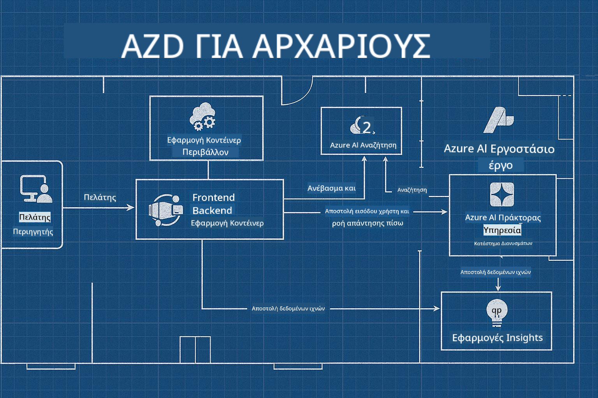

<!--
CO_OP_TRANSLATOR_METADATA:
{
  "original_hash": "245d24997bbcf2bae93bb2a503845d37",
  "translation_date": "2025-09-23T11:54:37+00:00",
  "source_file": "workshop/README.md",
  "language_code": "el"
}
-->
# Εργαστήριο AZD για Προγραμματιστές AI

## Πρότυπα AZD

Η δημιουργία μιας λύσης εφαρμογής AI επιπέδου επιχείρησης για το συγκεκριμένο σας σενάριο μοιάζει πολύ με την κατασκευή του δικού σας σπιτιού. Μπορείτε να το σχεδιάσετε μόνοι σας, να το χτίσετε τούβλο-τούβλο και να αναλάβετε την ευθύνη να διασφαλίσετε ότι πληροί όλες τις κατευθυντήριες γραμμές διακυβέρνησης και ανάπτυξης.

**Ή ....**

Μπορείτε να συνεργαστείτε με έναν αρχιτέκτονα που μπορεί να σας δώσει ένα _σχέδιο_ για ένα αρχικό σπίτι και στη συνέχεια να συνεργαστεί μαζί σας για να το _προσαρμόσετε_ ώστε να ταιριάζει στις ανάγκες σας. Αυτό σας επιτρέπει να εστιάσετε σε αυτό που κάνει το **σπίτι σας** ξεχωριστό, ενώ οι ειδικοί αναλαμβάνουν την υποδομή, όπως την καλωδίωση, την υδραυλική και άλλες εξαρτήσεις.

**Αυτή είναι η προσέγγιση πίσω από τα [Πρότυπα Εφαρμογών AI](https://ai.azure.com/templates)** - μια σειρά από σχέδια για τη δημιουργία διαφορετικών τύπων "σπιτιών" εφαρμογών AI, ανάλογα με τις βασικές σας ανάγκες και εξαρτήσεις.

## Προσαρμογή Προτύπων

Τα πρότυπα έχουν σχεδιαστεί για να λειτουργούν με το [Azure AI Foundry](https://ai.azure.com). Σκεφτείτε αυτήν την πλατφόρμα ως τον "εργολάβο" σας, με πρόσβαση σε όλους τους πόρους, τα εργαλεία και την τεχνογνωσία που χρειάζεστε για να ολοκληρώσετε τη δουλειά!

Το μόνο που χρειάζεται να κάνετε είναι να επιλέξετε [τα αρχικά σας πρότυπα](https://learn.microsoft.com/en-us/azure/ai-foundry/how-to/develop/ai-template-get-started). Για παράδειγμα, θα εστιάσουμε στο πρότυπο _Get Started with AI Agents_ για να δημιουργήσουμε ένα "Agentic AI Home" που περιλαμβάνει λειτουργίες όπως AI Search, Red Teaming, Αξιολογήσεις, Ανίχνευση, Παρακολούθηση και πολλά άλλα!



Το μόνο που χρειάζεστε είναι να κλείσετε χρόνο με τον αρχιτέκτονα, για να σας καθοδηγήσει στη διαδικασία προσαρμογής. Το [GitHub Copilot for Azure](https://learn.microsoft.com/en-us/azure/developer/github-copilot-azure/get-started) μπορεί να είναι αυτός ο οδηγός. Απλώς "συνομιλήστε μαζί του" για να:

- Μάθετε για τις δυνατότητες του Azure στο πρότυπό σας
- Αναπτύξετε πόρους του Azure
- Λάβετε πληροφορίες για την ανάπτυξή σας
- Διαγνώσετε και επιλύσετε προβλήματα!

Σε αυτό το εργαστήριο, θα μάθουμε πώς να _αποδομήσουμε_ το υπάρχον πρότυπο (για να δούμε τι παρέχει), και στη συνέχεια να το _προσαρμόσουμε_ (για να καλύψουμε τις απαιτήσεις μας) - βήμα προς βήμα.

Τα Πρότυπα AI **κάνουν τη δουλειά** - ολοκληρώνοντας το εργαστήριο, θα μάθετε να **τα κάνετε δικά σας**.

----

**Πλοήγηση Εργαστηρίου**
- **📚 Αρχική Σελίδα Μαθήματος**: [AZD Για Αρχάριους](../README.md)
- **📖 Σχετικά Κεφάλαια**: Περιλαμβάνει [Κεφάλαιο 1](../README.md#-chapter-1-foundation--quick-start), [Κεφάλαιο 2](../README.md#-chapter-2-ai-first-development-recommended-for-ai-developers), και [Κεφάλαιο 5](../README.md#-chapter-5-multi-agent-ai-solutions-advanced)
- **🛠️ Εργαστήριο Πρακτικής**: [Εργαστήριο AI](../docs/ai-foundry/ai-workshop-lab.md)
- **🚀 Επόμενα Βήματα**: [Ενότητες Εργαστηρίου](../../../workshop)

Καλώς ήρθατε στο πρακτικό εργαστήριο για την εκμάθηση του Azure Developer CLI (AZD) με έμφαση στην ανάπτυξη εφαρμογών AI. Αυτό το εργαστήριο έχει σχεδιαστεί για να σας οδηγήσει από τα βασικά του AZD στην ανάπτυξη λύσεων AI έτοιμων για παραγωγή.

## Επισκόπηση Εργαστηρίου

**Διάρκεια:** 2-3 ώρες  
**Επίπεδο:** Αρχάριοι έως Μεσαίοι  
**Προαπαιτούμενα:** Βασικές γνώσεις Azure, εργαλείων γραμμής εντολών και εννοιών AI

### Τι Θα Μάθετε

- **Βασικά AZD**: Κατανόηση της Υποδομής ως Κώδικα με το AZD
- 🤖 **Ενσωμάτωση Υπηρεσιών AI**: Ανάπτυξη του Azure OpenAI, AI Search και άλλων υπηρεσιών AI
- **Ανάπτυξη Κοντέινερ**: Χρήση του Azure Container Apps για εφαρμογές AI
- **Βέλτιστες Πρακτικές Ασφαλείας**: Εφαρμογή Managed Identity και ασφαλών ρυθμίσεων
- **Παρακολούθηση & Παρατηρησιμότητα**: Ρύθμιση του Application Insights για φόρτους εργασίας AI
- **Παραγωγικά Μοτίβα**: Στρατηγικές ανάπτυξης έτοιμες για επιχειρήσεις

## Δομή Εργαστηρίου

### Ενότητα 1: Βασικά AZD (30 λεπτά)
- Εγκατάσταση και ρύθμιση του AZD
- Κατανόηση της δομής έργου AZD
- Η πρώτη σας ανάπτυξη με AZD
- **Εργαστήριο**: Ανάπτυξη μιας απλής εφαρμογής ιστού

### Ενότητα 2: Ενσωμάτωση Azure OpenAI (45 λεπτά)
- Ρύθμιση πόρων Azure OpenAI
- Στρατηγικές ανάπτυξης μοντέλων
- Ρύθμιση πρόσβασης API και αυθεντικοποίησης
- **Εργαστήριο**: Ανάπτυξη εφαρμογής συνομιλίας με GPT-4

### Ενότητα 3: Εφαρμογές RAG (45 λεπτά)
- Ενσωμάτωση Azure AI Search
- Επεξεργασία εγγράφων με το Azure Document Intelligence
- Ενσωματώσεις διανυσμάτων και σημασιολογική αναζήτηση
- **Εργαστήριο**: Δημιουργία συστήματος Q&A εγγράφων

### Ενότητα 4: Ανάπτυξη Παραγωγής (30 λεπτά)
- Ρύθμιση Container Apps
- Βελτιστοποίηση απόδοσης και κλιμάκωση
- Παρακολούθηση και καταγραφή
- **Εργαστήριο**: Ανάπτυξη σε παραγωγή με παρατηρησιμότητα

### Ενότητα 5: Προηγμένα Μοτίβα (15 λεπτά)
- Αναπτύξεις πολλαπλών περιβαλλόντων
- Ενσωμάτωση CI/CD
- Στρατηγικές βελτιστοποίησης κόστους
- **Σύνοψη**: Λίστα ελέγχου ετοιμότητας παραγωγής

## Προαπαιτούμενα

### Απαιτούμενα Εργαλεία

Παρακαλούμε εγκαταστήστε αυτά τα εργαλεία πριν το εργαστήριο:

```bash
# Azure Developer CLI
curl -fsSL https://aka.ms/install-azd.sh | bash

# Azure CLI
curl -sL https://aka.ms/InstallAzureCLIDeb | sudo bash

# Git
sudo apt-get install git

# Docker
curl -fsSL https://get.docker.com -o get-docker.sh
sudo sh get-docker.sh

# Python 3.10+
sudo apt-get install python3.10 python3.10-venv python3-pip
```

### Ρύθμιση Λογαριασμού Azure

1. **Συνδρομή Azure**: [Εγγραφείτε δωρεάν](https://azure.microsoft.com/free/)
2. **Πρόσβαση στο Azure OpenAI**: [Αιτηθείτε πρόσβαση](https://aka.ms/oai/access)
3. **Απαιτούμενα Δικαιώματα**:
   - Ρόλος Contributor στη συνδρομή ή την ομάδα πόρων
   - User Access Administrator (για αναθέσεις RBAC)

### Επαλήθευση Προαπαιτούμενων

Εκτελέστε αυτό το σενάριο για να επαληθεύσετε τη ρύθμισή σας:

```bash
#!/bin/bash
echo "Verifying workshop prerequisites..."

# Check AZD installation
if command -v azd &> /dev/null; then
    echo "✅ Azure Developer CLI: $(azd --version)"
else
    echo "❌ Azure Developer CLI not found"
fi

# Check Azure CLI
if command -v az &> /dev/null; then
    echo "✅ Azure CLI: $(az --version | head -n1)"
else
    echo "❌ Azure CLI not found"
fi

# Check Docker
if command -v docker &> /dev/null; then
    echo "✅ Docker: $(docker --version)"
else
    echo "❌ Docker not found"
fi

# Check Python
if command -v python3 &> /dev/null; then
    echo "✅ Python: $(python3 --version)"
else
    echo "❌ Python 3 not found"
fi

# Check Azure login
if az account show &> /dev/null; then
    echo "✅ Azure: Logged in as $(az account show --query user.name -o tsv)"
else
    echo "❌ Azure: Not logged in (run 'az login')"
fi

echo "Setup verification complete!"
```

## Υλικά Εργαστηρίου

### Ασκήσεις Εργαστηρίου

Κάθε ενότητα περιλαμβάνει πρακτικά εργαστήρια με αρχικό κώδικα και βήμα-βήμα οδηγίες:

- **[lab-1-azd-basics/](../../../workshop/lab-1-azd-basics)** - Η πρώτη σας ανάπτυξη με AZD
- **[lab-2-openai-chat/](../../../workshop/lab-2-openai-chat)** - Εφαρμογή συνομιλίας με Azure OpenAI
- **[lab-3-rag-search/](../../../workshop/lab-3-rag-search)** - Εφαρμογή RAG με AI Search
- **[lab-4-production/](../../../workshop/lab-4-production)** - Μοτίβα ανάπτυξης παραγωγής
- **[lab-5-advanced/](../../../workshop/lab-5-advanced)** - Προηγμένα σενάρια ανάπτυξης

### Υλικά Αναφοράς

- **[Οδηγός Ενσωμάτωσης AI Foundry](../docs/ai-foundry/azure-ai-foundry-integration.md)** - Ολοκληρωμένα μοτίβα ενσωμάτωσης
- **[Οδηγός Ανάπτυξης Μοντέλων AI](../docs/ai-foundry/ai-model-deployment.md)** - Βέλτιστες πρακτικές ανάπτυξης μοντέλων
- **[Πρακτικές Παραγωγής AI](../docs/ai-foundry/production-ai-practices.md)** - Μοτίβα ανάπτυξης για επιχειρήσεις
- **[Οδηγός Αντιμετώπισης Προβλημάτων AI](../docs/troubleshooting/ai-troubleshooting.md)** - Συνήθη προβλήματα και λύσεις

### Δείγματα Προτύπων

Πρότυπα γρήγορης εκκίνησης για κοινά σενάρια AI:

```
workshop/templates/
├── minimal-chat/          # Basic OpenAI chat app
├── rag-application/       # RAG with AI Search
├── multi-model/          # Multiple AI services
└── production-ready/     # Enterprise template
```

## Ξεκινώντας

### Επιλογή 1: GitHub Codespaces (Συνιστάται)

Ο ταχύτερος τρόπος για να ξεκινήσετε το εργαστήριο:

[](https://github.com/codespaces/new?hide_repo_select=true&ref=main&repo=YOUR_REPO_ID)

### Επιλογή 2: Τοπική Ανάπτυξη

1. **Κλωνοποιήστε το αποθετήριο του εργαστηρίου:**
```bash
git clone https://github.com/YOUR_ORG/AZD-for-beginners.git
cd AZD-for-beginners/workshop
```

2. **Συνδεθείτε στο Azure:**
```bash
az login
azd auth login
```

3. **Ξεκινήστε με το Εργαστήριο 1:**
```bash
cd lab-1-azd-basics
cat README.md  # Follow the instructions
```

### Επιλογή 3: Εργαστήριο με Εκπαιδευτή

Αν παρακολουθείτε μια συνεδρία με εκπαιδευτή:

- 🎥 **Εγγραφή Εργαστηρίου**: [Διαθέσιμη κατ' απαίτηση](https://aka.ms/azd-ai-workshop)
- 💬 **Κοινότητα Discord**: [Συμμετοχή για ζωντανή υποστήριξη](https://aka.ms/foundry/discord)
- **Ανατροφοδότηση Εργαστηρίου**: [Μοιραστείτε την εμπειρία σας](https://aka.ms/azd-workshop-feedback)

## Χρονοδιάγραμμα Εργαστηρίου

### Αυτοκαθοδηγούμενη Μάθηση (3 ώρες)

```
⏰ 00:00 - 00:30  Module 1: AZD Foundations
⏰ 00:30 - 01:15  Module 2: Azure OpenAI Integration
⏰ 01:15 - 02:00  Module 3: RAG Applications
⏰ 02:00 - 02:30  Module 4: Production Deployment
⏰ 02:30 - 02:45  Module 5: Advanced Patterns
⏰ 02:45 - 03:00  Q&A and Next Steps
```

### Συνεδρία με Εκπαιδευτή (2.5 ώρες)

```
⏰ 00:00 - 00:15  Welcome & Prerequisites Check
⏰ 00:15 - 00:40  Module 1: Live Demo + Lab
⏰ 00:40 - 01:20  Module 2: OpenAI Integration
⏰ 01:20 - 01:30  Break
⏰ 01:30 - 02:10  Module 3: RAG Applications
⏰ 02:10 - 02:30  Module 4: Production Patterns
⏰ 02:30 - 02:45  Module 5: Advanced Topics
⏰ 02:45 - 03:00  Q&A and Resources
```

## Κριτήρια Επιτυχίας

Μέχρι το τέλος αυτού του εργαστηρίου, θα μπορείτε να:

✅ **Αναπτύξετε εφαρμογές AI** χρησιμοποιώντας πρότυπα AZD  
✅ **Ρυθμίσετε το Azure OpenAI** με σωστή ασφάλεια  
✅ **Δημιουργήσετε εφαρμογές RAG** με ενσωμάτωση Azure AI Search  
✅ **Εφαρμόσετε μοτίβα παραγωγής** για φόρτους εργασίας AI επιπέδου επιχείρησης  
✅ **Παρακολουθήσετε και αντιμετωπίσετε προβλήματα** στις αναπτύξεις εφαρμογών AI  
✅ **Εφαρμόσετε στρατηγικές βελτιστοποίησης κόστους** για φόρτους εργασίας AI  

## Κοινότητα & Υποστήριξη

### Κατά τη Διάρκεια του Εργαστηρίου

- 🙋 **Ερωτήσεις**: Χρησιμοποιήστε τη συνομιλία του εργαστηρίου ή σηκώστε το χέρι σας
- 🐛 **Προβλήματα**: Ελέγξτε τον [οδηγό αντιμετώπισης προβλημάτων](../docs/troubleshooting/ai-troubleshooting.md)
- **Συμβουλές**: Μοιραστείτε ανακαλύψεις με άλλους συμμετέχοντες

### Μετά το Εργαστήριο

- 💬 **Discord**: [Κοινότητα Azure AI Foundry](https://aka.ms/foundry/discord)
- **GitHub Issues**: [Αναφέρετε προβλήματα προτύπων](https://github.com/YOUR_ORG/AZD-for-beginners/issues)
- 📧 **Ανατροφοδότηση**: [Φόρμα αξιολόγησης εργαστηρίου](https://aka.ms/azd-workshop-feedback)

## Επόμενα Βήματα

### Συνεχίστε τη Μάθηση

1. **Προηγμένα Σενάρια**: Εξερευνήστε [αναπτύξεις πολλαπλών περιοχών](../docs/ai-foundry/production-ai-practices.md#multi-region-deployment)
2. **Ενσωμάτωση CI/CD**: Ρυθμίστε [GitHub Actions workflows](../docs/deployment/github-actions.md)
3. **Προσαρμοσμένα Πρότυπα**: Δημιουργήστε τα δικά σας [πρότυπα AZD](../docs/getting-started/custom-templates.md)

### Εφαρμόστε στα Έργα σας

1. **Αξιολόγηση**: Χρησιμοποιήστε τη [λίστα ελέγχου ετοιμότητας](./production-readiness-checklist.md)
2. **Πρότυπα**: Ξεκινήστε με τα [πρότυπα AI](../../../workshop/templates)
3. **Υποστήριξη**: Συμμετάσχετε στο [Azure AI Foundry Discord](https://aka.ms/foundry/discord)

### Μοιραστείτε την Επιτυχία σας

- ⭐ **Αξιολογήστε το αποθετήριο** αν αυτό το εργαστήριο σας βοήθησε
- 🐦 **Μοιραστείτε στα κοινωνικά δίκτυα** με #AzureDeveloperCLI #AzureAI
- 📝 **Γράψτε ένα άρθρο** για το ταξίδι σας στην ανάπτυξη AI

---

## Ανατροφοδότηση Εργαστηρίου

Η ανατροφοδότησή σας μας βοηθά να βελτιώσουμε την εμπειρία του εργαστηρίου:

| Πτυχή | Βαθμολογία (1-5) | Σχόλια |
|-------|------------------|--------|
| Ποιότητα Περιεχομένου | ⭐⭐⭐⭐⭐ | |
| Πρακτικά Εργαστήρια | ⭐⭐⭐⭐⭐ | |
| Τεκμηρίωση | ⭐⭐⭐⭐⭐ | |
| Επίπεδο Δυσκολίας | ⭐⭐⭐⭐⭐ | |
| Συνολική Εμπειρία | ⭐⭐⭐⭐⭐ | |

**Υποβολή ανατροφοδότησης**: [Φόρμα Αξιολόγησης Εργαστηρίου](https://aka.ms/azd-workshop-feedback)

---

**Προηγούμενο:** [Οδηγός Αντιμετώπισης Προβλημάτων AI](../docs/troubleshooting/ai-troubleshooting.md) | **Επόμενο:** Ξεκινήστε με το [Εργαστήριο 1: Βασικά AZD](../../../workshop/lab-1-azd-basics)

**Έτοιμοι να ξεκινήσετε να δημιουργείτε εφαρμογές AI με AZD;**

[Ξεκινήστε το Εργαστήριο 1: Βασικά AZD →](./lab-1-azd-basics/README.md)

---

