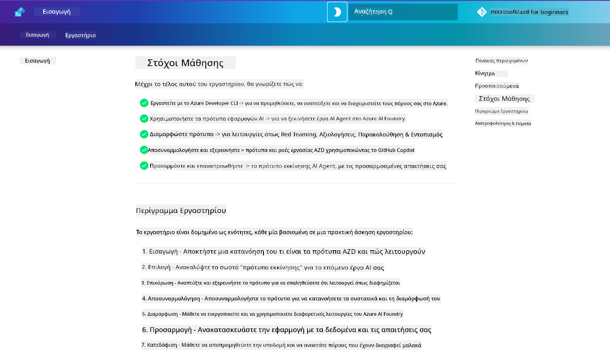

<!--
CO_OP_TRANSLATOR_METADATA:
{
  "original_hash": "9cc966416ab431c38b2ab863884b196c",
  "translation_date": "2025-09-24T21:09:49+00:00",
  "source_file": "workshop/README.md",
  "language_code": "el"
}
-->
# Εργαστήριο AZD για Προγραμματιστές AI

Καλώς ήρθατε στο πρακτικό εργαστήριο για την εκμάθηση του Azure Developer CLI (AZD) με έμφαση στην ανάπτυξη εφαρμογών AI. Αυτό το εργαστήριο σας βοηθά να αποκτήσετε πρακτική κατανόηση των προτύπων AZD σε 3 βήματα:

1. **Ανακάλυψη** - βρείτε το πρότυπο που σας ταιριάζει.
1. **Ανάπτυξη** - αναπτύξτε και επιβεβαιώστε ότι λειτουργεί.
1. **Προσαρμογή** - τροποποιήστε και εξελίξτε το ώστε να γίνει δικό σας!

Κατά τη διάρκεια του εργαστηρίου, θα γνωρίσετε επίσης βασικά εργαλεία και ροές εργασίας για προγραμματιστές, ώστε να βελτιώσετε τη συνολική σας εμπειρία ανάπτυξης.

<br/>

## Οδηγός μέσω Περιηγητή

Τα μαθήματα του εργαστηρίου είναι γραμμένα σε Markdown. Μπορείτε να τα περιηγηθείτε απευθείας στο GitHub - ή να εκκινήσετε μια προεπισκόπηση μέσω περιηγητή, όπως φαίνεται στην παρακάτω εικόνα.



Για να χρησιμοποιήσετε αυτήν την επιλογή - κάντε fork το αποθετήριο στο προφίλ σας και εκκινήστε το GitHub Codespaces. Μόλις ενεργοποιηθεί το τερματικό του VS Code, πληκτρολογήστε την εξής εντολή:

```bash title="" linenums="0"
mkdocs serve > /dev/null 2>&1 &
```

Σε λίγα δευτερόλεπτα, θα εμφανιστεί ένα παράθυρο διαλόγου. Επιλέξτε την επιλογή `Open in browser`. Ο οδηγός μέσω περιηγητή θα ανοίξει τώρα σε μια νέα καρτέλα. Ορισμένα πλεονεκτήματα αυτής της προεπισκόπησης:

1. **Ενσωματωμένη αναζήτηση** - βρείτε λέξεις-κλειδιά ή μαθήματα γρήγορα.
1. **Εικονίδιο αντιγραφής** - περάστε πάνω από τα μπλοκ κώδικα για να δείτε αυτήν την επιλογή.
1. **Εναλλαγή θέματος** - αλλάξτε μεταξύ σκοτεινού και φωτεινού θέματος.
1. **Λάβετε βοήθεια** - κάντε κλικ στο εικονίδιο Discord στο υποσέλιδο για να συμμετάσχετε!

<br/>

## Επισκόπηση Εργαστηρίου

**Διάρκεια:** 3-4 ώρες  
**Επίπεδο:** Αρχάριοι έως Μεσαίοι  
**Προαπαιτούμενα:** Εξοικείωση με Azure, έννοιες AI, VS Code και εργαλεία γραμμής εντολών.

Πρόκειται για ένα πρακτικό εργαστήριο όπου μαθαίνετε μέσω της πράξης. Αφού ολοκληρώσετε τις ασκήσεις, σας προτείνουμε να εξετάσετε το πρόγραμμα AZD For Beginners για να συνεχίσετε το ταξίδι σας στην εκμάθηση βέλτιστων πρακτικών για Ασφάλεια και Παραγωγικότητα.

| Χρόνος | Ενότητα  | Στόχος |
|:---|:---|:---|
| 15 λεπτά | [Εισαγωγή](docs/instructions/0-Introduction.md) | Θέστε το πλαίσιο, κατανοήστε τους στόχους |
| 30 λεπτά | [Επιλογή Προτύπου AI](docs/instructions/1-Select-AI-Template.md) | Εξερευνήστε επιλογές και επιλέξτε αρχικό πρότυπο | 
| 30 λεπτά | [Επικύρωση Προτύπου AI](docs/instructions/2-Validate-AI-Template.md) | Αναπτύξτε την προεπιλεγμένη λύση στο Azure |
| 30 λεπτά | [Ανάλυση Προτύπου AI](docs/instructions/3-Deconstruct-AI-Template.md) | Εξερευνήστε τη δομή και τη διαμόρφωση |
| 30 λεπτά | [Διαμόρφωση Προτύπου AI](docs/instructions/4-Configure-AI-Template.md) | Ενεργοποιήστε και δοκιμάστε διαθέσιμες λειτουργίες |
| 30 λεπτά | [Προσαρμογή Προτύπου AI](docs/instructions/5-Customize-AI-Template.md) | Προσαρμόστε το πρότυπο στις ανάγκες σας |
| 30 λεπτά | [Κατάργηση Υποδομής](docs/instructions/6-Teardown-Infrastructure.md) | Καθαρισμός και απελευθέρωση πόρων |
| 15 λεπτά | [Ολοκλήρωση & Επόμενα Βήματα](docs/instructions/7-Wrap-up.md) | Πηγές μάθησης, Πρόκληση εργαστηρίου |

<br/>

## Τι θα μάθετε

Σκεφτείτε το AZD Template ως ένα εκπαιδευτικό περιβάλλον για να εξερευνήσετε διάφορες δυνατότητες και εργαλεία για την ανάπτυξη στο Azure AI Foundry. Μέχρι το τέλος του εργαστηρίου, θα έχετε μια διαισθητική κατανόηση για διάφορα εργαλεία και έννοιες σε αυτό το πλαίσιο.

| Έννοια  | Στόχος |
|:---|:---|
| **Azure Developer CLI** | Κατανόηση εντολών και ροών εργασίας του εργαλείου |
| **Πρότυπα AZD**| Κατανόηση δομής έργου και διαμόρφωσης |
| **Azure AI Agent**| Παροχή & ανάπτυξη έργου Azure AI Foundry |
| **Azure AI Search**| Ενεργοποίηση μηχανικής περιεχομένου με agents |
| **Παρατηρησιμότητα**| Εξερεύνηση ιχνηλάτησης, παρακολούθησης και αξιολογήσεων |
| **Red Teaming**| Εξερεύνηση δοκιμών αντιπαράθεσης και μετριασμών |

<br/>

## Δομή Εργαστηρίου

Το εργαστήριο είναι δομημένο ώστε να σας καθοδηγήσει από την ανακάλυψη προτύπων, στην ανάπτυξη, ανάλυση και προσαρμογή - χρησιμοποιώντας το επίσημο [Getting Started with AI Agents](https://github.com/Azure-Samples/get-started-with-ai-agents) αρχικό πρότυπο ως βάση.

### [Ενότητα 1: Επιλογή Προτύπου AI](docs/instructions/1-Select-AI-Template.md) (30 λεπτά)

- Τι είναι τα Πρότυπα AI;
- Πού μπορώ να βρω Πρότυπα AI;
- Πώς μπορώ να ξεκινήσω να δημιουργώ AI Agents;
- **Εργαστήριο**: Γρήγορη εκκίνηση με GitHub Codespaces

### [Ενότητα 2: Επικύρωση Προτύπου AI](docs/instructions/2-Validate-AI-Template.md) (30 λεπτά)

- Ποια είναι η Αρχιτεκτονική του Προτύπου AI;
- Ποια είναι η Ροή Εργασίας Ανάπτυξης AZD;
- Πώς μπορώ να λάβω βοήθεια για την Ανάπτυξη AZD;
- **Εργαστήριο**: Ανάπτυξη & Επικύρωση προτύπου AI Agents

### [Ενότητα 3: Ανάλυση Προτύπου AI](docs/instructions/3-Deconstruct-AI-Template.md) (30 λεπτά)

- Εξερευνήστε το περιβάλλον σας στο `.azure/` 
- Εξερευνήστε τη ρύθμιση πόρων στο `infra/` 
- Εξερευνήστε τη διαμόρφωση AZD στο `azure.yaml`s
- **Εργαστήριο**: Τροποποίηση Μεταβλητών Περιβάλλοντος & Επαναανάπτυξη

### [Ενότητα 4: Διαμόρφωση Προτύπου AI](docs/instructions/4-Configure-AI-Template.md) (30 λεπτά)
- Εξερεύνηση: Retrieval Augmented Generation
- Εξερεύνηση: Αξιολόγηση Agent & Red Teaming
- Εξερεύνηση: Ιχνηλάτηση & Παρακολούθηση
- **Εργαστήριο**: Εξερεύνηση AI Agent + Παρατηρησιμότητα 

### [Ενότητα 5: Προσαρμογή Προτύπου AI](docs/instructions/5-Customize-AI-Template.md) (30 λεπτά)
- Ορισμός: PRD με Απαιτήσεις Σεναρίου
- Διαμόρφωση: Μεταβλητές Περιβάλλοντος για AZD
- Υλοποίηση: Lifecycle Hooks για πρόσθετες εργασίες
- **Εργαστήριο**: Προσαρμογή προτύπου για το σενάριό μου

### [Ενότητα 6: Κατάργηση Υποδομής](docs/instructions/6-Teardown-Infrastructure.md) (30 λεπτά)
- Ανακεφαλαίωση: Τι είναι τα Πρότυπα AZD;
- Ανακεφαλαίωση: Γιατί να χρησιμοποιήσετε το Azure Developer CLI;
- Επόμενα Βήματα: Δοκιμάστε ένα διαφορετικό πρότυπο!
- **Εργαστήριο**: Αποδέσμευση υποδομής & καθαρισμός

<br/>

## Πρόκληση Εργαστηρίου

Θέλετε να προκαλέσετε τον εαυτό σας να κάνετε περισσότερα; Ακολουθούν ορισμένες προτάσεις έργων - ή μοιραστείτε τις ιδέες σας μαζί μας!!

| Έργο | Περιγραφή |
|:---|:---|
|1. **Ανάλυση ενός Σύνθετου Προτύπου AI** | Χρησιμοποιήστε τη ροή εργασίας και τα εργαλεία που περιγράψαμε και δείτε αν μπορείτε να αναπτύξετε, να επικυρώσετε και να προσαρμόσετε ένα διαφορετικό πρότυπο λύσης AI. _Τι μάθατε;_|
|2. **Προσαρμογή με το Σενάριό σας**  | Δοκιμάστε να γράψετε ένα PRD (Product Requirements Document) για ένα διαφορετικό σενάριο. Στη συνέχεια, χρησιμοποιήστε το GitHub Copilot στο αποθετήριο προτύπου σας σε Agent Model - και ζητήστε του να δημιουργήσει μια ροή εργασίας προσαρμογής για εσάς. _Τι μάθατε; Πώς θα μπορούσατε να βελτιώσετε αυτές τις προτάσεις;_|
| | |

## Έχετε σχόλια;

1. Δημοσιεύστε ένα ζήτημα σε αυτό το αποθετήριο - προσθέστε την ετικέτα `Workshop` για ευκολία.
1. Συμμετάσχετε στο Discord του Azure AI Foundry - συνδεθείτε με τους συναδέλφους σας!

| | | 
|:---|:---|
| **📚 Αρχική Σελίδα Μαθήματος**| [AZD For Beginners](../README.md)|
| **📖 Τεκμηρίωση** | [Ξεκινήστε με πρότυπα AI](https://learn.microsoft.com/en-us/azure/ai-foundry/how-to/develop/ai-template-get-started)|
| **🛠️Πρότυπα AI** | [Azure AI Foundry Templates](https://ai.azure.com/templates) |
|**🚀 Επόμενα Βήματα** | [Αναλάβετε την Πρόκληση](../../../workshop) |
| | |

<br/>

---

**Προηγούμενο:** [Οδηγός Αντιμετώπισης Προβλημάτων AI](../docs/troubleshooting/ai-troubleshooting.md) | **Επόμενο:** Ξεκινήστε με [Εργαστήριο 1: Βασικά AZD](../../../workshop/lab-1-azd-basics)

**Έτοιμοι να ξεκινήσετε να δημιουργείτε εφαρμογές AI με AZD;**

[Ξεκινήστε το Εργαστήριο 1: Βάσεις AZD →](./lab-1-azd-basics/README.md)

---

