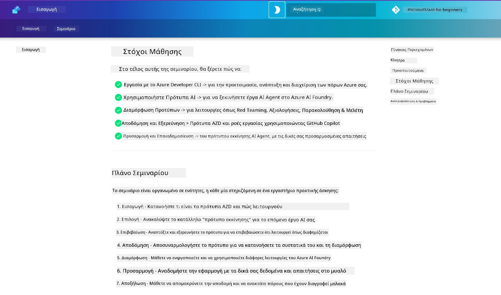

<div align="center">
  <div style="background: linear-gradient(135deg, #0078d4, #106ebe); border-radius: 10px; padding: 20px; margin: 20px 0; box-shadow: 0 4px 15px rgba(0, 120, 212, 0.3); border: 2px solid #005a9e;">
    <h2 style="color: white; margin: 0; font-size: 24px; text-shadow: 1px 1px 2px rgba(0,0,0,0.3);">
      🎯 Εργαστήριο AZD για Προγραμματιστές AI
    </h2>
    <p style="color: white; margin: 10px 0 0 0; font-size: 16px; text-shadow: 1px 1px 2px rgba(0,0,0,0.3);">
      <strong>Ένα πρακτικό εργαστήριο για τη δημιουργία εφαρμογών AI με το Azure Developer CLI.</strong><br>
      Ολοκληρώστε 7 ενότητες για να μάθετε τα πρότυπα AZD και τις ροές εργασίας ανάπτυξης AI.
    </p>
    <div style="margin-top: 15px;">
      <span style="background: rgba(255,255,255,0.2); padding: 5px 10px; border-radius: 15px; color: white; font-size: 14px;">
        📅 Τελευταία ενημέρωση: Φεβρουάριος 2026
      </span>
    </div>
  </div>
</div>

# Εργαστήριο AZD για Προγραμματιστές AI

Καλώς ήρθατε στο πρακτικό εργαστήριο για να μάθετε το Azure Developer CLI (AZD) με έμφαση στην ανάπτυξη εφαρμογών AI. Αυτό το εργαστήριο θα σας βοηθήσει να αποκτήσετε μια εφαρμοσμένη κατανόηση των προτύπων AZD σε 3 βήματα:

1. **Ανακάλυψη** - βρείτε το πρότυπο που σας ταιριάζει.
1. **Ανάπτυξη** - αναπτύξτε και επαληθεύστε ότι λειτουργεί
1. **Προσαρμογή** - τροποποιήστε και επαναλάβετε για να το κάνετε δικό σας!

Κατά τη διάρκεια αυτού του εργαστηρίου, θα παρουσιαστούν επίσης βασικά εργαλεία και ροές εργασίας για προγραμματιστές, για να βοηθήσουν στη βελτιστοποίηση του end-to-end ταξιδιού ανάπτυξής σας.

<br/>

## Οδηγός μέσω Περιηγητή

Τα μαθήματα του εργαστηρίου είναι σε Markdown. Μπορείτε να τα πλοηγηθείτε απευθείας στο GitHub - ή να ξεκινήσετε μια προεπισκόπηση μέσω προγράμματος περιήγησης όπως φαίνεται στο στιγμιότυπο παρακάτω.



Για να χρησιμοποιήσετε αυτήν την επιλογή - κάντε fork του αποθετηρίου στο προφίλ σας και ξεκινήστε τα GitHub Codespaces. Όταν το τερματικό του VS Code είναι ενεργό, πληκτρολογήστε αυτήν την εντολή:

```bash title="" linenums="0"
mkdocs serve > /dev/null 2>&1 &
```

Σε μερικά δευτερόλεπτα θα δείτε ένα αναδυόμενο παράθυρο. Επιλέξτε την επιλογή `Άνοιγμα σε πρόγραμμα περιήγησης`. Ο οδηγός μέσω web θα ανοίξει τώρα σε μια νέα καρτέλα του προγράμματος περιήγησης. Μερικά οφέλη αυτής της προεπισκόπησης:

1. **Ενσωματωμένη αναζήτηση** - βρείτε λέξεις-κλειδιά ή μαθήματα γρήγορα.
1. **Εικονίδιο αντιγραφής** - τοποθετήστε τον δείκτη πάνω από τα μπλοκ κώδικα για να δείτε αυτήν την επιλογή
1. **Εναλλαγή θέματος** - εναλλαγή μεταξύ σκοτεινής και φωτεινής θεματικής
1. **Λάβετε βοήθεια** - κάντε κλικ στο εικονίδιο Discord στο υποσέλιδο για να συμμετάσχετε!

<br/>

## Επισκόπηση Εργαστηρίου

**Διάρκεια:** 3-4 ώρες  
**Επίπεδο:** Αρχάριοι έως Ενδιάμεσοι  
**Προαπαιτούμενα:** Εξοικείωση με Azure, έννοιες AI, VS Code & εργαλεία γραμμής εντολών.

Αυτό είναι ένα πρακτικό εργαστήριο όπου μαθαίνετε κάνοντας. Μόλις ολοκληρώσετε τις ασκήσεις, προτείνουμε να αναθεωρήσετε το πρόγραμμα AZD For Beginners για να συνεχίσετε το ταξίδι μάθησής σας σε θέματα Ασφάλειας και Παραγωγικότητας.

| Χρόνος| Ενότητα  | Στόχος |
|:---|:---|:---|
| 15 mins | [Εισαγωγή](docs/instructions/0-Introduction.md) | Θέστε το πλαίσιο, κατανοήστε τους στόχους |
| 30 mins | [Επιλογή Προτύπου AI](docs/instructions/1-Select-AI-Template.md) | Εξερευνήστε επιλογές και επιλέξτε ένα αρχικό πρότυπο | 
| 30 mins | [Επαλήθευση Προτύπου AI](docs/instructions/2-Validate-AI-Template.md) | Αναπτύξτε την προεπιλεγμένη λύση στο Azure |
| 30 mins | [Αποδόμηση Προτύπου AI](docs/instructions/3-Deconstruct-AI-Template.md) | Εξερευνήστε δομή και ρυθμίσεις |
| 30 mins | [Διαμόρφωση Προτύπου AI](docs/instructions/4-Configure-AI-Template.md) | Ενεργοποιήστε και δοκιμάστε τις διαθέσιμες δυνατότητες |
| 30 mins | [Προσαρμογή Προτύπου AI](docs/instructions/5-Customize-AI-Template.md) | Προσαρμόστε το πρότυπο στις ανάγκες σας |
| 30 mins | [Κατάργηση Υποδομής](docs/instructions/6-Teardown-Infrastructure.md) | Καθαρισμός και απελευθέρωση πόρων |
| 15 mins | [Επίλογος & Επόμενα Βήματα](docs/instructions/7-Wrap-up.md) | Πόροι μάθησης, πρόκληση εργαστηρίου |

<br/>

## Τι Θα Μάθετε

Σκεφτείτε το Πρότυπο AZD ως μια πλατφόρμα εκμάθησης για να εξερευνήσετε διάφορες δυνατότητες και εργαλεία για end-to-end ανάπτυξη στο Microsoft Foundry. Μέχρι το τέλος αυτού του εργαστηρίου, θα πρέπει να έχετε μια διαισθητική αντίληψη για διάφορα εργαλεία και έννοιες σε αυτό το πλαίσιο.

| Έννοια  | Στόχος |
|:---|:---|
| **Azure Developer CLI** | Κατανόηση εντολών εργαλείων και ροών εργασίας|
| **AZD Templates**| Κατανόηση δομής έργου και ρυθμίσεων|
| **Azure AI Agent**| Παροχή & ανάπτυξη έργου Microsoft Foundry  |
| **Azure AI Search**| Ενεργοποίηση μηχανικής συμφραζομένων με πράκτορες |
| **Observability**| Εξερευνήστε ιχνηλάτηση, παρακολούθηση και αξιολογήσεις |
| **Red Teaming**| Εξερευνήστε επιθετικές δοκιμές και μετριασμούς |

<br/>

## Δομή Εργαστηρίου

Το εργαστήριο έχει δομηθεί για να σας μεταφέρει από την ανακάλυψη προτύπων, στην ανάπτυξη, την αποδόμηση και την προσαρμογή - χρησιμοποιώντας το επίσημο [Ξεκινώντας με AI Agents](https://github.com/Azure-Samples/get-started-with-ai-agents) starter template ως βάση.

### [Ενότητα 1: Επιλογή Προτύπου AI](docs/instructions/1-Select-AI-Template.md) (30 λεπτά)

- Τι είναι τα Πρότυπα AI;
- Πού μπορώ να βρω Πρότυπα AI;
- Πώς μπορώ να ξεκινήσω την κατασκευή AI Agents;
- **Εργαστήριο**: Γρήγορο ξεκίνημα με GitHub Codespaces

### [Ενότητα 2: Επαλήθευση Προτύπου AI](docs/instructions/2-Validate-AI-Template.md) (30 λεπτά)

- Ποια είναι η Αρχιτεκτονική του Προτύπου AI;
- Ποια είναι η Ροή Εργασίας Ανάπτυξης με AZD;
- Πώς μπορώ να λάβω βοήθεια για την ανάπτυξη με AZD;
- **Εργαστήριο**: Αναπτύξτε & Επαληθεύστε το πρότυπο AI Agents

### [Ενότητα 3: Αποδόμηση Προτύπου AI](docs/instructions/3-Deconstruct-AI-Template.md) (30 λεπτά)

- Εξερευνήστε το περιβάλλον σας στο `.azure/` 
- Εξερευνήστε τη ρύθμιση πόρων σας σε `infra/` 
- Εξερευνήστε τη διαμόρφωση AZD σας στα `azure.yaml`
- **Εργαστήριο**: Τροποποίηση μεταβλητών περιβάλλοντος & Επαναανάπτυξη

### [Ενότητα 4: Διαμόρφωση Προτύπου AI](docs/instructions/4-Configure-AI-Template.md) (30 λεπτά)
- Εξερευνήστε: Retrieval Augmented Generation
- Εξερευνήστε: Agent Evaluation & Red Teaming
- Εξερευνήστε: Tracing & Monitoring
- **Εργαστήριο**: Εξερευνήστε AI Agent + Observability 

### [Ενότητα 5: Προσαρμογή Προτύπου AI](docs/instructions/5-Customize-AI-Template.md) (30 λεπτά)
- Ορίστε: PRD με Απαιτήσεις Σεναρίου
- Διαμορφώστε: Μεταβλητές περιβάλλοντος για το AZD
- Υλοποιήστε: Lifecycle Hooks για επιπλέον εργασίες
- **Εργαστήριο**: Προσαρμόστε το πρότυπο για το σενάριό μου

### [Ενότητα 6: Κατάργηση Υποδομής](docs/instructions/6-Teardown-Infrastructure.md) (30 λεπτά)
- Επαναληπτικά: Τι είναι τα πρότυπα AZD;
- Επαναληπτικά: Γιατί να χρησιμοποιήσετε το Azure Developer CLI;
- Επόμενα Βήματα: Δοκιμάστε ένα διαφορετικό πρότυπο!
- **Εργαστήριο**: Αποπρομήθεια υποδομής & καθαρισμός

<br/>

## Πρόκληση Εργαστηρίου

Θέλετε να δοκιμάσετε κάτι περισσότερο; Εδώ είναι μερικές προτάσεις έργων — ή μοιραστείτε τις ιδέες σας μαζί μας!!

| Έργο | Περιγραφή |
|:---|:---|
|1. **Αποδόμηση ενός Σύνθετου Προτύπου AI** | Χρησιμοποιήστε τη ροή εργασίας και τα εργαλεία που περιγράψαμε και δείτε αν μπορείτε να αναπτύξετε, να επαληθεύσετε και να προσαρμόσετε ένα διαφορετικό πρότυπο λύσης AI. _Τι μάθατε;_|
|2. **Προσαρμόστε στο Σενάριό σας**  | Δοκιμάστε να γράψετε ένα PRD (Έγγραφο Απαιτήσεων Προϊόντος) για ένα διαφορετικό σενάριο. Στη συνέχεια, χρησιμοποιήστε το GitHub Copilot στο αποθετήριο του προτύπου σας στο Agent Model - και ζητήστε του να δημιουργήσει μια ροή εργασίας προσαρμογής για εσάς. _Τι μάθατε; Πώς θα μπορούσατε να βελτιώσετε αυτές τις προτάσεις;_|
| | |

## Έχετε σχόλια;

1. Δημοσιεύστε ένα issue σε αυτό το αποθετήριο - επισημάνετέ το `Workshop` για ευκολία.
1. Εγγραφείτε στο Microsoft Foundry Discord - συνδεθείτε με τους συναδέλφους σας!


| | | 
|:---|:---|
| **📚 Αρχική Μαθήματος**| [AZD For Beginners](../README.md)|
| **📖 Τεκμηρίωση** | [Ξεκινήστε με τα πρότυπα AI](https://learn.microsoft.com/en-us/azure/ai-foundry/how-to/develop/ai-template-get-started)|
| **🛠️ Πρότυπα AI** | [Πρότυπα Microsoft Foundry](https://ai.azure.com/templates) |
|**🚀 Επόμενα βήματα** | [Ξεκινήστε το Εργαστήριο](../../../workshop) |
| | |

<br/>

---

**Πλοήγηση:** [Κύριο Μάθημα](../README.md) | [Εισαγωγή](docs/instructions/0-Introduction.md) | [Ενότητα 1: Επιλογή Προτύπου](docs/instructions/1-Select-AI-Template.md)

**Έτοιμοι να ξεκινήσετε να δημιουργείτε εφαρμογές AI με το AZD?**

[Ξεκινήστε το Εργαστήριο: Εισαγωγή →](docs/instructions/0-Introduction.md)

---

<!-- CO-OP TRANSLATOR DISCLAIMER START -->
Αποποίηση ευθυνών:
Το παρόν έγγραφο έχει μεταφραστεί με χρήση υπηρεσίας αυτόματης μετάφρασης τεχνητής νοημοσύνης [Co-op Translator](https://github.com/Azure/co-op-translator). Παρά τις προσπάθειές μας για ακρίβεια, παρακαλούμε να λάβετε υπόψη ότι οι αυτόματες μεταφράσεις ενδέχεται να περιέχουν σφάλματα ή ανακρίβειες. Το αρχικό έγγραφο στην πρωτότυπη γλώσσα του πρέπει να θεωρείται ως η αυθεντική πηγή. Για κρίσιμες πληροφορίες συνιστάται επαγγελματική ανθρώπινη μετάφραση. Δεν φέρουμε ευθύνη για τυχόν παρανοήσεις ή λανθασμένες ερμηνείες που προκύπτουν από τη χρήση αυτής της μετάφρασης.
<!-- CO-OP TRANSLATOR DISCLAIMER END -->